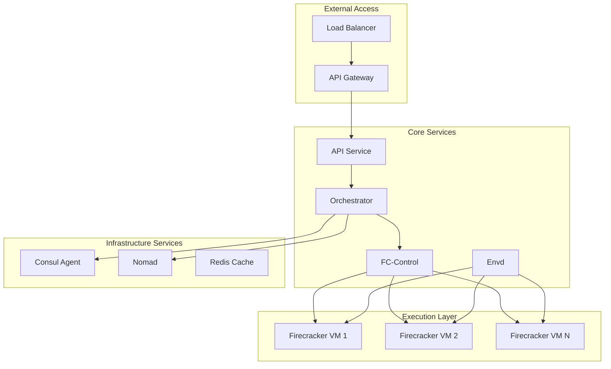
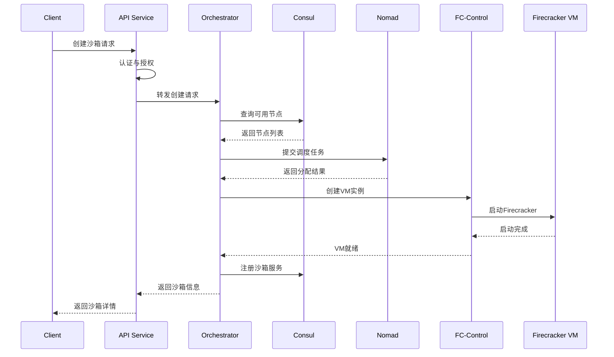
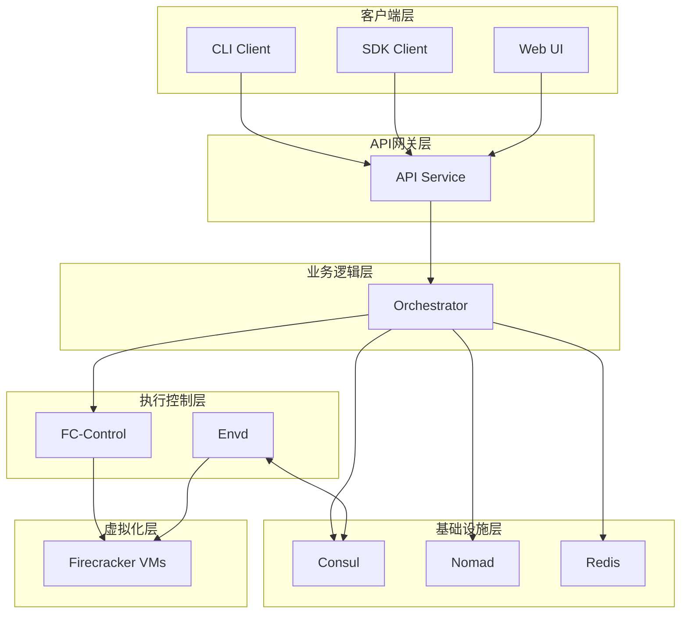
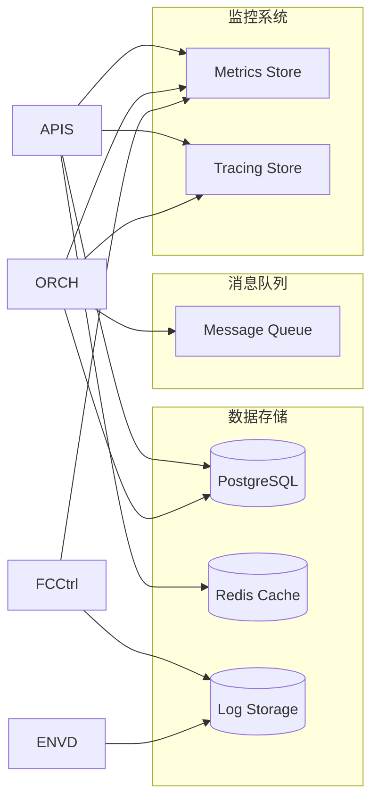

# E2B Infrastructure 项目总览

## 1. 定位与使命 (Positioning & Mission)

### 项目定位
E2B Infrastructure 是一个分布式代码执行平台的核心基础设施，负责管理和协调多个微服务组件，为用户提供安全、可扩展的代码沙箱服务。

### 核心问题
- 如何在大规模分布式环境中安全执行用户代码
- 如何协调多个微服务组件实现统一的沙箱管理
- 如何确保服务的高可用性和可扩展性
- 如何提供统一的API接口和服务发现机制

### 应用场景
- 代码执行即服务 (Code Execution as a Service)
- AI/ML 模型训练和推理环境
- CI/CD 流水线中的代码测试环境
- 在线编程教育和代码评测

### 能力边界
- **支持能力**: 分布式微服务架构、多语言运行时、资源隔离、服务发现
- **限制边界**: 依赖底层容器技术、需要集群管理支持、对网络延迟敏感

## 2. 设计思想与哲学基石 (Design Philosophy & Foundational Principles)

### 微服务架构哲学
- **服务解耦**: 每个组件专注单一职责，通过API通信
- **容错设计**: 服务间失败隔离，优雅降级处理
- **弹性扩展**: 根据负载动态调整服务实例

### 分布式协调原则
- **最终一致性**: 接受数据的短暂不一致，保证最终收敛
- **服务网格**: 通过统一的通信层管理服务间调用
- **观察性**: 全链路监控和分布式追踪

### 安全隔离设计
- **多层防护**: 网络、进程、文件系统多维度隔离
- **最小权限**: 每个服务仅获取必需的权限
- **零信任**: 服务间通信默认不信任，需要验证

## 3. 核心数据结构定义 (Core Data Structure Definitions)

### 服务拓扑结构


### 服务组件定义
```yaml
# 服务架构定义
services:
  orchestrator:
    role: "服务协调中心"
    responsibility: "沙箱生命周期管理、资源调度"
    
  api-service:
    role: "API网关"
    responsibility: "请求路由、认证授权、限流"
    
  fc-control:
    role: "虚拟机控制器"
    responsibility: "Firecracker VM 管理"
    
  envd:
    role: "环境守护进程"
    responsibility: "沙箱内部服务管理"
    
  consul:
    role: "服务发现"
    responsibility: "服务注册、配置管理、健康检查"
    
  nomad:
    role: "工作负载调度"
    responsibility: "任务调度、资源分配"
```

## 4. 核心接口与逻辑实现 (Core Interface & Logic)

### 服务交互接口
```go
// 沙箱管理接口
type SandboxManager interface {
    CreateSandbox(ctx context.Context, req *CreateSandboxRequest) (*Sandbox, error)
    GetSandbox(ctx context.Context, id string) (*Sandbox, error)
    ListSandboxes(ctx context.Context, filters ...Filter) ([]*Sandbox, error)
    DeleteSandbox(ctx context.Context, id string) error
    RestartSandbox(ctx context.Context, id string) error
}

// 服务发现接口
type ServiceDiscovery interface {
    RegisterService(ctx context.Context, service *ServiceInfo) error
    DeregisterService(ctx context.Context, serviceID string) error
    DiscoverServices(ctx context.Context, serviceName string) ([]*ServiceInfo, error)
    HealthCheck(ctx context.Context, serviceID string) (*HealthStatus, error)
}

// 资源调度接口
type ResourceScheduler interface {
    ScheduleTask(ctx context.Context, task *Task) (*Allocation, error)
    GetAllocation(ctx context.Context, allocID string) (*Allocation, error)
    StopAllocation(ctx context.Context, allocID string) error
    ListAllocations(ctx context.Context, filters ...Filter) ([]*Allocation, error)
}
```

### 关键业务流程


## 5. 依赖关系与交互 (Dependencies & Interactions)

### 服务依赖图


### 数据流架构


### 关键交互模式

#### 1. 同步调用模式
- API Service ↔ Orchestrator: HTTP/gRPC 同步调用
- Orchestrator ↔ Consul: HTTP API 调用
- FC-Control ↔ Firecracker: Unix Socket 通信

#### 2. 异步消息模式
- Orchestrator → Message Queue: 异步任务分发
- Envd → Consul: 健康检查和状态上报
- 各服务 → Monitoring: 指标和日志上报

#### 3. 事件驱动模式
- VM状态变化 → 事件总线 → 订阅服务
- 资源使用告警 → 通知系统 → 管理员
- 服务发现变化 → 配置更新 → 相关服务

## 总结

E2B Infrastructure 通过微服务架构实现了高度可扩展的代码执行平台。每个组件都有明确的职责边界，通过标准化的接口进行通信。整体架构遵循云原生设计原则，支持水平扩展和故障恢复，为上层应用提供了稳定可靠的基础设施服务。

下一步将深入分析各个核心模块的具体实现细节。