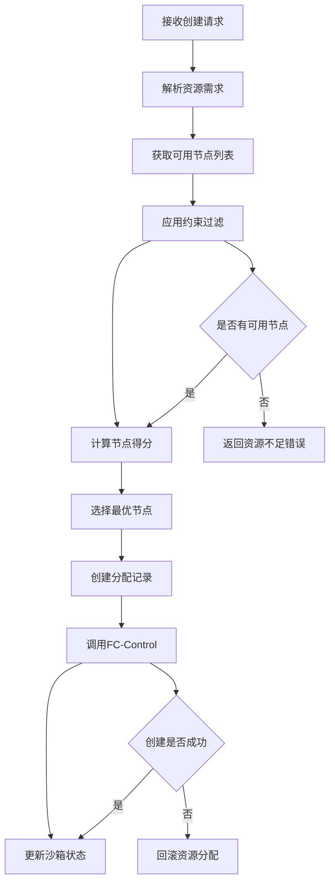
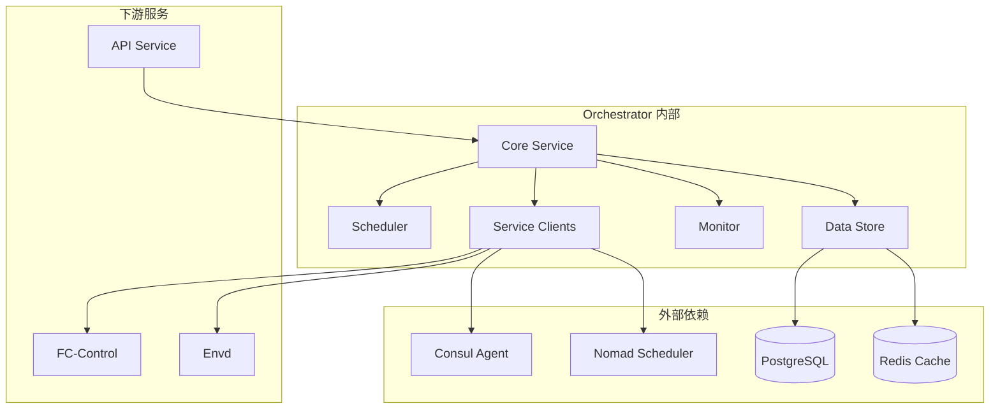
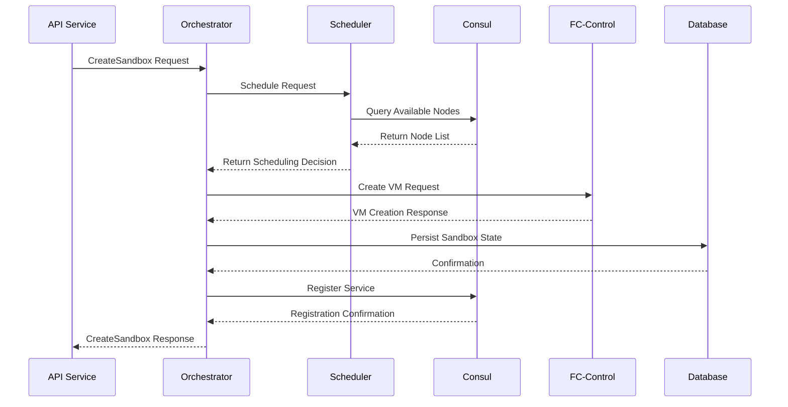

# E2B Orchestrator 模块深度分析

## 1. 定位与使命 (Positioning & Mission)

### 模块定位
Orchestrator 是 E2B 基础设施的核心大脑，负责协调整个分布式系统中各个服务的运作，是沙箱生命周期管理的中央控制中心。

### 核心问题
- 如何统一管理分布式环境中的多个沙箱实例
- 如何协调不同服务间的复杂交互和状态同步
- 如何实现智能的资源调度和负载均衡
- 如何保证系统的高可用性和故障恢复能力

### 应用场景
- 沙箱实例的创建、销毁和状态管理
- 跨服务的工作流编排和任务调度
- 系统资源的动态分配和优化
- 服务健康监控和故障自动处理

### 能力边界
- **核心能力**: 服务协调、状态管理、资源调度、故障恢复
- **依赖限制**: 需要 Consul/Nomad 支持、依赖底层网络通信、受限于硬件资源

## 2. 设计思想与哲学基石 (Design Philosophy & Foundational Principles)

### 中央协调哲学
- **统一调度**: 所有资源分配决策由中心化组件做出
- **状态一致性**: 维护全局状态视图，确保数据一致性
- **事件驱动**: 基于事件响应模式处理系统状态变化

### 弹性系统设计
- **优雅降级**: 在部分服务不可用时提供基础功能
- **快速恢复**: 故障检测和自动恢复机制
- **负载均衡**: 智能分发请求到最优节点

### 可观测性原则
- **全链路追踪**: 记录请求在系统中的完整路径
- **指标收集**: 实时监控系统性能和健康状态
- **结构化日志**: 便于问题诊断和系统分析

## 3. 核心数据结构定义 (Core Data Structure Definitions)

### 沙箱状态管理
```go
// 沙箱生命周期状态
type SandboxState int32

const (
    SandboxStatePending SandboxState = iota
    SandboxStateCreating
    SandboxStateRunning
    SandboxStateStopping
    SandboxStateStopped
    SandboxStateError
)

// 沙箱元数据结构
type Sandbox struct {
    ID          string                 `json:"id"`
    UserID      string                 `json:"user_id"`
    Template    string                 `json:"template"`
    State       SandboxState           `json:"state"`
    NodeID      string                 `json:"node_id"`
    Resources   *ResourceAllocation    `json:"resources"`
    Network     *NetworkConfig         `json:"network"`
    Metadata    map[string]string      `json:"metadata"`
    CreatedAt   time.Time             `json:"created_at"`
    UpdatedAt   time.Time             `json:"updated_at"`
}

// 资源分配结构
type ResourceAllocation struct {
    CPU       int64  `json:"cpu"`        // CPU 核心数 (millicore)
    Memory    int64  `json:"memory"`     // 内存大小 (bytes)
    Disk      int64  `json:"disk"`       // 磁盘大小 (bytes)
    Network   int64  `json:"network"`    // 网络带宽 (bps)
}
```

### 节点管理结构
```go
// 集群节点信息
type Node struct {
    ID              string                 `json:"id"`
    Name            string                 `json:"name"`
    Address         string                 `json:"address"`
    State           NodeState              `json:"state"`
    Resources       *NodeResources         `json:"resources"`
    Allocations     []string               `json:"allocations"`
    Tags            map[string]string      `json:"tags"`
    LastHeartbeat   time.Time             `json:"last_heartbeat"`
}

// 节点资源信息
type NodeResources struct {
    Total      *ResourceAllocation  `json:"total"`
    Used       *ResourceAllocation  `json:"used"`
    Available  *ResourceAllocation  `json:"available"`
}
```

### 调度决策结构
```go
// 调度策略配置
type SchedulingPolicy struct {
    Strategy    SchedulingStrategy     `json:"strategy"`
    Constraints []Constraint           `json:"constraints"`
    Preferences []Preference           `json:"preferences"`
}

// 调度决策结果
type SchedulingDecision struct {
    SandboxID    string      `json:"sandbox_id"`
    SelectedNode string      `json:"selected_node"`
    Score        float64     `json:"score"`
    Reason       string      `json:"reason"`
    Alternatives []NodeScore `json:"alternatives"`
}
```

## 4. 核心接口与逻辑实现 (Core Interface & Logic)

### 主要服务接口
```go
// Orchestrator 主服务接口
type OrchestratorService interface {
    // 沙箱生命周期管理
    CreateSandbox(ctx context.Context, req *CreateSandboxRequest) (*CreateSandboxResponse, error)
    GetSandbox(ctx context.Context, req *GetSandboxRequest) (*GetSandboxResponse, error)
    ListSandboxes(ctx context.Context, req *ListSandboxesRequest) (*ListSandboxesResponse, error)
    DeleteSandbox(ctx context.Context, req *DeleteSandboxRequest) (*DeleteSandboxResponse, error)
    RestartSandbox(ctx context.Context, req *RestartSandboxRequest) (*RestartSandboxResponse, error)
    
    // 节点管理
    RegisterNode(ctx context.Context, req *RegisterNodeRequest) (*RegisterNodeResponse, error)
    GetNodeStatus(ctx context.Context, req *GetNodeStatusRequest) (*GetNodeStatusResponse, error)
    ListNodes(ctx context.Context, req *ListNodesRequest) (*ListNodesResponse, error)
    
    // 资源管理
    GetResourceUsage(ctx context.Context, req *GetResourceUsageRequest) (*GetResourceUsageResponse, error)
    GetSystemMetrics(ctx context.Context, req *GetSystemMetricsRequest) (*GetSystemMetricsResponse, error)
}
```

### 调度算法实现


### 核心业务流程
```go
// 沙箱创建的完整流程
func (o *OrchestratorService) CreateSandbox(ctx context.Context, req *CreateSandboxRequest) (*CreateSandboxResponse, error) {
    // 1. 验证请求参数
    if err := o.validateCreateRequest(req); err != nil {
        return nil, status.Errorf(codes.InvalidArgument, "invalid request: %v", err)
    }
    
    // 2. 生成沙箱ID和初始状态
    sandbox := &Sandbox{
        ID:        generateSandboxID(),
        UserID:    req.UserID,
        Template:  req.Template,
        State:     SandboxStatePending,
        CreatedAt: time.Now(),
    }
    
    // 3. 调度算法选择节点
    decision, err := o.scheduler.Schedule(ctx, &SchedulingRequest{
        Resources:   req.Resources,
        Constraints: req.Constraints,
    })
    if err != nil {
        return nil, status.Errorf(codes.ResourceExhausted, "scheduling failed: %v", err)
    }
    
    // 4. 更新沙箱状态为创建中
    sandbox.State = SandboxStateCreating
    sandbox.NodeID = decision.SelectedNode
    
    // 5. 调用FC-Control创建实例
    createReq := &fccontrol.CreateVMRequest{
        SandboxID: sandbox.ID,
        Template:  sandbox.Template,
        NodeID:    sandbox.NodeID,
        Resources: req.Resources,
    }
    
    vmResp, err := o.fcControlClient.CreateVM(ctx, createReq)
    if err != nil {
        // 回滚状态
        sandbox.State = SandboxStateError
        o.sandboxStore.Update(ctx, sandbox)
        return nil, status.Errorf(codes.Internal, "VM creation failed: %v", err)
    }
    
    // 6. 更新沙箱状态和网络信息
    sandbox.State = SandboxStateRunning
    sandbox.Network = &NetworkConfig{
        IP:   vmResp.IP,
        Port: vmResp.Port,
    }
    sandbox.UpdatedAt = time.Now()
    
    // 7. 注册到服务发现
    if err := o.consulClient.RegisterService(ctx, &consul.ServiceRegistration{
        ID:      sandbox.ID,
        Name:    "e2b-sandbox",
        Address: sandbox.Network.IP,
        Port:    int(sandbox.Network.Port),
        Tags:    []string{sandbox.Template, sandbox.UserID},
    }); err != nil {
        log.Warnf("failed to register sandbox in consul: %v", err)
    }
    
    // 8. 保存到数据库
    if err := o.sandboxStore.Create(ctx, sandbox); err != nil {
        return nil, status.Errorf(codes.Internal, "failed to persist sandbox: %v", err)
    }
    
    return &CreateSandboxResponse{
        Sandbox: sandbox,
    }, nil
}
```

## 5. 依赖关系与交互 (Dependencies & Interactions)

### 服务依赖图


### 数据流分析


### 关键交互模式

#### 1. 事件驱动架构
```go
// 事件类型定义
type EventType string

const (
    EventSandboxCreated   EventType = "sandbox.created"
    EventSandboxDeleted   EventType = "sandbox.deleted"
    EventSandboxError     EventType = "sandbox.error"
    EventNodeJoined       EventType = "node.joined"
    EventNodeLeft         EventType = "node.left"
    EventResourceExhausted EventType = "resource.exhausted"
)

// 事件处理器
type EventHandler interface {
    HandleEvent(ctx context.Context, event *Event) error
}

// 事件总线
type EventBus struct {
    handlers map[EventType][]EventHandler
    mu       sync.RWMutex
}
```

#### 2. 健康检查机制
```go
// 健康检查接口
type HealthChecker interface {
    Check(ctx context.Context) (*HealthStatus, error)
}

// 系统健康状态
type HealthStatus struct {
    Status     HealthStatusCode       `json:"status"`
    Checks     map[string]CheckResult `json:"checks"`
    Timestamp  time.Time             `json:"timestamp"`
}

// 定期健康检查
func (o *OrchestratorService) runHealthChecks(ctx context.Context) {
    ticker := time.NewTicker(30 * time.Second)
    defer ticker.Stop()
    
    for {
        select {
        case <-ticker.C:
            o.performHealthCheck(ctx)
        case <-ctx.Done():
            return
        }
    }
}
```

#### 3. 状态同步机制
- **定期状态同步**: 每30秒向Consul同步一次沙箱状态
- **事件驱动同步**: 状态变更时立即触发同步
- **故障恢复同步**: 检测到不一致时执行全量同步

## 性能优化策略

### 1. 缓存策略
- Redis 缓存热点数据（活跃沙箱信息）
- 本地缓存节点资源信息（5分钟TTL）
- 分布式锁防止并发创建冲突

### 2. 调度优化
- 预计算节点得分，减少实时计算开销
- 批量处理创建请求，提高吞吐量
- 智能预测资源需求，预留容量

### 3. 故障处理
- 断路器模式防止级联故障
- 异步重试机制处理临时故障
- 优雅降级，在部分功能不可用时提供核心服务

## 总结

Orchestrator 作为 E2B 基础设施的核心协调者，通过精心设计的调度算法、状态管理机制和事件驱动架构，实现了高效的分布式沙箱管理。其模块化设计保证了系统的可扩展性和可维护性，为整个平台的稳定运行提供了坚实基础。