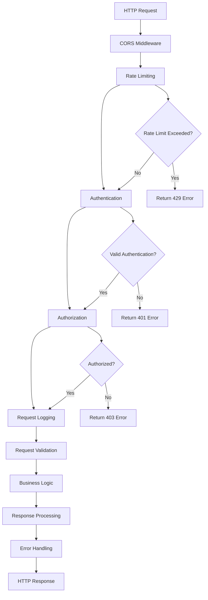
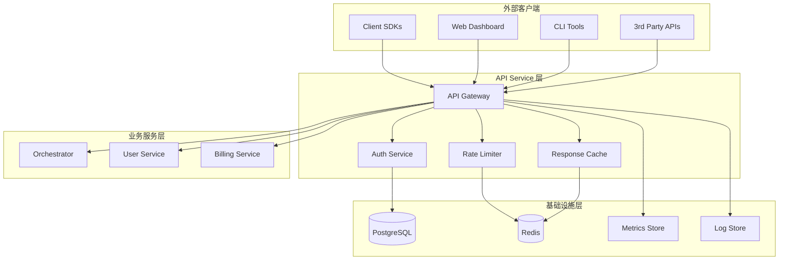
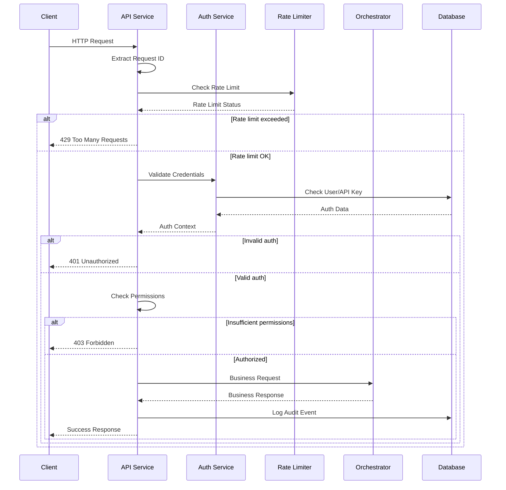

# E2B API Service 模块深度分析

## 1. 定位与使命 (Positioning & Mission)

### 模块定位
API Service 是 E2B 基础设施的门户和守护者，负责处理所有外部请求，提供统一的 RESTful API 接口，并确保系统的安全性、稳定性和可用性。

### 核心问题
- 如何为分布式微服务系统提供统一的API入口
- 如何实现高效的请求路由和负载均衡
- 如何确保API的安全性和访问控制
- 如何处理大量并发请求并保证响应性能

### 应用场景
- 客户端SDK的后端API服务
- 第三方集成的标准化接口
- Web Dashboard的数据API
- 管理工具的控制接口

### 能力边界
- **核心能力**: HTTP/gRPC 服务、认证授权、请求路由、限流熔断
- **依赖限制**: 依赖下游微服务、受限于网络延迟、需要持久化存储

## 2. 设计思想与哲学基石 (Design Philosophy & Foundational Principles)

### API网关哲学
- **统一入口**: 所有外部请求通过单一入口进入系统
- **协议转换**: 支持多种通信协议（HTTP、WebSocket、gRPC）
- **服务解耦**: API层与业务逻辑层完全解耦

### 安全第一原则
- **深度防护**: 多层安全检查，从网络到应用层
- **最小权限**: 每个请求仅获得完成任务所需的最小权限
- **审计透明**: 所有API调用都有完整的审计日志

### 高可用设计
- **无状态服务**: API服务本身不保存状态，易于水平扩展
- **优雅降级**: 在下游服务不可用时提供有限功能
- **快速失败**: 及时发现问题并快速响应

## 3. 核心数据结构定义 (Core Data Structure Definitions)

### 请求响应结构
```go
// 通用API响应结构
type APIResponse struct {
    Success   bool        `json:"success"`
    Data      interface{} `json:"data,omitempty"`
    Error     *APIError   `json:"error,omitempty"`
    RequestID string      `json:"request_id"`
    Timestamp time.Time   `json:"timestamp"`
}

// API错误结构
type APIError struct {
    Code    string `json:"code"`
    Message string `json:"message"`
    Details string `json:"details,omitempty"`
}

// 分页响应结构
type PaginatedResponse struct {
    Items      interface{}       `json:"items"`
    Pagination *PaginationInfo   `json:"pagination"`
}

type PaginationInfo struct {
    Page       int `json:"page"`
    PageSize   int `json:"page_size"`
    Total      int `json:"total"`
    TotalPages int `json:"total_pages"`
}
```

### 认证授权结构
```go
// 认证上下文
type AuthContext struct {
    UserID      string            `json:"user_id"`
    TeamID      string            `json:"team_id,omitempty"`
    APIKey      string            `json:"api_key,omitempty"`
    Permissions []string          `json:"permissions"`
    Metadata    map[string]string `json:"metadata"`
    ExpiresAt   time.Time         `json:"expires_at"`
}

// API密钥结构
type APIKey struct {
    ID          string    `json:"id"`
    Name        string    `json:"name"`
    Key         string    `json:"key"`         // 哈希后的密钥
    UserID      string    `json:"user_id"`
    Permissions []string  `json:"permissions"`
    Active      bool      `json:"active"`
    CreatedAt   time.Time `json:"created_at"`
    ExpiresAt   *time.Time `json:"expires_at,omitempty"`
    LastUsedAt  *time.Time `json:"last_used_at,omitempty"`
}
```

### 限流和监控结构
```go
// 限流配置
type RateLimitConfig struct {
    Enabled     bool          `json:"enabled"`
    Window      time.Duration `json:"window"`
    MaxRequests int           `json:"max_requests"`
    Strategy    string        `json:"strategy"` // "fixed-window" | "sliding-window" | "token-bucket"
}

// 请求指标
type RequestMetrics struct {
    RequestID     string        `json:"request_id"`
    Method        string        `json:"method"`
    Path          string        `json:"path"`
    StatusCode    int           `json:"status_code"`
    Duration      time.Duration `json:"duration"`
    UserID        string        `json:"user_id,omitempty"`
    UserAgent     string        `json:"user_agent,omitempty"`
    RemoteAddr    string        `json:"remote_addr"`
    Timestamp     time.Time     `json:"timestamp"`
}
```

## 4. 核心接口与逻辑实现 (Core Interface & Logic)

### 主要服务接口
```go
// API服务主接口
type APIService interface {
    // 沙箱管理API
    CreateSandbox(ctx context.Context, req *CreateSandboxRequest) (*CreateSandboxResponse, error)
    GetSandbox(ctx context.Context, req *GetSandboxRequest) (*GetSandboxResponse, error)
    ListSandboxes(ctx context.Context, req *ListSandboxesRequest) (*ListSandboxesResponse, error)
    DeleteSandbox(ctx context.Context, req *DeleteSandboxRequest) (*DeleteSandboxResponse, error)
    
    // 用户管理API
    CreateUser(ctx context.Context, req *CreateUserRequest) (*CreateUserResponse, error)
    GetUser(ctx context.Context, req *GetUserRequest) (*GetUserResponse, error)
    UpdateUser(ctx context.Context, req *UpdateUserRequest) (*UpdateUserResponse, error)
    
    // API密钥管理
    CreateAPIKey(ctx context.Context, req *CreateAPIKeyRequest) (*CreateAPIKeyResponse, error)
    ListAPIKeys(ctx context.Context, req *ListAPIKeysRequest) (*ListAPIKeysResponse, error)
    RevokeAPIKey(ctx context.Context, req *RevokeAPIKeyRequest) (*RevokeAPIKeyResponse, error)
    
    // 系统监控API
    GetSystemStatus(ctx context.Context, req *GetSystemStatusRequest) (*GetSystemStatusResponse, error)
    GetMetrics(ctx context.Context, req *GetMetricsRequest) (*GetMetricsResponse, error)
}
```

### 中间件系统


### 核心业务流程实现
```go
// HTTP服务器启动和中间件配置
func (s *APIService) setupRoutes() *gin.Engine {
    r := gin.New()
    
    // 全局中间件
    r.Use(gin.Logger())
    r.Use(gin.Recovery())
    r.Use(corsMiddleware())
    r.Use(rateLimitMiddleware(s.rateLimiter))
    r.Use(metricsMiddleware(s.metricsCollector))
    
    // API版本组
    v1 := r.Group("/api/v1")
    v1.Use(authMiddleware(s.authService))
    
    // 沙箱管理端点
    sandboxGroup := v1.Group("/sandboxes")
    {
        sandboxGroup.POST("", s.handleCreateSandbox)
        sandboxGroup.GET("/:id", s.handleGetSandbox)
        sandboxGroup.GET("", s.handleListSandboxes)
        sandboxGroup.DELETE("/:id", s.handleDeleteSandbox)
        sandboxGroup.POST("/:id/restart", s.handleRestartSandbox)
    }
    
    // 用户管理端点
    userGroup := v1.Group("/users")
    {
        userGroup.GET("/me", s.handleGetCurrentUser)
        userGroup.PUT("/me", s.handleUpdateCurrentUser)
        userGroup.GET("/me/api-keys", s.handleListAPIKeys)
        userGroup.POST("/me/api-keys", s.handleCreateAPIKey)
        userGroup.DELETE("/me/api-keys/:id", s.handleRevokeAPIKey)
    }
    
    // 系统状态端点
    systemGroup := v1.Group("/system")
    {
        systemGroup.GET("/status", s.handleSystemStatus)
        systemGroup.GET("/metrics", s.handleMetrics)
    }
    
    return r
}

// 沙箱创建处理器
func (s *APIService) handleCreateSandbox(c *gin.Context) {
    var req CreateSandboxRequest
    if err := c.ShouldBindJSON(&req); err != nil {
        s.respondError(c, http.StatusBadRequest, "INVALID_REQUEST", err.Error())
        return
    }
    
    // 验证用户权限
    authCtx := getAuthContext(c)
    if !hasPermission(authCtx, "sandbox:create") {
        s.respondError(c, http.StatusForbidden, "INSUFFICIENT_PERMISSIONS", 
            "User does not have permission to create sandboxes")
        return
    }
    
    // 设置用户ID
    req.UserID = authCtx.UserID
    
    // 调用Orchestrator服务
    resp, err := s.orchestratorClient.CreateSandbox(c.Request.Context(), &req)
    if err != nil {
        s.handleServiceError(c, "orchestrator", err)
        return
    }
    
    // 记录操作日志
    s.auditLogger.Log(c.Request.Context(), &AuditEvent{
        Type:      "sandbox.create",
        UserID:    authCtx.UserID,
        Resource:  resp.Sandbox.ID,
        Action:    "create",
        Timestamp: time.Now(),
        Metadata: map[string]string{
            "template": req.Template,
            "node_id":  resp.Sandbox.NodeID,
        },
    })
    
    s.respondSuccess(c, http.StatusCreated, resp)
}
```

### 认证授权实现
```go
// 认证中间件
func authMiddleware(authService AuthService) gin.HandlerFunc {
    return func(c *gin.Context) {
        // 提取认证信息
        authHeader := c.GetHeader("Authorization")
        if authHeader == "" {
            c.AbortWithStatusJSON(http.StatusUnauthorized, APIResponse{
                Success: false,
                Error: &APIError{
                    Code:    "MISSING_AUTHENTICATION",
                    Message: "Authorization header is required",
                },
                RequestID: getRequestID(c),
                Timestamp: time.Now(),
            })
            return
        }
        
        var authCtx *AuthContext
        var err error
        
        // 支持多种认证方式
        if strings.HasPrefix(authHeader, "Bearer ") {
            token := strings.TrimPrefix(authHeader, "Bearer ")
            authCtx, err = authService.ValidateJWT(c.Request.Context(), token)
        } else if strings.HasPrefix(authHeader, "ApiKey ") {
            apiKey := strings.TrimPrefix(authHeader, "ApiKey ")
            authCtx, err = authService.ValidateAPIKey(c.Request.Context(), apiKey)
        } else {
            err = errors.New("unsupported authentication scheme")
        }
        
        if err != nil {
            c.AbortWithStatusJSON(http.StatusUnauthorized, APIResponse{
                Success: false,
                Error: &APIError{
                    Code:    "INVALID_AUTHENTICATION",
                    Message: "Invalid authentication credentials",
                },
                RequestID: getRequestID(c),
                Timestamp: time.Now(),
            })
            return
        }
        
        // 将认证上下文存储到请求中
        c.Set("auth_context", authCtx)
        c.Next()
    }
}

// 权限检查函数
func hasPermission(authCtx *AuthContext, permission string) bool {
    for _, p := range authCtx.Permissions {
        if p == permission || p == "*" {
            return true
        }
        
        // 支持通配符权限
        if matched, _ := filepath.Match(p, permission); matched {
            return true
        }
    }
    return false
}
```

## 5. 依赖关系与交互 (Dependencies & Interactions)

### 服务依赖图


### API交互流程


### 错误处理策略
```go
// 统一错误处理
func (s *APIService) handleServiceError(c *gin.Context, serviceName string, err error) {
    requestID := getRequestID(c)
    
    // 记录错误日志
    s.logger.WithFields(logrus.Fields{
        "request_id": requestID,
        "service":    serviceName,
        "error":      err.Error(),
    }).Error("Service call failed")
    
    var statusCode int
    var errorCode string
    var message string
    
    // 根据错误类型映射HTTP状态码
    switch {
    case status.Code(err) == codes.NotFound:
        statusCode = http.StatusNotFound
        errorCode = "RESOURCE_NOT_FOUND"
        message = "The requested resource was not found"
        
    case status.Code(err) == codes.PermissionDenied:
        statusCode = http.StatusForbidden
        errorCode = "ACCESS_DENIED"
        message = "Access to the resource is denied"
        
    case status.Code(err) == codes.ResourceExhausted:
        statusCode = http.StatusServiceUnavailable
        errorCode = "RESOURCE_EXHAUSTED"
        message = "System resources are temporarily unavailable"
        
    case status.Code(err) == codes.InvalidArgument:
        statusCode = http.StatusBadRequest
        errorCode = "INVALID_ARGUMENT"
        message = "Request contains invalid arguments"
        
    default:
        statusCode = http.StatusInternalServerError
        errorCode = "INTERNAL_ERROR"
        message = "An internal server error occurred"
    }
    
    s.respondError(c, statusCode, errorCode, message)
}
```

## 性能优化策略

### 1. 缓存优化
```go
// 多层缓存策略
type CacheManager struct {
    local  cache.Cache        // 本地内存缓存
    redis  *redis.Client      // Redis分布式缓存
    config *CacheConfig
}

// 缓存配置
type CacheConfig struct {
    LocalTTL   time.Duration  `yaml:"local_ttl"`
    RedisTTL   time.Duration  `yaml:"redis_ttl"`
    MaxMemory  int64          `yaml:"max_memory"`
}

// 智能缓存策略
func (cm *CacheManager) Get(key string) (interface{}, bool) {
    // L1: 本地缓存
    if value, found := cm.local.Get(key); found {
        return value, true
    }
    
    // L2: Redis缓存
    if value, err := cm.redis.Get(key).Result(); err == nil {
        // 写入本地缓存
        cm.local.Set(key, value, cm.config.LocalTTL)
        return value, true
    }
    
    return nil, false
}
```

### 2. 连接池优化
```go
// HTTP客户端连接池
type HTTPClientPool struct {
    clients map[string]*http.Client
    mu      sync.RWMutex
}

func (p *HTTPClientPool) getClient(service string) *http.Client {
    p.mu.RLock()
    client, exists := p.clients[service]
    p.mu.RUnlock()
    
    if !exists {
        p.mu.Lock()
        defer p.mu.Unlock()
        
        // 双重检查
        if client, exists = p.clients[service]; !exists {
            client = &http.Client{
                Timeout: 30 * time.Second,
                Transport: &http.Transport{
                    MaxIdleConns:        100,
                    MaxIdleConnsPerHost: 10,
                    IdleConnTimeout:     30 * time.Second,
                    DisableCompression:  false,
                },
            }
            p.clients[service] = client
        }
    }
    
    return client
}
```

### 3. 限流策略
- **滑动窗口**: 精确控制时间窗口内的请求数量
- **令牌桶**: 支持突发流量，平滑限制长期速率
- **分布式限流**: 多实例间共享限流计数器

## 监控和观测

### 1. 指标收集
- **请求指标**: QPS、响应时间、错误率
- **业务指标**: 用户活跃度、API调用分布
- **系统指标**: CPU、内存、网络、磁盘使用率

### 2. 分布式追踪
- **请求追踪**: 记录请求在各服务间的调用链路
- **性能分析**: 识别性能瓶颈和优化机会
- **故障定位**: 快速定位问题根因

## 总结

API Service 作为 E2B 基础设施的前门，承担着流量入口、安全防护和服务编排的重要职责。通过精心设计的中间件系统、多层缓存策略和全面的监控体系，为整个平台提供了稳定、安全、高性能的API服务。其模块化的架构设计保证了系统的可扩展性，为后续功能扩展奠定了坚实基础。