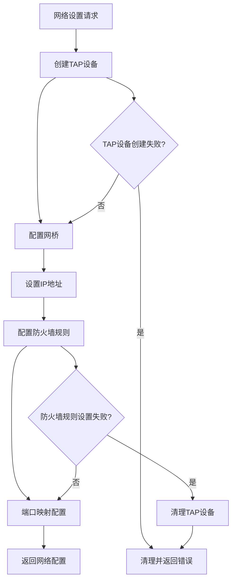
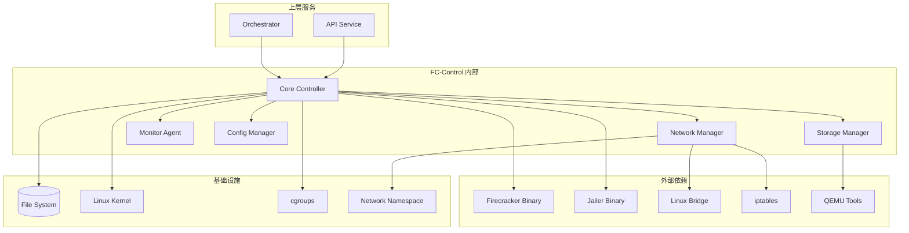
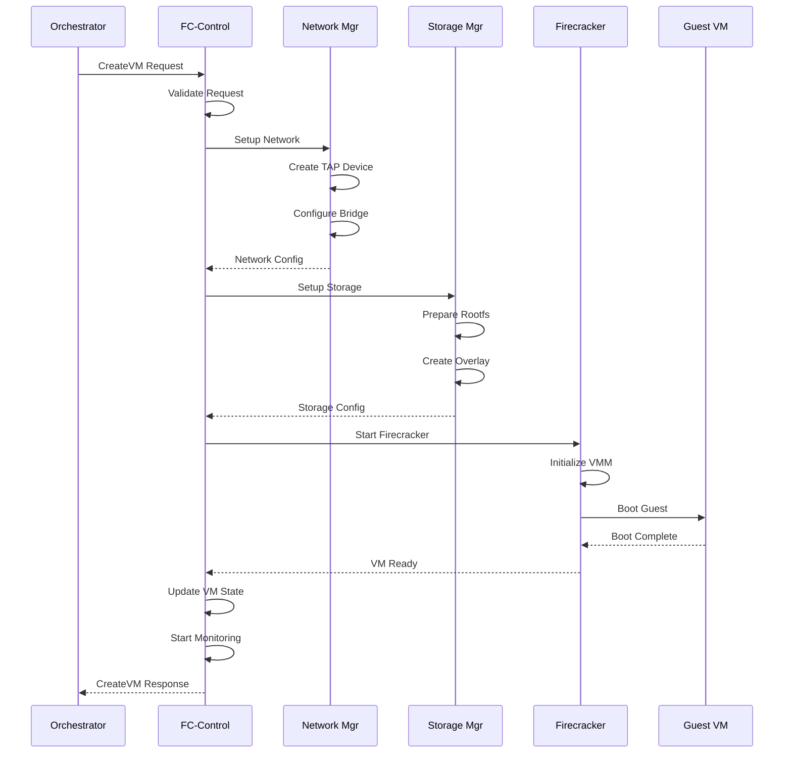

# E2B FC-Control 模块深度分析

## 1. 定位与使命 (Positioning & Mission)

### 模块定位
FC-Control 是 E2B 基础设施中负责 Firecracker 微虚拟机生命周期管理的核心控制器，是连接上层业务逻辑与底层虚拟化技术的关键桥梁。

### 核心问题
- 如何高效管理大量 Firecracker 微虚拟机实例
- 如何实现虚拟机的快速启动、停止和资源动态调整
- 如何确保虚拟机之间的安全隔离和资源限制
- 如何监控虚拟机状态并处理异常情况

### 应用场景
- 代码执行沙箱的虚拟机创建和销毁
- 虚拟机模板管理和快照操作
- 网络配置和端口映射管理
- 虚拟机性能监控和资源使用统计

### 能力边界
- **核心能力**: VM生命周期管理、资源配置、网络管理、监控告警
- **技术限制**: 依赖Firecracker VMM、需要特权操作、受限于宿主机资源

## 2. 设计思想与哲学基石 (Design Philosophy & Foundational Principles)

### 轻量级虚拟化哲学
- **微虚拟机**: 使用Firecracker实现极轻量级的虚拟化
- **快速启动**: 毫秒级虚拟机启动时间
- **资源效率**: 最小化资源开销和内存占用

### 云原生设计
- **容器化部署**: FC-Control本身运行在容器中
- **声明式配置**: 通过配置文件描述虚拟机期望状态
- **自愈能力**: 自动检测和恢复异常虚拟机

### 安全隔离原则
- **进程隔离**: 每个虚拟机运行在独立的进程空间
- **网络隔离**: 虚拟网络设备和防火墙规则
- **文件系统隔离**: 独立的rootfs和overlay文件系统

## 3. 核心数据结构定义 (Core Data Structure Definitions)

### 虚拟机配置结构
```go
// Firecracker虚拟机配置
type FirecrackerConfig struct {
    VMID       string            `json:"vm_id"`
    SocketPath string            `json:"socket_path"`
    
    // CPU和内存配置
    VCPUCount  int64             `json:"vcpu_count"`
    MemSizeMib int64             `json:"mem_size_mib"`
    
    // 内核和根文件系统
    KernelImagePath string        `json:"kernel_image_path"`
    KernelArgs      string        `json:"kernel_args"`
    RootfsPath      string        `json:"rootfs_path"`
    
    // 网络配置
    NetworkInterfaces []NetworkInterface `json:"network_interfaces"`
    
    // 块设备配置
    BlockDevices []BlockDevice     `json:"block_devices"`
    
    // 资源限制
    RateLimiters []RateLimiter     `json:"rate_limiters"`
    
    // 日志配置
    LoggerConfig *LoggerConfig     `json:"logger,omitempty"`
    
    // 指标配置
    MetricsConfig *MetricsConfig   `json:"metrics,omitempty"`
}

// 网络接口配置
type NetworkInterface struct {
    IfaceID     string `json:"iface_id"`
    GuestMAC    string `json:"guest_mac,omitempty"`
    HostDevName string `json:"host_dev_name"`
    TapDevice   string `json:"tap_device"`
}

// 块设备配置
type BlockDevice struct {
    DriveID      string `json:"drive_id"`
    PathOnHost   string `json:"path_on_host"`
    IsRootDevice bool   `json:"is_root_device"`
    IsReadOnly   bool   `json:"is_read_only"`
    
    // IO限制
    RateLimiter *RateLimiter `json:"rate_limiter,omitempty"`
}

// 速率限制器
type RateLimiter struct {
    ID                string                 `json:"id"`
    BandwidthConfig   *TokenBucketConfig     `json:"bandwidth,omitempty"`
    OpsConfig         *TokenBucketConfig     `json:"ops,omitempty"`
}

type TokenBucketConfig struct {
    Size       int64 `json:"size"`
    RefillTime int64 `json:"refill_time"`
}
```

### 虚拟机状态管理
```go
// 虚拟机状态枚举
type VMState int32

const (
    VMStateUnknown VMState = iota
    VMStateCreating
    VMStateStarting
    VMStateRunning
    VMStatePausing
    VMStatePaused
    VMStateStopping
    VMStateStopped
    VMStateError
)

// 虚拟机实例结构
type VMInstance struct {
    ID           string                 `json:"id"`
    SandboxID    string                 `json:"sandbox_id"`
    State        VMState                `json:"state"`
    Config       *FirecrackerConfig     `json:"config"`
    
    // 运行时信息
    PID          int                    `json:"pid,omitempty"`
    SocketPath   string                 `json:"socket_path"`
    LogPath      string                 `json:"log_path"`
    MetricsPath  string                 `json:"metrics_path"`
    
    // 网络信息
    IPAddress    string                 `json:"ip_address,omitempty"`
    PortMappings []PortMapping          `json:"port_mappings"`
    
    // 资源使用情况
    Resources    *ResourceUsage         `json:"resources,omitempty"`
    
    // 时间戳
    CreatedAt    time.Time              `json:"created_at"`
    StartedAt    *time.Time             `json:"started_at,omitempty"`
    StoppedAt    *time.Time             `json:"stopped_at,omitempty"`
    
    // 元数据
    Labels       map[string]string      `json:"labels"`
    Annotations  map[string]string      `json:"annotations"`
}

// 端口映射
type PortMapping struct {
    HostPort  int    `json:"host_port"`
    GuestPort int    `json:"guest_port"`
    Protocol  string `json:"protocol"` // "tcp" or "udp"
}

// 资源使用统计
type ResourceUsage struct {
    CPU     *CPUUsage     `json:"cpu,omitempty"`
    Memory  *MemoryUsage  `json:"memory,omitempty"`
    Network *NetworkUsage `json:"network,omitempty"`
    Disk    *DiskUsage    `json:"disk,omitempty"`
}
```

## 4. 核心接口与逻辑实现 (Core Interface & Logic)

### 主要服务接口
```go
// FC-Control主服务接口
type FCControlService interface {
    // 虚拟机生命周期管理
    CreateVM(ctx context.Context, req *CreateVMRequest) (*CreateVMResponse, error)
    StartVM(ctx context.Context, req *StartVMRequest) (*StartVMResponse, error)
    StopVM(ctx context.Context, req *StopVMRequest) (*StopVMResponse, error)
    PauseVM(ctx context.Context, req *PauseVMRequest) (*PauseVMResponse, error)
    ResumeVM(ctx context.Context, req *ResumeVMRequest) (*ResumeVMResponse, error)
    DeleteVM(ctx context.Context, req *DeleteVMRequest) (*DeleteVMResponse, error)
    
    // 虚拟机信息查询
    GetVM(ctx context.Context, req *GetVMRequest) (*GetVMResponse, error)
    ListVMs(ctx context.Context, req *ListVMsRequest) (*ListVMsResponse, error)
    
    // 虚拟机操作
    UpdateVMResources(ctx context.Context, req *UpdateVMResourcesRequest) (*UpdateVMResourcesResponse, error)
    CreateVMSnapshot(ctx context.Context, req *CreateSnapshotRequest) (*CreateSnapshotResponse, error)
    RestoreVMSnapshot(ctx context.Context, req *RestoreSnapshotRequest) (*RestoreSnapshotResponse, error)
    
    // 监控和指标
    GetVMMetrics(ctx context.Context, req *GetVMMetricsRequest) (*GetVMMetricsResponse, error)
    StreamVMLogs(ctx context.Context, req *StreamVMLogsRequest) (VMLogStream, error)
}
```

### Firecracker交互实现
```go
// Firecracker VMM控制器
type FirecrackerController struct {
    config         *ControllerConfig
    vmInstances    map[string]*VMInstance
    vmMutex        sync.RWMutex
    
    // Firecracker二进制路径
    firecrackerBin string
    jailerBin      string
    
    // 网络管理器
    networkManager NetworkManager
    
    // 存储管理器  
    storageManager StorageManager
    
    // 监控收集器
    metricsCollector MetricsCollector
    
    // 日志收集器
    logCollector LogCollector
}

// 创建虚拟机的完整流程
func (fc *FirecrackerController) CreateVM(ctx context.Context, req *CreateVMRequest) (*CreateVMResponse, error) {
    // 1. 验证请求参数
    if err := fc.validateCreateRequest(req); err != nil {
        return nil, status.Errorf(codes.InvalidArgument, "invalid request: %v", err)
    }
    
    // 2. 生成VM配置
    config, err := fc.generateVMConfig(req)
    if err != nil {
        return nil, status.Errorf(codes.Internal, "failed to generate config: %v", err)
    }
    
    // 3. 准备网络设备
    networkSetup, err := fc.networkManager.SetupNetwork(ctx, &NetworkSetupRequest{
        VMID:       req.VMID,
        BridgeName: req.BridgeName,
    })
    if err != nil {
        return nil, status.Errorf(codes.Internal, "network setup failed: %v", err)
    }
    
    // 4. 准备存储设备
    storageSetup, err := fc.storageManager.SetupStorage(ctx, &StorageSetupRequest{
        VMID:         req.VMID,
        Template:     req.Template,
        DiskSize:     req.DiskSize,
        ReadOnlyBase: true,
    })
    if err != nil {
        // 清理网络设备
        fc.networkManager.CleanupNetwork(ctx, networkSetup.NetworkID)
        return nil, status.Errorf(codes.Internal, "storage setup failed: %v", err)
    }
    
    // 5. 创建VM实例对象
    vmInstance := &VMInstance{
        ID:        req.VMID,
        SandboxID: req.SandboxID,
        State:     VMStateCreating,
        Config:    config,
        CreatedAt: time.Now(),
        Labels:    req.Labels,
    }
    
    // 6. 存储VM实例
    fc.vmMutex.Lock()
    fc.vmInstances[req.VMID] = vmInstance
    fc.vmMutex.Unlock()
    
    // 7. 启动Firecracker进程
    cmd := exec.CommandContext(ctx, fc.firecrackerBin, 
        "--api-sock", config.SocketPath,
        "--config-file", fc.getConfigPath(req.VMID),
    )
    
    // 设置进程属性
    cmd.SysProcAttr = &syscall.SysProcAttr{
        Setpgid: true,
    }
    
    // 启动进程
    if err := cmd.Start(); err != nil {
        fc.cleanupVM(ctx, req.VMID)
        return nil, status.Errorf(codes.Internal, "failed to start firecracker: %v", err)
    }
    
    // 8. 更新VM状态
    vmInstance.PID = cmd.Process.Pid
    vmInstance.State = VMStateStarting
    
    // 9. 等待VM就绪
    if err := fc.waitForVMReady(ctx, req.VMID, 30*time.Second); err != nil {
        fc.cleanupVM(ctx, req.VMID)
        return nil, status.Errorf(codes.Internal, "VM failed to start: %v", err)
    }
    
    // 10. 更新最终状态
    now := time.Now()
    vmInstance.State = VMStateRunning
    vmInstance.StartedAt = &now
    vmInstance.IPAddress = networkSetup.IPAddress
    vmInstance.PortMappings = req.PortMappings
    
    // 11. 开始监控
    go fc.monitorVM(ctx, req.VMID)
    
    return &CreateVMResponse{
        VMID:      req.VMID,
        IPAddress: vmInstance.IPAddress,
        State:     VMStateRunning,
    }, nil
}
```

### 网络管理实现


```go
// 网络管理器实现
type NetworkManager struct {
    bridgeName    string
    ipamManager   IPAMManager
    firewallMgr   FirewallManager
}

// 设置虚拟机网络
func (nm *NetworkManager) SetupNetwork(ctx context.Context, req *NetworkSetupRequest) (*NetworkSetupResponse, error) {
    // 1. 分配IP地址
    ipAddr, err := nm.ipamManager.AllocateIP(ctx, req.VMID)
    if err != nil {
        return nil, fmt.Errorf("IP allocation failed: %v", err)
    }
    
    // 2. 创建TAP设备
    tapDevice := fmt.Sprintf("tap-%s", req.VMID[:8])
    if err := nm.createTAPDevice(tapDevice); err != nil {
        nm.ipamManager.ReleaseIP(ctx, req.VMID, ipAddr)
        return nil, fmt.Errorf("TAP device creation failed: %v", err)
    }
    
    // 3. 将TAP设备添加到网桥
    if err := nm.addToBridge(tapDevice, req.BridgeName); err != nil {
        nm.deleteTAPDevice(tapDevice)
        nm.ipamManager.ReleaseIP(ctx, req.VMID, ipAddr)
        return nil, fmt.Errorf("bridge attachment failed: %v", err)
    }
    
    // 4. 配置防火墙规则
    firewallRules := nm.generateFirewallRules(req.VMID, ipAddr)
    if err := nm.firewallMgr.ApplyRules(ctx, firewallRules); err != nil {
        nm.removeTAPFromBridge(tapDevice, req.BridgeName)
        nm.deleteTAPDevice(tapDevice)
        nm.ipamManager.ReleaseIP(ctx, req.VMID, ipAddr)
        return nil, fmt.Errorf("firewall configuration failed: %v", err)
    }
    
    return &NetworkSetupResponse{
        NetworkID:  req.VMID,
        IPAddress:  ipAddr,
        TAPDevice:  tapDevice,
        BridgeName: req.BridgeName,
    }, nil
}

// 创建TAP设备
func (nm *NetworkManager) createTAPDevice(name string) error {
    cmd := exec.Command("ip", "tuntap", "add", name, "mode", "tap")
    if err := cmd.Run(); err != nil {
        return fmt.Errorf("failed to create TAP device %s: %v", name, err)
    }
    
    // 启用设备
    cmd = exec.Command("ip", "link", "set", name, "up")
    return cmd.Run()
}
```

## 5. 依赖关系与交互 (Dependencies & Interactions)

### 系统架构依赖


### VM生命周期交互流程


### 资源监控数据流
```mermaid
flowchart LR
    subgraph "Guest VM"
        GUEST[Guest Agent]
        PROC[/proc filesystem]
        SYS[/sys filesystem]
    end
    
    subgraph "Host System"
        FC_PROC[Firecracker Process]
        CGROUP[cgroups]
        NET_STATS[Network Stats]
    end
    
    subgraph "FC-Control"
        COLLECTOR[Metrics Collector]
        AGGREGATOR[Data Aggregator]
        EXPORTER[Metrics Exporter]
    end
    
    subgraph "Monitoring Stack"
        PROMETHEUS[Prometheus]
        GRAFANA[Grafana]
        ALERTS[Alert Manager]
    end
    
    GUEST --> COLLECTOR
    PROC --> COLLECTOR
    SYS --> COLLECTOR
    FC_PROC --> COLLECTOR
    CGROUP --> COLLECTOR
    NET_STATS --> COLLECTOR
    
    COLLECTOR --> AGGREGATOR
    AGGREGATOR --> EXPORTER
    EXPORTER --> PROMETHEUS
    PROMETHEUS --> GRAFANA
    PROMETHEUS --> ALERTS
```

### 故障处理机制
```go
// 虚拟机健康检查和恢复
type VMHealthChecker struct {
    controller     *FirecrackerController
    checkInterval  time.Duration
    timeout        time.Duration
    maxRetries     int
}

// 定期健康检查
func (hc *VMHealthChecker) startHealthCheck(ctx context.Context, vmID string) {
    ticker := time.NewTicker(hc.checkInterval)
    defer ticker.Stop()
    
    retryCount := 0
    
    for {
        select {
        case <-ticker.C:
            if err := hc.checkVMHealth(ctx, vmID); err != nil {
                retryCount++
                log.Warnf("VM %s health check failed (attempt %d/%d): %v", vmID, retryCount, hc.maxRetries, err)
                
                if retryCount >= hc.maxRetries {
                    log.Errorf("VM %s failed max health checks, attempting recovery", vmID)
                    if err := hc.recoverVM(ctx, vmID); err != nil {
                        log.Errorf("VM %s recovery failed: %v", vmID, err)
                        hc.markVMFailed(ctx, vmID)
                        return
                    }
                    retryCount = 0
                }
            } else {
                retryCount = 0 // 重置重试计数
            }
            
        case <-ctx.Done():
            return
        }
    }
}

// 虚拟机恢复策略
func (hc *VMHealthChecker) recoverVM(ctx context.Context, vmID string) error {
    vm, exists := hc.controller.getVM(vmID)
    if !exists {
        return fmt.Errorf("VM %s not found", vmID)
    }
    
    switch vm.State {
    case VMStateRunning:
        // 尝试重启虚拟机
        return hc.controller.restartVM(ctx, vmID)
        
    case VMStateStopped, VMStateError:
        // 尝试重新创建虚拟机
        return hc.controller.recreateVM(ctx, vmID)
        
    default:
        return fmt.Errorf("VM %s in invalid state for recovery: %v", vmID, vm.State)
    }
}
```

## 性能优化策略

### 1. 快速启动优化
- **模板预加载**: 预先准备常用镜像模板
- **写时复制**: 使用overlay2文件系统减少磁盘占用
- **并行启动**: 批量创建时并行处理网络和存储设置

### 2. 资源管理优化
- **资源池化**: 预分配网络设备和存储空间
- **智能调度**: 根据历史数据预测资源需求
- **动态扩缩**: 根据负载动态调整虚拟机资源

### 3. 网络性能优化
- **DPDK集成**: 高性能网络数据包处理
- **SR-IOV**: 硬件加速网络虚拟化
- **多队列**: 支持多队列网络设备

## 安全加固措施

### 1. 隔离加强
- **seccomp**: 系统调用过滤
- **AppArmor/SELinux**: 强制访问控制
- **Namespace**: 多维度隔离

### 2. 权限控制  
- **最小权限**: FC-Control仅获得必需权限
- **特权分离**: 网络和存储操作使用独立进程
- **审计日志**: 记录所有特权操作

## 总结

FC-Control 作为连接 E2B 业务逻辑与 Firecracker 虚拟化技术的关键组件，通过精密的状态管理、高效的资源调度和完善的监控体系，实现了微虚拟机的全生命周期管理。其模块化的架构设计不仅保证了系统的稳定性和性能，也为未来的功能扩展和技术演进提供了良好的基础。