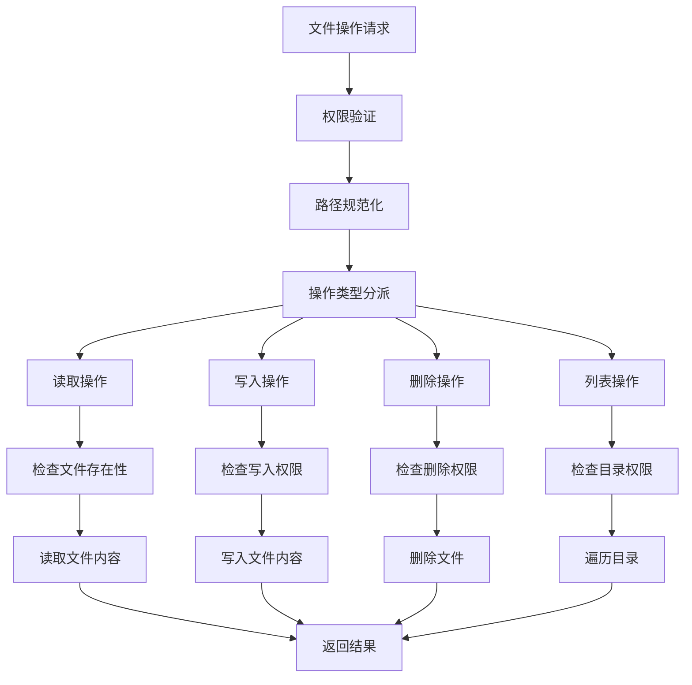
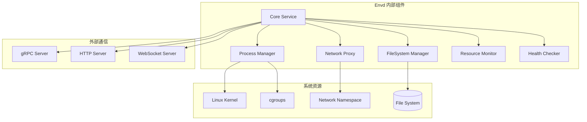
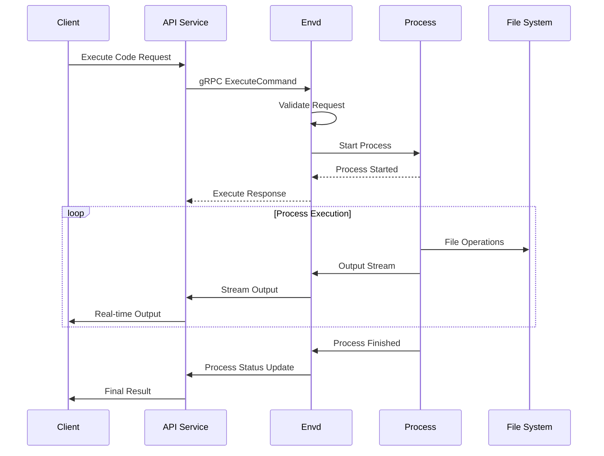

# E2B Envd 模块深度分析

## 1. 定位与使命 (Positioning & Mission)

### 模块定位
Envd (Environment Daemon) 是运行在每个 Firecracker 虚拟机内部的守护进程，负责沙箱环境的内部管理、进程执行、文件系统操作和与外部系统的通信协调。

### 核心问题
- 如何在隔离的虚拟机环境中提供完整的代码执行能力
- 如何实现沙箱内外的安全通信和数据交换
- 如何管理沙箱内的进程生命周期和资源使用
- 如何提供实时的文件系统操作和监控能力

### 应用场景
- 用户代码的安全执行和进程管理
- 沙箱内文件系统的读写和监控
- 与外部服务的网络通信代理
- 沙箱环境状态的实时报告

### 能力边界
- **核心能力**: 进程管理、文件操作、网络代理、状态监控
- **环境限制**: 运行在受限虚拟机内、依赖宿主机通信、资源受限

## 2. 设计思想与哲学基石 (Design Philosophy & Foundational Principles)

### 轻量级守护进程哲学
- **最小化设计**: 仅包含必要功能，减少资源占用
- **快速响应**: 毫秒级响应用户请求
- **稳定可靠**: 异常处理和自动恢复机制

### 安全边界设计
- **权限最小化**: 仅获取执行任务所需的最小权限
- **输入验证**: 严格验证所有外部输入
- **资源限制**: 防止资源耗尽攻击

### 透明代理原则
- **无感知操作**: 用户无需关心底层实现细节
- **协议透明**: 支持多种通信协议的透明转发
- **状态同步**: 实时同步沙箱内外状态信息

## 3. 核心数据结构定义 (Core Data Structure Definitions)

### 进程管理结构
```go
// 进程执行请求
type ExecuteRequest struct {
    ID          string            `json:"id"`
    Command     string            `json:"command"`
    Args        []string          `json:"args"`
    WorkingDir  string            `json:"working_dir,omitempty"`
    Env         map[string]string `json:"env,omitempty"`
    
    // 执行选项
    Options     *ExecuteOptions   `json:"options,omitempty"`
    
    // 输入输出配置
    Stdin       bool              `json:"stdin"`
    Stdout      bool              `json:"stdout"`
    Stderr      bool              `json:"stderr"`
    
    // 超时设置
    Timeout     *time.Duration    `json:"timeout,omitempty"`
}

// 执行选项
type ExecuteOptions struct {
    // PTY支持
    PTY         bool              `json:"pty"`
    PTYSize     *PTYSize          `json:"pty_size,omitempty"`
    
    // 用户和组
    User        string            `json:"user,omitempty"`
    Group       string            `json:"group,omitempty"`
    
    // 资源限制
    CPULimit    *int64            `json:"cpu_limit,omitempty"`    // CPU时间限制（毫秒）
    MemoryLimit *int64            `json:"memory_limit,omitempty"` // 内存限制（字节）
    
    // 安全选项
    NoNewPrivs  bool              `json:"no_new_privs"`
    Seccomp     *SeccompConfig    `json:"seccomp,omitempty"`
}

// 进程状态
type Process struct {
    ID          string            `json:"id"`
    PID         int               `json:"pid"`
    Command     string            `json:"command"`
    Args        []string          `json:"args"`
    State       ProcessState      `json:"state"`
    
    // 时间信息
    StartedAt   time.Time         `json:"started_at"`
    FinishedAt  *time.Time        `json:"finished_at,omitempty"`
    
    // 退出信息
    ExitCode    *int              `json:"exit_code,omitempty"`
    Signal      *string           `json:"signal,omitempty"`
    
    // 资源使用
    ResourceUsage *ProcessResourceUsage `json:"resource_usage,omitempty"`
}

// 进程状态枚举
type ProcessState int32

const (
    ProcessStateUnknown ProcessState = iota
    ProcessStateStarting
    ProcessStateRunning
    ProcessStateStopped
    ProcessStateError
)
```

### 文件系统操作结构
```go
// 文件系统操作类型
type FileOperation int32

const (
    FileOpRead FileOperation = iota
    FileOpWrite
    FileOpCreate
    FileOpDelete
    FileOpMove
    FileOpCopy
    FileOpChmod
    FileOpChown
    FileOpList
    FileOpStat
)

// 文件操作请求
type FileRequest struct {
    ID          string        `json:"id"`
    Operation   FileOperation `json:"operation"`
    Path        string        `json:"path"`
    
    // 操作特定参数
    Content     []byte        `json:"content,omitempty"`     // 写入内容
    NewPath     string        `json:"new_path,omitempty"`    // 移动/复制目标
    Mode        *uint32       `json:"mode,omitempty"`        // 权限模式
    UID         *int          `json:"uid,omitempty"`         // 用户ID
    GID         *int          `json:"gid,omitempty"`         // 组ID
    
    // 选项
    Recursive   bool          `json:"recursive,omitempty"`   // 递归操作
    Force       bool          `json:"force,omitempty"`       // 强制操作
    
    // 分页参数（用于列表操作）
    Offset      int           `json:"offset,omitempty"`
    Limit       int           `json:"limit,omitempty"`
}

// 文件信息
type FileInfo struct {
    Name        string        `json:"name"`
    Path        string        `json:"path"`
    Size        int64         `json:"size"`
    Mode        uint32        `json:"mode"`
    ModTime     time.Time     `json:"mod_time"`
    IsDir       bool          `json:"is_dir"`
    UID         int           `json:"uid"`
    GID         int           `json:"gid"`
}

// 文件监控事件
type FileEvent struct {
    Type        FileEventType `json:"type"`
    Path        string        `json:"path"`
    Timestamp   time.Time     `json:"timestamp"`
    Details     interface{}   `json:"details,omitempty"`
}

type FileEventType int32

const (
    FileEventCreated FileEventType = iota
    FileEventModified
    FileEventDeleted
    FileEventMoved
    FileEventPermChanged
)
```

### 网络代理结构
```go
// 网络代理配置
type ProxyConfig struct {
    ID           string            `json:"id"`
    Type         ProxyType         `json:"type"`
    LocalAddr    string            `json:"local_addr"`
    RemoteAddr   string            `json:"remote_addr"`
    Options      *ProxyOptions     `json:"options,omitempty"`
}

type ProxyType int32

const (
    ProxyTypeHTTP ProxyType = iota
    ProxyTypeHTTPS
    ProxyTypeTCP
    ProxyTypeUDP
    ProxyTypeWebSocket
)

// 代理选项
type ProxyOptions struct {
    // 认证选项
    Auth         *AuthConfig       `json:"auth,omitempty"`
    
    // 超时设置
    ConnTimeout  time.Duration     `json:"conn_timeout,omitempty"`
    ReadTimeout  time.Duration     `json:"read_timeout,omitempty"`
    WriteTimeout time.Duration     `json:"write_timeout,omitempty"`
    
    // 重试配置
    MaxRetries   int               `json:"max_retries,omitempty"`
    RetryDelay   time.Duration     `json:"retry_delay,omitempty"`
    
    // 缓冲区大小
    BufferSize   int               `json:"buffer_size,omitempty"`
}
```

## 4. 核心接口与逻辑实现 (Core Interface & Logic)

### 主要服务接口
```go
// Envd主服务接口
type EnvdService interface {
    // 进程管理
    ExecuteCommand(ctx context.Context, req *ExecuteRequest) (*ExecuteResponse, error)
    GetProcess(ctx context.Context, req *GetProcessRequest) (*GetProcessResponse, error)
    ListProcesses(ctx context.Context, req *ListProcessesRequest) (*ListProcessesResponse, error)
    KillProcess(ctx context.Context, req *KillProcessRequest) (*KillProcessResponse, error)
    StreamProcessOutput(ctx context.Context, req *StreamOutputRequest) (ProcessOutputStream, error)
    
    // 文件系统操作
    ReadFile(ctx context.Context, req *ReadFileRequest) (*ReadFileResponse, error)
    WriteFile(ctx context.Context, req *WriteFileRequest) (*WriteFileResponse, error)
    ListFiles(ctx context.Context, req *ListFilesRequest) (*ListFilesResponse, error)
    DeleteFile(ctx context.Context, req *DeleteFileRequest) (*DeleteFileResponse, error)
    WatchFiles(ctx context.Context, req *WatchFilesRequest) (FileWatchStream, error)
    
    // 网络代理
    CreateProxy(ctx context.Context, req *CreateProxyRequest) (*CreateProxyResponse, error)
    DeleteProxy(ctx context.Context, req *DeleteProxyRequest) (*DeleteProxyResponse, error)
    ListProxies(ctx context.Context, req *ListProxiesRequest) (*ListProxiesResponse, error)
    
    // 系统状态
    GetSystemInfo(ctx context.Context, req *GetSystemInfoRequest) (*GetSystemInfoResponse, error)
    GetResourceUsage(ctx context.Context, req *GetResourceUsageRequest) (*GetResourceUsageResponse, error)
    
    // 健康检查
    HealthCheck(ctx context.Context, req *HealthCheckRequest) (*HealthCheckResponse, error)
}
```

### 进程执行实现
```go
// 进程管理器
type ProcessManager struct {
    processes    map[string]*Process
    processMutex sync.RWMutex
    
    // 资源限制器
    cgroupManager CgroupManager
    
    // 输出流管理
    outputStreams map[string]*OutputStreamManager
    streamMutex   sync.RWMutex
}

// 执行命令的完整流程
func (pm *ProcessManager) ExecuteCommand(ctx context.Context, req *ExecuteRequest) (*ExecuteResponse, error) {
    // 1. 验证请求参数
    if err := pm.validateExecuteRequest(req); err != nil {
        return nil, status.Errorf(codes.InvalidArgument, "invalid request: %v", err)
    }
    
    // 2. 准备执行环境
    cmd := exec.CommandContext(ctx, req.Command, req.Args...)
    
    // 设置工作目录
    if req.WorkingDir != "" {
        cmd.Dir = req.WorkingDir
    }
    
    // 设置环境变量
    if len(req.Env) > 0 {
        env := os.Environ()
        for k, v := range req.Env {
            env = append(env, fmt.Sprintf("%s=%s", k, v))
        }
        cmd.Env = env
    }
    
    // 3. 配置输入输出
    var stdin io.WriteCloser
    var stdout, stderr io.ReadCloser
    
    if req.Stdin {
        stdin, _ = cmd.StdinPipe()
    }
    
    if req.Stdout {
        stdout, _ = cmd.StdoutPipe()
    }
    
    if req.Stderr {
        stderr, _ = cmd.StderrPipe()
    }
    
    // 4. 配置PTY（如果需要）
    if req.Options != nil && req.Options.PTY {
        if err := pm.setupPTY(cmd, req.Options.PTYSize); err != nil {
            return nil, status.Errorf(codes.Internal, "PTY setup failed: %v", err)
        }
    }
    
    // 5. 设置资源限制
    if req.Options != nil {
        if err := pm.applyResourceLimits(req.ID, req.Options); err != nil {
            return nil, status.Errorf(codes.Internal, "resource limits setup failed: %v", err)
        }
    }
    
    // 6. 启动进程
    startTime := time.Now()
    if err := cmd.Start(); err != nil {
        return nil, status.Errorf(codes.Internal, "failed to start process: %v", err)
    }
    
    // 7. 创建进程对象
    process := &Process{
        ID:        req.ID,
        PID:       cmd.Process.Pid,
        Command:   req.Command,
        Args:      req.Args,
        State:     ProcessStateRunning,
        StartedAt: startTime,
    }
    
    // 8. 注册进程
    pm.processMutex.Lock()
    pm.processes[req.ID] = process
    pm.processMutex.Unlock()
    
    // 9. 设置输出流管理
    if stdout != nil || stderr != nil {
        streamManager := &OutputStreamManager{
            ProcessID: req.ID,
            Stdout:    stdout,
            Stderr:    stderr,
            Stdin:     stdin,
        }
        
        pm.streamMutex.Lock()
        pm.outputStreams[req.ID] = streamManager
        pm.streamMutex.Unlock()
        
        // 启动输出流处理
        go streamManager.Start(ctx)
    }
    
    // 10. 异步等待进程结束
    go pm.waitForProcess(ctx, req.ID, cmd)
    
    return &ExecuteResponse{
        ProcessID: req.ID,
        PID:       int32(cmd.Process.Pid),
        State:     ProcessStateRunning,
    }, nil
}

// 等待进程结束
func (pm *ProcessManager) waitForProcess(ctx context.Context, processID string, cmd *exec.Cmd) {
    err := cmd.Wait()
    
    pm.processMutex.Lock()
    defer pm.processMutex.Unlock()
    
    process, exists := pm.processes[processID]
    if !exists {
        return
    }
    
    finishedAt := time.Now()
    process.FinishedAt = &finishedAt
    process.State = ProcessStateStopped
    
    if err != nil {
        if exitError, ok := err.(*exec.ExitError); ok {
            exitCode := exitError.ExitCode()
            process.ExitCode = &exitCode
            
            if exitError.ProcessState.Exited() {
                process.State = ProcessStateStopped
            } else {
                // 进程被信号终止
                process.State = ProcessStateError
                signal := exitError.ProcessState.String()
                process.Signal = &signal
            }
        } else {
            process.State = ProcessStateError
        }
    } else {
        exitCode := 0
        process.ExitCode = &exitCode
    }
    
    // 清理输出流
    pm.streamMutex.Lock()
    if streamManager, exists := pm.outputStreams[processID]; exists {
        streamManager.Close()
        delete(pm.outputStreams, processID)
    }
    pm.streamMutex.Unlock()
    
    // 清理资源限制
    pm.cgroupManager.RemoveProcess(processID)
}
```

### 文件系统操作实现


```go
// 文件系统管理器
type FileSystemManager struct {
    // 根目录限制
    rootPath     string
    
    // 文件监控器
    watcher      *fsnotify.Watcher
    watchPaths   map[string][]chan FileEvent
    watchMutex   sync.RWMutex
    
    // 权限检查器
    permChecker  PermissionChecker
}

// 读取文件实现
func (fsm *FileSystemManager) ReadFile(ctx context.Context, req *ReadFileRequest) (*ReadFileResponse, error) {
    // 1. 路径验证和规范化
    cleanPath, err := fsm.sanitizePath(req.Path)
    if err != nil {
        return nil, status.Errorf(codes.InvalidArgument, "invalid path: %v", err)
    }
    
    // 2. 权限检查
    if !fsm.permChecker.CanRead(cleanPath) {
        return nil, status.Errorf(codes.PermissionDenied, "permission denied: %s", cleanPath)
    }
    
    // 3. 检查文件存在性
    fileInfo, err := os.Stat(cleanPath)
    if err != nil {
        if os.IsNotExist(err) {
            return nil, status.Errorf(codes.NotFound, "file not found: %s", cleanPath)
        }
        return nil, status.Errorf(codes.Internal, "stat failed: %v", err)
    }
    
    // 4. 检查是否为目录
    if fileInfo.IsDir() {
        return nil, status.Errorf(codes.InvalidArgument, "cannot read directory as file: %s", cleanPath)
    }
    
    // 5. 检查文件大小限制
    if fileInfo.Size() > maxFileSize {
        return nil, status.Errorf(codes.ResourceExhausted, "file too large: %d bytes", fileInfo.Size())
    }
    
    // 6. 读取文件内容
    content, err := os.ReadFile(cleanPath)
    if err != nil {
        return nil, status.Errorf(codes.Internal, "failed to read file: %v", err)
    }
    
    return &ReadFileResponse{
        Path:     req.Path,
        Content:  content,
        Size:     fileInfo.Size(),
        ModTime:  fileInfo.ModTime(),
        Mode:     uint32(fileInfo.Mode()),
    }, nil
}

// 写入文件实现
func (fsm *FileSystemManager) WriteFile(ctx context.Context, req *WriteFileRequest) (*WriteFileResponse, error) {
    // 1. 路径验证
    cleanPath, err := fsm.sanitizePath(req.Path)
    if err != nil {
        return nil, status.Errorf(codes.InvalidArgument, "invalid path: %v", err)
    }
    
    // 2. 权限检查
    if !fsm.permChecker.CanWrite(cleanPath) {
        return nil, status.Errorf(codes.PermissionDenied, "permission denied: %s", cleanPath)
    }
    
    // 3. 检查内容大小限制
    if len(req.Content) > maxFileSize {
        return nil, status.Errorf(codes.ResourceExhausted, "content too large: %d bytes", len(req.Content))
    }
    
    // 4. 创建目录（如果需要）
    if req.CreateDirs {
        if err := os.MkdirAll(filepath.Dir(cleanPath), 0755); err != nil {
            return nil, status.Errorf(codes.Internal, "failed to create directories: %v", err)
        }
    }
    
    // 5. 写入文件
    mode := os.FileMode(0644)
    if req.Mode != nil {
        mode = os.FileMode(*req.Mode)
    }
    
    if err := os.WriteFile(cleanPath, req.Content, mode); err != nil {
        return nil, status.Errorf(codes.Internal, "failed to write file: %v", err)
    }
    
    // 6. 获取文件信息
    fileInfo, err := os.Stat(cleanPath)
    if err != nil {
        return nil, status.Errorf(codes.Internal, "failed to get file info: %v", err)
    }
    
    return &WriteFileResponse{
        Path:     req.Path,
        Size:     fileInfo.Size(),
        ModTime:  fileInfo.ModTime(),
        Mode:     uint32(fileInfo.Mode()),
    }, nil
}
```

## 5. 依赖关系与交互 (Dependencies & Interactions)

### Envd内部架构


### 与外部系统的交互


### 资源监控和限制
```go
// 资源监控器
type ResourceMonitor struct {
    // 系统信息收集器
    sysInfoCollector *SystemInfoCollector
    
    // 指标收集器
    metricsCollector *MetricsCollector
    
    // 资源限制器
    resourceLimiter  *ResourceLimiter
    
    // 监控间隔
    monitorInterval  time.Duration
}

// 启动资源监控
func (rm *ResourceMonitor) Start(ctx context.Context) {
    ticker := time.NewTicker(rm.monitorInterval)
    defer ticker.Stop()
    
    for {
        select {
        case <-ticker.C:
            rm.collectMetrics(ctx)
            rm.checkResourceLimits(ctx)
            
        case <-ctx.Done():
            return
        }
    }
}

// 收集系统指标
func (rm *ResourceMonitor) collectMetrics(ctx context.Context) {
    // CPU使用率
    cpuUsage, err := rm.sysInfoCollector.GetCPUUsage()
    if err != nil {
        log.Warnf("Failed to get CPU usage: %v", err)
    } else {
        rm.metricsCollector.RecordCPUUsage(cpuUsage)
    }
    
    // 内存使用情况
    memUsage, err := rm.sysInfoCollector.GetMemoryUsage()
    if err != nil {
        log.Warnf("Failed to get memory usage: %v", err)
    } else {
        rm.metricsCollector.RecordMemoryUsage(memUsage)
    }
    
    // 磁盘使用情况
    diskUsage, err := rm.sysInfoCollector.GetDiskUsage()
    if err != nil {
        log.Warnf("Failed to get disk usage: %v", err)
    } else {
        rm.metricsCollector.RecordDiskUsage(diskUsage)
    }
    
    // 网络统计
    netStats, err := rm.sysInfoCollector.GetNetworkStats()
    if err != nil {
        log.Warnf("Failed to get network stats: %v", err)
    } else {
        rm.metricsCollector.RecordNetworkStats(netStats)
    }
}
```

## 性能优化策略

### 1. 进程管理优化
- **进程池**: 预创建常用进程减少启动时间
- **异步执行**: 使用goroutine处理长时间运行的任务
- **资源复用**: 复用文件描述符和网络连接

### 2. 文件系统优化
- **缓存机制**: 缓存频繁访问的文件元数据
- **批量操作**: 合并多个小的文件操作
- **异步IO**: 使用异步IO提高并发性能

### 3. 网络优化
- **连接复用**: 复用HTTP连接减少握手开销
- **压缩传输**: 对大数据量进行压缩传输
- **多路复用**: 使用HTTP/2多路复用功能

## 安全增强措施

### 1. 沙箱限制
```go
// 安全配置
type SecurityConfig struct {
    // 系统调用过滤
    SeccompProfile string `yaml:"seccomp_profile"`
    
    // 能力限制
    CapAdd  []string `yaml:"cap_add"`
    CapDrop []string `yaml:"cap_drop"`
    
    // 用户命名空间
    UserNamespace bool `yaml:"user_namespace"`
    
    // 只读挂载点
    ReadOnlyPaths []string `yaml:"readonly_paths"`
    
    // 禁止访问的路径
    MaskedPaths []string `yaml:"masked_paths"`
}

// 应用安全限制
func (sm *SecurityManager) ApplySecurityLimits(processID string, config *SecurityConfig) error {
    // 应用seccomp配置
    if config.SeccompProfile != "" {
        if err := sm.applySeccompProfile(processID, config.SeccompProfile); err != nil {
            return fmt.Errorf("failed to apply seccomp profile: %v", err)
        }
    }
    
    // 设置能力限制
    if len(config.CapDrop) > 0 {
        if err := sm.dropCapabilities(processID, config.CapDrop); err != nil {
            return fmt.Errorf("failed to drop capabilities: %v", err)
        }
    }
    
    return nil
}
```

### 2. 输入验证和清理
- **路径清理**: 防止路径遍历攻击
- **命令验证**: 验证命令的合法性
- **资源限制**: 防止资源耗尽攻击

## 错误处理和恢复

### 1. 故障检测
- **进程健康检查**: 定期检查进程状态
- **资源监控**: 监控资源使用情况
- **网络连接检查**: 检查外部连接状态

### 2. 自动恢复
- **进程重启**: 自动重启异常终止的关键进程
- **资源清理**: 清理僵尸进程和临时文件
- **状态重置**: 在严重错误时重置系统状态

## 总结

Envd 作为运行在沙箱环境内的核心守护进程，承担着代码执行、文件管理和系统监控的重要职责。通过精心设计的模块化架构、完善的安全机制和高效的资源管理策略，为用户提供了安全、稳定、高性能的代码执行环境。其轻量级设计和透明代理能力，确保了在受限环境下的最优性能表现。