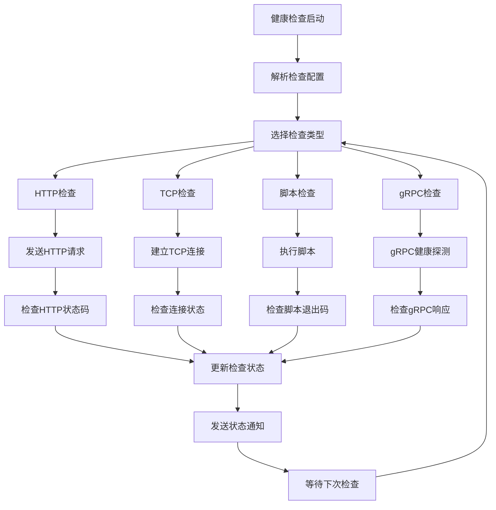
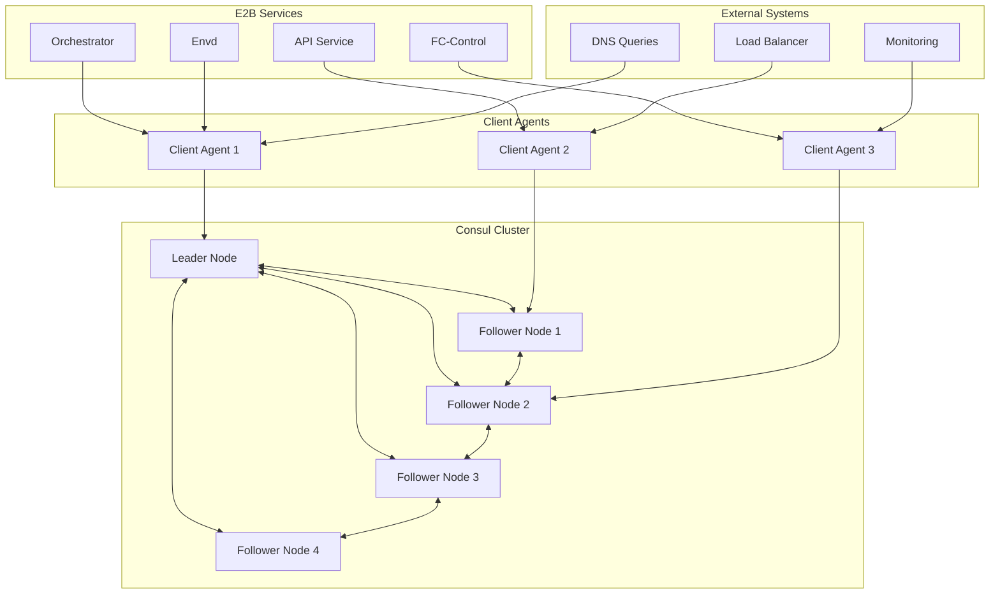
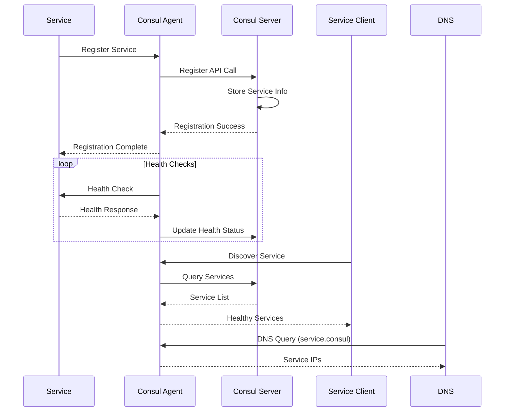

# E2B Consul Agent 模块深度分析

## 1. 定位与使命 (Positioning & Mission)

### 模块定位
Consul Agent 是 E2B 基础设施中的服务发现和配置管理中心，负责维护整个分布式系统的服务拓扑、健康状态和配置信息的一致性。

### 核心问题
- 如何在动态变化的分布式环境中实现服务发现
- 如何确保配置信息在多节点间的一致性传播
- 如何实现高可用的健康检查和故障检测机制
- 如何提供安全的跨服务通信和访问控制

### 应用场景
- 微服务注册与发现
- 分布式配置管理和热更新
- 服务健康监控和故障转移
- 网络分割和服务网格管理

### 能力边界
- **核心能力**: 服务注册、配置存储、健康检查、KV存储、DNS服务
- **技术限制**: 依赖Raft一致性算法、网络分区敏感、需要奇数节点集群

## 2. 设计思想与哲学基石 (Design Philosophy & Foundational Principles)

### 分布式一致性哲学
- **强一致性**: 使用Raft算法保证数据一致性
- **分区容忍**: 网络分区时保证可用性
- **最终收敛**: 故障恢复后自动同步状态

### 服务治理设计
- **自动化服务发现**: 服务自动注册和注销
- **智能负载均衡**: 基于健康状态的流量分发
- **渐进式部署**: 支持蓝绿部署和金丝雀发布

### 零信任安全模型
- **TLS加密通信**: 所有节点间通信加密
- **基于意图的网络**: 显式定义服务间通信规则
- **细粒度访问控制**: ACL系统控制资源访问权限

## 3. 核心数据结构定义 (Core Data Structure Definitions)

### 服务注册结构
```go
// 服务定义
type ServiceDefinition struct {
    ID                string            `json:"id"`
    Name              string            `json:"name"`
    Tags              []string          `json:"tags,omitempty"`
    Address           string            `json:"address,omitempty"`
    Port              int               `json:"port,omitempty"`
    Meta              map[string]string `json:"meta,omitempty"`
    
    // 健康检查定义
    Check             *CheckDefinition  `json:"check,omitempty"`
    Checks            []*CheckDefinition `json:"checks,omitempty"`
    
    // 服务配置
    EnableTagOverride bool              `json:"enable_tag_override,omitempty"`
    Weights           *ServiceWeights   `json:"weights,omitempty"`
    
    // 代理配置
    Proxy             *ProxyDefinition  `json:"proxy,omitempty"`
    Connect           *ConnectDefinition `json:"connect,omitempty"`
}

// 健康检查定义
type CheckDefinition struct {
    ID                            string            `json:"id,omitempty"`
    Name                          string            `json:"name,omitempty"`
    Notes                         string            `json:"notes,omitempty"`
    
    // 检查类型
    HTTP                          string            `json:"http,omitempty"`
    TCP                           string            `json:"tcp,omitempty"`
    UDP                           string            `json:"udp,omitempty"`
    GRPC                          string            `json:"grpc,omitempty"`
    Script                        string            `json:"script,omitempty"`
    DockerContainerID            string            `json:"docker_container_id,omitempty"`
    
    // 检查参数
    Args                         []string          `json:"args,omitempty"`
    Method                       string            `json:"method,omitempty"`
    Header                       map[string][]string `json:"header,omitempty"`
    Body                         string            `json:"body,omitempty"`
    
    // 时间配置
    Interval                     string            `json:"interval,omitempty"`
    Timeout                      string            `json:"timeout,omitempty"`
    TTL                          string            `json:"ttl,omitempty"`
    
    // 状态配置
    Status                       string            `json:"status,omitempty"`
    SuccessBeforePassing        int               `json:"success_before_passing,omitempty"`
    FailuresBeforeCritical      int               `json:"failures_before_critical,omitempty"`
    
    // TLS配置
    TLSSkipVerify               bool              `json:"tls_skip_verify,omitempty"`
    TLSServerName               string            `json:"tls_server_name,omitempty"`
}

// 服务权重
type ServiceWeights struct {
    Passing int `json:"passing,omitempty"`
    Warning int `json:"warning,omitempty"`
}
```

### 集群节点管理
```go
// 节点信息
type Node struct {
    ID              string            `json:"id"`
    Node            string            `json:"node"`
    Address         string            `json:"address"`
    Datacenter      string            `json:"datacenter"`
    
    // 节点元数据
    TaggedAddresses map[string]string `json:"tagged_addresses,omitempty"`
    Meta            map[string]string `json:"meta,omitempty"`
    
    // 节点状态
    CreateIndex     uint64            `json:"create_index,omitempty"`
    ModifyIndex     uint64            `json:"modify_index,omitempty"`
}

// 集群成员信息
type Member struct {
    Name        string            `json:"name"`
    Address     string            `json:"addr"`
    Port        uint16            `json:"port"`
    Tags        map[string]string `json:"tags"`
    Status      MemberStatus      `json:"status"`
    
    // Raft相关
    ProtocolMin uint8             `json:"protocol_min"`
    ProtocolMax uint8             `json:"protocol_max"`
    ProtocolCur uint8             `json:"protocol_cur"`
    DelegateMin uint8             `json:"delegate_min"`
    DelegateMax uint8             `json:"delegate_max"`
    DelegateCur uint8             `json:"delegate_cur"`
}

// 成员状态
type MemberStatus int

const (
    StatusNone MemberStatus = iota
    StatusAlive
    StatusLeaving
    StatusLeft
    StatusFailed
)
```

### 配置和KV存储
```go
// KV键值对
type KVPair struct {
    Key         string  `json:"key"`
    Value       []byte  `json:"value"`
    Flags       uint64  `json:"flags,omitempty"`
    
    // 版本控制
    CreateIndex uint64  `json:"create_index,omitempty"`
    ModifyIndex uint64  `json:"modify_index,omitempty"`
    LockIndex   uint64  `json:"lock_index,omitempty"`
    
    // 会话信息
    Session     string  `json:"session,omitempty"`
}

// 配置项定义
type ConfigEntry struct {
    Kind      string                 `json:"kind"`
    Name      string                 `json:"name"`
    Namespace string                 `json:"namespace,omitempty"`
    
    // 元数据
    Meta            map[string]string `json:"meta,omitempty"`
    CreateIndex     uint64            `json:"create_index,omitempty"`
    ModifyIndex     uint64            `json:"modify_index,omitempty"`
    
    // 配置内容 (根据Kind类型变化)
    Config          interface{}       `json:"config"`
}

// 服务默认配置
type ServiceDefaults struct {
    Protocol         string                    `json:"protocol,omitempty"`
    Mode             string                    `json:"mode,omitempty"`
    TransparentProxy *TransparentProxyConfig   `json:"transparent_proxy,omitempty"`
    MutualTLSMode    string                    `json:"mutual_tls_mode,omitempty"`
    
    // 上游配置
    UpstreamConfig   *UpstreamConfiguration   `json:"upstream_config,omitempty"`
    Destination      *ServiceDestination      `json:"destination,omitempty"`
}
```

## 4. 核心接口与逻辑实现 (Core Interface & Logic)

### 主要服务接口
```go
// Consul Agent 主要接口
type ConsulAgent interface {
    // 服务管理
    RegisterService(ctx context.Context, service *ServiceDefinition) error
    DeregisterService(ctx context.Context, serviceID string) error
    GetService(ctx context.Context, serviceID string) (*ServiceDefinition, error)
    ListServices(ctx context.Context, filters map[string]string) (map[string]*ServiceDefinition, error)
    
    // 健康检查
    RegisterCheck(ctx context.Context, check *CheckDefinition) error
    DeregisterCheck(ctx context.Context, checkID string) error
    GetHealthChecks(ctx context.Context, serviceID string) ([]*HealthCheck, error)
    UpdateCheckStatus(ctx context.Context, checkID string, status CheckStatus, note string) error
    
    // 服务发现
    DiscoverServices(ctx context.Context, serviceName string, healthy bool) ([]*ServiceEntry, error)
    WatchServices(ctx context.Context, serviceName string) (<-chan []*ServiceEntry, error)
    
    // KV存储
    KVPut(ctx context.Context, key string, value []byte, options *KVPutOptions) error
    KVGet(ctx context.Context, key string, options *KVGetOptions) (*KVPair, error)
    KVList(ctx context.Context, prefix string) ([]*KVPair, error)
    KVDelete(ctx context.Context, key string, recursive bool) error
    
    // 集群管理
    ListMembers(ctx context.Context) ([]*Member, error)
    JoinCluster(ctx context.Context, addresses []string) error
    LeaveCluster(ctx context.Context) error
    
    // 配置管理
    PutConfigEntry(ctx context.Context, entry ConfigEntry) error
    GetConfigEntry(ctx context.Context, kind, name string) (ConfigEntry, error)
    DeleteConfigEntry(ctx context.Context, kind, name string) error
}
```

### 服务注册和发现实现
```go
// 服务注册管理器
type ServiceRegistry struct {
    agent       ConsulAgent
    services    map[string]*ServiceDefinition
    serviceMux  sync.RWMutex
    
    // 健康检查管理
    healthMgr   *HealthCheckManager
    
    // 事件通知
    eventBus    *EventBus
}

// 注册服务的完整流程
func (sr *ServiceRegistry) RegisterService(ctx context.Context, service *ServiceDefinition) error {
    // 1. 验证服务定义
    if err := sr.validateServiceDefinition(service); err != nil {
        return fmt.Errorf("invalid service definition: %v", err)
    }
    
    // 2. 检查服务是否已存在
    sr.serviceMux.RLock()
    if existing, exists := sr.services[service.ID]; exists {
        sr.serviceMux.RUnlock()
        if sr.servicesEqual(existing, service) {
            return nil // 服务未变更，无需重新注册
        }
    } else {
        sr.serviceMux.RUnlock()
    }
    
    // 3. 向Consul注册服务
    if err := sr.agent.RegisterService(ctx, service); err != nil {
        return fmt.Errorf("failed to register service in consul: %v", err)
    }
    
    // 4. 注册健康检查
    if service.Check != nil {
        if err := sr.registerHealthCheck(ctx, service.ID, service.Check); err != nil {
            // 回滚服务注册
            sr.agent.DeregisterService(ctx, service.ID)
            return fmt.Errorf("failed to register health check: %v", err)
        }
    }
    
    if len(service.Checks) > 0 {
        for _, check := range service.Checks {
            if err := sr.registerHealthCheck(ctx, service.ID, check); err != nil {
                // 清理已注册的检查和服务
                sr.cleanupServiceRegistration(ctx, service.ID)
                return fmt.Errorf("failed to register health check: %v", err)
            }
        }
    }
    
    // 5. 更新本地服务列表
    sr.serviceMux.Lock()
    sr.services[service.ID] = service
    sr.serviceMux.Unlock()
    
    // 6. 发送服务注册事件
    sr.eventBus.Publish(&ServiceEvent{
        Type:      ServiceRegistered,
        ServiceID: service.ID,
        Service:   service,
        Timestamp: time.Now(),
    })
    
    log.Infof("Service registered successfully: %s", service.ID)
    return nil
}

// 服务发现实现
func (sr *ServiceRegistry) DiscoverServices(ctx context.Context, serviceName string, healthyOnly bool) ([]*ServiceEntry, error) {
    // 1. 查询Consul获取服务实例
    queryOptions := &QueryOptions{
        UseCache:   true,
        MaxAge:     30 * time.Second,
    }
    
    services, meta, err := sr.agent.Health().Service(serviceName, "", healthyOnly, queryOptions.WithContext(ctx))
    if err != nil {
        return nil, fmt.Errorf("failed to discover services: %v", err)
    }
    
    // 2. 转换为标准服务条目格式
    entries := make([]*ServiceEntry, 0, len(services))
    for _, service := range services {
        entry := &ServiceEntry{
            Service: &Service{
                ID:      service.Service.ID,
                Service: service.Service.Service,
                Tags:    service.Service.Tags,
                Address: service.Service.Address,
                Port:    service.Service.Port,
                Meta:    service.Service.Meta,
            },
            Node: &Node{
                ID:       service.Node.ID,
                Node:     service.Node.Node,
                Address:  service.Node.Address,
                Meta:     service.Node.Meta,
            },
            Checks: convertHealthChecks(service.Checks),
        }
        entries = append(entries, entry)
    }
    
    // 3. 缓存结果
    sr.cacheServiceEntries(serviceName, entries, meta.LastIndex)
    
    return entries, nil
}
```

### 健康检查实现


```go
// 健康检查管理器
type HealthCheckManager struct {
    checks      map[string]*RunningCheck
    checksMutex sync.RWMutex
    
    agent       ConsulAgent
    eventBus    *EventBus
    
    // 检查执行器
    httpChecker   *HTTPChecker
    tcpChecker    *TCPChecker
    scriptChecker *ScriptChecker
    grpcChecker   *GRPCChecker
}

// 运行中的健康检查
type RunningCheck struct {
    Definition *CheckDefinition
    Status     CheckStatus
    Output     string
    
    // 控制通道
    stopCh     chan struct{}
    ticker     *time.Ticker
    
    // 状态统计
    ConsecutiveSuccesses int
    ConsecutiveFailures  int
    LastCheck           time.Time
    LastSuccess         time.Time
    LastFailure         time.Time
}

// 启动健康检查
func (hcm *HealthCheckManager) StartCheck(ctx context.Context, check *CheckDefinition) error {
    hcm.checksMutex.Lock()
    defer hcm.checksMutex.Unlock()
    
    // 检查是否已经存在
    if existing, exists := hcm.checks[check.ID]; exists {
        existing.stopCh <- struct{} // 停止现有检查
        existing.ticker.Stop()
    }
    
    // 解析检查间隔
    interval, err := time.ParseDuration(check.Interval)
    if err != nil {
        interval = 30 * time.Second // 默认间隔
    }
    
    // 创建运行时检查对象
    runningCheck := &RunningCheck{
        Definition: check,
        Status:     CheckStatusUnknown,
        stopCh:     make(chan struct{}),
        ticker:     time.NewTicker(interval),
    }
    
    // 注册检查
    hcm.checks[check.ID] = runningCheck
    
    // 启动检查协程
    go hcm.runCheck(ctx, runningCheck)
    
    return nil
}

// 执行健康检查
func (hcm *HealthCheckManager) runCheck(ctx context.Context, runningCheck *RunningCheck) {
    check := runningCheck.Definition
    
    // 立即执行一次检查
    hcm.performCheck(ctx, runningCheck)
    
    for {
        select {
        case <-runningCheck.ticker.C:
            hcm.performCheck(ctx, runningCheck)
            
        case <-runningCheck.stopCh:
            runningCheck.ticker.Stop()
            return
            
        case <-ctx.Done():
            runningCheck.ticker.Stop()
            return
        }
    }
}

// 执行具体检查
func (hcm *HealthCheckManager) performCheck(ctx context.Context, runningCheck *RunningCheck) {
    check := runningCheck.Definition
    startTime := time.Now()
    
    var status CheckStatus
    var output string
    var err error
    
    // 设置超时
    checkCtx := ctx
    if check.Timeout != "" {
        if timeout, parseErr := time.ParseDuration(check.Timeout); parseErr == nil {
            var cancel context.CancelFunc
            checkCtx, cancel = context.WithTimeout(ctx, timeout)
            defer cancel()
        }
    }
    
    // 根据检查类型执行相应检查
    switch {
    case check.HTTP != "":
        status, output, err = hcm.httpChecker.Check(checkCtx, check)
        
    case check.TCP != "":
        status, output, err = hcm.tcpChecker.Check(checkCtx, check)
        
    case check.GRPC != "":
        status, output, err = hcm.grpcChecker.Check(checkCtx, check)
        
    case check.Script != "":
        status, output, err = hcm.scriptChecker.Check(checkCtx, check)
        
    default:
        status = CheckStatusCritical
        output = "Unknown check type"
        err = fmt.Errorf("unsupported check type")
    }
    
    duration := time.Since(startTime)
    
    // 更新检查状态
    hcm.updateCheckStatus(runningCheck, status, output, duration)
    
    // 向Consul报告状态
    if err := hcm.agent.UpdateCheckStatus(ctx, check.ID, status, output); err != nil {
        log.Errorf("Failed to update check status in consul: %v", err)
    }
}

// HTTP健康检查实现
func (hc *HTTPChecker) Check(ctx context.Context, check *CheckDefinition) (CheckStatus, string, error) {
    req, err := http.NewRequestWithContext(ctx, "GET", check.HTTP, nil)
    if err != nil {
        return CheckStatusCritical, fmt.Sprintf("Failed to create request: %v", err), err
    }
    
    // 设置请求头
    if check.Header != nil {
        for k, v := range check.Header {
            req.Header[k] = v
        }
    }
    
    // 设置HTTP方法
    if check.Method != "" {
        req.Method = check.Method
    }
    
    // 设置请求体
    if check.Body != "" {
        req.Body = io.NopCloser(strings.NewReader(check.Body))
    }
    
    // 执行请求
    client := &http.Client{
        Timeout: 10 * time.Second,
        Transport: &http.Transport{
            TLSClientConfig: &tls.Config{
                InsecureSkipVerify: check.TLSSkipVerify,
                ServerName:         check.TLSServerName,
            },
        },
    }
    
    resp, err := client.Do(req)
    if err != nil {
        return CheckStatusCritical, fmt.Sprintf("HTTP request failed: %v", err), err
    }
    defer resp.Body.Close()
    
    // 读取响应
    body, err := io.ReadAll(resp.Body)
    if err != nil {
        return CheckStatusWarning, fmt.Sprintf("Failed to read response: %v", err), err
    }
    
    // 判断状态
    if resp.StatusCode >= 200 && resp.StatusCode < 300 {
        return CheckStatusPassing, fmt.Sprintf("HTTP %d: %s", resp.StatusCode, string(body)), nil
    } else if resp.StatusCode >= 300 && resp.StatusCode < 400 {
        return CheckStatusWarning, fmt.Sprintf("HTTP %d: %s", resp.StatusCode, string(body)), nil
    } else {
        return CheckStatusCritical, fmt.Sprintf("HTTP %d: %s", resp.StatusCode, string(body)), nil
    }
}
```

## 5. 依赖关系与交互 (Dependencies & Interactions)

### Consul集群架构


### 服务发现数据流


### 配置同步机制
```go
// 配置同步管理器
type ConfigSyncManager struct {
    agent       ConsulAgent
    watchers    map[string]*ConfigWatcher
    watchersMux sync.RWMutex
    
    // 配置缓存
    configCache map[string]ConfigEntry
    cacheMux    sync.RWMutex
    
    // 变更通知
    changeNotifier *ChangeNotifier
}

// 配置监听器
type ConfigWatcher struct {
    Key        string
    LastIndex  uint64
    stopCh     chan struct{}
    changeCh   chan ConfigEntry
}

// 启动配置监听
func (csm *ConfigSyncManager) WatchConfig(ctx context.Context, kind, name string, handler ConfigChangeHandler) error {
    watchKey := fmt.Sprintf("%s/%s", kind, name)
    
    csm.watchersMux.Lock()
    defer csm.watchersMux.Unlock()
    
    // 检查是否已存在监听器
    if existing, exists := csm.watchers[watchKey]; exists {
        close(existing.stopCh)
    }
    
    // 创建新监听器
    watcher := &ConfigWatcher{
        Key:      watchKey,
        stopCh:   make(chan struct{}),
        changeCh: make(chan ConfigEntry, 10),
    }
    
    csm.watchers[watchKey] = watcher
    
    // 启动监听协程
    go csm.watchConfigChanges(ctx, watcher, kind, name, handler)
    
    return nil
}

// 监听配置变更
func (csm *ConfigSyncManager) watchConfigChanges(ctx context.Context, watcher *ConfigWatcher, kind, name string, handler ConfigChangeHandler) {
    defer func() {
        close(watcher.changeCh)
        csm.watchersMux.Lock()
        delete(csm.watchers, watcher.Key)
        csm.watchersMux.Unlock()
    }()
    
    for {
        select {
        case <-watcher.stopCh:
            return
            
        case <-ctx.Done():
            return
            
        default:
            // 查询配置
            queryOpts := &QueryOptions{
                WaitIndex:  watcher.LastIndex,
                WaitTime:   30 * time.Second,
            }
            
            entry, meta, err := csm.agent.GetConfigEntryWithMeta(ctx, kind, name, queryOpts)
            if err != nil {
                log.Errorf("Failed to get config entry: %v", err)
                time.Sleep(5 * time.Second)
                continue
            }
            
            // 检查是否有变更
            if meta.LastIndex > watcher.LastIndex {
                watcher.LastIndex = meta.LastIndex
                
                // 更新缓存
                csm.cacheMux.Lock()
                csm.configCache[watcher.Key] = entry
                csm.cacheMux.Unlock()
                
                // 通知变更
                select {
                case watcher.changeCh <- entry:
                    handler.OnConfigChanged(entry)
                default:
                    log.Warnf("Config change channel full for key: %s", watcher.Key)
                }
            }
        }
    }
}
```

## 性能优化策略

### 1. 查询优化
- **索引优化**: 为常用查询字段建立索引
- **缓存策略**: 客户端本地缓存热点数据
- **批量操作**: 合并多个小操作为批量操作

### 2. 网络优化
- **压缩传输**: 启用gzip压缩减少网络传输
- **连接复用**: 复用HTTP连接减少握手开销
- **就近访问**: 优先访问最近的Consul节点

### 3. 存储优化
- **数据压缩**: 对大的配置数据进行压缩存储
- **过期清理**: 定期清理过期的session和lock
- **快照优化**: 优化Raft快照的创建和恢复

## 高可用性设计

### 1. 集群容错
```go
// 集群健康监控
type ClusterHealthMonitor struct {
    agent       ConsulAgent
    nodes       map[string]*NodeHealth
    nodesMutex  sync.RWMutex
    
    alertManager *AlertManager
}

// 节点健康状态
type NodeHealth struct {
    NodeID      string
    Address     string
    Status      NodeStatus
    LastCheck   time.Time
    
    // 健康指标
    ResponseTime time.Duration
    ErrorCount   int
    
    // Raft状态
    RaftRole    string
    RaftIndex   uint64
}

// 监控集群健康
func (chm *ClusterHealthMonitor) MonitorCluster(ctx context.Context) {
    ticker := time.NewTicker(10 * time.Second)
    defer ticker.Stop()
    
    for {
        select {
        case <-ticker.C:
            chm.checkClusterHealth(ctx)
            
        case <-ctx.Done():
            return
        }
    }
}

// 检查集群健康状态
func (chm *ClusterHealthMonitor) checkClusterHealth(ctx context.Context) {
    members, err := chm.agent.ListMembers(ctx)
    if err != nil {
        log.Errorf("Failed to list cluster members: %v", err)
        return
    }
    
    healthyNodes := 0
    totalNodes := len(members)
    
    for _, member := range members {
        health := chm.checkNodeHealth(ctx, member)
        
        chm.nodesMutex.Lock()
        chm.nodes[member.Name] = health
        chm.nodesMutex.Unlock()
        
        if health.Status == NodeStatusHealthy {
            healthyNodes++
        }
    }
    
    // 检查集群状态
    if healthyNodes < totalNodes/2+1 {
        chm.alertManager.SendAlert(&Alert{
            Type:     AlertTypeClusterUnhealthy,
            Severity: AlertSeverityCritical,
            Message:  fmt.Sprintf("Cluster unhealthy: %d/%d nodes healthy", healthyNodes, totalNodes),
        })
    }
}
```

### 2. 故障恢复
- **自动重新加入**: 故障节点恢复后自动重新加入集群
- **数据同步**: 自动同步故障期间的数据变更
- **负载重分配**: 故障时将负载转移到健康节点

## 安全配置

### 1. ACL权限控制
```yaml
# ACL策略配置
acl:
  enabled: true
  default_policy: "deny"
  enable_token_persistence: true
  
  policies:
    - name: "e2b-orchestrator"
      rules: |
        service_prefix "e2b-" {
          policy = "write"
        }
        node_prefix "" {
          policy = "read"
        }
        key_prefix "config/e2b/" {
          policy = "write"
        }
    
    - name: "e2b-api-service"
      rules: |
        service "e2b-api" {
          policy = "write"
        }
        service_prefix "e2b-" {
          policy = "read"
        }
```

### 2. TLS加密
- **节点间通信**: 启用TLS加密所有节点间通信
- **客户端连接**: 要求客户端使用TLS连接
- **证书管理**: 自动轮换TLS证书

## 总结

Consul Agent 作为 E2B 基础设施的服务治理核心，通过强一致性的分布式存储、智能的服务发现机制和完善的健康检查体系，为整个微服务架构提供了可靠的基础设施支撑。其高可用的集群设计和灵活的配置管理能力，确保了系统在复杂分布式环境下的稳定运行和动态适应能力。