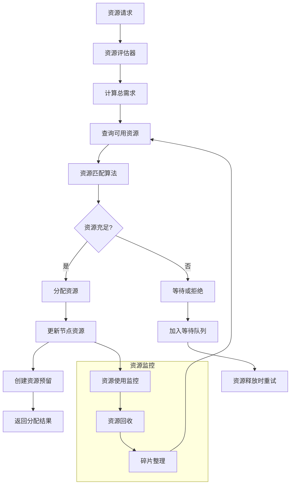
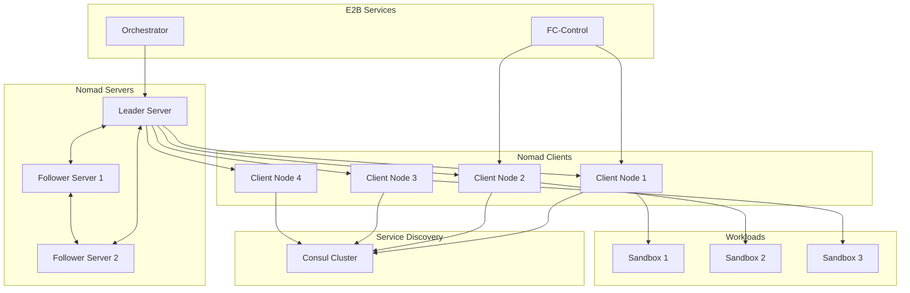
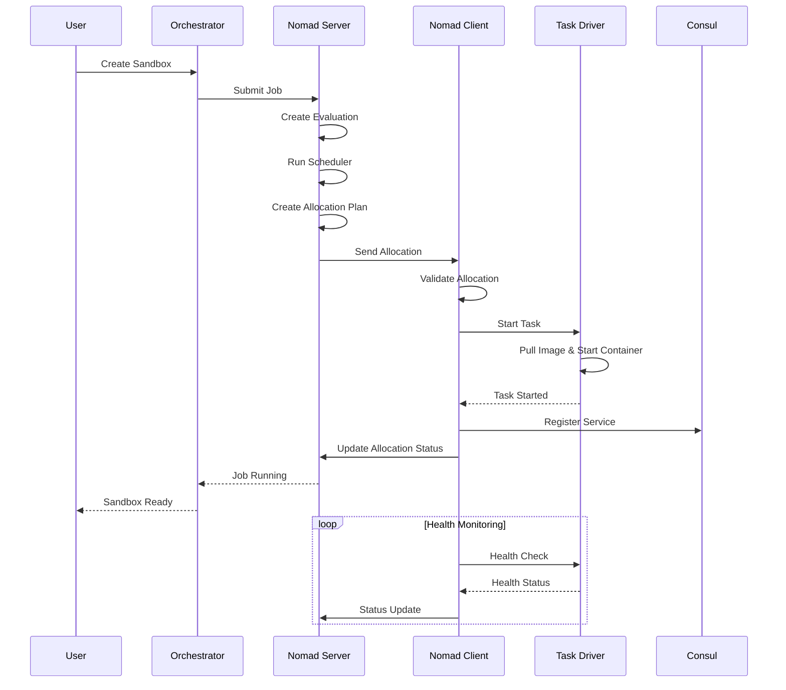

# E2B Nomad 模块深度分析

## 1. 定位与使命 (Positioning & Mission)

### 模块定位
Nomad 是 E2B 基础设施中的工作负载调度和资源管理引擎，负责在分布式集群中智能分配和管理计算资源，确保沙箱实例的高效调度和运行。

### 核心问题
- 如何在异构计算集群中实现智能的工作负载调度
- 如何动态管理和分配计算资源以满足不同的性能需求
- 如何确保高可用性和故障恢复能力
- 如何实现弹性扩缩容和资源利用率优化

### 应用场景
- 沙箱实例的调度和部署
- 批处理任务的资源分配
- 服务实例的自动扩缩容
- 多租户环境的资源隔离

### 能力边界
- **核心能力**: 任务调度、资源管理、故障恢复、弹性伸缩
- **技术限制**: 依赖底层容器运行时、需要集群网络支持、受限于节点资源

## 2. 设计思想与哲学基石 (Design Philosophy & Foundational Principles)

### 声明式调度哲学
- **期望状态管理**: 用户声明期望的工作负载状态，系统自动维护
- **收敛性保证**: 系统持续工作使实际状态趋向期望状态
- **幂等操作**: 相同的操作多次执行结果一致

### 多维度调度策略
- **资源感知**: 基于CPU、内存、网络、存储等多维度资源进行调度
- **亲和性调度**: 支持节点亲和性和反亲和性约束
- **优先级调度**: 根据作业优先级进行资源分配

### 弹性系统设计
- **自愈能力**: 自动检测和恢复失败的工作负载
- **水平扩展**: 支持集群节点的动态增减
- **优雅降级**: 在资源不足时提供有限服务

## 3. 核心数据结构定义 (Core Data Structure Definitions)

### 作业定义结构
```go
// 作业定义
type Job struct {
    ID          string            `json:"id"`
    Name        string            `json:"name"`
    Namespace   string            `json:"namespace,omitempty"`
    Type        JobType           `json:"type"`
    Priority    int               `json:"priority,omitempty"`
    Datacenters []string          `json:"datacenters,omitempty"`
    
    // 约束条件
    Constraints []*Constraint     `json:"constraints,omitempty"`
    Affinities  []*Affinity       `json:"affinities,omitempty"`
    
    // 任务组
    TaskGroups  []*TaskGroup      `json:"task_groups"`
    
    // 更新策略
    Update      *UpdateStrategy   `json:"update,omitempty"`
    
    // 元数据
    Meta        map[string]string `json:"meta,omitempty"`
    
    // 时间戳
    CreateIndex uint64            `json:"create_index,omitempty"`
    ModifyIndex uint64            `json:"modify_index,omitempty"`
    JobModifyIndex uint64         `json:"job_modify_index,omitempty"`
    
    // 状态
    Status      JobStatus         `json:"status,omitempty"`
    StatusDescription string      `json:"status_description,omitempty"`
    
    // 调度配置
    Periodic    *PeriodicConfig   `json:"periodic,omitempty"`
    
    // 停止配置
    Stop        bool              `json:"stop,omitempty"`
}

// 作业类型
type JobType string

const (
    JobTypeService JobType = "service"
    JobTypeBatch   JobType = "batch"
    JobTypeSystem  JobType = "system"
)

// 任务组定义
type TaskGroup struct {
    Name          string               `json:"name"`
    Count         int                  `json:"count"`
    
    // 约束条件
    Constraints   []*Constraint        `json:"constraints,omitempty"`
    Affinities    []*Affinity          `json:"affinities,omitempty"`
    
    // 任务定义
    Tasks         []*Task              `json:"tasks"`
    
    // 重启策略
    RestartPolicy *RestartPolicy       `json:"restart_policy,omitempty"`
    
    // 重新调度策略
    ReschedulePolicy *ReschedulePolicy `json:"reschedule_policy,omitempty"`
    
    // 迁移策略
    Migrate       *MigrateStrategy     `json:"migrate,omitempty"`
    
    // 更新策略
    Update        *UpdateStrategy      `json:"update,omitempty"`
    
    // 网络配置
    Networks      []*NetworkResource   `json:"networks,omitempty"`
    
    // 卷配置
    Volumes       map[string]*VolumeRequest `json:"volumes,omitempty"`
    
    // 元数据
    Meta          map[string]string    `json:"meta,omitempty"`
}

// 任务定义
type Task struct {
    Name        string                `json:"name"`
    Driver      string                `json:"driver"`
    Config      map[string]interface{} `json:"config"`
    
    // 约束条件
    Constraints []*Constraint         `json:"constraints,omitempty"`
    Affinities  []*Affinity           `json:"affinities,omitempty"`
    
    // 环境变量
    Env         map[string]string     `json:"env,omitempty"`
    
    // 资源需求
    Resources   *Resources            `json:"resources"`
    
    // 服务发现
    Services    []*Service            `json:"services,omitempty"`
    
    // 生命周期配置
    Lifecycle   *TaskLifecycleConfig  `json:"lifecycle,omitempty"`
    
    // 模板配置
    Templates   []*Template           `json:"templates,omitempty"`
    
    // 卷挂载
    VolumeMounts []*VolumeMount       `json:"volume_mounts,omitempty"`
    
    // 元数据
    Meta        map[string]string     `json:"meta,omitempty"`
}
```

### 资源管理结构
```go
// 资源需求
type Resources struct {
    CPU      int    `json:"cpu"`        // MHz
    Memory   int    `json:"memory"`     // MB
    Disk     int    `json:"disk"`       // MB
    
    // 网络资源
    Networks []*NetworkResource `json:"networks,omitempty"`
    
    // 设备资源
    Devices  []*RequestedDevice `json:"devices,omitempty"`
}

// 网络资源
type NetworkResource struct {
    Mode         string      `json:"mode,omitempty"`
    Device       string      `json:"device,omitempty"`
    CIDR         string      `json:"cidr,omitempty"`
    IP           string      `json:"ip,omitempty"`
    
    // 端口配置
    ReservedPorts []Port     `json:"reserved_ports,omitempty"`
    DynamicPorts  []Port     `json:"dynamic_ports,omitempty"`
    
    // 带宽限制
    MBits        int         `json:"mbits,omitempty"`
}

// 端口定义
type Port struct {
    Label  string `json:"label"`
    Value  int    `json:"value,omitempty"`
    To     int    `json:"to,omitempty"`
    HostNetwork string `json:"host_network,omitempty"`
}

// 节点资源
type NodeResources struct {
    CPU      *NodeCpuResources    `json:"cpu"`
    Memory   *NodeMemoryResources `json:"memory"`
    Disk     *NodeDiskResources   `json:"disk"`
    Networks []*NetworkResource   `json:"networks,omitempty"`
    Devices  []*NodeDeviceResource `json:"devices,omitempty"`
    
    // 保留资源
    Reserved *Resources           `json:"reserved,omitempty"`
}

// 节点CPU资源
type NodeCpuResources struct {
    CpuShares          int64   `json:"cpu_shares"`
    TotalComputeUnits  int64   `json:"total_compute_units"`
    ReservedCores      []int   `json:"reserved_cores,omitempty"`
}
```

### 调度和分配结构
```go
// 分配信息
type Allocation struct {
    ID                 string                 `json:"id"`
    Namespace          string                 `json:"namespace,omitempty"`
    EvalID             string                 `json:"eval_id"`
    Name               string                 `json:"name"`
    NodeID             string                 `json:"node_id"`
    JobID              string                 `json:"job_id"`
    TaskGroup          string                 `json:"task_group"`
    
    // 资源分配
    Resources          *Resources             `json:"resources"`
    TaskResources      map[string]*Resources  `json:"task_resources"`
    AllocatedResources *AllocatedResources    `json:"allocated_resources,omitempty"`
    
    // 状态信息
    DesiredStatus      string                 `json:"desired_status"`
    DesiredDescription string                 `json:"desired_description,omitempty"`
    ClientStatus       string                 `json:"client_status,omitempty"`
    ClientDescription  string                 `json:"client_description,omitempty"`
    
    // 任务状态
    TaskStates         map[string]*TaskState  `json:"task_states,omitempty"`
    
    // 时间信息
    CreateIndex        uint64                 `json:"create_index,omitempty"`
    ModifyIndex        uint64                 `json:"modify_index,omitempty"`
    CreateTime         int64                  `json:"create_time,omitempty"`
    ModifyTime         int64                  `json:"modify_time,omitempty"`
    
    // 评估信息
    PreviousAllocation string                 `json:"previous_allocation,omitempty"`
    NextAllocation     string                 `json:"next_allocation,omitempty"`
    
    // 网络状态
    NetworkStatus      *AllocNetworkStatus    `json:"network_status,omitempty"`
}

// 任务状态
type TaskState struct {
    State      string                 `json:"state"`
    Failed     bool                   `json:"failed"`
    Restarts   uint64                 `json:"restarts"`
    LastRestart time.Time             `json:"last_restart,omitempty"`
    StartedAt   time.Time             `json:"started_at,omitempty"`
    FinishedAt  time.Time             `json:"finished_at,omitempty"`
    
    // 事件列表
    Events     []*TaskEvent           `json:"events,omitempty"`
}

// 任务事件
type TaskEvent struct {
    Type           string            `json:"type"`
    Time           int64             `json:"time"`
    FailsTask      bool              `json:"fails_task"`
    RestartReason  string            `json:"restart_reason,omitempty"`
    SetupError     string            `json:"setup_error,omitempty"`
    DriverError    string            `json:"driver_error,omitempty"`
    ExitCode       int               `json:"exit_code,omitempty"`
    Signal         int               `json:"signal,omitempty"`
    Message        string            `json:"message,omitempty"`
    
    // 详细信息
    Details        map[string]string `json:"details,omitempty"`
}
```

## 4. 核心接口与逻辑实现 (Core Interface & Logic)

### 主要服务接口
```go
// Nomad调度器主要接口
type NomadScheduler interface {
    // 作业管理
    SubmitJob(ctx context.Context, job *Job) (*JobSubmitResponse, error)
    GetJob(ctx context.Context, jobID string) (*Job, error)
    ListJobs(ctx context.Context, filters map[string]string) ([]*Job, error)
    StopJob(ctx context.Context, jobID string, purge bool) (*JobStopResponse, error)
    
    // 分配管理
    GetAllocation(ctx context.Context, allocID string) (*Allocation, error)
    ListAllocations(ctx context.Context, filters map[string]string) ([]*Allocation, error)
    StopAllocation(ctx context.Context, allocID string) error
    RestartAllocation(ctx context.Context, allocID string, taskName string) error
    
    // 节点管理
    RegisterNode(ctx context.Context, node *Node) error
    DeregisterNode(ctx context.Context, nodeID string) error
    ListNodes(ctx context.Context) ([]*Node, error)
    GetNodeAllocations(ctx context.Context, nodeID string) ([]*Allocation, error)
    DrainNode(ctx context.Context, nodeID string, drainSpec *DrainSpec) error
    
    // 评估和调度
    TriggerEvaluation(ctx context.Context, jobID string) (*Evaluation, error)
    GetEvaluation(ctx context.Context, evalID string) (*Evaluation, error)
    ListEvaluations(ctx context.Context, filters map[string]string) ([]*Evaluation, error)
    
    // 系统操作
    GetSystemStatus(ctx context.Context) (*SystemStatus, error)
    GarbageCollect(ctx context.Context) error
    ReconcileJobs(ctx context.Context) error
}
```

### 调度算法实现
```go
// 调度器引擎
type SchedulerEngine struct {
    // 调度算法
    algorithms map[JobType]SchedulingAlgorithm
    
    // 节点管理器
    nodeManager *NodeManager
    
    // 资源评估器
    resourceEvaluator *ResourceEvaluator
    
    // 约束检查器
    constraintChecker *ConstraintChecker
    
    // 指标收集器
    metricsCollector *MetricsCollector
}

// 调度算法接口
type SchedulingAlgorithm interface {
    Schedule(ctx context.Context, eval *Evaluation) (*SchedulingResult, error)
    Name() string
    Priority() int
}

// 服务类型调度算法
type ServiceScheduler struct {
    nodeManager       *NodeManager
    resourceEvaluator *ResourceEvaluator
}

// 执行服务调度
func (ss *ServiceScheduler) Schedule(ctx context.Context, eval *Evaluation) (*SchedulingResult, error) {
    // 1. 获取作业定义
    job, err := ss.getJob(eval.JobID)
    if err != nil {
        return nil, fmt.Errorf("failed to get job: %v", err)
    }
    
    // 2. 获取可用节点
    nodes, err := ss.nodeManager.GetEligibleNodes(ctx, &NodeFilterCriteria{
        Datacenters: job.Datacenters,
        Constraints: job.Constraints,
        Status:      NodeStatusReady,
    })
    if err != nil {
        return nil, fmt.Errorf("failed to get eligible nodes: %v", err)
    }
    
    result := &SchedulingResult{
        EvaluationID: eval.ID,
        Allocations:  make([]*Allocation, 0),
        NodeUpdates:  make(map[string][]*Allocation),
    }
    
    // 3. 为每个任务组进行调度
    for _, taskGroup := range job.TaskGroups {
        taskGroupAllocations, err := ss.scheduleTaskGroup(ctx, job, taskGroup, nodes)
        if err != nil {
            log.Errorf("Failed to schedule task group %s: %v", taskGroup.Name, err)
            continue
        }
        
        result.Allocations = append(result.Allocations, taskGroupAllocations...)
    }
    
    return result, nil
}

// 调度任务组
func (ss *ServiceScheduler) scheduleTaskGroup(ctx context.Context, job *Job, taskGroup *TaskGroup, nodes []*Node) ([]*Allocation, error) {
    allocations := make([]*Allocation, 0, taskGroup.Count)
    
    // 计算资源需求
    resourceReq := ss.calculateResourceRequirements(taskGroup)
    
    // 为每个实例调度
    for i := 0; i < taskGroup.Count; i++ {
        // 选择最适合的节点
        selectedNode, err := ss.selectBestNode(ctx, nodes, resourceReq, taskGroup.Constraints, taskGroup.Affinities)
        if err != nil {
            return nil, fmt.Errorf("failed to select node for allocation %d: %v", i, err)
        }
        
        // 创建分配
        allocation := &Allocation{
            ID:            generateAllocationID(),
            Namespace:     job.Namespace,
            EvalID:        "", // 将由评估器设置
            Name:          fmt.Sprintf("%s.%s[%d]", job.Name, taskGroup.Name, i),
            NodeID:        selectedNode.ID,
            JobID:         job.ID,
            TaskGroup:     taskGroup.Name,
            Resources:     resourceReq,
            DesiredStatus: AllocDesiredStatusRun,
            ClientStatus:  AllocClientStatusPending,
            CreateTime:    time.Now().UnixNano(),
        }
        
        // 分配端口
        if err := ss.allocatePorts(allocation, taskGroup, selectedNode); err != nil {
            return nil, fmt.Errorf("failed to allocate ports: %v", err)
        }
        
        // 更新节点资源
        if err := ss.nodeManager.ReserveResources(selectedNode.ID, resourceReq); err != nil {
            return nil, fmt.Errorf("failed to reserve resources: %v", err)
        }
        
        allocations = append(allocations, allocation)
    }
    
    return allocations, nil
}

// 选择最佳节点
func (ss *ServiceScheduler) selectBestNode(ctx context.Context, nodes []*Node, resourceReq *Resources, constraints []*Constraint, affinities []*Affinity) (*Node, error) {
    // 1. 过滤不满足约束的节点
    eligibleNodes := make([]*Node, 0, len(nodes))
    for _, node := range nodes {
        if ss.satisfiesConstraints(node, constraints) && ss.hasEnoughResources(node, resourceReq) {
            eligibleNodes = append(eligibleNodes, node)
        }
    }
    
    if len(eligibleNodes) == 0 {
        return nil, fmt.Errorf("no eligible nodes available")
    }
    
    // 2. 根据亲和性和资源利用率打分
    type nodeScore struct {
        node  *Node
        score float64
    }
    
    scores := make([]nodeScore, len(eligibleNodes))
    for i, node := range eligibleNodes {
        score := ss.calculateNodeScore(node, resourceReq, affinities)
        scores[i] = nodeScore{node: node, score: score}
    }
    
    // 3. 按分数排序，选择最高分节点
    sort.Slice(scores, func(i, j int) bool {
        return scores[i].score > scores[j].score
    })
    
    return scores[0].node, nil
}

// 计算节点得分
func (ss *ServiceScheduler) calculateNodeScore(node *Node, resourceReq *Resources, affinities []*Affinity) float64 {
    score := 0.0
    
    // 1. 资源利用率得分 (剩余资源越多得分越高)
    resourceScore := ss.calculateResourceScore(node, resourceReq)
    score += resourceScore * 0.4
    
    // 2. 亲和性得分
    affinityScore := ss.calculateAffinityScore(node, affinities)
    score += affinityScore * 0.3
    
    // 3. 负载均衡得分 (分配数量越少得分越高)
    loadScore := ss.calculateLoadScore(node)
    score += loadScore * 0.2
    
    // 4. 网络延迟得分
    networkScore := ss.calculateNetworkScore(node)
    score += networkScore * 0.1
    
    return score
}
```

### 资源管理实现


```go
// 资源管理器
type ResourceManager struct {
    // 节点资源状态
    nodeResources map[string]*NodeResourceState
    resourceMutex sync.RWMutex
    
    // 资源分配器
    allocator     ResourceAllocator
    
    // 资源监控器
    monitor       ResourceMonitor
    
    // 资源优化器
    optimizer     ResourceOptimizer
}

// 节点资源状态
type NodeResourceState struct {
    NodeID    string
    Total     *Resources
    Used      *Resources
    Reserved  *Resources
    Available *Resources
    
    // 碎片化指标
    Fragmentation float64
    
    // 分配历史
    Allocations   map[string]*Allocation
    
    // 更新时间
    LastUpdated   time.Time
}

// 分配资源
func (rm *ResourceManager) AllocateResources(ctx context.Context, nodeID string, resourceReq *Resources, allocID string) error {
    rm.resourceMutex.Lock()
    defer rm.resourceMutex.Unlock()
    
    nodeState, exists := rm.nodeResources[nodeID]
    if !exists {
        return fmt.Errorf("node %s not found", nodeID)
    }
    
    // 1. 检查资源可用性
    if !rm.hasEnoughResources(nodeState.Available, resourceReq) {
        return fmt.Errorf("insufficient resources on node %s", nodeID)
    }
    
    // 2. 分配CPU资源
    if err := rm.allocateCPUResources(nodeState, resourceReq, allocID); err != nil {
        return fmt.Errorf("CPU allocation failed: %v", err)
    }
    
    // 3. 分配内存资源
    if err := rm.allocateMemoryResources(nodeState, resourceReq, allocID); err != nil {
        rm.deallocateCPUResources(nodeState, resourceReq, allocID) // 回滚
        return fmt.Errorf("memory allocation failed: %v", err)
    }
    
    // 4. 分配网络资源
    if len(resourceReq.Networks) > 0 {
        if err := rm.allocateNetworkResources(nodeState, resourceReq.Networks, allocID); err != nil {
            rm.deallocateCPUResources(nodeState, resourceReq, allocID)
            rm.deallocateMemoryResources(nodeState, resourceReq, allocID)
            return fmt.Errorf("network allocation failed: %v", err)
        }
    }
    
    // 5. 更新资源状态
    rm.updateResourceUsage(nodeState, resourceReq, true)
    nodeState.LastUpdated = time.Now()
    
    // 6. 记录分配
    rm.recordAllocation(nodeID, allocID, resourceReq)
    
    return nil
}

// 释放资源
func (rm *ResourceManager) DeallocateResources(ctx context.Context, nodeID string, allocID string) error {
    rm.resourceMutex.Lock()
    defer rm.resourceMutex.Unlock()
    
    nodeState, exists := rm.nodeResources[nodeID]
    if !exists {
        return fmt.Errorf("node %s not found", nodeID)
    }
    
    // 获取分配记录
    allocation, exists := nodeState.Allocations[allocID]
    if !exists {
        return fmt.Errorf("allocation %s not found on node %s", allocID, nodeID)
    }
    
    // 释放各种资源
    rm.deallocateCPUResources(nodeState, allocation.Resources, allocID)
    rm.deallocateMemoryResources(nodeState, allocation.Resources, allocID)
    if len(allocation.Resources.Networks) > 0 {
        rm.deallocateNetworkResources(nodeState, allocation.Resources.Networks, allocID)
    }
    
    // 更新资源状态
    rm.updateResourceUsage(nodeState, allocation.Resources, false)
    
    // 删除分配记录
    delete(nodeState.Allocations, allocID)
    nodeState.LastUpdated = time.Now()
    
    // 触发资源优化
    go rm.optimizer.OptimizeNode(nodeID)
    
    return nil
}

// 资源碎片整理
func (rm *ResourceManager) DefragmentResources(ctx context.Context, nodeID string) error {
    rm.resourceMutex.Lock()
    nodeState := rm.nodeResources[nodeID]
    rm.resourceMutex.Unlock()
    
    if nodeState == nil {
        return fmt.Errorf("node %s not found", nodeID)
    }
    
    // 计算碎片化程度
    fragmentation := rm.calculateFragmentation(nodeState)
    if fragmentation < 0.3 { // 碎片化程度低于30%，不需要整理
        return nil
    }
    
    log.Infof("Starting defragmentation for node %s (fragmentation: %.2f)", nodeID, fragmentation)
    
    // 获取可迁移的分配
    migrableAllocations := rm.getMigrableAllocations(nodeState)
    
    // 计算最优重新分配方案
    reallocationPlan, err := rm.calculateOptimalReallocation(nodeState, migrableAllocations)
    if err != nil {
        return fmt.Errorf("failed to calculate reallocation plan: %v", err)
    }
    
    // 执行重新分配
    for _, realloc := range reallocationPlan {
        if err := rm.executeMigration(ctx, realloc); err != nil {
            log.Errorf("Failed to migrate allocation %s: %v", realloc.AllocationID, err)
            // 继续处理其他迁移，不因为单个失败而停止整个过程
        }
    }
    
    return nil
}
```

## 5. 依赖关系与交互 (Dependencies & Interactions)

### Nomad集群架构


### 任务调度流程


### 故障恢复机制
```go
// 故障恢复管理器
type FailureRecoveryManager struct {
    scheduler       *SchedulerEngine
    nodeManager     *NodeManager
    allocationMgr   *AllocationManager
    
    // 故障检测器
    failureDetector *FailureDetector
    
    // 恢复策略
    recoveryStrategies map[FailureType]RecoveryStrategy
}

// 故障类型
type FailureType int

const (
    FailureTypeNodeDown FailureType = iota
    FailureTypeTaskFailed
    FailureTypeNetworkPartition
    FailureTypeResourceExhaustion
)

// 恢复策略接口
type RecoveryStrategy interface {
    Recover(ctx context.Context, failure *Failure) error
    CanHandle(failureType FailureType) bool
}

// 节点故障恢复策略
type NodeFailureRecovery struct {
    scheduler     *SchedulerEngine
    nodeManager   *NodeManager
}

func (nfr *NodeFailureRecovery) Recover(ctx context.Context, failure *Failure) error {
    nodeID := failure.NodeID
    
    // 1. 获取受影响的分配
    allocations, err := nfr.getAllocationsOnNode(nodeID)
    if err != nil {
        return fmt.Errorf("failed to get allocations on node %s: %v", nodeID, err)
    }
    
    log.Infof("Node %s failed, recovering %d allocations", nodeID, len(allocations))
    
    // 2. 标记节点为不可用
    if err := nfr.nodeManager.MarkNodeDown(nodeID, "Node failure detected"); err != nil {
        log.Errorf("Failed to mark node as down: %v", err)
    }
    
    // 3. 为每个分配创建重新调度任务
    for _, alloc := range allocations {
        if err := nfr.rescheduleAllocation(ctx, alloc); err != nil {
            log.Errorf("Failed to reschedule allocation %s: %v", alloc.ID, err)
            continue
        }
    }
    
    // 4. 清理节点资源状态
    if err := nfr.nodeManager.CleanupNodeResources(nodeID); err != nil {
        log.Errorf("Failed to cleanup node resources: %v", err)
    }
    
    return nil
}

// 重新调度分配
func (nfr *NodeFailureRecovery) rescheduleAllocation(ctx context.Context, alloc *Allocation) error {
    // 创建新的评估请求
    eval := &Evaluation{
        ID:       generateEvaluationID(),
        Type:     EvalTypeJobReschedule,
        JobID:    alloc.JobID,
        Priority: EvalPriorityHigh,
        Status:   EvalStatusPending,
        
        // 包含失败的分配信息
        PreviousAllocation: alloc.ID,
        FailedNodeID:       alloc.NodeID,
    }
    
    // 提交评估
    return nfr.scheduler.ProcessEvaluation(ctx, eval)
}
```

## 性能优化策略

### 1. 调度优化
```go
// 调度性能优化器
type SchedulingOptimizer struct {
    // 预计算的节点排序
    nodeRankingCache map[string][]string
    cacheTimeout     time.Duration
    cacheMutex       sync.RWMutex
    
    // 批处理调度
    batchScheduler   *BatchScheduler
    
    // 预测式调度
    predictiveScheduler *PredictiveScheduler
}

// 批处理调度
func (so *SchedulingOptimizer) BatchSchedule(ctx context.Context, evals []*Evaluation) ([]*SchedulingResult, error) {
    // 按作业类型分组
    evalGroups := make(map[JobType][]*Evaluation)
    for _, eval := range evals {
        job, err := so.getJob(eval.JobID)
        if err != nil {
            continue
        }
        evalGroups[job.Type] = append(evalGroups[job.Type], eval)
    }
    
    results := make([]*SchedulingResult, 0, len(evals))
    
    // 并行处理不同类型的作业
    var wg sync.WaitGroup
    resultChan := make(chan *SchedulingResult, len(evals))
    
    for jobType, groupEvals := range evalGroups {
        wg.Add(1)
        go func(jt JobType, evs []*Evaluation) {
            defer wg.Done()
            
            scheduler := so.getSchedulerForType(jt)
            for _, eval := range evs {
                if result, err := scheduler.Schedule(ctx, eval); err == nil {
                    resultChan <- result
                }
            }
        }(jobType, groupEvals)
    }
    
    go func() {
        wg.Wait()
        close(resultChan)
    }()
    
    // 收集结果
    for result := range resultChan {
        results = append(results, result)
    }
    
    return results, nil
}

// 预测式调度
func (so *SchedulingOptimizer) PredictiveSchedule(ctx context.Context) error {
    // 分析历史调度模式
    patterns, err := so.analyzeSchedulingPatterns()
    if err != nil {
        return fmt.Errorf("failed to analyze patterns: %v", err)
    }
    
    // 预测未来资源需求
    predictions := so.predictResourceDemand(patterns)
    
    // 预分配资源
    for _, prediction := range predictions {
        if err := so.preAllocateResources(prediction); err != nil {
            log.Errorf("Failed to pre-allocate resources: %v", err)
        }
    }
    
    return nil
}
```

### 2. 资源优化
- **智能预分配**: 基于历史数据预分配资源
- **动态调整**: 根据实时负载动态调整资源分配
- **资源复用**: 充分利用释放的资源

### 3. 网络优化
- **就近调度**: 优先将任务调度到网络延迟低的节点
- **带宽感知**: 考虑网络带宽进行调度决策
- **负载均衡**: 避免网络热点

## 高可用性保障

### 1. 集群容错
```yaml
# 高可用配置
server:
  enabled: true
  bootstrap_expect: 3
  
  # Raft配置
  raft_protocol: 3
  raft_multiplier: 1
  
  # 快照配置
  snapshot_interval: "30s"
  snapshot_threshold: 8192
  
  # 自动故障转移
  autopilot:
    cleanup_dead_servers: true
    last_contact_threshold: "10s"
    max_trailing_logs: 250
    min_quorum: 3
    server_stabilization_time: "10s"
```

### 2. 数据持久化
- **Raft日志**: 保证集群状态一致性
- **快照机制**: 定期创建状态快照
- **数据备份**: 定期备份关键数据

## 监控和观测

### 1. 关键指标
- **调度延迟**: 从任务提交到开始执行的时间
- **资源利用率**: 集群资源的使用效率
- **任务成功率**: 任务执行的成功比例
- **故障恢复时间**: 故障检测到恢复的时间

### 2. 告警机制
- **资源不足**: 集群资源使用率过高
- **调度失败**: 大量任务调度失败
- **节点异常**: 节点无响应或资源耗尽

## 总结

Nomad 作为 E2B 基础设施的核心调度引擎，通过智能的资源调度算法、完善的故障恢复机制和灵活的扩展能力，为整个平台提供了高效、可靠的工作负载管理服务。其声明式的设计理念和强大的集群管理能力，确保了系统在大规模部署环境下的稳定运行和性能表现。