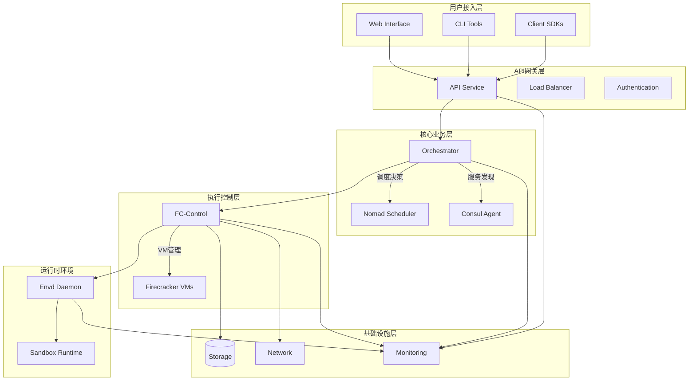
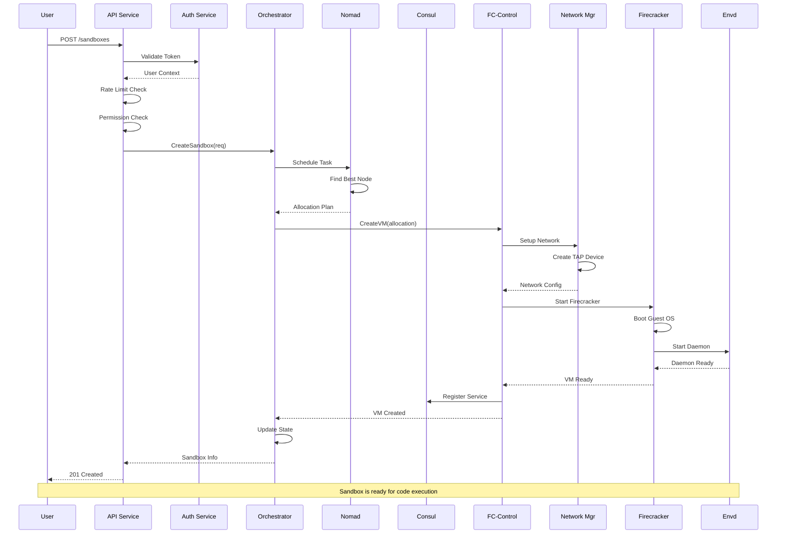
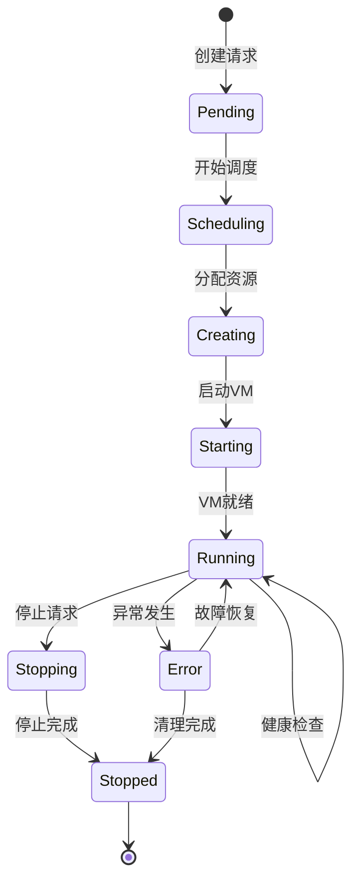
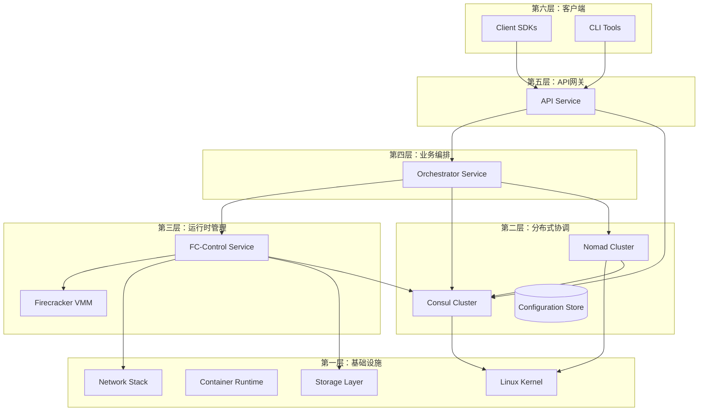
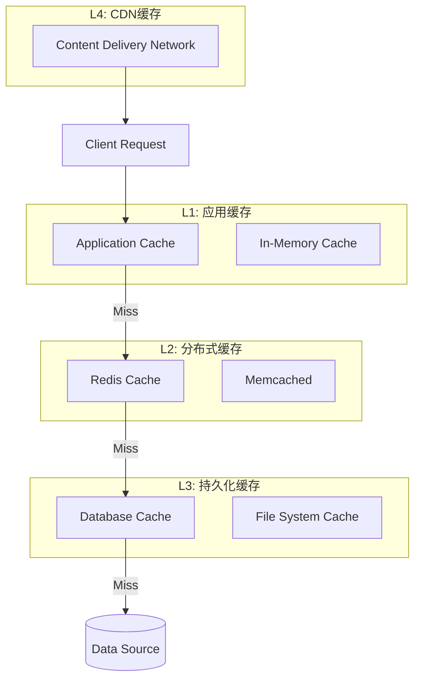
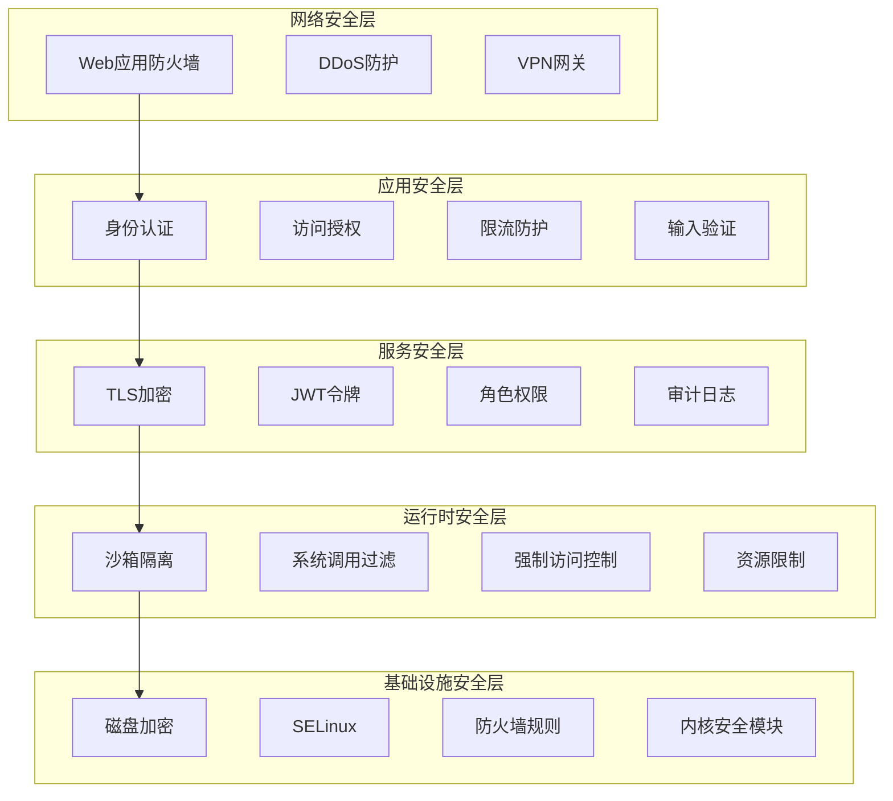
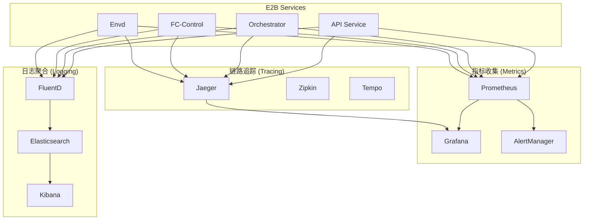

# E2B Infrastructure 架构洞察与总结

## 1. 定位与使命 (Positioning & Mission)

### 整体定位回顾
E2B Infrastructure 构建了一个完整的分布式代码执行平台生态系统，通过微服务架构和云原生技术栈，实现了从用户请求到代码执行的全链路服务。

### 系统使命达成
- ✅ **安全隔离**: 通过 Firecracker 微虚拟机实现强隔离
- ✅ **高可扩展**: 分布式架构支持水平扩展
- ✅ **高可用**: 多层冗余和自动故障恢复
- ✅ **高性能**: 毫秒级虚拟机启动和智能调度

## 2. 架构设计哲学的实现 (Design Philosophy Implementation)

### 微服务架构的完美实践



### 设计原则的体现

#### 1. 单一职责原则
每个服务都有明确的职责边界：
- **API Service**: 专注于请求处理和认证授权
- **Orchestrator**: 专注于服务协调和状态管理
- **FC-Control**: 专注于虚拟机生命周期管理
- **Envd**: 专注于沙箱内部环境管理
- **Consul**: 专注于服务发现和配置管理
- **Nomad**: 专注于工作负载调度和资源管理

#### 2. 开闭原则
系统通过接口和插件机制支持扩展：
```go
// 调度策略可扩展
type SchedulingStrategy interface {
    Schedule(ctx context.Context, req *ScheduleRequest) (*ScheduleResponse, error)
    Name() string
    Priority() int
}

// 健康检查器可扩展
type HealthChecker interface {
    Check(ctx context.Context, target string) (*HealthStatus, error)
    Type() string
}

// 运行时驱动可扩展
type RuntimeDriver interface {
    Start(ctx context.Context, config *RuntimeConfig) error
    Stop(ctx context.Context, id string) error
    Status(ctx context.Context, id string) (*RuntimeStatus, error)
}
```

#### 3. 依赖倒置原则
高层模块不依赖低层模块，都依赖于抽象：
```go
// Orchestrator 依赖抽象接口
type Orchestrator struct {
    scheduler       SchedulerInterface      // 而非具体的 Nomad
    serviceRegistry ServiceRegistryInterface // 而非具体的 Consul
    vmController    VMControllerInterface   // 而非具体的 FC-Control
}
```

## 3. 核心数据流分析 (Core Data Flow Analysis)

### 沙箱创建的完整数据流


### 关键数据结构的生命周期

#### 沙箱生命周期状态机


#### 资源分配状态流转
```go
// 资源分配的状态变化
type ResourceAllocationState int

const (
    AllocationStatePending ResourceAllocationState = iota
    AllocationStateScheduled
    AllocationStateAllocated
    AllocationStateReserved
    AllocationStateActive
    AllocationStateReleasing
    AllocationStateReleased
    AllocationStateError
)

// 状态转换规则
var AllocationStateTransitions = map[ResourceAllocationState][]ResourceAllocationState{
    AllocationStatePending:   {AllocationStateScheduled, AllocationStateError},
    AllocationStateScheduled: {AllocationStateAllocated, AllocationStateError},
    AllocationStateAllocated: {AllocationStateReserved, AllocationStateError},
    AllocationStateReserved:  {AllocationStateActive, AllocationStateReleasing},
    AllocationStateActive:    {AllocationStateReleasing, AllocationStateError},
    AllocationStateReleasing: {AllocationStateReleased, AllocationStateError},
    AllocationStateError:     {AllocationStateReleasing, AllocationStateReleased},
}
```

## 4. 关键接口设计分析 (Key Interface Design Analysis)

### 服务间通信协议栈

#### 1. 同步通信 - gRPC
```protobuf
// orchestrator.proto
service OrchestratorService {
    rpc CreateSandbox(CreateSandboxRequest) returns (CreateSandboxResponse);
    rpc GetSandbox(GetSandboxRequest) returns (GetSandboxResponse);
    rpc ListSandboxes(ListSandboxesRequest) returns (ListSandboxesResponse);
    rpc DeleteSandbox(DeleteSandboxRequest) returns (DeleteSandboxResponse);
}

// fc-control.proto
service FCControlService {
    rpc CreateVM(CreateVMRequest) returns (CreateVMResponse);
    rpc GetVMStatus(GetVMStatusRequest) returns (GetVMStatusResponse);
    rpc StopVM(StopVMRequest) returns (StopVMResponse);
}
```

#### 2. 异步通信 - 事件驱动
```go
// 事件总线设计
type EventBus interface {
    Publish(ctx context.Context, event Event) error
    Subscribe(ctx context.Context, eventType EventType, handler EventHandler) error
    Unsubscribe(ctx context.Context, eventType EventType, handler EventHandler) error
}

// 关键事件类型
type EventType string

const (
    EventSandboxCreated   EventType = "sandbox.created"
    EventSandboxStarted   EventType = "sandbox.started"
    EventSandboxStopped   EventType = "sandbox.stopped"
    EventSandboxError     EventType = "sandbox.error"
    EventNodeJoined       EventType = "node.joined"
    EventNodeLeft         EventType = "node.left"
    EventResourceExhausted EventType = "resource.exhausted"
)
```

#### 3. 流式通信 - WebSocket/Server-Sent Events
```go
// 实时数据流接口
type StreamingService interface {
    StreamSandboxLogs(ctx context.Context, sandboxID string) (<-chan LogEntry, error)
    StreamSandboxMetrics(ctx context.Context, sandboxID string) (<-chan MetricData, error)
    StreamSandboxEvents(ctx context.Context, filters EventFilters) (<-chan Event, error)
}
```

### API设计最佳实践

#### RESTful API 设计
```yaml
# OpenAPI 3.0 规范示例
paths:
  /api/v1/sandboxes:
    post:
      summary: "创建新沙箱"
      operationId: "createSandbox"
      requestBody:
        required: true
        content:
          application/json:
            schema:
              $ref: '#/components/schemas/CreateSandboxRequest'
      responses:
        '201':
          description: "沙箱创建成功"
          content:
            application/json:
              schema:
                $ref: '#/components/schemas/Sandbox'
        '400':
          $ref: '#/components/responses/BadRequest'
        '401':
          $ref: '#/components/responses/Unauthorized'
        '429':
          $ref: '#/components/responses/RateLimited'
```

## 5. 依赖关系深度分析 (Deep Dependency Analysis)

### 服务依赖层次结构


### 循环依赖检测和避免
```go
// 依赖注入容器避免循环依赖
type ServiceContainer struct {
    services map[string]interface{}
    deps     map[string][]string
}

// 拓扑排序确保正确的启动顺序
func (sc *ServiceContainer) StartServices(ctx context.Context) error {
    startOrder, err := sc.topologicalSort()
    if err != nil {
        return fmt.Errorf("circular dependency detected: %v", err)
    }
    
    for _, serviceName := range startOrder {
        if err := sc.startService(ctx, serviceName); err != nil {
            return fmt.Errorf("failed to start service %s: %v", serviceName, err)
        }
    }
    
    return nil
}
```

### 故障传播和隔离机制
```go
// 断路器模式实现
type CircuitBreaker struct {
    state           CircuitState
    failureCount    int
    failureThreshold int
    timeout         time.Duration
    lastFailureTime time.Time
}

func (cb *CircuitBreaker) Call(ctx context.Context, fn func() error) error {
    switch cb.state {
    case CircuitStateClosed:
        err := fn()
        if err != nil {
            cb.recordFailure()
            return err
        }
        cb.recordSuccess()
        return nil
        
    case CircuitStateOpen:
        if time.Since(cb.lastFailureTime) > cb.timeout {
            cb.state = CircuitStateHalfOpen
            return cb.Call(ctx, fn)
        }
        return ErrCircuitOpen
        
    case CircuitStateHalfOpen:
        err := fn()
        if err != nil {
            cb.state = CircuitStateOpen
            cb.recordFailure()
            return err
        }
        cb.state = CircuitStateClosed
        cb.recordSuccess()
        return nil
    }
    
    return nil
}
```

## 6. 性能优化深度洞察 (Performance Optimization Insights)

### 关键性能指标体系

#### 延迟优化
```go
// 性能指标定义
type PerformanceMetrics struct {
    // 端到端延迟
    SandboxCreationLatency    time.Duration // 沙箱创建延迟
    CodeExecutionLatency      time.Duration // 代码执行延迟
    APIResponseLatency        time.Duration // API响应延迟
    
    // 组件延迟
    SchedulingLatency         time.Duration // 调度延迟
    VMStartupLatency          time.Duration // VM启动延迟
    NetworkSetupLatency       time.Duration // 网络设置延迟
    
    // 吞吐量指标
    RequestsPerSecond         float64       // 每秒请求数
    SandboxesPerMinute        float64       // 每分钟创建沙箱数
    ConcurrentSandboxes       int           // 并发沙箱数
    
    // 资源利用率
    CPUUtilization            float64       // CPU使用率
    MemoryUtilization         float64       // 内存使用率
    NetworkUtilization        float64       // 网络使用率
}
```

#### 缓存策略层次化


### 关键路径优化

#### 沙箱创建的性能瓶颈分析
```go
// 性能分析器
type PerformanceProfiler struct {
    traces map[string]*TraceContext
}

type TraceContext struct {
    TraceID    string
    SpanID     string
    StartTime  time.Time
    EndTime    time.Time
    Duration   time.Duration
    Operations []Operation
}

type Operation struct {
    Name      string
    StartTime time.Time
    EndTime   time.Time
    Duration  time.Duration
    Tags      map[string]string
}

// 关键路径追踪
func (pp *PerformanceProfiler) TraceCreateSandbox(ctx context.Context, req *CreateSandboxRequest) {
    trace := &TraceContext{
        TraceID:   generateTraceID(),
        StartTime: time.Now(),
    }
    
    // 1. API处理阶段
    trace.AddOperation("api.validation", func() error {
        return validateRequest(req)
    })
    
    // 2. 调度阶段
    trace.AddOperation("scheduling.node_selection", func() error {
        return selectOptimalNode(req)
    })
    
    // 3. 资源分配阶段
    trace.AddOperation("resource.allocation", func() error {
        return allocateResources(req)
    })
    
    // 4. VM创建阶段
    trace.AddOperation("vm.creation", func() error {
        return createFirecrackerVM(req)
    })
    
    // 5. 网络设置阶段
    trace.AddOperation("network.setup", func() error {
        return setupVMNetwork(req)
    })
    
    // 6. 服务注册阶段
    trace.AddOperation("service.registration", func() error {
        return registerSandboxService(req)
    })
    
    trace.EndTime = time.Now()
    trace.Duration = trace.EndTime.Sub(trace.StartTime)
    
    // 分析瓶颈
    pp.analyzeBottlenecks(trace)
}
```

## 7. 可扩展性设计洞察 (Scalability Design Insights)

### 水平扩展策略

#### 无状态服务设计
```go
// 无状态服务接口
type StatelessService interface {
    // 服务实例可以任意替换
    ProcessRequest(ctx context.Context, req Request) (Response, error)
    
    // 不保存任何会话状态
    GetState() StatelessServiceState // 只返回只读配置状态
}

// 状态外部化存储
type StateStore interface {
    Get(ctx context.Context, key string) ([]byte, error)
    Set(ctx context.Context, key string, value []byte, ttl time.Duration) error
    Delete(ctx context.Context, key string) error
    Watch(ctx context.Context, key string) (<-chan WatchEvent, error)
}
```

#### 自动扩缩容机制
```yaml
# Kubernetes HPA 配置示例
apiVersion: autoscaling/v2
kind: HorizontalPodAutoscaler
metadata:
  name: e2b-api-service
spec:
  scaleTargetRef:
    apiVersion: apps/v1
    kind: Deployment
    name: e2b-api-service
  minReplicas: 3
  maxReplicas: 100
  metrics:
  - type: Resource
    resource:
      name: cpu
      target:
        type: Utilization
        averageUtilization: 70
  - type: Resource
    resource:
      name: memory
      target:
        type: Utilization
        averageUtilization: 80
  - type: Pods
    pods:
      metric:
        name: requests_per_second
      target:
        type: AverageValue
        averageValue: "1000"
  behavior:
    scaleUp:
      stabilizationWindowSeconds: 60
      policies:
      - type: Percent
        value: 100
        periodSeconds: 15
    scaleDown:
      stabilizationWindowSeconds: 300
      policies:
      - type: Percent
        value: 50
        periodSeconds: 60
```

### 垂直扩展优化

#### 资源池化和复用
```go
// 资源池管理器
type ResourcePoolManager struct {
    pools map[ResourceType]*ResourcePool
    mutex sync.RWMutex
}

type ResourcePool struct {
    Type        ResourceType
    Available   []Resource
    InUse       map[string]Resource
    MaxSize     int
    MinSize     int
    
    // 预热策略
    WarmupCount int
    WarmupFunc  func() Resource
    
    // 清理策略
    IdleTimeout time.Duration
    MaxAge      time.Duration
}

func (rpm *ResourcePoolManager) GetResource(ctx context.Context, resourceType ResourceType) (Resource, error) {
    pool := rpm.getPool(resourceType)
    
    // 尝试从池中获取
    if resource := pool.TryGet(); resource != nil {
        return resource, nil
    }
    
    // 池为空，创建新资源
    if pool.CanExpand() {
        return pool.CreateNew(ctx)
    }
    
    // 等待资源释放
    return pool.WaitForAvailable(ctx)
}
```

## 8. 安全架构深度解析 (Security Architecture Deep Analysis)

### 多层安全防护体系


### 零信任安全模型实现
```go
// 零信任验证器
type ZeroTrustValidator struct {
    identityVerifier    IdentityVerifier
    deviceVerifier      DeviceVerifier
    networkVerifier     NetworkVerifier
    behaviorAnalyzer    BehaviorAnalyzer
    policyEngine        PolicyEngine
}

func (ztv *ZeroTrustValidator) ValidateRequest(ctx context.Context, req *Request) (*ValidationResult, error) {
    result := &ValidationResult{}
    
    // 1. 身份验证
    identity, err := ztv.identityVerifier.Verify(ctx, req.Credentials)
    if err != nil {
        return nil, fmt.Errorf("identity verification failed: %v", err)
    }
    result.Identity = identity
    
    // 2. 设备验证
    device, err := ztv.deviceVerifier.Verify(ctx, req.DeviceInfo)
    if err != nil {
        return nil, fmt.Errorf("device verification failed: %v", err)
    }
    result.Device = device
    
    // 3. 网络验证
    network, err := ztv.networkVerifier.Verify(ctx, req.NetworkInfo)
    if err != nil {
        return nil, fmt.Errorf("network verification failed: %v", err)
    }
    result.Network = network
    
    // 4. 行为分析
    behavior, err := ztv.behaviorAnalyzer.Analyze(ctx, req, identity)
    if err != nil {
        return nil, fmt.Errorf("behavior analysis failed: %v", err)
    }
    result.Behavior = behavior
    
    // 5. 策略评估
    decision, err := ztv.policyEngine.Evaluate(ctx, &PolicyContext{
        Identity: identity,
        Device:   device,
        Network:  network,
        Behavior: behavior,
        Request:  req,
    })
    if err != nil {
        return nil, fmt.Errorf("policy evaluation failed: %v", err)
    }
    result.Decision = decision
    
    return result, nil
}
```

## 9. 监控和观测性体系 (Monitoring & Observability System)

### 三大支柱：指标、日志、链路追踪


### SLI/SLO/SLA 体系设计
```yaml
# 服务等级指标 (SLI)
sli:
  availability:
    name: "服务可用性"
    query: "up{job='e2b-api'} / count(up{job='e2b-api'})"
    
  latency:
    name: "响应延迟"
    query: "histogram_quantile(0.99, http_request_duration_seconds_bucket{job='e2b-api'})"
    
  error_rate:
    name: "错误率"
    query: "rate(http_requests_total{job='e2b-api',status=~'5..'}[5m]) / rate(http_requests_total{job='e2b-api'}[5m])"

# 服务等级目标 (SLO)
slo:
  availability:
    target: 99.9%
    window: "30d"
    
  latency:
    target: "< 200ms"
    percentile: 99
    window: "24h"
    
  error_rate:
    target: "< 0.1%"
    window: "1h"

# 服务等级协议 (SLA)
sla:
  availability:
    commitment: 99.5%
    measurement_window: "monthly"
    penalty: "service credits"
    
  response_time:
    commitment: "< 500ms"
    percentile: 95
    penalty: "performance credits"
```

## 10. 技术债务与改进建议 (Technical Debt & Improvement Recommendations)

### 已识别的技术债务

#### 1. 架构层面
- **服务粒度**: 某些服务职责过重，需要进一步拆分
- **数据一致性**: 分布式事务处理可以进一步优化
- **配置管理**: 配置分散，需要统一配置中心

#### 2. 代码层面
```go
// 需要重构的代码模式
// 反例：过长的函数
func (s *SandboxService) CreateSandbox(ctx context.Context, req *CreateSandboxRequest) error {
    // 100+ lines of code with multiple responsibilities
    // 应该拆分为多个小函数
}

// 正例：重构后的清晰结构
func (s *SandboxService) CreateSandbox(ctx context.Context, req *CreateSandboxRequest) error {
    if err := s.validateRequest(req); err != nil {
        return err
    }
    
    allocation, err := s.scheduleResources(ctx, req)
    if err != nil {
        return err
    }
    
    vm, err := s.createVM(ctx, allocation)
    if err != nil {
        return err
    }
    
    return s.registerSandbox(ctx, vm)
}
```

### 改进路线图

#### Phase 1: 基础优化 (0-3个月)
- [ ] 完善监控和告警体系
- [ ] 优化关键路径性能
- [ ] 增强错误处理和恢复机制
- [ ] 统一日志格式和标准

#### Phase 2: 架构升级 (3-6个月)
- [ ] 引入服务网格 (Istio)
- [ ] 实现配置中心统一管理
- [ ] 优化数据库设计和查询性能
- [ ] 增强安全审计和合规性

#### Phase 3: 创新功能 (6-12个月)
- [ ] 实现智能调度算法
- [ ] 引入机器学习进行预测性维护
- [ ] 支持多云部署和混合云
- [ ] 开发自动化运维工具

## 总结与展望

E2B Infrastructure 通过精心设计的微服务架构和云原生技术栈，成功构建了一个高度可扩展、安全可靠的分布式代码执行平台。其核心优势包括：

### 🎯 技术优势
1. **微服务架构**: 良好的服务边界划分和职责分离
2. **云原生设计**: 充分利用容器化和编排技术
3. **安全隔离**: 多层安全防护体系
4. **高性能**: 毫秒级响应和智能资源调度
5. **可观测性**: 完善的监控、日志和追踪体系

### 🚀 创新亮点
1. **Firecracker集成**: 轻量级虚拟机提供极佳性能
2. **智能调度**: 基于多维度指标的资源调度算法
3. **弹性伸缩**: 自适应的扩缩容机制
4. **故障自愈**: 自动检测和恢复能力

### 📈 未来发展方向
1. **AI驱动优化**: 利用机器学习优化资源调度和性能预测
2. **边缘计算支持**: 扩展到边缘节点降低延迟
3. **多云战略**: 支持混合云和多云部署
4. **生态系统扩展**: 丰富开发者工具和集成能力

E2B Infrastructure 为现代代码执行平台树立了新的标杆，其设计思想和实现方案为同类系统提供了宝贵的参考价值。