# Code Interpreter 项目总览

> 🎯 **文档定位**: Code Interpreter 是一个类似于 E2B 的代码执行平台，提供安全、隔离的代码执行环境，支持多种编程语言和运行时。本文档为项目的整体架构和功能概览。

## 1. 定位与使命 (Positioning & Mission)

### 1.1 项目定位
Code Interpreter 是一个现代化的代码执行平台，旨在为开发者、教育机构和企业提供安全、可靠的代码运行环境。

### 1.2 核心问题
- **安全隔离**: 如何在共享环境中安全执行用户代码
- **多语言支持**: 如何统一管理不同编程语言和运行时
- **实时交互**: 如何提供流畅的代码执行和调试体验
- **资源管理**: 如何有效管理计算资源和并发访问

### 1.3 应用场景
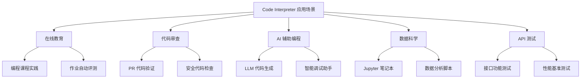

### 1.4 能力边界
- **支持语言**: JavaScript/Node.js、Python、Go、Rust、Java 等
- **执行时限**: 单次执行最长 30 分钟
- **资源限制**: CPU、内存、磁盘空间可配置
- **网络访问**: 受控的外部网络访问

## 2. 设计思想与哲学基石 (Design Philosophy)

### 2.1 核心设计理念

#### 安全第一 (Security First)
```rust
// 沙箱隔离的核心思想
pub struct SandboxConfig {
    pub resource_limits: ResourceLimits,
    pub network_policy: NetworkPolicy,
    pub filesystem_access: FilesystemAccess,
}

impl SandboxConfig {
    // 默认配置采用最严格的安全策略
    pub fn default_secure() -> Self {
        Self {
            resource_limits: ResourceLimits::conservative(),
            network_policy: NetworkPolicy::restricted(),
            filesystem_access: FilesystemAccess::sandboxed(),
        }
    }
}
```

#### 用户体验至上 (UX First)
- **低延迟启动**: 沙箱环境 <2 秒启动
- **实时反馈**: WebSocket 实时输出
- **智能补全**: 上下文感知的代码提示

#### 可扩展性 (Scalability)
- **水平扩展**: 支持多节点集群部署
- **负载均衡**: 智能任务调度
- **资源池管理**: 预热容器池

### 2.2 架构哲学

#### 微服务架构
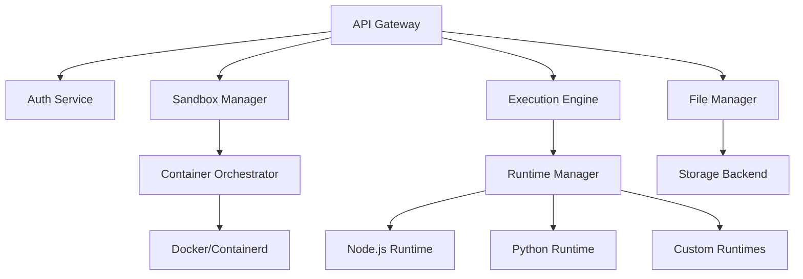

#### 事件驱动设计
```typescript
// 事件驱动的执行流程
interface ExecutionEvent {
    type: 'start' | 'output' | 'error' | 'complete';
    sandboxId: string;
    timestamp: number;
    data: any;
}

class ExecutionEventBus {
    private handlers = new Map<string, EventHandler[]>();
    
    emit(event: ExecutionEvent) {
        const handlers = this.handlers.get(event.type) || [];
        handlers.forEach(handler => handler(event));
    }
}
```

## 3. 技术栈与架构选型

### 3.1 核心技术栈

| 组件 | 技术选型 | 理由 |
|------|---------|------|
| **API 服务** | Node.js + Express/Fastify | 高性能、生态丰富 |
| **沙箱运行时** | Docker + containerd | 成熟的容器化方案 |
| **消息队列** | Redis + Bull | 任务调度和状态管理 |
| **数据存储** | PostgreSQL + Redis | 结构化数据和缓存 |
| **文件存储** | S3 兼容存储 | 分布式文件管理 |
| **监控告警** | Prometheus + Grafana | 完整的监控方案 |

### 3.2 SDK 架构设计

#### JavaScript SDK 架构
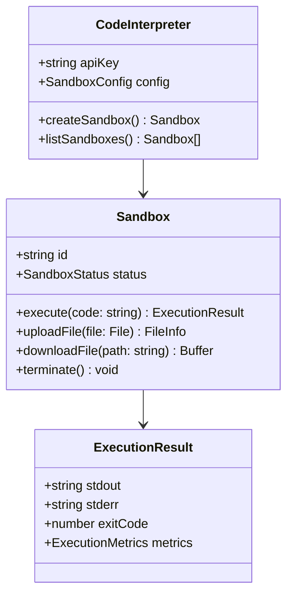

#### Python SDK 架构
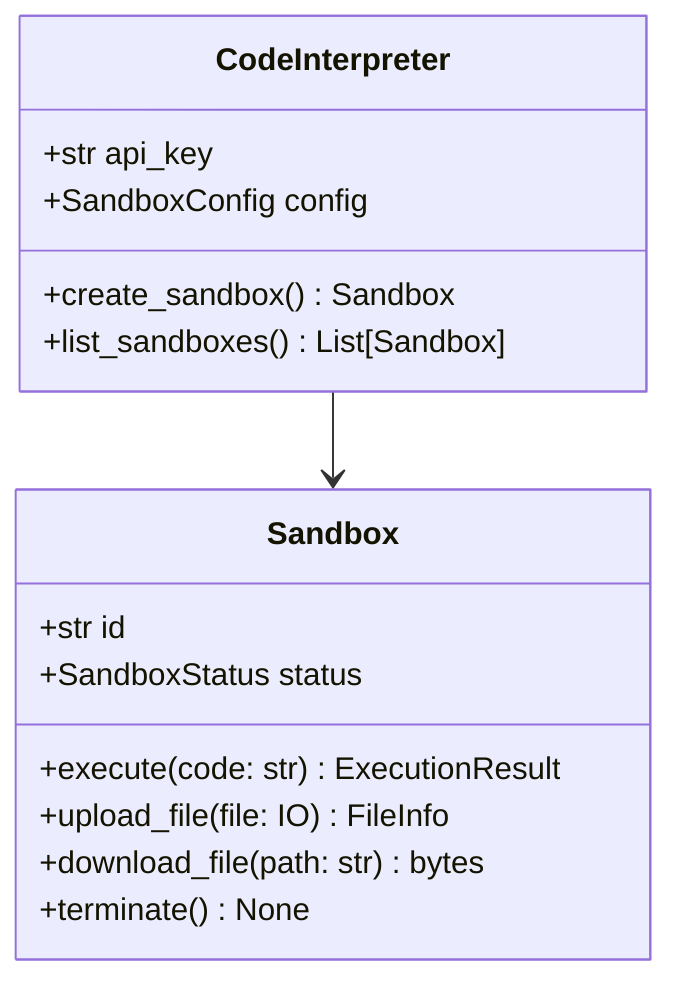

## 4. 核心功能模块

### 4.1 沙箱管理 (Sandbox Management)

#### 生命周期管理
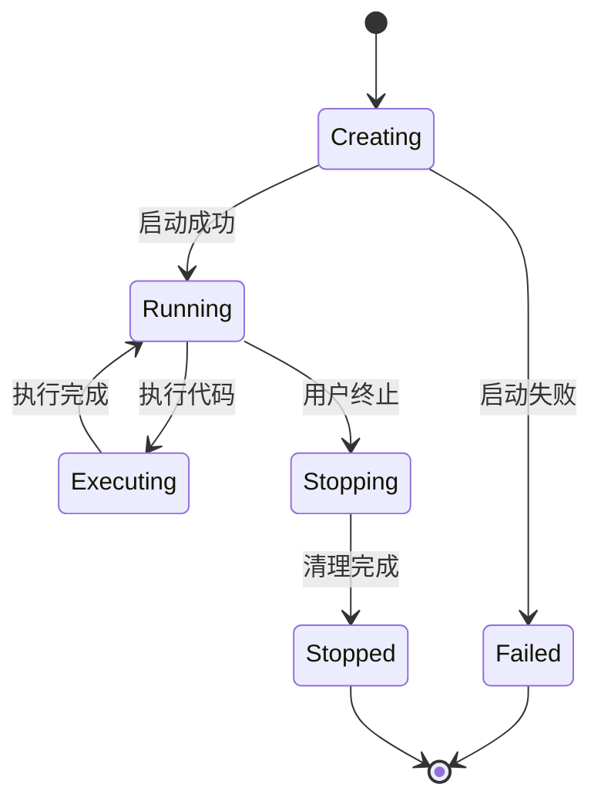

#### 资源监控
```javascript
class SandboxMonitor {
    constructor(sandboxId) {
        this.sandboxId = sandboxId;
        this.metrics = {
            cpu: new CpuMetrics(),
            memory: new MemoryMetrics(),
            network: new NetworkMetrics(),
            filesystem: new FilesystemMetrics()
        };
    }
    
    async collectMetrics() {
        return {
            timestamp: Date.now(),
            cpu: await this.metrics.cpu.collect(),
            memory: await this.metrics.memory.collect(),
            network: await this.metrics.network.collect(),
            filesystem: await this.metrics.filesystem.collect()
        };
    }
}
```

### 4.2 代码执行引擎 (Execution Engine)

#### 多语言支持
```typescript
interface RuntimeAdapter {
    language: string;
    version: string;
    execute(code: string, options: ExecutionOptions): Promise<ExecutionResult>;
    validate(code: string): ValidationResult;
}

class NodeJSAdapter implements RuntimeAdapter {
    language = 'javascript';
    version = '18.17.0';
    
    async execute(code: string, options: ExecutionOptions) {
        const vm = new VM({
            timeout: options.timeout,
            sandbox: this.createSandbox(options)
        });
        
        return vm.run(code);
    }
}
```

### 4.3 文件管理系统 (File Management)

#### 虚拟文件系统
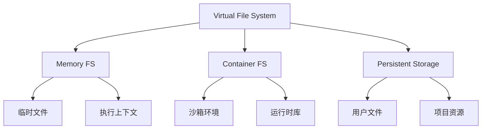

## 5. 实时通信架构

### 5.1 WebSocket 连接管理
```typescript
class SandboxWebSocketManager {
    private connections = new Map<string, WebSocket>();
    
    addConnection(sandboxId: string, ws: WebSocket) {
        this.connections.set(sandboxId, ws);
        
        // 监听沙箱事件并转发
        this.sandbox.on('output', (data) => {
            ws.send(JSON.stringify({
                type: 'output',
                data
            }));
        });
    }
    
    broadcast(sandboxId: string, message: any) {
        const ws = this.connections.get(sandboxId);
        if (ws && ws.readyState === WebSocket.OPEN) {
            ws.send(JSON.stringify(message));
        }
    }
}
```

### 5.2 事件流处理
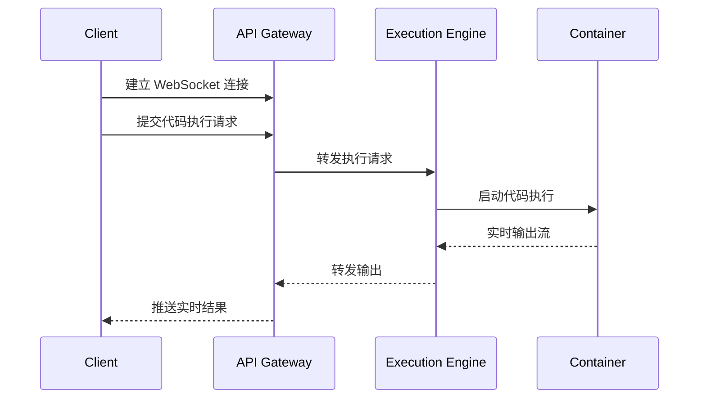

## 6. 安全模型

### 6.1 多层安全防护
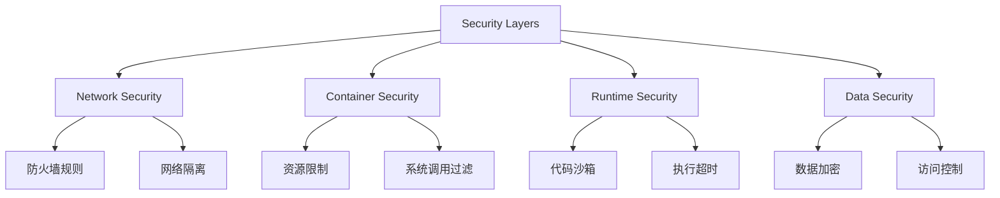

### 6.2 权限管理
```rust
pub struct SecurityContext {
    pub user_id: UserId,
    pub permissions: Vec<Permission>,
    pub resource_limits: ResourceLimits,
    pub network_policy: NetworkPolicy,
}

impl SecurityContext {
    pub fn can_execute(&self, code: &Code) -> bool {
        self.permissions.contains(&Permission::CodeExecution) &&
        self.validate_code_safety(code)
    }
    
    fn validate_code_safety(&self, code: &Code) -> bool {
        // 静态代码分析
        // 检查危险操作
        // 验证资源使用
        true
    }
}
```

## 7. 性能优化策略

### 7.1 容器预热池
```typescript
class ContainerPool {
    private warmPool = new Map<string, Container[]>();
    private maxPoolSize = 10;
    
    async getContainer(runtime: string): Promise<Container> {
        const pool = this.warmPool.get(runtime) || [];
        
        if (pool.length > 0) {
            return pool.pop()!;
        }
        
        return this.createNewContainer(runtime);
    }
    
    async releaseContainer(container: Container) {
        const runtime = container.runtime;
        const pool = this.warmPool.get(runtime) || [];
        
        if (pool.length < this.maxPoolSize) {
            await container.reset();
            pool.push(container);
        } else {
            await container.destroy();
        }
    }
}
```

### 7.2 缓存策略
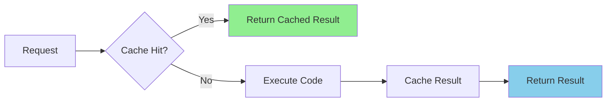

## 8. 监控与可观测性

### 8.1 指标体系
```typescript
interface Metrics {
    // 业务指标
    executions_total: Counter;
    execution_duration: Histogram;
    sandbox_creation_time: Histogram;
    
    // 系统指标  
    cpu_usage: Gauge;
    memory_usage: Gauge;
    container_count: Gauge;
    
    // 错误指标
    execution_errors: Counter;
    timeout_errors: Counter;
    resource_limit_errors: Counter;
}
```

### 8.2 日志结构
```json
{
    "timestamp": "2024-03-20T10:30:00Z",
    "level": "INFO",
    "service": "execution-engine",
    "sandbox_id": "sb_123456",
    "user_id": "user_789",
    "event": "code_execution_start",
    "metadata": {
        "language": "python",
        "code_size": 1024,
        "timeout": 30000
    }
}
```

## 9. 部署架构

### 9.1 生产环境架构
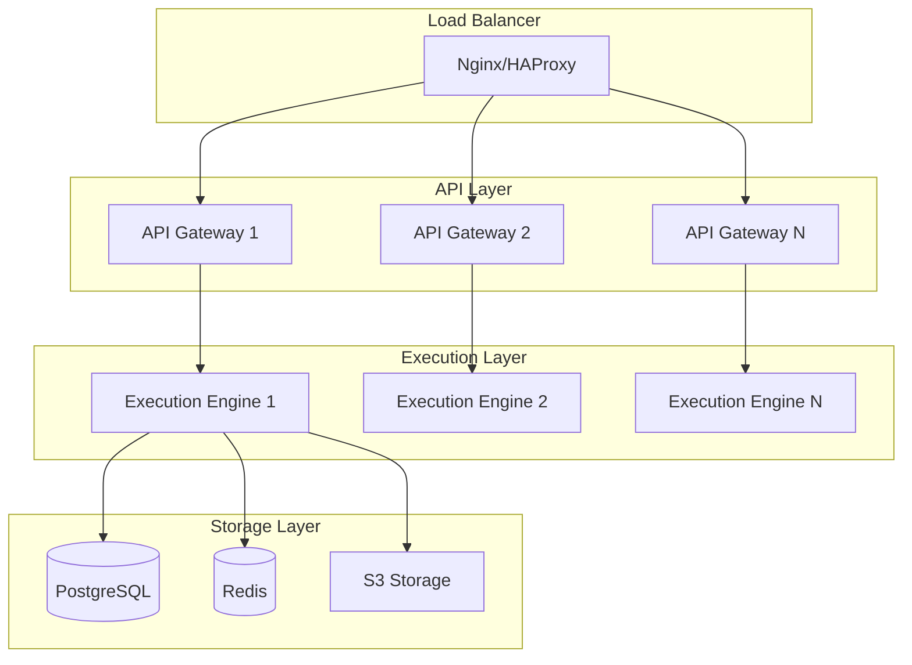

### 9.2 容器编排
```yaml
# docker-compose.yml 示例
version: '3.8'
services:
  api-gateway:
    image: code-interpreter/api:latest
    ports:
      - "3000:3000"
    environment:
      - DATABASE_URL=postgresql://user:pass@db:5432/codeint
      - REDIS_URL=redis://redis:6379
    depends_on:
      - db
      - redis
      
  execution-engine:
    image: code-interpreter/executor:latest
    privileged: true
    volumes:
      - /var/run/docker.sock:/var/run/docker.sock
    environment:
      - CONTAINER_RUNTIME=docker
      - MAX_CONTAINERS=50
      
  db:
    image: postgres:15
    environment:
      - POSTGRES_DB=codeint
      - POSTGRES_USER=user
      - POSTGRES_PASSWORD=pass
      
  redis:
    image: redis:7-alpine
```

## 10. 路线图与发展规划

### 10.1 版本规划
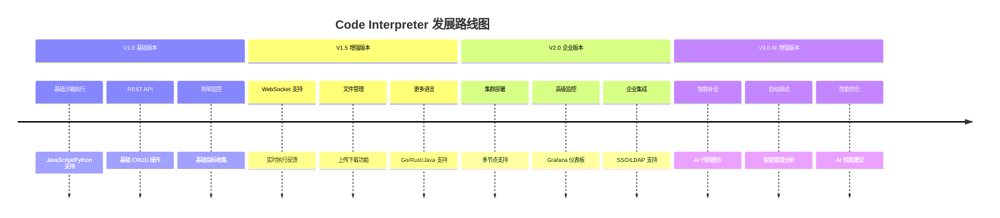

### 10.2 技术演进方向
- **AI 集成**: 代码智能补全、自动调试、性能优化建议
- **边缘计算**: 分布式执行节点，降低延迟
- **WebAssembly**: 更安全高效的代码执行环境
- **Serverless**: 按需计费的无服务器架构

## 11. 与 E2B 对比分析

| 特性对比 | Code Interpreter | E2B | 优势 |
|----------|-----------------|-----|------|
| **架构设计** | 微服务架构 | 单体架构 | 更好的可扩展性 |
| **语言支持** | 6+ 种语言 | 主要支持 Python | 更广泛的生态 |
| **实时通信** | WebSocket 原生支持 | 轮询机制 | 更低的延迟 |
| **容器管理** | 预热池 + 智能调度 | 按需创建 | 更快的启动速度 |
| **监控体系** | 全链路可观测性 | 基础监控 | 更好的运维体验 |

## 总结

Code Interpreter 项目通过现代化的架构设计和全面的功能规划，旨在成为下一代代码执行平台的标杆。项目不仅注重技术实现的先进性，更关注用户体验和企业级需求的满足。

通过本文档的总览，我们可以看到项目在安全性、性能、可扩展性等方面的深度考量，以及对未来技术发展趋势的前瞻性布局。后续的文档将深入到各个模块的具体实现细节，为开发者提供完整的技术指导。

---

**下一篇文档**: [架构设计](docs/23_code_interpreter_architecture.md) - 深入解析 Code Interpreter 的技术架构和设计决策