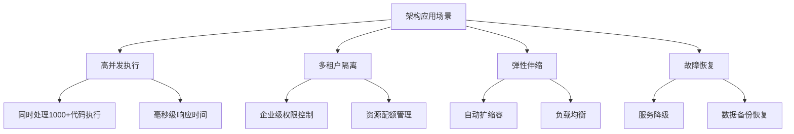
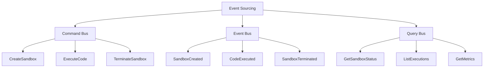
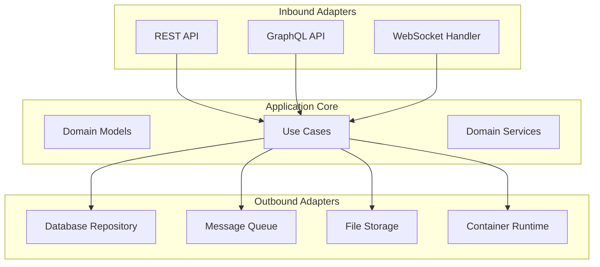
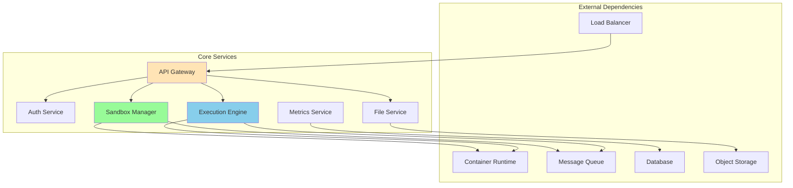
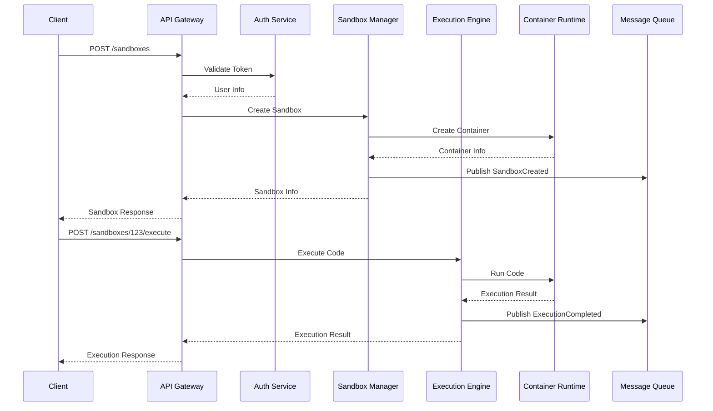
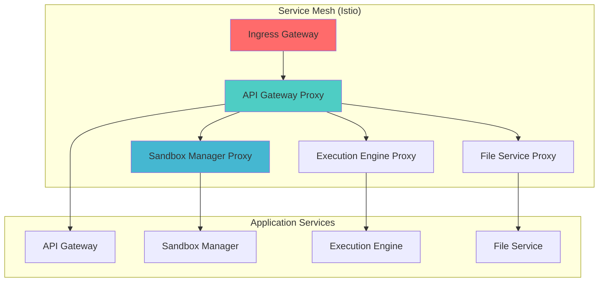
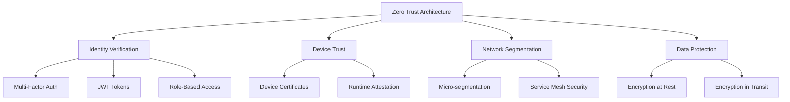
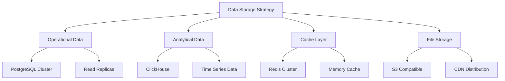
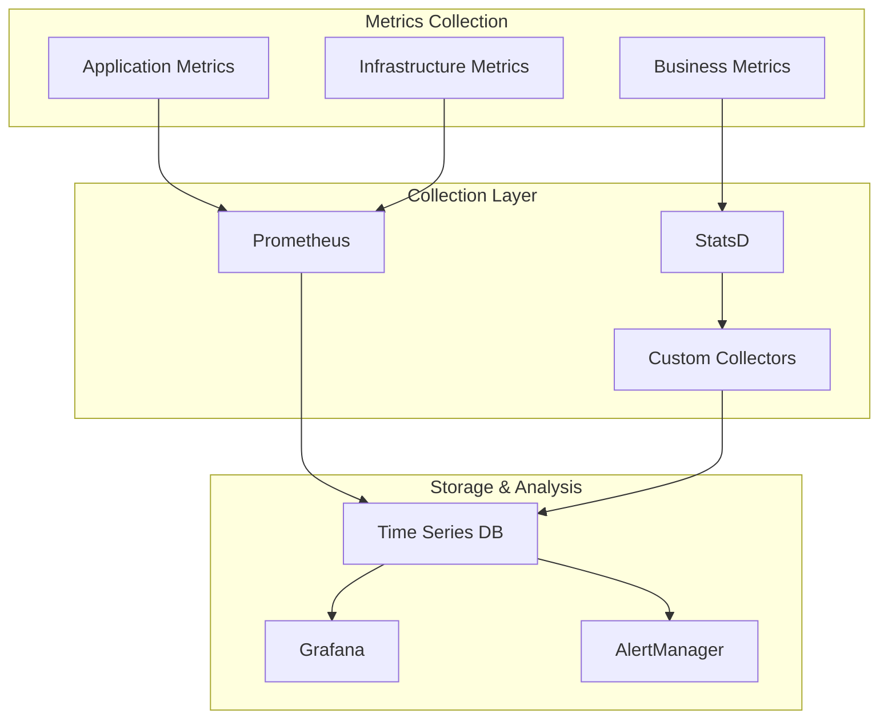

# Code Interpreter 架构设计

> 🎯 **文档定位**: 深入解析 Code Interpreter 的系统架构设计，包括微服务拆分、数据流设计、安全架构等核心技术决策。基于五步显化法的架构分析。

## 1. 定位与使命 (Positioning & Mission)

### 1.1 架构定位
Code Interpreter 采用云原生微服务架构，旨在构建高可用、高性能、高扩展性的代码执行平台。

### 1.2 核心问题
- **服务拆分**: 如何合理划分微服务边界
- **数据一致性**: 如何在分布式环境下保证数据一致性
- **性能优化**: 如何在安全隔离和执行性能间取得平衡
- **故障隔离**: 如何设计容错和降级机制

### 1.3 应用场景


### 1.4 架构边界
- **水平扩展**: 支持 100+ 节点集群
- **并发处理**: 单节点 1000+ 并发沙箱
- **响应时间**: API 响应 <100ms，沙箱启动 <2s
- **可用性**: 99.9% SLA 保证

## 2. 设计思想与哲学基石 (Design Philosophy)

### 2.1 架构设计原则

#### 领域驱动设计 (DDD)
```typescript
// 领域模型清晰定义
export namespace CodeExecution {
    export interface Sandbox {
        id: SandboxId;
        userId: UserId;
        status: SandboxStatus;
        runtime: Runtime;
        resources: ResourceAllocation;
    }
    
    export interface Execution {
        id: ExecutionId;
        sandboxId: SandboxId;
        code: SourceCode;
        result: ExecutionResult;
        metrics: ExecutionMetrics;
    }
}
```

#### 单一职责原则
每个微服务只负责一个明确的业务职责：
- **API Gateway**: 请求路由和认证
- **Sandbox Manager**: 沙箱生命周期管理
- **Execution Engine**: 代码执行逻辑
- **File Service**: 文件存储和管理
- **Metrics Service**: 监控和指标收集

#### 事件驱动架构


### 2.2 架构模式选择

#### CQRS (命令查询分离)
```typescript
// Command Side - 写操作
interface SandboxCommandHandler {
    handle(command: CreateSandboxCommand): Promise<void>;
    handle(command: ExecuteCodeCommand): Promise<void>;
    handle(command: TerminateSandboxCommand): Promise<void>;
}

// Query Side - 读操作
interface SandboxQueryHandler {
    handle(query: GetSandboxQuery): Promise<SandboxView>;
    handle(query: ListSandboxesQuery): Promise<SandboxView[]>;
    handle(query: GetExecutionHistoryQuery): Promise<ExecutionView[]>;
}
```

#### 六边形架构 (端口适配器)


## 3. 核心数据结构定义 (Core Data Structures)

### 3.1 领域实体定义

#### Sandbox 实体
```typescript
export class Sandbox {
    constructor(
        public readonly id: SandboxId,
        public readonly userId: UserId,
        public readonly runtime: Runtime,
        private _status: SandboxStatus,
        private _resources: ResourceAllocation,
        private _createdAt: Date,
        private _lastAccessedAt: Date
    ) {}
    
    public execute(code: SourceCode): ExecutionResult {
        if (this._status !== SandboxStatus.RUNNING) {
            throw new InvalidSandboxStateError('Sandbox is not running');
        }
        
        this._lastAccessedAt = new Date();
        return this.runtime.execute(code);
    }
    
    public terminate(): void {
        this._status = SandboxStatus.TERMINATING;
        this.runtime.cleanup();
    }
}
```

#### Execution 聚合根
```typescript
export class Execution {
    private _events: DomainEvent[] = [];
    
    constructor(
        public readonly id: ExecutionId,
        public readonly sandboxId: SandboxId,
        public readonly code: SourceCode,
        private _status: ExecutionStatus,
        private _result?: ExecutionResult
    ) {}
    
    public start(): void {
        this._status = ExecutionStatus.RUNNING;
        this.addEvent(new ExecutionStartedEvent(this.id, this.sandboxId));
    }
    
    public complete(result: ExecutionResult): void {
        this._status = ExecutionStatus.COMPLETED;
        this._result = result;
        this.addEvent(new ExecutionCompletedEvent(this.id, result));
    }
    
    private addEvent(event: DomainEvent): void {
        this._events.push(event);
    }
}
```

### 3.2 值对象定义
```typescript
export class ResourceAllocation {
    constructor(
        public readonly cpuLimitCores: number,
        public readonly memoryLimitMB: number,
        public readonly diskLimitMB: number,
        public readonly networkBandwidthMbps: number
    ) {
        if (cpuLimitCores <= 0 || cpuLimitCores > 16) {
            throw new InvalidResourceAllocationError('CPU limit must be between 0 and 16 cores');
        }
        if (memoryLimitMB <= 0 || memoryLimitMB > 32768) {
            throw new InvalidResourceAllocationError('Memory limit must be between 0 and 32GB');
        }
    }
}

export class SourceCode {
    constructor(
        public readonly content: string,
        public readonly language: ProgrammingLanguage,
        public readonly dependencies: Dependency[]
    ) {
        this.validateContent();
    }
    
    private validateContent(): void {
        if (this.content.length > 1024 * 1024) { // 1MB limit
            throw new CodeTooLargeError('Source code exceeds 1MB limit');
        }
    }
}
```

## 4. 核心接口与逻辑实现 (Core Interfaces)

### 4.1 微服务接口定义

#### API Gateway 接口
```typescript
@Controller('/api/v1')
export class SandboxController {
    constructor(
        private readonly commandBus: CommandBus,
        private readonly queryBus: QueryBus
    ) {}
    
    @Post('/sandboxes')
    @UseGuards(AuthGuard)
    async createSandbox(@Body() request: CreateSandboxRequest): Promise<SandboxResponse> {
        const command = new CreateSandboxCommand(
            request.runtime,
            request.resources,
            this.getCurrentUserId()
        );
        
        const sandboxId = await this.commandBus.execute(command);
        return this.queryBus.execute(new GetSandboxQuery(sandboxId));
    }
    
    @Post('/sandboxes/:id/execute')
    async executeCode(
        @Param('id') sandboxId: string,
        @Body() request: ExecuteCodeRequest
    ): Promise<ExecutionResponse> {
        const command = new ExecuteCodeCommand(
            sandboxId,
            request.code,
            request.language
        );
        
        return this.commandBus.execute(command);
    }
}
```

#### Sandbox Manager 服务接口
```typescript
export interface ISandboxManager {
    createSandbox(spec: SandboxSpec): Promise<Sandbox>;
    getSandbox(id: SandboxId): Promise<Sandbox>;
    listSandboxes(userId: UserId): Promise<Sandbox[]>;
    terminateSandbox(id: SandboxId): Promise<void>;
}

@Injectable()
export class SandboxManager implements ISandboxManager {
    constructor(
        private readonly containerOrchestrator: IContainerOrchestrator,
        private readonly sandboxRepository: ISandboxRepository,
        private readonly eventBus: IEventBus
    ) {}
    
    async createSandbox(spec: SandboxSpec): Promise<Sandbox> {
        // 1. 验证规格
        this.validateSpec(spec);
        
        // 2. 创建容器
        const container = await this.containerOrchestrator.createContainer({
            image: this.getImageForRuntime(spec.runtime),
            resources: spec.resources,
            networkPolicy: spec.networkPolicy
        });
        
        // 3. 创建沙箱实体
        const sandbox = new Sandbox(
            SandboxId.generate(),
            spec.userId,
            spec.runtime,
            SandboxStatus.CREATING,
            spec.resources,
            new Date(),
            new Date()
        );
        
        // 4. 保存到仓储
        await this.sandboxRepository.save(sandbox);
        
        // 5. 发布事件
        await this.eventBus.publish(new SandboxCreatedEvent(sandbox));
        
        return sandbox;
    }
}
```

### 4.2 执行引擎核心逻辑
```typescript
@Injectable()
export class ExecutionEngine {
    constructor(
        private readonly runtimeAdapters: Map<Runtime, IRuntimeAdapter>,
        private readonly executionRepository: IExecutionRepository,
        private readonly metricsCollector: IMetricsCollector
    ) {}
    
    async execute(request: ExecutionRequest): Promise<ExecutionResult> {
        const execution = new Execution(
            ExecutionId.generate(),
            request.sandboxId,
            request.code,
            ExecutionStatus.PENDING
        );
        
        try {
            // 1. 开始执行
            execution.start();
            await this.executionRepository.save(execution);
            
            // 2. 获取运行时适配器
            const adapter = this.getRuntimeAdapter(request.language);
            
            // 3. 设置执行上下文
            const context = await this.createExecutionContext(request);
            
            // 4. 执行代码
            const result = await adapter.execute(request.code, context);
            
            // 5. 完成执行
            execution.complete(result);
            await this.executionRepository.save(execution);
            
            // 6. 收集指标
            await this.metricsCollector.recordExecution(execution);
            
            return result;
            
        } catch (error) {
            execution.fail(error);
            await this.executionRepository.save(execution);
            throw error;
        }
    }
    
    private async createExecutionContext(request: ExecutionRequest): Promise<ExecutionContext> {
        return {
            timeout: request.timeout || 30000,
            memoryLimit: request.memoryLimit || 512,
            networkAccess: request.networkAccess || false,
            environmentVariables: request.env || {}
        };
    }
}
```

## 5. 依赖关系与交互 (Dependencies & Interactions)

### 5.1 服务依赖图


### 5.2 数据流架构


### 5.3 事件流处理
```typescript
// 事件发布者
export class SandboxEventPublisher {
    constructor(private readonly eventBus: IEventBus) {}
    
    async publishSandboxCreated(sandbox: Sandbox): Promise<void> {
        const event = new SandboxCreatedEvent(
            sandbox.id,
            sandbox.userId,
            sandbox.runtime,
            new Date()
        );
        
        await this.eventBus.publish('sandbox.created', event);
    }
}

// 事件订阅者
@EventHandler('sandbox.created')
export class SandboxCreatedHandler {
    constructor(
        private readonly metricsService: IMetricsService,
        private readonly notificationService: INotificationService
    ) {}
    
    async handle(event: SandboxCreatedEvent): Promise<void> {
        // 更新指标
        await this.metricsService.incrementCounter('sandboxes.created');
        
        // 发送通知（如果需要）
        if (event.userId && this.shouldNotify(event)) {
            await this.notificationService.sendSandboxReadyNotification(
                event.userId,
                event.sandboxId
            );
        }
    }
}
```

## 6. 容器编排架构

### 6.1 Kubernetes 部署架构
```yaml
# sandbox-manager-deployment.yaml
apiVersion: apps/v1
kind: Deployment
metadata:
  name: sandbox-manager
  labels:
    app: sandbox-manager
spec:
  replicas: 3
  selector:
    matchLabels:
      app: sandbox-manager
  template:
    metadata:
      labels:
        app: sandbox-manager
    spec:
      containers:
      - name: sandbox-manager
        image: code-interpreter/sandbox-manager:latest
        ports:
        - containerPort: 3000
        env:
        - name: DATABASE_URL
          valueFrom:
            secretKeyRef:
              name: db-secret
              key: url
        - name: REDIS_URL
          valueFrom:
            secretKeyRef:
              name: redis-secret
              key: url
        resources:
          requests:
            memory: "512Mi"
            cpu: "250m"
          limits:
            memory: "1Gi"
            cpu: "500m"
        livenessProbe:
          httpGet:
            path: /health
            port: 3000
          initialDelaySeconds: 30
          periodSeconds: 10
        readinessProbe:
          httpGet:
            path: /ready
            port: 3000
          initialDelaySeconds: 5
          periodSeconds: 5
```

### 6.2 服务网格架构


## 7. 安全架构设计

### 7.1 零信任安全模型


### 7.2 沙箱安全隔离
```typescript
export class SecurityManager {
    private readonly seccompProfile: SeccompProfile;
    private readonly apparmorProfile: ApparmorProfile;
    
    constructor() {
        this.seccompProfile = this.createRestrictiveSeccompProfile();
        this.apparmorProfile = this.createContainerApparmorProfile();
    }
    
    createSandboxSecurityContext(spec: SandboxSpec): SecurityContext {
        return {
            // 用户命名空间隔离
            userNamespace: {
                enabled: true,
                uidMappings: [{ containerUID: 0, hostUID: 1000, size: 1 }],
                gidMappings: [{ containerGID: 0, hostGID: 1000, size: 1 }]
            },
            
            // 能力限制
            capabilities: {
                drop: ['ALL'],
                add: [] // 不添加任何能力
            },
            
            // 只读根文件系统
            readOnlyRootFilesystem: true,
            
            // 禁止特权升级
            allowPrivilegeEscalation: false,
            
            // 非 root 用户运行
            runAsNonRoot: true,
            runAsUser: 1000,
            
            // Seccomp 配置
            seccompProfile: this.seccompProfile,
            
            // AppArmor 配置
            apparmorProfile: this.apparmorProfile
        };
    }
}
```

## 8. 数据架构设计

### 8.1 数据存储策略


### 8.2 数据模型设计
```sql
-- 沙箱表
CREATE TABLE sandboxes (
    id UUID PRIMARY KEY DEFAULT gen_random_uuid(),
    user_id UUID NOT NULL,
    runtime VARCHAR(50) NOT NULL,
    status VARCHAR(20) NOT NULL DEFAULT 'creating',
    resources JSONB NOT NULL,
    container_id VARCHAR(255),
    created_at TIMESTAMP WITH TIME ZONE DEFAULT NOW(),
    updated_at TIMESTAMP WITH TIME ZONE DEFAULT NOW(),
    terminated_at TIMESTAMP WITH TIME ZONE,
    
    INDEX idx_user_id (user_id),
    INDEX idx_status (status),
    INDEX idx_created_at (created_at)
);

-- 执行记录表
CREATE TABLE executions (
    id UUID PRIMARY KEY DEFAULT gen_random_uuid(),
    sandbox_id UUID NOT NULL REFERENCES sandboxes(id),
    code TEXT NOT NULL,
    language VARCHAR(50) NOT NULL,
    status VARCHAR(20) NOT NULL DEFAULT 'pending',
    result JSONB,
    metrics JSONB,
    started_at TIMESTAMP WITH TIME ZONE DEFAULT NOW(),
    completed_at TIMESTAMP WITH TIME ZONE,
    
    INDEX idx_sandbox_id (sandbox_id),
    INDEX idx_status (status),
    INDEX idx_started_at (started_at)
);

-- 资源使用指标表（时序数据）
CREATE TABLE resource_metrics (
    timestamp TIMESTAMP WITH TIME ZONE NOT NULL,
    sandbox_id UUID NOT NULL,
    cpu_usage DECIMAL(5,2),
    memory_usage_mb INTEGER,
    disk_usage_mb INTEGER,
    network_rx_bytes BIGINT,
    network_tx_bytes BIGINT,
    
    PRIMARY KEY (timestamp, sandbox_id)
) PARTITION BY RANGE (timestamp);
```

## 9. 性能架构优化

### 9.1 缓存架构
```typescript
export class CacheManager {
    private readonly l1Cache: Map<string, any> = new Map(); // 内存缓存
    private readonly l2Cache: Redis; // Redis 缓存
    private readonly l3Cache: S3Client; // 持久存储
    
    async get<T>(key: string, ttl?: number): Promise<T | null> {
        // L1 缓存检查
        if (this.l1Cache.has(key)) {
            return this.l1Cache.get(key);
        }
        
        // L2 缓存检查
        const l2Value = await this.l2Cache.get(key);
        if (l2Value) {
            this.l1Cache.set(key, JSON.parse(l2Value));
            return JSON.parse(l2Value);
        }
        
        // L3 缓存检查（冷数据）
        const l3Value = await this.getColdData(key);
        if (l3Value) {
            await this.set(key, l3Value, ttl);
            return l3Value;
        }
        
        return null;
    }
    
    async set(key: string, value: any, ttl: number = 3600): Promise<void> {
        // 写入所有缓存层
        this.l1Cache.set(key, value);
        await this.l2Cache.setex(key, ttl, JSON.stringify(value));
        
        // 异步写入持久存储
        this.writeColdData(key, value).catch(console.error);
    }
}
```

### 9.2 连接池管理
```typescript
export class ConnectionPoolManager {
    private readonly pools = new Map<string, Pool>();
    
    constructor(private readonly config: PoolConfig) {}
    
    getPool(runtime: string): Pool {
        if (!this.pools.has(runtime)) {
            this.pools.set(runtime, this.createPool(runtime));
        }
        return this.pools.get(runtime)!;
    }
    
    private createPool(runtime: string): Pool {
        return new Pool({
            create: () => this.createConnection(runtime),
            destroy: (connection) => connection.close(),
            validate: (connection) => connection.isAlive(),
            
            // 池配置
            min: this.config.minConnections,
            max: this.config.maxConnections,
            acquireTimeoutMillis: this.config.acquireTimeout,
            idleTimeoutMillis: this.config.idleTimeout,
            
            // 健康检查
            testOnBorrow: true,
            testOnReturn: false,
            testWhileIdle: true,
            timeBetweenEvictionRunsMillis: 30000
        });
    }
}
```

## 10. 监控架构设计

### 10.1 指标收集架构


### 10.2 分布式链路追踪
```typescript
import { trace, context } from '@opentelemetry/api';

export class TracingService {
    private readonly tracer = trace.getTracer('code-interpreter');
    
    async executeWithTracing<T>(
        operationName: string,
        operation: () => Promise<T>,
        attributes?: Record<string, any>
    ): Promise<T> {
        const span = this.tracer.startSpan(operationName, {
            attributes: {
                service: 'execution-engine',
                ...attributes
            }
        });
        
        return context.with(trace.setSpan(context.active(), span), async () => {
            try {
                const result = await operation();
                span.setStatus({ code: SpanStatusCode.OK });
                return result;
            } catch (error) {
                span.setStatus({ 
                    code: SpanStatusCode.ERROR,
                    message: error.message 
                });
                span.recordException(error);
                throw error;
            } finally {
                span.end();
            }
        });
    }
}
```

## 11. 弹性架构设计

### 11.1 熔断器模式
```typescript
export class CircuitBreaker {
    private state: 'CLOSED' | 'OPEN' | 'HALF_OPEN' = 'CLOSED';
    private failureCount = 0;
    private lastFailureTime = 0;
    private nextAttempt = 0;
    
    constructor(
        private readonly threshold: number = 5,
        private readonly timeout: number = 60000,
        private readonly monitor: (error: Error) => boolean
    ) {}
    
    async execute<T>(operation: () => Promise<T>): Promise<T> {
        if (this.state === 'OPEN') {
            if (Date.now() < this.nextAttempt) {
                throw new CircuitBreakerOpenError('Circuit breaker is OPEN');
            }
            this.state = 'HALF_OPEN';
        }
        
        try {
            const result = await operation();
            this.onSuccess();
            return result;
        } catch (error) {
            this.onFailure(error);
            throw error;
        }
    }
    
    private onSuccess(): void {
        this.failureCount = 0;
        this.state = 'CLOSED';
    }
    
    private onFailure(error: Error): void {
        if (this.monitor(error)) {
            this.failureCount++;
            this.lastFailureTime = Date.now();
            
            if (this.failureCount >= this.threshold) {
                this.state = 'OPEN';
                this.nextAttempt = Date.now() + this.timeout;
            }
        }
    }
}
```

### 11.2 自动扩缩容
```yaml
# hpa.yaml - 水平自动扩缩容
apiVersion: autoscaling/v2
kind: HorizontalPodAutoscaler
metadata:
  name: execution-engine-hpa
spec:
  scaleTargetRef:
    apiVersion: apps/v1
    kind: Deployment
    name: execution-engine
  minReplicas: 2
  maxReplicas: 50
  metrics:
  - type: Resource
    resource:
      name: cpu
      target:
        type: Utilization
        averageUtilization: 70
  - type: Resource
    resource:
      name: memory
      target:
        type: Utilization
        averageUtilization: 80
  - type: Pods
    pods:
      metric:
        name: active_sandboxes
      target:
        type: AverageValue
        averageValue: "10"
```

## 总结

Code Interpreter 的架构设计体现了现代云原生应用的最佳实践：

1. **微服务架构**: 清晰的服务边界和职责分离
2. **事件驱动**: 异步处理和松耦合设计
3. **容器化部署**: 标准化的部署和运维
4. **安全第一**: 多层安全防护和零信任模型
5. **弹性设计**: 自动扩缩容和容错机制
6. **可观测性**: 全链路监控和指标收集

这套架构不仅能够满足当前的功能需求，更具备了应对未来业务增长和技术演进的能力。通过合理的抽象和模块化设计，为后续的功能扩展和性能优化奠定了坚实的基础。

---

**下一篇文档**: [JavaScript SDK 核心模块](docs/24_code_interpreter_js_sdk_index.md) - 深入分析 JavaScript SDK 的核心实现