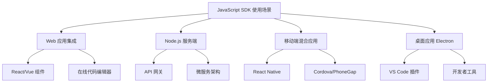
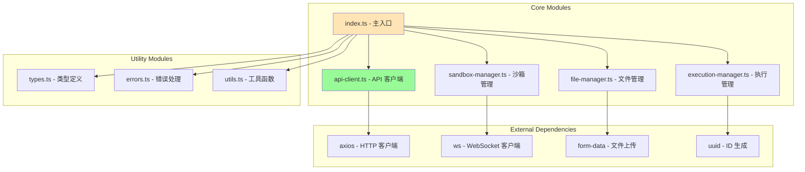
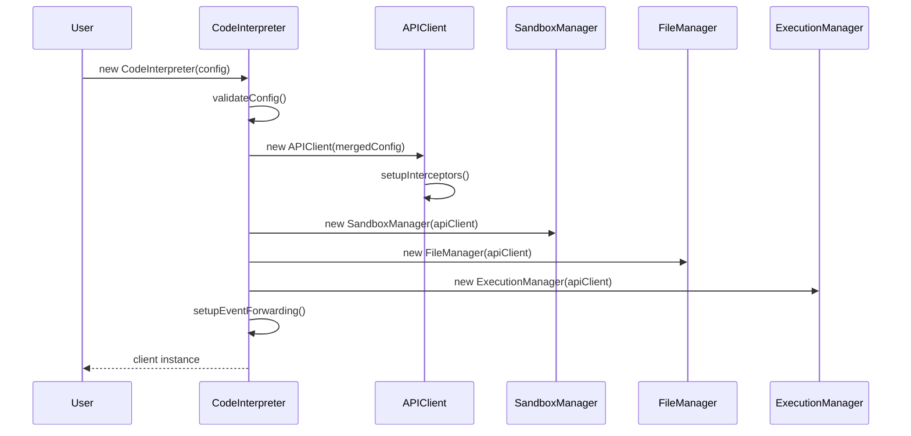
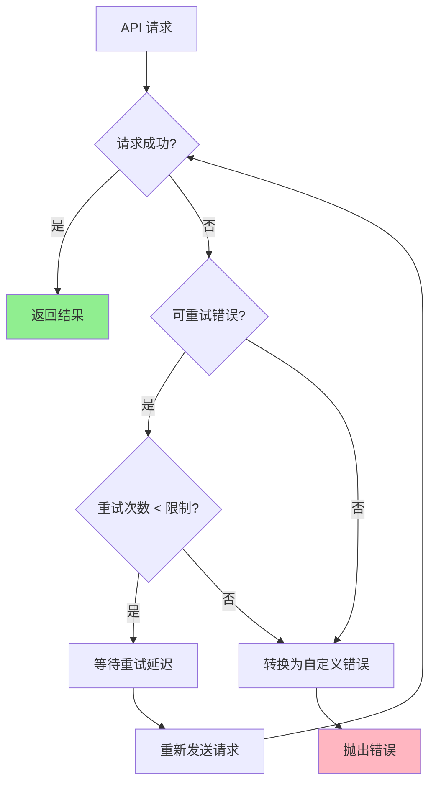

# JavaScript SDK 核心模块

> 🎯 **文档定位**: 深入分析 Code Interpreter JavaScript SDK 的核心实现，包括主入口模块、API 设计、客户端初始化等关键组件。基于五步显化法的模块化分析。

## 1. 定位与使命 (Positioning & Mission)

### 1.1 模块定位
JavaScript SDK 的 `index.ts` 模块是整个 SDK 的主入口，负责统一导出核心 API、初始化客户端配置、提供开发者友好的接口。

### 1.2 核心问题
- **API 统一性**: 如何提供一致的 API 接口体验
- **配置管理**: 如何处理多样化的客户端配置需求
- **类型安全**: 如何确保 TypeScript 类型定义的完整性
- **向后兼容**: 如何在版本升级中保持 API 稳定性

### 1.3 应用场景


### 1.4 模块边界
- **导出范围**: 核心类、工具函数、类型定义
- **平台支持**: Browser、Node.js 14+
- **包大小**: 压缩后 <100KB
- **依赖管理**: 最小化外部依赖

## 2. 设计思想与哲学基石 (Design Philosophy)

### 2.1 API 设计哲学

#### 简洁性原则 (Simplicity First)
```typescript
// 简洁的 API 设计
import { CodeInterpreter } from 'code-interpreter-sdk';

const client = new CodeInterpreter({
  apiKey: 'your-api-key'
});

const sandbox = await client.sandboxes.create({
  runtime: 'node18'
});
```

#### 链式调用支持 (Fluent Interface)
```typescript
// 流畅的链式调用
const result = await client
  .sandboxes
  .create({ runtime: 'python' })
  .then(sandbox => sandbox.execute('print("Hello World")'))
  .then(execution => execution.waitForCompletion());
```

#### 类型安全优先 (Type Safety First)
```typescript
// 强类型支持
export interface SandboxCreateOptions {
  runtime: 'node14' | 'node16' | 'node18' | 'python3.9' | 'python3.10';
  resources?: {
    cpu?: number;
    memory?: number;
    timeout?: number;
  };
  environment?: Record<string, string>;
}

export interface ExecutionResult {
  id: string;
  status: 'pending' | 'running' | 'completed' | 'failed';
  stdout: string;
  stderr: string;
  exitCode: number | null;
  metrics: ExecutionMetrics;
}
```

### 2.2 错误处理哲学

#### 分层错误处理
```typescript
// 错误类型分层
export abstract class CodeInterpreterError extends Error {
  abstract readonly code: string;
  abstract readonly category: 'client' | 'server' | 'network' | 'timeout';
}

export class APIError extends CodeInterpreterError {
  readonly category = 'server';
  constructor(public readonly code: string, message: string, public readonly statusCode: number) {
    super(message);
  }
}

export class NetworkError extends CodeInterpreterError {
  readonly category = 'network';
  readonly code = 'NETWORK_ERROR';
}

export class TimeoutError extends CodeInterpreterError {
  readonly category = 'timeout';
  readonly code = 'TIMEOUT_ERROR';
}
```

## 3. 核心数据结构定义 (Core Data Structures)

### 3.1 客户端配置结构
```typescript
export interface CodeInterpreterConfig {
  /** API 密钥 */
  apiKey: string;
  
  /** 基础 URL，默认为官方端点 */
  baseURL?: string;
  
  /** 请求超时时间（毫秒） */
  timeout?: number;
  
  /** 重试配置 */
  retry?: {
    attempts: number;
    delay: number;
    backoff: 'linear' | 'exponential';
  };
  
  /** 代理配置 */
  proxy?: {
    host: string;
    port: number;
    auth?: {
      username: string;
      password: string;
    };
  };
  
  /** 自定义请求头 */
  headers?: Record<string, string>;
  
  /** 调试模式 */
  debug?: boolean;
}

// 默认配置
export const DEFAULT_CONFIG: Required<Omit<CodeInterpreterConfig, 'apiKey'>> = {
  baseURL: 'https://api.code-interpreter.dev',
  timeout: 30000,
  retry: {
    attempts: 3,
    delay: 1000,
    backoff: 'exponential'
  },
  proxy: undefined,
  headers: {},
  debug: false
};
```

### 3.2 资源管理器结构
```typescript
export interface ResourceManager {
  sandboxes: SandboxManager;
  files: FileManager;
  executions: ExecutionManager;
  templates: TemplateManager;
}

export interface SandboxManager {
  create(options: SandboxCreateOptions): Promise<Sandbox>;
  get(id: string): Promise<Sandbox>;
  list(filters?: SandboxListFilters): Promise<Sandbox[]>;
  delete(id: string): Promise<void>;
}

export interface FileManager {
  upload(sandboxId: string, file: File | Buffer, path: string): Promise<FileInfo>;
  download(sandboxId: string, path: string): Promise<Buffer>;
  list(sandboxId: string, directory?: string): Promise<FileInfo[]>;
  delete(sandboxId: string, path: string): Promise<void>;
}
```

### 3.3 事件系统结构
```typescript
export interface EventEmitter {
  on<T extends keyof Events>(event: T, listener: (data: Events[T]) => void): void;
  off<T extends keyof Events>(event: T, listener: (data: Events[T]) => void): void;
  emit<T extends keyof Events>(event: T, data: Events[T]): void;
}

export interface Events {
  'sandbox:created': { sandbox: Sandbox };
  'sandbox:deleted': { sandboxId: string };
  'execution:started': { execution: Execution };
  'execution:output': { executionId: string; output: string; stream: 'stdout' | 'stderr' };
  'execution:completed': { execution: Execution };
  'execution:failed': { executionId: string; error: Error };
  'connection:established': { sandboxId: string };
  'connection:lost': { sandboxId: string; reason: string };
}
```

## 4. 核心接口与逻辑实现 (Core Interfaces)

### 4.1 主客户端类实现
```typescript
import { EventEmitter } from 'events';
import { APIClient } from './api-client';
import { SandboxManager } from './sandbox-manager';
import { FileManager } from './file-manager';
import { ExecutionManager } from './execution-manager';

export class CodeInterpreter extends EventEmitter {
  private readonly apiClient: APIClient;
  public readonly sandboxes: SandboxManager;
  public readonly files: FileManager;
  public readonly executions: ExecutionManager;
  
  constructor(config: CodeInterpreterConfig) {
    super();
    
    // 验证配置
    this.validateConfig(config);
    
    // 合并默认配置
    const mergedConfig = { ...DEFAULT_CONFIG, ...config };
    
    // 初始化 API 客户端
    this.apiClient = new APIClient(mergedConfig);
    
    // 初始化资源管理器
    this.sandboxes = new SandboxManager(this.apiClient);
    this.files = new FileManager(this.apiClient);
    this.executions = new ExecutionManager(this.apiClient);
    
    // 设置事件转发
    this.setupEventForwarding();
  }
  
  private validateConfig(config: CodeInterpreterConfig): void {
    if (!config.apiKey) {
      throw new Error('API key is required');
    }
    
    if (config.apiKey.length < 32) {
      throw new Error('Invalid API key format');
    }
    
    if (config.timeout && config.timeout <= 0) {
      throw new Error('Timeout must be a positive number');
    }
  }
  
  private setupEventForwarding(): void {
    // 转发子模块的事件到主客户端
    [this.sandboxes, this.files, this.executions].forEach(manager => {
      if (manager instanceof EventEmitter) {
        manager.on('*', (eventName: string, ...args: any[]) => {
          this.emit(eventName, ...args);
        });
      }
    });
  }
  
  /**
   * 获取客户端状态信息
   */
  async getStatus(): Promise<ClientStatus> {
    return {
      connected: await this.apiClient.isConnected(),
      version: this.getVersion(),
      config: this.getConfigSummary()
    };
  }
  
  /**
   * 测试 API 连接
   */
  async ping(): Promise<{ success: boolean; latency: number }> {
    const start = Date.now();
    try {
      await this.apiClient.get('/ping');
      return {
        success: true,
        latency: Date.now() - start
      };
    } catch (error) {
      return {
        success: false,
        latency: Date.now() - start
      };
    }
  }
}
```

### 4.2 API 客户端实现
```typescript
import axios, { AxiosInstance, AxiosRequestConfig, AxiosResponse } from 'axios';
import { RetryConfig } from './types';

export class APIClient {
  private readonly client: AxiosInstance;
  private readonly retryConfig: RetryConfig;
  
  constructor(config: CodeInterpreterConfig) {
    this.retryConfig = config.retry;
    
    this.client = axios.create({
      baseURL: config.baseURL,
      timeout: config.timeout,
      headers: {
        'Authorization': `Bearer ${config.apiKey}`,
        'User-Agent': `code-interpreter-js-sdk/${SDK_VERSION}`,
        'Content-Type': 'application/json',
        ...config.headers
      }
    });
    
    this.setupInterceptors();
  }
  
  private setupInterceptors(): void {
    // 请求拦截器
    this.client.interceptors.request.use(
      (config) => {
        // 添加请求 ID
        config.headers['X-Request-ID'] = this.generateRequestId();
        
        // 记录请求日志
        if (this.config.debug) {
          console.log(`[API Request] ${config.method?.toUpperCase()} ${config.url}`);
        }
        
        return config;
      },
      (error) => Promise.reject(error)
    );
    
    // 响应拦截器
    this.client.interceptors.response.use(
      (response) => {
        // 记录响应日志
        if (this.config.debug) {
          console.log(`[API Response] ${response.status} ${response.config.url}`);
        }
        
        return response;
      },
      async (error) => {
        // 处理重试逻辑
        if (this.shouldRetry(error)) {
          return this.retryRequest(error);
        }
        
        // 转换为自定义错误
        throw this.convertError(error);
      }
    );
  }
  
  private shouldRetry(error: any): boolean {
    if (!this.retryConfig || error.config.__retryCount >= this.retryConfig.attempts) {
      return false;
    }
    
    // 只重试特定类型的错误
    const retryableErrors = ['ECONNRESET', 'ENOTFOUND', 'ECONNABORTED'];
    const retryableStatuses = [408, 429, 500, 502, 503, 504];
    
    return (
      retryableErrors.includes(error.code) ||
      retryableStatuses.includes(error.response?.status)
    );
  }
  
  private async retryRequest(error: any): Promise<AxiosResponse> {
    const config = error.config;
    config.__retryCount = (config.__retryCount || 0) + 1;
    
    // 计算延迟时间
    const delay = this.calculateRetryDelay(config.__retryCount);
    
    await new Promise(resolve => setTimeout(resolve, delay));
    
    return this.client.request(config);
  }
  
  private calculateRetryDelay(attempt: number): number {
    const baseDelay = this.retryConfig.delay;
    
    if (this.retryConfig.backoff === 'exponential') {
      return baseDelay * Math.pow(2, attempt - 1);
    }
    
    return baseDelay * attempt;
  }
  
  private convertError(error: any): CodeInterpreterError {
    if (error.response) {
      return new APIError(
        error.response.data?.code || 'API_ERROR',
        error.response.data?.message || error.message,
        error.response.status
      );
    }
    
    if (error.code === 'ECONNABORTED') {
      return new TimeoutError('Request timeout');
    }
    
    return new NetworkError(error.message);
  }
  
  // HTTP 方法封装
  async get<T = any>(url: string, config?: AxiosRequestConfig): Promise<T> {
    const response = await this.client.get(url, config);
    return response.data;
  }
  
  async post<T = any>(url: string, data?: any, config?: AxiosRequestConfig): Promise<T> {
    const response = await this.client.post(url, data, config);
    return response.data;
  }
  
  async put<T = any>(url: string, data?: any, config?: AxiosRequestConfig): Promise<T> {
    const response = await this.client.put(url, data, config);
    return response.data;
  }
  
  async delete<T = any>(url: string, config?: AxiosRequestConfig): Promise<T> {
    const response = await this.client.delete(url, config);
    return response.data;
  }
}
```

### 4.3 工厂方法实现
```typescript
/**
 * 工厂方法：创建客户端实例
 */
export function createClient(config: CodeInterpreterConfig): CodeInterpreter {
  return new CodeInterpreter(config);
}

/**
 * 工厂方法：从环境变量创建客户端
 */
export function createClientFromEnv(): CodeInterpreter {
  const apiKey = process.env.CODE_INTERPRETER_API_KEY;
  if (!apiKey) {
    throw new Error('CODE_INTERPRETER_API_KEY environment variable is required');
  }
  
  const config: CodeInterpreterConfig = {
    apiKey,
    baseURL: process.env.CODE_INTERPRETER_BASE_URL,
    timeout: process.env.CODE_INTERPRETER_TIMEOUT ? 
      parseInt(process.env.CODE_INTERPRETER_TIMEOUT) : undefined,
    debug: process.env.CODE_INTERPRETER_DEBUG === 'true'
  };
  
  return new CodeInterpreter(config);
}

/**
 * 单例模式：全局客户端实例
 */
let globalClient: CodeInterpreter | null = null;

export function getGlobalClient(): CodeInterpreter {
  if (!globalClient) {
    throw new Error('Global client not initialized. Call setGlobalClient() first.');
  }
  return globalClient;
}

export function setGlobalClient(client: CodeInterpreter): void {
  globalClient = client;
}
```

## 5. 依赖关系与交互 (Dependencies & Interactions)

### 5.1 模块依赖图


### 5.2 初始化流程


### 5.3 错误处理流程


## 6. 使用示例与最佳实践

### 6.1 基础使用示例
```typescript
import { CodeInterpreter, SandboxCreateOptions } from 'code-interpreter-sdk';

// 初始化客户端
const client = new CodeInterpreter({
  apiKey: 'your-api-key',
  timeout: 30000,
  debug: true
});

async function basicUsage() {
  try {
    // 创建沙箱
    const sandbox = await client.sandboxes.create({
      runtime: 'node18',
      resources: {
        cpu: 1,
        memory: 512,
        timeout: 30000
      }
    });
    
    console.log('Sandbox created:', sandbox.id);
    
    // 执行代码
    const execution = await sandbox.execute(`
      console.log('Hello from Code Interpreter!');
      console.log('Node version:', process.version);
      
      // 简单计算
      const result = Array.from({length: 10}, (_, i) => i * i);
      console.log('Squares:', result);
    `);
    
    console.log('Execution result:', execution.stdout);
    
    // 清理资源
    await sandbox.terminate();
    
  } catch (error) {
    console.error('Error:', error.message);
  }
}

basicUsage();
```

### 6.2 高级用法示例
```typescript
import { CodeInterpreter } from 'code-interpreter-sdk';

// 使用环境变量初始化
const client = CodeInterpreter.fromEnv();

async function advancedUsage() {
  // 事件监听
  client.on('execution:output', (event) => {
    console.log(`[${event.stream}]`, event.output);
  });
  
  client.on('execution:completed', (event) => {
    console.log('Execution completed:', event.execution.id);
  });
  
  const sandbox = await client.sandboxes.create({
    runtime: 'python3.10',
    environment: {
      PYTHONPATH: '/workspace/lib',
      DEBUG: 'true'
    }
  });
  
  // 上传文件
  await client.files.upload(sandbox.id, 'data.csv', `
    name,age,city
    Alice,25,New York
    Bob,30,San Francisco  
    Charlie,35,Boston
  `);
  
  // 执行数据分析
  const execution = await sandbox.execute(`
    import pandas as pd
    import matplotlib.pyplot as plt
    
    # 读取数据
    df = pd.read_csv('data.csv')
    print('Data loaded:', df.shape)
    print(df.head())
    
    # 创建图表
    plt.figure(figsize=(10, 6))
    plt.bar(df['name'], df['age'])
    plt.title('Age Distribution')
    plt.xlabel('Name')
    plt.ylabel('Age')
    plt.savefig('chart.png', dpi=300, bbox_inches='tight')
    print('Chart saved as chart.png')
  `);
  
  // 下载生成的图表
  const chartData = await client.files.download(sandbox.id, 'chart.png');
  await fs.writeFile('downloaded_chart.png', chartData);
  
  await sandbox.terminate();
}
```

### 6.3 错误处理最佳实践
```typescript
import { 
  CodeInterpreter, 
  APIError, 
  NetworkError, 
  TimeoutError 
} from 'code-interpreter-sdk';

async function robustErrorHandling() {
  const client = new CodeInterpreter({
    apiKey: 'your-api-key',
    retry: {
      attempts: 3,
      delay: 1000,
      backoff: 'exponential'
    }
  });
  
  try {
    const sandbox = await client.sandboxes.create({
      runtime: 'node18'
    });
    
    const execution = await sandbox.execute('console.log("test")');
    
  } catch (error) {
    if (error instanceof APIError) {
      switch (error.code) {
        case 'QUOTA_EXCEEDED':
          console.error('Quota exceeded. Please upgrade your plan.');
          break;
        case 'INVALID_RUNTIME':
          console.error('Invalid runtime specified.');
          break;
        default:
          console.error(`API Error: ${error.message}`);
      }
    } else if (error instanceof NetworkError) {
      console.error('Network error. Please check your connection.');
    } else if (error instanceof TimeoutError) {
      console.error('Request timed out. Try increasing timeout value.');
    } else {
      console.error('Unexpected error:', error);
    }
  }
}
```

## 7. 性能优化策略

### 7.1 连接池管理
```typescript
class ConnectionPoolManager {
  private pool: Set<APIClient> = new Set();
  private busy: Set<APIClient> = new Set();
  
  constructor(private maxConnections: number = 10) {}
  
  async acquire(): Promise<APIClient> {
    // 从空闲池获取连接
    for (const client of this.pool) {
      if (!this.busy.has(client)) {
        this.busy.add(client);
        return client;
      }
    }
    
    // 创建新连接
    if (this.pool.size < this.maxConnections) {
      const client = new APIClient(this.config);
      this.pool.add(client);
      this.busy.add(client);
      return client;
    }
    
    // 等待连接释放
    return new Promise((resolve) => {
      const checkForAvailable = () => {
        for (const client of this.pool) {
          if (!this.busy.has(client)) {
            this.busy.add(client);
            resolve(client);
            return;
          }
        }
        setTimeout(checkForAvailable, 100);
      };
      checkForAvailable();
    });
  }
  
  release(client: APIClient): void {
    this.busy.delete(client);
  }
}
```

### 7.2 缓存策略
```typescript
class ResponseCache {
  private cache = new Map<string, { data: any; expiry: number }>();
  
  set(key: string, data: any, ttl: number = 5000): void {
    this.cache.set(key, {
      data,
      expiry: Date.now() + ttl
    });
  }
  
  get(key: string): any | null {
    const entry = this.cache.get(key);
    if (!entry || entry.expiry < Date.now()) {
      this.cache.delete(key);
      return null;
    }
    return entry.data;
  }
  
  // 集成到 API 客户端
  async cachedGet<T>(url: string, ttl?: number): Promise<T> {
    const cacheKey = `GET:${url}`;
    const cached = this.get(cacheKey);
    
    if (cached) {
      return cached;
    }
    
    const result = await this.get<T>(url);
    if (ttl) {
      this.set(cacheKey, result, ttl);
    }
    
    return result;
  }
}
```

## 8. 测试策略

### 8.1 单元测试示例
```typescript
import { CodeInterpreter } from '../src/index';
import { APIClient } from '../src/api-client';

describe('CodeInterpreter', () => {
  let client: CodeInterpreter;
  let mockAPIClient: jest.Mocked<APIClient>;
  
  beforeEach(() => {
    mockAPIClient = {
      get: jest.fn(),
      post: jest.fn(),
      put: jest.fn(),
      delete: jest.fn(),
    } as any;
    
    client = new CodeInterpreter({
      apiKey: 'test-api-key'
    });
    
    // 注入 mock
    (client as any).apiClient = mockAPIClient;
  });
  
  describe('initialization', () => {
    it('should throw error for invalid API key', () => {
      expect(() => {
        new CodeInterpreter({ apiKey: 'short' });
      }).toThrow('Invalid API key format');
    });
    
    it('should use default configuration', () => {
      const client = new CodeInterpreter({
        apiKey: 'test-api-key-with-sufficient-length'
      });
      
      expect(client.config.timeout).toBe(30000);
      expect(client.config.baseURL).toBe('https://api.code-interpreter.dev');
    });
  });
  
  describe('ping', () => {
    it('should return success for healthy connection', async () => {
      mockAPIClient.get.mockResolvedValue({ status: 'ok' });
      
      const result = await client.ping();
      
      expect(result.success).toBe(true);
      expect(result.latency).toBeGreaterThan(0);
      expect(mockAPIClient.get).toHaveBeenCalledWith('/ping');
    });
    
    it('should return failure for connection error', async () => {
      mockAPIClient.get.mockRejectedValue(new Error('Network error'));
      
      const result = await client.ping();
      
      expect(result.success).toBe(false);
    });
  });
});
```

### 8.2 集成测试示例
```typescript
describe('Integration Tests', () => {
  let client: CodeInterpreter;
  
  beforeAll(() => {
    client = new CodeInterpreter({
      apiKey: process.env.TEST_API_KEY || 'test-key',
      baseURL: 'http://localhost:3000'  // 测试环境
    });
  });
  
  afterAll(async () => {
    // 清理测试创建的资源
    const sandboxes = await client.sandboxes.list();
    await Promise.all(
      sandboxes.map(sandbox => 
        client.sandboxes.delete(sandbox.id).catch(console.error)
      )
    );
  });
  
  it('should create and execute code in sandbox', async () => {
    const sandbox = await client.sandboxes.create({
      runtime: 'node18'
    });
    
    expect(sandbox.id).toBeDefined();
    expect(sandbox.status).toBe('running');
    
    const execution = await sandbox.execute('console.log("test")');
    
    expect(execution.status).toBe('completed');
    expect(execution.stdout).toContain('test');
    
    await sandbox.terminate();
  }, 30000);
});
```

## 总结

JavaScript SDK 的核心模块体现了现代 SDK 设计的最佳实践：

1. **统一的 API 设计**: 提供一致性和易用性
2. **强类型支持**: 确保开发时的类型安全
3. **完善的错误处理**: 分层错误处理和自动重试
4. **灵活的配置**: 支持多种初始化方式
5. **性能优化**: 连接池、缓存等优化策略
6. **全面的测试**: 单元测试和集成测试覆盖

这个设计为开发者提供了简洁而强大的接口，同时保持了足够的灵活性来适应不同的使用场景。

---

**下一篇文档**: [Sandbox 类详解](25_code_interpreter_js_sandbox.md) - 深入分析沙箱管理的核心实现