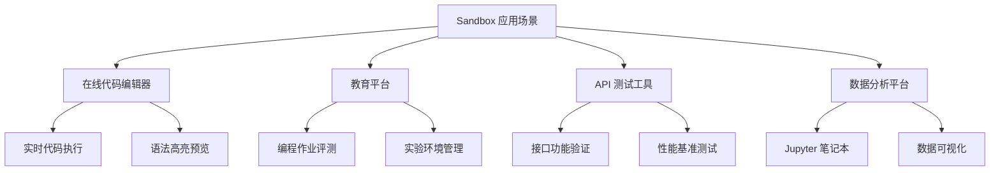
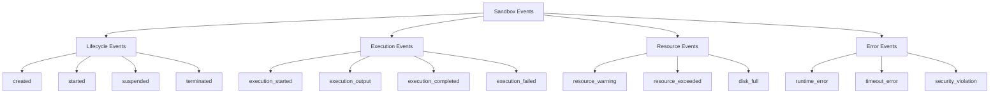
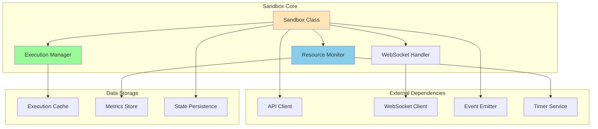
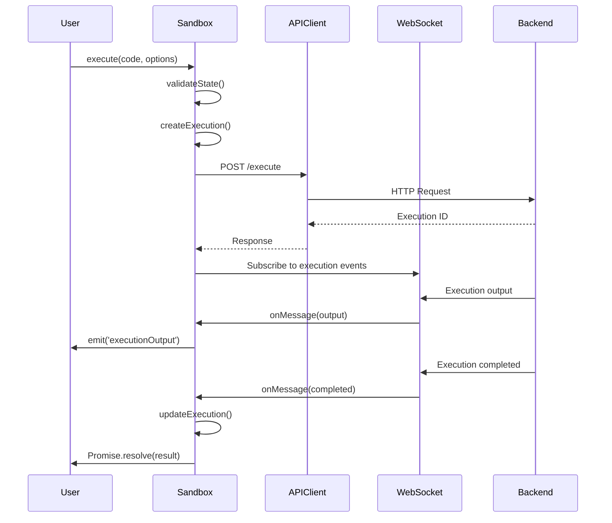

# Sandbox 类详解

> 🎯 **文档定位**: 深入解析 Code Interpreter JavaScript SDK 中的 Sandbox 类实现，包括沙箱生命周期管理、代码执行机制、资源监控等核心功能。基于五步显化法的深度分析。

## 1. 定位与使命 (Positioning & Mission)

### 1.1 模块定位
Sandbox 类是代码执行环境的核心抽象，负责管理单个沙箱实例的完整生命周期，提供安全隔离的代码执行环境。

### 1.2 核心问题
- **生命周期管理**: 如何优雅地管理沙箱的创建、运行、暂停、恢复和销毁
- **执行隔离**: 如何确保代码执行的安全性和资源隔离
- **实时通信**: 如何提供流畅的实时代码执行反馈
- **资源监控**: 如何有效监控和限制资源使用

### 1.3 应用场景


### 1.4 功能边界
- **支持运行时**: Node.js、Python、Go、Rust 等
- **执行时限**: 可配置的超时控制
- **资源限制**: CPU、内存、磁盘、网络
- **并发能力**: 单沙箱支持多个并发执行

## 2. 设计思想与哲学基石 (Design Philosophy)

### 2.1 设计原则

#### 状态机驱动 (State Machine Driven)
```typescript
enum SandboxStatus {
  CREATING = 'creating',
  RUNNING = 'running',
  IDLE = 'idle',
  BUSY = 'busy',
  SUSPENDED = 'suspended',
  TERMINATING = 'terminating',
  TERMINATED = 'terminated',
  ERROR = 'error'
}

// 状态转换规则
const ALLOWED_TRANSITIONS: Record<SandboxStatus, SandboxStatus[]> = {
  [SandboxStatus.CREATING]: [SandboxStatus.RUNNING, SandboxStatus.ERROR],
  [SandboxStatus.RUNNING]: [SandboxStatus.IDLE, SandboxStatus.BUSY, SandboxStatus.SUSPENDED, SandboxStatus.TERMINATING],
  [SandboxStatus.IDLE]: [SandboxStatus.BUSY, SandboxStatus.SUSPENDED, SandboxStatus.TERMINATING],
  [SandboxStatus.BUSY]: [SandboxStatus.IDLE, SandboxStatus.ERROR, SandboxStatus.TERMINATING],
  [SandboxStatus.SUSPENDED]: [SandboxStatus.RUNNING, SandboxStatus.TERMINATING],
  [SandboxStatus.TERMINATING]: [SandboxStatus.TERMINATED],
  [SandboxStatus.TERMINATED]: [], // 终态
  [SandboxStatus.ERROR]: [SandboxStatus.TERMINATING]
};
```

#### 事件驱动架构 (Event-Driven Architecture)


#### 资源管理哲学
```typescript
// 资源管理的三层防护
interface ResourceProtection {
  // 第一层：预防性限制
  preventive: {
    cpuQuota: number;        // CPU 配额限制
    memoryLimit: number;     // 内存硬限制
    diskQuota: number;       // 磁盘空间配额
    networkBandwidth: number; // 网络带宽限制
  };
  
  // 第二层：监控告警
  monitoring: {
    cpuThreshold: number;    // CPU 使用率告警阈值
    memoryThreshold: number; // 内存使用率告警阈值
    diskThreshold: number;   // 磁盘使用率告警阈值
    executionTimeThreshold: number; // 执行时间告警阈值
  };
  
  // 第三层：强制终止
  enforcement: {
    maxExecutionTime: number; // 最大执行时间
    maxMemoryUsage: number;   // 最大内存使用
    maxDiskUsage: number;     // 最大磁盘使用
    maxConcurrentExecutions: number; // 最大并发执行数
  };
}
```

## 3. 核心数据结构定义 (Core Data Structures)

### 3.1 Sandbox 类核心结构
```typescript
export class Sandbox extends EventEmitter {
  public readonly id: string;
  public readonly userId: string;
  public readonly runtime: Runtime;
  private _status: SandboxStatus;
  private _resources: ResourceAllocation;
  private _metadata: SandboxMetadata;
  private _executions: Map<string, Execution> = new Map();
  private _websocket: WebSocket | null = null;
  private _heartbeatTimer: NodeJS.Timer | null = null;
  
  constructor(
    data: SandboxData,
    private apiClient: APIClient,
    private config: SandboxConfig
  ) {
    super();
    
    this.id = data.id;
    this.userId = data.userId;
    this.runtime = data.runtime;
    this._status = data.status;
    this._resources = data.resources;
    this._metadata = data.metadata;
    
    this.initializeWebSocket();
    this.startHeartbeat();
  }
  
  // Getters
  get status(): SandboxStatus {
    return this._status;
  }
  
  get resources(): ResourceAllocation {
    return { ...this._resources };
  }
  
  get metadata(): SandboxMetadata {
    return { ...this._metadata };
  }
  
  get isActive(): boolean {
    return [
      SandboxStatus.RUNNING,
      SandboxStatus.IDLE,
      SandboxStatus.BUSY
    ].includes(this._status);
  }
}
```

### 3.2 资源分配结构
```typescript
export interface ResourceAllocation {
  cpu: {
    cores: number;           // CPU 核心数
    limitPercent: number;    // CPU 使用率限制
    priority: 'low' | 'normal' | 'high'; // CPU 调度优先级
  };
  memory: {
    limitMB: number;         // 内存限制（MB）
    swapLimitMB: number;     // 交换内存限制
    oomKillDisable: boolean; // 禁用 OOM Killer
  };
  disk: {
    quotaMB: number;         // 磁盘配额（MB）
    iopsLimit: number;       // IOPS 限制
    throughputMBps: number;  // 吞吐量限制
  };
  network: {
    bandwidthMbps: number;   // 带宽限制
    connectionsLimit: number; // 连接数限制
    allowedPorts: number[];  // 允许的端口
    blockedDomains: string[]; // 禁止访问的域名
  };
}

export interface SandboxMetadata {
  createdAt: Date;
  lastActiveAt: Date;
  totalExecutions: number;
  totalCpuTime: number;
  totalMemoryUsed: number;
  totalDiskUsed: number;
  tags: Record<string, string>;
  environment: Record<string, string>;
}
```

### 3.3 执行上下文结构
```typescript
export interface ExecutionContext {
  id: string;
  sandboxId: string;
  code: string;
  language: string;
  options: ExecutionOptions;
  status: ExecutionStatus;
  result?: ExecutionResult;
  metrics?: ExecutionMetrics;
  createdAt: Date;
  startedAt?: Date;
  completedAt?: Date;
}

export interface ExecutionOptions {
  timeout?: number;          // 超时时间（毫秒）
  memoryLimit?: number;      // 内存限制（MB）
  workingDirectory?: string; // 工作目录
  environment?: Record<string, string>; // 环境变量
  arguments?: string[];      // 命令行参数
  stdin?: string;           // 标准输入
  captureOutput?: boolean;   // 是否捕获输出
  captureMetrics?: boolean;  // 是否收集指标
}
```

## 4. 核心接口与逻辑实现 (Core Interfaces)

### 4.1 沙箱生命周期管理
```typescript
export class Sandbox extends EventEmitter {
  /**
   * 启动沙箱
   */
  async start(): Promise<void> {
    this.validateStateTransition(SandboxStatus.RUNNING);
    
    try {
      await this.apiClient.post(`/sandboxes/${this.id}/start`);
      this.transitionTo(SandboxStatus.RUNNING);
      
      // 建立 WebSocket 连接
      await this.establishWebSocketConnection();
      
      // 开始心跳检测
      this.startHeartbeat();
      
      this.emit('started', { sandbox: this });
      
    } catch (error) {
      this.transitionTo(SandboxStatus.ERROR);
      throw new SandboxError('Failed to start sandbox', error);
    }
  }
  
  /**
   * 暂停沙箱
   */
  async suspend(): Promise<void> {
    this.validateStateTransition(SandboxStatus.SUSPENDED);
    
    try {
      // 停止所有正在执行的任务
      await this.stopAllExecutions();
      
      await this.apiClient.post(`/sandboxes/${this.id}/suspend`);
      this.transitionTo(SandboxStatus.SUSPENDED);
      
      // 关闭 WebSocket 连接
      this.closeWebSocketConnection();
      
      this.emit('suspended', { sandbox: this });
      
    } catch (error) {
      throw new SandboxError('Failed to suspend sandbox', error);
    }
  }
  
  /**
   * 恢复沙箱
   */
  async resume(): Promise<void> {
    if (this._status !== SandboxStatus.SUSPENDED) {
      throw new InvalidStateError('Sandbox is not suspended');
    }
    
    try {
      await this.apiClient.post(`/sandboxes/${this.id}/resume`);
      this.transitionTo(SandboxStatus.RUNNING);
      
      // 重新建立 WebSocket 连接
      await this.establishWebSocketConnection();
      
      this.emit('resumed', { sandbox: this });
      
    } catch (error) {
      throw new SandboxError('Failed to resume sandbox', error);
    }
  }
  
  /**
   * 终止沙箱
   */
  async terminate(): Promise<void> {
    this.transitionTo(SandboxStatus.TERMINATING);
    
    try {
      // 清理所有执行
      await this.cleanupExecutions();
      
      // 关闭连接
      this.closeWebSocketConnection();
      this.stopHeartbeat();
      
      // 调用 API 终止沙箱
      await this.apiClient.delete(`/sandboxes/${this.id}`);
      
      this.transitionTo(SandboxStatus.TERMINATED);
      this.emit('terminated', { sandbox: this });
      
    } catch (error) {
      throw new SandboxError('Failed to terminate sandbox', error);
    }
  }
  
  private validateStateTransition(targetState: SandboxStatus): void {
    const allowedStates = ALLOWED_TRANSITIONS[this._status] || [];
    if (!allowedStates.includes(targetState)) {
      throw new InvalidStateTransitionError(
        `Cannot transition from ${this._status} to ${targetState}`
      );
    }
  }
  
  private transitionTo(newState: SandboxStatus): void {
    const oldState = this._status;
    this._status = newState;
    this._metadata.lastActiveAt = new Date();
    
    this.emit('stateChanged', {
      sandbox: this,
      oldState,
      newState
    });
  }
}
```

### 4.2 代码执行核心逻辑
```typescript
export class Sandbox extends EventEmitter {
  /**
   * 执行代码
   */
  async execute(
    code: string,
    options: ExecutionOptions = {}
  ): Promise<ExecutionResult> {
    // 检查沙箱状态
    if (!this.isActive) {
      throw new InvalidStateError('Sandbox is not active');
    }
    
    // 检查并发执行限制
    if (this._executions.size >= this.config.maxConcurrentExecutions) {
      throw new ResourceLimitError('Too many concurrent executions');
    }
    
    const execution = this.createExecution(code, options);
    this._executions.set(execution.id, execution);
    
    try {
      this.transitionTo(SandboxStatus.BUSY);
      
      // 发送执行请求
      const response = await this.apiClient.post(
        `/sandboxes/${this.id}/execute`,
        {
          code,
          language: this.detectLanguage(code),
          options: this.mergeExecutionOptions(options)
        }
      );
      
      execution.status = ExecutionStatus.RUNNING;
      execution.startedAt = new Date();
      
      this.emit('executionStarted', { execution });
      
      // 等待执行完成
      const result = await this.waitForExecutionCompletion(execution.id);
      
      execution.status = ExecutionStatus.COMPLETED;
      execution.completedAt = new Date();
      execution.result = result;
      
      this.emit('executionCompleted', { execution });
      
      return result;
      
    } catch (error) {
      execution.status = ExecutionStatus.FAILED;
      execution.completedAt = new Date();
      
      this.emit('executionFailed', { execution, error });
      throw error;
      
    } finally {
      this._executions.delete(execution.id);
      
      // 如果没有其他执行，返回空闲状态
      if (this._executions.size === 0) {
        this.transitionTo(SandboxStatus.IDLE);
      }
    }
  }
  
  /**
   * 流式执行代码
   */
  async *executeStream(
    code: string,
    options: ExecutionOptions = {}
  ): AsyncGenerator<ExecutionEvent, ExecutionResult, unknown> {
    const execution = this.createExecution(code, options);
    this._executions.set(execution.id, execution);
    
    try {
      // 建立流式连接
      const stream = await this.createExecutionStream(execution);
      
      // 处理流式事件
      for await (const event of stream) {
        switch (event.type) {
          case 'output':
            yield {
              type: 'output',
              data: {
                stream: event.stream,
                content: event.content
              }
            };
            break;
            
          case 'metrics':
            yield {
              type: 'metrics',
              data: event.metrics
            };
            break;
            
          case 'error':
            throw new ExecutionError(event.error.message);
            
          case 'complete':
            return event.result;
        }
      }
      
    } finally {
      this._executions.delete(execution.id);
    }
  }
  
  private createExecution(
    code: string,
    options: ExecutionOptions
  ): ExecutionContext {
    return {
      id: uuidv4(),
      sandboxId: this.id,
      code,
      language: this.detectLanguage(code),
      options: this.mergeExecutionOptions(options),
      status: ExecutionStatus.PENDING,
      createdAt: new Date()
    };
  }
  
  private detectLanguage(code: string): string {
    // 简单的语言检测逻辑
    if (code.includes('def ') || code.includes('import ')) {
      return 'python';
    }
    if (code.includes('function ') || code.includes('const ') || code.includes('let ')) {
      return 'javascript';
    }
    if (code.includes('package main') || code.includes('func main')) {
      return 'go';
    }
    if (code.includes('fn main') || code.includes('use std::')) {
      return 'rust';
    }
    
    return this.runtime.language;
  }
}
```

### 4.3 WebSocket 连接管理
```typescript
export class Sandbox extends EventEmitter {
  private async initializeWebSocket(): Promise<void> {
    if (this._websocket) {
      return;
    }
    
    const wsUrl = `${this.config.websocketUrl}/sandbox/${this.id}`;
    const ws = new WebSocket(wsUrl, {
      headers: {
        'Authorization': `Bearer ${this.config.apiKey}`,
        'X-Sandbox-ID': this.id
      }
    });
    
    ws.on('open', () => {
      this.emit('connected');
    });
    
    ws.on('message', (data: Buffer) => {
      try {
        const message = JSON.parse(data.toString());
        this.handleWebSocketMessage(message);
      } catch (error) {
        console.error('Failed to parse WebSocket message:', error);
      }
    });
    
    ws.on('close', (code: number, reason: string) => {
      this._websocket = null;
      this.emit('disconnected', { code, reason });
      
      // 自动重连（如果沙箱仍在运行）
      if (this.isActive) {
        setTimeout(() => this.initializeWebSocket(), 5000);
      }
    });
    
    ws.on('error', (error: Error) => {
      this.emit('error', error);
    });
    
    this._websocket = ws;
  }
  
  private handleWebSocketMessage(message: any): void {
    switch (message.type) {
      case 'execution_output':
        this.emit('executionOutput', {
          executionId: message.executionId,
          stream: message.stream,
          content: message.content
        });
        break;
        
      case 'execution_completed':
        this.handleExecutionCompleted(message);
        break;
        
      case 'resource_metrics':
        this.updateResourceMetrics(message.metrics);
        this.emit('metricsUpdated', { metrics: message.metrics });
        break;
        
      case 'resource_warning':
        this.emit('resourceWarning', {
          resource: message.resource,
          usage: message.usage,
          limit: message.limit
        });
        break;
        
      case 'sandbox_error':
        this.handleSandboxError(message.error);
        break;
        
      default:
        console.warn('Unknown WebSocket message type:', message.type);
    }
  }
  
  private closeWebSocketConnection(): void {
    if (this._websocket) {
      this._websocket.close();
      this._websocket = null;
    }
  }
}
```

### 4.4 资源监控实现
```typescript
export class Sandbox extends EventEmitter {
  private async updateResourceMetrics(metrics: ResourceMetrics): Promise<void> {
    this._metadata.totalCpuTime += metrics.cpuTime;
    this._metadata.totalMemoryUsed = Math.max(
      this._metadata.totalMemoryUsed,
      metrics.memoryUsage
    );
    this._metadata.totalDiskUsed = metrics.diskUsage;
    
    // 检查资源限制
    this.checkResourceLimits(metrics);
  }
  
  private checkResourceLimits(metrics: ResourceMetrics): void {
    const { cpu, memory, disk, network } = this._resources;
    
    // CPU 检查
    if (metrics.cpuUsage > cpu.limitPercent) {
      this.emit('resourceExceeded', {
        resource: 'cpu',
        usage: metrics.cpuUsage,
        limit: cpu.limitPercent
      });
    }
    
    // 内存检查
    if (metrics.memoryUsage > memory.limitMB) {
      this.emit('resourceExceeded', {
        resource: 'memory',
        usage: metrics.memoryUsage,
        limit: memory.limitMB
      });
      
      // 如果启用了强制终止，则终止超限执行
      if (this.config.enforceMemoryLimits) {
        this.terminateExceedingExecutions();
      }
    }
    
    // 磁盘检查
    if (metrics.diskUsage > disk.quotaMB) {
      this.emit('resourceExceeded', {
        resource: 'disk',
        usage: metrics.diskUsage,
        limit: disk.quotaMB
      });
    }
    
    // 网络检查
    if (metrics.networkThroughput > network.bandwidthMbps) {
      this.emit('resourceExceeded', {
        resource: 'network',
        usage: metrics.networkThroughput,
        limit: network.bandwidthMbps
      });
    }
  }
  
  /**
   * 获取当前资源使用情况
   */
  async getResourceUsage(): Promise<ResourceUsage> {
    const response = await this.apiClient.get(`/sandboxes/${this.id}/metrics`);
    return {
      cpu: {
        usage: response.cpu.usage,
        limit: this._resources.cpu.limitPercent,
        utilization: response.cpu.usage / this._resources.cpu.limitPercent
      },
      memory: {
        usage: response.memory.usage,
        limit: this._resources.memory.limitMB,
        utilization: response.memory.usage / this._resources.memory.limitMB
      },
      disk: {
        usage: response.disk.usage,
        limit: this._resources.disk.quotaMB,
        utilization: response.disk.usage / this._resources.disk.quotaMB
      },
      network: {
        throughput: response.network.throughput,
        limit: this._resources.network.bandwidthMbps,
        utilization: response.network.throughput / this._resources.network.bandwidthMbps
      }
    };
  }
}
```

## 5. 依赖关系与交互 (Dependencies & Interactions)

### 5.1 模块交互图


### 5.2 执行流程序列图


### 5.3 心跳检测机制
```typescript
export class Sandbox extends EventEmitter {
  private startHeartbeat(): void {
    this.stopHeartbeat(); // 清除现有的心跳
    
    this._heartbeatTimer = setInterval(async () => {
      try {
        await this.sendHeartbeat();
      } catch (error) {
        this.emit('heartbeatFailed', { error });
        
        // 连续失败处理
        this.handleHeartbeatFailure();
      }
    }, this.config.heartbeatInterval || 30000);
  }
  
  private async sendHeartbeat(): Promise<void> {
    if (this._websocket && this._websocket.readyState === WebSocket.OPEN) {
      this._websocket.send(JSON.stringify({
        type: 'heartbeat',
        timestamp: Date.now(),
        sandboxId: this.id
      }));
    } else {
      // WebSocket 不可用，使用 HTTP 心跳
      await this.apiClient.post(`/sandboxes/${this.id}/heartbeat`);
    }
  }
  
  private stopHeartbeat(): void {
    if (this._heartbeatTimer) {
      clearInterval(this._heartbeatTimer);
      this._heartbeatTimer = null;
    }
  }
}
```

## 6. 高级功能实现

### 6.1 文件系统操作
```typescript
export class Sandbox extends EventEmitter {
  /**
   * 上传文件到沙箱
   */
  async uploadFile(
    localPath: string,
    remotePath: string,
    options: UploadOptions = {}
  ): Promise<FileInfo> {
    const file = await fs.readFile(localPath);
    const formData = new FormData();
    
    formData.append('file', file, {
      filename: path.basename(remotePath),
      contentType: this.getMimeType(remotePath)
    });
    
    formData.append('path', remotePath);
    formData.append('overwrite', options.overwrite?.toString() || 'false');
    
    const response = await this.apiClient.post(
      `/sandboxes/${this.id}/files`,
      formData,
      {
        headers: formData.getHeaders(),
        maxContentLength: options.maxSize || 100 * 1024 * 1024 // 100MB
      }
    );
    
    const fileInfo: FileInfo = {
      path: remotePath,
      size: response.size,
      mimeType: response.mimeType,
      permissions: response.permissions,
      createdAt: new Date(response.createdAt),
      modifiedAt: new Date(response.modifiedAt)
    };
    
    this.emit('fileUploaded', { fileInfo });
    return fileInfo;
  }
  
  /**
   * 下载文件从沙箱
   */
  async downloadFile(remotePath: string): Promise<Buffer> {
    const response = await this.apiClient.get(
      `/sandboxes/${this.id}/files`,
      {
        params: { path: remotePath },
        responseType: 'arraybuffer'
      }
    );
    
    const buffer = Buffer.from(response);
    this.emit('fileDownloaded', { path: remotePath, size: buffer.length });
    
    return buffer;
  }
  
  /**
   * 列出文件
   */
  async listFiles(directory: string = '/'): Promise<FileInfo[]> {
    const response = await this.apiClient.get(
      `/sandboxes/${this.id}/files/list`,
      {
        params: { directory }
      }
    );
    
    return response.files.map((file: any) => ({
      path: file.path,
      name: file.name,
      size: file.size,
      type: file.type,
      permissions: file.permissions,
      createdAt: new Date(file.createdAt),
      modifiedAt: new Date(file.modifiedAt)
    }));
  }
  
  /**
   * 删除文件
   */
  async deleteFile(remotePath: string): Promise<void> {
    await this.apiClient.delete(`/sandboxes/${this.id}/files`, {
      params: { path: remotePath }
    });
    
    this.emit('fileDeleted', { path: remotePath });
  }
}
```

### 6.2 环境变量管理
```typescript
export class Sandbox extends EventEmitter {
  /**
   * 设置环境变量
   */
  async setEnvironmentVariable(key: string, value: string): Promise<void> {
    await this.apiClient.post(`/sandboxes/${this.id}/env`, {
      key,
      value
    });
    
    this._metadata.environment[key] = value;
    this.emit('environmentUpdated', { key, value });
  }
  
  /**
   * 批量设置环境变量
   */
  async setEnvironmentVariables(variables: Record<string, string>): Promise<void> {
    await this.apiClient.post(`/sandboxes/${this.id}/env/batch`, {
      variables
    });
    
    Object.assign(this._metadata.environment, variables);
    this.emit('environmentBatchUpdated', { variables });
  }
  
  /**
   * 获取环境变量
   */
  async getEnvironmentVariable(key: string): Promise<string | undefined> {
    const response = await this.apiClient.get(`/sandboxes/${this.id}/env/${key}`);
    return response.value;
  }
  
  /**
   * 删除环境变量
   */
  async deleteEnvironmentVariable(key: string): Promise<void> {
    await this.apiClient.delete(`/sandboxes/${this.id}/env/${key}`);
    
    delete this._metadata.environment[key];
    this.emit('environmentDeleted', { key });
  }
}
```

### 6.3 端口管理
```typescript
export class Sandbox extends EventEmitter {
  /**
   * 暴露端口
   */
  async exposePort(
    port: number,
    options: ExposePortOptions = {}
  ): Promise<ExposedPort> {
    const response = await this.apiClient.post(
      `/sandboxes/${this.id}/ports/${port}/expose`,
      {
        protocol: options.protocol || 'http',
        public: options.public || false,
        customDomain: options.customDomain
      }
    );
    
    const exposedPort: ExposedPort = {
      port,
      protocol: response.protocol,
      url: response.url,
      publicUrl: response.publicUrl,
      isPublic: response.isPublic
    };
    
    this.emit('portExposed', { exposedPort });
    return exposedPort;
  }
  
  /**
   * 关闭端口
   */
  async closePort(port: number): Promise<void> {
    await this.apiClient.delete(`/sandboxes/${this.id}/ports/${port}`);
    this.emit('portClosed', { port });
  }
  
  /**
   * 列出已暴露的端口
   */
  async listExposedPorts(): Promise<ExposedPort[]> {
    const response = await this.apiClient.get(`/sandboxes/${this.id}/ports`);
    return response.ports;
  }
}
```

## 7. 错误处理与恢复

### 7.1 错误分类和处理
```typescript
export class SandboxErrorHandler {
  handle(error: Error, sandbox: Sandbox): void {
    if (error instanceof ExecutionTimeoutError) {
      this.handleExecutionTimeout(error, sandbox);
    } else if (error instanceof ResourceExceededError) {
      this.handleResourceExceeded(error, sandbox);
    } else if (error instanceof NetworkError) {
      this.handleNetworkError(error, sandbox);
    } else if (error instanceof SecurityViolationError) {
      this.handleSecurityViolation(error, sandbox);
    } else {
      this.handleUnknownError(error, sandbox);
    }
  }
  
  private handleExecutionTimeout(error: ExecutionTimeoutError, sandbox: Sandbox): void {
    sandbox.emit('executionTimeout', {
      executionId: error.executionId,
      timeout: error.timeout
    });
    
    // 终止超时的执行
    sandbox.terminateExecution(error.executionId);
  }
  
  private handleResourceExceeded(error: ResourceExceededError, sandbox: Sandbox): void {
    sandbox.emit('resourceExceeded', {
      resource: error.resource,
      usage: error.usage,
      limit: error.limit
    });
    
    // 根据策略处理资源超限
    if (error.resource === 'memory' && sandbox.config.enforceMemoryLimits) {
      sandbox.suspend();
    }
  }
  
  private async handleNetworkError(error: NetworkError, sandbox: Sandbox): Promise<void> {
    // 尝试重新建立网络连接
    try {
      await sandbox.reconnect();
    } catch (reconnectError) {
      sandbox.emit('reconnectFailed', { originalError: error, reconnectError });
    }
  }
  
  private handleSecurityViolation(error: SecurityViolationError, sandbox: Sandbox): void {
    // 安全违规立即终止沙箱
    sandbox.emit('securityViolation', {
      violation: error.violation,
      severity: error.severity
    });
    
    sandbox.terminate();
  }
}
```

### 7.2 自动恢复机制
```typescript
export class Sandbox extends EventEmitter {
  private recoveryConfig: RecoveryConfig = {
    maxRetries: 3,
    retryDelay: 1000,
    backoffFactor: 2,
    autoRecover: true
  };
  
  async recoverFromError(error: Error): Promise<boolean> {
    if (!this.recoveryConfig.autoRecover) {
      return false;
    }
    
    const strategy = this.getRecoveryStrategy(error);
    return await this.executeRecoveryStrategy(strategy);
  }
  
  private getRecoveryStrategy(error: Error): RecoveryStrategy {
    if (error instanceof NetworkError) {
      return {
        type: 'reconnect',
        maxAttempts: 3,
        delay: 1000
      };
    }
    
    if (error instanceof ResourceExceededError) {
      return {
        type: 'cleanup_and_restart',
        maxAttempts: 2,
        delay: 5000
      };
    }
    
    if (error instanceof ExecutionError) {
      return {
        type: 'restart_execution',
        maxAttempts: 1,
        delay: 0
      };
    }
    
    return {
      type: 'no_recovery',
      maxAttempts: 0,
      delay: 0
    };
  }
  
  private async executeRecoveryStrategy(strategy: RecoveryStrategy): Promise<boolean> {
    for (let attempt = 1; attempt <= strategy.maxAttempts; attempt++) {
      try {
        switch (strategy.type) {
          case 'reconnect':
            await this.reconnect();
            break;
            
          case 'cleanup_and_restart':
            await this.cleanup();
            await this.restart();
            break;
            
          case 'restart_execution':
            await this.restartCurrentExecution();
            break;
            
          default:
            return false;
        }
        
        this.emit('recoverySucceeded', { strategy, attempt });
        return true;
        
      } catch (recoveryError) {
        this.emit('recoveryAttemptFailed', {
          strategy,
          attempt,
          error: recoveryError
        });
        
        if (attempt < strategy.maxAttempts) {
          await this.delay(strategy.delay * Math.pow(2, attempt - 1));
        }
      }
    }
    
    this.emit('recoveryFailed', { strategy });
    return false;
  }
}
```

## 总结

Sandbox 类作为 Code Interpreter JavaScript SDK 的核心组件，体现了以下设计精髓：

1. **完整的生命周期管理**: 从创建到销毁的全过程控制
2. **实时双向通信**: WebSocket 实现的低延迟交互
3. **智能资源监控**: 多层次的资源保护和监控
4. **灵活的执行模式**: 支持同步、异步、流式执行
5. **强大的错误恢复**: 自动恢复和故障隔离机制
6. **丰富的扩展功能**: 文件管理、环境变量、端口暴露等

这个设计不仅提供了完整的沙箱管理能力，还充分考虑了可靠性、性能和用户体验，为上层应用提供了稳定可靠的代码执行环境。

---

**下一篇文档**: [消息系统详解](docs/26_code_interpreter_js_messaging.md) - 深入分析实时通信和事件处理机制