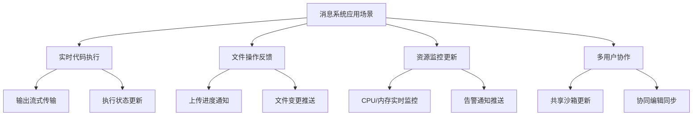
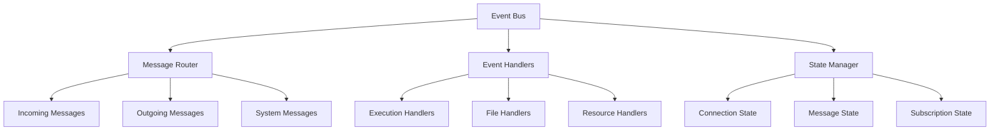
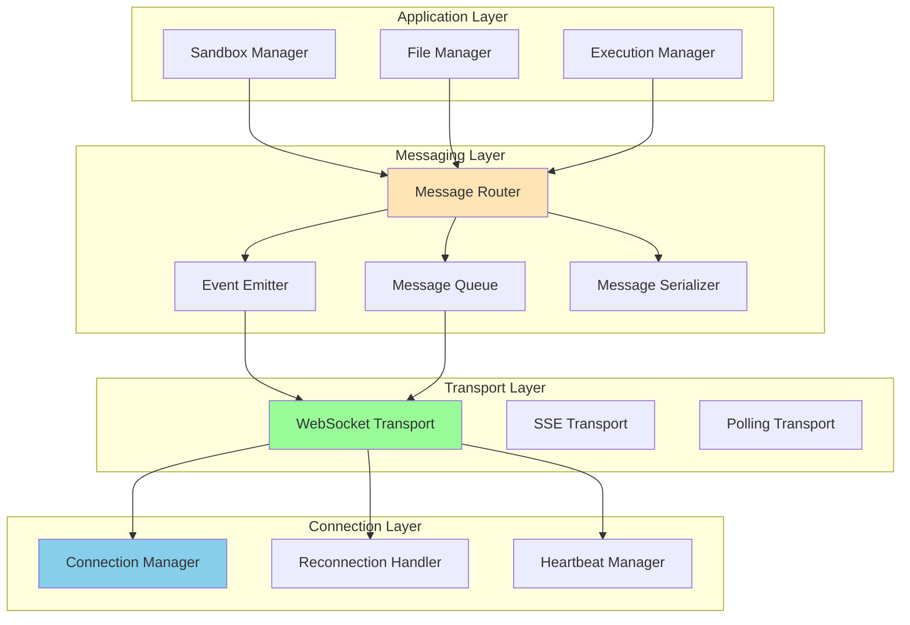
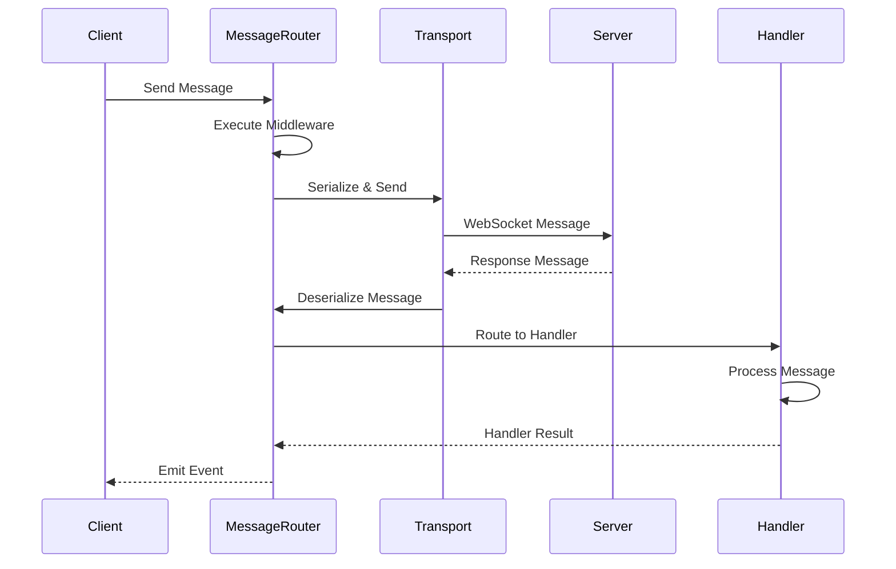
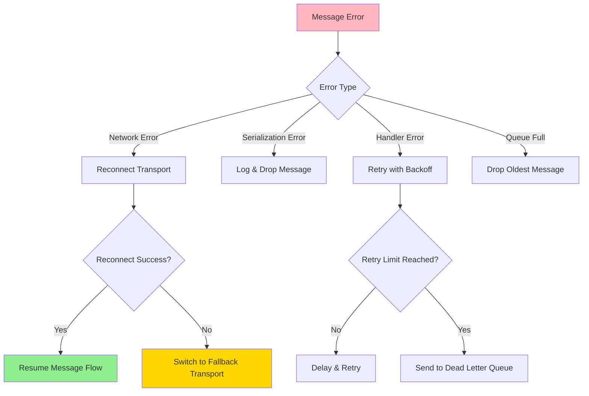

# 消息系统详解

> 🎯 **文档定位**: 深入分析 Code Interpreter JavaScript SDK 中的消息传递和实时通信系统，包括 WebSocket 管理、事件处理、消息队列等核心机制。基于五步显化法的消息系统分析。

## 1. 定位与使命 (Positioning & Mission)

### 1.1 模块定位
消息系统是 Code Interpreter 实现实时双向通信的核心基础设施，负责处理客户端与服务端之间的所有消息传递、事件分发和状态同步。

### 1.2 核心问题
- **连接管理**: 如何维护稳定的 WebSocket 连接
- **消息可靠性**: 如何保证消息的传递和顺序
- **事件分发**: 如何高效地处理和分发各类事件
- **状态同步**: 如何保持客户端和服务端状态一致

### 1.3 应用场景


### 1.4 系统边界
- **协议支持**: WebSocket、Server-Sent Events、长轮询
- **消息格式**: JSON、MessagePack、Protocol Buffers
- **连接数**: 单客户端支持多路复用连接
- **延迟要求**: 端到端延迟 <100ms

## 2. 设计思想与哲学基石 (Design Philosophy)

### 2.1 消息系统设计原则

#### 可靠性优先 (Reliability First)
```typescript
interface MessageReliability {
  // 消息确认机制
  acknowledgment: {
    enabled: boolean;
    timeout: number;
    retryAttempts: number;
  };
  
  // 消息持久化
  persistence: {
    enabled: boolean;
    storageType: 'memory' | 'localStorage' | 'indexedDB';
    maxMessages: number;
  };
  
  // 重连机制
  reconnection: {
    enabled: boolean;
    maxAttempts: number;
    backoffStrategy: 'linear' | 'exponential' | 'custom';
    initialDelay: number;
    maxDelay: number;
  };
}
```

#### 事件驱动架构 (Event-Driven Design)


#### 分层消息处理
```typescript
// 消息处理分层架构
interface MessageLayers {
  // 传输层 - 负责消息传输
  transport: {
    websocket: WebSocketTransport;
    sse: ServerSentEventsTransport;
    polling: PollingTransport;
  };
  
  // 协议层 - 负责消息协议
  protocol: {
    serialization: MessageSerializer;
    compression: MessageCompressor;
    encryption: MessageEncryption;
  };
  
  // 应用层 - 负责业务逻辑
  application: {
    router: MessageRouter;
    handlers: MessageHandler[];
    middleware: MessageMiddleware[];
  };
}
```

### 2.2 消息可靠性保证

#### 三级可靠性保证
```typescript
enum ReliabilityLevel {
  AT_MOST_ONCE = 0,    // 最多一次 - 可能丢失
  AT_LEAST_ONCE = 1,   // 至少一次 - 可能重复
  EXACTLY_ONCE = 2     // 恰好一次 - 不丢失不重复
}

class MessageDeliveryGuarantee {
  constructor(private level: ReliabilityLevel) {}
  
  async send(message: Message): Promise<MessageResult> {
    switch (this.level) {
      case ReliabilityLevel.AT_MOST_ONCE:
        return this.sendFireAndForget(message);
        
      case ReliabilityLevel.AT_LEAST_ONCE:
        return this.sendWithRetry(message);
        
      case ReliabilityLevel.EXACTLY_ONCE:
        return this.sendWithDeduplication(message);
    }
  }
}
```

## 3. 核心数据结构定义 (Core Data Structures)

### 3.1 消息基础结构
```typescript
// 基础消息结构
export interface BaseMessage {
  id: string;                    // 消息唯一标识
  type: string;                  // 消息类型
  timestamp: number;             // 时间戳
  version: string;               // 消息版本
  source: string;                // 消息源
  target?: string;               // 消息目标
  correlationId?: string;        // 关联ID
  replyTo?: string;              // 回复地址
  ttl?: number;                  // 生存时间
  priority?: MessagePriority;    // 消息优先级
}

export interface Message<T = any> extends BaseMessage {
  payload: T;                    // 消息负载
  headers?: Record<string, any>; // 消息头
  metadata?: MessageMetadata;    // 元数据
}

export interface MessageMetadata {
  retryCount?: number;           // 重试次数
  maxRetries?: number;           // 最大重试次数
  deliveryTag?: string;          // 投递标签
  routingKey?: string;           // 路由键
  persistent?: boolean;          // 是否持久化
  compressed?: boolean;          // 是否压缩
  encrypted?: boolean;           // 是否加密
}

export enum MessagePriority {
  LOW = 0,
  NORMAL = 1,
  HIGH = 2,
  CRITICAL = 3
}
```

### 3.2 消息类型定义
```typescript
// 执行相关消息
export interface ExecutionMessage extends Message {
  type: 'execution.start' | 'execution.output' | 'execution.complete' | 'execution.error';
  payload: {
    executionId: string;
    sandboxId: string;
    data?: any;
    error?: ErrorInfo;
  };
}

// 文件操作消息
export interface FileMessage extends Message {
  type: 'file.upload' | 'file.download' | 'file.delete' | 'file.change';
  payload: {
    sandboxId: string;
    path: string;
    operation: FileOperation;
    progress?: number;
    result?: FileOperationResult;
  };
}

// 资源监控消息
export interface ResourceMessage extends Message {
  type: 'resource.metrics' | 'resource.warning' | 'resource.limit';
  payload: {
    sandboxId: string;
    metrics: ResourceMetrics;
    thresholds?: ResourceThresholds;
    alerts?: ResourceAlert[];
  };
}

// 系统控制消息
export interface SystemMessage extends Message {
  type: 'system.heartbeat' | 'system.ping' | 'system.pong' | 'system.shutdown';
  payload: {
    status?: string;
    timestamp: number;
    metadata?: Record<string, any>;
  };
}
```

### 3.3 连接管理结构
```typescript
export interface ConnectionState {
  id: string;                    // 连接标识
  status: ConnectionStatus;      // 连接状态
  protocol: TransportProtocol;   // 传输协议
  endpoint: string;              // 连接端点
  createdAt: Date;               // 创建时间
  lastActivity: Date;            // 最后活动时间
  reconnectAttempts: number;     // 重连次数
  metrics: ConnectionMetrics;    // 连接指标
}

export enum ConnectionStatus {
  CONNECTING = 'connecting',
  CONNECTED = 'connected',
  DISCONNECTING = 'disconnecting',
  DISCONNECTED = 'disconnected',
  RECONNECTING = 'reconnecting',
  ERROR = 'error'
}

export enum TransportProtocol {
  WEBSOCKET = 'websocket',
  SSE = 'sse',
  POLLING = 'polling'
}

export interface ConnectionMetrics {
  bytesSent: number;             // 发送字节数
  bytesReceived: number;         // 接收字节数
  messagesSent: number;          // 发送消息数
  messagesReceived: number;      // 接收消息数
  errors: number;                // 错误数
  latency: number;               // 延迟
  uptime: number;                // 在线时间
}
```

## 4. 核心接口与逻辑实现 (Core Interfaces)

### 4.1 消息传输层实现
```typescript
// WebSocket 传输实现
export class WebSocketTransport extends EventEmitter implements MessageTransport {
  private ws: WebSocket | null = null;
  private state: ConnectionState;
  private messageQueue: Message[] = [];
  private acknowledgments = new Map<string, AckCallback>();
  
  constructor(
    private endpoint: string,
    private options: WebSocketOptions = {}
  ) {
    super();
    this.state = this.createInitialState();
  }
  
  async connect(): Promise<void> {
    if (this.state.status === ConnectionStatus.CONNECTED) {
      return;
    }
    
    this.updateConnectionStatus(ConnectionStatus.CONNECTING);
    
    try {
      this.ws = new WebSocket(this.endpoint, this.options.protocols);
      this.setupWebSocketHandlers();
      
      await this.waitForConnection();
      this.updateConnectionStatus(ConnectionStatus.CONNECTED);
      
      // 处理离线消息队列
      await this.flushMessageQueue();
      
      this.emit('connected', this.state);
      
    } catch (error) {
      this.updateConnectionStatus(ConnectionStatus.ERROR);
      this.emit('error', error);
      throw error;
    }
  }
  
  async disconnect(): Promise<void> {
    if (!this.ws || this.state.status === ConnectionStatus.DISCONNECTED) {
      return;
    }
    
    this.updateConnectionStatus(ConnectionStatus.DISCONNECTING);
    
    // 清理资源
    this.clearAcknowledgments();
    
    this.ws.close(1000, 'Client disconnect');
    this.ws = null;
    
    this.updateConnectionStatus(ConnectionStatus.DISCONNECTED);
    this.emit('disconnected', this.state);
  }
  
  async send(message: Message): Promise<void> {
    if (this.state.status !== ConnectionStatus.CONNECTED) {
      // 离线消息队列
      this.messageQueue.push(message);
      return;
    }
    
    try {
      const serializedMessage = this.serializeMessage(message);
      this.ws!.send(serializedMessage);
      
      this.updateMetrics('sent', message);
      
      // 如果需要确认，注册确认回调
      if (message.metadata?.persistent) {
        this.registerAcknowledgment(message);
      }
      
      this.emit('messageSent', message);
      
    } catch (error) {
      this.emit('sendError', { message, error });
      throw error;
    }
  }
  
  private setupWebSocketHandlers(): void {
    if (!this.ws) return;
    
    this.ws.onopen = () => {
      this.emit('open');
    };
    
    this.ws.onmessage = (event) => {
      try {
        const message = this.deserializeMessage(event.data);
        this.handleIncomingMessage(message);
      } catch (error) {
        this.emit('parseError', { data: event.data, error });
      }
    };
    
    this.ws.onclose = (event) => {
      this.handleConnectionClose(event);
    };
    
    this.ws.onerror = (error) => {
      this.emit('error', error);
    };
  }
  
  private async handleIncomingMessage(message: Message): Promise<void> {
    this.updateMetrics('received', message);
    
    // 处理系统消息
    if (message.type.startsWith('system.')) {
      this.handleSystemMessage(message as SystemMessage);
      return;
    }
    
    // 处理确认消息
    if (message.type === 'ack') {
      this.handleAcknowledgment(message);
      return;
    }
    
    // 发送确认（如果需要）
    if (message.metadata?.persistent) {
      await this.sendAcknowledgment(message);
    }
    
    this.emit('message', message);
  }
  
  private handleConnectionClose(event: CloseEvent): void {
    this.updateConnectionStatus(ConnectionStatus.DISCONNECTED);
    
    const reason = this.getCloseReason(event.code);
    this.emit('close', { code: event.code, reason });
    
    // 自动重连（如果启用）
    if (this.options.autoReconnect && this.shouldReconnect(event.code)) {
      this.scheduleReconnect();
    }
  }
  
  private async scheduleReconnect(): Promise<void> {
    const delay = this.calculateReconnectDelay();
    this.updateConnectionStatus(ConnectionStatus.RECONNECTING);
    
    setTimeout(async () => {
      try {
        await this.connect();
        this.state.reconnectAttempts = 0; // 重置重连计数
      } catch (error) {
        this.state.reconnectAttempts++;
        
        if (this.state.reconnectAttempts < this.options.maxReconnectAttempts!) {
          this.scheduleReconnect();
        } else {
          this.emit('reconnectFailed', error);
        }
      }
    }, delay);
  }
}
```

### 4.2 消息路由器实现
```typescript
export class MessageRouter extends EventEmitter {
  private routes = new Map<string, RouteHandler[]>();
  private middleware: MessageMiddleware[] = [];
  private interceptors = new Map<string, MessageInterceptor[]>();
  
  /**
   * 注册消息路由
   */
  route(pattern: string | RegExp, handler: RouteHandler): void {
    const key = pattern.toString();
    const handlers = this.routes.get(key) || [];
    handlers.push(handler);
    this.routes.set(key, handlers);
  }
  
  /**
   * 添加中间件
   */
  use(middleware: MessageMiddleware): void {
    this.middleware.push(middleware);
  }
  
  /**
   * 添加拦截器
   */
  intercept(messageType: string, interceptor: MessageInterceptor): void {
    const interceptors = this.interceptors.get(messageType) || [];
    interceptors.push(interceptor);
    this.interceptors.set(messageType, interceptors);
  }
  
  /**
   * 路由消息
   */
  async routeMessage(message: Message): Promise<void> {
    try {
      // 执行中间件
      const context = await this.executeMiddleware(message);
      if (!context.continue) {
        return;
      }
      
      // 执行拦截器
      const interceptedMessage = await this.executeInterceptors(context.message);
      
      // 查找匹配的路由
      const matchedRoutes = this.findMatchingRoutes(interceptedMessage.type);
      
      if (matchedRoutes.length === 0) {
        this.emit('unhandledMessage', interceptedMessage);
        return;
      }
      
      // 并行执行所有匹配的处理器
      await Promise.all(
        matchedRoutes.map(route => 
          this.executeRouteHandler(route, interceptedMessage)
        )
      );
      
    } catch (error) {
      this.emit('routingError', { message, error });
    }
  }
  
  private async executeMiddleware(message: Message): Promise<MiddlewareContext> {
    const context: MiddlewareContext = {
      message,
      continue: true,
      metadata: {}
    };
    
    for (const middleware of this.middleware) {
      await middleware(context);
      if (!context.continue) {
        break;
      }
    }
    
    return context;
  }
  
  private async executeInterceptors(message: Message): Promise<Message> {
    const interceptors = this.interceptors.get(message.type) || [];
    let interceptedMessage = message;
    
    for (const interceptor of interceptors) {
      interceptedMessage = await interceptor(interceptedMessage);
    }
    
    return interceptedMessage;
  }
  
  private findMatchingRoutes(messageType: string): RouteHandler[] {
    const matchedRoutes: RouteHandler[] = [];
    
    for (const [pattern, handlers] of this.routes) {
      if (this.isPatternMatch(pattern, messageType)) {
        matchedRoutes.push(...handlers);
      }
    }
    
    return matchedRoutes;
  }
  
  private async executeRouteHandler(
    handler: RouteHandler,
    message: Message
  ): Promise<void> {
    try {
      await handler(message);
    } catch (error) {
      this.emit('handlerError', { handler, message, error });
    }
  }
  
  private isPatternMatch(pattern: string, messageType: string): boolean {
    // 简单的通配符匹配
    if (pattern.includes('*')) {
      const regexPattern = pattern.replace(/\*/g, '.*');
      return new RegExp(`^${regexPattern}$`).test(messageType);
    }
    
    return pattern === messageType;
  }
}
```

### 4.3 消息队列管理器
```typescript
export class MessageQueueManager {
  private queues = new Map<string, MessageQueue>();
  private processors = new Map<string, QueueProcessor>();
  
  /**
   * 创建消息队列
   */
  createQueue(
    name: string,
    options: QueueOptions = {}
  ): MessageQueue {
    if (this.queues.has(name)) {
      throw new Error(`Queue ${name} already exists`);
    }
    
    const queue = new MessageQueue(name, {
      maxSize: options.maxSize || 1000,
      maxAge: options.maxAge || 60000,
      priority: options.priority || false,
      persistent: options.persistent || false,
      ...options
    });
    
    this.queues.set(name, queue);
    return queue;
  }
  
  /**
   * 注册队列处理器
   */
  registerProcessor(
    queueName: string,
    processor: QueueProcessor
  ): void {
    this.processors.set(queueName, processor);
    
    // 开始处理队列消息
    this.startProcessing(queueName);
  }
  
  /**
   * 向队列添加消息
   */
  async enqueue(queueName: string, message: Message): Promise<void> {
    const queue = this.queues.get(queueName);
    if (!queue) {
      throw new Error(`Queue ${queueName} not found`);
    }
    
    await queue.enqueue(message);
  }
  
  /**
   * 从队列获取消息
   */
  async dequeue(queueName: string): Promise<Message | null> {
    const queue = this.queues.get(queueName);
    if (!queue) {
      throw new Error(`Queue ${queueName} not found`);
    }
    
    return await queue.dequeue();
  }
  
  private async startProcessing(queueName: string): Promise<void> {
    const queue = this.queues.get(queueName);
    const processor = this.processors.get(queueName);
    
    if (!queue || !processor) {
      return;
    }
    
    // 持续处理队列消息
    while (true) {
      try {
        const message = await queue.dequeue();
        if (!message) {
          await this.delay(100); // 空队列时短暂休眠
          continue;
        }
        
        await processor.process(message);
        
      } catch (error) {
        console.error(`Error processing message in queue ${queueName}:`, error);
      }
    }
  }
}

class MessageQueue {
  private messages: Message[] = [];
  private maxSize: number;
  private maxAge: number;
  private hasPriority: boolean;
  
  constructor(
    public readonly name: string,
    options: QueueOptions
  ) {
    this.maxSize = options.maxSize;
    this.maxAge = options.maxAge;
    this.hasPriority = options.priority;
  }
  
  async enqueue(message: Message): Promise<void> {
    // 检查队列大小限制
    if (this.messages.length >= this.maxSize) {
      // 移除最旧的消息
      this.messages.shift();
    }
    
    // 检查消息年龄
    this.removeExpiredMessages();
    
    if (this.hasPriority) {
      // 按优先级插入
      this.insertByPriority(message);
    } else {
      // FIFO 插入
      this.messages.push(message);
    }
  }
  
  async dequeue(): Promise<Message | null> {
    this.removeExpiredMessages();
    return this.messages.shift() || null;
  }
  
  private insertByPriority(message: Message): void {
    const priority = message.priority || MessagePriority.NORMAL;
    
    let insertIndex = this.messages.length;
    for (let i = 0; i < this.messages.length; i++) {
      const existingPriority = this.messages[i].priority || MessagePriority.NORMAL;
      if (priority > existingPriority) {
        insertIndex = i;
        break;
      }
    }
    
    this.messages.splice(insertIndex, 0, message);
  }
  
  private removeExpiredMessages(): void {
    const now = Date.now();
    this.messages = this.messages.filter(message => 
      (now - message.timestamp) < this.maxAge
    );
  }
}
```

## 5. 依赖关系与交互 (Dependencies & Interactions)

### 5.1 消息系统架构图


### 5.2 消息流处理时序


### 5.3 错误处理流程


## 6. 高级功能实现

### 6.1 消息压缩和加密
```typescript
export class MessageProcessor {
  private compressor: MessageCompressor;
  private encryptor: MessageEncryptor;
  
  constructor(options: ProcessorOptions) {
    this.compressor = new MessageCompressor(options.compression);
    this.encryptor = new MessageEncryptor(options.encryption);
  }
  
  async processOutgoing(message: Message): Promise<Buffer> {
    let data = JSON.stringify(message);
    
    // 压缩消息
    if (this.shouldCompress(message)) {
      data = await this.compressor.compress(data);
      message.metadata = message.metadata || {};
      message.metadata.compressed = true;
    }
    
    // 加密消息
    if (this.shouldEncrypt(message)) {
      data = await this.encryptor.encrypt(data);
      message.metadata = message.metadata || {};
      message.metadata.encrypted = true;
    }
    
    return Buffer.from(data);
  }
  
  async processIncoming(data: Buffer): Promise<Message> {
    let messageData = data.toString();
    
    // 检查是否加密
    const isEncrypted = this.isEncrypted(data);
    if (isEncrypted) {
      messageData = await this.encryptor.decrypt(messageData);
    }
    
    // 检查是否压缩
    const isCompressed = this.isCompressed(messageData);
    if (isCompressed) {
      messageData = await this.compressor.decompress(messageData);
    }
    
    return JSON.parse(messageData);
  }
  
  private shouldCompress(message: Message): boolean {
    const size = JSON.stringify(message).length;
    return size > this.compressor.threshold;
  }
  
  private shouldEncrypt(message: Message): boolean {
    return message.type.includes('sensitive') || 
           message.metadata?.encrypted === true;
  }
}

class MessageCompressor {
  constructor(public readonly threshold: number = 1024) {}
  
  async compress(data: string): Promise<string> {
    // 使用 gzip 压缩
    const compressed = await gzip(Buffer.from(data));
    return compressed.toString('base64');
  }
  
  async decompress(data: string): Promise<string> {
    const buffer = Buffer.from(data, 'base64');
    const decompressed = await gunzip(buffer);
    return decompressed.toString();
  }
}

class MessageEncryptor {
  private algorithm = 'aes-256-gcm';
  private key: Buffer;
  
  constructor(secretKey: string) {
    this.key = crypto.scryptSync(secretKey, 'salt', 32);
  }
  
  async encrypt(data: string): Promise<string> {
    const iv = crypto.randomBytes(16);
    const cipher = crypto.createCipher(this.algorithm, this.key);
    cipher.setAAD(Buffer.from('additional-data'));
    
    let encrypted = cipher.update(data, 'utf8', 'hex');
    encrypted += cipher.final('hex');
    
    const authTag = cipher.getAuthTag();
    
    return JSON.stringify({
      iv: iv.toString('hex'),
      encrypted,
      authTag: authTag.toString('hex')
    });
  }
  
  async decrypt(encryptedData: string): Promise<string> {
    const { iv, encrypted, authTag } = JSON.parse(encryptedData);
    
    const decipher = crypto.createDecipher(this.algorithm, this.key);
    decipher.setAAD(Buffer.from('additional-data'));
    decipher.setAuthTag(Buffer.from(authTag, 'hex'));
    
    let decrypted = decipher.update(encrypted, 'hex', 'utf8');
    decrypted += decipher.final('utf8');
    
    return decrypted;
  }
}
```

### 6.2 消息去重和幂等性
```typescript
export class MessageDeduplicator {
  private messageHashes = new Set<string>();
  private messageStore = new Map<string, Message>();
  private cleanupTimer: NodeJS.Timer;
  
  constructor(private options: DeduplicatorOptions = {}) {
    this.options.ttl = options.ttl || 300000; // 5 minutes
    this.options.maxSize = options.maxSize || 10000;
    
    // 定期清理过期消息
    this.cleanupTimer = setInterval(() => {
      this.cleanup();
    }, this.options.ttl / 2);
  }
  
  /**
   * 检查消息是否重复
   */
  isDuplicate(message: Message): boolean {
    const hash = this.generateMessageHash(message);
    return this.messageHashes.has(hash);
  }
  
  /**
   * 标记消息为已处理
   */
  markAsProcessed(message: Message): void {
    const hash = this.generateMessageHash(message);
    
    this.messageHashes.add(hash);
    this.messageStore.set(hash, {
      ...message,
      metadata: {
        ...message.metadata,
        processedAt: Date.now()
      }
    });
    
    // 检查大小限制
    if (this.messageHashes.size > this.options.maxSize!) {
      this.removeOldest();
    }
  }
  
  /**
   * 获取消息处理结果
   */
  getProcessedResult(message: Message): Message | null {
    const hash = this.generateMessageHash(message);
    return this.messageStore.get(hash) || null;
  }
  
  private generateMessageHash(message: Message): string {
    // 使用消息ID、类型和关键内容生成哈希
    const hashContent = {
      id: message.id,
      type: message.type,
      correlationId: message.correlationId,
      payload: message.payload
    };
    
    return crypto
      .createHash('sha256')
      .update(JSON.stringify(hashContent))
      .digest('hex');
  }
  
  private cleanup(): void {
    const now = Date.now();
    const expiredHashes: string[] = [];
    
    for (const [hash, message] of this.messageStore) {
      const processedAt = message.metadata?.processedAt || 0;
      if (now - processedAt > this.options.ttl!) {
        expiredHashes.push(hash);
      }
    }
    
    expiredHashes.forEach(hash => {
      this.messageHashes.delete(hash);
      this.messageStore.delete(hash);
    });
  }
  
  private removeOldest(): void {
    const sortedMessages = Array.from(this.messageStore.entries())
      .sort(([, a], [, b]) => {
        const aTime = a.metadata?.processedAt || 0;
        const bTime = b.metadata?.processedAt || 0;
        return aTime - bTime;
      });
    
    const [oldestHash] = sortedMessages[0];
    this.messageHashes.delete(oldestHash);
    this.messageStore.delete(oldestHash);
  }
}
```

### 6.3 消息监控和指标
```typescript
export class MessageMetrics {
  private metrics: Map<string, MetricValue> = new Map();
  private histograms: Map<string, number[]> = new Map();
  private counters: Map<string, number> = new Map();
  
  /**
   * 记录消息发送
   */
  recordSent(message: Message): void {
    this.incrementCounter('messages.sent.total');
    this.incrementCounter(`messages.sent.${message.type}`);
    
    // 记录消息大小
    const size = JSON.stringify(message).length;
    this.recordHistogram('message.size', size);
  }
  
  /**
   * 记录消息接收
   */
  recordReceived(message: Message, latency: number): void {
    this.incrementCounter('messages.received.total');
    this.incrementCounter(`messages.received.${message.type}`);
    
    // 记录延迟
    this.recordHistogram('message.latency', latency);
  }
  
  /**
   * 记录消息错误
   */
  recordError(errorType: string, message?: Message): void {
    this.incrementCounter('messages.errors.total');
    this.incrementCounter(`messages.errors.${errorType}`);
    
    if (message) {
      this.incrementCounter(`messages.errors.${message.type}`);
    }
  }
  
  /**
   * 获取指标快照
   */
  getSnapshot(): MetricsSnapshot {
    return {
      counters: new Map(this.counters),
      histograms: this.getHistogramStats(),
      timestamp: Date.now()
    };
  }
  
  /**
   * 重置所有指标
   */
  reset(): void {
    this.counters.clear();
    this.histograms.clear();
    this.metrics.clear();
  }
  
  private incrementCounter(name: string, value: number = 1): void {
    const current = this.counters.get(name) || 0;
    this.counters.set(name, current + value);
  }
  
  private recordHistogram(name: string, value: number): void {
    const values = this.histograms.get(name) || [];
    values.push(value);
    
    // 限制历史记录大小
    if (values.length > 1000) {
      values.splice(0, values.length - 1000);
    }
    
    this.histograms.set(name, values);
  }
  
  private getHistogramStats(): Map<string, HistogramStats> {
    const stats = new Map<string, HistogramStats>();
    
    for (const [name, values] of this.histograms) {
      if (values.length === 0) continue;
      
      const sorted = [...values].sort((a, b) => a - b);
      const sum = values.reduce((a, b) => a + b, 0);
      
      stats.set(name, {
        count: values.length,
        sum,
        min: sorted[0],
        max: sorted[sorted.length - 1],
        mean: sum / values.length,
        p50: this.percentile(sorted, 0.5),
        p95: this.percentile(sorted, 0.95),
        p99: this.percentile(sorted, 0.99)
      });
    }
    
    return stats;
  }
  
  private percentile(sortedValues: number[], p: number): number {
    const index = Math.ceil(sortedValues.length * p) - 1;
    return sortedValues[Math.max(0, index)];
  }
}
```

## 7. 性能优化策略

### 7.1 消息批处理
```typescript
export class MessageBatcher {
  private batches = new Map<string, Message[]>();
  private timers = new Map<string, NodeJS.Timer>();
  
  constructor(private options: BatcherOptions) {
    this.options.maxBatchSize = options.maxBatchSize || 100;
    this.options.maxWaitTime = options.maxWaitTime || 1000;
  }
  
  /**
   * 添加消息到批处理
   */
  add(message: Message, batchKey?: string): void {
    const key = batchKey || this.getBatchKey(message);
    const batch = this.batches.get(key) || [];
    
    batch.push(message);
    this.batches.set(key, batch);
    
    // 检查是否需要立即发送
    if (batch.length >= this.options.maxBatchSize!) {
      this.flushBatch(key);
    } else if (!this.timers.has(key)) {
      // 设置定时器
      this.timers.set(key, setTimeout(() => {
        this.flushBatch(key);
      }, this.options.maxWaitTime));
    }
  }
  
  /**
   * 刷新批处理
   */
  private flushBatch(key: string): void {
    const batch = this.batches.get(key);
    if (!batch || batch.length === 0) {
      return;
    }
    
    // 清理
    this.batches.delete(key);
    const timer = this.timers.get(key);
    if (timer) {
      clearTimeout(timer);
      this.timers.delete(key);
    }
    
    // 发送批处理消息
    this.sendBatch(key, batch);
  }
  
  private getBatchKey(message: Message): string {
    // 根据消息类型和目标进行分组
    return `${message.type}:${message.target || 'default'}`;
  }
  
  private async sendBatch(key: string, messages: Message[]): Promise<void> {
    const batchMessage: BatchMessage = {
      id: uuidv4(),
      type: 'batch',
      timestamp: Date.now(),
      version: '1.0',
      source: 'batcher',
      payload: {
        batchKey: key,
        messages,
        count: messages.length
      }
    };
    
    this.emit('batchReady', batchMessage);
  }
}
```

### 7.2 连接池管理
```typescript
export class ConnectionPool {
  private connections: Connection[] = [];
  private available: Connection[] = [];
  private busy: Set<Connection> = new Set();
  
  constructor(private options: PoolOptions) {
    this.options.minConnections = options.minConnections || 1;
    this.options.maxConnections = options.maxConnections || 10;
    this.options.acquireTimeout = options.acquireTimeout || 30000;
  }
  
  async initialize(): Promise<void> {
    // 创建最小连接数
    for (let i = 0; i < this.options.minConnections!; i++) {
      const connection = await this.createConnection();
      this.connections.push(connection);
      this.available.push(connection);
    }
  }
  
  async acquire(): Promise<Connection> {
    // 如果有可用连接，直接返回
    if (this.available.length > 0) {
      const connection = this.available.pop()!;
      this.busy.add(connection);
      return connection;
    }
    
    // 如果还未达到最大连接数，创建新连接
    if (this.connections.length < this.options.maxConnections!) {
      const connection = await this.createConnection();
      this.connections.push(connection);
      this.busy.add(connection);
      return connection;
    }
    
    // 等待连接释放
    return this.waitForAvailableConnection();
  }
  
  release(connection: Connection): void {
    if (this.busy.has(connection)) {
      this.busy.delete(connection);
      this.available.push(connection);
    }
  }
  
  async destroy(): Promise<void> {
    const allConnections = [...this.connections];
    this.connections.length = 0;
    this.available.length = 0;
    this.busy.clear();
    
    await Promise.all(
      allConnections.map(conn => conn.close())
    );
  }
  
  private async createConnection(): Promise<Connection> {
    return new Connection(this.options.endpoint, this.options);
  }
  
  private async waitForAvailableConnection(): Promise<Connection> {
    return new Promise((resolve, reject) => {
      const timeout = setTimeout(() => {
        reject(new Error('Acquire connection timeout'));
      }, this.options.acquireTimeout);
      
      const checkForAvailable = () => {
        if (this.available.length > 0) {
          clearTimeout(timeout);
          const connection = this.available.pop()!;
          this.busy.add(connection);
          resolve(connection);
        } else {
          setTimeout(checkForAvailable, 100);
        }
      };
      
      checkForAvailable();
    });
  }
}
```

## 总结

Code Interpreter 的消息系统展现了现代实时通信系统的完整架构：

1. **多层次架构**: 传输层、协议层、应用层的清晰分离
2. **可靠性保证**: 消息确认、重试、去重等机制
3. **高性能优化**: 批处理、连接池、消息压缩等策略
4. **完善的监控**: 全面的指标收集和性能监控
5. **灵活的路由**: 基于模式匹配的消息路由系统
6. **强大的扩展性**: 中间件、拦截器等扩展机制

这套消息系统不仅支撑了 Code Interpreter 的实时交互需求，更为构建大规模分布式实时应用提供了坚实的基础架构。

---

**下一篇文档**: [图表系统详解](docs/27_code_interpreter_js_charts.md) - 深入分析数据可视化和图表渲染系统