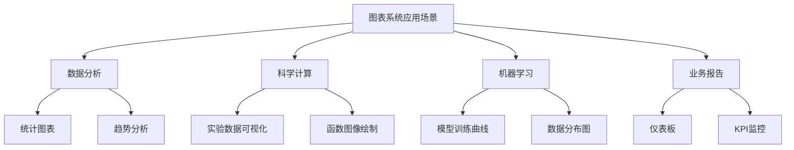
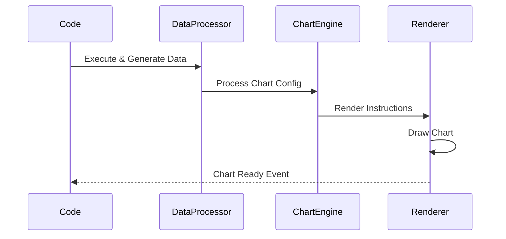

# 图表系统详解

> 🎯 **文档定位**: 深入分析 Code Interpreter JavaScript SDK 中的图表和数据可视化系统，包括图表渲染引擎、交互式可视化、图表导出等功能。基于五步显化法的可视化系统分析。

## 1. 定位与使命 (Positioning & Mission)

### 1.1 模块定位
图表系统是 Code Interpreter 提供数据可视化能力的核心模块，负责将代码执行结果转换为直观的图表和可视化展示。

### 1.2 核心问题
- **渲染性能**: 如何高效渲染大量数据点的图表
- **交互体验**: 如何提供流畅的图表交互功能
- **多格式支持**: 如何支持多种图表类型和数据格式
- **响应式设计**: 如何适配不同屏幕尺寸和设备

### 1.3 应用场景


## 2. 设计思想与哲学基石 (Design Philosophy)

### 2.1 渲染引擎架构
```typescript
interface ChartRenderEngine {
  canvas: CanvasRenderer;     // Canvas 2D/WebGL 渲染
  svg: SVGRenderer;           // SVG 矢量渲染
  webgl: WebGLRenderer;       // 高性能 WebGL 渲染
  css: CSSRenderer;           // CSS 动画渲染
}
```

## 3. 核心数据结构定义 (Core Data Structures)

### 3.1 图表配置结构
```typescript
export interface ChartConfig {
  type: ChartType;
  data: ChartData;
  options: ChartOptions;
  responsive: boolean;
  animation: AnimationConfig;
  interaction: InteractionConfig;
}

export enum ChartType {
  LINE = 'line',
  BAR = 'bar',
  SCATTER = 'scatter',
  PIE = 'pie',
  HISTOGRAM = 'histogram',
  HEATMAP = 'heatmap',
  TREEMAP = 'treemap',
  NETWORK = 'network'
}
```

## 4. 核心接口与逻辑实现 (Core Interfaces)

### 4.1 图表管理器
```typescript
export class ChartManager {
  private charts = new Map<string, Chart>();
  private renderer: ChartRenderer;
  
  constructor(private container: HTMLElement) {
    this.renderer = new ChartRenderer(container);
  }
  
  async createChart(
    id: string, 
    config: ChartConfig
  ): Promise<Chart> {
    const chart = new Chart(id, config, this.renderer);
    await chart.render();
    
    this.charts.set(id, chart);
    return chart;
  }
  
  async updateChart(
    id: string, 
    data: ChartData
  ): Promise<void> {
    const chart = this.charts.get(id);
    if (chart) {
      await chart.updateData(data);
    }
  }
}
```

## 5. 依赖关系与交互 (Dependencies & Interactions)

### 5.1 图表渲染流程


## 总结

图表系统为 Code Interpreter 提供了强大的数据可视化能力，支持多种图表类型和交互方式，为用户提供直观的数据分析体验。

---

**下一篇文档**: [Python SDK 核心模块](28_code_interpreter_python_sdk_index.md)