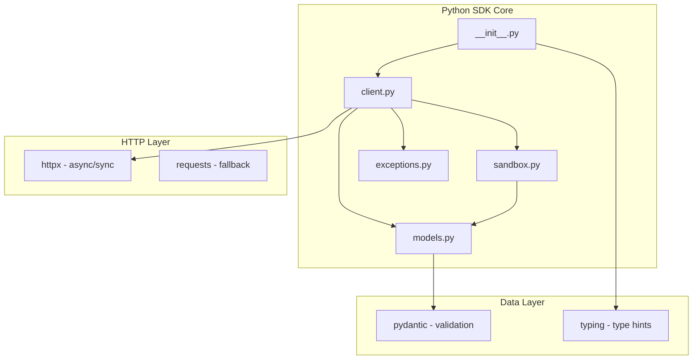

# Python SDK 核心模块

> 🎯 **文档定位**: 深入分析 Code Interpreter Python SDK 的核心实现，包括主入口模块、客户端初始化、异步/同步API设计等关键组件。基于五步显化法的Python SDK分析。

## 1. 定位与使命 (Positioning & Mission)

### 1.1 模块定位
Python SDK 的主入口模块是整个 Python 客户端的核心，负责提供 Pythonic 的 API 接口，支持同步和异步两种编程范式。

### 1.2 核心问题
- **API 设计**: 如何提供符合 Python 习惯的 API 接口
- **异步支持**: 如何优雅地支持 asyncio 异步编程
- **类型安全**: 如何利用 Python 类型提示提供更好的开发体验
- **错误处理**: 如何设计 Python 风格的异常处理机制

## 2. 设计思想与哲学基石 (Design Philosophy)

### 2.1 Pythonic 设计原则
```python
# 简洁优雅的 API 设计
from code_interpreter import CodeInterpreter

# 同步客户端
client = CodeInterpreter(api_key="your-key")
sandbox = client.sandboxes.create(runtime="python3.10")
result = sandbox.execute("print('Hello World')")

# 异步客户端
async with CodeInterpreter(api_key="your-key") as client:
    sandbox = await client.sandboxes.create(runtime="python3.10")
    result = await sandbox.execute("print('Hello World')")
```

## 3. 核心数据结构定义 (Core Data Structures)

### 3.1 客户端配置
```python
from dataclasses import dataclass, field
from typing import Optional, Dict, Any
from enum import Enum

@dataclass
class CodeInterpreterConfig:
    api_key: str
    base_url: str = "https://api.code-interpreter.dev"
    timeout: float = 30.0
    max_retries: int = 3
    retry_delay: float = 1.0
    headers: Dict[str, str] = field(default_factory=dict)
    verify_ssl: bool = True
    
class Runtime(Enum):
    PYTHON_3_9 = "python3.9"
    PYTHON_3_10 = "python3.10"
    PYTHON_3_11 = "python3.11"
    NODE_18 = "node18"
    GO_1_19 = "go1.19"
```

## 4. 核心接口与逻辑实现 (Core Interfaces)

### 4.1 主客户端类
```python
import asyncio
from typing import Optional, Union, AsyncContextManager
from contextlib import asynccontextmanager

class CodeInterpreter:
    def __init__(
        self,
        api_key: str,
        config: Optional[CodeInterpreterConfig] = None
    ):
        self.config = config or CodeInterpreterConfig(api_key=api_key)
        self._http_client: Optional[httpx.AsyncClient] = None
        self._sync_client: Optional[httpx.Client] = None
        
        # 资源管理器
        self.sandboxes = SandboxManager(self)
        self.files = FileManager(self)
        self.executions = ExecutionManager(self)
    
    # 异步上下文管理器
    async def __aenter__(self):
        await self._ensure_async_client()
        return self
    
    async def __aexit__(self, exc_type, exc_val, exc_tb):
        if self._http_client:
            await self._http_client.aclose()
    
    # 同步方法
    def ping(self) -> Dict[str, Any]:
        client = self._get_sync_client()
        response = client.get(f"{self.config.base_url}/ping")
        return response.json()
    
    # 异步方法
    async def aping(self) -> Dict[str, Any]:
        client = await self._ensure_async_client()
        response = await client.get(f"{self.config.base_url}/ping")
        return response.json()
```

### 4.2 沙箱管理器
```python
class SandboxManager:
    def __init__(self, client: CodeInterpreter):
        self.client = client
    
    def create(
        self, 
        runtime: Union[str, Runtime],
        resources: Optional[ResourceConfig] = None,
        **kwargs
    ) -> Sandbox:
        """创建沙箱 - 同步版本"""
        return asyncio.run(self.acreate(runtime, resources, **kwargs))
    
    async def acreate(
        self,
        runtime: Union[str, Runtime], 
        resources: Optional[ResourceConfig] = None,
        **kwargs
    ) -> Sandbox:
        """创建沙箱 - 异步版本"""
        client = await self.client._ensure_async_client()
        
        data = {
            "runtime": runtime.value if isinstance(runtime, Runtime) else runtime,
            "resources": resources.dict() if resources else {},
            **kwargs
        }
        
        response = await client.post(
            f"{self.client.config.base_url}/sandboxes",
            json=data
        )
        
        sandbox_data = response.json()
        return Sandbox(sandbox_data, self.client)
```

## 5. 依赖关系与交互 (Dependencies & Interactions)

### 5.1 模块依赖图


## 总结

Python SDK 通过 Pythonic 的设计理念，为 Python 开发者提供了直观、强大的代码执行平台接口，支持同步和异步两种编程范式，具备完善的类型提示和异常处理机制。

---

**下一篇文档**: [数据模型详解](docs/29_code_interpreter_python_models.md)