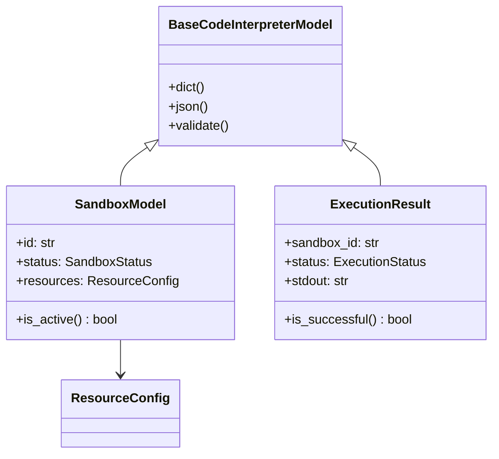

# Python SDK 数据模型详解

> 🎯 **文档定位**: 深入分析 Code Interpreter Python SDK 中的数据模型定义，包括 Pydantic 模型、类型验证、序列化机制等。基于五步显化法的数据模型分析。

## 1. 定位与使命 (Positioning & Mission)

### 1.1 模块定位
数据模型模块定义了 Python SDK 中所有的数据结构，使用 Pydantic 提供类型安全、数据验证和序列化功能。

### 1.2 核心问题
- **类型安全**: 如何确保运行时的类型正确性
- **数据验证**: 如何验证输入数据的有效性  
- **序列化**: 如何在 Python 对象和 JSON 之间转换
- **向后兼容**: 如何处理 API 版本变化

## 2. 设计思想与哲学基石 (Design Philosophy)

### 2.1 Pydantic 模型设计
```python
from pydantic import BaseModel, Field, validator
from typing import Optional, List, Dict, Any, Union
from datetime import datetime
from enum import Enum

class BaseCodeInterpreterModel(BaseModel):
    """所有模型的基类"""
    
    class Config:
        # 允许使用枚举值
        use_enum_values = True
        # 验证赋值
        validate_assignment = True  
        # 允许额外字段
        extra = "forbid"
        # JSON 编码器
        json_encoders = {
            datetime: lambda v: v.isoformat()
        }
```

## 3. 核心数据结构定义 (Core Data Structures)

### 3.1 沙箱相关模型
```python
from typing import Literal

class SandboxStatus(str, Enum):
    CREATING = "creating"
    RUNNING = "running" 
    IDLE = "idle"
    BUSY = "busy"
    SUSPENDED = "suspended"
    TERMINATING = "terminating"
    TERMINATED = "terminated"
    ERROR = "error"

class ResourceConfig(BaseCodeInterpreterModel):
    cpu_cores: float = Field(default=1.0, ge=0.1, le=16.0)
    memory_mb: int = Field(default=512, ge=128, le=32768)
    disk_mb: int = Field(default=1024, ge=256, le=102400)
    timeout_seconds: int = Field(default=300, ge=1, le=3600)
    
    @validator('cpu_cores')
    def validate_cpu_cores(cls, v):
        if v <= 0:
            raise ValueError('CPU cores must be positive')
        return v

class SandboxModel(BaseCodeInterpreterModel):
    id: str
    user_id: str
    runtime: Runtime
    status: SandboxStatus
    resources: ResourceConfig
    created_at: datetime
    last_active_at: Optional[datetime] = None
    terminated_at: Optional[datetime] = None
    metadata: Dict[str, Any] = Field(default_factory=dict)
```

### 3.2 执行相关模型
```python
class ExecutionStatus(str, Enum):
    PENDING = "pending"
    RUNNING = "running"
    COMPLETED = "completed"
    FAILED = "failed"
    CANCELLED = "cancelled"

class ExecutionResult(BaseCodeInterpreterModel):
    id: str
    sandbox_id: str
    code: str
    language: str
    status: ExecutionStatus
    stdout: str = ""
    stderr: str = ""
    exit_code: Optional[int] = None
    execution_time_ms: Optional[int] = None
    memory_used_mb: Optional[float] = None
    created_at: datetime
    started_at: Optional[datetime] = None
    completed_at: Optional[datetime] = None
    error: Optional[str] = None
    
    @property
    def is_successful(self) -> bool:
        return self.status == ExecutionStatus.COMPLETED and self.exit_code == 0
```

## 4. 核心接口与逻辑实现 (Core Interfaces)

### 4.1 模型工厂方法
```python
class ModelFactory:
    """模型工厂，用于创建和转换模型"""
    
    @staticmethod
    def create_sandbox_from_dict(data: Dict[str, Any]) -> SandboxModel:
        """从字典创建沙箱模型"""
        return SandboxModel(**data)
    
    @staticmethod
    def create_execution_from_dict(data: Dict[str, Any]) -> ExecutionResult:
        """从字典创建执行结果模型"""
        return ExecutionResult(**data)
    
    @staticmethod
    def to_api_format(model: BaseCodeInterpreterModel) -> Dict[str, Any]:
        """转换为 API 格式"""
        return model.dict(exclude_none=True, by_alias=True)
```

### 4.2 响应处理器
```python
class ResponseHandler:
    """处理 API 响应并转换为模型"""
    
    @staticmethod
    def handle_sandbox_response(response_data: Dict[str, Any]) -> SandboxModel:
        try:
            return SandboxModel(**response_data)
        except ValidationError as e:
            raise ModelValidationError(f"Invalid sandbox data: {e}")
    
    @staticmethod  
    def handle_execution_response(response_data: Dict[str, Any]) -> ExecutionResult:
        try:
            return ExecutionResult(**response_data)
        except ValidationError as e:
            raise ModelValidationError(f"Invalid execution data: {e}")
```

## 5. 依赖关系与交互 (Dependencies & Interactions)

### 5.1 模型关系图


## 总结

Python SDK 的数据模型通过 Pydantic 提供了强大的类型安全和数据验证能力，为 SDK 的可靠性和易用性提供了坚实的基础。

---

**下一篇文档**: [同步异步实现对比](docs/30_code_interpreter_python_sync_async.md)