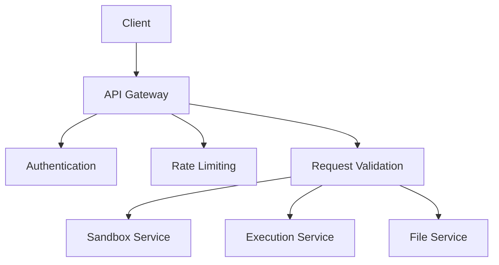

# API 设计哲学

> 🎯 **文档定位**: 深入探讨 Code Interpreter 的 API 设计理念、设计原则和最佳实践，展现现代API设计的完整思维框架。

## 1. 定位与使命 (Positioning & Mission)

### 1.1 API设计定位
Code Interpreter API 采用 RESTful 设计风格，结合 GraphQL 灵活性，提供开发者友好、一致性强的编程接口。

### 1.2 核心设计原则
- **一致性**: 统一的命名规范和响应格式
- **简洁性**: 最少惊讶原则，直观的API设计
- **可扩展性**: 向后兼容的版本演进策略
- **可观测性**: 完善的日志、指标和追踪能力

## 2. 设计思想与哲学基石 (Design Philosophy)

### 2.1 RESTful 资源设计
```
GET    /api/v1/sandboxes              # 列出沙箱
POST   /api/v1/sandboxes              # 创建沙箱
GET    /api/v1/sandboxes/{id}         # 获取沙箱详情
PUT    /api/v1/sandboxes/{id}         # 更新沙箱
DELETE /api/v1/sandboxes/{id}         # 删除沙箱

POST   /api/v1/sandboxes/{id}/execute # 执行代码
GET    /api/v1/sandboxes/{id}/files   # 列出文件
POST   /api/v1/sandboxes/{id}/files   # 上传文件
```

### 2.2 一致的响应格式
```json
{
  "success": true,
  "data": {
    "id": "sandbox_123",
    "status": "running",
    "runtime": "python3.10"
  },
  "meta": {
    "timestamp": "2024-03-20T10:30:00Z",
    "request_id": "req_abc123"
  }
}
```

## 3. 核心数据结构定义 (Core Data Structures)

### 3.1 API响应标准化
```typescript
interface APIResponse<T> {
  success: boolean;
  data?: T;
  error?: APIError;
  meta: ResponseMeta;
}

interface APIError {
  code: string;
  message: string;
  details?: Record<string, any>;
  stack_trace?: string; // 仅开发环境
}
```

## 4. 核心接口与逻辑实现 (Core Interfaces)

### 4.1 版本控制策略
```typescript
// URL版本控制
app.use('/api/v1', v1Router);
app.use('/api/v2', v2Router);

// Header版本控制
app.use((req, res, next) => {
  const version = req.headers['api-version'] || 'v1';
  req.apiVersion = version;
  next();
});
```

### 4.2 错误处理中间件
```typescript
app.use((error, req, res, next) => {
  const response: APIResponse<null> = {
    success: false,
    error: {
      code: error.code || 'INTERNAL_ERROR',
      message: error.message,
      details: error.details
    },
    meta: {
      timestamp: new Date().toISOString(),
      request_id: req.id
    }
  };
  
  res.status(error.statusCode || 500).json(response);
});
```

## 5. 依赖关系与交互 (Dependencies & Interactions)

### 5.1 API网关架构


## 总结

Code Interpreter 的 API 设计体现了现代API设计的最佳实践，通过一致性、简洁性和可扩展性的设计原则，为开发者提供了优秀的使用体验。

---

**下一篇文档**: [最佳实践指南](docs/32_code_interpreter_best_practices.md)