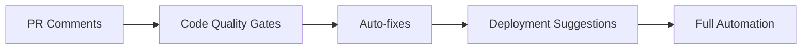

# Claude Code CI/CD 集成指南

将 Claude Code 集成到持续集成和持续部署流程中，实现自动化代码质量保证和智能化开发流程。

## 🚀 快速开始

### 基本集成原则

1. **非阻塞模式**: 默认情况下，AI 建议不应阻塞构建
2. **渐进式采用**: 从代码审查开始，逐步扩展到其他阶段
3. **成本控制**: 设置 API 调用限制，避免意外开支
4. **安全优先**: 敏感信息不应发送给 AI

## 📦 GitHub Actions 集成

### 基础配置

```yaml
# .github/workflows/claude-code.yml
name: Claude Code Analysis

on:
  pull_request:
    types: [opened, synchronize]
  push:
    branches: [main, develop]

jobs:
  code-review:
    runs-on: ubuntu-latest
    steps:
      - uses: actions/checkout@v3
        with:
          fetch-depth: 0
      
      - name: Setup Claude Code
        run: |
          npm install -g @anthropic/claude-code
          claude config set api-key ${{ secrets.CLAUDE_API_KEY }}
      
      - name: Run Code Review
        run: |
          # 获取变更文件
          CHANGED_FILES=$(git diff --name-only HEAD^ HEAD)
          
          # 运行代码审查
          claude review \
            --files "$CHANGED_FILES" \
            --output-format "github-pr-comment" \
            > review-results.md
      
      - name: Post Review Comments
        uses: actions/github-script@v6
        with:
          script: |
            const fs = require('fs');
            const review = fs.readFileSync('review-results.md', 'utf8');
            
            github.rest.issues.createComment({
              issue_number: context.issue.number,
              owner: context.repo.owner,
              repo: context.repo.repo,
              body: review
            });
```

### 高级 PR 审查工作流

```yaml
# .github/workflows/advanced-review.yml
name: Advanced PR Review

on:
  pull_request:
    types: [opened, synchronize]

jobs:
  multi-aspect-review:
    runs-on: ubuntu-latest
    strategy:
      matrix:
        aspect: [security, performance, architecture, documentation]
    
    steps:
      - uses: actions/checkout@v3
      
      - name: Claude Code ${{ matrix.aspect }} Review
        run: |
          claude review \
            --aspect "${{ matrix.aspect }}" \
            --severity "medium,high,critical" \
            --format "json" \
            > ${{ matrix.aspect }}-review.json
      
      - name: Upload Review Results
        uses: actions/upload-artifact@v3
        with:
          name: review-${{ matrix.aspect }}
          path: ${{ matrix.aspect }}-review.json
  
  consolidate-reviews:
    needs: multi-aspect-review
    runs-on: ubuntu-latest
    steps:
      - name: Download All Reviews
        uses: actions/download-artifact@v3
        
      - name: Consolidate and Post
        run: |
          claude consolidate-reviews \
            --input "review-*/*.json" \
            --format "github-pr-summary" \
            --post-to-pr
```

### 自动修复建议

```yaml
- name: Auto-fix Issues
  run: |
    # 运行自动修复
    claude fix \
      --issues "review-results.json" \
      --auto-commit false \
      --output "fixes"
    
    # 创建修复分支
    if [ -n "$(ls -A fixes)" ]; then
      git checkout -b "auto-fix/${{ github.event.pull_request.number }}"
      cp -r fixes/* .
      git add .
      git commit -m "🤖 Apply Claude Code auto-fixes"
      git push origin "auto-fix/${{ github.event.pull_request.number }}"
      
      # 创建修复 PR
      gh pr create \
        --base "${{ github.head_ref }}" \
        --head "auto-fix/${{ github.event.pull_request.number }}" \
        --title "🤖 Auto-fixes for #${{ github.event.pull_request.number }}" \
        --body "This PR contains automated fixes suggested by Claude Code."
    fi
```

## 🏗️ Jenkins 集成

### Pipeline 配置

```groovy
// Jenkinsfile
pipeline {
    agent any
    
    environment {
        CLAUDE_API_KEY = credentials('claude-api-key')
    }
    
    stages {
        stage('Setup') {
            steps {
                sh 'npm install -g @anthropic/claude-code'
                sh 'claude config set api-key $CLAUDE_API_KEY'
            }
        }
        
        stage('Code Analysis') {
            parallel {
                stage('Security Scan') {
                    steps {
                        sh '''
                            claude security scan \
                              --format "junit" \
                              --output "security-report.xml"
                        '''
                        junit 'security-report.xml'
                    }
                }
                
                stage('Code Quality') {
                    steps {
                        sh '''
                            claude analyze \
                              --metrics "all" \
                              --threshold "quality-gate.json" \
                              --format "sonarqube"
                        '''
                        
                        // 集成 SonarQube
                        withSonarQubeEnv('SonarQube') {
                            sh 'sonar-scanner'
                        }
                    }
                }
                
                stage('Documentation Check') {
                    steps {
                        sh '''
                            claude doc check \
                              --coverage-threshold 80 \
                              --format "junit"
                        '''
                    }
                }
            }
        }
        
        stage('Generate Reports') {
            steps {
                sh '''
                    claude report generate \
                      --type "comprehensive" \
                      --format "html" \
                      --output "claude-report.html"
                '''
                
                publishHTML([
                    allowMissing: false,
                    alwaysLinkToLastBuild: true,
                    keepAll: true,
                    reportDir: '.',
                    reportFiles: 'claude-report.html',
                    reportName: 'Claude Code Analysis'
                ])
            }
        }
    }
    
    post {
        always {
            // 发送通知
            sh '''
                claude notify \
                  --platform "slack" \
                  --webhook "$SLACK_WEBHOOK" \
                  --summary
            '''
        }
        
        failure {
            // 失败时生成改进建议
            sh '''
                claude suggest improvements \
                  --based-on "build-logs" \
                  --output "improvement-suggestions.md"
            '''
        }
    }
}
```

### 质量门禁配置

```json
// quality-gate.json
{
  "rules": {
    "complexity": {
      "max_per_function": 10,
      "max_per_file": 50,
      "action": "warn"
    },
    "duplication": {
      "max_percentage": 5,
      "action": "fail"
    },
    "security": {
      "critical_issues": 0,
      "high_issues": 0,
      "action": "fail"
    },
    "test_coverage": {
      "minimum": 80,
      "action": "warn"
    },
    "documentation": {
      "public_api_coverage": 100,
      "action": "warn"
    }
  }
}
```

## 🔄 GitLab CI/CD 集成

### 基础 Pipeline

```yaml
# .gitlab-ci.yml
stages:
  - setup
  - analyze
  - review
  - deploy

variables:
  CLAUDE_CACHE_DIR: "$CI_PROJECT_DIR/.claude-cache"

before_script:
  - npm install -g @anthropic/claude-code
  - claude config set api-key $CLAUDE_API_KEY
  - claude config set cache.dir $CLAUDE_CACHE_DIR

code_quality:
  stage: analyze
  script:
    - claude analyze --format gitlab-codequality > gl-code-quality-report.json
  artifacts:
    reports:
      codequality: gl-code-quality-report.json
  cache:
    key: claude-analysis-$CI_COMMIT_REF_SLUG
    paths:
      - $CLAUDE_CACHE_DIR

security_scan:
  stage: analyze
  script:
    - claude security scan --format gitlab-sast > gl-sast-report.json
  artifacts:
    reports:
      sast: gl-sast-report.json

merge_request_review:
  stage: review
  only:
    - merge_requests
  script:
    - |
      claude review \
        --base-branch $CI_MERGE_REQUEST_TARGET_BRANCH_NAME \
        --format "gitlab-mr-note" \
        | gitlab-cli mr note create --mr $CI_MERGE_REQUEST_IID

smart_deployment:
  stage: deploy
  only:
    - main
  script:
    - |
      # 生成部署建议
      claude deploy suggest \
        --environment "production" \
        --risk-analysis \
        --output "deployment-plan.json"
      
      # 根据建议执行部署
      if claude deploy validate deployment-plan.json; then
        ./deploy.sh --plan deployment-plan.json
      else
        echo "Deployment blocked by Claude Code risk analysis"
        exit 1
      fi
```

## 🐳 Docker 集成

### Claude Code Docker 镜像

```dockerfile
# Dockerfile.claude
FROM node:18-alpine

# 安装 Claude Code
RUN npm install -g @anthropic/claude-code

# 添加自定义配置
COPY claude-config.json /etc/claude/config.json

# 创建工作目录
WORKDIR /workspace

# 入口脚本
COPY docker-entrypoint.sh /usr/local/bin/
RUN chmod +x /usr/local/bin/docker-entrypoint.sh

ENTRYPOINT ["docker-entrypoint.sh"]
CMD ["claude", "--help"]
```

### Docker Compose 配置

```yaml
# docker-compose.yml
version: '3.8'

services:
  claude-code:
    build:
      context: .
      dockerfile: Dockerfile.claude
    environment:
      - CLAUDE_API_KEY=${CLAUDE_API_KEY}
      - CLAUDE_MODEL=claude-3-opus-20240229
    volumes:
      - .:/workspace
      - claude-cache:/var/cache/claude
    networks:
      - development

  claude-mcp-postgres:
    image: anthropic/mcp-postgres:latest
    environment:
      - DATABASE_URL=postgresql://postgres:password@db:5432/dev
    depends_on:
      - db
    networks:
      - development

  db:
    image: postgres:15
    environment:
      - POSTGRES_PASSWORD=password
      - POSTGRES_DB=dev
    networks:
      - development

volumes:
  claude-cache:

networks:
  development:
```

## 🔧 Kubernetes 集成

### Kubernetes Job 配置

```yaml
# claude-analysis-job.yaml
apiVersion: batch/v1
kind: Job
metadata:
  name: claude-code-analysis
  namespace: ci-cd
spec:
  template:
    spec:
      containers:
      - name: claude-analyzer
        image: anthropic/claude-code:latest
        env:
        - name: CLAUDE_API_KEY
          valueFrom:
            secretKeyRef:
              name: claude-secrets
              key: api-key
        - name: GIT_REPO
          value: "https://github.com/org/repo.git"
        command:
        - sh
        - -c
        - |
          git clone $GIT_REPO /workspace
          cd /workspace
          claude analyze --comprehensive --output /results/analysis.json
        volumeMounts:
        - name: results
          mountPath: /results
      volumes:
      - name: results
        persistentVolumeClaim:
          claimName: analysis-results
      restartPolicy: Never
```

### Kubernetes CronJob

```yaml
# claude-scheduled-review.yaml
apiVersion: batch/v1
kind: CronJob
metadata:
  name: nightly-code-review
  namespace: ci-cd
spec:
  schedule: "0 2 * * *"  # 每天凌晨 2 点
  jobTemplate:
    spec:
      template:
        spec:
          containers:
          - name: claude-reviewer
            image: anthropic/claude-code:latest
            env:
            - name: CLAUDE_API_KEY
              valueFrom:
                secretKeyRef:
                  name: claude-secrets
                  key: api-key
            command:
            - claude
            - review
            - --schedule
            - --notify-slack
            - --comprehensive
```

## 📊 监控和报告

### Prometheus 指标

```yaml
# claude-metrics-exporter.yaml
apiVersion: v1
kind: Service
metadata:
  name: claude-metrics
  labels:
    app: claude-metrics
spec:
  ports:
  - port: 9090
    name: metrics
  selector:
    app: claude-metrics

---
apiVersion: apps/v1
kind: Deployment
metadata:
  name: claude-metrics-exporter
spec:
  replicas: 1
  selector:
    matchLabels:
      app: claude-metrics
  template:
    metadata:
      labels:
        app: claude-metrics
    spec:
      containers:
      - name: exporter
        image: anthropic/claude-metrics-exporter:latest
        ports:
        - containerPort: 9090
        env:
        - name: CLAUDE_API_KEY
          valueFrom:
            secretKeyRef:
              name: claude-secrets
              key: api-key
```

### Grafana Dashboard 配置

```json
{
  "dashboard": {
    "title": "Claude Code CI/CD Metrics",
    "panels": [
      {
        "title": "Code Quality Trend",
        "targets": [{
          "expr": "avg(claude_code_quality_score) by (project)"
        }]
      },
      {
        "title": "Security Issues",
        "targets": [{
          "expr": "sum(claude_security_issues) by (severity)"
        }]
      },
      {
        "title": "API Usage",
        "targets": [{
          "expr": "rate(claude_api_calls_total[5m])"
        }]
      },
      {
        "title": "Review Time",
        "targets": [{
          "expr": "histogram_quantile(0.95, claude_review_duration_seconds)"
        }]
      }
    ]
  }
}
```

## 🔐 安全最佳实践

### 密钥管理

```yaml
# 使用 GitHub Secrets
- name: Configure Claude
  env:
    CLAUDE_API_KEY: ${{ secrets.CLAUDE_API_KEY }}
    
# 使用 HashiCorp Vault
- name: Get Secrets from Vault
  run: |
    export CLAUDE_API_KEY=$(vault kv get -field=api_key secret/claude)
    
# 使用 AWS Secrets Manager
- name: Get Secrets from AWS
  run: |
    export CLAUDE_API_KEY=$(aws secretsmanager get-secret-value \
      --secret-id claude-api-key \
      --query SecretString --output text)
```

### 网络隔离

```yaml
# 私有网络配置
claude config set api.proxy "http://internal-proxy:3128"
claude config set api.timeout 30000
claude config set api.retry.max 3
```

## 🎯 最佳实践

### 1. 渐进式集成策略



### 2. 成本优化

```yaml
# 配置 API 使用限制
claude config set api.daily_limit 1000
claude config set api.per_pr_limit 50
claude config set api.cache_ttl 3600

# 使用缓存
claude config set cache.enabled true
claude config set cache.share_across_builds true
```

### 3. 错误处理

```bash
#!/bin/bash
# ci-claude-wrapper.sh

set -e

MAX_RETRIES=3
RETRY_COUNT=0

while [ $RETRY_COUNT -lt $MAX_RETRIES ]; do
    if claude "$@"; then
        exit 0
    else
        RETRY_COUNT=$((RETRY_COUNT + 1))
        echo "Claude command failed, retry $RETRY_COUNT/$MAX_RETRIES"
        sleep $((RETRY_COUNT * 10))
    fi
done

echo "Claude command failed after $MAX_RETRIES retries"
exit 1
```

## 📈 ROI 测量

### 关键指标

1. **代码质量提升**
   - Bug 密度降低百分比
   - 代码审查时间减少
   - 技术债务减少

2. **开发效率**
   - PR 审查周期缩短
   - 自动修复率
   - 文档覆盖率提升

3. **成本节约**
   - 减少的 bug 修复成本
   - 节省的开发时间
   - 降低的安全风险

### 报告模板

```markdown
# Claude Code CI/CD 月度报告

## 执行摘要
- 总 API 调用: {{ total_api_calls }}
- 发现问题: {{ issues_found }}
- 自动修复: {{ auto_fixed }}
- 节省时间: {{ hours_saved }} 小时

## 详细分析
...
```

## 下一步

掌握了 CI/CD 集成后，你可以：
- [优化开发工作流](claude-code_workflow.md)
- [配置团队协作环境](claude-code_team.md)
- [深入了解高级功能](claude-code_advanced.md)