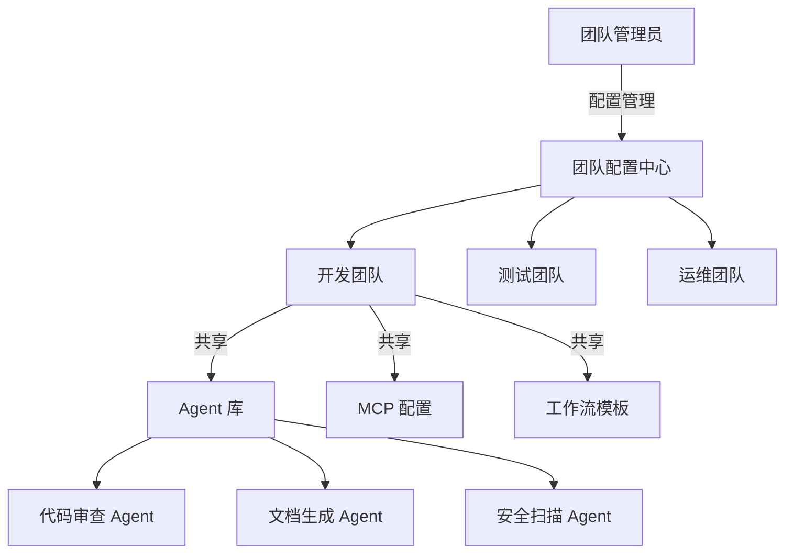

# Claude Code 团队协作配置指南

配置和管理团队环境中的 Claude Code，实现高效的 AI 辅助协同开发。

## 🏢 团队配置概览

### 团队架构模型



## 🔧 基础团队设置

### 1. 团队配置文件结构

```
project-root/
├── .claude/
│   ├── team.json           # 团队配置
│   ├── members.json        # 成员权限
│   ├── shared/            # 共享资源
│   │   ├── agents/        # 团队 Agent
│   │   ├── workflows/     # 工作流模板
│   │   └── templates/     # 代码模板
│   └── policies/          # 团队策略
│       ├── security.json  # 安全策略
│       ├── quality.json   # 质量标准
│       └── review.json    # 审查规则
```

### 2. 团队配置文件

```json
// .claude/team.json
{
  "team": {
    "name": "Engineering Team",
    "organization": "TechCorp",
    "created": "2024-01-01",
    "admin": "team-lead@company.com"
  },
  "settings": {
    "api_key_source": "environment",
    "shared_cache": true,
    "centralized_logs": true,
    "audit_enabled": true
  },
  "integrations": {
    "slack": {
      "workspace": "techcorp",
      "channels": {
        "notifications": "#claude-notifications",
        "reviews": "#code-reviews",
        "alerts": "#claude-alerts"
      }
    },
    "github": {
      "organization": "techcorp",
      "default_reviewers": ["@ai-team"],
      "protected_branches": ["main", "production"]
    }
  },
  "quotas": {
    "daily_api_calls": 10000,
    "per_user_limit": 500,
    "model_restrictions": {
      "production": ["claude-3-opus"],
      "development": ["claude-3-sonnet", "claude-3-haiku"]
    }
  }
}
```

### 3. 成员权限管理

```json
// .claude/members.json
{
  "roles": {
    "admin": {
      "permissions": ["*"],
      "description": "完全管理权限"
    },
    "developer": {
      "permissions": [
        "use_agents",
        "create_personal_agents",
        "use_workflows",
        "view_analytics"
      ],
      "api_quota": 500,
      "model_access": ["claude-3-sonnet"]
    },
    "reviewer": {
      "permissions": [
        "use_review_agents",
        "approve_changes",
        "view_all_code",
        "generate_reports"
      ],
      "api_quota": 1000,
      "model_access": ["claude-3-opus", "claude-3-sonnet"]
    },
    "junior": {
      "permissions": [
        "use_agents",
        "use_templates",
        "view_docs"
      ],
      "api_quota": 200,
      "model_access": ["claude-3-haiku"],
      "require_approval": true
    }
  },
  "members": [
    {
      "email": "john@company.com",
      "role": "developer",
      "custom_quota": 800
    },
    {
      "email": "jane@company.com",
      "role": "reviewer"
    },
    {
      "email": "intern@company.com",
      "role": "junior",
      "mentor": "john@company.com"
    }
  ]
}
```

## 🤝 共享资源管理

### 团队 Agent 库

```markdown
# .claude/shared/agents/team-code-reviewer.md

# Team Code Reviewer Agent

专门为团队定制的代码审查 Agent，遵循公司编码标准。

## 审查标准
基于文件: /policies/coding-standards.md

## 审查重点
1. 安全性（参考 OWASP Top 10）
2. 性能（基于团队基准）
3. 可维护性（遵循团队约定）
4. 文档完整性

## 特殊规则
- PR 必须有至少 80% 的测试覆盖率
- 新 API 必须有完整文档
- 破坏性变更需要迁移指南

## 集成
- 自动评论到 GitHub PR
- 结果同步到 Slack #code-reviews
- 严重问题自动创建 Jira ticket
```

### 共享工作流模板

```yaml
# .claude/shared/workflows/feature-development.yml
name: Standard Feature Development
description: 团队标准功能开发流程
owner: tech-lead

stages:
  - name: Planning
    required_participants: [developer, product_owner]
    steps:
      - action: claude analyze requirements
      - action: claude estimate effort
      - action: create jira tickets
      
  - name: Development  
    assignee: ${developer}
    parallel_allowed: true
    steps:
      - action: claude generate structure
      - action: implement with ai assistance
      - action: claude generate tests
      - action: self review with claude
      
  - name: Review
    required_participants: [reviewer, qa]
    auto_assign: true
    steps:
      - action: claude pre-review
      - action: human review
      - action: qa testing
      - action: security scan
      
  - name: Deployment
    requires_approval: [tech_lead, devops]
    steps:
      - action: claude risk assessment
      - action: deploy to staging
      - action: automated testing
      - action: production release

notifications:
  slack:
    channel: "#feature-updates"
    events: [stage_complete, blocked, completed]
```

## 📊 团队分析和报告

### 团队仪表板配置

```javascript
// .claude/shared/dashboards/team-metrics.js
module.exports = {
  name: "Team Performance Dashboard",
  refresh_interval: "1h",
  
  widgets: [
    {
      type: "chart",
      title: "代码质量趋势",
      data_source: "claude.metrics.code_quality",
      group_by: "team_member",
      period: "last_30_days"
    },
    {
      type: "leaderboard",
      title: "AI 使用效率",
      metrics: [
        "api_calls_saved",
        "time_saved",
        "bugs_prevented"
      ],
      sort_by: "efficiency_score"
    },
    {
      type: "heatmap",
      title: "团队活动热力图",
      data_source: "claude.activity",
      dimensions: ["hour", "day_of_week"]
    },
    {
      type: "alerts",
      title: "质量警报",
      filters: {
        severity: ["high", "critical"],
        age: "<24h"
      }
    }
  ],
  
  reports: {
    weekly: {
      recipients: ["team-lead@company.com"],
      include: [
        "team_productivity",
        "code_quality_metrics",
        "ai_usage_stats",
        "cost_analysis"
      ]
    },
    monthly: {
      recipients: ["cto@company.com"],
      include: [
        "roi_analysis",
        "team_growth",
        "technology_adoption"
      ]
    }
  }
};
```

### 团队知识库

```yaml
# .claude/knowledge-base/config.yml
name: Team Knowledge Base
description: 共享团队知识和最佳实践

sources:
  - type: documentation
    path: /docs
    index: true
    
  - type: code_patterns
    path: /src
    extract: 
      - design_patterns
      - common_solutions
      - anti_patterns
      
  - type: historical_data
    sources:
      - pull_requests
      - code_reviews  
      - incident_reports
    retention: 1_year
    
  - type: external
    urls:
      - https://company-wiki.internal
      - https://tech-blog.company.com
    refresh: daily

access_control:
  default: read
  write: [admin, senior_developer]
  
indexing:
  schedule: "0 2 * * *"
  incremental: true
  
search:
  enabled: true
  filters: [language, author, date, type]
```

## 🔐 安全和合规

### 安全策略配置

```json
// .claude/policies/security.json
{
  "data_handling": {
    "pii_detection": true,
    "pii_handling": "redact",
    "sensitive_patterns": [
      "api_key",
      "password",
      "token",
      "secret",
      "credential"
    ],
    "excluded_files": [
      "*.env",
      "*.key",
      "*.pem",
      "secrets/*"
    ]
  },
  "api_security": {
    "require_encryption": true,
    "ip_whitelist": ["10.0.0.0/8"],
    "rate_limiting": {
      "per_user": "100/hour",
      "per_ip": "1000/hour"
    }
  },
  "audit_requirements": {
    "log_all_requests": true,
    "retain_days": 90,
    "compliance_standards": ["SOC2", "GDPR"]
  },
  "access_control": {
    "mfa_required": true,
    "session_timeout": "8h",
    "ip_restriction": true
  }
}
```

### 合规检查工作流

```bash
#!/bin/bash
# .claude/scripts/compliance-check.sh

# 每日合规检查
claude compliance check \
  --standards "SOC2,GDPR,HIPAA" \
  --generate-report \
  --notify-violations

# 数据隐私审计
claude audit data-privacy \
  --scan-all-requests \
  --period "last-7-days" \
  --flag-pii-exposure

# 访问控制审计
claude audit access \
  --check-permissions \
  --verify-mfa \
  --report-anomalies
```

## 👥 协作功能

### 实时协作配置

```javascript
// .claude/collaboration/config.js
module.exports = {
  realtime: {
    enabled: true,
    features: {
      pair_programming: {
        enabled: true,
        share_context: true,
        sync_selections: true
      },
      code_review: {
        enabled: true,
        live_suggestions: true,
        collaborative_fixes: true
      },
      mob_programming: {
        enabled: true,
        max_participants: 5,
        role_rotation: "15min"
      }
    }
  },
  
  communication: {
    channels: {
      suggestions: "websocket",
      discussions: "slack",
      notifications: "email,slack"
    },
    threading: true,
    history_retention: "30d"
  },
  
  conflict_resolution: {
    strategy: "last-write-wins",
    auto_merge: false,
    require_consensus: true
  }
};
```

### 代码评审协作

```yaml
# .claude/review-process.yml
name: Collaborative Code Review
description: 团队协作代码评审流程

participants:
  author: required
  reviewer: required
  ai_assistant: claude-3-opus
  optional: [architect, security_expert]

stages:
  - name: Pre-Review
    automated: true
    actions:
      - claude lint code
      - claude security scan
      - claude test coverage check
      - claude documentation check
    
  - name: AI Review
    actions:
      - claude review architecture
      - claude review performance
      - claude review best-practices
      - claude suggest improvements
    output: ai-review-report.md
    
  - name: Human Review
    parallel: true
    reviewers:
      - assign: auto
        count: 2
        criteria: [language_expert, component_owner]
    tools:
      - inline_comments
      - suggestion_mode
      - ai_explanations
      
  - name: Discussion
    features:
      - threaded_discussions
      - ai_mediation
      - consensus_tracking
    timeout: 48h
    
  - name: Resolution
    require_all:
      - all_comments_resolved
      - ci_passing
      - approval_count: 2
    actions:
      - merge_pr
      - update_docs
      - notify_team
```

## 📈 团队生产力工具

### 智能任务分配

```python
# .claude/automation/task-assignment.py
import claude
from datetime import datetime
import json

class SmartTaskAssigner:
    def __init__(self, team_config):
        self.team = team_config
        self.claude = claude.Client()
        
    def assign_task(self, task):
        # 分析任务需求
        requirements = self.claude.analyze_task(task, include=[
            'required_skills',
            'estimated_effort',
            'dependencies',
            'priority'
        ])
        
        # 获取团队成员状态
        team_status = self.get_team_availability()
        
        # 智能匹配
        best_match = self.claude.match_task_to_developer(
            task=requirements,
            team=team_status,
            criteria={
                'skill_match': 0.4,
                'availability': 0.3,
                'workload_balance': 0.2,
                'past_performance': 0.1
            }
        )
        
        # 创建分配计划
        assignment = {
            'task': task,
            'assignee': best_match['developer'],
            'estimated_completion': best_match['eta'],
            'confidence': best_match['confidence'],
            'backup_assignees': best_match['alternatives']
        }
        
        return self.execute_assignment(assignment)
    
    def balance_workload(self):
        """定期重新平衡团队工作负载"""
        current_load = self.analyze_current_workload()
        
        if current_load['imbalance_score'] > 0.3:
            rebalance_plan = self.claude.suggest_rebalancing(
                current_load,
                constraints={
                    'minimize_context_switch': True,
                    'respect_expertise': True,
                    'maintain_deadlines': True
                }
            )
            
            return self.apply_rebalancing(rebalance_plan)
```

### 团队学习系统

```yaml
# .claude/learning/team-growth.yml
name: Team Learning and Growth
description: AI 驱动的团队技能提升系统

components:
  skill_tracking:
    track:
      - languages: [python, javascript, go]
      - frameworks: [react, django, kubernetes]
      - practices: [tdd, security, performance]
    assessment:
      - code_reviews
      - project_outcomes
      - peer_feedback
      
  learning_recommendations:
    personalized: true
    based_on:
      - skill_gaps
      - project_needs
      - career_goals
    delivery:
      - daily_tips
      - weekly_challenges
      - monthly_workshops
      
  knowledge_sharing:
    mechanisms:
      - code_review_discussions
      - pattern_library
      - best_practices_wiki
      - failure_postmortems
    ai_features:
      - auto_document_patterns
      - extract_learnings
      - suggest_improvements

metrics:
  individual:
    - skill_progression
    - code_quality_improvement
    - knowledge_contributions
  team:
    - collective_expertise
    - knowledge_coverage
    - collaboration_score
```

## 🚀 扩展和集成

### 企业集成配置

```json
// .claude/enterprise-config.json
{
  "sso": {
    "provider": "okta",
    "enabled": true,
    "auto_provision": true
  },
  "integrations": {
    "jira": {
      "enabled": true,
      "project_key": "TECH",
      "auto_create_issues": true,
      "sync_comments": true
    },
    "confluence": {
      "enabled": true,
      "space_key": "ENGDOCS",
      "auto_update_docs": true
    },
    "datadog": {
      "enabled": true,
      "api_key": "${DATADOG_API_KEY}",
      "track_metrics": true
    },
    "pagerduty": {
      "enabled": true,
      "integration_key": "${PAGERDUTY_KEY}",
      "severity_mapping": {
        "critical": "P1",
        "high": "P2",
        "medium": "P3"
      }
    }
  },
  "data_residency": {
    "region": "us-east-1",
    "encryption": "AES-256",
    "backup_retention": "30d"
  }
}
```

### API 网关配置

```nginx
# /etc/nginx/claude-gateway.conf
upstream claude_backend {
    server api.anthropic.com:443;
    keepalive 32;
}

server {
    listen 443 ssl;
    server_name claude.internal.company.com;
    
    ssl_certificate /etc/ssl/company.crt;
    ssl_certificate_key /etc/ssl/company.key;
    
    # 请求日志
    access_log /var/log/nginx/claude-access.log claude_analytics;
    
    # 速率限制
    limit_req_zone $binary_remote_addr zone=claude_limit:10m rate=100r/m;
    limit_req zone=claude_limit burst=20 nodelay;
    
    # 请求路由
    location /api/ {
        # 认证检查
        auth_request /auth;
        
        # 添加团队标识
        proxy_set_header X-Team-ID $team_id;
        proxy_set_header X-User-ID $user_id;
        
        # 代理到 Claude API
        proxy_pass https://claude_backend;
        proxy_ssl_server_name on;
        
        # 响应处理
        proxy_intercept_errors on;
        error_page 429 = /handle_rate_limit;
    }
    
    location = /auth {
        internal;
        proxy_pass http://auth-service:8080/verify;
        proxy_set_header X-Original-URI $request_uri;
    }
}
```

## 📋 最佳实践

### 1. 团队入职流程

```bash
#!/bin/bash
# .claude/scripts/onboard-new-member.sh

email=$1
role=$2

# 创建用户配置
claude team add-member \
  --email "$email" \
  --role "$role" \
  --send-welcome

# 设置初始权限
claude permissions grant \
  --user "$email" \
  --from-template "$role"

# 分配导师（如果是初级）
if [ "$role" == "junior" ]; then
  mentor=$(claude team suggest-mentor --for "$email")
  claude team assign-mentor --user "$email" --mentor "$mentor"
fi

# 创建个人工作空间
claude workspace create \
  --user "$email" \
  --copy-team-settings

# 安排培训
claude training schedule \
  --user "$email" \
  --courses "claude-basics,team-workflows,coding-standards"

# 发送欢迎包
claude notify \
  --user "$email" \
  --template "welcome" \
  --attach "team-handbook.pdf,setup-guide.md"
```

### 2. 定期团队回顾

```python
# .claude/scripts/team-retrospective.py
import claude
import datetime

def run_retrospective():
    # 收集数据
    metrics = claude.collect_metrics(
        period="last_sprint",
        categories=[
            "productivity",
            "code_quality", 
            "collaboration",
            "ai_utilization"
        ]
    )
    
    # 生成洞察
    insights = claude.analyze_team_performance(
        metrics,
        compare_to="previous_sprint",
        identify=["improvements", "regressions", "patterns"]
    )
    
    # 创建行动计划
    action_items = claude.suggest_improvements(
        based_on=insights,
        feasibility="high",
        impact="high"
    )
    
    # 生成报告
    report = claude.generate_retrospective_report(
        metrics=metrics,
        insights=insights,
        actions=action_items,
        format="interactive_dashboard"
    )
    
    # 分享和讨论
    claude.schedule_meeting(
        title="Sprint Retrospective",
        participants="@team",
        agenda=report,
        duration="1h"
    )
    
    return report

# 每个冲刺结束时运行
if __name__ == "__main__":
    run_retrospective()
```

### 3. 团队健康度监控

```yaml
# .claude/monitors/team-health.yml
name: Team Health Monitor
description: 持续监控团队健康状态

indicators:
  productivity:
    metrics:
      - velocity_trend
      - cycle_time
      - deployment_frequency
    thresholds:
      healthy: "> baseline * 0.9"
      warning: "< baseline * 0.8"
      critical: "< baseline * 0.6"
      
  quality:
    metrics:
      - bug_density
      - code_review_coverage
      - test_coverage
    thresholds:
      healthy: "bugs < 5/kloc"
      warning: "bugs < 10/kloc"
      critical: "bugs > 15/kloc"
      
  collaboration:
    metrics:
      - pr_review_time
      - knowledge_sharing_score
      - team_communication_index
    thresholds:
      healthy: "review_time < 4h"
      warning: "review_time < 8h"
      critical: "review_time > 24h"
      
  wellbeing:
    metrics:
      - overtime_hours
      - on_call_burden
      - satisfaction_score
    thresholds:
      healthy: "overtime < 10%"
      warning: "overtime < 20%"
      critical: "overtime > 30%"

actions:
  on_warning:
    - notify: team_lead
    - suggest: improvements
    - schedule: check_in_meeting
    
  on_critical:
    - notify: [team_lead, manager]
    - generate: action_plan
    - schedule: intervention_meeting
    - pause: non_critical_features

reporting:
  dashboard: real_time
  email: weekly
  review: monthly
```

## 🎯 成功指标

### 团队采用率
- 日活跃用户百分比
- 功能使用率
- 自动化任务比例

### 效率提升
- 开发速度提升
- Bug 减少率
- 代码审查时间缩短

### 质量改进
- 代码质量评分
- 测试覆盖率
- 文档完整性

### 投资回报
- 节省的开发时间
- 减少的生产问题
- 团队满意度提升

## 下一步

完成团队配置后，你可以：
- [探索更多高级功能](claude-code_advanced.md)
- [优化 CI/CD 集成](claude-code_cicd.md)
- [个性化开发工作流](claude-code_workflow.md)