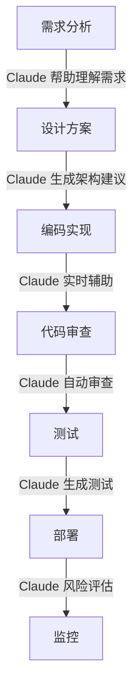

# Claude Code 开发工作流集成

将 Claude Code 无缝集成到日常开发工作流中，提升个人和团队的开发效率。

## 🌟 工作流概览

### 典型开发流程集成点



## 🎯 个人开发工作流

### 1. 项目初始化工作流

创建 `.claude/workflows/init.yml`:

```yaml
name: Project Initialization
description: 智能项目初始化流程

steps:
  - name: Analyze Requirements
    action: claude analyze requirements
    input: README.md
    output: requirements-analysis.md
    
  - name: Generate Project Structure
    action: claude generate structure
    based_on: requirements-analysis.md
    template: ${project_type}
    
  - name: Create Boilerplate
    action: claude generate boilerplate
    includes:
      - configuration files
      - basic components
      - test setup
      - documentation templates
      
  - name: Setup Development Environment
    action: claude setup environment
    includes:
      - git hooks
      - linters
      - formatters
      - pre-commit checks
      
  - name: Initialize Documentation
    action: claude doc init
    format: ${doc_format}
    includes:
      - README
      - CONTRIBUTING
      - API documentation
      - Architecture docs
```

使用工作流：

```bash
# 执行项目初始化工作流
claude workflow run init --project-type nodejs --doc-format markdown
```

### 2. 功能开发工作流

```bash
#!/bin/bash
# .claude/scripts/feature-development.sh

feature_name=$1

# 1. 创建功能分支
git checkout -b feature/$feature_name

# 2. 生成功能脚手架
claude generate feature $feature_name \
  --with-tests \
  --with-docs \
  --interactive

# 3. 开启实时辅助模式
claude assist --mode development \
  --watch "src/**/*.js" \
  --provide "suggestions,completions,refactoring"

# 4. 提交前检查
claude pre-commit check \
  --fix-automatically \
  --generate-commit-message
```

### 3. 问题解决工作流

```yaml
# .claude/workflows/debug.yml
name: Intelligent Debugging
description: AI 辅助的问题诊断和解决

triggers:
  - on: error
    condition: "build_failed or test_failed"
  - on: manual
    command: "claude debug"

steps:
  - name: Collect Context
    actions:
      - gather: error logs
      - gather: recent changes  
      - gather: system state
      
  - name: Analyze Problem
    action: claude analyze error
    with:
      context: collected_data
      search_similar: true
      check_documentation: true
      
  - name: Suggest Solutions
    action: claude suggest fixes
    output_format: ranked_list
    include:
      - code changes
      - configuration updates
      - workarounds
      
  - name: Implement Fix
    action: claude implement fix
    mode: interactive
    verify: true
```

## 💻 IDE 集成工作流

### VS Code 集成

```json
// .vscode/settings.json
{
  "claude.enabled": true,
  "claude.features": {
    "inlineCompletions": true,
    "codeActions": true,
    "hoverInformation": true,
    "diagnostics": true
  },
  "claude.triggers": {
    "onSave": ["format", "lint"],
    "onType": ["suggest"],
    "onProblem": ["explain", "fix"]
  },
  "claude.shortcuts": {
    "cmd+shift+a": "claude.askAboutCode",
    "cmd+shift+r": "claude.refactor",
    "cmd+shift+t": "claude.generateTests",
    "cmd+shift+d": "claude.generateDocs"
  }
}
```

### 自定义代码动作

```javascript
// .vscode/claude-actions.js
module.exports = {
  actions: [
    {
      id: 'optimizeFunction',
      title: '🤖 Optimize with Claude',
      kind: 'refactor',
      handler: async (context) => {
        const result = await claude.optimize(context.selection);
        return result.suggestions;
      }
    },
    {
      id: 'explainCode',
      title: '🤖 Explain this code',
      kind: 'info',
      handler: async (context) => {
        const explanation = await claude.explain(context.selection);
        vscode.window.showInformationMessage(explanation);
      }
    },
    {
      id: 'securityCheck',
      title: '🔒 Security check',
      kind: 'warning',
      handler: async (context) => {
        const issues = await claude.security.scan(context.document);
        return issues.map(issue => ({
          severity: issue.severity,
          message: issue.description,
          fixes: issue.suggestedFixes
        }));
      }
    }
  ]
};
```

## 🔄 Git 工作流集成

### 智能提交工作流

```bash
# .gitmessage
# Claude will help you write a better commit message
#
# <type>(<scope>): <subject>
#
# <body>
#
# <footer>

# Claude 将基于以下信息生成提交信息：
# - 变更的文件
# - 代码差异
# - 项目约定
# - 最近的提交历史
```

Git 钩子配置：

```bash
#!/bin/bash
# .git/hooks/prepare-commit-msg

# 让 Claude 生成或改进提交信息
claude git commit-message \
  --analyze-diff \
  --follow-conventional-commits \
  --max-length 72 \
  > $1.tmp

# 让用户确认或编辑
mv $1.tmp $1
```

### 智能合并冲突解决

```bash
#!/bin/bash
# .git/hooks/merge-conflict-resolver

# 检测合并冲突
if git diff --name-only --diff-filter=U | grep -q .; then
  echo "Detected merge conflicts. Invoking Claude for assistance..."
  
  # 让 Claude 分析并建议解决方案
  claude merge resolve \
    --strategy "semantic" \
    --prefer "feature-branch" \
    --explain-decisions \
    --interactive
fi
```

## 📝 文档工作流

### 自动文档生成流程

```yaml
# .claude/workflows/documentation.yml
name: Documentation Pipeline
description: 自动化文档生成和维护

schedule:
  - on: push
    branches: [main, develop]
  - on: cron
    schedule: "0 0 * * 0"  # 每周日

steps:
  - name: Scan Code Changes
    action: detect documentation needs
    rules:
      - new public APIs need documentation
      - modified APIs need doc updates
      - deprecated APIs need notices
      
  - name: Generate Documentation
    action: claude doc generate
    config:
      format: markdown
      style: ${doc_style_guide}
      includes:
        - api reference
        - code examples
        - parameter tables
        - return values
        
  - name: Update Diagrams
    action: claude diagram update
    types:
      - architecture
      - sequence
      - class
      - flowchart
    format: mermaid
    
  - name: Check Documentation Quality
    action: claude doc lint
    checks:
      - completeness
      - accuracy  
      - readability
      - examples
```

### README 自动更新

```javascript
// .claude/scripts/update-readme.js
const claude = require('@anthropic/claude-code');

async function updateReadme() {
  // 收集项目信息
  const projectInfo = await claude.analyze.project();
  
  // 生成各个部分
  const sections = await Promise.all([
    claude.generate.badges(projectInfo),
    claude.generate.quickstart(projectInfo),
    claude.generate.apiOverview(projectInfo),
    claude.generate.examples(projectInfo),
    claude.generate.contributing(projectInfo)
  ]);
  
  // 更新 README
  await claude.file.update('README.md', sections);
}

// 定期执行
setInterval(updateReadme, 7 * 24 * 60 * 60 * 1000); // 每周
```

## 🧪 测试工作流

### 智能测试生成

```bash
# .claude/scripts/smart-testing.sh

# 1. 分析代码覆盖率
coverage_report=$(npm test -- --coverage)
uncovered=$(claude analyze coverage "$coverage_report")

# 2. 生成缺失的测试
claude generate tests \
  --for "$uncovered" \
  --style "jest" \
  --include "unit,integration" \
  --mock-external

# 3. 运行测试并优化
claude test optimize \
  --remove-redundant \
  --improve-assertions \
  --add-edge-cases

# 4. 生成测试报告
claude test report \
  --format "html" \
  --include-suggestions
```

### 测试驱动开发（TDD）工作流

```javascript
// claude-tdd.config.js
module.exports = {
  tdd: {
    // 当创建新文件时自动生成测试
    onFileCreate: async (filePath) => {
      const testPath = filePath.replace('/src/', '/test/').replace('.js', '.test.js');
      await claude.generate.test({
        source: filePath,
        output: testPath,
        framework: 'jest',
        coverage: 'full'
      });
    },
    
    // 当测试失败时提供修复建议
    onTestFail: async (error, testFile) => {
      const suggestion = await claude.analyze.testFailure(error);
      console.log(`Claude suggests: ${suggestion}`);
    },
    
    // 自动生成测试数据
    generateTestData: async (schema) => {
      return await claude.generate.testData({
        schema,
        count: 10,
        includeEdgeCases: true
      });
    }
  }
};
```

## 🚀 部署工作流

### 智能部署决策

```yaml
# .claude/workflows/deployment.yml
name: Smart Deployment
description: AI 辅助的部署决策和执行

steps:
  - name: Pre-deployment Analysis
    actions:
      - analyze: code changes
      - analyze: dependencies
      - analyze: configuration
      - analyze: database migrations
      
  - name: Risk Assessment
    action: claude deploy assess-risk
    factors:
      - change complexity
      - test coverage
      - historical issues
      - time of deployment
    output: risk-report.json
    
  - name: Generate Deployment Plan
    action: claude deploy plan
    based_on: risk-report.json
    includes:
      - rollback strategy
      - health checks
      - monitoring alerts
      - communication plan
      
  - name: Execute Deployment
    action: claude deploy execute
    mode: supervised
    notifications:
      - slack: "#deployments"
      - email: "team@company.com"
```

### 回滚工作流

```bash
#!/bin/bash
# .claude/scripts/smart-rollback.sh

# 检测问题
if claude monitor detect-anomaly --threshold critical; then
  # 分析问题原因
  issue_analysis=$(claude analyze deployment-issue)
  
  # 决定回滚策略
  strategy=$(claude rollback suggest \
    --issue "$issue_analysis" \
    --options "full,partial,fix-forward")
  
  # 执行回滚
  claude rollback execute \
    --strategy "$strategy" \
    --notify-team \
    --generate-postmortem
fi
```

## 📊 监控和优化工作流

### 代码质量监控

```javascript
// .claude/monitors/code-quality.js
const schedule = require('node-schedule');

// 每日代码质量检查
schedule.scheduleJob('0 9 * * *', async () => {
  const report = await claude.analyze.codebase({
    metrics: ['complexity', 'duplication', 'dependencies', 'security'],
    compare_with: 'yesterday',
    threshold: 'quality-standards.json'
  });
  
  if (report.degradation) {
    await claude.notify.team({
      channel: 'slack',
      message: report.summary,
      suggestions: report.improvements
    });
  }
});

// 实时性能监控
claude.monitor.performance({
  endpoints: ['api/*'],
  thresholds: {
    response_time: 200,
    error_rate: 0.01
  },
  on_violation: async (metric) => {
    const optimization = await claude.suggest.optimization(metric);
    await claude.create.issue({
      title: `Performance degradation: ${metric.endpoint}`,
      body: optimization,
      labels: ['performance', 'automated']
    });
  }
});
```

## 🎨 个性化工作流

### 创建自定义工作流模板

```yaml
# .claude/templates/my-workflow.yml
name: My Custom Workflow
description: 个人定制的开发流程
author: ${user.name}

variables:
  project_type: ask
  language: detect
  style_guide: .eslintrc

commands:
  start:
    description: 开始新的工作日
    actions:
      - git pull origin main
      - claude brief --since yesterday
      - claude suggest --tasks-for-today
      
  focus:
    description: 进入专注编码模式
    actions:
      - claude assist --mode focus
      - claude disable --notifications
      - claude enable --deep-work-timer
      
  review:
    description: 每日代码审查
    actions:
      - claude review --my-changes-today
      - claude suggest --improvements
      - claude generate --summary-report
```

### 工作流自动化脚本

```python
# .claude/automation/daily-workflow.py
import claude
import schedule
import time

class DevelopmentWorkflow:
    def __init__(self):
        self.claude = claude.Client()
        
    def morning_routine(self):
        """早晨例行检查"""
        # 检查昨天的 PR 状态
        prs = self.claude.check_pull_requests(status='open', author='me')
        
        # 获取代码审查反馈
        reviews = self.claude.get_reviews(since='yesterday')
        
        # 生成今日任务列表
        tasks = self.claude.generate_task_list(
            based_on=[prs, reviews, 'project-roadmap.md']
        )
        
        # 发送日报
        self.claude.send_summary(
            to='slack',
            content={
                'prs': prs,
                'reviews': reviews,
                'tasks': tasks
            }
        )
    
    def coding_session(self):
        """编码会话辅助"""
        self.claude.start_session(
            mode='pair-programming',
            features=['auto-complete', 'error-detection', 'refactor-suggestions'],
            context='current-feature'
        )
    
    def end_of_day(self):
        """每日总结"""
        summary = self.claude.generate_daily_summary(
            include=['commits', 'reviews', 'issues', 'learning']
        )
        
        # 更新个人知识库
        self.claude.update_knowledge_base(summary)
        
        # 准备明天的工作
        self.claude.prepare_tomorrow(
            based_on='unfinished-tasks'
        )

# 设置定时任务
workflow = DevelopmentWorkflow()
schedule.every().day.at("09:00").do(workflow.morning_routine)
schedule.every().day.at("09:30").do(workflow.coding_session)
schedule.every().day.at("18:00").do(workflow.end_of_day)

while True:
    schedule.run_pending()
    time.sleep(60)
```

## 🔧 工作流优化建议

### 1. 度量和改进

```bash
# 分析工作流效率
claude workflow analyze \
  --period "last-month" \
  --metrics "time-saved,bugs-prevented,code-quality" \
  --suggestions

# 优化建议
claude workflow optimize \
  --based-on "usage-patterns" \
  --goal "reduce-context-switching" \
  --output "workflow-improvements.md"
```

### 2. 个性化配置

```json
// .claude/preferences.json
{
  "work_style": {
    "preferred_hours": "09:00-17:00",
    "break_reminders": true,
    "focus_sessions": "25-minute-pomodoros",
    "communication_style": "concise",
    "learning_preference": "examples-first"
  },
  "automation_level": {
    "code_generation": "suggest-only",
    "testing": "auto-generate",
    "documentation": "auto-update",
    "deployment": "require-approval"
  },
  "notification_preferences": {
    "critical_only": false,
    "batch_notifications": true,
    "quiet_hours": "18:00-09:00"
  }
}
```

## 下一步

优化了个人工作流后，你可以：
- [配置团队协作环境](claude-code_team.md)
- [深入了解高级功能](claude-code_advanced.md)
- [集成到 CI/CD 流程](claude-code_cicd.md)