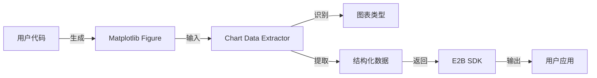
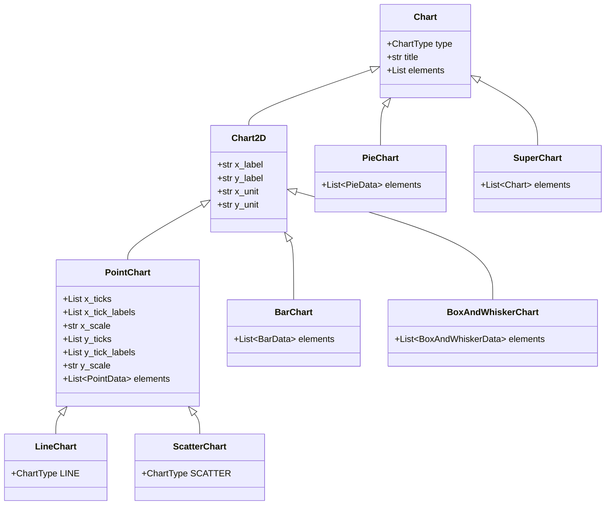
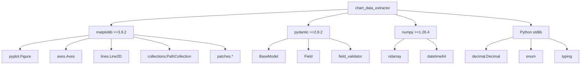
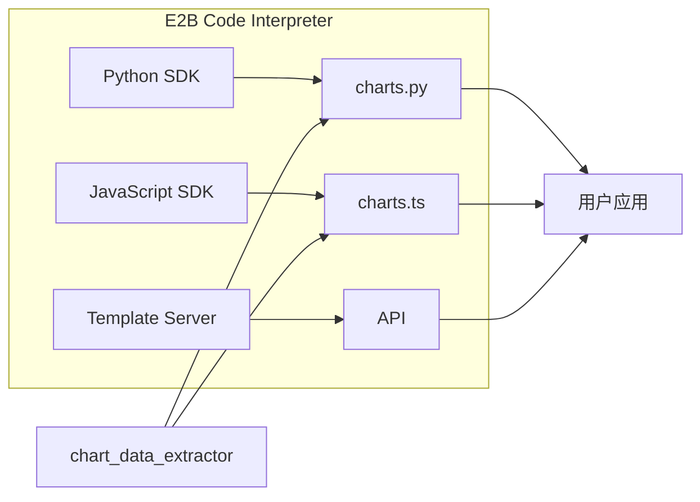
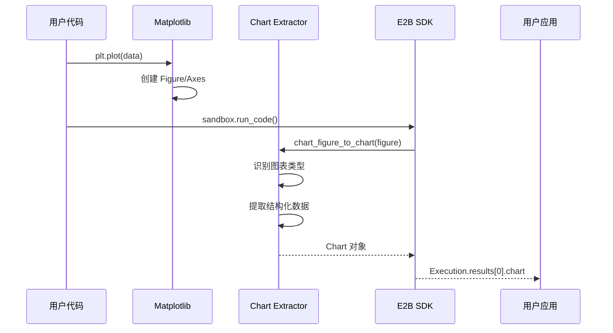

# Chart Data Extractor 深度解析

## 一、定位与使命 (Positioning & Mission)

### 1.1 模块定位

Chart Data Extractor 是 E2B Code Interpreter 生态系统中的核心数据提取引擎，专门负责从 Matplotlib 图形对象中智能识别、分类和提取结构化数据。



### 1.2 核心问题

- **图表类型自动识别**：从复杂的 Matplotlib Figure 对象中识别图表类型
- **数据结构化提取**：将图形艺术家对象转换为可序列化的结构化数据
- **多图表处理**：处理包含多个子图的复杂图表（SuperChart）
- **精度控制**：保持数据提取的精确性，避免浮点数误差

### 1.3 应用场景

1. **AI代码解释器**：为AI系统提供图表数据的语义理解
2. **数据可视化分析**：自动化提取图表中的原始数据用于进一步分析
3. **图表内容检索**：从生成的图表中恢复原始数据集
4. **多模态AI应用**：支持AI对图表内容进行文本化描述和分析

### 1.4 能力边界

**支持的图表类型：**
- Line Chart（线性图）
- Scatter Chart（散点图）
- Bar Chart（柱状图）
- Pie Chart（饼图）
- Box and Whisker Chart（箱线图）
- SuperChart（多子图组合）

**技术限制：**
- 依赖 Matplotlib 的内部对象结构
- 仅支持静态图表，不支持动态/交互式图表
- 对自定义艺术家对象的支持有限

## 二、设计思想与哲学基石 (Design Philosophy)

### 2.1 核心设计哲学

**"道法自然"的体现：**

```python
# 不强行改变 Matplotlib 的内部结构
# 而是通过观察和适配来提取信息
def _get_type_of_chart(ax: Axes) -> ChartType:
    # 顺应 Matplotlib 的对象模型
    objects = list(filter(lambda obj: not isinstance(obj, Text), ax._children))
    
    # 基于自然特征进行识别
    if all(isinstance(line, Line2D) for line in objects):
        return ChartType.LINE
```

### 2.2 设计原则

#### 1. 鲁棒性优先 (Robustness First)

```python
# 防御性编程，处理边界情况
def is_figure_blank(axes: List[Axes]) -> bool:
    for ax in axes:
        if ax.has_data():
            return False
    return True
```

#### 2. 类型安全 (Type Safety)

```python
# 使用 Pydantic 确保数据类型安全
class PointData(BaseModel):
    label: str
    points: List[Tuple[Union[str, float], Union[str, float]]]
    
    @field_validator("points", mode="before")
    @classmethod
    def transform_points(cls, value):
        # 智能类型转换
        return transform_to_typed_values(value)
```

#### 3. 可扩展性 (Extensibility)

```python
# 枚举驱动的图表类型系统，便于扩展
class ChartType(str, enum.Enum):
    LINE = "line"
    SCATTER = "scatter"
    # ... 其他类型
    UNKNOWN = "unknown"  # 优雅处理未知类型
```

## 三、核心数据结构定义 (Core Data Structures)

### 3.1 类型系统架构



### 3.2 数据结构详解

#### 基础图表类（Chart）

```python
class Chart(BaseModel):
    type: ChartType
    title: Optional[str] = None
    elements: List[Any] = Field(default_factory=list)
```

#### 点数据结构（PointData）

```python
class PointData(BaseModel):
    label: str
    points: List[Tuple[Union[str, float], Union[str, float]]]
    
    @field_validator("points", mode="before")
    @classmethod
    def transform_points(cls, value):
        """智能类型转换，处理日期时间等特殊类型"""
        points = []
        for x, y in value:
            # 处理各种数据类型
            x_val = transform_value(x)
            y_val = transform_value(y)
            points.append((x_val, y_val))
        return points
```

#### 柱状图数据（BarData）

```python
class BarData(BaseModel):
    label: str      # 柱状图标签
    group: str      # 分组标签
    value: float    # 数值
```

#### 饼图数据（PieData）

```python
class PieData(BaseModel):
    label: str
    angle: float    # 角度（度）
    radius: float   # 半径
```

#### 箱线图数据（BoxAndWhiskerData）

```python
class BoxAndWhiskerData(BaseModel):
    label: str
    min: float              # 最小值
    first_quartile: float   # 第一四分位
    median: float           # 中位数
    third_quartile: float   # 第三四分位
    max: float              # 最大值
    outliers: List[float]   # 异常值
```

## 四、核心接口与逻辑实现 (Core Interface & Logic)

### 4.1 主要接口设计

```python
# 主入口函数
def chart_figure_to_chart(figure: Figure) -> Optional[Chart]:
    """从 Figure 对象提取图表数据的主入口"""
    if len(figure.axes) == 0:
        return None
        
    if is_figure_blank(figure.axes):
        return None
        
    if len(figure.axes) == 1:
        # 单图表
        return get_chart_from_ax(figure.axes[0])
    else:
        # 多子图 - SuperChart
        return SuperChart(figure)

def chart_figure_to_dict(figure: Figure) -> dict:
    """转换为字典格式的便利接口"""
    chart = chart_figure_to_chart(figure)
    return chart.model_dump() if chart else {}
```

### 4.2 图表类型识别算法

```python
def _get_type_of_chart(ax: Axes) -> ChartType:
    """核心的图表类型识别算法"""
    
    # 1. 获取所有非文本艺术家对象
    objects = list(filter(lambda obj: not isinstance(obj, Text), ax._children))
    
    # 2. 线图识别：所有对象都是 Line2D
    if all(isinstance(line, Line2D) for line in objects):
        return ChartType.LINE
    
    # 3. 箱线图识别：PathPatch 和 Line2D 的组合
    if all(isinstance(box_or_path, (PathPatch, Line2D)) for box_or_path in objects):
        return ChartType.BOX_AND_WHISKER
    
    # 4. 过滤网格线
    filtered = [obj for obj in objects if not (isinstance(obj, Line2D) and is_grid_line(obj))]
    
    # 5. 散点图识别：所有对象都是 PathCollection
    if all(isinstance(path, PathCollection) for path in filtered):
        return ChartType.SCATTER
    
    # 6. 饼图识别：所有对象都是 Wedge
    if all(isinstance(artist, Wedge) for artist in filtered):
        return ChartType.PIE
    
    # 7. 柱状图识别：所有对象都是 Rectangle
    if all(isinstance(rect, Rectangle) for rect in filtered):
        return ChartType.BAR
    
    return ChartType.UNKNOWN
```

### 4.3 智能尺度检测

```python
@staticmethod
def _detect_scale(converter, scale: str, ticks: Sequence, labels: Sequence) -> str:
    """智能检测坐标轴尺度类型"""
    
    # 1. 日期时间检测
    if isinstance(converter, _SwitchableDateConverter):
        return "datetime"
    
    # 2. 非线性尺度直接返回
    if scale != "linear":
        return scale
    
    # 3. 分类尺度检测
    # 如果刻度是 0,1,2... 但标签不对应，则为分类尺度
    for i, (tick, label) in enumerate(zip(ticks, labels)):
        if isinstance(tick, (int, float)) and tick == i and str(i) != label:
            continue
        return "linear"
    
    return "categorical"
```

### 4.4 数据提取实现

#### 线图/散点图数据提取

```python
def _extract_info(self, ax: Axes) -> None:
    """提取线图或散点图数据"""
    super()._extract_info(ax)
    
    for line in ax.get_lines():
        if is_grid_line(line):  # 跳过网格线
            continue
            
        # 智能标签生成
        label = line.get_label()
        if label.startswith("_child"):
            number = int(label[6:])
            label = f"Line {number}"
        
        # 提取点数据
        points = [(x, y) for x, y in zip(line.get_xdata(), line.get_ydata())]
        self.elements.append(PointData(label=label, points=points))
```

#### 柱状图方向检测与数据提取

```python
def _extract_info(self, ax: Axes) -> None:
    """提取柱状图数据，智能处理横向/纵向"""
    super()._extract_info(ax)
    
    for container in ax.containers:
        heights = [rect.get_height() for rect in container]
        
        # 智能检测柱状图方向
        if all(height == heights[0] for height in heights):
            # 水平柱状图 - 需要交换坐标轴
            self._change_orientation()
            labels = [label.get_text() for label in ax.get_yticklabels()]
            values = [rect.get_width() for rect in container]
        else:
            # 垂直柱状图
            labels = [label.get_text() for label in ax.get_xticklabels()]
            values = heights
            
        # 提取数据
        group_label = container.get_label()
        for label, value in zip(labels, values):
            self.elements.append(BarData(
                label=label,
                group=group_label,
                value=value
            ))
```

#### 箱线图复杂数据提取

```python
def _extract_info(self, ax: Axes) -> None:
    """提取箱线图的统计数据"""
    super()._extract_info(ax)
    
    # 1. 提取所有箱体
    boxes = []
    for patch in ax.patches:
        if isinstance(patch, PathPatch):
            vertices = patch.get_path().vertices
            # 计算箱体边界
            box = self._get_box_bounds(vertices)
            boxes.append(box)
    
    # 2. 提取线段（中位线、须线）
    lines = defaultdict(list)
    for line in ax.lines:
        if is_grid_line(line):
            continue
        x_data, y_data = line.get_xdata(), line.get_ydata()
        # 根据位置关联到对应箱体
        self._associate_line_to_box(line, boxes, lines)
    
    # 3. 组装完整的箱线图数据
    for i, box in enumerate(boxes):
        self.elements.append(BoxAndWhiskerData(
            label=self._get_box_label(i),
            min=box['min'],
            first_quartile=box['q1'],
            median=lines[i]['median'],
            third_quartile=box['q3'],
            max=box['max'],
            outliers=self._extract_outliers(ax, box)
        ))
```

### 4.5 工具函数实现

#### 网格线识别

```python
def is_grid_line(line: Line2D) -> bool:
    """识别网格线的智能算法"""
    x_data, y_data = line.get_xdata(), line.get_ydata()
    
    # 检查是否为2点构成的线段
    if len(x_data) != 2 or len(y_data) != 2:
        return False
    
    # 检查是否为水平或垂直线
    return x_data[0] == x_data[1] or y_data[0] == y_data[1]
```

#### 动态精度控制

```python
def dynamic_round(number):
    """动态精度舍入算法
    
    基于数值量级动态调整精度，保持8位有效数字
    """
    # 转换为 Decimal 避免浮点误差
    decimal_number = Decimal(str(number))
    
    # 计算需要的小数位数
    # adjusted() 返回指数部分
    precision = max(1, 8 - decimal_number.adjusted())
    
    # 使用临时上下文进行精确计算
    with localcontext() as ctx:
        ctx.prec = precision
        return +decimal_number  # 一元加号触发舍入
```

## 五、依赖关系与交互 (Dependencies & Interactions)

### 5.1 依赖架构图



### 5.2 与 E2B 生态集成



### 5.3 数据流设计



## 六、核心算法深度解析

### 6.1 多层次图表识别策略

```python
def identify_chart_type(ax: Axes) -> ChartType:
    """多层次图表识别策略实现"""
    
    # 第一层：初步筛选
    artists = [obj for obj in ax._children if not isinstance(obj, Text)]
    
    # 第二层：类型聚类
    type_groups = defaultdict(list)
    for artist in artists:
        type_groups[type(artist)].append(artist)
    
    # 第三层：网格线过滤
    if Line2D in type_groups:
        type_groups[Line2D] = [
            line for line in type_groups[Line2D] 
            if not is_grid_line(line)
        ]
    
    # 第四层：形状特征匹配
    return match_chart_pattern(type_groups)
```

### 6.2 智能标签提取

```python
def extract_smart_labels(ax: Axes) -> Dict[str, List[str]]:
    """智能提取和标准化图表标签"""
    
    labels = {
        'title': ax.get_title(),
        'x_label': ax.get_xlabel(),
        'y_label': ax.get_ylabel(),
        'legend': [],
        'tick_labels': {
            'x': [label.get_text() for label in ax.get_xticklabels()],
            'y': [label.get_text() for label in ax.get_yticklabels()]
        }
    }
    
    # 提取图例标签
    legend = ax.get_legend()
    if legend:
        labels['legend'] = [t.get_text() for t in legend.get_texts()]
    
    # 智能单位提取
    labels['x_unit'] = extract_unit(labels['x_label'])
    labels['y_unit'] = extract_unit(labels['y_label'])
    
    return labels
```

### 6.3 复杂图表处理

```python
class SuperChart(Chart):
    """处理多子图的复合图表"""
    
    def __init__(self, figure: Figure):
        # 提取总标题
        suptitle = figure.get_suptitle()
        title = suptitle if suptitle else "SuperChart"
        
        super().__init__(
            type=ChartType.SUPERCHART,
            title=title,
            elements=[]
        )
        
        # 递归处理每个子图
        for i, ax in enumerate(figure.axes):
            chart = get_chart_from_ax(ax)
            if chart:
                # 为子图添加位置信息
                chart.subplot_position = i + 1
                self.elements.append(chart)
```

## 七、最佳实践与使用指南

### 7.1 基本使用

```python
import matplotlib.pyplot as plt
from e2b_charts import chart_figure_to_dict

# 创建图表
fig, ax = plt.subplots()
ax.plot([1, 2, 3], [4, 5, 6], label="Data Series")
ax.set_xlabel("X Axis")
ax.set_ylabel("Y Axis")
ax.set_title("Sample Chart")

# 提取数据
chart_data = chart_figure_to_dict(fig)
print(chart_data)
```

### 7.2 高级用法

```python
# 处理多子图
fig, axes = plt.subplots(2, 2, figsize=(10, 8))

# 不同类型的子图
axes[0, 0].plot([1, 2, 3], [4, 5, 6])
axes[0, 1].scatter([1, 2, 3], [4, 5, 6])
axes[1, 0].bar(['A', 'B', 'C'], [1, 2, 3])
axes[1, 1].pie([30, 40, 30], labels=['A', 'B', 'C'])

# 提取复合图表数据
from e2b_charts import chart_figure_to_chart
super_chart = chart_figure_to_chart(fig)

# 访问各个子图数据
for i, sub_chart in enumerate(super_chart.elements):
    print(f"子图 {i+1}: {sub_chart.type}")
    print(f"数据: {sub_chart.elements}")
```

### 7.3 自定义扩展

```python
# 扩展新的图表类型
class CustomChart(Chart):
    type = ChartType.CUSTOM
    
    def _extract_info(self, ax: Axes) -> None:
        """实现自定义数据提取逻辑"""
        super()._extract_info(ax)
        # 自定义提取逻辑
        pass

# 注册到识别系统
def register_custom_chart():
    # 在 get_chart_from_ax 中添加识别逻辑
    pass
```

## 八、性能优化与注意事项

### 8.1 性能优化策略

1. **惰性求值**：只在需要时进行复杂的数据转换
2. **内存效率**：使用生成器和列表推导减少内存占用
3. **算法优化**：O(n)复杂度的图表类型识别算法

### 8.2 注意事项

1. **Matplotlib 版本兼容性**：确保使用 3.9.2 或更高版本
2. **大数据集处理**：对于包含大量数据点的图表，考虑采样或分批处理
3. **自定义艺术家**：对于高度自定义的图表，可能需要扩展识别逻辑

### 8.3 错误处理

```python
try:
    chart = chart_figure_to_chart(fig)
except Exception as e:
    # 优雅降级
    print(f"图表提取失败: {e}")
    # 返回基础信息
    return {"type": "unknown", "error": str(e)}
```

## 九、总结

Chart Data Extractor 通过深度理解 Matplotlib 的内部架构，实现了高度智能化的图表数据提取系统。其创新的类型识别算法、灵活的数据模型设计和完善的工程实践，为 E2B Code Interpreter 生态系统提供了坚实的技术基础。

### 核心价值

1. **智能识别**：自动识别多种图表类型，无需人工干预
2. **完整提取**：保留图表的所有关键信息，包括标签、单位、样式等
3. **结构化输出**：提供标准化的数据结构，便于后续处理
4. **高度可靠**：完善的错误处理和边界情况覆盖

### 技术创新

1. **类型驱动设计**：基于对象类型特征的图表识别
2. **智能尺度检测**：自动识别线性、对数、时间、分类等尺度
3. **动态精度控制**：保持数值精度的同时优化存储
4. **递归处理架构**：优雅处理复杂的多子图场景

这个模块充分体现了"道法自然"的设计理念，通过深入理解和巧妙适配，实现了从视觉图表到结构化数据的完美转换。