# E2B 整体架构与运作流程解析

> 深入理解 E2B 的系统架构、SDK 差异和 Firecracker 集成原理

---

## 一、E2B 系统架构全景图

### 1.1 系统分层架构

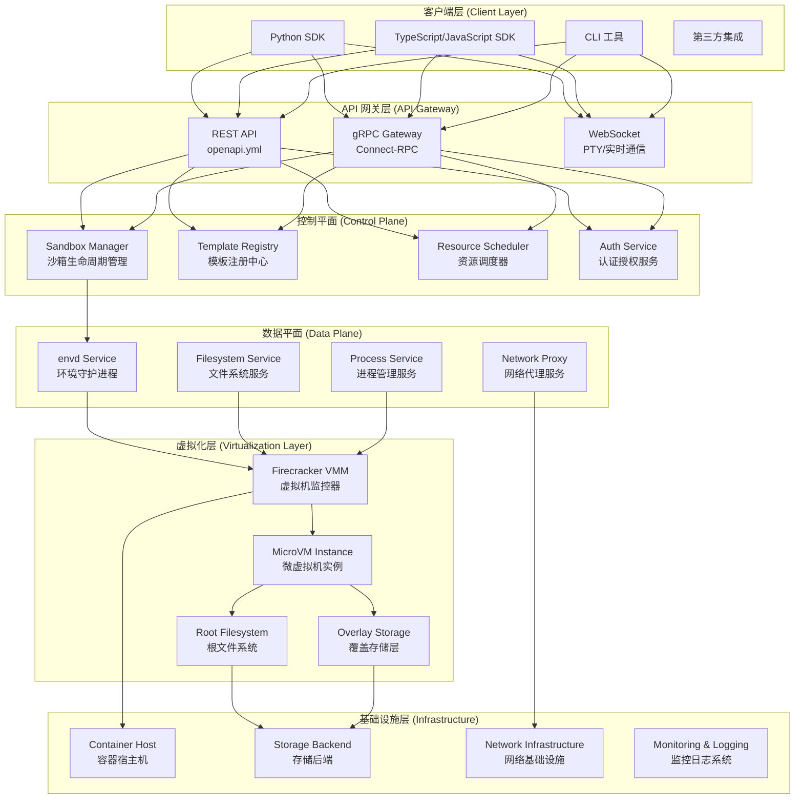

### 1.2 核心组件说明

| 组件 | 职责 | 技术栈 |
|------|------|---------|
| **Client SDKs** | 提供编程接口 | Python/TypeScript |
| **API Gateway** | 请求路由和协议转换 | HTTP/gRPC/WebSocket |
| **Control Plane** | 沙箱管理和调度 | Go/Kubernetes |
| **envd** | 沙箱内环境管理 | Go/gRPC |
| **Firecracker** | 微虚拟机管理 | Rust/KVM |
| **Storage** | 文件系统和镜像存储 | EBS/S3 |

---

## 二、E2B 完整运作流程

### 2.1 沙箱创建流程

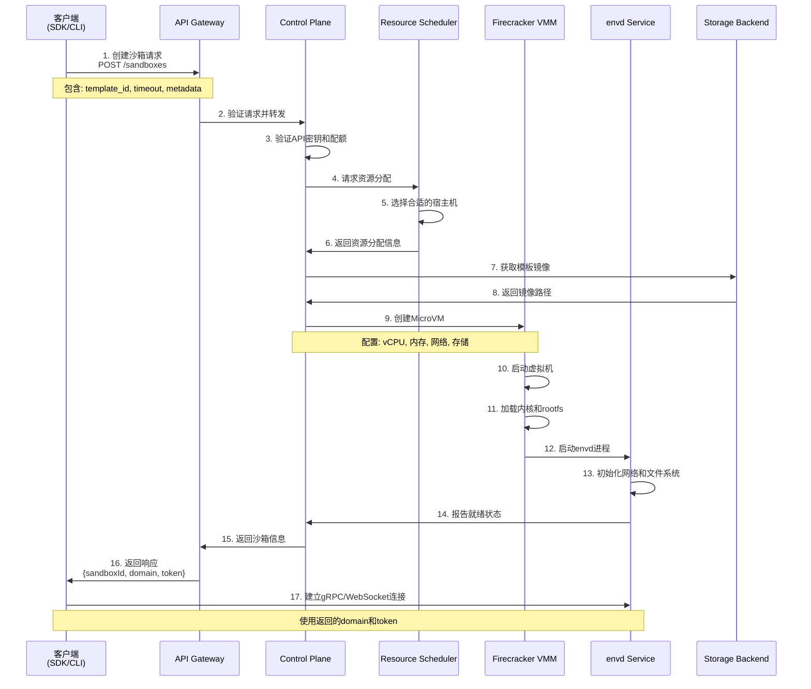

### 2.2 命令执行流程

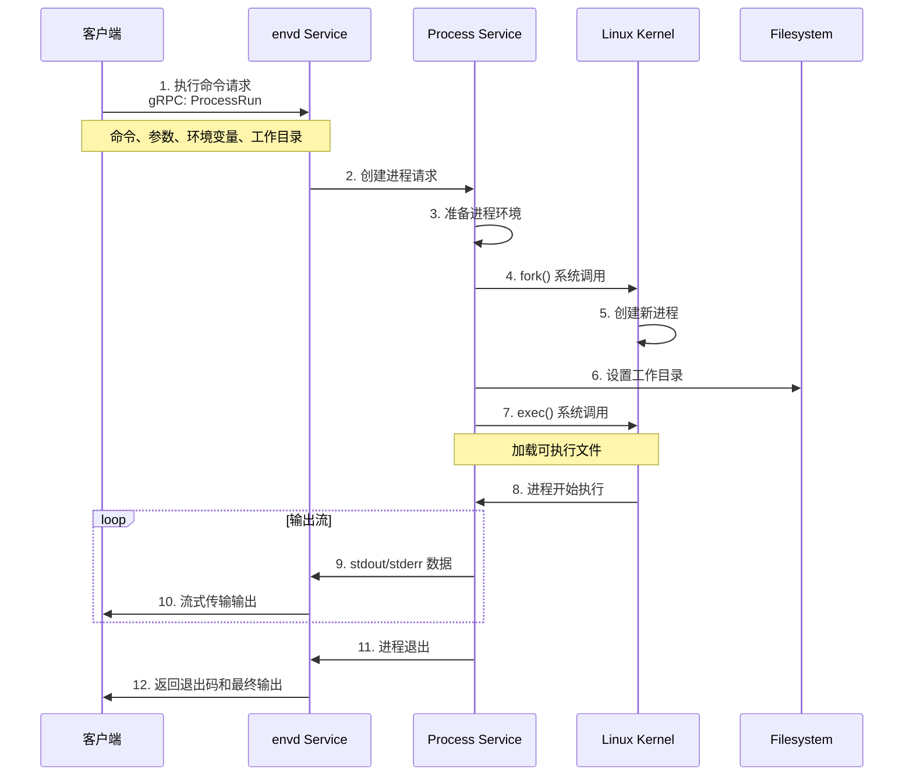

### 2.3 文件系统操作流程

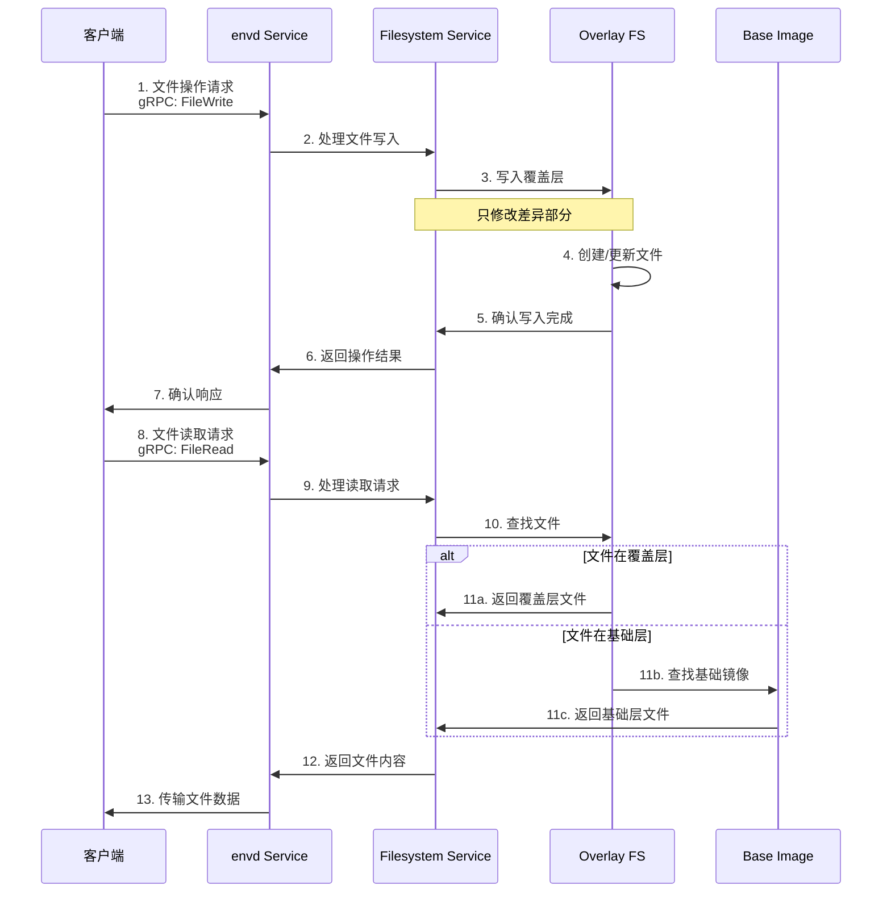

---

## 三、Python SDK vs TypeScript SDK 实现差异

### 3.1 架构设计对比

| 特性 | Python SDK | TypeScript SDK |
|------|------------|----------------|
| **异步支持** | 双模式：同步(Sandbox) + 异步(AsyncSandbox) | 原生 Promise/async-await |
| **类型系统** | 类型提示 (Type Hints) + dataclass | 强类型 TypeScript + 接口定义 |
| **网络库** | httpx (同步/异步) | 内置 fetch API |
| **gRPC 客户端** | 自动生成的 Python 存根 | Connect-RPC 客户端 |
| **错误处理** | 异常类继承体系 | Error 类 + 类型守卫 |
| **API 设计** | 方法重载 + 类方法变体 | 方法链 + 选项对象 |

### 3.2 代码实现对比

#### Python SDK - 同步模式
```python
from e2b import Sandbox

# 创建沙箱
sandbox = Sandbox(template="python3.11")

# 执行命令
result = sandbox.commands.run("python --version")
print(result.stdout)

# 文件操作
sandbox.files.write("/app/test.py", "print('Hello')")
content = sandbox.files.read("/app/test.py")

# 清理资源
sandbox.kill()
```

#### Python SDK - 异步模式
```python
import asyncio
from e2b import AsyncSandbox

async def main():
    # 创建沙箱（注意 create 方法）
    sandbox = await AsyncSandbox.create(template="python3.11")
    
    # 异步执行命令
    result = await sandbox.commands.run("python --version")
    print(result.stdout)
    
    # 异步文件操作
    await sandbox.files.write("/app/test.py", "print('Hello')")
    content = await sandbox.files.read("/app/test.py")
    
    # 清理资源
    await sandbox.kill()

asyncio.run(main())
```

#### TypeScript SDK
```typescript
import { Sandbox } from 'e2b'

// 创建沙箱（始终异步）
const sandbox = await Sandbox.create('nodejs18')

// 执行命令
const result = await sandbox.commands.run('node --version')
console.log(result.stdout)

// 文件操作
await sandbox.filesystem.write('/app/test.js', 'console.log("Hello")')
const content = await sandbox.filesystem.read('/app/test.js')

// 清理资源
await sandbox.kill()
```

### 3.3 内部实现差异

#### Python SDK 特点
```python
# 1. 工厂模式的异步初始化
class AsyncSandbox:
    def __init__(self, **opts):
        # 私有构造函数
        pass
    
    @classmethod
    async def create(cls, template: str):
        # 异步工厂方法
        response = await SandboxApi._create_sandbox(...)
        return cls(**response)

# 2. 属性访问器模式
@property
def files(self) -> Filesystem:
    return self._filesystem

# 3. 方法重载支持
@overload
def kill(self) -> bool: ...

@overload
@staticmethod
def kill(sandbox_id: str) -> bool: ...
```

#### TypeScript SDK 特点
```typescript
// 1. 直接异步构造
class Sandbox {
    static async create(template: string): Promise<Sandbox> {
        const response = await api.createSandbox(...)
        return new Sandbox(response)
    }
}

// 2. Getter 属性
get filesystem(): Filesystem {
    return this._filesystem
}

// 3. 方法链和Builder模式
sandbox
    .withTimeout(300)
    .withMetadata({ project: 'test' })
    .create()
```

---

## 四、Firecracker 集成原理

### 4.1 Firecracker 在 E2B 中的角色

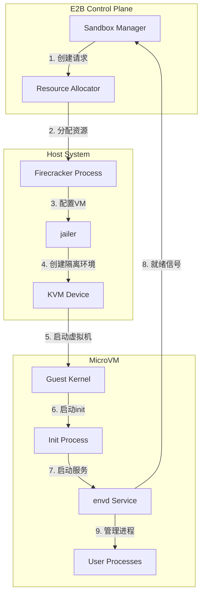

### 4.2 Firecracker 调用时机

#### 1. **沙箱创建时**
```go
// Control Plane 代码（推测）
func CreateSandbox(request CreateSandboxRequest) (*Sandbox, error) {
    // 1. 资源分配
    resources := allocateResources(request.Template)
    
    // 2. 准备 Firecracker 配置
    config := FirecrackerConfig{
        KernelPath: "/firecracker/vmlinux",
        RootfsPath: getTemplateRootfs(request.Template),
        VcpuCount:  resources.CPU,
        MemSizeMib: resources.Memory,
        NetworkInterfaces: []NetworkInterface{{
            HostDevName: generateTapName(),
            GuestMAC:    generateMAC(),
        }},
    }
    
    // 3. 启动 Firecracker 进程
    vm := StartFirecracker(config)
    
    // 4. 等待 VM 就绪
    waitForVMReady(vm)
    
    // 5. 配置网络
    setupNetworking(vm)
    
    return &Sandbox{
        ID:     generateSandboxID(),
        VM:     vm,
        Status: "running",
    }, nil
}
```

#### 2. **Firecracker 配置示例**
```json
{
  "boot-source": {
    "kernel_image_path": "/firecracker/vmlinux",
    "boot_args": "console=ttyS0 reboot=k panic=1 pci=off"
  },
  "drives": [{
    "drive_id": "rootfs",
    "path_on_host": "/images/ubuntu-22.04.ext4",
    "is_root_device": true,
    "is_read_only": false
  }],
  "machine-config": {
    "vcpu_count": 2,
    "mem_size_mib": 1024,
    "ht_enabled": false
  },
  "network-interfaces": [{
    "iface_id": "eth0",
    "guest_mac": "AA:FC:00:00:00:01",
    "host_dev_name": "tap0"
  }]
}
```

### 4.3 Firecracker 生命周期管理

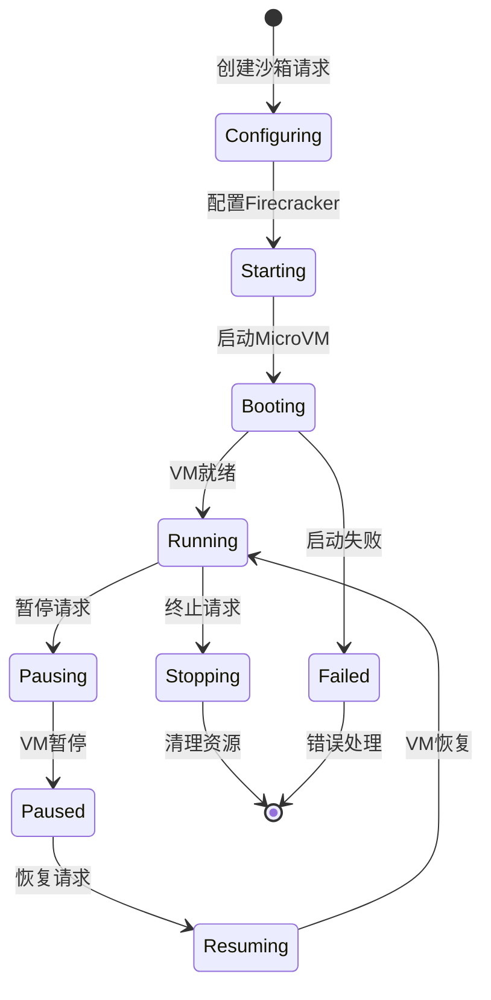

### 4.4 性能优化策略

#### 1. **快照和恢复**
```go
// 创建快照以加速启动
func CreateSnapshot(sandboxID string) error {
    vm := getVM(sandboxID)
    
    // 暂停 VM
    vm.Pause()
    
    // 创建内存和设备状态快照
    snapshot := vm.CreateSnapshot()
    
    // 保存快照
    saveSnapshot(sandboxID, snapshot)
    
    return nil
}

// 从快照恢复
func RestoreFromSnapshot(snapshotID string) (*Sandbox, error) {
    snapshot := loadSnapshot(snapshotID)
    
    // 恢复 VM 状态
    vm := RestoreVM(snapshot)
    
    // 恢复网络连接
    restoreNetworking(vm)
    
    return &Sandbox{VM: vm}, nil
}
```

#### 2. **预热池**
```go
// 维护预启动的 VM 池
type VMPool struct {
    vms map[string][]*FirecrackerVM
}

func (p *VMPool) Get(template string) *FirecrackerVM {
    if vms, exists := p.vms[template]; exists && len(vms) > 0 {
        // 从池中取出预热的 VM
        vm := vms[0]
        p.vms[template] = vms[1:]
        
        // 异步补充池
        go p.replenish(template)
        
        return vm
    }
    
    // 池中没有，创建新的
    return createNewVM(template)
}
```

---

## 五、数据流和通信协议

### 5.1 多层协议栈

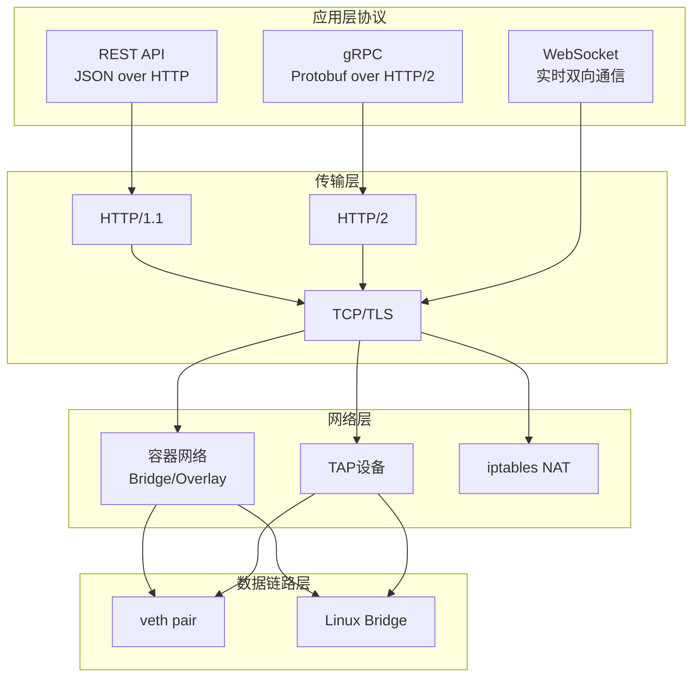

### 5.2 请求路由流程

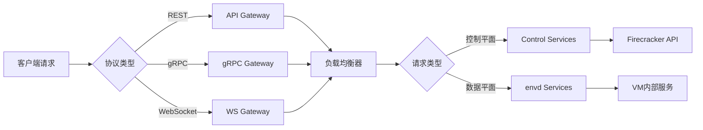

---

## 六、安全模型和隔离机制

### 6.1 多层安全架构

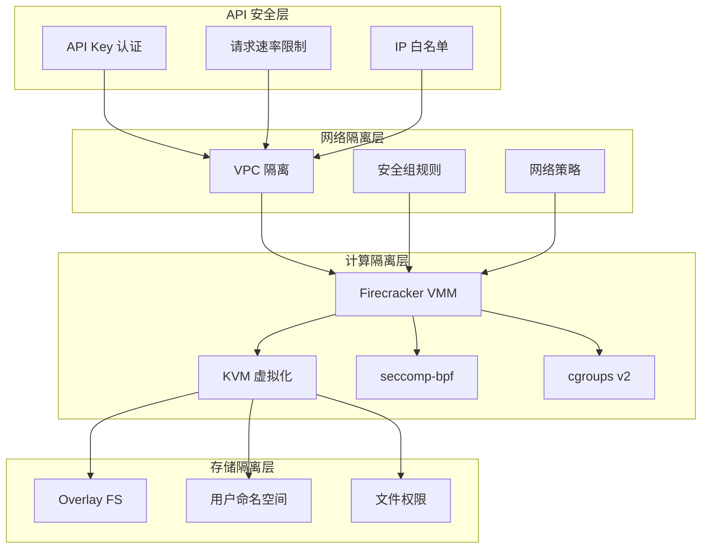

### 6.2 隔离级别对比

| 隔离层级 | 技术实现 | 安全程度 | 性能开销 |
|---------|----------|---------|----------|
| **硬件虚拟化** | KVM + Firecracker | ⭐⭐⭐⭐⭐ | 低 (< 5%) |
| **系统调用过滤** | seccomp-bpf | ⭐⭐⭐⭐ | 极低 |
| **资源限制** | cgroups v2 | ⭐⭐⭐ | 极低 |
| **网络隔离** | iptables + netns | ⭐⭐⭐⭐ | 低 |
| **文件系统隔离** | OverlayFS | ⭐⭐⭐ | 低 |

---

## 七、性能特征和优化

### 7.1 启动时间分析

```mermaid
gantt
    title 沙箱启动时间分解
    dateFormat X
    axisFormat %L
    
    section API层
    请求验证           :0, 10
    资源分配           :10, 20
    
    section Firecracker
    进程启动           :30, 50
    VM配置             :50, 30
    内核加载           :80, 120
    
    section 系统初始化
    Init进程           :200, 50
    网络配置           :250, 30
    envd启动           :280, 40
    
    section 就绪
    健康检查           :320, 20
    返回响应           :340, 10
```

### 7.2 资源使用特征

| 资源类型 | 基础开销 | 用户可用 | 说明 |
|---------|---------|---------|------|
| **内存** | ~50MB | 配置值-50MB | Firecracker + 内核开销 |
| **CPU** | ~5% | 95%+ | 虚拟化开销极低 |
| **存储** | ~200MB | 无限制 | 基础镜像 + OverlayFS |
| **网络** | ~1ms | - | 本地网络延迟 |

---

## 八、最佳实践和使用建议

### 8.1 选择合适的 SDK

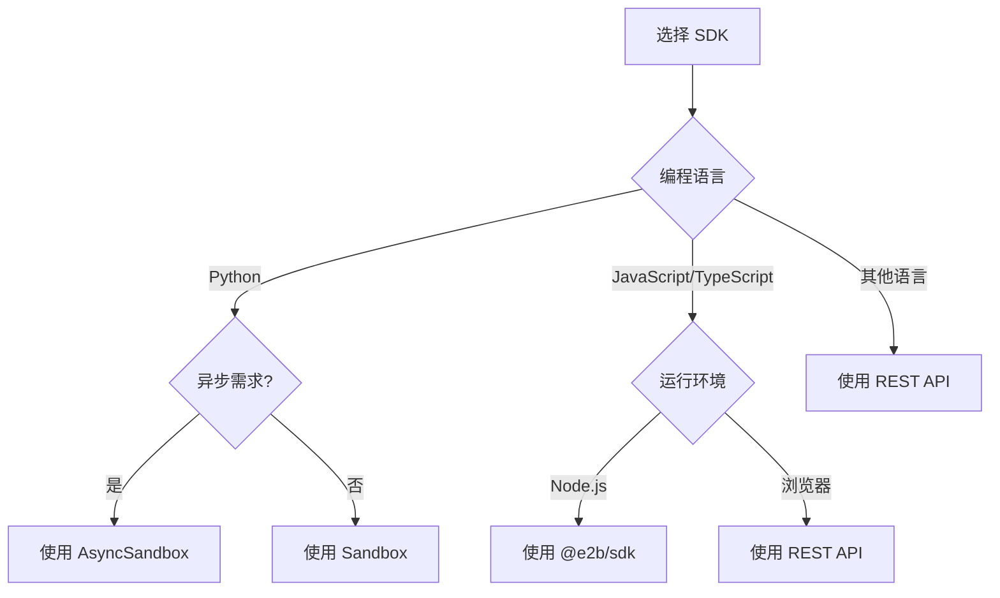

### 8.2 性能优化建议

1. **沙箱复用**
   ```python
   # 好的做法：复用沙箱
   sandbox = Sandbox()
   for task in tasks:
       result = sandbox.commands.run(task)
       process_result(result)
   sandbox.kill()
   
   # 避免：每次创建新沙箱
   for task in tasks:
       sandbox = Sandbox()  # 性能开销大
       result = sandbox.commands.run(task)
       sandbox.kill()
   ```

2. **批量操作**
   ```typescript
   // 好的做法：批量写入
   const files = [
       { path: '/app/file1.txt', content: 'content1' },
       { path: '/app/file2.txt', content: 'content2' },
   ]
   await sandbox.filesystem.writeMultiple(files)
   
   // 避免：逐个写入
   for (const file of files) {
       await sandbox.filesystem.write(file.path, file.content)
   }
   ```

3. **合理的超时设置**
   ```python
   # 根据任务类型设置超时
   sandbox = Sandbox(
       timeout=300  # 5分钟，适合短任务
   )
   
   # 长时间任务
   ml_sandbox = Sandbox(
       timeout=3600 * 4  # 4小时，适合训练任务
   )
   ```

### 8.3 错误处理模式

```python
# Python SDK
from e2b import SandboxException, TimeoutException

try:
    sandbox = Sandbox()
    result = sandbox.commands.run("long_running_task")
except TimeoutException:
    print("任务超时，考虑增加超时时间")
except SandboxException as e:
    print(f"沙箱错误: {e}")
finally:
    if 'sandbox' in locals():
        sandbox.kill()
```

```typescript
// TypeScript SDK
try {
    const sandbox = await Sandbox.create()
    const result = await sandbox.commands.run("long_running_task")
} catch (error) {
    if (error.code === 'TIMEOUT') {
        console.log("任务超时，考虑增加超时时间")
    } else {
        console.error("沙箱错误:", error)
    }
} finally {
    await sandbox?.kill()
}
```

---

## 九、总结

E2B 通过精心设计的多层架构，将 Firecracker 微虚拟机技术与现代云原生技术栈完美结合，提供了安全、高效、易用的代码执行环境。理解其运作流程的关键点：

1. **Firecracker 作为核心隔离层**：在沙箱创建时被调用，提供硬件级别的安全隔离
2. **envd 作为沙箱内协调者**：管理所有沙箱内的操作请求
3. **SDK 的设计哲学差异**：Python 提供同步/异步双模式，TypeScript 专注于异步
4. **多协议支持**：REST/gRPC/WebSocket 满足不同场景需求
5. **性能优化**：通过快照、预热池等技术实现亚秒级启动

这种架构设计使得 E2B 能够在保证安全性的同时，提供接近原生的性能表现，成为 AI 应用和代码执行场景的理想选择。