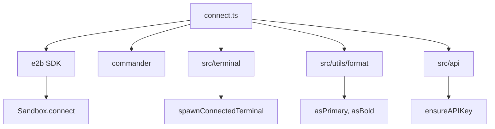
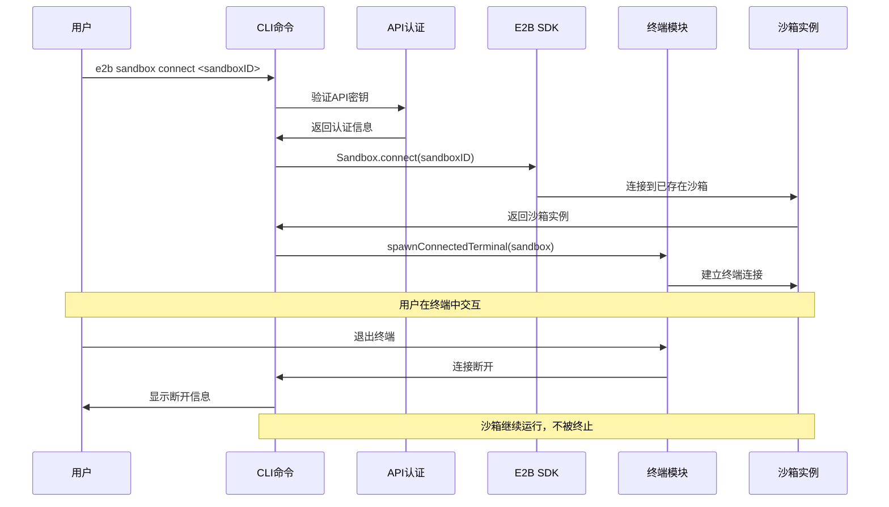
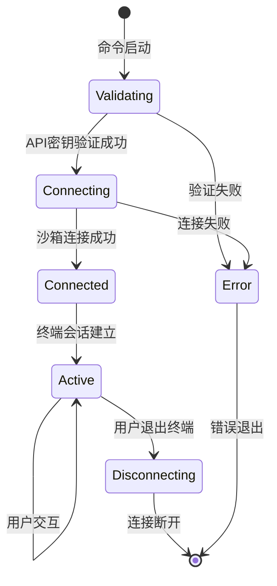
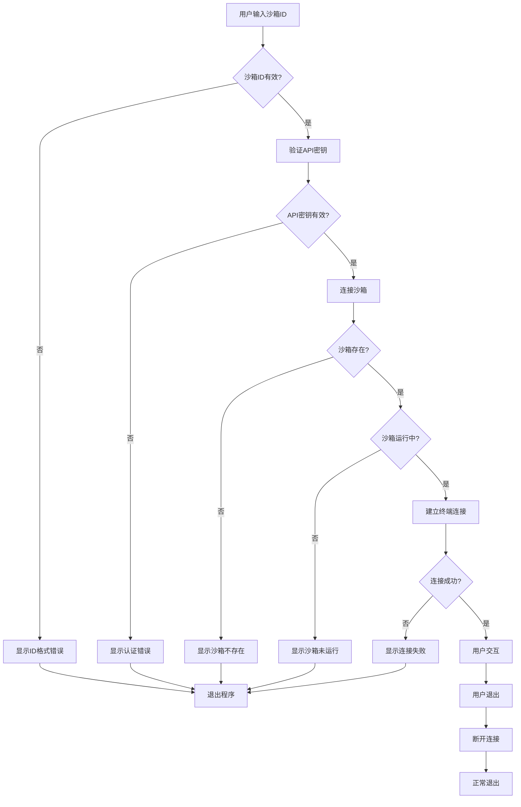
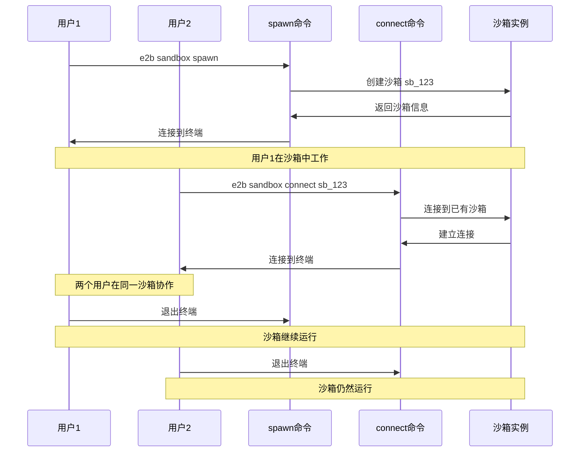

# cli/sandbox/connect.ts - E2B CLI 沙箱连接命令

> 基于五步显化法的 TypeScript 代码深度解析

---

## 一、定位与使命 (Positioning & Mission)

### 1.1 模块定位

**cli/sandbox/connect.ts 是 E2B CLI 工具的沙箱连接命令实现，为开发者提供快速连接到已存在沙箱的能力，支持多用户协作和会话恢复，实现轻量级的沙箱接入体验。**

### 1.2 核心问题

此文件旨在解决以下关键问题：

1. **快速沙箱重连**
   - 通过沙箱ID直接连接已运行的沙箱
   - 无需重新创建，节省时间和资源
   - 支持会话恢复和状态保持

2. **多用户协作支持**
   - 允许多个开发者连接同一沙箱
   - 实现共享开发环境和实时协作
   - 避免沙箱意外终止影响其他用户

3. **轻量级连接管理**
   - 仅建立终端连接，不管理沙箱生命周期
   - 断开连接时不终止沙箱实例
   - 专注于连接体验的简洁性

### 1.3 应用场景

#### 场景一：恢复中断的开发会话
```bash
# 之前的沙箱由于网络中断断开连接
# 沙箱ID: sb_1234567890abcdef

# 快速重新连接
e2b sandbox connect sb_1234567890abcdef

# 或使用别名
e2b cn sb_1234567890abcdef

# 连接后继续之前的工作
# - 所有文件和状态都还在
# - 后台进程继续运行
# - 环境变量保持不变
```

#### 场景二：团队协作开发
```bash
# 团队成员A创建共享沙箱
e2b sandbox spawn shared-project
# 输出: Terminal connecting to sandbox sb_shared123abc

# 团队成员B加入协作
e2b sandbox connect sb_shared123abc
# 现在两人可以在同一环境中协作

# 团队成员C也可以加入
e2b sandbox connect sb_shared123abc
# 支持多人同时连接

# 所有成员看到相同的：
# - 文件系统状态
# - 运行中的进程
# - 环境配置
```

#### 场景三：调试和故障排查
```bash
# 生产环境出现问题，需要调试
# 获取问题沙箱的ID: sb_prod_debug_001

# 连接到问题环境
e2b sandbox connect sb_prod_debug_001

# 在沙箱中进行调试
tail -f /var/log/application.log
ps aux | grep problematic_process
strace -p 1234

# 调试完成后断开连接
# 沙箱继续运行，其他人可以继续调试
```

#### 场景四：长期运行任务监控
```bash
# 启动长期运行的训练任务
e2b sandbox spawn ml-training
# 在沙箱中启动: python train_model.py --epochs 1000

# 任务运行中，可以断开连接
# 稍后重新连接查看进度
e2b sandbox connect sb_ml_training_456

# 检查训练进度
tail -f training.log
nvidia-smi  # 查看GPU使用情况
tensorboard --logdir ./logs --port 6006

# 训练完成后收集结果
```

#### 场景五：教学和演示场景
```bash
# 讲师准备demo环境
e2b sandbox spawn demo-environment
# 沙箱ID: sb_demo_classroom_789

# 学生连接到演示环境
e2b sandbox connect sb_demo_classroom_789

# 所有学生看到讲师的操作
# 讲师可以实时演示代码执行
# 学生可以跟随练习

# 演示结束后学生断开连接
# 环境保持运行，供稍后复习
```

#### 场景六：CI/CD 流水线调试
```bash
# CI流水线中的某个步骤失败
# 流水线保留了调试沙箱: sb_ci_debug_build123

# 开发者连接到CI环境进行调试
e2b sandbox connect sb_ci_debug_build123

# 重现CI环境中的问题
cd /workspace
ls -la
cat build.log
make debug

# 找到问题根因后修复代码
# 无需终止沙箱，方便后续验证
```

### 1.4 能力边界

**此模块做什么：**
- 连接到已存在的沙箱实例
- 建立交互式终端会话
- 提供连接状态反馈
- 支持优雅的连接断开

**此模块不做什么：**
- 不创建新的沙箱实例
- 不管理沙箱的生命周期
- 不修改沙箱配置或状态
- 不提供沙箱资源监控

---

## 二、设计思想与哲学基石 (Design Philosophy & Foundational Principles)

### 2.1 单一职责原则

```typescript
export const connectCommand = new commander.Command('connect')
  .description('connect terminal to already running sandbox')
  .argument('<sandboxID>', 'connect to sandbox with <sandboxID>')
```

专注于连接功能，不承担创建或管理职责。

### 2.2 最小化接口设计

```typescript
.action(async (sandboxID: string) => {
  // 仅需要沙箱ID参数
  // 无需复杂的配置选项
  await connectToSandbox({ apiKey, sandboxID })
})
```

接口简洁，参数最少，易于使用。

### 2.3 非侵入式连接

```typescript
// 连接时不修改沙箱状态
const sandbox = await e2b.Sandbox.connect(sandboxID, { apiKey })

// 断开时不终止沙箱
// We don't want to call sandbox.close because that would 
// disconnect other users from the edit session.
process.exit(0)
```

连接和断开都不影响沙箱本身的状态。

### 2.4 用户友好的反馈

```typescript
console.log(`Terminal connecting to sandbox ${asPrimary(`${sandbox.sandboxId}`)}`)
await spawnConnectedTerminal(sandbox)
console.log(`Closing terminal connection to sandbox ${asPrimary(sandbox.sandboxId)}`)
```

清晰的连接状态提示。

---

## 三、核心数据结构定义 (Core Data Structure Definitions)

### 3.1 连接配置结构

```typescript
interface SandboxConnectionConfig {
  apiKey: string        // API认证密钥
  sandboxID: string     // 目标沙箱ID
}
```

### 3.2 连接状态枚举

```typescript
enum ConnectionState {
  DISCONNECTED = 'disconnected',   // 未连接
  CONNECTING = 'connecting',       // 连接中
  CONNECTED = 'connected',         // 已连接
  DISCONNECTING = 'disconnecting', // 断开中
  ERROR = 'error'                  // 连接错误
}
```

### 3.3 连接会话信息

```typescript
interface ConnectionSession {
  sandboxId: string              // 沙箱标识
  connectedAt: Date             // 连接时间
  terminal?: any                // 终端实例
  state: ConnectionState        // 连接状态
  userId?: string               // 用户标识
}
```

### 3.4 错误处理类型

```typescript
interface ConnectionError extends Error {
  code: 'INVALID_SANDBOX_ID' | 'SANDBOX_NOT_FOUND' | 'CONNECTION_FAILED' | 'AUTH_ERROR'
  sandboxId: string
  details?: any
}
```

### 3.5 沙箱连接信息（扩展）

```typescript
interface SandboxConnectionInfo {
  sandboxId: string              // 沙箱ID
  isRunning: boolean            // 运行状态
  connectedUsers: number        // 连接用户数
  lastActivity: Date            // 最后活动时间
  templateId?: string           // 模板ID
  region?: string               // 部署区域
}
```

---

## 四、核心接口与逻辑实现 (Core Interface & Logic)

### 4.1 主命令处理逻辑

```typescript
.action(async (sandboxID: string) => {
  try {
    // 1. 确保API密钥可用
    const apiKey = ensureAPIKey()
    
    // 2. 验证沙箱ID参数
    if (!sandboxID) {
      console.error('You need to specify sandbox ID')
      process.exit(1)
    }
    
    // 3. 建立连接
    await connectToSandbox({ apiKey, sandboxID })
    
    // 4. 显式退出，避免进程悬挂
    // 不调用sandbox.close以免影响其他用户
    process.exit(0)
  } catch (err: any) {
    console.error(err)
    process.exit(1)
  }
})
```

### 4.2 沙箱连接核心实现

```typescript
async function connectToSandbox({
  apiKey,
  sandboxID,
}: SandboxConnectionConfig) {
  // 1. 连接到已存在的沙箱
  const sandbox = await e2b.Sandbox.connect(sandboxID, { apiKey })
  
  // 2. 显示连接开始信息
  console.log(
    `Terminal connecting to sandbox ${asPrimary(`${sandbox.sandboxId}`)}`
  )
  
  // 3. 启动终端连接
  await spawnConnectedTerminal(sandbox)
  
  // 4. 显示连接结束信息
  console.log(
    `Closing terminal connection to sandbox ${asPrimary(sandbox.sandboxId)}`
  )
}
```

### 4.3 健壮的连接实现（扩展）

```typescript
async function robustConnectToSandbox(config: SandboxConnectionConfig): Promise<void> {
  let connectionSession: ConnectionSession | undefined
  
  try {
    // 创建连接会话
    connectionSession = {
      sandboxId: config.sandboxID,
      connectedAt: new Date(),
      state: ConnectionState.CONNECTING
    }
    
    // 验证沙箱可用性
    await validateSandboxAvailability(config.sandboxID, config.apiKey)
    
    // 建立连接
    const sandbox = await e2b.Sandbox.connect(config.sandboxID, { 
      apiKey: config.apiKey 
    })
    
    connectionSession.state = ConnectionState.CONNECTED
    
    console.log(
      `Terminal connecting to sandbox ${asPrimary(sandbox.sandboxId)}`
    )
    
    // 启动终端会话
    await spawnConnectedTerminal(sandbox)
    
  } catch (error) {
    if (connectionSession) {
      connectionSession.state = ConnectionState.ERROR
    }
    
    // 处理具体错误类型
    if (error instanceof Error) {
      handleConnectionError(error, config.sandboxID)
    }
    
    throw error
  } finally {
    if (connectionSession) {
      connectionSession.state = ConnectionState.DISCONNECTED
      console.log(
        `Closing terminal connection to sandbox ${asPrimary(config.sandboxID)}`
      )
    }
  }
}
```

### 4.4 沙箱可用性验证

```typescript
async function validateSandboxAvailability(
  sandboxID: string, 
  apiKey: string
): Promise<SandboxConnectionInfo> {
  try {
    // 获取沙箱信息
    const sandboxInfo = await e2b.Sandbox.list({ apiKey })
    const targetSandbox = sandboxInfo.find(sb => sb.sandboxId === sandboxID)
    
    if (!targetSandbox) {
      throw new ConnectionError(
        `Sandbox ${sandboxID} not found`,
        'SANDBOX_NOT_FOUND',
        sandboxID
      )
    }
    
    if (!targetSandbox.isRunning) {
      throw new ConnectionError(
        `Sandbox ${sandboxID} is not running`,
        'SANDBOX_NOT_RUNNING', 
        sandboxID
      )
    }
    
    return {
      sandboxId: targetSandbox.sandboxId,
      isRunning: targetSandbox.isRunning,
      connectedUsers: targetSandbox.connectedUsers || 0,
      lastActivity: new Date(targetSandbox.lastActivity || Date.now()),
      templateId: targetSandbox.templateId,
      region: targetSandbox.region
    }
    
  } catch (error) {
    if (error instanceof ConnectionError) {
      throw error
    }
    
    throw new ConnectionError(
      `Failed to validate sandbox ${sandboxID}: ${error.message}`,
      'CONNECTION_FAILED',
      sandboxID,
      error
    )
  }
}
```

### 4.5 错误处理和用户反馈

```typescript
function handleConnectionError(error: Error, sandboxID: string): void {
  if (error.message.includes('not found')) {
    console.error(`❌ Sandbox ${asPrimary(sandboxID)} not found`)
    console.error('   Please check the sandbox ID and ensure it exists')
    return
  }
  
  if (error.message.includes('not running')) {
    console.error(`❌ Sandbox ${asPrimary(sandboxID)} is not running`) 
    console.error('   You can start it with: e2b sandbox spawn')
    return
  }
  
  if (error.message.includes('unauthorized')) {
    console.error('❌ Authentication failed')
    console.error('   Please check your API key: export E2B_API_KEY=your_key')
    return
  }
  
  if (error.message.includes('network') || error.message.includes('timeout')) {
    console.error('❌ Network connection failed')
    console.error('   Please check your internet connection and try again')
    return
  }
  
  // 通用错误处理
  console.error(`❌ Failed to connect to sandbox ${asPrimary(sandboxID)}`)
  console.error(`   Error: ${error.message}`)
  
  if (process.env.DEBUG) {
    console.error('   Full error details:', error)
  }
}

class ConnectionError extends Error {
  constructor(
    message: string,
    public code: string,
    public sandboxId: string,
    public details?: any
  ) {
    super(message)
    this.name = 'ConnectionError'
  }
}
```

### 4.6 连接状态监控（扩展）

```typescript
class ConnectionMonitor {
  private session: ConnectionSession
  private heartbeatInterval?: NodeJS.Timeout
  private readonly heartbeatFrequency = 30_000 // 30秒
  
  constructor(session: ConnectionSession) {
    this.session = session
  }
  
  startMonitoring(): void {
    this.heartbeatInterval = setInterval(async () => {
      try {
        await this.checkConnection()
      } catch (error) {
        console.warn('Connection heartbeat failed:', error.message)
        this.handleConnectionLoss()
      }
    }, this.heartbeatFrequency)
  }
  
  stopMonitoring(): void {
    if (this.heartbeatInterval) {
      clearInterval(this.heartbeatInterval)
      this.heartbeatInterval = undefined
    }
  }
  
  private async checkConnection(): Promise<void> {
    // 实现连接健康检查
    // 例如发送ping命令或检查沙箱状态
    const response = await fetch(`/api/sandbox/${this.session.sandboxId}/health`)
    
    if (!response.ok) {
      throw new Error(`Health check failed: ${response.status}`)
    }
  }
  
  private handleConnectionLoss(): void {
    this.session.state = ConnectionState.ERROR
    console.error('❌ Connection to sandbox lost')
    console.error('   Attempting to reconnect...')
    
    // 可以实现自动重连逻辑
    this.attemptReconnect()
  }
  
  private async attemptReconnect(): Promise<void> {
    // 实现重连逻辑
    try {
      this.session.state = ConnectionState.CONNECTING
      // 重新建立连接...
      this.session.state = ConnectionState.CONNECTED
      console.log('✅ Reconnected to sandbox')
    } catch (error) {
      console.error('❌ Reconnection failed:', error.message)
      this.session.state = ConnectionState.ERROR
    }
  }
}
```

### 4.7 多用户连接管理（扩展）

```typescript
interface MultiUserSession {
  sandboxId: string
  users: Array<{
    userId: string
    connectedAt: Date
    terminal?: any
  }>
  sharedState: {
    currentDirectory: string
    environmentVariables: Record<string, string>
    runningProcesses: number[]
  }
}

class MultiUserConnectionManager {
  private sessions = new Map<string, MultiUserSession>()
  
  async joinSession(sandboxId: string, userId: string): Promise<void> {
    let session = this.sessions.get(sandboxId)
    
    if (!session) {
      // 创建新的多用户会话
      session = {
        sandboxId,
        users: [],
        sharedState: {
          currentDirectory: '/',
          environmentVariables: {},
          runningProcesses: []
        }
      }
      this.sessions.set(sandboxId, session)
    }
    
    // 添加用户到会话
    session.users.push({
      userId,
      connectedAt: new Date()
    })
    
    console.log(
      `👥 User ${userId} joined sandbox ${sandboxId} ` +
      `(${session.users.length} users connected)`
    )
  }
  
  async leaveSession(sandboxId: string, userId: string): Promise<void> {
    const session = this.sessions.get(sandboxId)
    if (!session) return
    
    // 移除用户
    session.users = session.users.filter(user => user.userId !== userId)
    
    console.log(
      `👋 User ${userId} left sandbox ${sandboxId} ` +
      `(${session.users.length} users remaining)`
    )
    
    // 如果没有用户了，清理会话
    if (session.users.length === 0) {
      this.sessions.delete(sandboxId)
    }
  }
  
  getSessionInfo(sandboxId: string): MultiUserSession | undefined {
    return this.sessions.get(sandboxId)
  }
}
```

---

## 五、依赖关系与交互 (Dependencies & Interactions)

### 5.1 模块依赖图



### 5.2 连接执行流程



### 5.3 连接状态转换



### 5.4 与其他CLI命令的对比

| 特性对比 | spawn | connect | list | kill |
|---------|-------|---------|------|------|
| **沙箱创建** | ✓ 创建新沙箱 | ✗ 连接已有沙箱 | ✗ | ✗ |
| **生命周期管理** | ✓ 完整管理 | ✗ 仅连接 | ✗ | ✓ 仅终止 |
| **终端连接** | ✓ 自动连接 | ✓ 连接已有 | ✗ | ✗ |
| **配置文件** | ✓ 支持 | ✗ 不需要 | ✗ | ✗ |
| **多用户支持** | ✗ 单用户 | ✓ 多用户 | ✓ 查看信息 | ⚠️ 影响所有用户 |
| **资源清理** | ✓ 终止沙箱 | ✗ 保持运行 | ✗ | ✓ 终止沙箱 |

### 5.5 错误处理流程



### 5.6 与spawn命令的协作关系



### 5.7 安全性和权限控制

```typescript
interface ConnectionSecurity {
  // API密钥验证
  validateAPIKey(apiKey: string): Promise<boolean>
  
  // 沙箱访问权限检查
  checkSandboxAccess(sandboxId: string, userId: string): Promise<boolean>
  
  // 连接限制
  checkConnectionLimit(sandboxId: string): Promise<boolean>
  
  // 审计日志
  logConnectionAttempt(sandboxId: string, userId: string, success: boolean): void
}

class SecurityManager implements ConnectionSecurity {
  async validateAPIKey(apiKey: string): Promise<boolean> {
    // 验证API密钥有效性
    try {
      const response = await fetch('/api/auth/validate', {
        headers: { 'Authorization': `Bearer ${apiKey}` }
      })
      return response.ok
    } catch {
      return false
    }
  }
  
  async checkSandboxAccess(sandboxId: string, userId: string): Promise<boolean> {
    // 检查用户是否有权限访问指定沙箱
    // 实现基于用户、团队或项目的权限控制
    return true // 简化实现
  }
  
  async checkConnectionLimit(sandboxId: string): Promise<boolean> {
    // 检查沙箱的并发连接限制
    const connectionCount = await this.getCurrentConnectionCount(sandboxId)
    const maxConnections = await this.getMaxConnectionLimit(sandboxId)
    return connectionCount < maxConnections
  }
  
  logConnectionAttempt(sandboxId: string, userId: string, success: boolean): void {
    const logEntry = {
      timestamp: new Date(),
      sandboxId,
      userId,
      action: 'connect',
      success,
      ip: process.env.CLIENT_IP
    }
    
    // 记录到审计日志
    console.log('Connection attempt:', JSON.stringify(logEntry))
  }
  
  private async getCurrentConnectionCount(sandboxId: string): Promise<number> {
    // 实现获取当前连接数的逻辑
    return 0
  }
  
  private async getMaxConnectionLimit(sandboxId: string): Promise<number> {
    // 实现获取最大连接数限制的逻辑
    return 10
  }
}
```

### 5.8 性能优化和缓存

```typescript
class ConnectionOptimizer {
  private connectionCache = new Map<string, {
    sandbox: e2b.Sandbox
    lastUsed: Date
    connectionCount: number
  }>()
  
  async getOptimizedConnection(sandboxId: string, apiKey: string): Promise<e2b.Sandbox> {
    const cached = this.connectionCache.get(sandboxId)
    
    if (cached && this.isCacheValid(cached)) {
      // 使用缓存的连接
      cached.lastUsed = new Date()
      cached.connectionCount++
      return cached.sandbox
    }
    
    // 创建新连接
    const sandbox = await e2b.Sandbox.connect(sandboxId, { apiKey })
    
    // 缓存连接信息
    this.connectionCache.set(sandboxId, {
      sandbox,
      lastUsed: new Date(),
      connectionCount: 1
    })
    
    return sandbox
  }
  
  private isCacheValid(cached: any): boolean {
    const maxAge = 5 * 60 * 1000 // 5分钟
    const age = Date.now() - cached.lastUsed.getTime()
    return age < maxAge
  }
  
  cleanupCache(): void {
    const now = Date.now()
    const maxAge = 10 * 60 * 1000 // 10分钟
    
    for (const [sandboxId, cached] of this.connectionCache.entries()) {
      const age = now - cached.lastUsed.getTime()
      if (age > maxAge) {
        this.connectionCache.delete(sandboxId)
      }
    }
  }
}
```

---

## 总结

cli/sandbox/connect.ts 作为 E2B CLI 工具的沙箱连接命令，通过简洁的接口设计和非侵入式的连接机制，为开发者提供了快速、安全、多用户友好的沙箱接入体验。它不仅支持会话恢复和协作开发，还通过健壮的错误处理和状态管理，确保了连接的稳定性和可靠性，是 E2B 协作开发和调试工作流中的重要工具。