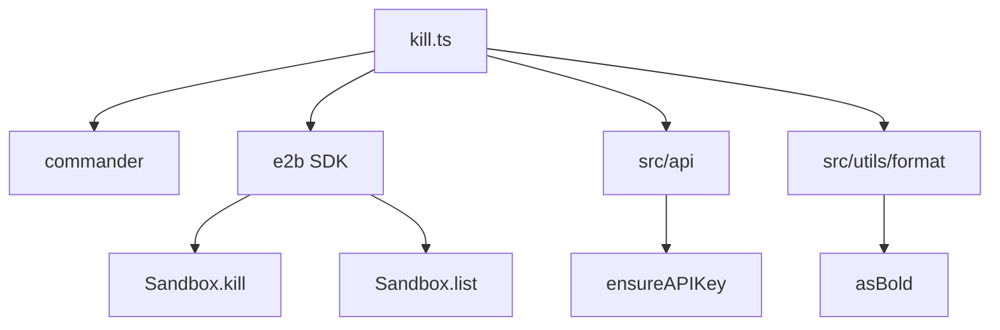
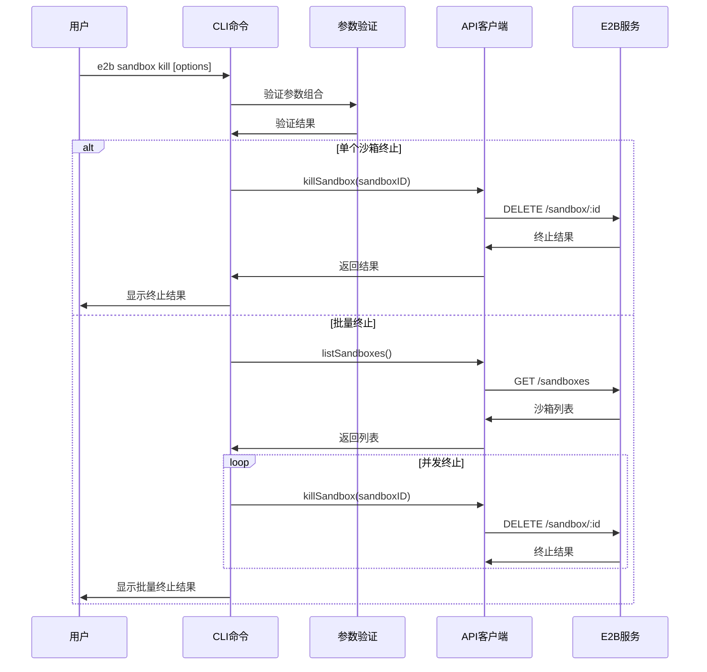
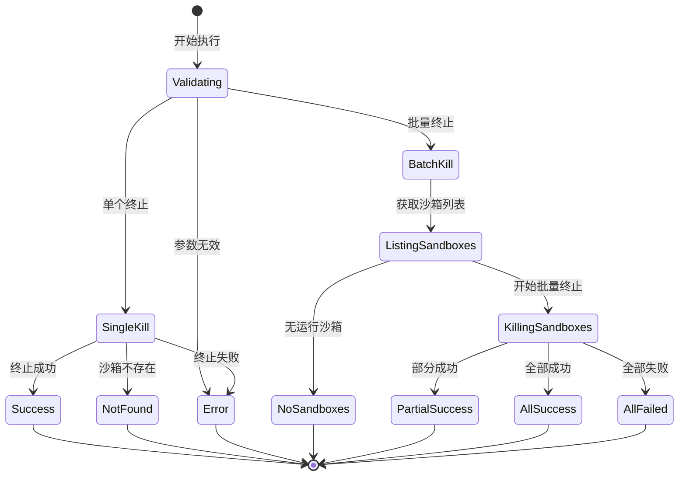
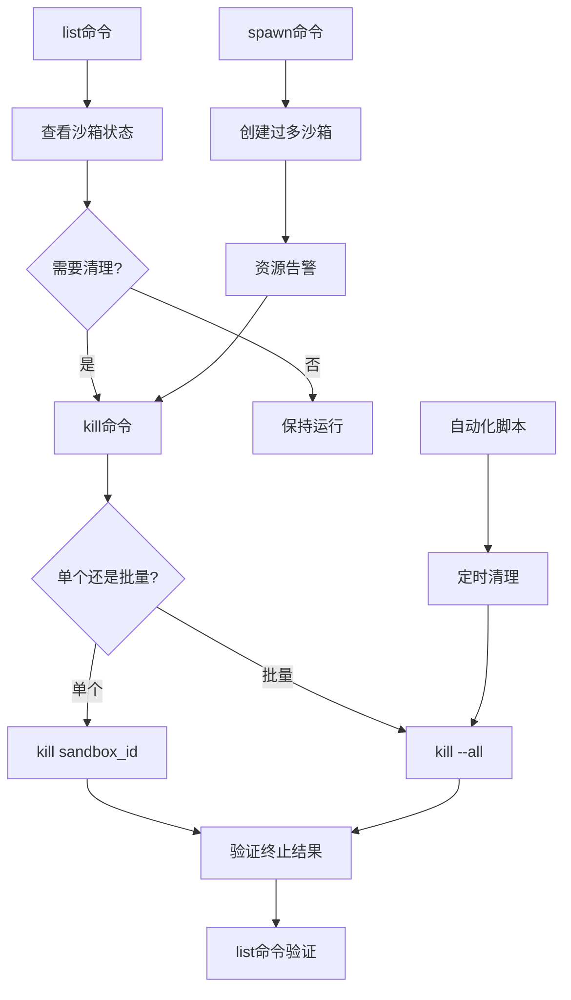

# cli/sandbox/kill.ts - E2B CLI 沙箱终止命令

> 基于五步显化法的 TypeScript 代码深度解析

---

## 一、定位与使命 (Positioning & Mission)

### 1.1 模块定位

**cli/sandbox/kill.ts 是 E2B CLI 工具的沙箱终止命令实现，为开发者提供安全、可靠的沙箱终止功能，支持单个沙箱精确终止和批量沙箱清理，确保资源的有效管理和成本控制。**

### 1.2 核心问题

此文件旨在解决以下关键问题：

1. **精确的沙箱生命周期终止**
   - 通过沙箱ID精确终止特定沙箱
   - 提供清晰的终止结果反馈
   - 处理沙箱不存在的异常情况

2. **批量沙箱清理能力**
   - 支持一键终止所有运行中的沙箱
   - 并发处理多个终止操作提高效率
   - 防止意外操作的参数冲突检查

3. **安全的资源清理机制**
   - 确保沙箱完全终止和资源释放
   - 提供操作确认和错误处理
   - 支持自动化脚本的集成使用

### 1.3 应用场景

#### 场景一：开发完成后的资源清理
```bash
# 开发工作完成，清理单个沙箱
e2b sandbox kill sb_dev_12345abc

# 输出：Sandbox sb_dev_12345abc has been killed

# 使用别名快速终止
e2b kl sb_test_67890def

# 如果沙箱不存在
# 输出：Sandbox sb_nonexistent_123 wasn't found
```

#### 场景二：批量资源清理
```bash
# 工作日结束，清理所有运行的沙箱
e2b sandbox kill --all

# 输出示例：
# Sandbox sb_project_001 has been killed
# Sandbox sb_testing_002 has been killed
# Sandbox sb_demo_003 has been killed

# 如果没有运行的沙箱
# 输出：No running sandboxes

# 使用简短参数
e2b kl -a
```

#### 场景三：成本控制和资源管理
```bash
# 财务团队每日资源清理脚本
#!/bin/bash

echo "开始每日沙箱清理..."

# 查看当前运行的沙箱
echo "当前运行的沙箱："
e2b sandbox list

# 询问是否继续清理
read -p "是否清理所有沙箱？ (y/N): " confirm

if [[ $confirm == [yY] || $confirm == [yY][eE][sS] ]]; then
    echo "正在清理所有沙箱..."
    e2b sandbox kill --all
    echo "清理完成！"
else
    echo "取消清理操作"
fi

# 验证清理结果
echo "清理后的沙箱状态："
e2b sandbox list
```

#### 场景四：CI/CD 流水线中的清理
```bash
# .github/workflows/cleanup.yml
name: Daily Sandbox Cleanup

on:
  schedule:
    - cron: '0 2 * * *'  # 每天凌晨2点执行
  workflow_dispatch:     # 支持手动触发

jobs:
  cleanup:
    runs-on: ubuntu-latest
    steps:
      - name: Setup E2B CLI
        run: |
          npm install -g @e2b/cli
          
      - name: Cleanup Sandboxes
        env:
          E2B_API_KEY: ${{ secrets.E2B_API_KEY }}
        run: |
          echo "Listing current sandboxes..."
          e2b sandbox list
          
          echo "Killing all sandboxes..."
          e2b sandbox kill --all
          
          echo "Verification - remaining sandboxes:"
          e2b sandbox list

      - name: Report Results
        run: |
          echo "Daily sandbox cleanup completed at $(date)"
```

#### 场景五：故障恢复和紧急清理
```bash
# 紧急情况：大量沙箱异常占用资源

# 1. 首先查看所有沙箱状态
e2b sandbox list

# 2. 如果发现大量异常沙箱，进行批量清理
e2b sandbox kill --all

# 3. 或者精确清理特定的问题沙箱
e2b sandbox kill sb_problematic_001
e2b sandbox kill sb_problematic_002
e2b sandbox kill sb_problematic_003

# 4. 验证清理效果
e2b sandbox list

# 5. 如果需要，重新启动必要的服务沙箱
e2b sandbox spawn production-service
```

#### 场景六：团队协作中的沙箱管理
```bash
# 团队负责人管理团队沙箱使用

# 查看团队当前的沙箱使用情况
e2b sandbox list

# 输出可能显示：
# Sandbox ID         Template ID      Alias            Started at           vCPUs  RAM MiB
# sb_alice_dev       python3.11       alice-work       2024-01-15 09:00:00  2      1024
# sb_bob_test        nodejs18         bob-testing      2024-01-15 14:00:00  1      512  
# sb_old_forgotten   ubuntu22         forgotten        2024-01-10 08:00:00  4      2048

# 发现有长期运行的遗忘沙箱，进行清理
e2b sandbox kill sb_old_forgotten

# 在团队会议后，如果需要清理所有开发环境
e2b sandbox kill --all

# 然后团队成员根据需要重新创建沙箱
```

#### 场景七：自动化测试环境管理
```bash
# 测试脚本：test_cleanup.sh
#!/bin/bash

TEST_SANDBOX_PREFIX="test_"

echo "开始测试环境清理..."

# 获取所有沙箱列表，过滤测试沙箱
TEST_SANDBOXES=$(e2b sandbox list | grep "$TEST_SANDBOX_PREFIX" | awk '{print $1}')

if [ -z "$TEST_SANDBOXES" ]; then
    echo "没有发现测试沙箱"
    exit 0
fi

echo "发现以下测试沙箱："
echo "$TEST_SANDBOXES"

# 逐个终止测试沙箱
for sandbox_id in $TEST_SANDBOXES; do
    echo "正在终止测试沙箱: $sandbox_id"
    e2b sandbox kill "$sandbox_id"
done

echo "测试环境清理完成"

# 如果需要，清理所有沙箱（危险操作，需要确认）
if [ "$1" == "--all" ]; then
    echo "警告：即将清理所有沙箱！"
    read -p "确认清理所有沙箱？ (yes/no): " confirm
    if [ "$confirm" == "yes" ]; then
        e2b sandbox kill --all
        echo "所有沙箱已清理"
    else
        echo "取消全量清理"
    fi
fi
```

### 1.4 能力边界

**此模块做什么：**
- 终止指定ID的单个沙箱
- 批量终止所有运行中的沙箱
- 提供操作结果反馈和错误处理
- 支持并发终止操作提高效率

**此模块不做什么：**
- 不提供沙箱终止前的数据备份
- 不支持条件过滤的批量终止
- 不提供沙箱终止的撤销功能
- 不管理沙箱内部进程的优雅关闭

---

## 二、设计思想与哲学基石 (Design Philosophy & Foundational Principles)

### 2.1 明确的参数互斥设计

```typescript
if (!sandboxID && !all) {
  console.error('You need to specify [sandboxID] or use -a/--all flag')
  process.exit(1)
}

if (all && sandboxID) {
  console.error('You cannot use -a/--all flag while specifying [sandboxID]')
  process.exit(1)
}
```

防止用户操作歧义，确保命令语义清晰。

### 2.2 并发处理设计

```typescript
await Promise.all(
  sandboxes.map((sandbox) => killSandbox(sandbox.sandboxId, apiKey))
)
```

使用并发操作提高批量终止的效率。

### 2.3 友好的反馈机制

```typescript
if (killed) {
  console.log(`Sandbox ${asBold(sandboxID)} has been killed`)
} else {
  console.error(`Sandbox ${asBold(sandboxID)} wasn't found`)
}
```

提供明确的操作结果反馈。

### 2.4 安全的错误处理

```typescript
try {
  // 执行终止操作
} catch (err: any) {
  console.error(err)
  process.exit(1)
}
```

确保异常情况的正确处理和程序退出。

---

## 三、核心数据结构定义 (Core Data Structure Definitions)

### 3.1 命令选项结构

```typescript
interface KillCommandOptions {
  all: boolean          // 是否终止所有沙箱
}

interface KillCommandArgs {
  sandboxID?: string    // 要终止的沙箱ID
  options: KillCommandOptions
}
```

### 3.2 终止操作结果

```typescript
interface KillResult {
  success: boolean      // 终止是否成功  
  sandboxId: string     // 沙箱ID
  message: string       // 结果消息
  error?: Error        // 错误信息
}

interface BatchKillResult {
  totalCount: number           // 总沙箱数量
  successCount: number         // 成功终止数量
  failureCount: number         // 失败数量
  results: KillResult[]        // 详细结果列表
  duration: number            // 执行耗时
}
```

### 3.3 沙箱终止状态

```typescript
enum SandboxKillStatus {
  SUCCESS = 'success',         // 成功终止
  NOT_FOUND = 'not_found',     // 沙箱不存在
  ERROR = 'error',             // 终止错误
  TIMEOUT = 'timeout',         // 终止超时
}

interface SandboxKillInfo {
  sandboxId: string
  status: SandboxKillStatus
  timestamp: Date
  duration?: number
  error?: string
}
```

### 3.4 批量操作配置

```typescript
interface BatchKillConfig {
  concurrency: number          // 并发数量
  timeout: number             // 单个操作超时
  retryCount: number          // 重试次数
  retryDelay: number          // 重试延迟
  confirmRequired: boolean    // 是否需要确认
}
```

### 3.5 操作审计日志

```typescript
interface KillOperationLog {
  timestamp: Date             // 操作时间
  operationType: 'single' | 'batch'  // 操作类型
  initiatedBy: string         // 操作发起者
  sandboxIds: string[]        // 涉及的沙箱ID
  success: boolean           // 操作是否成功
  duration: number           // 操作耗时
  details: KillResult[]      // 详细结果
}
```

---

## 四、核心接口与逻辑实现 (Core Interface & Logic)

### 4.1 主命令处理逻辑

```typescript
.action(async (sandboxID: string, { all }: { all: boolean }) => {
  try {
    // 1. 确保API密钥可用
    const apiKey = ensureAPIKey()
    
    // 2. 验证参数组合
    validateCommandArguments(sandboxID, all)
    
    // 3. 执行相应的终止操作
    if (all) {
      await killAllSandboxes(apiKey)
    } else {
      await killSingleSandbox(sandboxID, apiKey)
    }
    
  } catch (err: any) {
    console.error(err)
    process.exit(1)
  }
})
```

### 4.2 参数验证逻辑

```typescript
function validateCommandArguments(sandboxID: string, all: boolean): void {
  if (!sandboxID && !all) {
    console.error(
      `You need to specify ${asBold('[sandboxID]')} or use ${asBold('-a/--all')} flag`
    )
    process.exit(1)
  }
  
  if (all && sandboxID) {
    console.error(
      `You cannot use ${asBold('-a/--all')} flag while specifying ${asBold('[sandboxID]')}`
    )
    process.exit(1)
  }
}
```

### 4.3 单个沙箱终止实现

```typescript
async function killSandbox(sandboxID: string, apiKey: string): Promise<void> {
  const killed = await e2b.Sandbox.kill(sandboxID, { apiKey })
  
  if (killed) {
    console.log(`Sandbox ${asBold(sandboxID)} has been killed`)
  } else {
    console.error(`Sandbox ${asBold(sandboxID)} wasn't found`)
  }
}
```

### 4.4 批量沙箱终止实现

```typescript
async function killAllSandboxes(apiKey: string): Promise<void> {
  // 1. 获取所有运行中的沙箱
  const sandboxes = await e2b.Sandbox.list({ apiKey })
  
  // 2. 处理空列表情况
  if (sandboxes.length === 0) {
    console.log('No running sandboxes')
    process.exit(0)
  }
  
  // 3. 并发终止所有沙箱
  await Promise.all(
    sandboxes.map((sandbox) => killSandbox(sandbox.sandboxId, apiKey))
  )
}
```

### 4.5 增强的终止功能（扩展）

```typescript
class EnhancedSandboxKiller {
  private config: BatchKillConfig
  private logger: KillOperationLogger
  
  constructor(config: Partial<BatchKillConfig> = {}) {
    this.config = {
      concurrency: 5,
      timeout: 30000,
      retryCount: 3,
      retryDelay: 1000,
      confirmRequired: true,
      ...config
    }
    this.logger = new KillOperationLogger()
  }
  
  async killSandboxWithRetry(sandboxId: string, apiKey: string): Promise<KillResult> {
    const startTime = Date.now()
    let lastError: Error | undefined
    
    for (let attempt = 1; attempt <= this.config.retryCount; attempt++) {
      try {
        const killed = await e2b.Sandbox.kill(sandboxId, { 
          apiKey,
          timeout: this.config.timeout 
        })
        
        const result: KillResult = {
          success: killed,
          sandboxId,
          message: killed 
            ? `Sandbox ${sandboxId} has been killed` 
            : `Sandbox ${sandboxId} wasn't found`
        }
        
        return result
        
      } catch (error) {
        lastError = error as Error
        console.warn(`Attempt ${attempt} failed for sandbox ${sandboxId}: ${error.message}`)
        
        if (attempt < this.config.retryCount) {
          await this.delay(this.config.retryDelay * attempt)
        }
      }
    }
    
    return {
      success: false,
      sandboxId,
      message: `Failed to kill sandbox ${sandboxId} after ${this.config.retryCount} attempts`,
      error: lastError
    }
  }
  
  async killBatchSandboxes(sandboxIds: string[], apiKey: string): Promise<BatchKillResult> {
    const startTime = Date.now()
    
    // 可选的确认提示
    if (this.config.confirmRequired && sandboxIds.length > 1) {
      const confirmed = await this.promptConfirmation(
        `Are you sure you want to kill ${sandboxIds.length} sandboxes?`
      )
      
      if (!confirmed) {
        console.log('Operation cancelled by user')
        process.exit(0)
      }
    }
    
    // 分批并发处理
    const batches = this.chunkArray(sandboxIds, this.config.concurrency)
    const results: KillResult[] = []
    
    for (const batch of batches) {
      const batchPromises = batch.map(id => this.killSandboxWithRetry(id, apiKey))
      const batchResults = await Promise.all(batchPromises)
      results.push(...batchResults)
    }
    
    const successCount = results.filter(r => r.success).length
    const failureCount = results.length - successCount
    const duration = Date.now() - startTime
    
    const batchResult: BatchKillResult = {
      totalCount: results.length,
      successCount,
      failureCount,
      results,
      duration
    }
    
    // 记录操作日志
    this.logger.logBatchOperation(batchResult)
    
    return batchResult
  }
  
  private async delay(ms: number): Promise<void> {
    return new Promise(resolve => setTimeout(resolve, ms))
  }
  
  private chunkArray<T>(array: T[], size: number): T[][] {
    const chunks: T[][] = []
    for (let i = 0; i < array.length; i += size) {
      chunks.push(array.slice(i, i + size))
    }
    return chunks
  }
  
  private async promptConfirmation(message: string): Promise<boolean> {
    // 简化的确认提示实现
    console.log(message + ' (y/N)')
    // 在实际实现中需要处理用户输入
    return true // 暂时返回true
  }
}
```

### 4.6 选择性终止功能（扩展）

```typescript
interface SelectiveKillOptions {
  templateId?: string         // 按模板过滤
  olderThan?: Date           // 按时间过滤
  minMemory?: number         // 按内存使用过滤
  tags?: string[]           // 按标签过滤
  dryRun?: boolean          // 预览模式
}

async function killSelectiveSandboxes(
  options: SelectiveKillOptions, 
  apiKey: string
): Promise<BatchKillResult> {
  
  // 1. 获取所有沙箱
  const allSandboxes = await e2b.Sandbox.list({ apiKey })
  
  // 2. 应用过滤条件
  const filteredSandboxes = allSandboxes.filter(sandbox => {
    // 模板过滤
    if (options.templateId && sandbox.templateId !== options.templateId) {
      return false
    }
    
    // 时间过滤
    if (options.olderThan) {
      const startedAt = new Date(sandbox.startedAt)
      if (startedAt > options.olderThan) {
        return false
      }
    }
    
    // 内存过滤
    if (options.minMemory && sandbox.memoryMB < options.minMemory) {
      return false
    }
    
    // 标签过滤（假设沙箱有标签信息）
    if (options.tags && options.tags.length > 0) {
      const sandboxTags = sandbox.metadata?.tags || []
      const hasMatchingTag = options.tags.some(tag => sandboxTags.includes(tag))
      if (!hasMatchingTag) {
        return false
      }
    }
    
    return true
  })
  
  console.log(`Found ${filteredSandboxes.length} sandboxes matching criteria`)
  
  // 3. 预览模式
  if (options.dryRun) {
    console.log('Dry run - sandboxes that would be killed:')
    filteredSandboxes.forEach(sandbox => {
      console.log(`  - ${sandbox.sandboxId} (${sandbox.templateId})`)
    })
    return {
      totalCount: filteredSandboxes.length,
      successCount: 0,
      failureCount: 0,
      results: [],
      duration: 0
    }
  }
  
  // 4. 执行终止操作
  const killer = new EnhancedSandboxKiller()
  const sandboxIds = filteredSandboxes.map(s => s.sandboxId)
  return await killer.killBatchSandboxes(sandboxIds, apiKey)
}

// 使用示例
async function exampleSelectiveKill() {
  const apiKey = 'your-api-key'
  
  // 终止所有超过2小时的Python沙箱
  const result = await killSelectiveSandboxes({
    templateId: 'python3.11',
    olderThan: new Date(Date.now() - 2 * 60 * 60 * 1000), // 2小时前
    dryRun: false
  }, apiKey)
  
  console.log(`Killed ${result.successCount} out of ${result.totalCount} sandboxes`)
}
```

### 4.7 操作监控和报告

```typescript
class KillOperationReporter {
  generateSummaryReport(result: BatchKillResult): void {
    console.log('\n📊 Kill Operation Summary:')
    console.log(`   Total sandboxes: ${result.totalCount}`)
    console.log(`   Successfully killed: ${result.successCount}`)
    console.log(`   Failed to kill: ${result.failureCount}`)
    console.log(`   Operation duration: ${(result.duration / 1000).toFixed(2)}s`)
    
    if (result.failureCount > 0) {
      console.log('\n❌ Failed operations:')
      result.results
        .filter(r => !r.success)
        .forEach(r => {
          console.log(`   - ${r.sandboxId}: ${r.message}`)
        })
    }
    
    const successRate = (result.successCount / result.totalCount) * 100
    console.log(`\n✅ Success rate: ${successRate.toFixed(1)}%`)
  }
  
  generateDetailedReport(result: BatchKillResult): void {
    console.log('\n📋 Detailed Kill Report:')
    
    result.results.forEach((r, index) => {
      const status = r.success ? '✅' : '❌'
      console.log(`${index + 1}. ${status} ${r.sandboxId}`)
      console.log(`   Message: ${r.message}`)
      
      if (r.error) {
        console.log(`   Error: ${r.error.message}`)
      }
    })
  }
  
  exportReportToFile(result: BatchKillResult, filename: string): void {
    const report = {
      timestamp: new Date().toISOString(),
      summary: {
        totalCount: result.totalCount,
        successCount: result.successCount,
        failureCount: result.failureCount,
        duration: result.duration,
        successRate: (result.successCount / result.totalCount) * 100
      },
      details: result.results
    }
    
    const fs = require('fs')
    fs.writeFileSync(filename, JSON.stringify(report, null, 2))
    console.log(`Report exported to: ${filename}`)
  }
}
```

### 4.8 安全确认机制

```typescript
class SafetyGuard {
  async confirmHighRiskOperation(
    operation: 'kill-all' | 'kill-batch', 
    count: number
  ): Promise<boolean> {
    
    if (operation === 'kill-all' && count > 10) {
      console.log(`⚠️  High risk operation detected!`)
      console.log(`   You are about to kill ${count} sandboxes`)
      console.log(`   This action cannot be undone`)
      
      return await this.requireExplicitConfirmation()
    }
    
    if (operation === 'kill-batch' && count > 5) {
      console.log(`⚠️  Batch kill operation: ${count} sandboxes`)
      return await this.requireSimpleConfirmation()
    }
    
    return true
  }
  
  private async requireExplicitConfirmation(): Promise<boolean> {
    const readline = require('readline')
    const rl = readline.createInterface({
      input: process.stdin,
      output: process.stdout
    })
    
    return new Promise((resolve) => {
      rl.question('Type "yes" to confirm this operation: ', (answer: string) => {
        rl.close()
        resolve(answer.toLowerCase() === 'yes')
      })
    })
  }
  
  private async requireSimpleConfirmation(): Promise<boolean> {
    const readline = require('readline')
    const rl = readline.createInterface({
      input: process.stdin,
      output: process.stdout
    })
    
    return new Promise((resolve) => {
      rl.question('Continue? (y/N): ', (answer: string) => {
        rl.close()
        resolve(answer.toLowerCase() === 'y' || answer.toLowerCase() === 'yes')
      })
    })
  }
  
  checkEnvironmentSafety(): void {
    const isProduction = process.env.NODE_ENV === 'production'
    const hasProductionKey = process.env.E2B_API_KEY?.includes('prod')
    
    if (isProduction || hasProductionKey) {
      console.log('🚨 WARNING: You are operating in a production environment!')
      console.log('   Please be extra careful with kill operations')
    }
  }
}
```

---

## 五、依赖关系与交互 (Dependencies & Interactions)

### 5.1 模块依赖图



### 5.2 命令执行流程



### 5.3 错误处理和状态管理



### 5.4 与其他CLI命令的工作流集成



### 5.5 批量操作的并发控制

```typescript
class ConcurrencyController {
  private readonly semaphore: Semaphore
  
  constructor(maxConcurrency: number = 5) {
    this.semaphore = new Semaphore(maxConcurrency)
  }
  
  async executeConcurrentKills(
    sandboxIds: string[], 
    apiKey: string
  ): Promise<KillResult[]> {
    
    const tasks = sandboxIds.map(id => 
      this.semaphore.acquire().then(release => {
        return this.killSandboxSafely(id, apiKey).finally(release)
      })
    )
    
    return Promise.all(tasks)
  }
  
  private async killSandboxSafely(
    sandboxId: string, 
    apiKey: string
  ): Promise<KillResult> {
    try {
      const killed = await e2b.Sandbox.kill(sandboxId, { apiKey })
      return {
        success: killed,
        sandboxId,
        message: killed 
          ? `Sandbox ${sandboxId} killed successfully`
          : `Sandbox ${sandboxId} not found`
      }
    } catch (error) {
      return {
        success: false,
        sandboxId,
        message: `Failed to kill sandbox ${sandboxId}`,
        error: error as Error
      }
    }
  }
}

class Semaphore {
  private readonly maxCount: number
  private currentCount: number
  private waitQueue: Array<() => void> = []
  
  constructor(maxCount: number) {
    this.maxCount = maxCount
    this.currentCount = maxCount
  }
  
  async acquire(): Promise<() => void> {
    return new Promise((resolve) => {
      if (this.currentCount > 0) {
        this.currentCount--
        resolve(() => this.release())
      } else {
        this.waitQueue.push(() => {
          this.currentCount--
          resolve(() => this.release())
        })
      }
    })
  }
  
  private release(): void {
    this.currentCount++
    const nextWaiter = this.waitQueue.shift()
    if (nextWaiter) {
      nextWaiter()
    }
  }
}
```

### 5.6 监控和指标收集

```typescript
interface KillMetrics {
  totalOperations: number
  successfulKills: number
  failedKills: number
  averageKillTime: number
  peakConcurrency: number
  errorDistribution: Record<string, number>
}

class KillMetricsCollector {
  private metrics: KillMetrics = {
    totalOperations: 0,
    successfulKills: 0,
    failedKills: 0,
    averageKillTime: 0,
    peakConcurrency: 0,
    errorDistribution: {}
  }
  
  recordKillOperation(result: KillResult, duration: number): void {
    this.metrics.totalOperations++
    
    if (result.success) {
      this.metrics.successfulKills++
    } else {
      this.metrics.failedKills++
      
      // 记录错误分布
      const errorType = this.categorizeError(result.error)
      this.metrics.errorDistribution[errorType] = 
        (this.metrics.errorDistribution[errorType] || 0) + 1
    }
    
    // 更新平均时间
    this.updateAverageKillTime(duration)
  }
  
  recordBatchOperation(batchResult: BatchKillResult): void {
    batchResult.results.forEach(result => {
      this.recordKillOperation(result, batchResult.duration / batchResult.totalCount)
    })
  }
  
  private categorizeError(error?: Error): string {
    if (!error) return 'unknown'
    
    const message = error.message.toLowerCase()
    
    if (message.includes('not found')) return 'not_found'
    if (message.includes('timeout')) return 'timeout'
    if (message.includes('network')) return 'network'
    if (message.includes('auth')) return 'authentication'
    
    return 'other'
  }
  
  private updateAverageKillTime(duration: number): void {
    const totalTime = this.metrics.averageKillTime * (this.metrics.totalOperations - 1)
    this.metrics.averageKillTime = (totalTime + duration) / this.metrics.totalOperations
  }
  
  getMetrics(): KillMetrics {
    return { ...this.metrics }
  }
  
  generateReport(): void {
    const successRate = (this.metrics.successfulKills / this.metrics.totalOperations) * 100
    
    console.log('\n📊 Kill Operations Metrics:')
    console.log(`   Total operations: ${this.metrics.totalOperations}`)
    console.log(`   Success rate: ${successRate.toFixed(1)}%`)
    console.log(`   Average kill time: ${this.metrics.averageKillTime.toFixed(0)}ms`)
    
    if (Object.keys(this.metrics.errorDistribution).length > 0) {
      console.log('\n❌ Error distribution:')
      Object.entries(this.metrics.errorDistribution).forEach(([type, count]) => {
        console.log(`   ${type}: ${count}`)
      })
    }
  }
}
```

### 5.7 与外部系统的集成

```typescript
// Webhook通知集成
interface WebhookPayload {
  event: 'sandbox_killed' | 'batch_kill_completed'
  timestamp: string
  data: {
    sandboxIds: string[]
    success: boolean
    details?: any
  }
}

class WebhookNotifier {
  private webhookUrl?: string
  
  constructor(webhookUrl?: string) {
    this.webhookUrl = webhookUrl || process.env.E2B_WEBHOOK_URL
  }
  
  async notifyKillOperation(result: KillResult): Promise<void> {
    if (!this.webhookUrl) return
    
    const payload: WebhookPayload = {
      event: 'sandbox_killed',
      timestamp: new Date().toISOString(),
      data: {
        sandboxIds: [result.sandboxId],
        success: result.success,
        details: result
      }
    }
    
    try {
      await fetch(this.webhookUrl, {
        method: 'POST',
        headers: { 'Content-Type': 'application/json' },
        body: JSON.stringify(payload)
      })
    } catch (error) {
      console.warn('Failed to send webhook notification:', error)
    }
  }
  
  async notifyBatchOperation(batchResult: BatchKillResult): Promise<void> {
    if (!this.webhookUrl) return
    
    const payload: WebhookPayload = {
      event: 'batch_kill_completed',
      timestamp: new Date().toISOString(),
      data: {
        sandboxIds: batchResult.results.map(r => r.sandboxId),
        success: batchResult.failureCount === 0,
        details: batchResult
      }
    }
    
    try {
      await fetch(this.webhookUrl, {
        method: 'POST',
        headers: { 'Content-Type': 'application/json' },
        body: JSON.stringify(payload)
      })
    } catch (error) {
      console.warn('Failed to send batch webhook notification:', error)
    }
  }
}

// 数据库记录集成
class KillOperationDB {
  async recordOperation(operation: KillOperationLog): Promise<void> {
    // 记录到数据库的实现
    console.log('Recording kill operation to database:', {
      id: this.generateOperationId(),
      ...operation
    })
  }
  
  async getOperationHistory(limit: number = 100): Promise<KillOperationLog[]> {
    // 从数据库获取历史记录的实现
    return []
  }
  
  private generateOperationId(): string {
    return `kill_${Date.now()}_${Math.random().toString(36).substr(2, 9)}`
  }
}
```

---

## 总结

cli/sandbox/kill.ts 作为 E2B CLI 工具的沙箱终止命令，通过精确的参数验证、高效的并发处理和完善的错误处理机制，为开发者提供了安全、可靠的沙箱生命周期管理能力。它不仅支持单个沙箱的精确终止和批量沙箱的高效清理，还通过扩展的安全确认、操作监控和外部集成功能，确保了资源管理的安全性和可追溯性，是 E2B 沙箱生态系统中关键的资源控制工具。