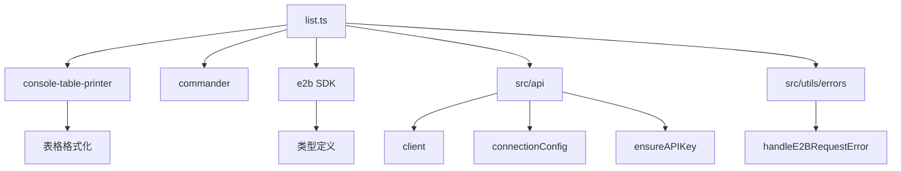
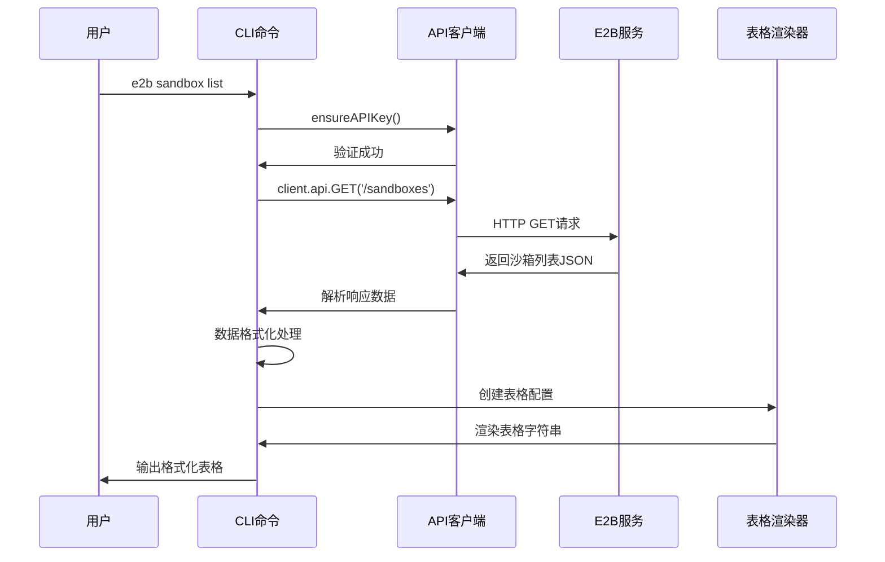
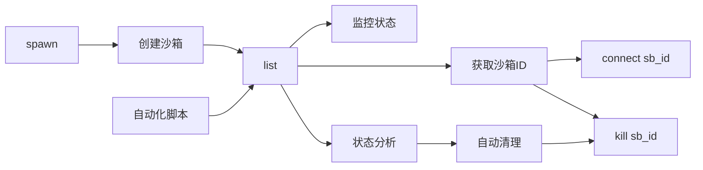

# cli/sandbox/list.ts - E2B CLI 沙箱列表命令

> 基于五步显化法的 TypeScript 代码深度解析

---

## 一、定位与使命 (Positioning & Mission)

### 1.1 模块定位

**cli/sandbox/list.ts 是 E2B CLI 工具的沙箱列表查询命令实现，为开发者提供直观的沙箱状态概览，支持详细的资源信息展示和多维度数据排序，帮助用户有效管理和监控沙箱资源。**

### 1.2 核心问题

此文件旨在解决以下关键问题：

1. **沙箱资源可视化**
   - 以表格形式展示所有运行中的沙箱
   - 提供丰富的沙箱属性信息
   - 支持清晰的数据格式化和排序

2. **资源监控和管理**
   - 显示沙箱的资源占用情况（CPU、内存）
   - 展示沙箱的时间信息（启动时间、结束时间）
   - 提供元数据和模板信息查看

3. **用户友好的信息展示**
   - 使用专业的表格格式输出
   - 支持自定义列宽和对齐方式
   - 处理空结果的友好提示

### 1.3 应用场景

#### 场景一：日常沙箱管理
```bash
# 查看当前所有运行的沙箱
e2b sandbox list

# 输出示例:
# Running sandboxes
# Sandbox ID         Template ID      Alias        Started at           End at               vCPUs  RAM MiB  Metadata
# sb_abc123def456    python3.11       my-project   2024-01-15 14:30:25  2024-01-15 15:30:25  2      1024     {"project":"demo"}
# sb_789xyz012abc    nodejs18         web-server   2024-01-15 14:25:10  2024-01-15 15:25:10  1      512      {}

# 使用别名
e2b ls
```

#### 场景二：资源使用情况监控
```bash
# 检查资源占用
e2b sandbox list

# 分析输出信息：
# - 查看每个沙箱的CPU和内存分配
# - 识别资源占用较高的沙箱
# - 根据使用时间判断是否需要清理

# 示例分析：
# sb_heavy_001    ml-training      training     2024-01-15 10:00:00  2024-01-15 18:00:00  8      8192     {"model":"llama"}
# ↑ 这个沙箱占用8核CPU和8GB内存，运行时间较长，可能是机器学习训练任务

# sb_light_002    python3.11       test         2024-01-15 14:50:00  2024-01-15 15:50:00  1      256      {}
# ↑ 这个沙箱资源占用很少，可能是简单的测试环境
```

#### 场景三：团队沙箱协调
```bash
# 团队负责人查看团队成员的沙箱使用情况
e2b sandbox list

# 根据输出信息协调资源：
# Sandbox ID         Template ID      Alias            Started at           End at               vCPUs  RAM MiB  Metadata
# sb_alice_dev       react-next       alice-frontend   2024-01-15 09:00:00  2024-01-15 17:00:00  2      1024     {"dev":"alice","team":"frontend"}
# sb_bob_api         python3.11       bob-backend      2024-01-15 09:30:00  2024-01-15 17:30:00  4      2048     {"dev":"bob","team":"backend"}  
# sb_charlie_db      postgres14       charlie-db       2024-01-15 08:00:00  2024-01-15 20:00:00  2      4096     {"dev":"charlie","team":"data"}

# 团队负责人可以：
# - 了解每个成员正在使用的环境
# - 合理分配资源配额
# - 协调开发时间避免资源冲突
```

#### 场景四：成本管理和优化
```bash
# 财务或运维人员查看资源使用情况
e2b sandbox list

# 成本分析：
# - 统计总的CPU和内存使用量
# - 识别长期运行的沙箱（可能产生高费用）
# - 发现闲置或低利用率的沙箱

# 基于输出制定优化策略：
# 1. 对于运行时间超过8小时的沙箱，发送提醒
# 2. 对于低配置长期运行的沙箱，建议迁移到持久化环境
# 3. 对于高配置短期使用的沙箱，建议优化资源分配
```

#### 场景五：故障排查和调试
```bash
# 当用户报告连接问题时，技术支持查看沙箱状态
e2b sandbox list

# 故障分析流程：
# 1. 查看问题沙箱是否在运行列表中
# 2. 检查沙箱的启动时间和预期结束时间
# 3. 查看资源配置是否合理
# 4. 检查元数据中的错误信息

# 示例排查：
# sb_problem_001    custom-env       user-issue    2024-01-15 14:00:00  2024-01-15 14:05:00  1      128      {"error":"oom"}
# ↑ 发现这个沙箱很快就结束了，内存配置很低，元数据显示内存不足错误

# 排查结论：用户的应用需要更多内存，建议升级沙箱配置
```

#### 场景六：自动化脚本和监控
```bash
#!/bin/bash
# 监控脚本示例

# 获取沙箱列表
SANDBOX_LIST=$(e2b sandbox list)

# 检查是否有沙箱运行
if echo "$SANDBOX_LIST" | grep -q "No running sandboxes"; then
    echo "警告: 没有运行中的沙箱，某些服务可能不可用"
    # 发送告警通知
fi

# 检查高资源使用的沙箱
HIGH_MEM_SANDBOXES=$(echo "$SANDBOX_LIST" | awk '$7 > 4096 {print $1}')
if [ -n "$HIGH_MEM_SANDBOXES" ]; then
    echo "发现高内存使用的沙箱: $HIGH_MEM_SANDBOXES"
    # 发送资源使用告警
fi

# 检查长期运行的沙箱
LONG_RUNNING=$(echo "$SANDBOX_LIST" | awk '
    BEGIN { now = systime() }
    {
        # 解析启动时间，检查是否运行超过6小时
        # 这里需要根据实际日期格式调整
        if ((now - started_time) > 21600) {
            print $1
        }
    }
')

if [ -n "$LONG_RUNNING" ]; then
    echo "发现长期运行的沙箱: $LONG_RUNNING"
    # 可以选择自动清理或发送通知
fi
```

### 1.4 能力边界

**此模块做什么：**
- 查询和展示所有运行中的沙箱
- 提供详细的沙箱属性信息
- 格式化输出表格数据
- 处理空结果和错误情况

**此模块不做什么：**
- 不修改沙箱状态或配置
- 不提供沙箱的实时性能监控
- 不支持历史沙箱记录查询
- 不提供沙箱内部进程信息

---

## 二、设计思想与哲学基石 (Design Philosophy & Foundational Principles)

### 2.1 只读查询原则

```typescript
export const listCommand = new commander.Command('list')
  .description('list all running sandboxes')
  .alias('ls')
```

纯查询命令，不修改任何状态，确保操作安全性。

### 2.2 丰富的信息展示

```typescript
columns: [
  { name: 'sandboxID', alignment: 'left', title: 'Sandbox ID' },
  { name: 'templateID', alignment: 'left', title: 'Template ID', maxLen: 20 },
  { name: 'alias', alignment: 'left', title: 'Alias' },
  { name: 'startedAt', alignment: 'left', title: 'Started at' },
  { name: 'endAt', alignment: 'left', title: 'End at' },
  { name: 'cpuCount', alignment: 'left', title: 'vCPUs' },
  { name: 'memoryMB', alignment: 'left', title: 'RAM MiB' },
  { name: 'metadata', alignment: 'left', title: 'Metadata' },
]
```

提供全面的沙箱属性信息，便于用户全面了解状态。

### 2.3 用户友好的数据格式化

```typescript
.map((sandbox) => ({
  ...sandbox,
  startedAt: new Date(sandbox.startedAt).toLocaleString(),
  endAt: new Date(sandbox.endAt).toLocaleString(),
  metadata: JSON.stringify(sandbox.metadata),
}))
```

将原始数据转换为人类可读的格式。

### 2.4 智能排序策略

```typescript
.sort(
  (a, b) =>
    a.startedAt.localeCompare(b.startedAt) ||
    a.sandboxID.localeCompare(b.sandboxID)
)
```

按启动时间和ID排序，提供一致的展示顺序。

### 2.5 优雅的空状态处理

```typescript
if (!sandboxes?.length) {
  console.log('No running sandboxes.')
} else {
  // 显示表格
}
```

友好处理无数据情况。

---

## 三、核心数据结构定义 (Core Data Structure Definitions)

### 3.1 沙箱列表项结构

```typescript
type ListedSandbox = e2b.components['schemas']['ListedSandbox']

interface FormattedSandbox {
  sandboxID: string         // 沙箱唯一标识
  templateID: string        // 模板ID
  alias?: string           // 沙箱别名
  startedAt: string        // 格式化的启动时间
  endAt: string           // 格式化的结束时间
  cpuCount: number        // CPU核心数
  memoryMB: number        // 内存大小(MB)
  metadata: string        // 序列化的元数据
}
```

### 3.2 表格配置结构

```typescript
interface TableColumn {
  name: string                    // 列名
  alignment: 'left' | 'center' | 'right'  // 对齐方式
  title: string                   // 列标题
  maxLen?: number                // 最大长度
}

interface TableConfig {
  title: string                   // 表格标题
  columns: TableColumn[]          // 列配置
  disabledColumns?: string[]      // 禁用的列
  rows: any[]                    // 表格数据
  style: TableStyle              // 样式配置
  colorMap?: Record<string, string> // 颜色映射
}
```

### 3.3 表格样式配置

```typescript
interface TableStyle {
  headerTop: BorderStyle      // 表头顶部边框
  headerBottom: BorderStyle   // 表头底部边框  
  tableBottom: BorderStyle    // 表格底部边框
  vertical: string           // 垂直分隔符
}

interface BorderStyle {
  left: string              // 左边框字符
  right: string             // 右边框字符
  mid: string               // 中间分隔字符
  other: string             // 其他边框字符
}
```

### 3.4 API响应结构

```typescript
interface SandboxListResponse {
  data: ListedSandbox[]       // 沙箱列表数据
  error?: string             // 错误信息
  success: boolean           // 请求是否成功
}

interface ListedSandbox {
  sandboxID: string          // 沙箱ID
  templateID: string         // 模板ID
  alias?: string            // 别名
  startedAt: string         // 启动时间(ISO格式)
  endAt: string            // 结束时间(ISO格式)
  cpuCount: number         // CPU数量
  memoryMB: number         // 内存大小
  metadata: Record<string, any>  // 元数据对象
  clientID?: string        // 客户端ID(禁用显示)
}
```

### 3.5 排序和过滤配置

```typescript
interface SortConfig {
  primary: 'startedAt' | 'sandboxID' | 'templateID' | 'cpuCount' | 'memoryMB'
  secondary?: string
  order: 'asc' | 'desc'
}

interface FilterConfig {
  templateID?: string        // 按模板过滤
  minCpuCount?: number      // 最小CPU数量
  maxCpuCount?: number      // 最大CPU数量
  minMemoryMB?: number      // 最小内存
  maxMemoryMB?: number      // 最大内存
  timeRange?: {             // 时间范围过滤
    startAfter?: Date
    startBefore?: Date
  }
}
```

---

## 四、核心接口与逻辑实现 (Core Interface & Logic)

### 4.1 主命令处理逻辑

```typescript
.action(async () => {
  try {
    // 1. 获取沙箱列表数据
    const sandboxes = await listSandboxes()
    
    // 2. 处理空结果
    if (!sandboxes?.length) {
      console.log('No running sandboxes.')
      return
    }
    
    // 3. 创建和配置表格
    const table = createFormattedTable(sandboxes)
    
    // 4. 输出表格
    table.printTable()
    process.stdout.write('\n')
    
  } catch (err: any) {
    console.error(err)
    process.exit(1)
  }
})
```

### 4.2 沙箱列表获取实现

```typescript
export async function listSandboxes(): Promise<ListedSandbox[]> {
  // 1. 确保API密钥存在
  ensureAPIKey()
  
  // 2. 获取请求信号（用于取消请求）
  const signal = connectionConfig.getSignal()
  
  // 3. 发送API请求
  const res = await client.api.GET('/sandboxes', { signal })
  
  // 4. 处理错误响应
  handleE2BRequestError(res, 'Error getting running sandboxes')
  
  // 5. 返回数据
  return res.data
}
```

### 4.3 表格创建和格式化

```typescript
function createFormattedTable(sandboxes: ListedSandbox[]): tablePrinter.Table {
  return new tablePrinter.Table({
    title: 'Running sandboxes',
    columns: [
      { name: 'sandboxID', alignment: 'left', title: 'Sandbox ID' },
      { name: 'templateID', alignment: 'left', title: 'Template ID', maxLen: 20 },
      { name: 'alias', alignment: 'left', title: 'Alias' },
      { name: 'startedAt', alignment: 'left', title: 'Started at' },
      { name: 'endAt', alignment: 'left', title: 'End at' },
      { name: 'cpuCount', alignment: 'left', title: 'vCPUs' },
      { name: 'memoryMB', alignment: 'left', title: 'RAM MiB' },
      { name: 'metadata', alignment: 'left', title: 'Metadata' },
    ],
    disabledColumns: ['clientID'],
    rows: formatSandboxRows(sandboxes),
    style: getMinimalTableStyle(),
    colorMap: {
      orange: '\x1b[38;5;216m',
    },
  })
}
```

### 4.4 数据行格式化处理

```typescript
function formatSandboxRows(sandboxes: ListedSandbox[]): FormattedSandbox[] {
  return sandboxes
    .map((sandbox) => ({
      ...sandbox,
      sandboxID: sandbox.sandboxID,
      startedAt: new Date(sandbox.startedAt).toLocaleString(),
      endAt: new Date(sandbox.endAt).toLocaleString(),
      metadata: JSON.stringify(sandbox.metadata),
    }))
    .sort(
      (a, b) =>
        a.startedAt.localeCompare(b.startedAt) ||
        a.sandboxID.localeCompare(b.sandboxID)
    )
}
```

### 4.5 表格样式配置

```typescript
function getMinimalTableStyle(): any {
  return {
    headerTop: {
      left: '',
      right: '',
      mid: '',
      other: '',
    },
    headerBottom: {
      left: '',
      right: '',
      mid: '',
      other: '',
    },
    tableBottom: {
      left: '',
      right: '',
      mid: '',
      other: '',
    },
    vertical: '',
  }
}
```

### 4.6 增强的列表功能（扩展）

```typescript
interface ListOptions {
  format?: 'table' | 'json' | 'csv'     // 输出格式
  filter?: FilterConfig                   // 过滤条件
  sort?: SortConfig                      // 排序配置
  columns?: string[]                     // 显示的列
  showAll?: boolean                      // 显示包括停止的沙箱
}

export async function enhancedListSandboxes(options: ListOptions = {}): Promise<void> {
  try {
    const sandboxes = await listSandboxes()
    
    if (!sandboxes?.length) {
      console.log('No running sandboxes.')
      return
    }
    
    // 应用过滤器
    const filteredSandboxes = applyFilters(sandboxes, options.filter)
    
    // 应用排序
    const sortedSandboxes = applySorting(filteredSandboxes, options.sort)
    
    // 根据格式输出
    switch (options.format) {
      case 'json':
        outputJSON(sortedSandboxes)
        break
      case 'csv':
        outputCSV(sortedSandboxes)
        break
      case 'table':
      default:
        outputTable(sortedSandboxes, options.columns)
        break
    }
    
  } catch (error) {
    console.error('Failed to list sandboxes:', error)
    process.exit(1)
  }
}

function applyFilters(sandboxes: ListedSandbox[], filter?: FilterConfig): ListedSandbox[] {
  if (!filter) return sandboxes
  
  return sandboxes.filter(sandbox => {
    // 模板过滤
    if (filter.templateID && sandbox.templateID !== filter.templateID) {
      return false
    }
    
    // CPU过滤
    if (filter.minCpuCount && sandbox.cpuCount < filter.minCpuCount) {
      return false
    }
    if (filter.maxCpuCount && sandbox.cpuCount > filter.maxCpuCount) {
      return false
    }
    
    // 内存过滤
    if (filter.minMemoryMB && sandbox.memoryMB < filter.minMemoryMB) {
      return false
    }
    if (filter.maxMemoryMB && sandbox.memoryMB > filter.maxMemoryMB) {
      return false
    }
    
    // 时间范围过滤
    if (filter.timeRange) {
      const startedAt = new Date(sandbox.startedAt)
      if (filter.timeRange.startAfter && startedAt < filter.timeRange.startAfter) {
        return false
      }
      if (filter.timeRange.startBefore && startedAt > filter.timeRange.startBefore) {
        return false
      }
    }
    
    return true
  })
}

function applySorting(sandboxes: ListedSandbox[], sort?: SortConfig): ListedSandbox[] {
  if (!sort) {
    // 默认排序：按启动时间和ID
    return sandboxes.sort((a, b) =>
      a.startedAt.localeCompare(b.startedAt) ||
      a.sandboxID.localeCompare(b.sandboxID)
    )
  }
  
  return sandboxes.sort((a, b) => {
    const primaryComparison = compareByField(a, b, sort.primary)
    if (primaryComparison !== 0) {
      return sort.order === 'desc' ? -primaryComparison : primaryComparison
    }
    
    if (sort.secondary) {
      return compareByField(a, b, sort.secondary)
    }
    
    return 0
  })
}

function compareByField(a: ListedSandbox, b: ListedSandbox, field: string): number {
  const aValue = a[field as keyof ListedSandbox]
  const bValue = b[field as keyof ListedSandbox]
  
  if (typeof aValue === 'string' && typeof bValue === 'string') {
    return aValue.localeCompare(bValue)
  }
  
  if (typeof aValue === 'number' && typeof bValue === 'number') {
    return aValue - bValue
  }
  
  return 0
}
```

### 4.7 多格式输出支持

```typescript
function outputJSON(sandboxes: ListedSandbox[]): void {
  console.log(JSON.stringify(sandboxes, null, 2))
}

function outputCSV(sandboxes: ListedSandbox[]): void {
  if (sandboxes.length === 0) return
  
  // CSV头部
  const headers = Object.keys(sandboxes[0]).join(',')
  console.log(headers)
  
  // CSV数据行
  sandboxes.forEach(sandbox => {
    const values = Object.values(sandbox).map(value => {
      if (typeof value === 'object') {
        return `"${JSON.stringify(value).replace(/"/g, '""')}"`
      }
      return `"${String(value).replace(/"/g, '""')}"`
    })
    console.log(values.join(','))
  })
}

function outputTable(sandboxes: ListedSandbox[], columns?: string[]): void {
  const tableColumns = columns 
    ? getFilteredColumns(columns)
    : getAllColumns()
    
  const table = new tablePrinter.Table({
    title: 'Running sandboxes',
    columns: tableColumns,
    rows: formatSandboxRows(sandboxes),
    style: getMinimalTableStyle(),
  })
  
  table.printTable()
  process.stdout.write('\n')
}

function getFilteredColumns(columnNames: string[]): TableColumn[] {
  const allColumns = getAllColumns()
  return allColumns.filter(col => columnNames.includes(col.name))
}

function getAllColumns(): TableColumn[] {
  return [
    { name: 'sandboxID', alignment: 'left', title: 'Sandbox ID' },
    { name: 'templateID', alignment: 'left', title: 'Template ID', maxLen: 20 },
    { name: 'alias', alignment: 'left', title: 'Alias' },
    { name: 'startedAt', alignment: 'left', title: 'Started at' },
    { name: 'endAt', alignment: 'left', title: 'End at' },
    { name: 'cpuCount', alignment: 'left', title: 'vCPUs' },
    { name: 'memoryMB', alignment: 'left', title: 'RAM MiB' },
    { name: 'metadata', alignment: 'left', title: 'Metadata' },
  ]
}
```

### 4.8 统计信息生成

```typescript
interface SandboxStatistics {
  totalCount: number
  totalCpuCores: number
  totalMemoryMB: number
  templateDistribution: Record<string, number>
  averageUptime: number
  resourceUtilization: {
    cpuDistribution: { min: number; max: number; avg: number }
    memoryDistribution: { min: number; max: number; avg: number }
  }
}

function generateStatistics(sandboxes: ListedSandbox[]): SandboxStatistics {
  if (sandboxes.length === 0) {
    return {
      totalCount: 0,
      totalCpuCores: 0,
      totalMemoryMB: 0,
      templateDistribution: {},
      averageUptime: 0,
      resourceUtilization: {
        cpuDistribution: { min: 0, max: 0, avg: 0 },
        memoryDistribution: { min: 0, max: 0, avg: 0 }
      }
    }
  }
  
  const now = Date.now()
  const templateCounts: Record<string, number> = {}
  let totalUptime = 0
  
  const cpuCounts = sandboxes.map(s => s.cpuCount)
  const memorySizes = sandboxes.map(s => s.memoryMB)
  
  sandboxes.forEach(sandbox => {
    // 统计模板分布
    templateCounts[sandbox.templateID] = (templateCounts[sandbox.templateID] || 0) + 1
    
    // 计算运行时间
    const startTime = new Date(sandbox.startedAt).getTime()
    const uptime = now - startTime
    totalUptime += uptime
  })
  
  return {
    totalCount: sandboxes.length,
    totalCpuCores: cpuCounts.reduce((sum, count) => sum + count, 0),
    totalMemoryMB: memorySizes.reduce((sum, memory) => sum + memory, 0),
    templateDistribution: templateCounts,
    averageUptime: totalUptime / sandboxes.length,
    resourceUtilization: {
      cpuDistribution: {
        min: Math.min(...cpuCounts),
        max: Math.max(...cpuCounts),
        avg: cpuCounts.reduce((sum, count) => sum + count, 0) / cpuCounts.length
      },
      memoryDistribution: {
        min: Math.min(...memorySizes),
        max: Math.max(...memorySizes),
        avg: memorySizes.reduce((sum, memory) => sum + memory, 0) / memorySizes.length
      }
    }
  }
}

function displayStatistics(stats: SandboxStatistics): void {
  console.log('\n📊 Sandbox Statistics:')
  console.log(`   Total sandboxes: ${stats.totalCount}`)
  console.log(`   Total CPU cores: ${stats.totalCpuCores}`)
  console.log(`   Total memory: ${(stats.totalMemoryMB / 1024).toFixed(1)} GiB`)
  console.log(`   Average uptime: ${(stats.averageUptime / (1000 * 60)).toFixed(0)} minutes`)
  
  console.log('\n🏷️ Template distribution:')
  Object.entries(stats.templateDistribution).forEach(([template, count]) => {
    console.log(`   ${template}: ${count}`)
  })
  
  console.log('\n💻 Resource utilization:')
  console.log(`   CPU: ${stats.resourceUtilization.cpuDistribution.min}-${stats.resourceUtilization.cpuDistribution.max} cores (avg: ${stats.resourceUtilization.cpuDistribution.avg.toFixed(1)})`)
  console.log(`   Memory: ${stats.resourceUtilization.memoryDistribution.min}-${stats.resourceUtilization.memoryDistribution.max} MiB (avg: ${stats.resourceUtilization.memoryDistribution.avg.toFixed(0)})`)
}
```

---

## 五、依赖关系与交互 (Dependencies & Interactions)

### 5.1 模块依赖图



### 5.2 数据流转过程



### 5.3 错误处理流程

```mermaid
flowchart TD
    A[开始执行] --> B[验证API密钥]
    
    B --> C{API密钥有效?}
    C -->|否| D[显示认证错误]
    C -->|是| E[发送API请求]
    
    E --> F{请求成功?}
    F -->|否| G[handleE2BRequestError]
    F -->|是| H[检查数据]
    
    H --> I{有沙箱数据?}
    I -->|否| J[显示"No running sandboxes"]
    I -->|是| K[格式化数据]
    
    K --> L[创建表格]
    L --> M[输出表格]
    
    D --> N[退出程序 exit(1)]
    G --> N
    J --> O[正常退出 exit(0)]
    M --> O
```

### 5.4 与其他CLI命令的配合使用



### 5.5 表格渲染和样式控制

```typescript
interface TableRenderingPipeline {
  // 1. 数据预处理
  preprocessData(sandboxes: ListedSandbox[]): FormattedSandbox[]
  
  // 2. 列配置
  configureColumns(options: ColumnOptions): TableColumn[]
  
  // 3. 样式应用
  applyStyles(config: StyleConfig): TableStyle
  
  // 4. 渲染输出
  renderTable(config: TableConfig): string
}

class EnhancedTableRenderer implements TableRenderingPipeline {
  preprocessData(sandboxes: ListedSandbox[]): FormattedSandbox[] {
    return sandboxes.map(sandbox => ({
      ...sandbox,
      startedAt: this.formatDateTime(sandbox.startedAt),
      endAt: this.formatDateTime(sandbox.endAt),
      metadata: this.formatMetadata(sandbox.metadata),
      memoryMB: this.formatMemory(sandbox.memoryMB),
      uptime: this.calculateUptime(sandbox.startedAt)
    }))
  }
  
  configureColumns(options: ColumnOptions): TableColumn[] {
    const baseColumns = this.getBaseColumns()
    
    if (options.hideColumns) {
      return baseColumns.filter(col => !options.hideColumns!.includes(col.name))
    }
    
    if (options.onlyColumns) {
      return baseColumns.filter(col => options.onlyColumns!.includes(col.name))
    }
    
    return baseColumns
  }
  
  applyStyles(config: StyleConfig): TableStyle {
    const styles = {
      minimal: this.getMinimalStyle(),
      bordered: this.getBorderedStyle(),
      colorful: this.getColorfulStyle()
    }
    
    return styles[config.theme] || styles.minimal
  }
  
  renderTable(config: TableConfig): string {
    const table = new tablePrinter.Table(config)
    return table.render()
  }
  
  private formatDateTime(dateString: string): string {
    const date = new Date(dateString)
    return date.toLocaleString('en-US', {
      year: 'numeric',
      month: '2-digit',
      day: '2-digit',
      hour: '2-digit',
      minute: '2-digit',
      second: '2-digit'
    })
  }
  
  private formatMetadata(metadata: Record<string, any>): string {
    if (!metadata || Object.keys(metadata).length === 0) {
      return '{}'
    }
    
    const formatted = JSON.stringify(metadata, null, 0)
    return formatted.length > 50 ? formatted.substring(0, 47) + '...' : formatted
  }
  
  private formatMemory(memoryMB: number): string {
    if (memoryMB >= 1024) {
      return `${(memoryMB / 1024).toFixed(1)} GiB`
    }
    return `${memoryMB} MiB`
  }
  
  private calculateUptime(startedAt: string): string {
    const start = new Date(startedAt).getTime()
    const now = Date.now()
    const uptimeMs = now - start
    
    const hours = Math.floor(uptimeMs / (1000 * 60 * 60))
    const minutes = Math.floor((uptimeMs % (1000 * 60 * 60)) / (1000 * 60))
    
    return `${hours}h ${minutes}m`
  }
}
```

### 5.6 缓存和性能优化

```typescript
class SandboxListCache {
  private cache: {
    data: ListedSandbox[]
    timestamp: number
    ttl: number
  } | null = null
  
  private readonly DEFAULT_TTL = 30 * 1000 // 30秒缓存
  
  async getCachedList(forceRefresh = false): Promise<ListedSandbox[]> {
    if (!forceRefresh && this.isCacheValid()) {
      console.log('📋 Using cached sandbox list')
      return this.cache!.data
    }
    
    console.log('🔄 Fetching fresh sandbox list')
    const sandboxes = await this.fetchFreshList()
    
    this.cache = {
      data: sandboxes,
      timestamp: Date.now(),
      ttl: this.DEFAULT_TTL
    }
    
    return sandboxes
  }
  
  private isCacheValid(): boolean {
    if (!this.cache) return false
    
    const age = Date.now() - this.cache.timestamp
    return age < this.cache.ttl
  }
  
  private async fetchFreshList(): Promise<ListedSandbox[]> {
    return await listSandboxes()
  }
  
  invalidateCache(): void {
    this.cache = null
  }
  
  setCacheTTL(ttlMs: number): void {
    if (this.cache) {
      this.cache.ttl = ttlMs
    }
  }
}

// 使用缓存的列表命令
const sandboxCache = new SandboxListCache()

export async function cachedListSandboxes(forceRefresh = false): Promise<ListedSandbox[]> {
  return await sandboxCache.getCachedList(forceRefresh)
}
```

### 5.7 国际化和本地化支持

```typescript
interface LocalizedMessages {
  noRunningSandboxes: string
  runningsandboxesTitle: string
  columns: {
    sandboxID: string
    templateID: string
    alias: string
    startedAt: string
    endAt: string
    cpuCount: string
    memoryMB: string
    metadata: string
  }
  errors: {
    fetchError: string
    authError: string
    networkError: string
  }
}

const messages: Record<string, LocalizedMessages> = {
  en: {
    noRunningSandboxes: 'No running sandboxes.',
    runningsandboxesTitle: 'Running sandboxes',
    columns: {
      sandboxID: 'Sandbox ID',
      templateID: 'Template ID',
      alias: 'Alias',
      startedAt: 'Started at',
      endAt: 'End at',
      cpuCount: 'vCPUs',
      memoryMB: 'RAM MiB',
      metadata: 'Metadata'
    },
    errors: {
      fetchError: 'Error getting running sandboxes',
      authError: 'Authentication failed',
      networkError: 'Network connection failed'
    }
  },
  zh: {
    noRunningSandboxes: '没有运行中的沙箱。',
    runningsandboxesTitle: '运行中的沙箱',
    columns: {
      sandboxID: '沙箱ID',
      templateID: '模板ID',
      alias: '别名',
      startedAt: '启动时间',
      endAt: '结束时间',
      cpuCount: 'CPU核心',
      memoryMB: '内存(MiB)',
      metadata: '元数据'
    },
    errors: {
      fetchError: '获取运行中沙箱时出错',
      authError: '身份验证失败',
      networkError: '网络连接失败'
    }
  }
}

function getLocalizedMessages(): LocalizedMessages {
  const locale = process.env.LANG?.split('.')[0]?.replace('_', '-') || 'en'
  return messages[locale] || messages['en']
}
```

### 5.8 监控和告警集成

```typescript
interface SandboxAlert {
  type: 'resource' | 'time' | 'cost' | 'security'
  severity: 'low' | 'medium' | 'high' | 'critical'
  sandboxId: string
  message: string
  recommendations: string[]
}

class SandboxMonitor {
  private alerts: SandboxAlert[] = []
  
  analyzeSandboxes(sandboxes: ListedSandbox[]): SandboxAlert[] {
    this.alerts = []
    
    sandboxes.forEach(sandbox => {
      this.checkResourceUsage(sandbox)
      this.checkRuntime(sandbox)
      this.checkCostOptimization(sandbox)
    })
    
    return this.alerts
  }
  
  private checkResourceUsage(sandbox: ListedSandbox): void {
    // 检查高资源使用
    if (sandbox.cpuCount >= 8 || sandbox.memoryMB >= 8192) {
      this.alerts.push({
        type: 'resource',
        severity: 'medium',
        sandboxId: sandbox.sandboxID,
        message: `High resource usage detected: ${sandbox.cpuCount} vCPUs, ${sandbox.memoryMB} MiB RAM`,
        recommendations: [
          'Consider optimizing your application',
          'Check if high resources are actually needed',
          'Monitor resource utilization inside the sandbox'
        ]
      })
    }
  }
  
  private checkRuntime(sandbox: ListedSandbox): void {
    const startTime = new Date(sandbox.startedAt).getTime()
    const endTime = new Date(sandbox.endAt).getTime()
    const runtimeHours = (endTime - startTime) / (1000 * 60 * 60)
    
    if (runtimeHours > 12) {
      this.alerts.push({
        type: 'time',
        severity: 'high',
        sandboxId: sandbox.sandboxID,
        message: `Long-running sandbox detected: ${runtimeHours.toFixed(1)} hours`,
        recommendations: [
          'Consider if this sandbox is still needed',
          'Move persistent workloads to dedicated infrastructure',
          'Set up automatic cleanup schedules'
        ]
      })
    }
  }
  
  private checkCostOptimization(sandbox: ListedSandbox): void {
    const estimatedHourlyCost = this.calculateHourlyCost(sandbox)
    
    if (estimatedHourlyCost > 5) {
      this.alerts.push({
        type: 'cost',
        severity: 'medium',
        sandboxId: sandbox.sandboxID,
        message: `High estimated cost: $${estimatedHourlyCost.toFixed(2)}/hour`,
        recommendations: [
          'Review resource allocation',
          'Consider using smaller configurations for development',
          'Implement auto-scaling for variable workloads'
        ]
      })
    }
  }
  
  private calculateHourlyCost(sandbox: ListedSandbox): number {
    // 简化的成本估算逻辑
    const cpuCost = sandbox.cpuCount * 0.05 // $0.05 per vCPU per hour
    const memoryCost = (sandbox.memoryMB / 1024) * 0.01 // $0.01 per GiB per hour
    return cpuCost + memoryCost
  }
  
  displayAlerts(): void {
    if (this.alerts.length === 0) {
      console.log('\n✅ No alerts detected')
      return
    }
    
    console.log('\n⚠️ Sandbox Alerts:')
    this.alerts.forEach((alert, index) => {
      const severityIcon = {
        low: '💙',
        medium: '💛', 
        high: '🧡',
        critical: '❤️'
      }[alert.severity]
      
      console.log(`\n${index + 1}. ${severityIcon} ${alert.message}`)
      console.log(`   Sandbox: ${alert.sandboxId}`)
      console.log(`   Type: ${alert.type} | Severity: ${alert.severity}`)
      
      if (alert.recommendations.length > 0) {
        console.log('   Recommendations:')
        alert.recommendations.forEach(rec => {
          console.log(`   • ${rec}`)
        })
      }
    })
  }
}
```

---

## 总结

cli/sandbox/list.ts 作为 E2B CLI 工具的沙箱列表查询命令，通过专业的表格展示、丰富的数据格式化和用户友好的交互设计，为开发者提供了全面的沙箱资源监控和管理能力。它不仅支持多种输出格式和过滤选项，还通过智能的数据分析和告警机制，帮助用户有效管理资源使用和成本优化，是 E2B 沙箱生态系统中重要的运维管理工具。