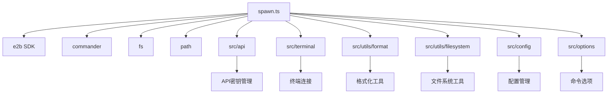
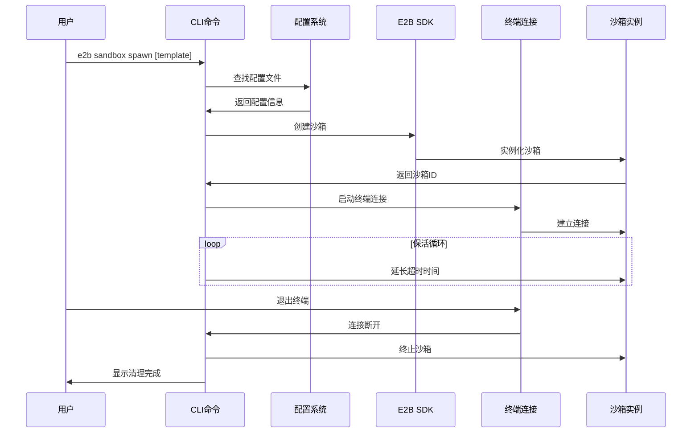
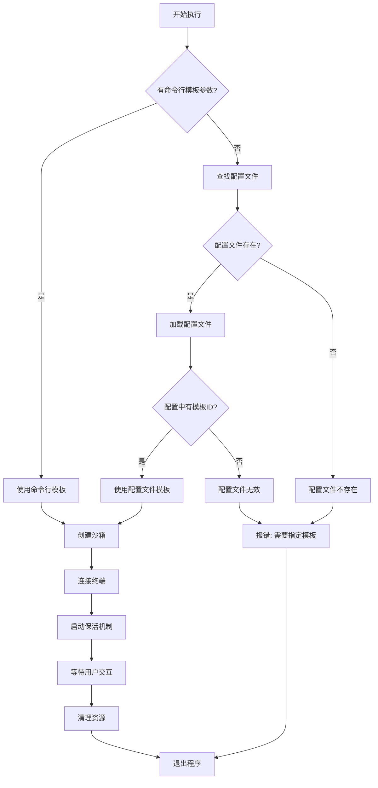
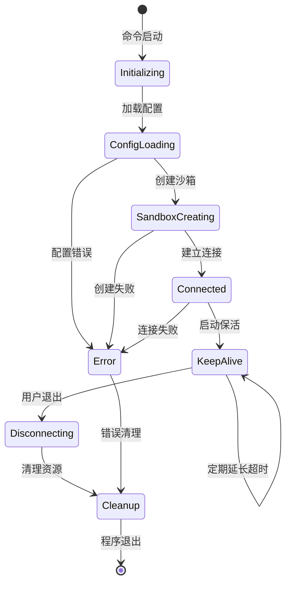
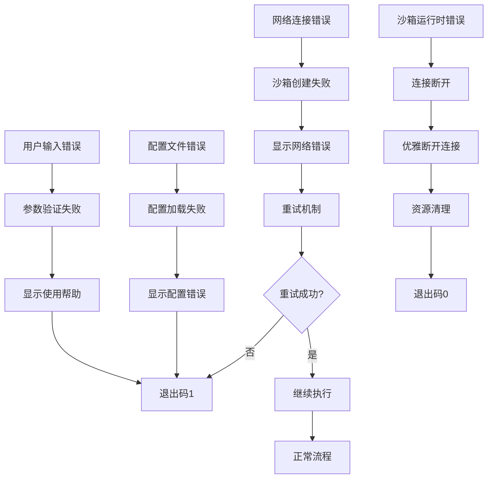

# cli/sandbox/spawn.ts - E2B CLI 沙箱创建命令

> 基于五步显化法的 TypeScript 代码深度解析

---

## 一、定位与使命 (Positioning & Mission)

### 1.1 模块定位

**cli/sandbox/spawn.ts 是 E2B CLI 工具的核心沙箱创建命令实现，为开发者提供便捷的沙箱启动和终端连接功能，支持模板配置自动发现和交互式开发体验。**

### 1.2 核心问题

此文件旨在解决以下关键问题：

1. **快速沙箱启动和连接**
   - 一键创建和连接沙箱环境
   - 自动配置终端交互界面
   - 提供持续的沙箱生命周期管理

2. **智能模板配置发现**
   - 自动检测项目根目录配置文件
   - 支持显式模板指定和配置文件模式
   - 提供友好的模板信息显示

3. **健壮的连接保持机制**
   - 自动延长沙箱存活时间
   - 优雅的资源清理和错误处理
   - 确保终端断开时正确终止沙箱

### 1.3 应用场景

#### 场景一：快速开发环境启动
```bash
# 使用默认配置启动沙箱
e2b sandbox spawn

# 指定特定模板启动
e2b sandbox spawn python3.11

# 使用别名快速启动
e2b sp nodejs18

# 指定配置文件路径
e2b sandbox spawn --config ./custom/e2b.toml
```

#### 场景二：项目开发工作流
```bash
# 在项目根目录，自动发现配置
cd my-python-project
e2b sandbox spawn
# 输出: Found sandbox template python3.11 (my-project) from e2b.toml

# 进入交互式开发环境
# 在沙箱中可以执行：
python main.py
pip install -r requirements.txt
pytest tests/
```

#### 场景三：多环境开发
```bash
# 开发环境
e2b sandbox spawn --config configs/dev.toml

# 测试环境  
e2b sandbox spawn --config configs/test.toml

# 生产环境配置验证
e2b sandbox spawn --config configs/prod.toml
```

#### 场景四：团队协作开发
```bash
# 团队成员使用统一配置
git clone https://github.com/team/project
cd project
e2b sandbox spawn
# 所有成员获得一致的开发环境

# 项目配置示例 (e2b.toml)
template_id = "python3.11"
template_name = "team-python-env"

# 启动后自动获得：
# - 统一的Python版本
# - 预装的项目依赖
# - 配置好的开发工具
```

#### 场景五：教学和演示
```bash
# 讲师准备演示环境
e2b sandbox spawn demo-environment

# 学生跟随练习，获得相同环境
e2b sandbox spawn workshop-python

# 在沙箱中演示代码，实时编辑和运行
# 所有参与者看到一致的输出结果
```

### 1.4 能力边界

**此模块做什么：**
- 创建和连接沙箱环境
- 自动发现和应用模板配置
- 提供交互式终端体验
- 管理沙箱生命周期和资源清理
- 支持灵活的配置文件路径

**此模块不做什么：**
- 不实现沙箱的底层创建逻辑
- 不处理复杂的网络配置
- 不提供沙箱内容的持久化
- 不管理多个并发沙箱实例

---

## 二、设计思想与哲学基石 (Design Philosophy & Foundational Principles)

### 2.1 命令式接口设计

```typescript
export const spawnCommand = new commander.Command('spawn')
  .description('spawn sandbox and connect terminal to it')
  .argument('[template]', 'spawn and connect to sandbox specified by [template]')
  .addOption(pathOption)
  .addOption(configOption)
  .alias('sp')
```

使用 Commander.js 构建直观的命令行接口。

### 2.2 配置优先级策略

```typescript
// 1. 命令行参数优先
let templateID = template

// 2. 配置文件作为后备
if (!templateID && config) {
  templateID = config.template_id
}

// 3. 必须提供其中一种配置
if (!templateID) {
  console.error('You need to specify sandbox template ID or path to sandbox template config')
  process.exit(1)
}
```

明确的配置优先级：命令行 > 配置文件 > 错误退出。

### 2.3 资源生命周期管理

```typescript
// 创建资源
const sandbox = await e2b.Sandbox.create(template.templateID, { apiKey })

// 保持活跃
const intervalId = setInterval(async () => {
  await sandbox.setTimeout(30_000)
}, 5_000)

try {
  // 使用资源
  await spawnConnectedTerminal(sandbox)
} finally {
  // 确保清理
  clearInterval(intervalId)
  await sandbox.kill()
}
```

使用 try-finally 确保资源的正确清理。

### 2.4 用户体验友好的反馈

```typescript
console.log(
  `Found sandbox template ${asFormattedSandboxTemplate(
    { templateID: config.template_id, aliases: config.template_name ? [config.template_name] : undefined },
    relativeConfigPath,
  )}`,
)

console.log(
  `Terminal connecting to template ${asFormattedSandboxTemplate(template)} with sandbox ID ${asBold(`${sandbox.sandboxId}`)}`,
)
```

提供丰富的视觉反馈和状态信息。

---

## 三、核心数据结构定义 (Core Data Structure Definitions)

### 3.1 命令选项接口

```typescript
interface SpawnCommandOptions {
  name?: string      // 沙箱名称（预留）
  path?: string      // 项目路径
  config?: string    // 配置文件路径
}
```

### 3.2 模板标识结构

```typescript
interface TemplateIdentifier {
  templateID: string           // 模板ID
  aliases?: string[]          // 模板别名
}
```

### 3.3 沙箱连接配置

```typescript
interface SandboxConnectionConfig {
  apiKey: string                                                    // API密钥
  template: Pick<e2b.components['schemas']['Template'], 'templateID'>  // 模板信息
}
```

### 3.4 配置文件结构

```typescript
interface E2BConfig {
  template_id: string         // 模板ID
  template_name?: string      // 模板名称
  [key: string]: any         // 其他配置项
}
```

### 3.5 生命周期管理状态

```typescript
interface SandboxLifecycle {
  sandbox: e2b.Sandbox       // 沙箱实例
  intervalId: NodeJS.Timeout // 保活定时器
  isConnected: boolean       // 连接状态
  cleanupHandlers: (() => Promise<void>)[]  // 清理函数列表
}
```

---

## 四、核心接口与逻辑实现 (Core Interface & Logic)

### 4.1 主命令处理逻辑

```typescript
.action(async (
  template: string | undefined,
  opts: SpawnCommandOptions,
) => {
  try {
    // 1. 确保API密钥可用
    const apiKey = ensureAPIKey()
    
    // 2. 解析模板标识
    let templateID = template
    
    // 3. 处理配置文件
    const root = getRoot(opts.path)
    const configPath = getConfigPath(root, opts.config)
    
    const config = fs.existsSync(configPath)
      ? await loadConfig(configPath)
      : undefined
    
    // 4. 应用配置文件模板
    if (!templateID && config) {
      console.log(`Found sandbox template ${asFormattedSandboxTemplate(...)}`)
      templateID = config.template_id
    }
    
    // 5. 验证模板配置
    if (!templateID) {
      console.error('You need to specify sandbox template ID or path to sandbox template config')
      process.exit(1)
    }
    
    // 6. 连接沙箱
    await connectSandbox({ apiKey, template: { templateID } })
    process.exit(0)
  } catch (err: any) {
    console.error(err)
    process.exit(1)
  }
})
```

### 4.2 沙箱连接核心逻辑

```typescript
export async function connectSandbox({
  apiKey,
  template,
}: SandboxConnectionConfig) {
  // 1. 创建沙箱实例
  const sandbox = await e2b.Sandbox.create(template.templateID, { apiKey })
  
  // 2. 设置保活机制
  const intervalId = setInterval(async () => {
    await sandbox.setTimeout(30_000)  // 30秒超时延长
  }, 5_000)  // 每5秒执行一次
  
  // 3. 显示连接信息
  console.log(
    `Terminal connecting to template ${asFormattedSandboxTemplate(template)} ` +
    `with sandbox ID ${asBold(`${sandbox.sandboxId}`)}`
  )
  
  try {
    // 4. 启动终端连接
    await spawnConnectedTerminal(sandbox)
  } finally {
    // 5. 清理资源
    clearInterval(intervalId)
    await sandbox.kill()
    
    console.log(
      `Closing terminal connection to template ${asFormattedSandboxTemplate(template)} ` +
      `with sandbox ID ${asBold(`${sandbox.sandboxId}`)}`
    )
  }
}
```

### 4.3 配置发现和加载逻辑

```typescript
async function discoverAndLoadConfig(
  basePath: string | undefined,
  configPath: string | undefined
): Promise<{ config?: E2BConfig; configPath: string; relativeConfigPath: string }> {
  // 确定项目根路径
  const root = getRoot(basePath)
  
  // 确定配置文件路径
  const resolvedConfigPath = getConfigPath(root, configPath)
  
  // 尝试加载配置
  const config = fs.existsSync(resolvedConfigPath)
    ? await loadConfig(resolvedConfigPath)
    : undefined
  
  // 计算相对路径用于显示
  const relativeConfigPath = path.relative(root, resolvedConfigPath)
  
  return {
    config,
    configPath: resolvedConfigPath,
    relativeConfigPath
  }
}
```

### 4.4 保活机制实现

```typescript
class SandboxKeepAlive {
  private intervalId?: NodeJS.Timeout
  private readonly sandbox: e2b.Sandbox
  private readonly timeoutDuration: number
  private readonly checkInterval: number
  
  constructor(sandbox: e2b.Sandbox, timeoutDuration = 30_000, checkInterval = 5_000) {
    this.sandbox = sandbox
    this.timeoutDuration = timeoutDuration
    this.checkInterval = checkInterval
  }
  
  start(): void {
    this.intervalId = setInterval(async () => {
      try {
        await this.sandbox.setTimeout(this.timeoutDuration)
      } catch (error) {
        console.warn('Failed to extend sandbox timeout:', error)
      }
    }, this.checkInterval)
  }
  
  stop(): void {
    if (this.intervalId) {
      clearInterval(this.intervalId)
      this.intervalId = undefined
    }
  }
}
```

### 4.5 错误处理和恢复

```typescript
async function robustConnectSandbox(config: SandboxConnectionConfig): Promise<void> {
  let sandbox: e2b.Sandbox | undefined
  let keepAlive: SandboxKeepAlive | undefined
  
  try {
    // 创建沙箱（带重试）
    sandbox = await createSandboxWithRetry(config.template.templateID, { apiKey: config.apiKey })
    
    // 启动保活机制
    keepAlive = new SandboxKeepAlive(sandbox)
    keepAlive.start()
    
    console.log(`Terminal connecting to sandbox ID ${asBold(sandbox.sandboxId)}`)
    
    // 连接终端
    await spawnConnectedTerminal(sandbox)
    
  } catch (error) {
    console.error('Failed to connect to sandbox:', error)
    throw error
  } finally {
    // 确保资源清理
    if (keepAlive) {
      keepAlive.stop()
    }
    
    if (sandbox) {
      try {
        await sandbox.kill()
        console.log(`Closed sandbox ID ${asBold(sandbox.sandboxId)}`)
      } catch (killError) {
        console.warn('Failed to kill sandbox:', killError)
      }
    }
  }
}

async function createSandboxWithRetry(
  templateID: string, 
  options: any, 
  maxRetries = 3
): Promise<e2b.Sandbox> {
  let lastError: any
  
  for (let attempt = 1; attempt <= maxRetries; attempt++) {
    try {
      return await e2b.Sandbox.create(templateID, options)
    } catch (error) {
      lastError = error
      console.warn(`Sandbox creation attempt ${attempt} failed:`, error)
      
      if (attempt < maxRetries) {
        const delay = Math.min(1000 * Math.pow(2, attempt - 1), 5000)
        console.log(`Retrying in ${delay}ms...`)
        await new Promise(resolve => setTimeout(resolve, delay))
      }
    }
  }
  
  throw lastError
}
```

### 4.6 用户交互和反馈

```typescript
class UserFeedback {
  static showTemplateDiscovery(templateInfo: TemplateIdentifier, configPath: string): void {
    console.log(
      `Found sandbox template ${asFormattedSandboxTemplate(templateInfo, configPath)}`
    )
  }
  
  static showConnectionStart(templateInfo: TemplateIdentifier, sandboxId: string): void {
    console.log(
      `Terminal connecting to template ${asFormattedSandboxTemplate(templateInfo)} ` +
      `with sandbox ID ${asBold(sandboxId)}`
    )
  }
  
  static showConnectionEnd(templateInfo: TemplateIdentifier, sandboxId: string): void {
    console.log(
      `Closing terminal connection to template ${asFormattedSandboxTemplate(templateInfo)} ` +
      `with sandbox ID ${asBold(sandboxId)}`
    )
  }
  
  static showError(message: string, error?: any): void {
    console.error(message)
    if (error && process.env.DEBUG) {
      console.error('Detailed error:', error)
    }
  }
  
  static showProgress(message: string): void {
    if (process.stdout.isTTY) {
      process.stdout.write(`\r${message}`)
    } else {
      console.log(message)
    }
  }
}
```

---

## 五、依赖关系与交互 (Dependencies & Interactions)

### 5.1 模块依赖图



### 5.2 命令执行流程



### 5.3 配置优先级和发现流程



### 5.4 资源生命周期管理



### 5.5 与其他CLI命令的关系

| 命令关系 | spawn | connect | list | kill |
|---------|-------|---------|------|------|
| **功能重叠** | 创建+连接 | 仅连接 | 查看状态 | 仅终止 |
| **共享代码** | ✓ 终端连接 | ✓ 终端连接 | ✗ | ✗ |
| **配置依赖** | ✓ 模板配置 | ✗ | ✗ | ✗ |
| **资源管理** | 完整生命周期 | 连接管理 | 只读查询 | 销毁操作 |

### 5.6 外部服务集成

```typescript
// E2B API集成
interface E2BAPIIntegration {
  createSandbox(templateID: string, options: any): Promise<e2b.Sandbox>
  killSandbox(sandboxId: string): Promise<void>
  setTimeout(sandboxId: string, timeout: number): Promise<void>
}

// 终端服务集成
interface TerminalServiceIntegration {
  spawnConnectedTerminal(sandbox: e2b.Sandbox): Promise<void>
  handleTerminalResize(width: number, height: number): void
  handleTerminalExit(): void
}

// 文件系统集成
interface FilesystemIntegration {
  getRoot(path?: string): string
  getConfigPath(root: string, config?: string): string
  loadConfig(configPath: string): Promise<E2BConfig>
}
```

### 5.7 错误传播和处理



### 5.8 扩展和集成点

```typescript
// 插件扩展接口
interface SpawnCommandPlugin {
  name: string
  beforeSandboxCreate?(config: SandboxConnectionConfig): Promise<void>
  afterSandboxCreate?(sandbox: e2b.Sandbox): Promise<void>
  beforeTerminalConnect?(sandbox: e2b.Sandbox): Promise<void>
  afterTerminalDisconnect?(sandbox: e2b.Sandbox): Promise<void>
}

// 配置扩展
interface ExtendedE2BConfig extends E2BConfig {
  startup_commands?: string[]        // 启动时执行的命令
  environment_variables?: Record<string, string>  // 环境变量
  port_forwarding?: Array<{         // 端口转发配置
    local_port: number
    remote_port: number
  }>
  plugins?: string[]                // 启用的插件列表
}

// 中间件系统
class SpawnMiddleware {
  private middlewares: Array<(context: SpawnContext, next: () => Promise<void>) => Promise<void>> = []
  
  use(middleware: (context: SpawnContext, next: () => Promise<void>) => Promise<void>): void {
    this.middlewares.push(middleware)
  }
  
  async execute(context: SpawnContext): Promise<void> {
    let index = 0
    
    const next = async (): Promise<void> => {
      if (index < this.middlewares.length) {
        const middleware = this.middlewares[index++]
        await middleware(context, next)
      }
    }
    
    await next()
  }
}

interface SpawnContext {
  template: string
  options: SpawnCommandOptions
  sandbox?: e2b.Sandbox
  config?: E2BConfig
}
```

---

## 总结

cli/sandbox/spawn.ts 作为 E2B CLI 工具的核心沙箱启动命令，通过智能的配置发现、健壮的资源管理和用户友好的交互设计，为开发者提供了一键式的沙箱开发环境体验。它不仅简化了沙箱的创建和连接流程，还通过自动化的保活机制和优雅的资源清理，确保了开发过程的稳定性和可靠性，是 E2B 开发者工作流中不可或缺的重要工具。