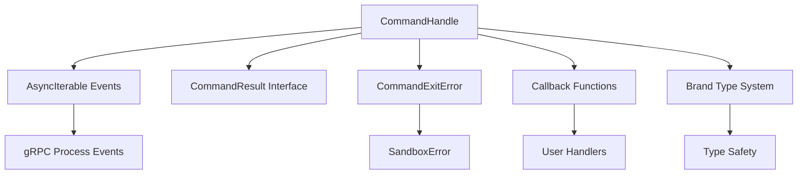
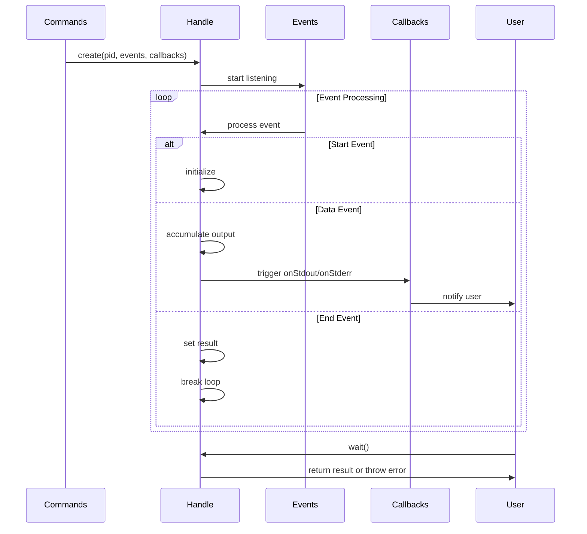

# commandHandle.ts - E2B 命令句柄管理模块

> 基于五步显化法的 TypeScript 代码深度解析

---

## 一、定位与使命 (Positioning & Mission)

### 1.1 模块定位

**commandHandle.ts 是 E2B JavaScript SDK 中的命令句柄管理核心模块，为运行中的进程提供完整的生命周期管理和实时交互能力。**

### 1.2 核心问题

此文件旨在解决以下关键问题：

1. **进程句柄抽象**
   - 为运行中的进程提供统一的操作接口
   - 管理进程的状态、输出和生命周期
   - 提供异步等待和实时监控能力

2. **实时数据流处理**
   - 实时捕获和缓存进程的 stdout/stderr 输出
   - 支持流式数据处理和回调通知
   - 处理 PTY（伪终端）输出数据

3. **错误处理和异常管理**
   - 统一的命令执行结果表示
   - 自定义异常类型用于错误传播
   - 进程异常退出的优雅处理

### 1.3 应用场景

#### 场景一：长时运行进程管理
```typescript
// 启动后台服务
const handle = await sandbox.commands.run('python', ['server.py'], {
  background: true,
  onStdout: (data) => console.log('Server output:', data),
  onStderr: (data) => console.error('Server error:', data)
})

// 检查进程状态
console.log('Process PID:', handle.pid)
console.log('Current stdout:', handle.stdout)

// 等待进程完成
try {
  const result = await handle.wait()
  console.log('Process completed:', result)
} catch (error) {
  if (error instanceof CommandExitError) {
    console.log('Process failed with exit code:', error.exitCode)
  }
}
```

#### 场景二：交互式进程控制
```typescript
// 启动交互式 Python 解释器
const pythonHandle = await sandbox.commands.run('python', ['-i'], {
  background: true,
  onStdout: (output) => {
    // 处理 Python 输出
    if (output.includes('>>>')) {
      console.log('Python ready for input')
    }
  }
})

// 发送命令并监控输出
await sandbox.commands.sendStdin(pythonHandle.pid, 'print("Hello")\n')

// 手动终止进程
await pythonHandle.kill()
```

#### 场景三：错误处理和调试
```typescript
try {
  const result = await sandbox.commands.run('failing-command')
} catch (error) {
  if (error instanceof CommandExitError) {
    console.error('Command failed:')
    console.error('Exit code:', error.exitCode)
    console.error('Error message:', error.error)
    console.error('Stdout output:', error.stdout)
    console.error('Stderr output:', error.stderr)
  }
}
```

### 1.4 能力边界

**此模块做什么：**
- 提供进程句柄的完整抽象
- 管理进程输出的实时捕获和缓存
- 实现异步等待和生命周期控制
- 提供统一的错误处理机制

**此模块不做什么：**
- 不直接创建或启动进程
- 不处理进程间通信（交由上层模块）
- 不管理多个进程的协调
- 不提供进程资源监控功能

---

## 二、设计思想与哲学基石 (Design Philosophy & Foundational Principles)

### 2.1 类型安全的品牌类型系统

```typescript
// 使用品牌类型确保输出类型安全
declare const __brand: unique symbol
type Brand<B> = { [__brand]: B }
export type Branded<T, B> = T & Brand<B>

export type Stdout = Branded<string, 'stdout'>    // 标准输出品牌类型
export type Stderr = Branded<string, 'stderr'>    // 标准错误品牌类型
export type PtyOutput = Branded<Uint8Array, 'pty'> // PTY输出品牌类型
```

通过品牌类型系统确保不同输出流的类型安全。

### 2.2 统一的结果表示

```typescript
// 命令执行结果的标准接口
export interface CommandResult {
  exitCode: number    // 退出码
  error?: string      // 错误信息
  stdout: string      // 标准输出
  stderr: string      // 标准错误
}
```

提供一致的命令执行结果表示，简化错误处理。

### 2.3 异常即数据的错误处理

```typescript
// 命令退出错误类实现了 CommandResult 接口
export class CommandExitError extends SandboxError implements CommandResult {
  constructor(private readonly result: CommandResult) {
    super(result.error)
    this.name = 'CommandExitError'
  }
  
  // 直接提供结果数据的访问器
  get exitCode() { return this.result.exitCode }
  get stdout() { return this.result.stdout }
  get stderr() { return this.result.stderr }
}
```

错误对象本身包含完整的执行结果数据。

### 2.4 事件驱动的实时处理

```typescript
// 基于异步迭代器的事件处理
constructor(
  readonly pid: number,
  private readonly events: AsyncIterable<ConnectResponse | StartResponse>,
  private readonly onStdout?: (stdout: string) => void | Promise<void>,
  private readonly onStderr?: (stderr: string) => void | Promise<void>
) {
  this._wait = this.handleEvents()  // 立即开始事件处理
}
```

通过异步迭代器实现事件驱动的实时数据处理。

---

## 三、核心数据结构定义 (Core Data Structure Definitions)

### 3.1 品牌类型定义

```typescript
// 品牌类型系统的基础设施
declare const __brand: unique symbol
type Brand<B> = { [__brand]: B }
export type Branded<T, B> = T & Brand<B>

// 具体的品牌类型
export type Stdout = Branded<string, 'stdout'>        // 标准输出
export type Stderr = Branded<string, 'stderr'>        // 标准错误  
export type PtyOutput = Branded<Uint8Array, 'pty'>    // PTY输出
```

### 3.2 命令结果接口

```typescript
// 命令执行结果的完整定义
export interface CommandResult {
  exitCode: number      // 进程退出码（0表示成功）
  error?: string        // 可选的错误信息
  stdout: string        // 标准输出内容
  stderr: string        // 标准错误内容
}
```

### 3.3 异常类定义

```typescript
// 命令退出异常类
export class CommandExitError extends SandboxError implements CommandResult {
  constructor(private readonly result: CommandResult) {
    super(result.error)
    this.name = 'CommandExitError'
  }
  
  // 实现 CommandResult 接口
  get exitCode(): number { return this.result.exitCode }
  get error(): string | undefined { return this.result.error }
  get stdout(): string { return this.result.stdout }
  get stderr(): string { return this.result.stderr }
}
```

### 3.4 命令句柄类结构

```typescript
export class CommandHandle implements
  Omit<CommandResult, 'exitCode' | 'error'>,           // 实现部分结果接口
  Partial<Pick<CommandResult, 'exitCode' | 'error'>>   // 部分实现退出信息
{
  // 输出缓存
  private _stdout = ''
  private _stderr = ''
  
  // 执行状态
  private result?: CommandResult
  private iterationError?: Error
  
  // 异步等待 Promise
  private readonly _wait: Promise<void>
  
  // 进程标识
  readonly pid: number
}
```

---

## 四、核心接口与逻辑实现 (Core Interface & Logic)

### 4.1 构造函数和初始化

```typescript
constructor(
  readonly pid: number,                                    // 进程ID
  private readonly handleDisconnect: () => void,          // 断开连接回调
  private readonly handleKill: () => Promise<boolean>,    // 杀死进程回调
  private readonly events: AsyncIterable<ConnectResponse | StartResponse>, // 事件流
  private readonly onStdout?: (stdout: string) => void | Promise<void>,    // 输出回调
  private readonly onStderr?: (stderr: string) => void | Promise<void>,    // 错误回调
  private readonly onPty?: (pty: Uint8Array) => void | Promise<void>       // PTY回调
) {
  this._wait = this.handleEvents()  // 立即开始处理事件流
}
```

构造函数通过依赖注入接收所有必要的回调和数据流。

### 4.2 属性访问器实现

```typescript
// 动态属性访问器
get exitCode(): number | undefined {
  return this.result?.exitCode  // 进程未结束时返回 undefined
}

get error(): string | undefined {
  return this.result?.error
}

get stdout(): string {
  return this._stdout  // 返回当前累积的输出
}

get stderr(): string {
  return this._stderr  // 返回当前累积的错误输出
}
```

提供对进程状态和输出的实时访问。

### 4.3 异步等待实现

```typescript
// 等待进程完成
async wait(): Promise<CommandResult> {
  await this._wait  // 等待事件处理完成
  
  if (this.iterationError) {
    throw this.iterationError  // 抛出迭代过程中的错误
  }
  
  if (!this.result) {
    throw new SandboxError('Command did not finish properly')
  }
  
  // 检查退出码，非零退出码抛出异常
  if (this.result.exitCode !== 0) {
    throw new CommandExitError(this.result)
  }
  
  return this.result
}
```

### 4.4 生命周期控制

```typescript
// 断开连接
async disconnect(): Promise<void> {
  this.handleDisconnect()  // 调用断开回调
  await this._wait          // 等待事件处理完成
  
  if (this.iterationError) {
    throw this.iterationError
  }
}

// 终止进程
async kill(): Promise<void> {
  const killed = await this.handleKill()  // 调用杀死回调
  
  if (!killed) {
    throw new SandboxError(`Failed to kill process ${this.pid}`)
  }
  
  await this._wait  // 等待进程实际终止
  
  if (this.iterationError) {
    throw this.iterationError
  }
}
```

### 4.5 事件处理核心逻辑

```typescript
// 处理进程事件流
private async handleEvents(): Promise<void> {
  try {
    for await (const response of this.events) {
      if (response.event.case === 'start') {
        // 处理进程启动事件
        continue
      }
      
      if (response.event.case === 'data') {
        const dataEvent = response.event.value
        
        // 处理不同类型的输出数据
        if (dataEvent.output.case === 'stdout') {
          const stdout = new TextDecoder().decode(dataEvent.output.value)
          this._stdout += stdout
          await this.onStdout?.(stdout)  // 触发回调
        }
        
        if (dataEvent.output.case === 'stderr') {
          const stderr = new TextDecoder().decode(dataEvent.output.value)
          this._stderr += stderr
          await this.onStderr?.(stderr)  // 触发回调
        }
        
        if (dataEvent.output.case === 'pty') {
          await this.onPty?.(dataEvent.output.value)  // PTY输出回调
        }
      }
      
      if (response.event.case === 'end') {
        // 处理进程结束事件
        const endEvent = response.event.value
        this.result = {
          exitCode: endEvent.exitCode,
          error: endEvent.error,
          stdout: this._stdout,
          stderr: this._stderr,
        }
        break  // 结束事件循环
      }
    }
  } catch (error) {
    this.iterationError = handleRpcError(error)  // 处理RPC错误
  }
}
```

---

## 五、依赖关系与交互 (Dependencies & Interactions)

### 5.1 模块依赖架构



### 5.2 事件处理流程



### 5.3 与其他模块的协作

| 协作对象 | 交互方式 | 用途 |
|---------|---------|------|
| Commands | 工厂创建 | 由 Commands 类创建和管理句柄 |
| gRPC Events | 异步迭代 | 接收进程事件流 |
| User Callbacks | 回调通知 | 实时通知用户输出数据 |
| Error System | 异常处理 | 统一错误处理和传播 |

### 5.4 生命周期管理

```typescript
// 句柄的完整生命周期
class CommandHandle {
  // 1. 创建阶段
  constructor() {
    this._wait = this.handleEvents()  // 立即开始监听
  }
  
  // 2. 运行阶段
  private async handleEvents() {
    // 持续处理事件直到进程结束
  }
  
  // 3. 等待阶段
  async wait() {
    await this._wait  // 等待事件处理完成
    return this.result
  }
  
  // 4. 清理阶段
  async disconnect() {
    this.handleDisconnect()
    await this._wait
  }
}
```

### 5.5 扩展和定制点

1. **自定义输出处理器**
   ```typescript
   // 可以扩展支持更多输出格式
   class EnhancedCommandHandle extends CommandHandle {
     private jsonBuffer = ''
     
     protected async handleJsonOutput(data: string) {
       this.jsonBuffer += data
       if (this.isCompleteJson(this.jsonBuffer)) {
         const parsed = JSON.parse(this.jsonBuffer)
         await this.onJsonData?.(parsed)
         this.jsonBuffer = ''
       }
     }
   }
   ```

2. **进程监控增强**
   ```typescript
   // 可以添加性能监控
   class MonitoredCommandHandle extends CommandHandle {
     private startTime = Date.now()
     
     get runtime(): number {
       return Date.now() - this.startTime
     }
     
     get averageOutputRate(): number {
       return this.stdout.length / (this.runtime / 1000)
     }
   }
   ```

3. **高级错误处理**
   ```typescript
   // 可以扩展错误分类
   class DetailedCommandExitError extends CommandExitError {
     get isTimeout(): boolean {
       return this.error?.includes('timeout') ?? false
     }
     
     get isMemoryError(): boolean {
       return this.stderr.includes('OutOfMemoryError')
     }
   }
   ```

### 5.6 性能优化策略

```typescript
export class CommandHandle {
  // 输出缓冲区管理
  private static readonly MAX_BUFFER_SIZE = 1024 * 1024  // 1MB
  
  private managedBuffer(newData: string, buffer: string): string {
    const combined = buffer + newData
    
    // 防止内存溢出
    if (combined.length > CommandHandle.MAX_BUFFER_SIZE) {
      return combined.slice(-CommandHandle.MAX_BUFFER_SIZE)
    }
    
    return combined
  }
  
  // 批量处理优化
  private pendingCallbacks: Array<() => Promise<void>> = []
  
  private async flushCallbacks(): Promise<void> {
    const callbacks = this.pendingCallbacks.splice(0)
    await Promise.all(callbacks.map(cb => cb().catch(console.error)))
  }
}
```

---

## 总结

commandHandle.ts 作为 E2B JavaScript SDK 的命令句柄管理核心模块，通过精心设计的类型系统和事件处理机制，为运行中的进程提供了完整而高效的管理能力。它不仅实现了实时数据捕获和状态管理，还通过品牌类型系统和统一的错误处理提供了类型安全和可靠的执行环境，是构建复杂进程交互应用的重要基础。