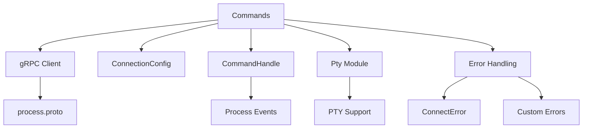
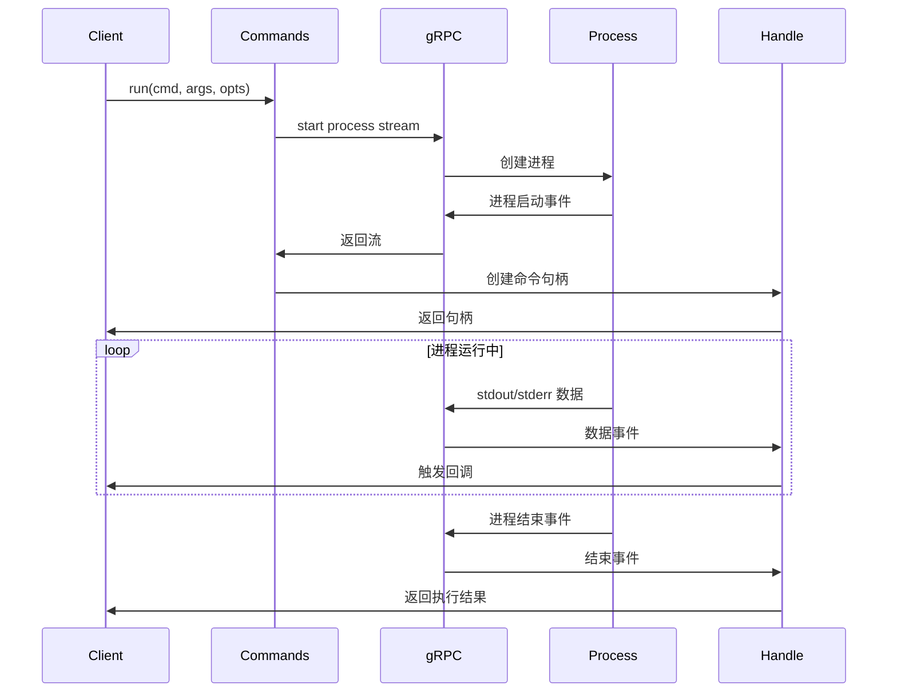

# sandbox/commands/index.ts - E2B 命令执行核心模块

> 基于五步显化法的 TypeScript 代码深度解析

---

## 一、定位与使命 (Positioning & Mission)

### 1.1 模块定位

**sandbox/commands/index.ts 是 E2B JavaScript SDK 中的命令执行核心模块，为沙箱环境提供完整的进程创建、管理和交互能力。**

### 1.2 核心问题

此文件旨在解决以下关键问题：

1. **命令执行和进程管理**
   - 在沙箱中启动新进程执行命令
   - 管理进程的生命周期（启动、连接、终止）
   - 提供进程列表查询和状态监控

2. **实时进程交互**
   - 实时捕获进程的标准输出和错误输出
   - 向进程发送标准输入数据
   - 支持交互式命令和长时运行进程

3. **灵活的执行模式**
   - 同步执行：等待命令完成并返回结果
   - 异步执行：后台运行命令，返回句柄
   - 连接模式：连接到已有进程获取输出

### 1.3 应用场景

#### 场景一：代码执行和构建
```typescript
// 执行 Python 脚本
const result = await sandbox.commands.run('python', ['script.py'], {
  cwd: '/workspace',
  envs: { 'PYTHONPATH': '/app/lib' },
  timeoutMs: 30000
})

console.log('Output:', result.stdout)
console.log('Errors:', result.stderr)
console.log('Exit code:', result.exitCode)
```

#### 场景二：交互式命令处理
```typescript
// 启动交互式进程
const handle = await sandbox.commands.run('python', ['-i'], {
  background: true,
  onStdout: (data) => console.log('Python output:', data),
  onStderr: (data) => console.error('Python error:', data)
})

// 发送命令到 Python 解释器
await sandbox.commands.sendStdin(handle.pid, 'print("Hello from Python")\n')
await sandbox.commands.sendStdin(handle.pid, 'import os\n')
await sandbox.commands.sendStdin(handle.pid, 'print(os.getcwd())\n')
```

#### 场景三：进程管理和监控
```typescript
// 列出所有运行的进程
const processes = await sandbox.commands.list()
for (const proc of processes) {
  console.log(`PID: ${proc.pid}, Command: ${proc.cmd}, Args: ${proc.args.join(' ')}`)
}

// 连接到已有进程
const existingProcess = processes.find(p => p.cmd === 'python')
if (existingProcess) {
  const handle = await sandbox.commands.connect(existingProcess.pid, {
    onStdout: (data) => console.log('Connected output:', data)
  })
}
```

### 1.4 能力边界

**此模块做什么：**
- 提供完整的进程生命周期管理
- 支持同步和异步命令执行
- 实现实时进程输入输出交互
- 管理进程环境变量和工作目录

**此模块不做什么：**
- 不直接处理文件系统操作
- 不提供图形界面程序支持
- 不管理系统级服务
- 不处理进程间通信（IPC）

---

## 二、设计思想与哲学基石 (Design Philosophy & Foundational Principles)

### 2.1 统一的进程抽象

```typescript
// 所有进程操作都基于统一的 ProcessInfo 接口
export interface ProcessInfo {
  pid: number              // 进程标识
  tag?: string            // 可选标签
  cmd: string             // 执行命令
  args: string[]          // 命令参数
  envs: Record<string, string>  // 环境变量
  cwd?: string            // 工作目录
}
```

提供一致的进程信息模型，简化进程管理。

### 2.2 灵活的执行模式

```typescript
// 重载方法支持多种执行方式
async run(cmd: string, args?: string[], opts?: CommandStartOpts): Promise<CommandResult>
async run(cmd: string, opts?: CommandStartOpts): Promise<CommandResult>

// 通过选项控制执行行为
interface CommandStartOpts {
  background?: boolean     // 后台执行
  onStdout?: (data: string) => void   // 实时输出回调
  onStderr?: (data: string) => void   // 实时错误回调
  timeoutMs?: number      // 执行超时
}
```

### 2.3 事件驱动的交互模型

```typescript
// 基于回调的实时数据处理
const handle = await commands.run('long-running-task', {
  background: true,
  onStdout: async (data) => {
    // 实时处理标准输出
    await processOutput(data)
  },
  onStderr: async (data) => {
    // 实时处理错误输出
    await handleError(data)
  }
})
```

支持事件驱动的异步交互模式。

### 2.4 资源管理和清理

```typescript
// 明确的资源生命周期管理
async kill(pid: number, opts?: CommandRequestOpts): Promise<boolean> {
  // 优雅终止进程
  await this.rpc.sendSignal({
    process: { selector: { case: 'pid', value: pid } },
    signal: Signal.SIGTERM
  })
  
  // 强制终止备选方案
  setTimeout(() => {
    this.rpc.sendSignal({
      process: { selector: { case: 'pid', value: pid } },
      signal: Signal.SIGKILL
    })
  }, 5000)
}
```

---

## 三、核心数据结构定义 (Core Data Structure Definitions)

### 3.1 配置接口定义

```typescript
// 基础命令请求选项
export interface CommandRequestOpts 
  extends Partial<Pick<ConnectionOpts, 'requestTimeoutMs'>> {}

// 命令启动选项
export interface CommandStartOpts extends CommandRequestOpts {
  background?: boolean                    // 后台执行标志
  cwd?: string                           // 工作目录
  user?: Username                        // 执行用户
  envs?: Record<string, string>          // 环境变量
  onStdout?: (data: string) => void      // 标准输出回调
  onStderr?: (data: string) => void      // 标准错误回调
  timeoutMs?: number                     // 超时时间
}

// 命令连接选项（复用部分启动选项）
export type CommandConnectOpts = Pick<
  CommandStartOpts,
  'onStderr' | 'onStdout' | 'timeoutMs'
> & CommandRequestOpts
```

### 3.2 进程信息结构

```typescript
// 进程信息完整定义
export interface ProcessInfo {
  pid: number                           // 进程ID
  tag?: string                          // 进程标签
  cmd: string                           // 执行命令
  args: string[]                        // 命令参数
  envs: Record<string, string>          // 环境变量映射
  cwd?: string                          // 工作目录
}
```

### 3.3 核心类结构

```typescript
export class Commands {
  // gRPC 客户端
  protected readonly rpc: Client<typeof ProcessService>
  
  // 默认配置
  private readonly defaultProcessConnectionTimeout = 60_000
  
  // 依赖注入
  constructor(
    transport: Transport,
    private readonly connectionConfig: ConnectionConfig
  ) {
    this.rpc = createClient(ProcessService, transport)
  }
}
```

---

## 四、核心接口与逻辑实现 (Core Interface & Logic)

### 4.1 进程列表查询

```typescript
// 获取所有运行中的进程
async list(opts?: CommandRequestOpts): Promise<ProcessInfo[]> {
  try {
    const res = await this.rpc.list(
      {},
      {
        signal: this.connectionConfig.getSignal(opts?.requestTimeoutMs),
      }
    )

    // 转换 gRPC 响应为标准格式
    return res.processes.map((p) => ({
      pid: p.pid,
      ...(p.tag && { tag: p.tag }),           // 可选字段处理
      args: p.config!.args,
      envs: p.config!.envs,
      cmd: p.config!.cmd,
      ...(p.config!.cwd && { cwd: p.config!.cwd }),
    }))
  } catch (err) {
    throw handleRpcError(err)
  }
}
```

### 4.2 进程输入输出管理

```typescript
// 向进程发送标准输入
async sendStdin(
  pid: number,
  data: string,
  opts?: CommandRequestOpts
): Promise<void> {
  try {
    await this.rpc.sendInput(
      {
        process: {
          selector: {
            case: 'pid',
            value: pid,
          },
        },
        input: {
          input: {
            case: 'stdin',
            value: new TextEncoder().encode(data),
          },
        },
      },
      {
        signal: this.connectionConfig.getSignal(opts?.requestTimeoutMs),
        headers: authenticationHeader(this.connectionConfig),
      }
    )
  } catch (err) {
    throw handleRpcError(err)
  }
}

// 终止进程
async kill(pid: number, opts?: CommandRequestOpts): Promise<boolean> {
  try {
    await this.rpc.sendSignal(
      {
        process: {
          selector: {
            case: 'pid',
            value: pid,
          },
        },
        signal: Signal.SIGTERM,  // 优雅终止
      },
      {
        signal: this.connectionConfig.getSignal(opts?.requestTimeoutMs),
        headers: authenticationHeader(this.connectionConfig),
      }
    )
    return true
  } catch (err) {
    if (err instanceof ConnectError && err.code === Code.NotFound) {
      return false  // 进程不存在
    }
    throw handleRpcError(err)
  }
}
```

### 4.3 进程连接和交互

```typescript
// 连接到已有进程
async connect(
  pid: number,
  opts?: CommandConnectOpts
): Promise<CommandHandle> {
  const signal = this.connectionConfig.getSignal(opts?.requestTimeoutMs)
  
  try {
    // 建立 gRPC 流连接
    const stream = this.rpc.connect(
      {
        process: {
          selector: {
            case: 'pid',
            value: pid,
          },
        },
      },
      {
        signal,
        headers: authenticationHeader(this.connectionConfig),
      }
    )

    // 创建命令句柄
    const handle = new CommandHandle(
      stream,
      this.connectionConfig,
      {
        timeout: opts?.timeoutMs ?? this.defaultProcessConnectionTimeout,
        onStdout: opts?.onStdout,
        onStderr: opts?.onStderr,
      }
    )

    return handle
  } catch (err) {
    throw handleRpcError(err)
  }
}
```

### 4.4 命令执行的重载实现

```typescript
// 支持多种调用方式的命令执行
async run(cmd: string, args?: string[], opts?: CommandStartOpts): Promise<CommandResult>
async run(cmd: string, opts?: CommandStartOpts): Promise<CommandResult>
async run(
  cmd: string,
  argsOrOpts?: string[] | CommandStartOpts,
  opts?: CommandStartOpts
): Promise<CommandResult> {
  // 参数解析逻辑
  let args: string[]
  let options: CommandStartOpts
  
  if (Array.isArray(argsOrOpts)) {
    args = argsOrOpts
    options = opts ?? {}
  } else {
    args = []
    options = argsOrOpts ?? {}
  }
  
  // 启动进程
  const handle = await this.start(cmd, args, options)
  
  // 根据后台标志决定执行方式
  if (options.background) {
    return handle  // 返回句柄，不等待完成
  } else {
    return await handle.wait()  // 等待进程完成
  }
}

// 私有方法：启动进程的核心实现
private async start(
  cmd: string,
  args: string[],
  opts: CommandStartOpts
): Promise<CommandHandle> {
  const signal = this.connectionConfig.getSignal(opts?.requestTimeoutMs)
  
  try {
    // 构建进程配置
    const processConfig = {
      cmd,
      args,
      envs: opts.envs ?? {},
      ...(opts.cwd && { cwd: opts.cwd }),
    }
    
    // 启动进程流
    const stream = this.rpc.start(
      {
        process: processConfig,
        ...(opts.tag && { tag: opts.tag }),
      },
      {
        signal,
        headers: authenticationHeader(this.connectionConfig),
      }
    )
    
    // 创建命令句柄
    const handle = new CommandHandle(
      stream,
      this.connectionConfig,
      {
        timeout: opts?.timeoutMs ?? this.defaultProcessConnectionTimeout,
        onStdout: opts?.onStdout,
        onStderr: opts?.onStderr,
      }
    )
    
    return handle
  } catch (err) {
    throw handleRpcError(err)
  }
}
```

---

## 五、依赖关系与交互 (Dependencies & Interactions)

### 5.1 模块依赖架构



### 5.2 命令执行流程



### 5.3 与其他模块的协作

| 协作对象 | 交互方式 | 用途 |
|---------|---------|------|
| ConnectionConfig | 依赖注入 | 获取连接配置和超时设置 |
| CommandHandle | 组合关系 | 管理进程句柄和生命周期 |
| Pty | 导出子模块 | 支持伪终端功能 |
| gRPC Transport | 流式RPC | 进程控制和数据交换 |
| Error Handlers | 异常转换 | 统一错误处理 |

### 5.4 进程管理策略

```typescript
// 1. 进程标签化管理
const processes = await commands.list()
const taggedProcesses = processes.filter(p => p.tag === 'worker')

// 2. 批量进程操作
async killAll(tag: string): Promise<void> {
  const processes = await this.list()
  const targetProcesses = processes.filter(p => p.tag === tag)
  
  await Promise.all(
    targetProcesses.map(p => this.kill(p.pid))
  )
}

// 3. 进程健康检查
async isProcessAlive(pid: number): Promise<boolean> {
  try {
    const processes = await this.list()
    return processes.some(p => p.pid === pid)
  } catch {
    return false
  }
}
```

### 5.5 扩展和定制点

1. **自定义进程类型**
   ```typescript
   // 可以扩展支持特殊进程类型
   async startService(serviceName: string, opts: ServiceOpts): Promise<ServiceHandle> {
     return this.start(serviceName, [], {
       ...opts,
       tag: `service:${serviceName}`,
       background: true
     })
   }
   ```

2. **进程模板支持**
   ```typescript
   // 可以添加进程模板功能
   async runTemplate(templateName: string, vars: Record<string, string>): Promise<CommandResult> {
     const template = await this.loadTemplate(templateName)
     const cmd = this.renderTemplate(template, vars)
     return this.run(cmd.command, cmd.args, cmd.options)
   }
   ```

3. **进程监控增强**
   ```typescript
   // 可以添加进程资源监控
   async getProcessStats(pid: number): Promise<ProcessStats> {
     // 实现进程统计信息获取
     return {
       cpu: await this.getCpuUsage(pid),
       memory: await this.getMemoryUsage(pid),
       uptime: await this.getUptime(pid)
     }
   }
   ```

### 5.6 性能优化和最佳实践

```typescript
export class Commands {
  // 连接池管理
  private readonly connectionPool = new Map<number, CommandHandle>()
  
  // 批量操作优化
  async runBatch(commands: Array<{cmd: string, args: string[]}>): Promise<CommandResult[]> {
    const handles = await Promise.all(
      commands.map(({cmd, args}) => this.start(cmd, args, { background: true }))
    )
    
    return Promise.all(handles.map(handle => handle.wait()))
  }
  
  // 资源清理
  async cleanup(): Promise<void> {
    for (const handle of this.connectionPool.values()) {
      await handle.kill()
    }
    this.connectionPool.clear()
  }
}
```

---

## 总结

sandbox/commands/index.ts 作为 E2B JavaScript SDK 的命令执行核心模块，通过精心设计的 API 接口和强大的进程管理能力，为沙箱环境提供了完整而高效的命令执行功能。它不仅支持基础的进程操作，还提供了实时交互、灵活的执行模式等高级功能，是构建复杂自动化任务和交互式应用的重要基础。