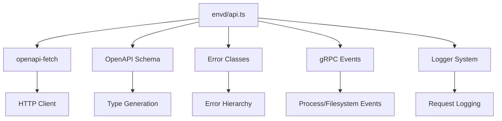
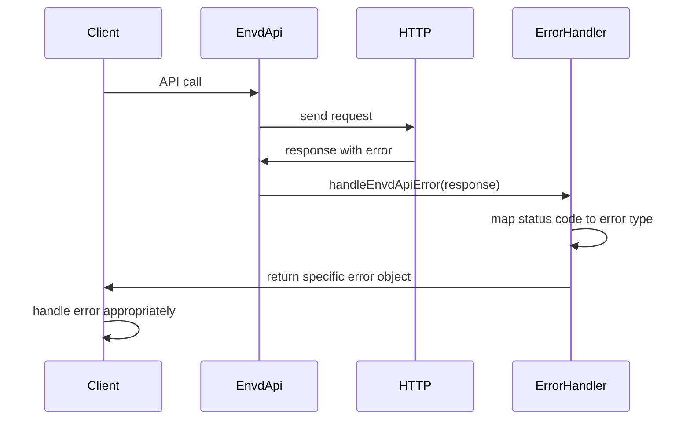

# envd/api.ts - E2B Envd 服务通信模块

> 基于五步显化法的 TypeScript 代码深度解析

---

## 一、定位与使命 (Positioning & Mission)

### 1.1 模块定位

**envd/api.ts 是 E2B JavaScript SDK 中的 Envd 服务通信核心模块，为沙箱内部的 envd 守护进程提供统一的 HTTP API 客户端和错误处理机制。**

### 1.2 核心问题

此文件旨在解决以下关键问题：

1. **HTTP API 客户端封装**
   - 为 envd 服务提供类型安全的 HTTP API 客户端
   - 统一的请求配置和中间件管理
   - 支持自定义 fetch 实现和请求头

2. **统一错误处理机制**
   - 将 HTTP 状态码转换为特定的异常类型
   - 提供一致的错误消息格式和处理
   - 支持不同场景的错误分类和恢复

3. **事件流处理辅助**
   - 处理 gRPC 流事件的启动和初始化
   - 提供进程和文件系统事件的统一处理
   - 简化异步迭代器的错误处理

### 1.3 应用场景

#### 场景一：HTTP API 调用
```typescript
// 创建 API 客户端
const envdClient = new EnvdApiClient({
  apiUrl: 'https://sandbox.example.com',
  accessToken: 'your-token',
  logger: customLogger
}, {
  version: '1.0.0'
})

// 调用健康检查接口
const healthResponse = await envdClient.api.GET('/health')
if (healthResponse.error) {
  const error = await handleEnvdApiError(healthResponse)
  throw error
}
```

#### 场景二：错误处理
```typescript
// 统一错误处理
const response = await envdClient.api.POST('/files', {
  body: formData,
  params: { path: '/workspace/file.txt' }
})

const error = await handleEnvdApiError(response)
if (error) {
  if (error instanceof NotFoundError) {
    console.log('File path not found')
  } else if (error instanceof NotEnoughSpaceError) {
    console.log('Insufficient storage space')
  } else if (error instanceof AuthenticationError) {
    console.log('Invalid credentials')
  }
  throw error
}
```

#### 场景三：事件流处理
```typescript
// 处理进程启动事件
const processStream = rpc.start(processConfig)
const pid = await handleProcessStartEvent(processStream)
console.log('Process started with PID:', pid)

// 处理文件监视事件
const watchStream = rpc.watchDir({ path: '/workspace', recursive: true })
const startEvent = await handleWatchDirStartEvent(watchStream)
console.log('File watching started:', startEvent)
```

### 1.4 能力边界

**此模块做什么：**
- 提供 envd 服务的 HTTP API 客户端封装
- 实现统一的错误处理和类型转换
- 提供事件流初始化的辅助函数
- 支持日志记录和请求中间件

**此模块不做什么：**
- 不直接处理业务逻辑
- 不管理连接池和重试机制
- 不提供缓存功能
- 不处理复杂的认证流程

---

## 二、设计思想与哲学基石 (Design Philosophy & Foundational Principles)

### 2.1 类型安全优先

```typescript
// 使用生成的 OpenAPI 类型
import type { components, paths } from './schema.gen'

class EnvdApiClient {
  readonly api: ReturnType<typeof createClient<paths>>  // 类型安全的 API 客户端
}
```

基于 OpenAPI 规范自动生成类型定义，确保编译时类型安全。

### 2.2 错误即数据的处理哲学

```typescript
// 错误处理函数返回错误对象而非抛出异常
export async function handleEnvdApiError<A, B, C extends `${string}/${string}`>(
  res: FetchResponse<A, B, C>
) {
  if (!res.error) {
    return  // 无错误时返回 undefined
  }
  
  // 根据状态码返回对应的错误对象
  switch (res.response.status) {
    case 400: return new InvalidArgumentError(message)
    case 401: return new AuthenticationError(message)
    case 404: return new NotFoundError(message)
    // ...
  }
}
```

将错误作为返回值而非异常，让调用者显式处理错误。

### 2.3 职责单一原则

```typescript
// 每个函数都有明确的单一职责
export async function handleProcessStartEvent()    // 专门处理进程启动事件
export async function handleWatchDirStartEvent()  // 专门处理文件监视启动事件
export async function handleEnvdApiError()        // 专门处理 HTTP API 错误
```

每个函数职责明确，便于测试和维护。

### 2.4 配置与实现分离

```typescript
class EnvdApiClient {
  constructor(
    config: Pick<ConnectionConfig, 'apiUrl' | 'logger' | 'accessToken'> & {
      fetch?: (request: Request) => ReturnType<typeof fetch>,
      headers?: Record<string, string>
    },
    metadata: { version?: string }
  ) {
    // 配置注入，支持自定义实现
  }
}
```

通过依赖注入支持配置定制和测试替换。

---

## 三、核心数据结构定义 (Core Data Structure Definitions)

### 3.1 API 客户端类结构

```typescript
class EnvdApiClient {
  // 类型安全的 API 客户端实例
  readonly api: ReturnType<typeof createClient<paths>>
  
  // 服务版本信息
  readonly version: string | undefined
  
  constructor(
    config: Pick<ConnectionConfig, 'apiUrl' | 'logger' | 'accessToken'> & {
      fetch?: (request: Request) => ReturnType<typeof fetch>  // 自定义 fetch 实现
      headers?: Record<string, string>                        // 额外请求头
    },
    metadata: {
      version?: string  // 服务版本
    }
  )
}
```

### 3.2 错误处理函数签名

```typescript
// HTTP API 错误处理函数
export async function handleEnvdApiError<A, B, C extends `${string}/${string}`>(
  res: FetchResponse<A, B, C>  // openapi-fetch 响应类型
): Promise<SandboxError | undefined>  // 返回错误对象或 undefined

// 进程事件处理函数
export async function handleProcessStartEvent(
  events: AsyncIterable<StartResponse | ConnectResponse>  // gRPC 事件流
): Promise<number>  // 返回进程 PID

// 文件监视事件处理函数
export async function handleWatchDirStartEvent(
  events: AsyncIterable<WatchDirResponse>  // 文件系统事件流
): Promise<WatchDirResponse['event']['value']>  // 返回启动事件值
```

### 3.3 类型导出

```typescript
// 重新导出 OpenAPI 生成的类型
export type { components, paths }

// 导出客户端类
export { EnvdApiClient }
```

---

## 四、核心接口与逻辑实现 (Core Interface & Logic)

### 4.1 HTTP 错误处理实现

```typescript
export async function handleEnvdApiError<A, B, C extends `${string}/${string>`>(
  res: FetchResponse<A, B, C>
) {
  if (!res.error) {
    return  // 成功响应，无需处理
  }

  // 提取错误消息
  const message: string =
    typeof res.error == 'string'
      ? res.error
      : res.error?.message || (await res.response.text())

  // 根据 HTTP 状态码映射到特定错误类型
  switch (res.response.status) {
    case 400:
      return new InvalidArgumentError(message)
    case 401:
      return new AuthenticationError(message)
    case 404:
      return new NotFoundError(message)
    case 429:
      return new SandboxError(
        `${res.response.status}: ${message}: The requests are being rate limited.`
      )
    case 502:
      return formatSandboxTimeoutError(message)  // 特殊的超时错误格式化
    case 507:
      return new NotEnoughSpaceError(message)
    default:
      return new SandboxError(`${res.response.status}: ${message}`)
  }
}
```

### 4.2 进程事件启动处理

```typescript
export async function handleProcessStartEvent(
  events: AsyncIterable<StartResponse | ConnectResponse>
) {
  let startEvent: StartResponse | ConnectResponse

  try {
    // 获取事件流的第一个事件
    startEvent = (await events[Symbol.asyncIterator]().next()).value
  } catch (err) {
    // 处理连接错误
    if (err instanceof ConnectError) {
      if (err.code === Code.Unavailable) {
        throw new NotFoundError('Sandbox is probably not running anymore')
      }
    }
    throw err
  }
  
  // 验证事件类型
  if (startEvent.event?.event.case !== 'start') {
    throw new Error('Expected start event')
  }

  // 返回进程 PID
  return startEvent.event.event.value.pid
}
```

### 4.3 文件监视事件启动处理

```typescript
export async function handleWatchDirStartEvent(
  events: AsyncIterable<WatchDirResponse>
) {
  let startEvent: WatchDirResponse

  try {
    // 获取监视流的第一个事件
    startEvent = (await events[Symbol.asyncIterator]().next()).value
  } catch (err) {
    // 处理连接错误
    if (err instanceof ConnectError) {
      if (err.code === Code.Unavailable) {
        throw new NotFoundError('Sandbox is probably not running anymore')
      }
    }
    throw err
  }
  
  // 验证事件类型
  if (startEvent.event?.case !== 'start') {
    throw new Error('Expected start event')
  }

  // 返回启动事件数据
  return startEvent.event.value
}
```

### 4.4 API 客户端初始化

```typescript
class EnvdApiClient {
  constructor(
    config: Pick<ConnectionConfig, 'apiUrl' | 'logger' | 'accessToken'> & {
      fetch?: (request: Request) => ReturnType<typeof fetch>,
      headers?: Record<string, string>
    },
    metadata: { version?: string }
  ) {
    // 创建 openapi-fetch 客户端
    this.api = createClient({
      baseUrl: config.apiUrl,
      fetch: config?.fetch,        // 支持自定义 fetch 实现
      headers: config?.headers,    // 支持额外请求头
      // keepalive: true,          // TODO: 可能添加的配置
    })
    
    this.version = metadata.version

    // 添加日志中间件
    if (config.logger) {
      this.api.use(createApiLogger(config.logger))
    }
  }
}
```

---

## 五、依赖关系与交互 (Dependencies & Interactions)

### 5.1 模块依赖架构



### 5.2 错误处理流程



### 5.3 与其他模块的协作

| 协作对象 | 交互方式 | 用途 |
|---------|---------|------|
| ConnectionConfig | 配置注入 | 获取 API 端点和认证信息 |
| Error Classes | 类型转换 | 将 HTTP 错误转换为业务异常 |
| Logger System | 中间件 | 记录 HTTP 请求和响应 |
| gRPC Events | 事件处理 | 处理流事件的初始化 |
| OpenAPI Schema | 类型生成 | 提供类型安全的 API 接口 |

### 5.4 请求处理模式

```typescript
// 标准的 API 调用模式
async function makeApiCall<T>(
  apiCall: () => Promise<FetchResponse<T>>,
  errorContext?: string
): Promise<T> {
  const response = await apiCall()
  
  const error = await handleEnvdApiError(response)
  if (error) {
    if (errorContext) {
      error.message = `${errorContext}: ${error.message}`
    }
    throw error
  }
  
  return response.data!
}

// 使用示例
const fileData = await makeApiCall(
  () => envdClient.api.GET('/files', { 
    params: { query: { path: '/workspace/file.txt' } }
  }),
  'Failed to read file'
)
```

### 5.5 扩展和定制点

1. **自定义 fetch 实现**
   ```typescript
   // 支持代理、重试等功能的自定义 fetch
   const customFetch = async (request: Request) => {
     const response = await fetch(request)
     
     // 添加重试逻辑
     if (!response.ok && shouldRetry(response.status)) {
       await delay(1000)
       return fetch(request)
     }
     
     return response
   }
   
   const client = new EnvdApiClient({
     apiUrl: 'https://api.example.com',
     fetch: customFetch
   }, {})
   ```

2. **请求中间件扩展**
   ```typescript
   // 添加自定义中间件
   client.api.use({
     async onRequest({ request }) {
       // 添加认证头
       request.headers.set('Authorization', `Bearer ${token}`)
       return request
     },
     
     async onResponse({ response }) {
       // 处理响应
       if (response.status === 401) {
         await refreshToken()
       }
       return response
     }
   })
   ```

3. **错误处理扩展**
   ```typescript
   // 自定义错误处理器
   export async function extendedErrorHandler(res: FetchResponse<any>) {
     const baseError = await handleEnvdApiError(res)
     if (baseError) return baseError
     
     // 处理自定义错误码
     switch (res.response.status) {
       case 418:
         return new TeapotError("I'm a teapot")
       case 999:
         return new CustomError("Custom application error")
     }
   }
   ```

### 5.6 性能优化和最佳实践

```typescript
export class EnvdApiClient {
  // 请求缓存
  private responseCache = new Map<string, { data: any, timestamp: number }>()
  
  // 缓存配置
  private static readonly CACHE_TTL = 5 * 60 * 1000  // 5分钟
  
  async getCached<T>(key: string, fetcher: () => Promise<T>): Promise<T> {
    const cached = this.responseCache.get(key)
    
    if (cached && Date.now() - cached.timestamp < EnvdApiClient.CACHE_TTL) {
      return cached.data
    }
    
    const data = await fetcher()
    this.responseCache.set(key, { data, timestamp: Date.now() })
    
    return data
  }
  
  // 批量请求优化
  async batchRequest<T>(requests: Array<() => Promise<T>>): Promise<T[]> {
    return Promise.all(requests.map(req => req()))
  }
}
```

---

## 总结

envd/api.ts 作为 E2B JavaScript SDK 的 Envd 服务通信核心模块，通过精心设计的错误处理机制和类型安全的 API 客户端，为沙箱内部服务提供了可靠而高效的通信能力。它不仅简化了 HTTP API 的调用，还通过统一的错误处理和事件流辅助函数，为上层模块提供了稳定的基础服务，是整个 SDK 通信架构的重要基石。