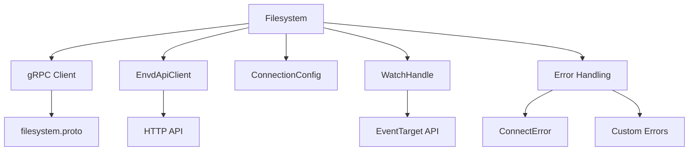
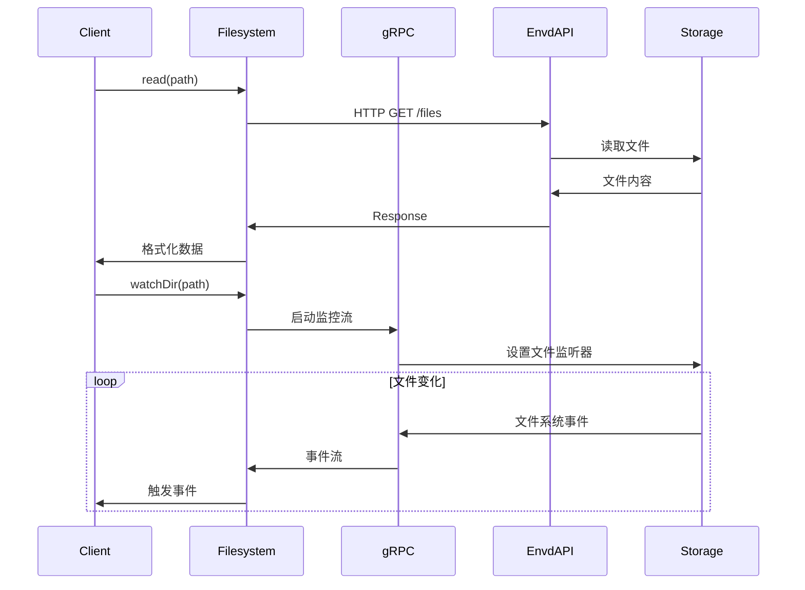

# sandbox/filesystem/index.ts - E2B 文件系统操作模块

> 基于五步显化法的 TypeScript 代码深度解析

---

## 一、定位与使命 (Positioning & Mission)

### 1.1 模块定位

**sandbox/filesystem/index.ts 是 E2B JavaScript SDK 中的文件系统操作核心模块，为沙箱环境提供完整的文件和目录管理能力。**

### 1.2 核心问题

此文件旨在解决以下关键问题：

1. **文件系统基础操作**
   - 文件的读取、写入、创建、删除
   - 目录的创建、列举、重命名、删除
   - 文件系统对象的状态查询和存在性检查

2. **实时文件监控**
   - 目录变化的实时监听
   - 支持递归监控子目录
   - 提供灵活的事件处理机制

3. **多格式数据处理**
   - 支持文本、二进制、Blob、Stream 等多种数据格式
   - 自动进行数据类型转换
   - 优化大文件处理性能

### 1.3 应用场景

#### 场景一：代码文件管理
```typescript
// 创建项目结构
await sandbox.files.makeDir('/workspace/src')
await sandbox.files.write('/workspace/src/main.py', 'print("Hello World")')

// 读取代码文件
const code = await sandbox.files.read('/workspace/src/main.py')
console.log(code) // "print("Hello World")"
```

#### 场景二：实时文件监控
```typescript
// 监控代码变化
const watcher = await sandbox.files.watchDir('/workspace/src', {
  recursive: true,
  onExit: (err) => console.log('Watch stopped:', err)
})

watcher.addEventListener('change', (event) => {
  console.log(`File ${event.name} was ${event.type}`)
})
```

#### 场景三：批量文件操作
```typescript
// 列出所有 Python 文件
const entries = await sandbox.files.list('/workspace', { depth: 3 })
const pythonFiles = entries.filter(entry => 
  entry.type === FileType.FILE && entry.name.endsWith('.py')
)

// 批量处理
for (const file of pythonFiles) {
  const content = await sandbox.files.read(file.path)
  // 处理文件内容...
}
```

### 1.4 能力边界

**此模块做什么：**
- 提供完整的文件系统 CRUD 操作
- 实现实时目录监控功能
- 支持多种数据格式处理
- 处理文件系统权限和用户上下文

**此模块不做什么：**
- 不执行代码或命令
- 不处理网络文件传输
- 不提供文件压缩解压功能
- 不管理文件版本控制

---

## 二、设计思想与哲学基石 (Design Philosophy & Foundational Principles)

### 2.1 类型安全的多态设计

```typescript
// 重载方法支持多种返回类型
async read(path: string, opts?: FilesystemRequestOpts & { format?: 'text' }): Promise<string>
async read(path: string, opts: FilesystemRequestOpts & { format: 'bytes' }): Promise<ArrayBuffer>  
async read(path: string, opts: FilesystemRequestOpts & { format: 'blob' }): Promise<Blob>
async read(path: string, opts: FilesystemRequestOpts & { format: 'stream' }): Promise<ReadableStream>
```

通过 TypeScript 重载实现类型安全的多态性。

### 2.2 统一的错误处理策略

```typescript
// 统一错误处理模式
try {
  const result = await this.rpc.someOperation(request)
  return result
} catch (error) {
  if (error instanceof ConnectError) {
    throw handleRpcError(error)
  }
  throw error
}
```

所有 gRPC 调用都使用一致的错误处理机制。

### 2.3 资源管理和清理

```typescript
export interface WatchOpts extends FilesystemRequestOpts {
  timeoutMs?: number                    // 超时管理
  onExit?: (err?: Error) => void       // 资源清理回调
  recursive?: boolean                   // 递归控制
}
```

提供明确的资源生命周期管理。

### 2.4 向后兼容的版本控制

```typescript
// 版本兼容性检查
private checkRecursiveWatchSupport(recursive: boolean) {
  if (recursive && this.envdVersion) {
    if (compareVersions(this.envdVersion, ENVD_VERSION_RECURSIVE_WATCH) < 0) {
      throw new TemplateError(`Recursive watch requires envd version ${ENVD_VERSION_RECURSIVE_WATCH} or higher`)
    }
  }
}
```

确保新功能的向后兼容性。

---

## 三、核心数据结构定义 (Core Data Structure Definitions)

### 3.1 基础类型定义

```typescript
// 文件系统对象信息
export interface EntryInfo {
  name: string          // 文件/目录名称
  type?: FileType       // 类型：文件或目录
  path: string          // 完整路径
}

// 文件类型枚举
export enum FileType {
  FILE = 'file',        // 文件
  DIR = 'dir',          // 目录
}

// 写入条目类型
export type WriteEntry = {
  path: string
  data: string | ArrayBuffer | Blob | ReadableStream
}
```

### 3.2 操作选项接口

```typescript
// 基础文件系统操作选项
export interface FilesystemRequestOpts 
  extends Partial<Pick<ConnectionOpts, 'requestTimeoutMs'>> {
  user?: Username       // 指定用户上下文
}

// 目录列举选项
export interface FilesystemListOpts extends FilesystemRequestOpts {
  depth?: number        // 遍历深度
}

// 目录监控选项
export interface WatchOpts extends FilesystemRequestOpts {
  timeoutMs?: number              // 监控超时时间
  onExit?: (err?: Error) => void  // 退出回调
  recursive?: boolean             // 是否递归监控
}
```

### 3.3 核心类结构

```typescript
export class Filesystem {
  // gRPC 客户端
  private readonly rpc: Client<typeof FilesystemService>
  
  // 默认配置
  private readonly defaultWatchTimeout = 60_000
  private readonly defaultWatchRecursive = false
  
  // 依赖注入
  constructor(
    transport: Transport,
    private readonly envdApi: EnvdApiClient,
    private readonly connectionConfig: ConnectionConfig
  ) {
    this.rpc = createClient(FilesystemService, transport)
  }
}
```

---

## 四、核心接口与逻辑实现 (Core Interface & Logic)

### 4.1 文件读取操作

```typescript
// 支持多种格式的文件读取
async read(path: string, opts?: FilesystemRequestOpts & { format?: 'text' }): Promise<string>
async read(path: string, opts: FilesystemRequestOpts & { format: 'bytes' }): Promise<ArrayBuffer>
async read(path: string, opts: FilesystemRequestOpts & { format: 'blob' }): Promise<Blob>
async read(path: string, opts: FilesystemRequestOpts & { format: 'stream' }): Promise<ReadableStream>

// 统一实现逻辑
async read(path: string, opts: any = {}): Promise<any> {
  const signal = this.connectionConfig.getSignal(opts?.requestTimeoutMs)
  const username = opts?.user ?? defaultUsername
  
  // 构建请求URL
  const url = new URL('/files', this.envdApi.apiUrl)
  url.searchParams.set('path', path)
  url.searchParams.set('username', username)
  
  // 发送HTTP请求
  const response = await fetch(url.toString(), {
    method: 'GET',
    headers: authenticationHeader(this.connectionConfig),
    signal,
  })
  
  // 根据格式返回不同类型
  switch (opts.format) {
    case 'bytes': return await response.arrayBuffer()
    case 'blob': return await response.blob()
    case 'stream': return response.body!
    default: return await response.text()
  }
}
```

### 4.2 文件写入操作

```typescript
// 多种数据类型的写入支持
async write(
  path: string, 
  data: string | ArrayBuffer | Blob | ReadableStream,
  opts: FilesystemRequestOpts = {}
): Promise<void> {
  const signal = this.connectionConfig.getSignal(opts?.requestTimeoutMs)
  const username = opts?.user ?? defaultUsername
  
  // 构建上传URL
  const url = new URL('/files', this.envdApi.apiUrl)
  url.searchParams.set('path', path)
  url.searchParams.set('username', username)
  
  // 创建FormData
  const formData = new FormData()
  
  // 根据数据类型处理
  if (typeof data === 'string') {
    formData.append('file', new Blob([data], { type: 'text/plain' }))
  } else if (data instanceof ArrayBuffer) {
    formData.append('file', new Blob([data]))
  } else if (data instanceof Blob) {
    formData.append('file', data)
  } else if (data instanceof ReadableStream) {
    formData.append('file', new Blob([await streamToArrayBuffer(data)]))
  }
  
  // 发送POST请求
  const response = await fetch(url.toString(), {
    method: 'POST',
    headers: authenticationHeader(this.connectionConfig),
    body: formData,
    signal,
  })
  
  if (!response.ok) {
    throw new Error(`Failed to write file: ${response.statusText}`)
  }
}
```

### 4.3 目录操作

```typescript
// 列出目录内容
async list(path: string, opts: FilesystemListOpts = {}): Promise<EntryInfo[]> {
  const signal = this.connectionConfig.getSignal(opts?.requestTimeoutMs)
  
  try {
    const response = await this.rpc.listDir(
      {
        path,
        depth: opts.depth ?? 1,
      },
      {
        signal,
        headers: authenticationHeader(this.connectionConfig),
      }
    )
    
    return response.entries.map(entry => ({
      name: entry.name,
      type: entry.type ? mapFileType(entry.type) : undefined,
      path: entry.path,
    }))
  } catch (error) {
    if (error instanceof ConnectError) {
      throw handleRpcError(error)
    }
    throw error
  }
}

// 创建目录
async makeDir(path: string, opts: FilesystemRequestOpts = {}): Promise<boolean> {
  const signal = this.connectionConfig.getSignal(opts?.requestTimeoutMs)
  
  try {
    await this.rpc.makeDir(
      { path },
      {
        signal,
        headers: authenticationHeader(this.connectionConfig),
      }
    )
    return true
  } catch (error) {
    if (error instanceof ConnectError && error.code === Code.AlreadyExists) {
      return false  // 目录已存在
    }
    throw handleRpcError(error)
  }
}
```

### 4.4 实时监控功能

```typescript
// 目录监控实现
async watchDir(
  path: string,
  opts: WatchOpts = {}
): Promise<WatchHandle> {
  const timeoutMs = opts.timeoutMs ?? this.defaultWatchTimeout
  const recursive = opts.recursive ?? this.defaultWatchRecursive
  
  // 版本兼容性检查
  this.checkRecursiveWatchSupport(recursive)
  
  const signal = this.connectionConfig.getSignal(opts?.requestTimeoutMs)
  
  try {
    // 启动监控流
    const stream = this.rpc.watchDir(
      { path, recursive },
      {
        signal,
        headers: authenticationHeader(this.connectionConfig),
      }
    )
    
    // 创建监控句柄
    const watchHandle = new WatchHandle(stream, {
      timeout: timeoutMs,
      onExit: opts.onExit,
    })
    
    return watchHandle
  } catch (error) {
    if (error instanceof ConnectError) {
      throw handleRpcError(error)
    }
    throw error
  }
}
```

---

## 五、依赖关系与交互 (Dependencies & Interactions)

### 5.1 模块依赖架构



### 5.2 数据流转



### 5.3 与其他模块的协作

| 协作对象 | 交互方式 | 用途 |
|---------|---------|------|
| ConnectionConfig | 依赖注入 | 获取连接配置和认证信息 |
| EnvdApiClient | HTTP API | 文件内容的上传下载 |
| gRPC Transport | 流式RPC | 文件系统元数据操作 |
| WatchHandle | 事件流 | 实时文件监控 |
| Error Handlers | 异常转换 | 统一错误处理 |

### 5.4 性能优化策略

```typescript
// 1. 流式处理大文件
async read(path: string, opts: { format: 'stream' }): Promise<ReadableStream> {
  // 返回流而非加载整个文件到内存
  const response = await fetch(url, { method: 'GET' })
  return response.body!
}

// 2. 批量写入优化
async writeMany(entries: WriteEntry[], opts: FilesystemRequestOpts = {}): Promise<void> {
  // 并发写入多个文件
  const promises = entries.map(entry => this.write(entry.path, entry.data, opts))
  await Promise.all(promises)
}

// 3. 智能缓存和去重
private readonly pathCache = new Map<string, EntryInfo>()
```

### 5.5 扩展和定制点

1. **自定义数据格式支持**
   ```typescript
   // 可以扩展支持更多格式
   async read(path: string, opts: { format: 'json' }): Promise<any> {
     const text = await this.read(path, { format: 'text' })
     return JSON.parse(text)
   }
   ```

2. **文件过滤和搜索**
   ```typescript
   // 可以添加高级搜索功能
   async search(pattern: string, opts: SearchOpts): Promise<EntryInfo[]> {
     // 实现文件搜索逻辑
   }
   ```

3. **权限管理增强**
   ```typescript
   // 可以添加更细粒度的权限控制
   async setPermissions(path: string, permissions: FilePermissions): Promise<void> {
     // 实现权限设置
   }
   ```

### 5.6 监控和调试支持

```typescript
// 内置的调试和监控功能
export class Filesystem {
  private readonly logger?: Logger
  
  private logOperation(operation: string, path: string, duration: number) {
    this.logger?.debug(`${operation} ${path} took ${duration}ms`)
  }
  
  async read(path: string, opts: any = {}): Promise<any> {
    const start = Date.now()
    try {
      const result = await this.readInternal(path, opts)
      this.logOperation('READ', path, Date.now() - start)
      return result
    } catch (error) {
      this.logOperation('READ_ERROR', path, Date.now() - start)
      throw error
    }
  }
}
```

---

## 总结

sandbox/filesystem/index.ts 作为 E2B JavaScript SDK 的文件系统核心模块，通过精心设计的 API 接口和强大的功能实现，为沙箱环境提供了完整而高效的文件管理能力。它不仅支持基础的文件操作，还提供了实时监控、多格式处理等高级功能，是构建复杂应用程序的重要基础设施。