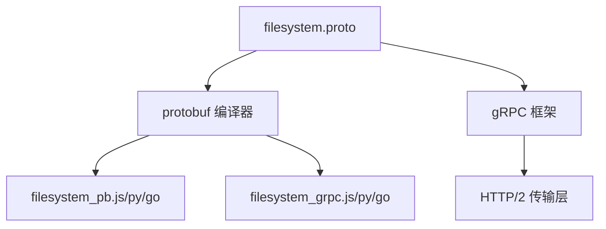
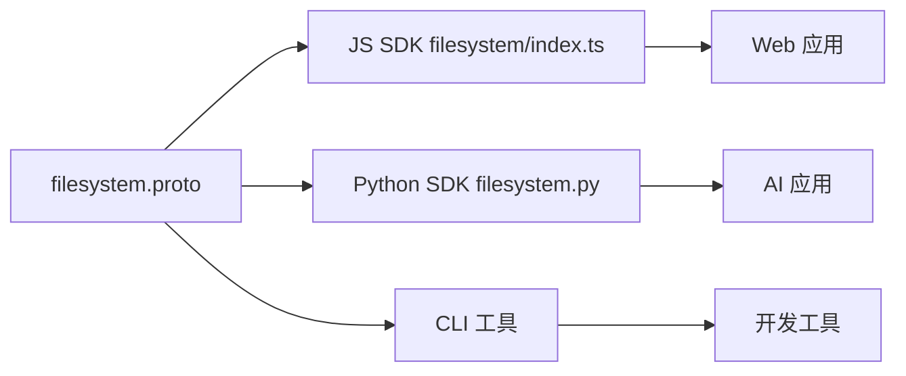

# filesystem.proto - E2B 文件系统接口定义

> 基于五步显化法的 Protocol Buffer 文件深度解析

---

## 一、定位与使命 (Positioning & Mission)

### 1.1 模块定位

**filesystem.proto 是 E2B 沙箱环境中文件系统操作的核心接口定义，通过 gRPC 协议为客户端提供安全、隔离的文件系统访问能力。**

### 1.2 核心问题

此文件旨在解决以下关键问题：

1. **统一文件系统接口**
   - 定义跨语言、跨平台的文件系统操作标准
   - 提供一致的错误处理和响应格式
   - 支持流式和非流式的文件监视操作

2. **安全的文件操作**
   - 所有操作都在沙箱内执行，与宿主系统隔离
   - 通过路径参数控制访问范围
   - 防止越权访问和恶意操作

3. **实时文件监控**
   - 支持目录变化的实时监控
   - 提供流式和轮询两种监控方式
   - 支持递归监控子目录

### 1.3 应用场景

#### 场景一：代码编辑器集成
```protobuf
// 监控项目目录的文件变化
rpc WatchDir(WatchDirRequest) returns (stream WatchDirResponse);

// 使用场景：VS Code 插件监控代码文件变化
WatchDirRequest {
    path: "/workspace/src",
    recursive: true
}
```

#### 场景二：构建系统文件管理
```protobuf
// 创建构建输出目录
rpc MakeDir(MakeDirRequest) returns (MakeDirResponse);

// 移动构建产物
rpc Move(MoveRequest) returns (MoveResponse);
```

#### 场景三：文件系统探索
```protobuf
// 列出目录内容，支持深度遍历
rpc ListDir(ListDirRequest) returns (ListDirResponse);

// 获取文件/目录详细信息
rpc Stat(StatRequest) returns (StatResponse);
```

### 1.4 能力边界

**此模块做什么：**
- 提供基础文件系统操作（创建、移动、删除、查询）
- 支持目录的实时监控和事件通知
- 提供文件类型识别（文件/目录）

**此模块不做什么：**
- 不提供文件内容的读写操作（由 HTTP API 处理）
- 不支持文件权限管理（chmod/chown）
- 不提供文件搜索或内容检索功能
- 不处理符号链接或特殊文件

---

## 二、设计思想与哲学基石 (Design Philosophy & Foundational Principles)

### 2.1 极简主义设计

filesystem.proto 遵循"少即是多"的设计理念：
- 只定义最核心的文件系统操作
- 每个 RPC 方法职责单一、目标明确
- 避免过度设计和功能膨胀

### 2.2 流式与非流式的平衡

```protobuf
// 流式接口 - 适合长连接场景
rpc WatchDir(WatchDirRequest) returns (stream WatchDirResponse);

// 非流式接口 - 适合轮询场景
rpc CreateWatcher(CreateWatcherRequest) returns (CreateWatcherResponse);
rpc GetWatcherEvents(GetWatcherEventsRequest) returns (GetWatcherEventsResponse);
```

这种设计体现了对不同使用场景的深刻理解。

### 2.3 类型安全优先

通过枚举类型确保类型安全：
```protobuf
enum FileType {
    FILE_TYPE_UNSPECIFIED = 0;
    FILE_TYPE_FILE = 1;
    FILE_TYPE_DIRECTORY = 2;
}

enum EventType {
    EVENT_TYPE_UNSPECIFIED = 0;
    EVENT_TYPE_CREATE = 1;
    EVENT_TYPE_WRITE = 2;
    EVENT_TYPE_REMOVE = 3;
    EVENT_TYPE_RENAME = 4;
    EVENT_TYPE_CHMOD = 5;
}
```

---

## 三、核心数据结构定义 (Core Data Structure Definitions)

### 3.1 基础实体定义

```protobuf
// 文件/目录信息的核心数据结构
message EntryInfo {
    string name = 1;      // 文件/目录名称
    FileType type = 2;    // 类型：文件或目录
    string path = 3;      // 完整路径
}

// 文件系统事件
message FilesystemEvent {
    string name = 1;      // 发生变化的文件/目录名
    EventType type = 2;   // 事件类型
}
```

### 3.2 请求响应对

```protobuf
// 创建目录
message MakeDirRequest {
    string path = 1;
}
message MakeDirResponse {
    EntryInfo entry = 1;  // 返回创建的目录信息
}

// 移动/重命名
message MoveRequest {
    string source = 1;      // 源路径
    string destination = 2; // 目标路径
}
message MoveResponse {
    EntryInfo entry = 1;    // 返回移动后的信息
}

// 列出目录内容
message ListDirRequest {
    string path = 1;
    uint32 depth = 2;  // 遍历深度，0表示只列出直接子项
}
message ListDirResponse {
    repeated EntryInfo entries = 1;  // 目录项列表
}
```

### 3.3 监控相关结构

```protobuf
// 流式监控响应
message WatchDirResponse {
    oneof event {
        StartEvent start = 1;         // 监控开始信号
        FilesystemEvent filesystem = 2; // 文件系统事件
        KeepAlive keepalive = 3;      // 保活信号
    }
    
    message StartEvent {}  // 空消息，仅作为信号
    message KeepAlive {}   // 空消息，防止连接超时
}

// 非流式监控
message CreateWatcherRequest {
    string path = 1;
    bool recursive = 2;
}
message CreateWatcherResponse {
    string watcher_id = 1;  // 返回监控器ID，用于后续查询
}
```

---

## 四、核心接口与逻辑实现 (Core Interface & Logic)

### 4.1 服务定义

```protobuf
service Filesystem {
    // 基础文件操作
    rpc Stat(StatRequest) returns (StatResponse);
    rpc MakeDir(MakeDirRequest) returns (MakeDirResponse);
    rpc Move(MoveRequest) returns (MoveResponse);
    rpc ListDir(ListDirRequest) returns (ListDirResponse);
    rpc Remove(RemoveRequest) returns (RemoveResponse);

    // 流式监控
    rpc WatchDir(WatchDirRequest) returns (stream WatchDirResponse);

    // 非流式监控
    rpc CreateWatcher(CreateWatcherRequest) returns (CreateWatcherResponse);
    rpc GetWatcherEvents(GetWatcherEventsRequest) returns (GetWatcherEventsResponse);
    rpc RemoveWatcher(RemoveWatcherRequest) returns (RemoveWatcherResponse);
}
```

### 4.2 接口设计原则

1. **一致性**：所有修改操作都返回修改后的实体信息
2. **原子性**：每个操作都是原子的，要么完全成功，要么完全失败
3. **幂等性**：Remove 等操作设计为幂等，重复调用不会产生副作用
4. **流式优先**：对于需要实时性的操作（如 WatchDir），优先提供流式接口

### 4.3 错误处理设计

虽然 Proto 文件中没有显式定义错误消息，但 gRPC 框架会通过状态码传递错误：
- `NOT_FOUND`: 路径不存在
- `PERMISSION_DENIED`: 权限不足
- `ALREADY_EXISTS`: 目录已存在
- `INVALID_ARGUMENT`: 参数无效

---

## 五、依赖关系与交互 (Dependencies & Interactions)

### 5.1 上游依赖



### 5.2 下游使用者



### 5.3 与其他模块的协作

1. **与 process.proto 的协作**
   - 进程可能创建或修改文件
   - 文件系统变化可能触发进程重启

2. **与 HTTP API 的互补**
   - Proto 定义元数据操作
   - HTTP API 处理文件内容传输

3. **与认证系统的集成**
   - 所有请求都需要通过认证
   - 文件操作受用户权限限制

### 5.4 实现层映射

| Proto 定义 | TypeScript 实现 | Python 实现 | 用途 |
|-----------|----------------|-------------|------|
| Stat | `filesystem.stat()` | `filesystem.stat()` | 获取文件信息 |
| MakeDir | `filesystem.makeDir()` | `filesystem.make_dir()` | 创建目录 |
| Move | `filesystem.move()` | `filesystem.move()` | 移动/重命名 |
| ListDir | `filesystem.list()` | `filesystem.list()` | 列出目录 |
| Remove | `filesystem.remove()` | `filesystem.remove()` | 删除文件/目录 |
| WatchDir | `filesystem.watchDir()` | `filesystem.watch_dir()` | 监控目录变化 |

### 5.5 扩展点

1. **新增文件类型**：可以扩展 FileType 枚举支持链接、设备文件等
2. **新增事件类型**：可以扩展 EventType 支持更多文件系统事件
3. **批量操作**：可以添加批量删除、批量移动等接口
4. **高级查询**：可以添加基于模式匹配的文件搜索接口

---

## 总结

filesystem.proto 作为 E2B 文件系统操作的接口定义，体现了简洁、安全、高效的设计理念。通过 gRPC 和 Protocol Buffers，它为多语言客户端提供了类型安全的文件系统访问能力，是整个 E2B 沙箱系统的重要基石。