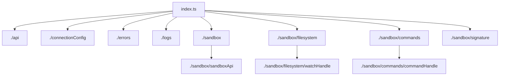
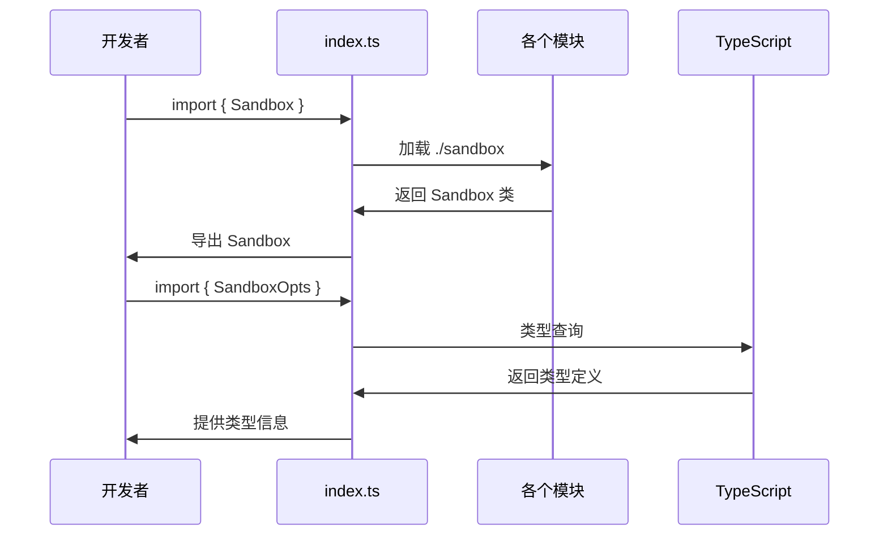

# js-sdk/src/index.ts - E2B JavaScript SDK 主入口

> 基于五步显化法的 TypeScript 代码深度解析

---

## 一、定位与使命 (Positioning & Mission)

### 1.1 模块定位

**js-sdk/src/index.ts 是 E2B JavaScript SDK 的统一导出入口，为开发者提供清晰、结构化的 API 接口，是整个 SDK 的门面模式实现。**

### 1.2 核心问题

此文件旨在解决以下关键问题：

1. **API 统一导出**
   - 将散布在各个模块中的类型和函数统一导出
   - 提供一致的导入体验
   - 避免深层目录导入的复杂性

2. **类型安全暴露**
   - 导出所有必要的 TypeScript 类型定义
   - 确保类型推导的正确性
   - 提供完整的类型支持

3. **向后兼容性**
   - 维护稳定的公共 API 接口
   - 隐藏内部实现细节
   - 支持渐进式升级

### 1.3 应用场景

#### 场景一：基础导入使用
```typescript
// 最常见的使用方式
import { Sandbox } from 'e2b'

const sandbox = await Sandbox.create()
await sandbox.commands.run('python', ['-c', 'print("Hello")'])
```

#### 场景二：类型安全的开发
```typescript
// 导入类型定义进行类型注解
import { Sandbox, SandboxOpts, CommandResult, FileType } from 'e2b'

const createSandbox = async (opts: SandboxOpts): Promise<Sandbox> => {
  return await Sandbox.create(opts)
}

const handleResult = (result: CommandResult): void => {
  console.log(result.stdout)
}
```

#### 场景三：错误处理
```typescript
// 导入自定义错误类型
import { 
  Sandbox, 
  SandboxError, 
  TimeoutError, 
  AuthenticationError 
} from 'e2b'

try {
  const sandbox = await Sandbox.create()
} catch (error) {
  if (error instanceof AuthenticationError) {
    console.error('Authentication failed')
  } else if (error instanceof TimeoutError) {
    console.error('Operation timed out')
  }
}
```

### 1.4 能力边界

**此模块做什么：**
- 统一导出所有公共 API
- 提供完整的类型定义
- 建立清晰的模块边界
- 支持默认导出和命名导出

**此模块不做什么：**
- 不实现具体的业务逻辑
- 不处理模块间的依赖关系
- 不进行运行时初始化
- 不提供配置或状态管理

---

## 二、设计思想与哲学基石 (Design Philosophy & Foundational Principles)

### 2.1 门面模式 (Facade Pattern)

index.ts 完美体现了门面模式的设计理念：

```typescript
// 为复杂子系统提供统一接口
export { Sandbox }           // 核心沙箱类
export { ApiClient }         // API 客户端
export { ConnectionConfig }  // 连接配置
export { /* 错误类型 */ }   // 错误处理
export { /* 文件系统 */ }   // 文件系统类型
export { /* 命令执行 */ }   // 命令执行类型
```

### 2.2 单一责任原则

每个导出都有明确的职责分工：

```typescript
// API 相关
export { ApiClient } from './api'
export type { components, paths } from './api'

// 连接管理
export { ConnectionConfig } from './connectionConfig'
export type { ConnectionOpts, Username } from './connectionConfig'

// 错误处理
export {
  AuthenticationError,
  InvalidArgumentError,
  NotEnoughSpaceError,
  NotFoundError,
  SandboxError,
  TemplateError,
  TimeoutError,
} from './errors'
```

### 2.3 类型优先设计

TypeScript 类型系统的充分利用：

```typescript
// 既导出实现，也导出类型
export { FileType } from './sandbox/filesystem'              // 枚举实现
export type { EntryInfo, Filesystem } from './sandbox/filesystem'  // 类型定义

// 分离实现和接口
export { CommandExitError } from './sandbox/commands/commandHandle'  // 具体类
export type {
  CommandResult,    // 接口类型
  Stdout,          // 类型别名
  Stderr,          // 类型别名
  PtyOutput,       // 类型别名
  CommandHandle,   // 接口类型
} from './sandbox/commands/commandHandle'
```

### 2.4 向后兼容的导出策略

```typescript
// 支持默认导出
export { Sandbox }
import { Sandbox } from './sandbox'
export default Sandbox

// 同时支持命名导出和默认导出
// import Sandbox from 'e2b'          // 默认导出
// import { Sandbox } from 'e2b'      // 命名导出
```

---

## 三、核心数据结构定义 (Core Data Structure Definitions)

### 3.1 导出结构分类

```typescript
// 1. 核心类导出
export { Sandbox }           // 主要的沙箱类
export { ApiClient }         // HTTP API 客户端
export { ConnectionConfig }  // 连接配置管理

// 2. 错误类型导出
export {
  AuthenticationError,       // 认证错误
  InvalidArgumentError,      // 参数错误
  NotEnoughSpaceError,      // 空间不足错误
  NotFoundError,            // 资源不存在错误
  SandboxError,             // 沙箱通用错误
  TemplateError,            // 模板错误
  TimeoutError,             // 超时错误
} from './errors'

// 3. 工具类导出
export { getSignature } from './sandbox/signature'  // 签名生成
export type { Logger } from './logs'                // 日志接口
```

### 3.2 文件系统相关导出

```typescript
// 文件系统枚举和类型
export { FileType } from './sandbox/filesystem'
export type { 
  EntryInfo,        // 文件/目录信息
  Filesystem        // 文件系统接口
} from './sandbox/filesystem'

// 文件系统事件
export { FilesystemEventType } from './sandbox/filesystem/watchHandle'
export type { 
  FilesystemEvent,  // 文件系统事件
  WatchHandle       // 监视句柄
} from './sandbox/filesystem/watchHandle'
```

### 3.3 命令执行相关导出

```typescript
// 命令执行错误
export { CommandExitError } from './sandbox/commands/commandHandle'

// 命令执行类型
export type {
  CommandResult,    // 命令执行结果
  Stdout,          // 标准输出类型
  Stderr,          // 标准错误类型
  PtyOutput,       // PTY 输出类型
  CommandHandle,   // 命令句柄接口
} from './sandbox/commands/commandHandle'

// 命令和 PTY 接口
export type {
  ProcessInfo,         // 进程信息
  CommandRequestOpts,  // 命令请求选项
  CommandConnectOpts,  // 命令连接选项
  CommandStartOpts,    // 命令启动选项
  Commands,           // 命令执行接口
  Pty,               // PTY 接口
} from './sandbox/commands'
```

### 3.4 沙箱配置导出

```typescript
// 沙箱相关类型
export type { SandboxOpts } from './sandbox'           // 沙箱选项
export type { SandboxInfo } from './sandbox/sandboxApi' // 沙箱信息
export type { SandboxApiOpts } from './sandbox/sandboxApi' // API 选项

// 连接相关类型
export type { 
  ConnectionOpts,   // 连接选项
  Username          // 用户名类型
} from './connectionConfig'

// API 相关类型
export type { 
  components,       // OpenAPI 组件类型
  paths            // OpenAPI 路径类型
} from './api'
```

---

## 四、核心接口与逻辑实现 (Core Interface & Logic)

### 4.1 模块导出策略

```typescript
// 导出策略分析
export { Sandbox }        // 具体类 - 运行时需要
export type { SandboxOpts } // 类型定义 - 编译时需要

// 这种区分确保了：
// 1. 运行时包大小最小化
// 2. 编译时类型检查完整
// 3. Tree shaking 优化效果最佳
```

### 4.2 命名空间组织

```typescript
// 按功能域组织导出
// API 层
export { ApiClient } from './api'
export type { components, paths } from './api'

// 连接层  
export { ConnectionConfig } from './connectionConfig'
export type { ConnectionOpts, Username } from './connectionConfig'

// 错误处理层
export { /* 各种错误类 */ } from './errors'

// 功能模块层
export { /* 文件系统相关 */ } from './sandbox/filesystem'
export type { /* 命令执行相关 */ } from './sandbox/commands'
```

### 4.3 版本兼容性维护

```typescript
// 保持向后兼容的导出方式
export { Sandbox }                    // v1.0+ 
export default Sandbox               // v1.0+

// 新增功能的导出
export { getSignature } from './sandbox/signature'  // v2.0+

// 废弃功能的处理
// 通过 @deprecated 注释标记，但仍然导出
/**
 * @deprecated Use Sandbox.create() instead
 */
// export { OldSandboxFactory } from './legacy'
```

### 4.4 类型推导优化

```typescript
// 确保类型推导正确工作
import { Sandbox } from './sandbox'
export { Sandbox }           // 保持类型信息
export default Sandbox       // 默认导出也有完整类型

// 类型复用和重导出
export type { 
  SandboxOpts           // 从 ./sandbox 重导出
} from './sandbox'
export type { 
  SandboxInfo,          // 从 ./sandbox/sandboxApi 重导出
  SandboxApiOpts 
} from './sandbox/sandboxApi'
```

---

## 五、依赖关系与交互 (Dependencies & Interactions)

### 5.1 模块依赖图



### 5.2 导入导出流



### 5.3 运行时和编译时分离

| 导出类型 | 运行时影响 | 编译时作用 | 示例 |
|---------|-----------|-----------|------|
| `export { Class }` | 增加包大小 | 提供类型和实现 | `Sandbox` |
| `export type { Type }` | 无影响 | 仅提供类型 | `SandboxOpts` |
| `export { Enum }` | 增加包大小 | 提供值和类型 | `FileType` |
| `export { function }` | 增加包大小 | 提供实现 | `getSignature` |

### 5.4 用户使用模式

```typescript
// 模式1: 最小导入
import { Sandbox } from 'e2b'
const sandbox = await Sandbox.create()

// 模式2: 类型安全开发
import { Sandbox, SandboxOpts, CommandResult } from 'e2b'
const opts: SandboxOpts = { timeoutMs: 60000 }
const result: CommandResult = await sandbox.commands.run('ls')

// 模式3: 错误处理
import { Sandbox, SandboxError, TimeoutError } from 'e2b'
try {
  await sandbox.commands.run('long-running-command')
} catch (error) {
  if (error instanceof TimeoutError) {
    // 处理超时
  }
}

// 模式4: 默认导入
import Sandbox from 'e2b'  // 等同于 import { Sandbox }
```

### 5.5 构建工具集成

```typescript
// Webpack Tree Shaking
// 只有实际使用的导出会被包含在最终包中
import { Sandbox } from 'e2b'  // 只包含 Sandbox 相关代码

// TypeScript 编译
// 类型导出在编译后被移除
import type { SandboxOpts } from 'e2b'  // 编译后消失

// Rollup 优化
// 未使用的导出会被自动移除
export { Sandbox, ApiClient }  // 如果只用 Sandbox，ApiClient 被移除
```

### 5.6 扩展和维护策略

1. **新功能添加**
   ```typescript
   // 在对应模块中实现新功能
   // 在 index.ts 中添加导出
   export { NewFeature } from './new-module'
   export type { NewFeatureOpts } from './new-module'
   ```

2. **向后兼容性**
   ```typescript
   // 保持现有导出不变
   export { Sandbox }  // 永远不删除
   
   // 新增可选导出
   export { EnhancedSandbox } from './enhanced'  // 新增功能
   ```

3. **废弃处理**
   ```typescript
   /**
    * @deprecated Use NewAPI instead. Will be removed in v3.0
    */
   export { OldAPI } from './legacy'
   ```

---

## 总结

js-sdk/src/index.ts 作为 E2B JavaScript SDK 的统一入口，通过精心设计的导出策略，为开发者提供了清晰、类型安全、易于使用的 API 接口。它不仅简化了 SDK 的使用方式，还确保了良好的开发体验和向后兼容性，是整个 SDK 架构的重要组成部分。