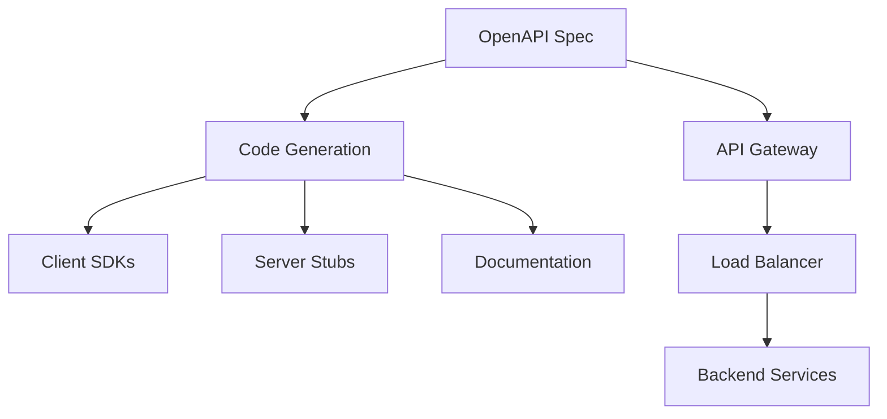
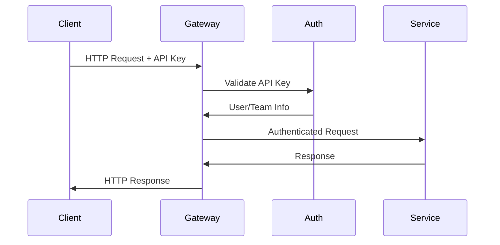

# openapi.yml - E2B REST API 规范定义

> 基于五步显化法的 OpenAPI 规范深度解析

---

## 一、定位与使命 (Positioning & Mission)

### 1.1 模块定位

**openapi.yml 是 E2B 平台的 REST API 完整规范定义，为客户端、服务端和开发工具提供统一的 HTTP API 接口标准。**

### 1.2 核心问题

此文件旨在解决以下关键问题：

1. **API 接口标准化**
   - 定义所有 HTTP 端点的请求响应格式
   - 提供一致的错误处理和状态码规范
   - 确保不同客户端实现的一致性

2. **沙箱生命周期管理**
   - 沙箱的创建、查询、暂停、恢复、销毁
   - 沙箱状态监控和指标收集
   - 超时和刷新机制

3. **认证和授权标准**
   - 多种认证方式支持（API Key、Bearer Token、Supabase）
   - 团队和用户权限管理
   - 安全的访问控制机制

### 1.3 应用场景

#### 场景一：沙箱管理操作
```yaml
# 创建沙箱
POST /sandboxes
Content-Type: application/json
X-API-Key: your-api-key

{
  "templateID": "python",
  "metadata": {"project": "ai-training"},
  "timeoutMs": 600000
}
```

#### 场景二：监控和指标获取
```yaml
# 获取沙箱指标
GET /sandboxes/{sandboxID}/metrics?start=1640995200&end=1640998800
X-API-Key: your-api-key

# 响应包含CPU、内存、网络等详细指标
```

#### 场景三：多租户团队管理
```yaml
# 获取团队列表
GET /teams
X-Supabase-Token: token
X-Supabase-Team: team-id
```

### 1.4 能力边界

**此规范定义什么：**
- 所有 HTTP REST API 端点
- 请求响应的数据模型
- 认证授权机制
- 错误处理标准

**此规范不定义什么：**
- gRPC 接口（由 .proto 文件定义）
- WebSocket 实时通信
- 内部服务间调用
- 数据库模式设计

---

## 二、设计思想与哲学基石 (Design Philosophy & Foundational Principles)

### 2.1 RESTful 设计原则

API 严格遵循 REST 架构风格：

```yaml
# 资源导向的URL设计
/sandboxes              # 沙箱集合
/sandboxes/{id}         # 特定沙箱
/sandboxes/{id}/metrics # 沙箱的子资源
/templates              # 模板集合
/teams                  # 团队集合
```

### 2.2 一致的错误处理

```yaml
components:
  responses:
    "400":  # 客户端错误
      description: Bad request
      content:
        application/json:
          schema:
            $ref: "#/components/schemas/Error"
    "401":  # 认证错误
      description: Authentication error
    "404":  # 资源不存在
      description: Not found
    "500":  # 服务器错误
      description: Server error
```

### 2.3 多层次认证机制

```yaml
components:
  securitySchemes:
    ApiKeyAuth:           # API密钥认证
      type: apiKey
      in: header
      name: X-API-Key
    AccessTokenAuth:      # Bearer Token认证
      type: http
      scheme: bearer
    Supabase1TokenAuth:   # Supabase用户认证
      type: apiKey
      in: header
      name: X-Supabase-Token
    Supabase2TeamAuth:    # Supabase团队认证
      type: apiKey  
      in: header
      name: X-Supabase-Team
```

### 2.4 版本化策略

```yaml
# 同时支持 v1 和 v2 版本
/sandboxes      # v1 API
/v2/sandboxes   # v2 API，向后兼容
```

---

## 三、核心数据结构定义 (Core Data Structure Definitions)

### 3.1 基础实体模型

```yaml
# 沙箱实体
Sandbox:
  required:
    - sandboxID
    - templateID
    - startedAt
  properties:
    sandboxID:
      type: string
      description: 沙箱唯一标识符
    templateID:
      type: string  
      description: 使用的模板ID
    startedAt:
      type: string
      format: date-time
      description: 沙箱启动时间
    endAt:
      type: string
      format: date-time
      description: 沙箱过期时间
    metadata:
      type: object
      description: 自定义元数据

# 团队实体
Team:
  required:
    - teamID
    - name
    - apiKey
  properties:
    teamID:
      type: string
      description: 团队标识符
    name:
      type: string
      description: 团队名称
    apiKey:
      type: string
      description: 团队API密钥
    isDefault:
      type: boolean
      description: 是否为默认团队
```

### 3.2 请求响应模型

```yaml
# 创建沙箱请求
NewSandbox:
  properties:
    templateID:
      type: string
      description: 模板ID或名称
    metadata:
      type: object
      description: 沙箱元数据
    envVars:
      type: object
      description: 环境变量
    timeoutMs:
      type: integer
      description: 超时时间（毫秒）
    
# 沙箱指标
SandboxMetrics:
  properties:
    cpuUsage:
      type: number
      description: CPU使用率百分比
    memoryUsage:
      type: integer
      description: 内存使用量（字节）
    networkIn:
      type: integer  
      description: 网络入流量
    networkOut:
      type: integer
      description: 网络出流量
```

### 3.3 错误处理模型

```yaml
Error:
  required:
    - code
    - message
  properties:
    code:
      type: integer
      description: 错误代码
    message:
      type: string
      description: 错误描述
    details:
      type: object
      description: 错误详细信息
```

---

## 四、核心接口与逻辑实现 (Core Interface & Logic)

### 4.1 沙箱管理接口

```yaml
# 创建沙箱
/sandboxes:
  post:
    description: Create a new sandbox
    security:
      - ApiKeyAuth: []
    requestBody:
      required: true
      content:
        application/json:
          schema:
            $ref: "#/components/schemas/NewSandbox"
    responses:
      "201":
        description: Successfully created sandbox
        content:
          application/json:
            schema:
              $ref: "#/components/schemas/Sandbox"

# 获取沙箱信息
/sandboxes/{sandboxID}:
  get:
    description: Get sandbox by ID
    security:
      - ApiKeyAuth: []
    parameters:
      - $ref: "#/components/parameters/sandboxID"
    responses:
      "200":
        description: Successfully returned sandbox
      "404":
        $ref: "#/components/responses/404"

# 删除沙箱
  delete:
    description: Kill the sandbox
    security:
      - ApiKeyAuth: []
    responses:
      "204":
        description: Successfully killed sandbox
```

### 4.2 生命周期控制接口

```yaml
# 暂停沙箱
/sandboxes/{sandboxID}/pause:
  post:
    description: Pause the sandbox
    security:
      - ApiKeyAuth: []
    responses:
      "204":
        description: Sandbox paused successfully
      "409":
        description: Sandbox cannot be paused

# 恢复沙箱
/sandboxes/{sandboxID}/resume:
  post:
    description: Resume the sandbox
    security:
      - ApiKeyAuth: []
    requestBody:
      required: true
      content:
        application/json:
          schema:
            $ref: "#/components/schemas/ResumedSandbox"
    responses:
      "200":
        description: Sandbox resumed successfully

# 设置超时
/sandboxes/{sandboxID}/timeout:
  post:
    description: Set sandbox timeout
    security:
      - ApiKeyAuth: []
    requestBody:
      content:
        application/json:
          schema:
            type: object
            required:
              - timeout
            properties:
              timeout:
                type: integer
                description: 超时时间（秒）
```

### 4.3 监控和指标接口

```yaml
# 获取沙箱指标
/sandboxes/{sandboxID}/metrics:
  get:
    description: Get sandbox metrics
    security:
      - ApiKeyAuth: []
    parameters:
      - $ref: "#/components/parameters/sandboxID"
      - name: start
        in: query
        schema:
          type: integer
          format: int64
        description: 开始时间戳
      - name: end  
        in: query
        schema:
          type: integer
          format: int64
        description: 结束时间戳
    responses:
      "200":
        description: Successfully returned metrics
        content:
          application/json:
            schema:
              type: array
              items:
                $ref: "#/components/schemas/SandboxMetrics"

# 获取沙箱日志
/sandboxes/{sandboxID}/logs:
  get:
    description: Get sandbox logs
    security:
      - ApiKeyAuth: []
    parameters:
      - $ref: "#/components/parameters/sandboxID"
      - name: start
        in: query
        schema:
          type: integer
          format: int64
        description: 日志开始时间
      - name: lines
        in: query
        schema:
          type: integer
          default: 100
        description: 返回的日志行数
```

---

## 五、依赖关系与交互 (Dependencies & Interactions)

### 5.1 架构依赖关系



### 5.2 认证流程



### 5.3 与其他模块的交互

| 模块 | 交互方式 | 用途 |
|------|---------|------|
| gRPC Services | HTTP→gRPC Gateway | 将REST调用转换为gRPC |
| Authentication | Header Validation | 验证API密钥和Token |
| Database | ORM/Query | 存储沙箱和用户数据 |
| Monitoring | Metrics Collection | 收集API调用指标 |

### 5.4 客户端生成

```yaml
# 从OpenAPI规范生成多语言客户端
openapi-generator-cli generate \
  -i openapi.yml \
  -g typescript-fetch \
  -o ./generated/typescript

# 生成的客户端包含类型安全的API调用
const api = new DefaultApi()
const sandbox = await api.sandboxesPost({
  newSandbox: {
    templateID: "python",
    timeoutMs: 300000
  }
})
```

### 5.5 版本兼容性策略

```yaml
# 向后兼容的版本控制
paths:
  /sandboxes:        # v1 - 保持兼容
    # ... v1 implementation
  
  /v2/sandboxes:     # v2 - 新功能
    # ... v2 implementation with new features
    
# 响应头中包含版本信息
responses:
  headers:
    X-API-Version:
      schema:
        type: string
        example: "v2.1.0"
```

### 5.6 扩展和定制点

1. **自定义认证方案**
   ```yaml
   # 可以添加新的认证方式
   CustomAuth:
     type: oauth2
     flows:
       authorizationCode:
         authorizationUrl: https://auth.example.com/oauth/authorize
         tokenUrl: https://auth.example.com/oauth/token
   ```

2. **Webhook 支持**
   ```yaml
   # 可以添加Webhook端点
   /webhooks:
     post:
       description: Webhook endpoint for sandbox events
       requestBody:
         content:
           application/json:
             schema:
               $ref: "#/components/schemas/WebhookEvent"
   ```

3. **批量操作**
   ```yaml
   # 可以添加批量操作端点
   /sandboxes/batch:
     post:
       description: Batch operation on multiple sandboxes
       requestBody:
         content:
           application/json:
             schema:
               $ref: "#/components/schemas/BatchOperation"
   ```

---

## 总结

openapi.yml 作为 E2B 平台的 REST API 规范，为整个生态系统提供了标准化的 HTTP 接口定义。通过 OpenAPI 3.0 标准，它不仅确保了 API 的一致性和可维护性，还支持自动代码生成、文档生成和客户端SDK开发，是连接前端应用和后端服务的重要桥梁。