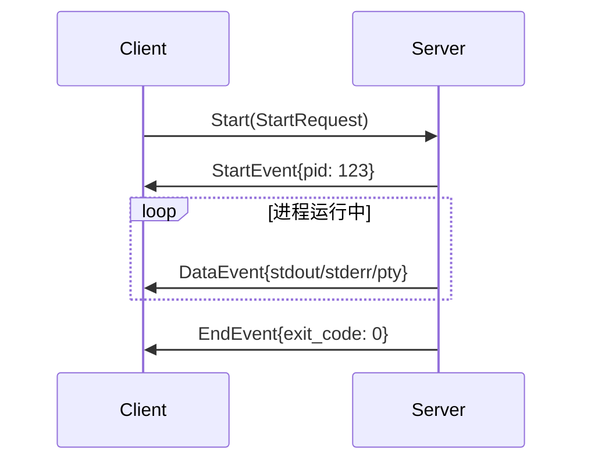
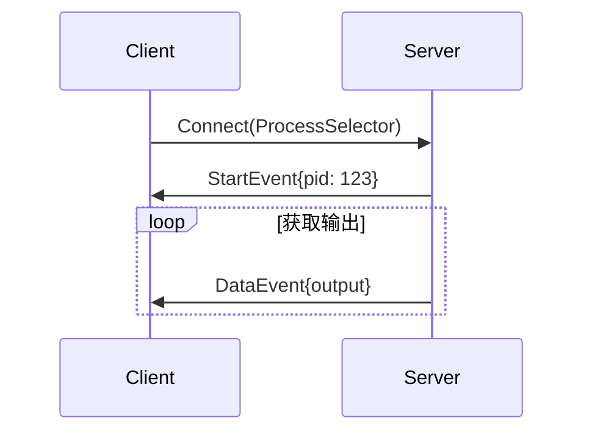
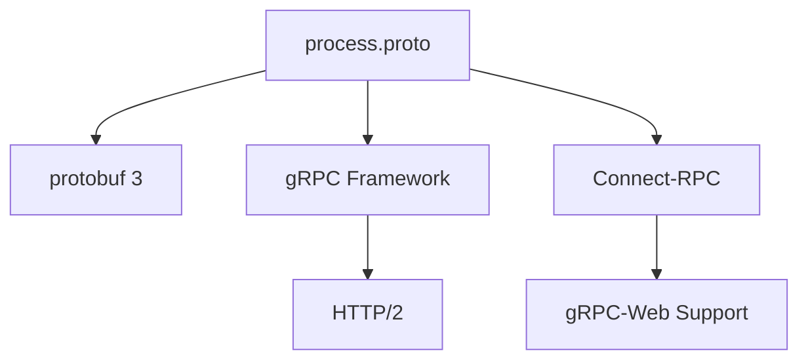
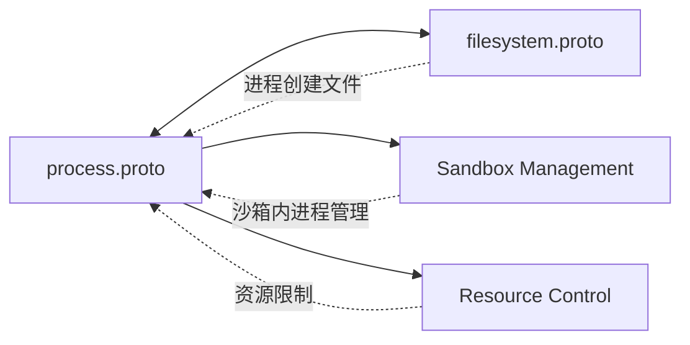

# process.proto - E2B 进程管理接口定义

> 基于五步显化法的 Protocol Buffer 文件深度解析

---

## 一、定位与使命 (Positioning & Mission)

### 1.1 模块定位

**process.proto 是 E2B 沙箱环境中进程生命周期管理的核心接口定义，通过 gRPC 协议提供进程创建、控制、监控和交互的完整能力。**

### 1.2 核心问题

此文件旨在解决以下关键问题：

1. **进程生命周期管理**
   - 统一的进程创建、连接、终止接口
   - 支持进程标签化管理，便于批量操作
   - 提供进程列表查询和状态监控

2. **交互式进程支持**
   - 完整的 PTY（伪终端）支持
   - 实时的输入输出流处理
   - 支持终端窗口大小调整

3. **流式数据处理**
   - 实时捕获进程输出（stdout/stderr/pty）
   - 支持流式输入发送
   - 保持长连接的心跳机制

### 1.3 应用场景

#### 场景一：执行 AI 生成的代码
```protobuf
// 启动 Python 脚本执行
StartRequest {
    process: {
        cmd: "python",
        args: ["script.py"],
        envs: {"PYTHONPATH": "/app"},
        cwd: "/workspace"
    },
    tag: "ai-generated-script"
}
```

#### 场景二：交互式终端会话
```protobuf
// 启动带 PTY 的 bash 会话
StartRequest {
    process: {
        cmd: "/bin/bash",
        args: [],
    },
    pty: {
        size: {cols: 80, rows: 24}
    },
    tag: "terminal-session"
}
```

#### 场景三：批量进程管理
```protobuf
// 通过标签选择进程
ProcessSelector {
    tag: "worker-processes"
}

// 发送终止信号
SendSignalRequest {
    process: {tag: "worker-processes"},
    signal: SIGNAL_SIGTERM
}
```

### 1.4 能力边界

**此模块做什么：**
- 提供完整的进程生命周期管理
- 支持交互式和非交互式进程
- 实现流式输入输出处理
- 提供进程信号发送能力

**此模块不做什么：**
- 不处理进程间通信（IPC）
- 不提供进程资源限制设置
- 不支持进程优先级调整
- 不实现进程调试功能

---

## 二、设计思想与哲学基石 (Design Philosophy & Foundational Principles)

### 2.1 流式优先原则

process.proto 深刻体现了"流式优先"的设计理念：

```protobuf
// 启动进程返回事件流
rpc Start(StartRequest) returns (stream StartResponse);

// 连接到已有进程获取输出流
rpc Connect(ConnectRequest) returns (stream ConnectResponse);

// 流式发送输入
rpc StreamInput(stream StreamInputRequest) returns (StreamInputResponse);
```

这种设计确保了实时性和低延迟。

### 2.2 灵活的选择器模式

```protobuf
message ProcessSelector {
    oneof selector {
        uint32 pid = 1;    // 通过进程ID选择
        string tag = 2;    // 通过标签选择
    }
}
```

支持多种进程选择方式，提高了API的灵活性。

### 2.3 事件驱动架构

```protobuf
message ProcessEvent {
    oneof event {
        StartEvent start = 1;      // 进程启动事件
        DataEvent data = 2;        // 数据输出事件
        EndEvent end = 3;          // 进程结束事件
        KeepAlive keepalive = 4;   // 保活事件
    }
}
```

通过事件流模型，客户端可以异步处理进程状态变化。

---

## 三、核心数据结构定义 (Core Data Structure Definitions)

### 3.1 进程配置结构

```protobuf
// 进程配置信息
message ProcessConfig {
    string cmd = 1;                    // 命令路径
    repeated string args = 2;          // 命令参数
    map<string, string> envs = 3;      // 环境变量
    optional string cwd = 4;           // 工作目录
}

// 进程信息（包含运行时数据）
message ProcessInfo {
    ProcessConfig config = 1;          // 进程配置
    uint32 pid = 2;                   // 进程ID
    optional string tag = 3;          // 进程标签
}
```

### 3.2 PTY（伪终端）支持

```protobuf
// PTY 配置
message PTY {
    Size size = 1;
    
    message Size {
        uint32 cols = 1;  // 终端列数
        uint32 rows = 2;  // 终端行数
    }
}
```

### 3.3 进程事件定义

```protobuf
message ProcessEvent {
    // 启动事件 - 返回进程ID
    message StartEvent {
        uint32 pid = 1;
    }
    
    // 数据事件 - 包含输出数据
    message DataEvent {
        oneof output {
            bytes stdout = 1;  // 标准输出
            bytes stderr = 2;  // 标准错误
            bytes pty = 3;     // PTY输出
        }
    }
    
    // 结束事件 - 包含退出信息
    message EndEvent {
        sint32 exit_code = 1;    // 退出码（有符号）
        bool exited = 2;         // 是否正常退出
        string status = 3;       // 状态描述
        optional string error = 4; // 错误信息
    }
}
```

### 3.4 输入处理结构

```protobuf
// 进程输入
message ProcessInput {
    oneof input {
        bytes stdin = 1;  // 标准输入
        bytes pty = 2;    // PTY输入
    }
}

// 流式输入请求
message StreamInputRequest {
    oneof event {
        StartEvent start = 1;    // 开始输入流
        DataEvent data = 2;      // 输入数据
        KeepAlive keepalive = 3; // 保活信号
    }
}
```

---

## 四、核心接口与逻辑实现 (Core Interface & Logic)

### 4.1 服务定义

```protobuf
service Process {
    // 查询接口
    rpc List(ListRequest) returns (ListResponse);
    
    // 流式接口
    rpc Connect(ConnectRequest) returns (stream ConnectResponse);
    rpc Start(StartRequest) returns (stream StartResponse);
    
    // 控制接口
    rpc Update(UpdateRequest) returns (UpdateResponse);
    rpc StreamInput(stream StreamInputRequest) returns (StreamInputResponse);
    rpc SendInput(SendInputRequest) returns (SendInputResponse);
    rpc SendSignal(SendSignalRequest) returns (SendSignalResponse);
}
```

### 4.2 接口使用流程

#### 启动进程流程


#### 连接已有进程流程


### 4.3 信号处理

```protobuf
enum Signal {
    SIGNAL_UNSPECIFIED = 0;
    SIGNAL_SIGTERM = 15;  // 优雅终止
    SIGNAL_SIGKILL = 9;   // 强制终止
}
```

仅支持最常用的两个信号，保持接口简洁。

---

## 五、依赖关系与交互 (Dependencies & Interactions)

### 5.1 技术栈依赖



### 5.2 与其他模块的协作



### 5.3 客户端实现映射

| Proto RPC | TypeScript SDK | Python SDK | 功能描述 |
|-----------|---------------|------------|----------|
| Start | `commands.run()` | `commands.run()` | 启动新进程 |
| Connect | `commands.connect()` | `commands.connect()` | 连接已有进程 |
| SendInput | `process.sendStdin()` | `process.send_stdin()` | 发送输入 |
| SendSignal | `process.kill()` | `process.kill()` | 发送信号 |
| List | `sandbox.processes` | `sandbox.processes` | 列出进程 |

### 5.4 实现注意事项

1. **流管理**
   - 客户端需要正确处理流的生命周期
   - 实现重连机制处理网络中断
   - 使用心跳保持长连接

2. **缓冲处理**
   - 输出数据可能很大，需要合理缓冲
   - 避免内存溢出
   - 实现背压控制

3. **错误处理**
   - 进程可能异常退出
   - 需要处理各种信号
   - 超时和资源限制

### 5.5 扩展方向

1. **高级进程控制**
   - 支持进程暂停/恢复
   - 进程资源使用统计
   - 进程间通信支持

2. **调试支持**
   - 断点设置
   - 变量查看
   - 调用栈追踪

3. **性能监控**
   - CPU/内存使用率
   - 系统调用追踪
   - 性能分析集成

---

## 总结

process.proto 作为 E2B 进程管理的核心接口定义，通过精心设计的流式 API 和事件模型，为客户端提供了强大而灵活的进程控制能力。它特别适合需要实时交互和输出捕获的场景，是构建云端开发环境和 AI 代码执行平台的关键组件。