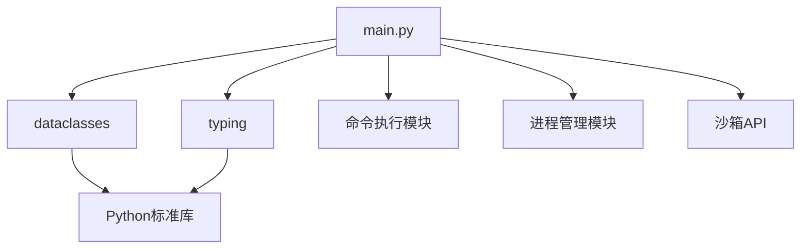
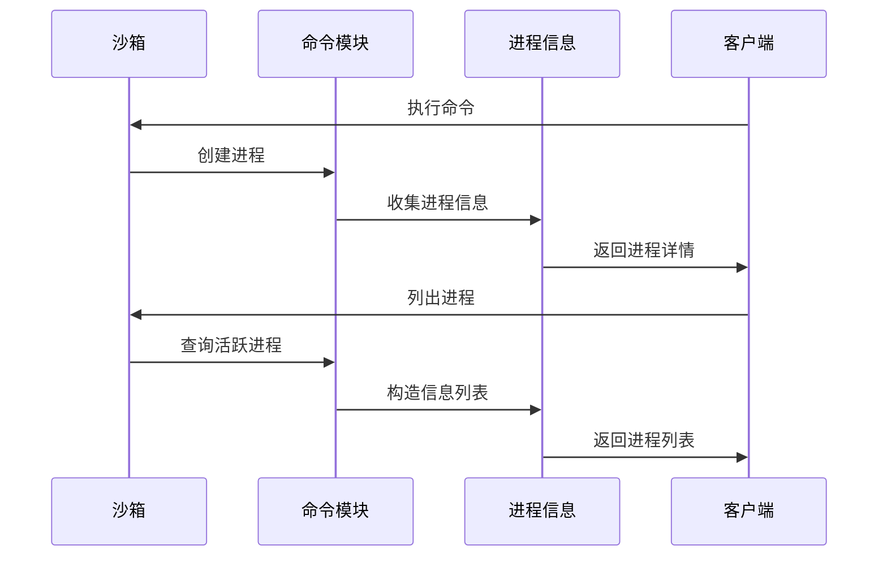
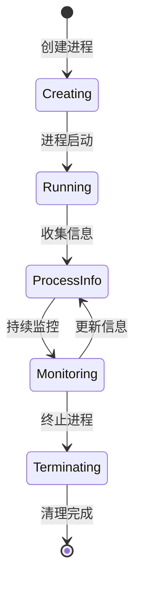

# sandbox/commands/main.py - E2B Python 命令执行数据结构

> 基于五步显化法的 Python 代码深度解析

---

## 一、定位与使命 (Positioning & Mission)

### 1.1 模块定位

**sandbox/commands/main.py 是 E2B Python SDK 的命令执行数据结构定义模块，为沙箱中运行的进程提供完整的信息描述结构，支持命令执行、PTY 会话和启动命令的统一信息管理。**

### 1.2 核心问题

此文件旨在解决以下关键问题：

1. **统一的进程信息描述**
   - 提供完整的进程状态和元数据结构
   - 支持不同类型的进程（命令、PTY、启动命令）
   - 建立进程信息的标准化表示

2. **丰富的进程上下文信息**
   - 记录进程的执行环境和参数
   - 支持自定义标签用于进程分类和管理
   - 保存工作目录和环境变量信息

3. **类型安全的数据传输**
   - 确保进程信息在不同层次间的一致性
   - 提供强类型的进程属性访问
   - 支持现代 Python 类型提示系统

### 1.3 应用场景

#### 场景一：进程状态监控
```python
from e2b import Sandbox, ProcessInfo

sandbox = Sandbox()

# 启动后台进程
handle = sandbox.commands.run("python -m http.server 8000", background=True)

# 获取所有运行中的进程
processes = sandbox.commands.list()

for process in processes:
    print(f"进程ID: {process.pid}")
    print(f"命令: {process.cmd}")
    print(f"参数: {' '.join(process.args)}")
    print(f"工作目录: {process.cwd}")
    print(f"标签: {process.tag}")
    
    # 检查是否是我们启动的HTTP服务器
    if "http.server" in process.cmd:
        print("发现HTTP服务器进程")
        if process.tag:
            print(f"服务器标签: {process.tag}")
        
        # 检查环境变量
        if "PORT" in process.envs:
            print(f"配置端口: {process.envs['PORT']}")
    
    print("---")
```

#### 场景二：环境变量管理和追踪
```python
from e2b import Sandbox
import json

def analyze_process_environments(sandbox: Sandbox):
    """分析沙箱中进程的环境变量使用情况"""
    
    processes = sandbox.commands.list()
    env_analysis = {
        'common_vars': {},
        'unique_vars': {},
        'process_count': len(processes),
        'env_patterns': []
    }
    
    all_env_vars = {}
    
    for process in processes:
        print(f"\n进程 {process.pid} - {process.cmd}")
        print(f"工作目录: {process.cwd or '未指定'}")
        
        # 分析环境变量
        for key, value in process.envs.items():
            if key in all_env_vars:
                all_env_vars[key].add(value)
            else:
                all_env_vars[key] = {value}
            
            print(f"  {key}={value}")
    
    # 统计常见环境变量
    for var, values in all_env_vars.items():
        if len(values) == 1:
            env_analysis['common_vars'][var] = list(values)[0]
        else:
            env_analysis['unique_vars'][var] = list(values)
    
    # 检测环境变量模式
    if 'PATH' in all_env_vars:
        env_analysis['env_patterns'].append('PATH环境变量已设置')
    
    if any('PYTHON' in var for var in all_env_vars.keys()):
        env_analysis['env_patterns'].append('Python环境配置')
    
    if any('NODE' in var for var in all_env_vars.keys()):
        env_analysis['env_patterns'].append('Node.js环境配置')
    
    return env_analysis

# 使用示例
sandbox = Sandbox()

# 启动一些带有不同环境变量的进程
sandbox.commands.run("python --version", envs={"PYTHON_ENV": "production"})
sandbox.commands.run("node --version", envs={"NODE_ENV": "development"})
sandbox.commands.run("echo $HOME", envs={"HOME": "/custom/home"})

analysis = analyze_process_environments(sandbox)
print("\n环境变量分析结果:")
print(json.dumps(analysis, indent=2, ensure_ascii=False))
```

#### 场景三：自定义标签的进程管理
```python
from e2b import Sandbox
from typing import Dict, List

class ProcessManager:
    def __init__(self, sandbox: Sandbox):
        self.sandbox = sandbox
        self.tagged_processes: Dict[str, List[ProcessInfo]] = {}
    
    def start_tagged_process(self, command: str, tag: str, **kwargs):
        """启动带标签的进程"""
        # 注意：实际E2B API可能不直接支持设置tag，这里是概念示例
        handle = self.sandbox.commands.run(command, background=True, **kwargs)
        
        # 获取进程信息（实际实现中需要通过其他方式关联tag）
        processes = self.sandbox.commands.list()
        
        # 模拟根据最新进程分配标签
        if processes:
            latest_process = max(processes, key=lambda p: p.pid)
            self._associate_tag(latest_process, tag)
    
    def _associate_tag(self, process: ProcessInfo, tag: str):
        """关联进程和标签"""
        if tag not in self.tagged_processes:
            self.tagged_processes[tag] = []
        self.tagged_processes[tag].append(process)
    
    def get_processes_by_tag(self, tag: str) -> List[ProcessInfo]:
        """根据标签获取进程列表"""
        return self.tagged_processes.get(tag, [])
    
    def kill_processes_by_tag(self, tag: str):
        """根据标签终止进程"""
        processes = self.get_processes_by_tag(tag)
        for process in processes:
            try:
                # 实际实现中需要调用kill方法
                print(f"终止进程 {process.pid}: {process.cmd}")
                # self.sandbox.commands.kill(process.pid)
            except Exception as e:
                print(f"终止进程 {process.pid} 失败: {e}")
    
    def list_all_tags(self) -> List[str]:
        """列出所有标签"""
        current_processes = self.sandbox.commands.list()
        tags = set()
        
        for process in current_processes:
            if process.tag:
                tags.add(process.tag)
        
        return list(tags)
    
    def get_process_summary(self) -> Dict:
        """获取进程摘要信息"""
        processes = self.sandbox.commands.list()
        
        summary = {
            'total_processes': len(processes),
            'tagged_processes': 0,
            'untagged_processes': 0,
            'working_directories': set(),
            'common_commands': {},
            'environment_vars_count': 0
        }
        
        for process in processes:
            if process.tag:
                summary['tagged_processes'] += 1
            else:
                summary['untagged_processes'] += 1
            
            if process.cwd:
                summary['working_directories'].add(process.cwd)
            
            # 统计命令使用频率
            base_cmd = process.cmd.split()[0] if process.cmd else "unknown"
            summary['common_commands'][base_cmd] = summary['common_commands'].get(base_cmd, 0) + 1
            
            # 统计环境变量总数
            summary['environment_vars_count'] += len(process.envs)
        
        summary['working_directories'] = list(summary['working_directories'])
        
        return summary

# 使用示例
sandbox = Sandbox()
manager = ProcessManager(sandbox)

# 启动不同类型的进程
manager.start_tagged_process("python -m http.server 8080", "web-server")
manager.start_tagged_process("python data_processor.py", "data-pipeline")
manager.start_tagged_process("redis-server", "cache")

# 获取摘要信息
summary = manager.get_process_summary()
print("进程管理摘要:")
for key, value in summary.items():
    print(f"  {key}: {value}")
```

#### 场景四：进程族谱和依赖分析
```python
from e2b import Sandbox, ProcessInfo
from typing import Set, Dict, List

def analyze_process_relationships(sandbox: Sandbox):
    """分析进程间的关系和依赖"""
    
    processes = sandbox.commands.list()
    analysis = {
        'command_families': {},
        'working_directory_groups': {},
        'environment_clusters': {},
        'potential_parent_child': []
    }
    
    # 按命令类型分组
    for process in processes:
        base_command = process.cmd.split()[0] if process.cmd else "unknown"
        
        if base_command not in analysis['command_families']:
            analysis['command_families'][base_command] = []
        
        analysis['command_families'][base_command].append({
            'pid': process.pid,
            'full_command': process.cmd,
            'args': process.args,
            'cwd': process.cwd,
            'tag': process.tag
        })
    
    # 按工作目录分组
    for process in processes:
        cwd = process.cwd or "/"
        
        if cwd not in analysis['working_directory_groups']:
            analysis['working_directory_groups'][cwd] = []
        
        analysis['working_directory_groups'][cwd].append({
            'pid': process.pid,
            'command': process.cmd,
            'tag': process.tag
        })
    
    # 环境变量聚类分析
    env_signatures = {}
    for process in processes:
        # 创建环境变量签名
        env_keys = sorted(process.envs.keys())
        signature = "|".join(env_keys)
        
        if signature not in env_signatures:
            env_signatures[signature] = []
        
        env_signatures[signature].append({
            'pid': process.pid,
            'command': process.cmd,
            'env_count': len(process.envs)
        })
    
    analysis['environment_clusters'] = env_signatures
    
    # 分析潜在的父子进程关系（基于PID范围和命令相似性）
    sorted_processes = sorted(processes, key=lambda p: p.pid)
    
    for i, process in enumerate(sorted_processes):
        for j in range(i + 1, min(i + 5, len(sorted_processes))):  # 检查相近的PID
            other_process = sorted_processes[j]
            
            # 检查是否可能是父子关系
            if (other_process.pid - process.pid < 10 and  # PID相近
                process.cwd == other_process.cwd and      # 相同工作目录
                len(set(process.envs.keys()) & set(other_process.envs.keys())) > 5):  # 环境变量相似
                
                analysis['potential_parent_child'].append({
                    'parent_candidate': {
                        'pid': process.pid,
                        'command': process.cmd
                    },
                    'child_candidate': {
                        'pid': other_process.pid,
                        'command': other_process.cmd
                    },
                    'similarity_score': len(set(process.envs.keys()) & set(other_process.envs.keys()))
                })
    
    return analysis

# 使用示例和报告生成
def generate_process_report(sandbox: Sandbox):
    analysis = analyze_process_relationships(sandbox)
    
    print("=== 进程关系分析报告 ===\n")
    
    print("1. 命令族群分析:")
    for command, processes in analysis['command_families'].items():
        print(f"  {command}: {len(processes)} 个进程")
        for proc in processes[:3]:  # 只显示前3个
            print(f"    PID {proc['pid']}: {proc['full_command']}")
        if len(processes) > 3:
            print(f"    ... 还有 {len(processes) - 3} 个进程")
        print()
    
    print("2. 工作目录分组:")
    for cwd, processes in analysis['working_directory_groups'].items():
        print(f"  {cwd}: {len(processes)} 个进程")
        for proc in processes:
            print(f"    PID {proc['pid']}: {proc['command']}")
        print()
    
    print("3. 环境变量聚类:")
    for signature, processes in analysis['environment_clusters'].items():
        if len(processes) > 1:  # 只显示有多个进程的聚类
            env_vars = signature.split("|")
            print(f"  环境变量模式 ({len(env_vars)} 个变量): {len(processes)} 个进程")
            for proc in processes:
                print(f"    PID {proc['pid']}: {proc['command']}")
            print()
    
    print("4. 潜在父子进程关系:")
    for relationship in analysis['potential_parent_child']:
        parent = relationship['parent_candidate']
        child = relationship['child_candidate']
        score = relationship['similarity_score']
        print(f"  可能关系 (相似度: {score}):")
        print(f"    父进程候选: PID {parent['pid']} - {parent['command']}")
        print(f"    子进程候选: PID {child['pid']} - {child['command']}")
        print()

# 运行分析
sandbox = Sandbox()
generate_process_report(sandbox)
```

### 1.4 能力边界

**此模块做什么：**
- 定义标准化的进程信息数据结构
- 提供完整的进程元数据描述
- 支持进程分类和标识管理
- 确保进程信息的类型安全

**此模块不做什么：**
- 不实现进程的创建和管理逻辑
- 不处理进程间的通信机制
- 不提供进程的实时监控功能
- 不管理进程的生命周期控制

---

## 二、设计思想与哲学基石 (Design Philosophy & Foundational Principles)

### 2.1 全面的进程信息收集

```python
@dataclass
class ProcessInfo:
    """完整的进程信息描述"""
    pid: int                    # 系统标识
    tag: Optional[str]          # 用户标识
    cmd: str                    # 执行命令
    args: List[str]             # 命令参数
    envs: Dict[str, str]        # 环境上下文
    cwd: Optional[str]          # 工作环境
```

收集进程的所有关键信息，便于全面分析和管理。

### 2.2 灵活的标签系统

```python
tag: Optional[str]
"""
Custom tag used for identifying special commands 
like start command in the custom template.
"""
```

通过可选的标签字段支持用户自定义的进程分类。

### 2.3 结构化的命令表示

```python
cmd: str           # 主命令
args: List[str]    # 参数列表
```

将命令和参数分开存储，便于解析和处理。

### 2.4 丰富的环境上下文

```python
envs: Dict[str, str]      # 环境变量
cwd: Optional[str]        # 工作目录
```

保存进程的完整执行环境信息。

---

## 三、核心数据结构定义 (Core Data Structure Definitions)

### 3.1 进程信息完整结构

```python
@dataclass
class ProcessInfo:
    """
    沙箱中运行的命令、PTY会话或启动命令的进程信息
    
    适用于所有类型的沙箱进程：
    - 常规命令执行
    - PTY交互式会话  
    - 模板启动命令
    """
    
    pid: int
    """进程ID - 系统分配的唯一标识符"""
    
    tag: Optional[str]
    """
    自定义标签 - 用于标识特殊命令
    例如：自定义模板中的启动命令标签
    """
    
    cmd: str
    """执行的命令 - 完整的命令字符串"""
    
    args: List[str]
    """命令参数 - 传递给命令的参数列表"""
    
    envs: Dict[str, str]
    """环境变量 - 命令执行时的环境变量字典"""
    
    cwd: Optional[str]
    """工作目录 - 命令执行时的当前工作目录"""
```

### 3.2 进程分类枚举（扩展）

```python
class ProcessType(Enum):
    """进程类型分类"""
    COMMAND = "command"         # 普通命令
    PTY_SESSION = "pty"         # PTY交互会话
    START_COMMAND = "start"     # 启动命令
    BACKGROUND = "background"   # 后台进程
    DAEMON = "daemon"          # 守护进程
```

### 3.3 进程状态信息（扩展）

```python
@dataclass
class ExtendedProcessInfo(ProcessInfo):
    """扩展的进程信息"""
    status: Optional[str] = None          # 进程状态
    start_time: Optional[int] = None      # 启动时间戳
    cpu_usage: Optional[float] = None     # CPU使用率
    memory_usage: Optional[int] = None    # 内存使用量
    exit_code: Optional[int] = None       # 退出码
```

### 3.4 进程集合操作（扩展）

```python
@dataclass
class ProcessCollection:
    """进程集合管理"""
    processes: List[ProcessInfo]
    total_count: int
    running_count: int
    tagged_count: int
    
    def filter_by_tag(self, tag: str) -> List[ProcessInfo]:
        """按标签过滤进程"""
        return [p for p in self.processes if p.tag == tag]
    
    def filter_by_command(self, command_pattern: str) -> List[ProcessInfo]:
        """按命令模式过滤进程"""
        return [p for p in self.processes if command_pattern in p.cmd]
    
    def group_by_cwd(self) -> Dict[str, List[ProcessInfo]]:
        """按工作目录分组"""
        groups = {}
        for proc in self.processes:
            cwd = proc.cwd or "/"
            if cwd not in groups:
                groups[cwd] = []
            groups[cwd].append(proc)
        return groups
```

---

## 四、核心接口与逻辑实现 (Core Interface & Logic)

### 4.1 进程信息创建和验证

```python
def create_process_info(
    pid: int,
    cmd: str,
    args: List[str] = None,
    envs: Dict[str, str] = None,
    cwd: str = None,
    tag: str = None
) -> ProcessInfo:
    """
    安全创建进程信息实例
    
    Args:
        pid: 进程ID
        cmd: 执行命令
        args: 命令参数
        envs: 环境变量
        cwd: 工作目录
        tag: 自定义标签
        
    Returns:
        ProcessInfo实例
        
    Raises:
        ValueError: 无效的参数
    """
    if pid <= 0:
        raise ValueError(f"Invalid PID: {pid}")
    
    if not cmd or not cmd.strip():
        raise ValueError("Command cannot be empty")
    
    return ProcessInfo(
        pid=pid,
        cmd=cmd.strip(),
        args=args or [],
        envs=envs or {},
        cwd=cwd,
        tag=tag
    )
```

### 4.2 进程信息分析工具

```python
def analyze_process_info(process: ProcessInfo) -> dict:
    """
    分析进程信息，提取关键特征
    
    Args:
        process: 进程信息对象
        
    Returns:
        分析结果字典
    """
    analysis = {
        'basic_info': {
            'pid': process.pid,
            'has_tag': process.tag is not None,
            'tag': process.tag,
            'command_length': len(process.cmd),
            'args_count': len(process.args),
            'env_vars_count': len(process.envs),
            'has_cwd': process.cwd is not None
        },
        'command_analysis': {
            'base_command': process.cmd.split()[0] if process.cmd else None,
            'is_python': 'python' in process.cmd.lower(),
            'is_node': 'node' in process.cmd.lower(),
            'is_shell': any(shell in process.cmd.lower() for shell in ['bash', 'sh', 'zsh']),
            'has_pipes': '|' in process.cmd,
            'has_redirection': any(op in process.cmd for op in ['>', '<', '>>']),
        },
        'environment_analysis': {
            'has_path': 'PATH' in process.envs,
            'has_home': 'HOME' in process.envs,
            'python_vars': [k for k in process.envs.keys() if 'PYTHON' in k.upper()],
            'node_vars': [k for k in process.envs.keys() if 'NODE' in k.upper()],
            'custom_vars': [k for k in process.envs.keys() 
                          if not k.upper() in ['PATH', 'HOME', 'USER', 'SHELL']],
        },
        'context_analysis': {
            'working_in_root': process.cwd == '/',
            'working_in_home': process.cwd and process.cwd.startswith('/home'),
            'working_in_tmp': process.cwd and process.cwd.startswith('/tmp'),
            'cwd_depth': len(process.cwd.split('/')) - 1 if process.cwd else 0,
        }
    }
    
    return analysis
```

### 4.3 进程信息比较和匹配

```python
def compare_processes(proc1: ProcessInfo, proc2: ProcessInfo) -> dict:
    """
    比较两个进程信息
    
    Args:
        proc1, proc2: 要比较的进程信息
        
    Returns:
        比较结果字典
    """
    comparison = {
        'identical': proc1 == proc2,
        'same_command': proc1.cmd == proc2.cmd,
        'same_args': proc1.args == proc2.args,
        'same_cwd': proc1.cwd == proc2.cwd,
        'same_tag': proc1.tag == proc2.tag,
        'common_env_vars': set(proc1.envs.keys()) & set(proc2.envs.keys()),
        'env_similarity': 0.0,
        'command_similarity': 0.0
    }
    
    # 计算环境变量相似度
    if proc1.envs or proc2.envs:
        all_env_keys = set(proc1.envs.keys()) | set(proc2.envs.keys())
        common_keys = set(proc1.envs.keys()) & set(proc2.envs.keys())
        comparison['env_similarity'] = len(common_keys) / len(all_env_keys) if all_env_keys else 0
    
    # 计算命令相似度（简单的单词重叠）
    words1 = set(proc1.cmd.lower().split())
    words2 = set(proc2.cmd.lower().split())
    all_words = words1 | words2
    common_words = words1 & words2
    comparison['command_similarity'] = len(common_words) / len(all_words) if all_words else 0
    
    return comparison
```

### 4.4 进程信息序列化

```python
def serialize_process_info(process: ProcessInfo) -> dict:
    """
    将进程信息序列化为字典
    
    Args:
        process: 进程信息对象
        
    Returns:
        序列化后的字典
    """
    return {
        'pid': process.pid,
        'tag': process.tag,
        'cmd': process.cmd,
        'args': process.args,
        'envs': process.envs,
        'cwd': process.cwd,
        'metadata': {
            'serialized_at': int(time.time()),
            'args_count': len(process.args),
            'env_count': len(process.envs),
            'has_tag': process.tag is not None,
            'has_cwd': process.cwd is not None
        }
    }

def deserialize_process_info(data: dict) -> ProcessInfo:
    """
    从字典反序列化进程信息
    
    Args:
        data: 序列化的字典数据
        
    Returns:
        ProcessInfo对象
        
    Raises:
        KeyError: 缺少必需字段
        ValueError: 数据格式错误
    """
    required_fields = ['pid', 'cmd', 'args', 'envs']
    
    for field in required_fields:
        if field not in data:
            raise KeyError(f"Missing required field: {field}")
    
    return ProcessInfo(
        pid=int(data['pid']),
        tag=data.get('tag'),
        cmd=str(data['cmd']),
        args=list(data['args']),
        envs=dict(data['envs']),
        cwd=data.get('cwd')
    )
```

### 4.5 进程信息过滤和搜索

```python
class ProcessFilter:
    """进程信息过滤器"""
    
    @staticmethod
    def by_pid_range(processes: List[ProcessInfo], 
                    min_pid: int, max_pid: int) -> List[ProcessInfo]:
        """按PID范围过滤"""
        return [p for p in processes if min_pid <= p.pid <= max_pid]
    
    @staticmethod
    def by_tag(processes: List[ProcessInfo], tag: str) -> List[ProcessInfo]:
        """按标签过滤"""
        return [p for p in processes if p.tag == tag]
    
    @staticmethod
    def by_command_pattern(processes: List[ProcessInfo], 
                          pattern: str) -> List[ProcessInfo]:
        """按命令模式过滤"""
        import re
        regex = re.compile(pattern, re.IGNORECASE)
        return [p for p in processes if regex.search(p.cmd)]
    
    @staticmethod
    def by_working_directory(processes: List[ProcessInfo], 
                           cwd: str) -> List[ProcessInfo]:
        """按工作目录过滤"""
        return [p for p in processes if p.cwd == cwd]
    
    @staticmethod
    def by_environment_variable(processes: List[ProcessInfo], 
                               var_name: str, var_value: str = None) -> List[ProcessInfo]:
        """按环境变量过滤"""
        if var_value is None:
            return [p for p in processes if var_name in p.envs]
        else:
            return [p for p in processes if p.envs.get(var_name) == var_value]
    
    @staticmethod
    def complex_filter(processes: List[ProcessInfo], **criteria) -> List[ProcessInfo]:
        """复合条件过滤"""
        filtered = processes
        
        if 'min_pid' in criteria:
            filtered = [p for p in filtered if p.pid >= criteria['min_pid']]
        
        if 'max_pid' in criteria:
            filtered = [p for p in filtered if p.pid <= criteria['max_pid']]
        
        if 'tag' in criteria:
            filtered = [p for p in filtered if p.tag == criteria['tag']]
        
        if 'command_contains' in criteria:
            pattern = criteria['command_contains']
            filtered = [p for p in filtered if pattern.lower() in p.cmd.lower()]
        
        if 'cwd' in criteria:
            filtered = [p for p in filtered if p.cwd == criteria['cwd']]
        
        if 'has_env_var' in criteria:
            var_name = criteria['has_env_var']
            filtered = [p for p in filtered if var_name in p.envs]
        
        return filtered
```

---

## 五、依赖关系与交互 (Dependencies & Interactions)

### 5.1 模块依赖关系



### 5.2 数据流转图



### 5.3 进程生命周期集成



### 5.4 与其他模块的交互关系

| 交互模块 | 交互方式 | 数据交换 | 依赖方向 |
|---------|---------|----------|---------|
| **Commands** | 组合关系 | 进程创建和状态 | Commands → ProcessInfo |
| **PTY** | 组合关系 | PTY会话信息 | PTY → ProcessInfo |  
| **Sandbox** | 聚合关系 | 进程列表查询 | Sandbox → ProcessInfo |
| **gRPC Client** | 数据转换 | Protocol Buffer映射 | ProcessInfo ↔ gRPC |
| **API Client** | 序列化 | JSON数据交换 | ProcessInfo ↔ API |

### 5.5 进程信息的生命周期管理

```python
class ProcessLifecycleManager:
    """进程生命周期管理器"""
    
    def __init__(self):
        self.process_registry: Dict[int, ProcessInfo] = {}
        self.process_history: List[ProcessInfo] = []
    
    def register_process(self, process: ProcessInfo):
        """注册新进程"""
        self.process_registry[process.pid] = process
        self.process_history.append(process)
    
    def update_process(self, pid: int, **updates):
        """更新进程信息"""
        if pid in self.process_registry:
            process = self.process_registry[pid]
            # 这里需要创建新的ProcessInfo实例，因为dataclass是不可变的
            updated_process = ProcessInfo(
                pid=process.pid,
                tag=updates.get('tag', process.tag),
                cmd=updates.get('cmd', process.cmd),
                args=updates.get('args', process.args),
                envs=updates.get('envs', process.envs),
                cwd=updates.get('cwd', process.cwd)
            )
            self.process_registry[pid] = updated_process
    
    def unregister_process(self, pid: int):
        """注销进程"""
        if pid in self.process_registry:
            del self.process_registry[pid]
    
    def get_active_processes(self) -> List[ProcessInfo]:
        """获取活跃进程列表"""
        return list(self.process_registry.values())
    
    def get_process_history(self) -> List[ProcessInfo]:
        """获取进程历史记录"""
        return self.process_history.copy()
```

### 5.6 与协议层的集成

```python
# 与gRPC Protocol Buffer的集成
def from_grpc_process_info(grpc_process) -> ProcessInfo:
    """从gRPC消息创建ProcessInfo"""
    return ProcessInfo(
        pid=grpc_process.pid,
        tag=grpc_process.tag if grpc_process.tag else None,
        cmd=grpc_process.cmd,
        args=list(grpc_process.args),
        envs=dict(grpc_process.envs),
        cwd=grpc_process.cwd if grpc_process.cwd else None
    )

def to_grpc_process_info(process: ProcessInfo):
    """转换为gRPC消息格式"""
    # 这里需要根据实际的Protocol Buffer定义来实现
    grpc_process = process_pb2.ProcessInfo()
    grpc_process.pid = process.pid
    if process.tag:
        grpc_process.tag = process.tag
    grpc_process.cmd = process.cmd
    grpc_process.args.extend(process.args)
    grpc_process.envs.update(process.envs)
    if process.cwd:
        grpc_process.cwd = process.cwd
    return grpc_process
```

### 5.7 缓存和性能优化

```python
from functools import lru_cache
from typing import FrozenSet

class ProcessInfoCache:
    """进程信息缓存"""
    
    def __init__(self, max_size: int = 1000):
        self.max_size = max_size
        self._cache: Dict[int, ProcessInfo] = {}
        self._access_order: List[int] = []
    
    def get(self, pid: int) -> Optional[ProcessInfo]:
        """获取缓存的进程信息"""
        if pid in self._cache:
            # 更新访问顺序
            self._access_order.remove(pid)
            self._access_order.append(pid)
            return self._cache[pid]
        return None
    
    def put(self, process: ProcessInfo):
        """缓存进程信息"""
        if len(self._cache) >= self.max_size:
            # 移除最少使用的条目
            oldest_pid = self._access_order.pop(0)
            del self._cache[oldest_pid]
        
        self._cache[process.pid] = process
        self._access_order.append(process.pid)
    
    @lru_cache(maxsize=128)
    def get_processes_by_command_pattern(self, pattern: str) -> FrozenSet[int]:
        """缓存的命令模式搜索"""
        matching_pids = set()
        for pid, process in self._cache.items():
            if pattern.lower() in process.cmd.lower():
                matching_pids.add(pid)
        return frozenset(matching_pids)
```

### 5.8 监控和指标收集

```python
class ProcessMetrics:
    """进程指标收集"""
    
    def __init__(self):
        self.metrics = {
            'total_processes_created': 0,
            'active_processes': 0,
            'processes_by_command': {},
            'processes_by_tag': {},
            'average_args_count': 0.0,
            'average_env_count': 0.0
        }
    
    def record_process_creation(self, process: ProcessInfo):
        """记录进程创建"""
        self.metrics['total_processes_created'] += 1
        self.metrics['active_processes'] += 1
        
        # 统计命令分布
        base_cmd = process.cmd.split()[0] if process.cmd else 'unknown'
        self.metrics['processes_by_command'][base_cmd] = \
            self.metrics['processes_by_command'].get(base_cmd, 0) + 1
        
        # 统计标签分布
        if process.tag:
            self.metrics['processes_by_tag'][process.tag] = \
                self.metrics['processes_by_tag'].get(process.tag, 0) + 1
    
    def record_process_termination(self, process: ProcessInfo):
        """记录进程终止"""
        self.metrics['active_processes'] = max(0, self.metrics['active_processes'] - 1)
    
    def calculate_averages(self, processes: List[ProcessInfo]):
        """计算平均值指标"""
        if processes:
            total_args = sum(len(p.args) for p in processes)
            total_envs = sum(len(p.envs) for p in processes)
            
            self.metrics['average_args_count'] = total_args / len(processes)
            self.metrics['average_env_count'] = total_envs / len(processes)
    
    def get_metrics(self) -> dict:
        """获取所有指标"""
        return self.metrics.copy()
```

---

## 总结

sandbox/commands/main.py 作为 E2B Python SDK 的命令执行数据结构核心模块，通过精心设计的 ProcessInfo 数据类，为沙箱中运行的各类进程提供了完整、统一、类型安全的信息描述结构。它不仅支持基础的进程属性管理，还通过灵活的标签系统、丰富的环境上下文和扩展性设计，为上层的进程管理、监控和分析功能提供了坚实的数据基础，是整个命令执行系统的信息核心。