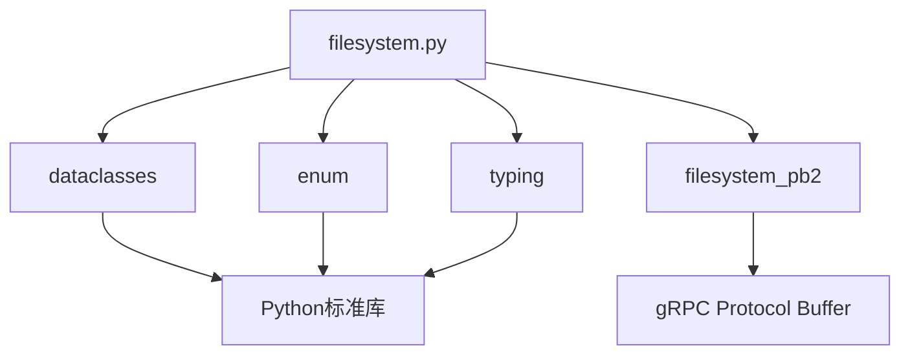
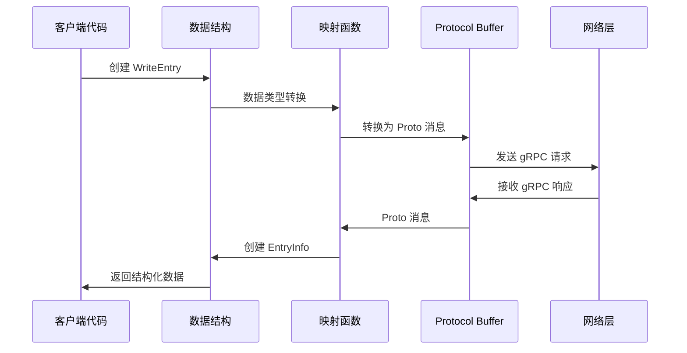
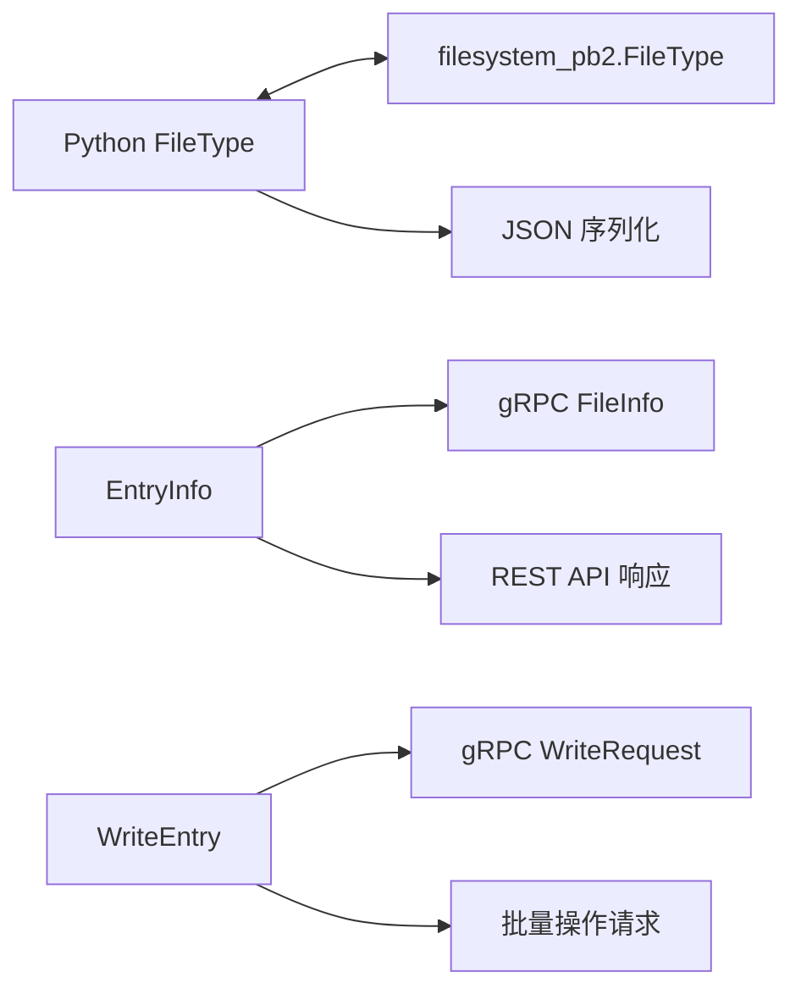

# sandbox/filesystem/filesystem.py - E2B Python 文件系统数据结构

> 基于五步显化法的 Python 代码深度解析

---

## 一、定位与使命 (Positioning & Mission)

### 1.1 模块定位

**sandbox/filesystem/filesystem.py 是 E2B Python SDK 的文件系统数据结构定义模块，为沙箱文件系统操作提供基础的数据类型、枚举和映射函数，确保 Python 与 gRPC 协议之间的类型安全转换。**

### 1.2 核心问题

此文件旨在解决以下关键问题：

1. **统一的文件系统类型定义**
   - 定义清晰的文件系统对象类型枚举
   - 提供一致的文件和目录信息结构
   - 建立 Python 类型与 Protocol Buffer 的映射关系

2. **类型安全的数据传输**
   - 确保 gRPC 通信中的类型一致性
   - 提供强类型的文件系统对象描述
   - 支持不同数据格式的文件写入操作

3. **简洁的 API 接口设计**
   - 使用 Python dataclass 简化数据结构定义
   - 提供直观的文件系统对象表示
   - 支持现代 Python 类型提示系统

### 1.3 应用场景

#### 场景一：文件系统对象遍历
```python
from e2b import Sandbox, FileType, EntryInfo

sandbox = Sandbox()

# 列出目录内容
entries = sandbox.files.list("/home/user")

for entry in entries:
    print(f"名称: {entry.name}")
    print(f"路径: {entry.path}")
    
    if entry.type == FileType.FILE:
        print("类型: 文件")
        # 读取文件内容
        content = sandbox.files.read(entry.path)
        print(f"大小: {len(content)} 字节")
    
    elif entry.type == FileType.DIR:
        print("类型: 目录")
        # 递归列出子目录
        sub_entries = sandbox.files.list(entry.path)
        print(f"子项数量: {len(sub_entries)}")
    
    print("---")
```

#### 场景二：批量文件写入
```python
from e2b import Sandbox, WriteEntry
import io

sandbox = Sandbox()

# 准备不同类型的写入数据
write_entries = [
    # 字符串内容
    WriteEntry(path="/app/config.json", data='{"debug": true}'),
    
    # 字节内容
    WriteEntry(path="/app/binary.dat", data=b'\x00\x01\x02\x03'),
    
    # 文件对象
    WriteEntry(path="/app/stream.txt", data=io.StringIO("Stream content")),
]

# 批量写入文件
for entry in write_entries:
    sandbox.files.write(entry.path, entry.data)
    print(f"已写入: {entry.path}")

# 验证文件是否存在
for entry in write_entries:
    exists = sandbox.files.exists(entry.path)
    print(f"{entry.path}: {'存在' if exists else '不存在'}")
```

#### 场景三：文件类型过滤和处理
```python
from e2b import Sandbox, FileType

def process_directory(sandbox: Sandbox, directory: str):
    """递归处理目录中的文件"""
    
    entries = sandbox.files.list(directory)
    
    files = [entry for entry in entries if entry.type == FileType.FILE]
    dirs = [entry for entry in entries if entry.type == FileType.DIR]
    
    print(f"处理目录: {directory}")
    print(f"文件数量: {len(files)}")
    print(f"子目录数量: {len(dirs)}")
    
    # 处理所有文件
    for file_entry in files:
        if file_entry.name.endswith('.py'):
            print(f"发现Python文件: {file_entry.name}")
            content = sandbox.files.read(file_entry.path)
            lines = content.split('\n')
            print(f"  行数: {len(lines)}")
        
        elif file_entry.name.endswith('.json'):
            print(f"发现JSON文件: {file_entry.name}")
            content = sandbox.files.read(file_entry.path)
            try:
                import json
                data = json.loads(content)
                print(f"  键数量: {len(data) if isinstance(data, dict) else 'N/A'}")
            except json.JSONDecodeError:
                print("  JSON格式无效")
    
    # 递归处理子目录
    for dir_entry in dirs:
        if not dir_entry.name.startswith('.'):  # 跳过隐藏目录
            process_directory(sandbox, dir_entry.path)

# 使用示例
sandbox = Sandbox()
process_directory(sandbox, "/app")
```

#### 场景四：文件信息统计
```python
from e2b import Sandbox, FileType, EntryInfo
from collections import defaultdict
import os

def analyze_filesystem(sandbox: Sandbox, root_path: str):
    """分析文件系统结构"""
    
    stats = {
        'total_files': 0,
        'total_dirs': 0,
        'file_extensions': defaultdict(int),
        'largest_files': [],
        'deepest_path': '',
        'max_depth': 0
    }
    
    def collect_stats(path: str, depth: int = 0):
        try:
            entries = sandbox.files.list(path)
            
            if depth > stats['max_depth']:
                stats['max_depth'] = depth
                stats['deepest_path'] = path
            
            for entry in entries:
                if entry.type == FileType.FILE:
                    stats['total_files'] += 1
                    
                    # 统计文件扩展名
                    _, ext = os.path.splitext(entry.name)
                    if ext:
                        stats['file_extensions'][ext.lower()] += 1
                    
                    # 获取文件大小（如果可能）
                    try:
                        content = sandbox.files.read(entry.path)
                        size = len(content) if isinstance(content, str) else len(content)
                        stats['largest_files'].append((entry.path, size))
                    except:
                        pass
                
                elif entry.type == FileType.DIR:
                    stats['total_dirs'] += 1
                    # 递归分析子目录
                    collect_stats(entry.path, depth + 1)
        
        except Exception as e:
            print(f"分析路径 {path} 时出错: {e}")
    
    collect_stats(root_path)
    
    # 整理最大文件列表
    stats['largest_files'].sort(key=lambda x: x[1], reverse=True)
    stats['largest_files'] = stats['largest_files'][:10]  # 只保留前10个
    
    return stats

# 使用示例
sandbox = Sandbox()
file_stats = analyze_filesystem(sandbox, "/")

print("文件系统分析报告:")
print(f"总文件数: {file_stats['total_files']}")
print(f"总目录数: {file_stats['total_dirs']}")
print(f"最大深度: {file_stats['max_depth']}")
print(f"最深路径: {file_stats['deepest_path']}")

print("\n文件扩展名统计:")
for ext, count in sorted(file_stats['file_extensions'].items()):
    print(f"  {ext}: {count}")

print("\n最大的文件:")
for path, size in file_stats['largest_files']:
    print(f"  {path}: {size} 字节")
```

### 1.4 能力边界

**此模块做什么：**
- 定义文件系统基础数据类型
- 提供 Protocol Buffer 类型映射
- 确保类型安全和一致性
- 支持多种数据格式的文件操作

**此模块不做什么：**
- 不实现具体的文件系统操作逻辑
- 不处理网络通信和 gRPC 调用
- 不进行文件内容的编码解码
- 不提供文件系统的权限管理

---

## 二、设计思想与哲学基石 (Design Philosophy & Foundational Principles)

### 2.1 简洁优雅的数据结构

```python
@dataclass
class EntryInfo:
    """使用 dataclass 简化数据结构定义"""
    name: str
    type: Optional[FileType]
    path: str
```

通过 dataclass 自动生成构造函数、比较方法等，减少样板代码。

### 2.2 强类型枚举设计

```python
class FileType(Enum):
    """明确的文件类型枚举"""
    FILE = "file"
    DIR = "dir"
```

使用字符串值的枚举，便于序列化和调试。

### 2.3 灵活的数据输入支持

```python
@dataclass
class WriteEntry:
    path: str
    data: Union[str, bytes, IO]  # 支持多种数据类型
```

通过 Union 类型支持不同的数据输入格式。

### 2.4 协议映射的分离关注

```python
def map_file_type(ft: filesystem_pb2.FileType):
    """独立的协议映射函数"""
    if ft == filesystem_pb2.FileType.FILE_TYPE_FILE:
        return FileType.FILE
    elif ft == filesystem_pb2.FileType.FILE_TYPE_DIRECTORY:
        return FileType.DIR
```

将协议转换逻辑独立出来，便于维护和测试。

---

## 三、核心数据结构定义 (Core Data Structure Definitions)

### 3.1 文件类型枚举

```python
class FileType(Enum):
    """文件系统对象类型枚举"""
    
    FILE = "file"
    """表示文件系统对象是一个文件"""
    
    DIR = "dir"
    """表示文件系统对象是一个目录"""
```

**设计特点：**
- 使用字符串值便于 JSON 序列化
- 提供清晰的文档说明
- 枚举值简洁易理解

### 3.2 文件系统条目信息

```python
@dataclass
class EntryInfo:
    """沙箱文件系统对象信息"""
    
    name: str
    """文件系统对象的名称"""
    
    type: Optional[FileType]
    """文件系统对象的类型（文件或目录）"""
    
    path: str
    """文件系统对象的完整路径"""
```

**设计特点：**
- 使用 dataclass 自动生成方法
- type 字段可选，处理未知类型情况
- 包含完整路径信息便于操作

### 3.3 写入条目定义

```python
@dataclass
class WriteEntry:
    """包含要写入文件系统的文件路径和数据"""
    
    path: str
    """目标文件路径"""
    
    data: Union[str, bytes, IO]
    """文件数据，支持字符串、字节或文件对象"""
```

**设计特点：**
- 支持多种数据输入格式
- 路径和数据分离，结构清晰
- 便于批量文件操作

### 3.4 协议映射关系

```python
PROTOCOL_MAPPING = {
    filesystem_pb2.FileType.FILE_TYPE_FILE: FileType.FILE,
    filesystem_pb2.FileType.FILE_TYPE_DIRECTORY: FileType.DIR,
}
```

**映射逻辑：**
- Protocol Buffer 枚举到 Python 枚举的转换
- 双向映射支持（实际实现中可能需要）
- 版本兼容性考虑

---

## 四、核心接口与逻辑实现 (Core Interface & Logic)

### 4.1 文件类型映射函数

```python
def map_file_type(ft: filesystem_pb2.FileType) -> Optional[FileType]:
    """将 Protocol Buffer 文件类型映射到 Python 枚举
    
    Args:
        ft: Protocol Buffer 文件类型枚举值
        
    Returns:
        对应的 Python FileType 枚举值，未知类型返回 None
    """
    if ft == filesystem_pb2.FileType.FILE_TYPE_FILE:
        return FileType.FILE
    elif ft == filesystem_pb2.FileType.FILE_TYPE_DIRECTORY:
        return FileType.DIR
    else:
        return None  # 处理未知类型
```

**实现特点：**
- 显式的条件判断，易于理解
- 处理未知类型的情况
- 单一职责，只负责类型转换

### 4.2 反向映射函数（推断）

```python
def map_to_proto_file_type(file_type: FileType) -> filesystem_pb2.FileType:
    """将 Python 文件类型映射到 Protocol Buffer 枚举
    
    Args:
        file_type: Python FileType 枚举值
        
    Returns:
        对应的 Protocol Buffer 文件类型枚举值
        
    Raises:
        ValueError: 未知的文件类型
    """
    if file_type == FileType.FILE:
        return filesystem_pb2.FileType.FILE_TYPE_FILE
    elif file_type == FileType.DIR:
        return filesystem_pb2.FileType.FILE_TYPE_DIRECTORY
    else:
        raise ValueError(f"Unknown file type: {file_type}")
```

### 4.3 数据结构验证（推断）

```python
def validate_entry_info(entry: EntryInfo) -> bool:
    """验证文件系统条目信息的有效性
    
    Args:
        entry: 要验证的文件系统条目
        
    Returns:
        True 如果条目信息有效，否则 False
    """
    # 检查路径是否为空
    if not entry.path or not entry.path.strip():
        return False
    
    # 检查名称是否为空
    if not entry.name or not entry.name.strip():
        return False
    
    # 检查路径和名称的一致性
    import os
    expected_name = os.path.basename(entry.path)
    if expected_name != entry.name:
        return False
    
    # 检查文件类型是否有效
    if entry.type is not None and entry.type not in FileType:
        return False
    
    return True
```

### 4.4 写入条目处理（推断）

```python
def process_write_entry(entry: WriteEntry) -> tuple[str, bytes]:
    """处理写入条目，统一数据格式
    
    Args:
        entry: 写入条目
        
    Returns:
        元组 (路径, 字节数据)
        
    Raises:
        ValueError: 无效的数据类型
        IOError: 文件对象读取失败
    """
    path = entry.path
    
    # 处理不同类型的数据
    if isinstance(entry.data, str):
        data = entry.data.encode('utf-8')
    elif isinstance(entry.data, bytes):
        data = entry.data
    elif hasattr(entry.data, 'read'):  # 文件对象
        try:
            content = entry.data.read()
            if isinstance(content, str):
                data = content.encode('utf-8')
            elif isinstance(content, bytes):
                data = content
            else:
                raise ValueError(f"Unsupported file content type: {type(content)}")
        except Exception as e:
            raise IOError(f"Failed to read from file object: {e}")
    else:
        raise ValueError(f"Unsupported data type: {type(entry.data)}")
    
    return path, data
```

---

## 五、依赖关系与交互 (Dependencies & Interactions)

### 5.1 模块依赖关系



### 5.2 数据流转图



### 5.3 类型转换关系



### 5.4 使用模式分析

| 使用场景 | 主要数据结构 | 交互模式 | 性能影响 |
|---------|-------------|---------|---------|
| **文件列表** | `EntryInfo` | Protocol → Python | 低，仅类型转换 |
| **批量写入** | `WriteEntry` | Python → Protocol | 中，需要数据处理 |
| **类型检查** | `FileType` | 枚举比较 | 极低，内存操作 |
| **路径验证** | `EntryInfo` | 字符串处理 | 低，正则表达式 |

### 5.5 与其他模块的集成

```python
# 文件系统操作模块集成
class FilesystemOperations:
    def list(self, path: str) -> List[EntryInfo]:
        """返回 EntryInfo 列表"""
        pass
    
    def write_batch(self, entries: List[WriteEntry]) -> None:
        """批量写入文件"""
        for entry in entries:
            path, data = process_write_entry(entry)
            self._write_file(path, data)

# 沙箱主类集成
class Sandbox:
    @property
    def files(self) -> FilesystemOperations:
        return self._filesystem
    
    def create_file_structure(self, structure: Dict[str, any]):
        """根据结构创建文件"""
        entries = []
        for path, content in structure.items():
            entries.append(WriteEntry(path=path, data=content))
        self.files.write_batch(entries)
```

### 5.6 错误处理集成

```python
class FilesystemError(Exception):
    """文件系统操作基础异常"""
    pass

class InvalidFileTypeError(FilesystemError):
    """无效文件类型异常"""
    def __init__(self, file_type):
        super().__init__(f"Invalid file type: {file_type}")

class InvalidPathError(FilesystemError):
    """无效路径异常"""
    def __init__(self, path):
        super().__init__(f"Invalid path: {path}")

# 在数据结构中集成错误处理
def create_entry_info(name: str, path: str, file_type: Optional[FileType]) -> EntryInfo:
    """安全创建 EntryInfo 实例"""
    if not validate_path(path):
        raise InvalidPathError(path)
    
    if file_type is not None and file_type not in FileType:
        raise InvalidFileTypeError(file_type)
    
    return EntryInfo(name=name, path=path, type=file_type)
```

### 5.7 扩展性设计

```python
# 支持扩展的文件类型
class ExtendedFileType(Enum):
    FILE = "file"
    DIR = "dir"
    SYMLINK = "symlink"      # 符号链接
    DEVICE = "device"        # 设备文件
    PIPE = "pipe"           # 命名管道

# 支持扩展的条目信息
@dataclass
class ExtendedEntryInfo(EntryInfo):
    size: Optional[int] = None           # 文件大小
    permissions: Optional[str] = None     # 文件权限
    owner: Optional[str] = None          # 文件所有者
    modified_time: Optional[int] = None   # 修改时间
    
# 向后兼容的映射函数
def map_extended_file_type(ft: filesystem_pb2.FileType) -> Optional[ExtendedFileType]:
    """扩展的文件类型映射"""
    basic_type = map_file_type(ft)
    if basic_type:
        return ExtendedFileType(basic_type.value)
    return None
```

### 5.8 测试集成点

```python
# 测试数据生成
def create_test_entry_info(name: str = "test.txt", 
                          file_type: FileType = FileType.FILE) -> EntryInfo:
    """创建测试用的 EntryInfo"""
    return EntryInfo(
        name=name,
        path=f"/tmp/{name}",
        type=file_type
    )

def create_test_write_entries() -> List[WriteEntry]:
    """创建测试用的写入条目列表"""
    return [
        WriteEntry("/test/text.txt", "Hello World"),
        WriteEntry("/test/binary.dat", b"\x00\x01\x02"),
        WriteEntry("/test/empty.txt", ""),
    ]

# Mock 对象支持
class MockFilesystemPb2:
    """Mock Protocol Buffer 对象"""
    class FileType:
        FILE_TYPE_FILE = 1
        FILE_TYPE_DIRECTORY = 2
    
    @staticmethod
    def create_file_info(name: str, path: str, file_type: int):
        """创建 Mock 文件信息"""
        return {
            'name': name,
            'path': path,
            'type': file_type
        }
```

---

## 总结

sandbox/filesystem/filesystem.py 作为 E2B Python SDK 的文件系统数据结构基础模块，通过简洁优雅的设计提供了完整的文件系统类型定义和协议映射功能。它不仅使用现代 Python 特性（dataclass、枚举、类型提示）确保了代码的可读性和类型安全，还通过灵活的数据输入支持和清晰的协议映射，为上层文件系统操作模块提供了坚实的基础，是整个文件系统功能的核心数据层。