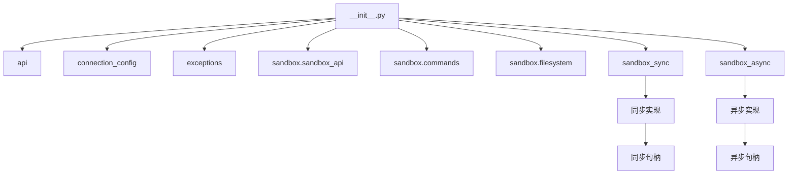
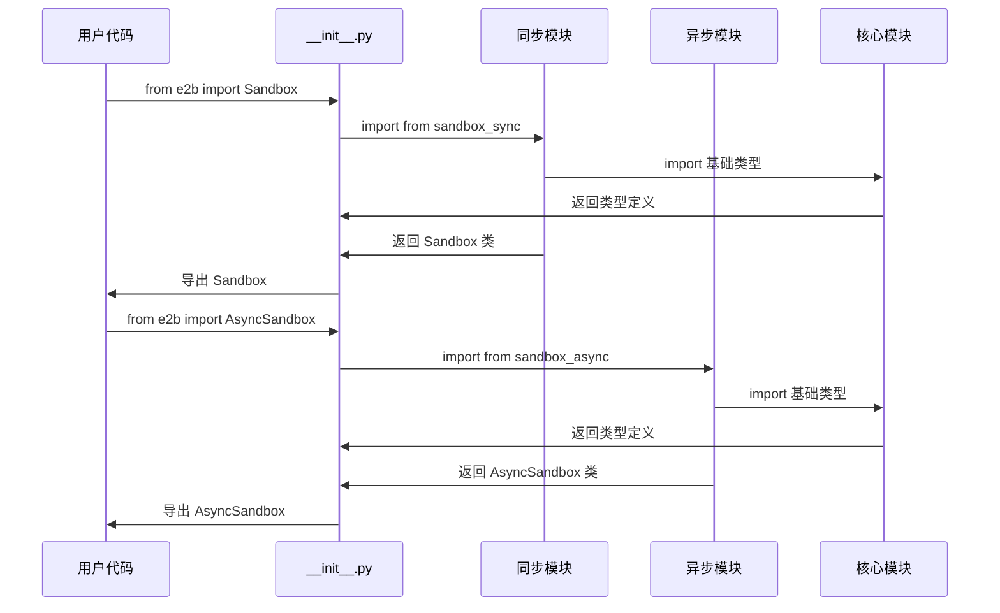

# python-sdk/__init__.py - E2B Python SDK 主入口

> 基于五步显化法的 Python 代码深度解析

---

## 一、定位与使命 (Positioning & Mission)

### 1.1 模块定位

**python-sdk/__init__.py 是 E2B Python SDK 的统一导出入口，为 Python 开发者提供完整的沙箱操作 API，支持同步和异步两种编程模式。**

### 1.2 核心问题

此文件旨在解决以下关键问题：

1. **统一的 API 导出**
   - 将分散在各模块中的类、函数和类型统一导出
   - 提供清晰的命名空间和导入体验
   - 避免深层嵌套导入的复杂性

2. **同步异步双模式支持**
   - 同时支持同步 (`Sandbox`) 和异步 (`AsyncSandbox`) 编程模式
   - 为不同使用场景提供对应的句柄和工具类
   - 保持 API 接口的一致性

3. **完整的类型系统暴露**
   - 导出所有必要的数据类型和异常类
   - 确保类型提示的完整性
   - 支持现代 Python 开发最佳实践

### 1.3 应用场景

#### 场景一：同步沙箱操作
```python
from e2b import Sandbox, CommandResult, FileType

# 创建同步沙箱
sandbox = Sandbox()

# 执行命令
result: CommandResult = sandbox.commands.run("python --version")
print(f"Python version: {result.stdout}")

# 文件操作
sandbox.files.write("/tmp/test.py", "print('Hello from E2B')")
entries = sandbox.files.list("/tmp")

for entry in entries:
    if entry.type == FileType.FILE:
        print(f"Found file: {entry.name}")

sandbox.close()
```

#### 场景二：异步沙箱操作
```python
import asyncio
from e2b import AsyncSandbox, AsyncCommandHandle, OutputHandler

async def main():
    # 创建异步沙箱
    sandbox = await AsyncSandbox.create()
    
    # 异步命令执行
    handle: AsyncCommandHandle = await sandbox.commands.run(
        "python", ["-c", "import time; time.sleep(1); print('Done')"],
        background=True
    )
    
    # 等待命令完成
    result = await handle.wait()
    print(f"Command output: {result.stdout}")
    
    await sandbox.close()

asyncio.run(main())
```

#### 场景三：错误处理
```python
from e2b import (
    Sandbox, 
    SandboxException, 
    TimeoutException,
    AuthenticationException,
    NotFoundException
)

try:
    sandbox = Sandbox()
    result = sandbox.commands.run("nonexistent-command")
except AuthenticationException:
    print("Authentication failed - check your API key")
except TimeoutException:
    print("Command execution timed out")
except NotFoundException:
    print("Resource not found")
except SandboxException as e:
    print(f"Sandbox error: {e}")
```

### 1.4 能力边界

**此模块做什么：**
- 统一导出所有公共 API 和类型
- 提供同步和异步两套完整接口
- 建立清晰的模块边界和命名空间
- 支持现代 Python 类型提示

**此模块不做什么：**
- 不实现具体的业务逻辑
- 不处理模块间的依赖关系
- 不进行运行时初始化或配置
- 不提供向后兼容的别名

---

## 二、设计思想与哲学基石 (Design Philosophy & Foundational Principles)

### 2.1 显式优于隐式

```python
# 明确的导入声明，避免通配符导入
from .api import (
    ApiClient,
    client,
)
from .connection_config import (
    ConnectionConfig,
    ProxyTypes,
)
# ... 每个模块都有明确的导入列表
```

遵循 Python 之禅的"显式优于隐式"原则。

### 2.2 同步异步对等设计

```python
# 同步版本
from .sandbox_sync.main import Sandbox
from .sandbox_sync.filesystem.watch_handle import WatchHandle
from .sandbox_sync.commands.command_handle import CommandHandle

# 异步版本（对应的异步实现）
from .sandbox_async.main import AsyncSandbox
from .sandbox_async.filesystem.watch_handle import AsyncWatchHandle
from .sandbox_async.commands.command_handle import AsyncCommandHandle
```

为同步和异步提供对等的 API 设计。

### 2.3 分层导入策略

```python
# 按功能分层导入
# 1. 基础设施层
from .api import ...
from .connection_config import ...
from .exceptions import ...

# 2. 核心业务层
from .sandbox.sandbox_api import ...
from .sandbox.commands.main import ...

# 3. 接口实现层
from .sandbox_sync.main import ...
from .sandbox_async.main import ...
```

清晰的分层结构便于理解和维护。

### 2.4 完整的 __all__ 声明

```python
__all__ = [
    # API
    "ApiClient",
    "client",
    # Connection config
    "ConnectionConfig",
    "ProxyTypes",
    # ... 完整的导出列表
]
```

明确声明所有公共接口，支持 `from e2b import *` 的安全使用。

---

## 三、核心数据结构定义 (Core Data Structure Definitions)

### 3.1 导出分类结构

```python
# API 基础设施
API_EXPORTS = [
    "ApiClient",        # HTTP API 客户端
    "client",          # 默认客户端实例
]

# 连接配置
CONFIG_EXPORTS = [
    "ConnectionConfig", # 连接配置类
    "ProxyTypes",      # 代理类型枚举
]

# 异常体系
EXCEPTION_EXPORTS = [
    "SandboxException",         # 基础异常
    "TimeoutException",         # 超时异常
    "NotFoundException",        # 资源不存在异常
    "AuthenticationException",  # 认证异常
    "InvalidArgumentException", # 参数无效异常
    "NotEnoughSpaceException",  # 空间不足异常
    "TemplateException",        # 模板异常
]
```

### 3.2 数据类型导出

```python
# 沙箱信息类型
SANDBOX_INFO_EXPORTS = [
    "SandboxInfo",   # 沙箱信息
    "ProcessInfo",   # 进程信息
]

# 命令执行类型
COMMAND_EXPORTS = [
    "CommandResult",      # 命令执行结果
    "Stderr",            # 标准错误输出类型
    "Stdout",            # 标准输出类型
    "CommandExitException", # 命令退出异常
    "PtyOutput",         # PTY 输出类型
    "PtySize",           # PTY 尺寸类型
]

# 文件系统类型
FILESYSTEM_EXPORTS = [
    "FilesystemEvent",     # 文件系统事件
    "FilesystemEventType", # 事件类型枚举
    "EntryInfo",          # 文件/目录信息
    "FileType",           # 文件类型枚举
]
```

### 3.3 接口实现导出

```python
# 同步接口
SYNC_EXPORTS = [
    "Sandbox",        # 同步沙箱类
    "WatchHandle",    # 同步文件监视句柄
    "CommandHandle",  # 同步命令句柄
]

# 异步接口
ASYNC_EXPORTS = [
    "OutputHandler",     # 输出处理器
    "AsyncSandbox",      # 异步沙箱类
    "AsyncWatchHandle",  # 异步文件监视句柄
    "AsyncCommandHandle", # 异步命令句柄
]
```

---

## 四、核心接口与逻辑实现 (Core Interface & Logic)

### 4.1 模块文档字符串

```python
"""
Secure sandboxed cloud environments made for AI agents and AI apps.

Check docs [here](https://e2b.dev/docs).

E2B Sandbox is a secure cloud sandbox environment made for AI agents and AI
apps. Sandboxes allow AI agents and apps to have long running cloud secure
environments. In these environments, large language models can use the same
tools as humans do.

E2B Python SDK supports both sync and async API:

# 同步 API 示例
```py
from e2b import Sandbox

# Create sandbox
sandbox = Sandbox()
```

# 异步 API 示例
```py
from e2b import AsyncSandbox

# Create sandbox
sandbox = await AsyncSandbox.create()
```
"""
```

提供完整的模块说明和使用示例。

### 4.2 分组导入实现

```python
# 按功能模块分组导入
# 1. API 和连接相关
from .api import (
    ApiClient,
    client,
)
from .connection_config import (
    ConnectionConfig,
    ProxyTypes,
)

# 2. 异常体系
from .exceptions import (
    SandboxException,
    TimeoutException,
    NotFoundException,
    AuthenticationException,
    InvalidArgumentException,
    NotEnoughSpaceException,
    TemplateException,
)

# 3. 核心数据结构
from .sandbox.sandbox_api import SandboxInfo
from .sandbox.commands.main import ProcessInfo
from .sandbox.commands.command_handle import (
    CommandResult,
    Stderr,
    Stdout,
    CommandExitException,
    PtyOutput,
    PtySize,
)
```

### 4.3 同步异步对应导入

```python
# 同步实现导入
from .sandbox_sync.main import Sandbox
from .sandbox_sync.filesystem.watch_handle import WatchHandle
from .sandbox_sync.commands.command_handle import CommandHandle

# 异步实现导入  
from .sandbox_async.utils import OutputHandler
from .sandbox_async.main import AsyncSandbox
from .sandbox_async.filesystem.watch_handle import AsyncWatchHandle
from .sandbox_async.commands.command_handle import AsyncCommandHandle
```

保持同步和异步接口的对应关系。

### 4.4 完整的 __all__ 声明

```python
__all__ = [
    # API 基础设施
    "ApiClient",
    "client",
    
    # 连接配置
    "ConnectionConfig", 
    "ProxyTypes",
    
    # 异常体系
    "SandboxException",
    "TimeoutException",
    "NotFoundException",
    "AuthenticationException", 
    "InvalidArgumentException",
    "NotEnoughSpaceException",
    "TemplateException",
    
    # 核心数据类型
    "SandboxInfo",
    "ProcessInfo",
    "CommandResult",
    "Stderr", 
    "Stdout",
    "CommandExitException",
    "PtyOutput",
    "PtySize",
    "FilesystemEvent",
    "FilesystemEventType", 
    "EntryInfo",
    "FileType",
    
    # 同步接口
    "Sandbox",
    "WatchHandle", 
    "CommandHandle",
    
    # 异步接口
    "OutputHandler",
    "AsyncSandbox",
    "AsyncWatchHandle",
    "AsyncCommandHandle",
]
```

---

## 五、依赖关系与交互 (Dependencies & Interactions)

### 5.1 模块依赖图



### 5.2 导入导出流



### 5.3 使用模式分析

| 使用场景 | 导入方式 | 适用情况 |
|---------|---------|----------|
| 基础同步使用 | `from e2b import Sandbox` | 简单脚本和同步应用 |
| 异步应用 | `from e2b import AsyncSandbox` | Web 应用和高并发场景 |
| 类型提示 | `from e2b import CommandResult, SandboxInfo` | 静态类型检查 |
| 错误处理 | `from e2b import SandboxException, TimeoutException` | 异常处理 |
| 全量导入 | `import e2b` 或 `from e2b import *` | 完整功能使用 |

### 5.4 兼容性设计

```python
# 支持不同的导入风格
# 1. 直接导入
from e2b import Sandbox

# 2. 模块导入
import e2b
sandbox = e2b.Sandbox()

# 3. 别名导入
from e2b import AsyncSandbox as E2BSandbox

# 4. 批量导入
from e2b import (
    Sandbox,
    AsyncSandbox,
    CommandResult,
    SandboxException,
)
```

### 5.5 扩展和维护策略

1. **新功能添加**
   ```python
   # 在对应模块中实现新功能
   from .new_module import NewFeature
   
   # 添加到 __all__ 中
   __all__ = [
       # ... 现有导出
       "NewFeature",
   ]
   ```

2. **版本兼容性**
   ```python
   # 保持现有导出不变
   from .sandbox_sync.main import Sandbox  # 永不删除
   
   # 新增可选功能
   try:
       from .experimental import ExperimentalFeature
       __all__.append("ExperimentalFeature")
   except ImportError:
       pass  # 实验性功能不可用时静默忽略
   ```

3. **废弃处理**
   ```python
   import warnings
   from .legacy import OldAPI
   
   def deprecated_function():
       warnings.warn(
           "deprecated_function is deprecated, use new_function instead",
           DeprecationWarning,
           stacklevel=2
       )
       return OldAPI()
   ```

### 5.6 性能和内存优化

```python
# 懒加载优化
def __getattr__(name: str):
    """延迟导入重量级模块"""
    if name == "HeavyModule":
        from .heavy_module import HeavyModule
        return HeavyModule
    raise AttributeError(f"module '{__name__}' has no attribute '{name}'")

# 条件导入
import sys
if sys.version_info >= (3, 8):
    from .modern_features import ModernAPI
    __all__.append("ModernAPI")
```

---

## 总结

python-sdk/__init__.py 作为 E2B Python SDK 的统一入口，通过精心设计的导入导出策略，为 Python 开发者提供了完整、一致、类型安全的沙箱操作 API。它不仅支持同步和异步两种编程模式，还通过清晰的命名空间和完整的类型系统，确保了良好的开发体验和代码可维护性，是整个 Python SDK 的重要门面。