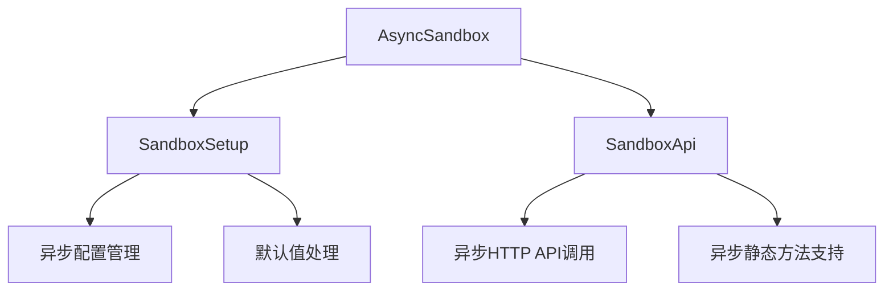
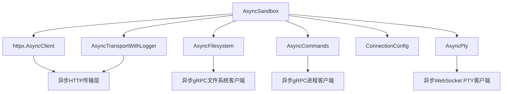
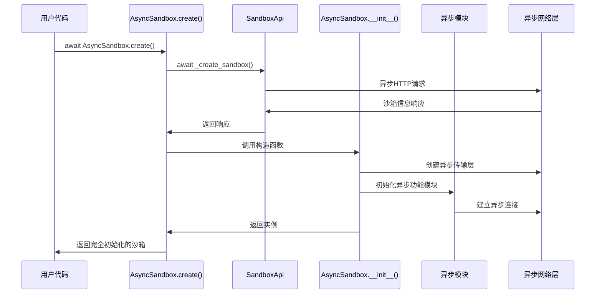
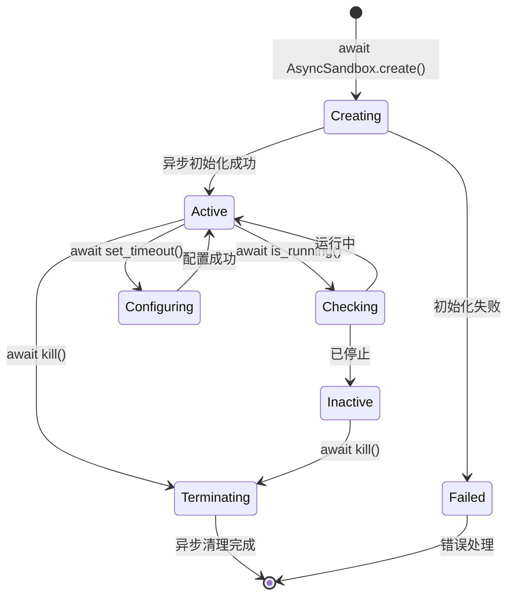
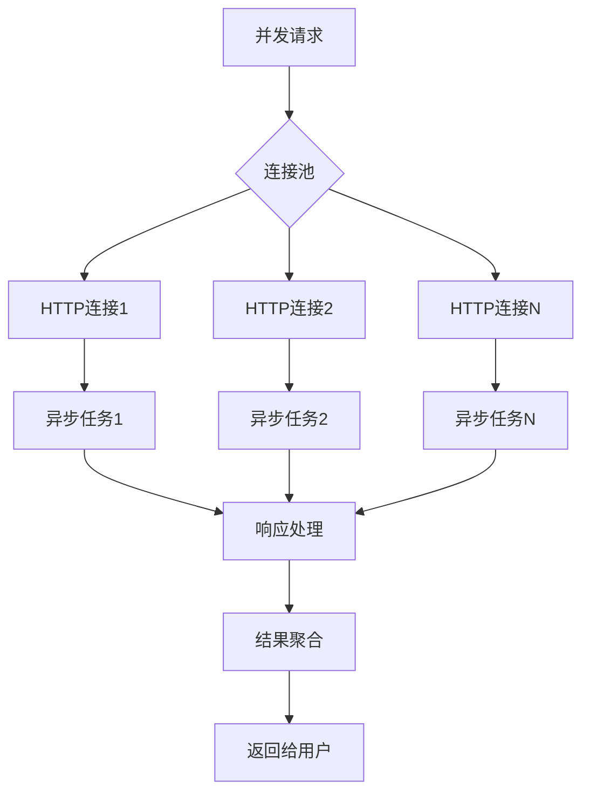
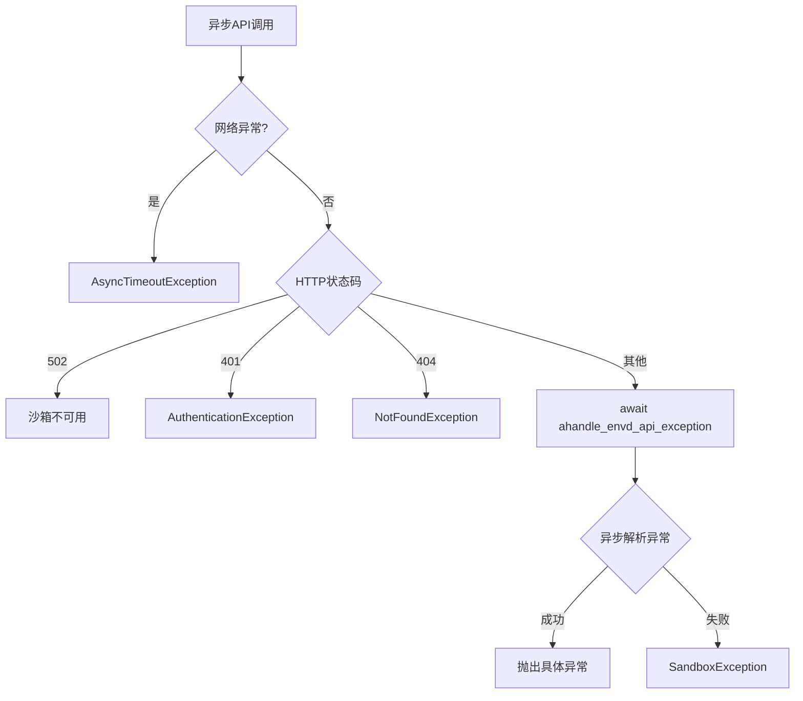

# sandbox_async/main.py - E2B Python 异步沙箱实现

> 基于五步显化法的 Python 代码深度解析

---

## 一、定位与使命 (Positioning & Mission)

### 1.1 模块定位

**sandbox_async/main.py 是 E2B Python SDK 的异步沙箱核心实现，为 Python 开发者提供完整的异步沙箱操作接口，支持高并发、非阻塞的文件系统、命令执行、PTY 交互等全套沙箱功能。**

### 1.2 核心问题

此文件旨在解决以下关键问题：

1. **高性能异步沙箱接口**
   - 提供完整的异步编程模型，支持 asyncio 生态
   - 非阻塞的 HTTP 和 gRPC 通信
   - 高并发场景下的沙箱操作优化

2. **工厂模式的沙箱创建**
   - 通过 `create()` 类方法实现异步初始化
   - 分离对象构造和异步资源初始化
   - 支持创建新沙箱和连接已有沙箱

3. **异步生命周期管理**
   - 异步上下文管理器支持
   - 非阻塞的健康检查和状态监控
   - 异步的超时设置和沙箱终止

### 1.3 应用场景

#### 场景一：异步沙箱基础操作
```python
import asyncio
from e2b import AsyncSandbox

async def basic_async_operations():
    # 创建异步沙箱
    sandbox = await AsyncSandbox.create()
    print(f"Sandbox ID: {sandbox.sandbox_id}")
    
    # 异步执行命令
    result = await sandbox.commands.run("echo 'Hello Async E2B'")
    print(f"Output: {result.stdout}")
    
    # 异步文件操作
    await sandbox.files.write("/tmp/async_test.txt", "Hello Async World")
    content = await sandbox.files.read("/tmp/async_test.txt")
    print(f"File content: {content}")
    
    # 异步清理沙箱
    await sandbox.kill()

# 运行异步函数
asyncio.run(basic_async_operations())
```

#### 场景二：并发多沙箱操作
```python
import asyncio
from e2b import AsyncSandbox

async def concurrent_sandboxes():
    # 并发创建多个沙箱
    tasks = [
        AsyncSandbox.create(template="python3.11"),
        AsyncSandbox.create(template="nodejs18"),
        AsyncSandbox.create(template="ubuntu22")
    ]
    
    sandboxes = await asyncio.gather(*tasks)
    
    # 并发执行不同任务
    python_task = sandboxes[0].commands.run("python --version")
    node_task = sandboxes[1].commands.run("node --version")
    ubuntu_task = sandboxes[2].commands.run("lsb_release -a")
    
    results = await asyncio.gather(python_task, node_task, ubuntu_task)
    
    for i, result in enumerate(results):
        print(f"Sandbox {i}: {result.stdout}")
    
    # 并发清理所有沙箱
    await asyncio.gather(*[sandbox.kill() for sandbox in sandboxes])

asyncio.run(concurrent_sandboxes())
```

#### 场景三：异步上下文管理器
```python
import asyncio
from e2b import AsyncSandbox

async def async_context_manager():
    # 自动清理的异步沙箱使用
    async with await AsyncSandbox.create(template="python3.11") as sandbox:
        # 异步安装依赖
        await sandbox.commands.run("pip install requests numpy")
        
        # 创建Python脚本
        script_code = '''
import requests
import numpy as np

response = requests.get("https://api.github.com/users/octocat")
data = response.json()
print(f"User: {data['login']}")

arr = np.array([1, 2, 3, 4, 5])
print(f"Mean: {np.mean(arr)}")
'''
        await sandbox.files.write("/app/script.py", script_code)
        
        # 异步执行脚本
        result = await sandbox.commands.run("python /app/script.py")
        print(f"Script output: {result.stdout}")
        
        # 检查沙箱状态
        is_running = await sandbox.is_running()
        print(f"Sandbox still running: {is_running}")
    
    # 沙箱在离开 async with 块时自动终止

asyncio.run(async_context_manager())
```

#### 场景四：Web 应用集成
```python
from fastapi import FastAPI, HTTPException
from e2b import AsyncSandbox
import asyncio

app = FastAPI()

# 沙箱池管理
sandbox_pool = {}

@app.post("/sandbox/create")
async def create_sandbox(template: str = "python3.11"):
    try:
        sandbox = await AsyncSandbox.create(template=template)
        sandbox_id = sandbox.sandbox_id
        sandbox_pool[sandbox_id] = sandbox
        return {"sandbox_id": sandbox_id, "status": "created"}
    except Exception as e:
        raise HTTPException(status_code=500, detail=str(e))

@app.post("/sandbox/{sandbox_id}/execute")
async def execute_command(sandbox_id: str, command: str):
    if sandbox_id not in sandbox_pool:
        raise HTTPException(status_code=404, detail="Sandbox not found")
    
    sandbox = sandbox_pool[sandbox_id]
    
    try:
        # 并发检查状态和执行命令
        is_running_task = sandbox.is_running()
        execute_task = sandbox.commands.run(command)
        
        is_running, result = await asyncio.gather(is_running_task, execute_task)
        
        if not is_running:
            raise HTTPException(status_code=400, detail="Sandbox is not running")
        
        return {
            "stdout": result.stdout,
            "stderr": result.stderr,
            "exit_code": result.exit_code
        }
    except Exception as e:
        raise HTTPException(status_code=500, detail=str(e))

@app.delete("/sandbox/{sandbox_id}")
async def delete_sandbox(sandbox_id: str):
    if sandbox_id not in sandbox_pool:
        raise HTTPException(status_code=404, detail="Sandbox not found")
    
    try:
        await sandbox_pool[sandbox_id].kill()
        del sandbox_pool[sandbox_id]
        return {"status": "deleted"}
    except Exception as e:
        raise HTTPException(status_code=500, detail=str(e))
```

#### 场景五：流式数据处理
```python
import asyncio
from e2b import AsyncSandbox

async def stream_processing():
    sandbox = await AsyncSandbox.create(template="python3.11")
    
    # 创建流式处理脚本
    stream_script = '''
import sys
import time

for i in range(10):
    print(f"Processing item {i+1}/10")
    sys.stdout.flush()
    time.sleep(0.5)
print("Processing complete!")
'''
    
    await sandbox.files.write("/app/stream.py", stream_script)
    
    # 异步启动后台命令
    handle = await sandbox.commands.run(
        "python /app/stream.py", 
        background=True
    )
    
    # 异步监听输出
    async def monitor_output():
        while True:
            try:
                # 异步检查命令状态
                if await handle.finished():
                    break
                await asyncio.sleep(0.1)
            except Exception:
                break
    
    # 并发监听输出和其他操作
    monitor_task = asyncio.create_task(monitor_output())
    info_task = asyncio.create_task(sandbox.get_info())
    
    # 等待任务完成
    await asyncio.gather(monitor_task, info_task)
    
    # 获取最终结果
    result = await handle.wait()
    print(f"Final output: {result.stdout}")
    
    await sandbox.kill()

asyncio.run(stream_processing())
```

### 1.4 能力边界

**此模块做什么：**
- 提供完整的异步沙箱操作接口
- 支持高并发、非阻塞的沙箱管理
- 实现异步上下文管理器协议
- 优化网络 I/O 和资源使用
- 提供工厂模式的异步初始化

**此模块不做什么：**
- 不提供同步编程接口（由 Sandbox 负责）
- 不直接管理异步任务调度
- 不处理复杂的异步锁和同步原语
- 不提供内置的连接池管理

---

## 二、设计思想与哲学基石 (Design Philosophy & Foundational Principles)

### 2.1 工厂模式与异步初始化

```python
class AsyncSandbox:
    def __init__(self, **opts: Unpack[AsyncSandboxOpts]):
        """私有构造函数，不直接暴露给用户"""
        super().__init__()
        # 只初始化同步属性
        
    @classmethod
    async def create(cls, ...):
        """异步工厂方法，处理异步初始化"""
        # 异步创建沙箱
        response = await SandboxApi._create_sandbox(...)
        # 返回完全初始化的实例
        return cls(...)
```

分离对象构造和异步资源初始化。

### 2.2 TypedDict 类型安全

```python
class AsyncSandboxOpts(TypedDict):
    sandbox_id: str
    sandbox_domain: Optional[str]
    envd_version: Optional[str]
    envd_access_token: Optional[str]
    connection_config: ConnectionConfig
```

使用 TypedDict 确保初始化参数的类型安全。

### 2.3 异步上下文管理器

```python
async def __aenter__(self):
    return self

async def __aexit__(self, exc_type, exc_value, traceback):
    await self.kill()
```

支持 `async with` 语句的异步资源管理。

### 2.4 异步传输层

```python
class AsyncTransportWithLogger(httpx.AsyncHTTPTransport):
    async def handle_async_request(self, request):
        # 异步请求处理
        url = f"{request.url.scheme}://{request.url.host}{request.url.path}"
        logger.info(f"Request: {request.method} {url}")
        response = await super().handle_async_request(request)
        logger.info(f"Response: {response.status_code} {url}")
        return response
```

专门的异步传输层实现。

### 2.5 一致的异步接口设计

```python
# 所有公共方法都是异步的
async def is_running(self, ...) -> bool: ...
async def kill(self, ...) -> bool: ...
async def set_timeout(self, ...) -> None: ...
async def get_info(self, ...) -> SandboxInfo: ...
```

保持所有接口的异步一致性。

---

## 三、核心数据结构定义 (Core Data Structure Definitions)

### 3.1 异步沙箱配置选项

```python
class AsyncSandboxOpts(TypedDict):
    """异步沙箱初始化选项"""
    sandbox_id: str                          # 沙箱ID
    sandbox_domain: Optional[str]            # 沙箱域名
    envd_version: Optional[str]              # envd版本
    envd_access_token: Optional[str]         # 访问令牌
    connection_config: ConnectionConfig      # 连接配置
```

### 3.2 创建方法参数

```python
CREATE_PARAMS = {
    "template": Optional[str],           # 沙箱模板
    "timeout": Optional[int],            # 超时时间
    "metadata": Optional[Dict[str, str]], # 元数据
    "envs": Optional[Dict[str, str]],     # 环境变量
    "api_key": Optional[str],            # API密钥
    "domain": Optional[str],             # 服务域名
    "debug": Optional[bool],             # 调试模式
    "request_timeout": Optional[float],   # 请求超时
    "proxy": Optional[ProxyTypes],       # 代理配置
    "secure": Optional[bool],            # 安全模式
}
```

### 3.3 异步功能模块

```python
class AsyncSandboxModules:
    """异步沙箱功能模块集合"""
    _filesystem: Filesystem         # 异步文件系统模块
    _commands: Commands            # 异步命令执行模块
    _pty: Pty                     # 异步PTY模块
    _envd_api: httpx.AsyncClient  # 异步HTTP客户端
    _transport: AsyncTransportWithLogger  # 异步传输层
```

### 3.4 连接状态管理

```python
class AsyncConnectionState:
    """异步连接状态"""
    _sandbox_id: str                    # 沙箱标识
    _sandbox_domain: str                # 沙箱域名
    _envd_api_url: str                 # API地址
    _envd_version: Optional[str]        # envd版本
    _envd_access_token: Optional[str]   # 访问令牌
    _connection_config: ConnectionConfig # 连接配置
```

---

## 四、核心接口与逻辑实现 (Core Interface & Logic)

### 4.1 异步工厂方法

```python
@classmethod
async def create(cls, ...):
    """异步创建新沙箱"""
    
    connection_headers = {}
    
    # 调试模式处理
    if debug:
        sandbox_id = "debug_sandbox_id"
        sandbox_domain = None
        envd_version = None
        envd_access_token = None
    else:
        # 异步创建沙箱
        response = await SandboxApi._create_sandbox(
            template=template or cls.default_template,
            timeout=timeout or cls.default_sandbox_timeout,
            # ... 其他参数
        )
        
        # 提取响应数据
        sandbox_id = response.sandbox_id
        sandbox_domain = response.sandbox_domain
        envd_version = response.envd_version
        envd_access_token = response.envd_access_token
        
        # 设置访问令牌
        if envd_access_token and not isinstance(envd_access_token, Unset):
            connection_headers["X-Access-Token"] = envd_access_token
    
    # 创建连接配置
    connection_config = ConnectionConfig(
        api_key=api_key,
        domain=domain,
        debug=debug,
        request_timeout=request_timeout,
        headers=connection_headers,
        proxy=proxy,
    )
    
    # 返回初始化完成的实例
    return cls(
        sandbox_id=sandbox_id,
        sandbox_domain=sandbox_domain,
        envd_version=envd_version,
        envd_access_token=envd_access_token,
        connection_config=connection_config,
    )
```

### 4.2 异步连接方法

```python
@classmethod
async def connect(cls, sandbox_id: str, ...):
    """异步连接已存在的沙箱"""
    
    # 异步获取沙箱信息
    response = await SandboxApi._cls_get_info(
        sandbox_id,
        api_key=api_key,
        domain=domain,
        debug=debug,
        proxy=proxy,
    )
    
    # 处理访问令牌
    connection_headers = {}
    if response._envd_access_token and not isinstance(response._envd_access_token, Unset):
        connection_headers["X-Access-Token"] = response._envd_access_token
    
    # 创建连接配置
    connection_config = ConnectionConfig(
        api_key=api_key,
        domain=domain,
        debug=debug,
        headers=connection_headers,
        proxy=proxy,
    )
    
    return cls(
        sandbox_id=sandbox_id,
        sandbox_domain=response.sandbox_domain,
        connection_config=connection_config,
        envd_version=response.envd_version,
        envd_access_token=response._envd_access_token,
    )
```

### 4.3 内部初始化逻辑

```python
def __init__(self, **opts: Unpack[AsyncSandboxOpts]):
    """内部初始化，由工厂方法调用"""
    super().__init__()
    
    # 设置连接配置
    self._connection_config = opts["connection_config"]
    
    # 设置沙箱基本信息
    self._sandbox_id = opts["sandbox_id"]
    self._sandbox_domain = opts["sandbox_domain"] or self.connection_config.domain
    self._envd_version = opts["envd_version"]
    self._envd_access_token = opts["envd_access_token"]
    
    # 构建API URL
    self._envd_api_url = (
        f"{'http' if self.connection_config.debug else 'https'}://"
        f"{self.get_host(self.envd_port)}"
    )
    
    # 初始化异步传输层
    self._transport = AsyncTransportWithLogger(
        limits=self._limits, 
        proxy=self._connection_config.proxy
    )
    
    # 初始化异步HTTP客户端
    self._envd_api = httpx.AsyncClient(
        base_url=self.envd_api_url,
        transport=self._transport,
        headers=self._connection_config.headers,
    )
    
    # 初始化功能模块
    self._initialize_modules()
```

### 4.4 异步健康检查

```python
async def is_running(self, request_timeout: Optional[float] = None) -> bool:
    """异步检查沙箱运行状态"""
    try:
        r = await self._envd_api.get(
            ENVD_API_HEALTH_ROUTE,
            timeout=self.connection_config.get_request_timeout(request_timeout),
        )
        
        # 502表示沙箱不可用
        if r.status_code == 502:
            return False
        
        # 异步处理错误
        err = await ahandle_envd_api_exception(r)
        if err:
            raise err
            
    except httpx.TimeoutException:
        raise format_request_timeout_error()
    
    return True
```

### 4.5 异步方法重载实现

```python
@class_method_variant("_cls_kill")
async def kill(self, request_timeout: Optional[float] = None) -> bool:
    """异步终止沙箱"""
    
    # 准备配置参数
    config_dict = self.connection_config.__dict__
    config_dict.pop("access_token", None)
    config_dict.pop("api_url", None)
    
    if request_timeout:
        config_dict["request_timeout"] = request_timeout
    
    # 异步调用API
    await SandboxApi._cls_kill(
        sandbox_id=self.sandbox_id,
        **config_dict,
    )

@class_method_variant("_cls_set_timeout")
async def set_timeout(self, timeout: int, request_timeout: Optional[float] = None) -> None:
    """异步设置超时"""
    
    config_dict = self.connection_config.__dict__
    config_dict.pop("access_token", None)
    config_dict.pop("api_url", None)
    
    if request_timeout:
        config_dict["request_timeout"] = request_timeout
    
    await SandboxApi._cls_set_timeout(
        sandbox_id=self.sandbox_id,
        timeout=timeout,
        **config_dict,
    )

@class_method_variant("_cls_get_info")
async def get_info(self, request_timeout: Optional[float] = None) -> SandboxInfo:
    """异步获取沙箱信息"""
    
    config_dict = self.connection_config.__dict__
    config_dict.pop("access_token", None)
    config_dict.pop("api_url", None)
    
    if request_timeout:
        config_dict["request_timeout"] = request_timeout
    
    return await SandboxApi._cls_get_info(
        sandbox_id=self.sandbox_id,
        **config_dict,
    )
```

### 4.6 功能模块初始化

```python
def _initialize_modules(self):
    """初始化异步功能模块"""
    
    # 异步文件系统模块
    self._filesystem = Filesystem(
        self.envd_api_url,
        self._envd_version,
        self.connection_config,
        self._transport._pool,
        self._envd_api,
    )
    
    # 异步命令执行模块
    self._commands = Commands(
        self.envd_api_url,
        self.connection_config,
        self._transport._pool,
    )
    
    # 异步PTY模块
    self._pty = Pty(
        self.envd_api_url,
        self.connection_config,
        self._transport._pool,
    )
```

---

## 五、依赖关系与交互 (Dependencies & Interactions)

### 5.1 异步类继承关系



### 5.2 异步模块依赖图



### 5.3 异步初始化序列图



### 5.4 异步生命周期管理



### 5.5 并发控制和资源管理



### 5.6 异步错误处理流程



### 5.7 与同步版本的对比

| 特性 | 同步版本 (Sandbox) | 异步版本 (AsyncSandbox) |
|------|-------------------|------------------------|
| **初始化** | `Sandbox()` | `await AsyncSandbox.create()` |
| **连接** | `Sandbox.connect()` | `await AsyncSandbox.connect()` |
| **上下文管理** | `with sandbox:` | `async with sandbox:` |
| **方法调用** | `sandbox.is_running()` | `await sandbox.is_running()` |
| **并发支持** | 多线程 | 原生异步并发 |
| **资源使用** | 线程开销 | 协程轻量级 |
| **适用场景** | 简单脚本 | Web应用、高并发 |

### 5.8 异步集成模式

```python
# 1. FastAPI集成
@app.post("/execute")
async def execute_code(code: str):
    sandbox = await AsyncSandbox.create()
    try:
        result = await sandbox.commands.run(f"python -c '{code}'")
        return {"output": result.stdout}
    finally:
        await sandbox.kill()

# 2. aiohttp集成
async def handle_request(request):
    sandbox = await AsyncSandbox.create()
    # ... 处理逻辑
    await sandbox.kill()
    return web.Response(text="Done")

# 3. 异步任务队列
async def process_job(job_data):
    async with await AsyncSandbox.create() as sandbox:
        # 处理任务
        result = await sandbox.commands.run(job_data['command'])
        return result
```

### 5.9 性能优化策略

```python
# 1. 连接复用
class SandboxPool:
    def __init__(self):
        self._pool = asyncio.Queue(maxsize=10)
    
    async def get_sandbox(self):
        if self._pool.empty():
            return await AsyncSandbox.create()
        return await self._pool.get()
    
    async def return_sandbox(self, sandbox):
        if not self._pool.full():
            await self._pool.put(sandbox)
        else:
            await sandbox.kill()

# 2. 批量操作
async def batch_execute(commands):
    sandbox = await AsyncSandbox.create()
    tasks = [sandbox.commands.run(cmd) for cmd in commands]
    results = await asyncio.gather(*tasks)
    await sandbox.kill()
    return results
```

---

## 总结

sandbox_async/main.py 作为 E2B Python SDK 的异步沙箱核心实现，通过工厂模式、异步上下文管理器、类型安全的初始化选项等现代 Python 异步编程技术，为开发者提供了高性能、易用、功能完整的异步沙箱操作接口。它不仅完美适配 asyncio 生态系统，还通过原生的异步支持实现了高并发、低资源占用的沙箱操作，是构建现代异步 Python 应用的理想选择。