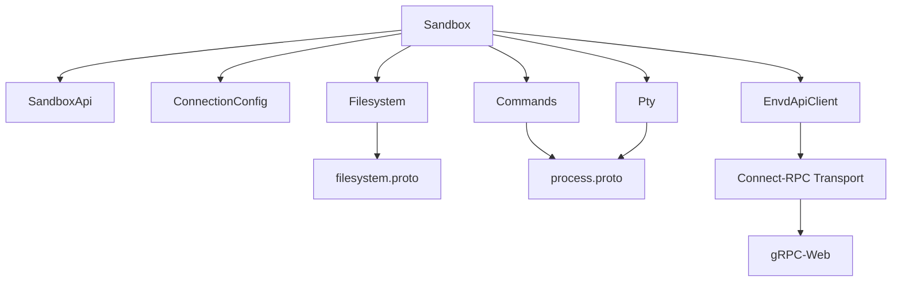
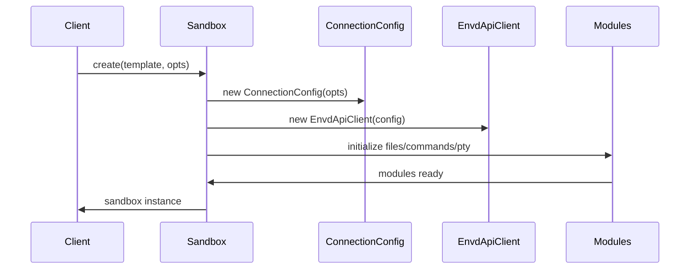

# sandbox/index.ts - E2B Sandbox 核心类实现

> 基于五步显化法的 TypeScript 代码深度解析

---

## 一、定位与使命 (Positioning & Mission)

### 1.1 模块定位

**sandbox/index.ts 是 E2B JavaScript SDK 的核心入口文件，实现了 Sandbox 类，为开发者提供统一、简洁的沙箱管理和操作接口。**

### 1.2 核心问题

此文件旨在解决以下关键问题：

1. **沙箱生命周期管理**
   - 统一的沙箱创建、连接、销毁接口
   - 支持模板化创建和自定义配置
   - 提供沙箱状态检查和超时控制

2. **多模块统一入口**
   - 将文件系统、命令执行、PTY 等功能模块整合
   - 提供一致的 API 风格和错误处理
   - 简化客户端代码的复杂性

3. **网络和连接管理**
   - 处理 gRPC 连接和 HTTP API 调用
   - 支持安全连接和访问控制
   - 提供重定向和边缘运行时支持

### 1.3 应用场景

#### 场景一：快速创建并使用沙箱
```typescript
// 创建默认沙箱并执行代码
const sandbox = await Sandbox.create()
const result = await sandbox.commands.run('python', ['-c', 'print("Hello, World!")'])
console.log(result.stdout) // "Hello, World!"
await sandbox.kill()
```

#### 场景二：使用自定义模板和配置
```typescript
// 使用 Python 模板创建沙箱
const sandbox = await Sandbox.create('python', {
  envs: { 'PYTHONPATH': '/app' },
  timeoutMs: 600_000, // 10 分钟
  metadata: { 'project': 'ai-model-training' }
})
```

#### 场景三：连接到现有沙箱
```typescript
// 在不同环境中连接到同一个沙箱
const sandboxId = 'existing-sandbox-id'
const sandbox = await Sandbox.connect(sandboxId)
const isRunning = await sandbox.isRunning()
```

### 1.4 能力边界

**此模块做什么：**
- 提供沙箱的完整生命周期管理
- 整合文件系统、命令执行、PTY 功能
- 处理网络连接和安全认证
- 提供文件上传下载的 URL 生成

**此模块不做什么：**
- 不直接处理文件内容的读写（委托给 Filesystem 模块）
- 不执行具体的命令（委托给 Commands 模块）
- 不管理多个沙箱实例的关系
- 不提供沙箱间的通信功能

---

## 二、设计思想与哲学基石 (Design Philosophy & Foundational Principles)

### 2.1 组合优于继承

Sandbox 类通过组合模式整合各种功能模块：

```typescript
export class Sandbox extends SandboxApi {
  readonly files: Filesystem     // 文件系统模块
  readonly commands: Commands    // 命令执行模块  
  readonly pty: Pty             // PTY 模块
}
```

这种设计使得各模块职责清晰，易于测试和维护。

### 2.2 工厂模式与构建器模式的结合

```typescript
// 工厂方法创建
static async create(opts?: SandboxOpts): Promise<InstanceType<S>>
static async create(template: string, opts?: SandboxOpts): Promise<InstanceType<S>>

// 连接工厂方法
static async connect(sandboxId: string, opts?: SandboxOpts): Promise<InstanceType<S>>
```

提供多种创建方式，满足不同使用场景。

### 2.3 类型安全优先

```typescript
export interface SandboxOpts extends ConnectionOpts {
  metadata?: Record<string, string>
  envs?: Record<string, string>
  timeoutMs?: number
  secure?: boolean
}

export interface SandboxUrlOpts {
  useSignature?: true
  useSignatureExpiration?: number
  user?: Username
}
```

完整的 TypeScript 类型定义确保编译时错误检查。

### 2.4 错误处理的一致性

```typescript
// 统一错误处理模式
const err = await handleEnvdApiError(res)
if (err) {
  throw err
}
```

所有 API 调用都采用一致的错误处理策略。

---

## 三、核心数据结构定义 (Core Data Structure Definitions)

### 3.1 配置接口定义

```typescript
// 沙箱创建选项
export interface SandboxOpts extends ConnectionOpts {
  metadata?: Record<string, string>    // 自定义元数据
  envs?: Record<string, string>        // 环境变量
  timeoutMs?: number                   // 超时时间(毫秒)
  secure?: boolean                     // 安全模式
}

// URL 生成选项
export interface SandboxUrlOpts {
  useSignature?: true                  // 使用签名
  useSignatureExpiration?: number      // 签名过期时间
  user?: Username                      // 用户名
}
```

### 3.2 类核心属性

```typescript
export class Sandbox extends SandboxApi {
  // 静态默认值
  protected static readonly defaultTemplate: string = 'base'
  protected static readonly defaultSandboxTimeoutMs = 300_000
  
  // 功能模块
  readonly files: Filesystem           // 文件系统操作
  readonly commands: Commands          // 命令执行
  readonly pty: Pty                   // 伪终端
  
  // 身份标识
  readonly sandboxId: string          // 沙箱ID
  readonly sandboxDomain: string      // 沙箱域名
  
  // 连接配置
  protected readonly envdPort = 49983
  protected readonly connectionConfig: ConnectionConfig
  private readonly envdApiUrl: string
  private readonly envdAccessToken?: string
  private readonly envdApi: EnvdApiClient
}
```

### 3.3 构造函数参数类型

```typescript
constructor(
  opts: Omit<SandboxOpts, 'timeoutMs' | 'envs' | 'metadata'> & {
    sandboxId: string
    sandboxDomain?: string
    envdVersion?: string
    envdAccessToken?: string
  }
)
```

构造函数接受去除某些字段的选项，并添加运行时必需的字段。

---

## 四、核心接口与逻辑实现 (Core Interface & Logic)

### 4.1 工厂方法实现

```typescript
// 重载方法支持多种创建方式
static async create<S extends typeof Sandbox>(
  this: S,
  opts?: SandboxOpts
): Promise<InstanceType<S>>

static async create<S extends typeof Sandbox>(
  this: S,
  template: string,
  opts?: SandboxOpts
): Promise<InstanceType<S>>

// 统一实现逻辑
static async create<S extends typeof Sandbox>(
  this: S,
  templateOrOpts?: SandboxOpts | string,
  opts?: SandboxOpts
): Promise<InstanceType<S>> {
  const { template, sandboxOpts } = 
    typeof templateOrOpts === 'string'
      ? { template: templateOrOpts, sandboxOpts: opts }
      : { template: this.defaultTemplate, sandboxOpts: templateOrOpts }
  
  // 调试模式处理
  const config = new ConnectionConfig(sandboxOpts)
  if (config.debug) {
    return new this({
      sandboxId: 'debug_sandbox_id',
      ...config,
    }) as InstanceType<S>
  }
  
  // 正常创建流程
  const sandbox = await this.createSandbox(
    template,
    sandboxOpts?.timeoutMs ?? this.defaultSandboxTimeoutMs,
    sandboxOpts
  )
  return new this({ ...sandbox, ...config }) as InstanceType<S>
}
```

### 4.2 连接管理实现

```typescript
// 连接到现有沙箱
static async connect<S extends typeof Sandbox>(
  this: S,
  sandboxId: string,
  opts?: Omit<SandboxOpts, 'metadata' | 'envs' | 'timeoutMs'>
): Promise<InstanceType<S>> {
  const config = new ConnectionConfig(opts)
  const info = await this.getInfo(sandboxId, opts)
  
  return new this({
    sandboxId,
    sandboxDomain: info.sandboxDomain,
    envdAccessToken: info.envdAccessToken,
    envdVersion: info.envdVersion,
    ...config,
  }) as InstanceType<S>
}
```

### 4.3 网络和主机管理

```typescript
// 获取沙箱端口的主机地址
getHost(port: number) {
  if (this.connectionConfig.debug) {
    return `localhost:${port}`
  }
  return `${port}-${this.sandboxId}.${this.sandboxDomain}`
}

// 检查沙箱状态
async isRunning(opts?: Pick<ConnectionOpts, 'requestTimeoutMs'>): Promise<boolean> {
  const signal = this.connectionConfig.getSignal(opts?.requestTimeoutMs)
  const res = await this.envdApi.api.GET('/health', { signal })
  
  if (res.response.status == 502) {
    return false
  }
  
  const err = await handleEnvdApiError(res)
  if (err) {
    throw err
  }
  
  return true
}
```

### 4.4 文件操作 URL 生成

```typescript
// 生成上传 URL
async uploadUrl(path?: string, opts?: SandboxUrlOpts) {
  opts = opts ?? {}
  
  // 签名验证
  if (!this.envdAccessToken && opts.useSignature) {
    throw new Error('Signature can be used only when sandbox is spawned with secure option.')
  }
  
  const username = opts.user ?? defaultUsername
  const filePath = path ?? ''
  const fileUrl = this.fileUrl(filePath, username)
  
  // 添加签名支持
  if (opts.useSignature) {
    const url = new URL(fileUrl)
    const sig = await getSignature({
      path: filePath,
      operation: 'write',
      user: username,
      expirationInSeconds: opts.useSignatureExpiration,
      envdAccessToken: this.envdAccessToken,
    })
    
    url.searchParams.set('signature', sig.signature)
    if (sig.expiration) {
      url.searchParams.set('signature_expiration', sig.expiration.toString())
    }
    
    return url.toString()
  }
  
  return fileUrl
}
```

---

## 五、依赖关系与交互 (Dependencies & Interactions)

### 5.1 模块依赖图



### 5.2 构造过程中的初始化流程



### 5.3 与外部系统的交互

| 交互对象 | 交互方式 | 用途 |
|---------|---------|------|
| E2B API Server | HTTP REST | 沙箱创建、查询、销毁 |
| Envd Service | gRPC-Web | 文件系统和进程操作 |
| Authentication | HTTP Headers | 访问控制和签名验证 |
| Edge Runtime | Fetch API | 支持边缘计算环境 |

### 5.4 核心方法调用链

```typescript
// 创建沙箱的完整调用链
Sandbox.create()
  └── ConnectionConfig()
  └── createSandbox() // 继承自 SandboxApi
      └── HTTP POST /sandboxes
  └── new Sandbox()
      └── EnvdApiClient()
      └── createConnectTransport()
      └── new Filesystem()
      └── new Commands()
      └── new Pty()
```

### 5.5 错误处理链

```typescript
// 统一的错误处理流程
API Call → handleEnvdApiError() → throw Error
       → gRPC Error → Connect Error Handler
       → Network Error → Fetch Error Handler
```

### 5.6 扩展点和定制化

1. **自定义传输层**
   ```typescript
   // 可以自定义 gRPC 传输配置
   const rpcTransport = createConnectTransport({
     baseUrl: this.envdApiUrl,
     interceptors: [customLogger, customAuth],
     fetch: customFetchImplementation,
   })
   ```

2. **模块替换**
   ```typescript
   // 子类可以覆盖模块初始化
   class CustomSandbox extends Sandbox {
     constructor(opts) {
       super(opts)
       this.files = new CustomFilesystem(...)
     }
   }
   ```

3. **调试支持**
   ```typescript
   // 调试模式下使用本地沙箱
   if (config.debug) {
     return new this({
       sandboxId: 'debug_sandbox_id',
       ...config,
     })
   }
   ```

---

## 总结

sandbox/index.ts 作为 E2B JavaScript SDK 的核心入口，通过精心设计的类层次结构和模块组合，为开发者提供了简洁而强大的沙箱操作接口。它不仅处理了复杂的网络通信和状态管理，还通过工厂模式和组合模式实现了高度的灵活性和可扩展性，是整个 SDK 的重要基石。