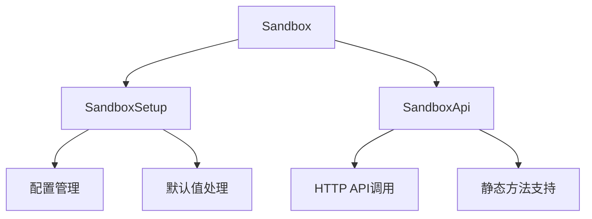
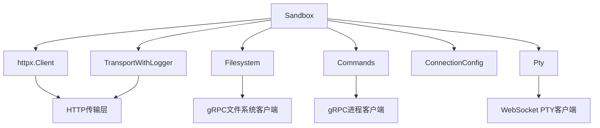
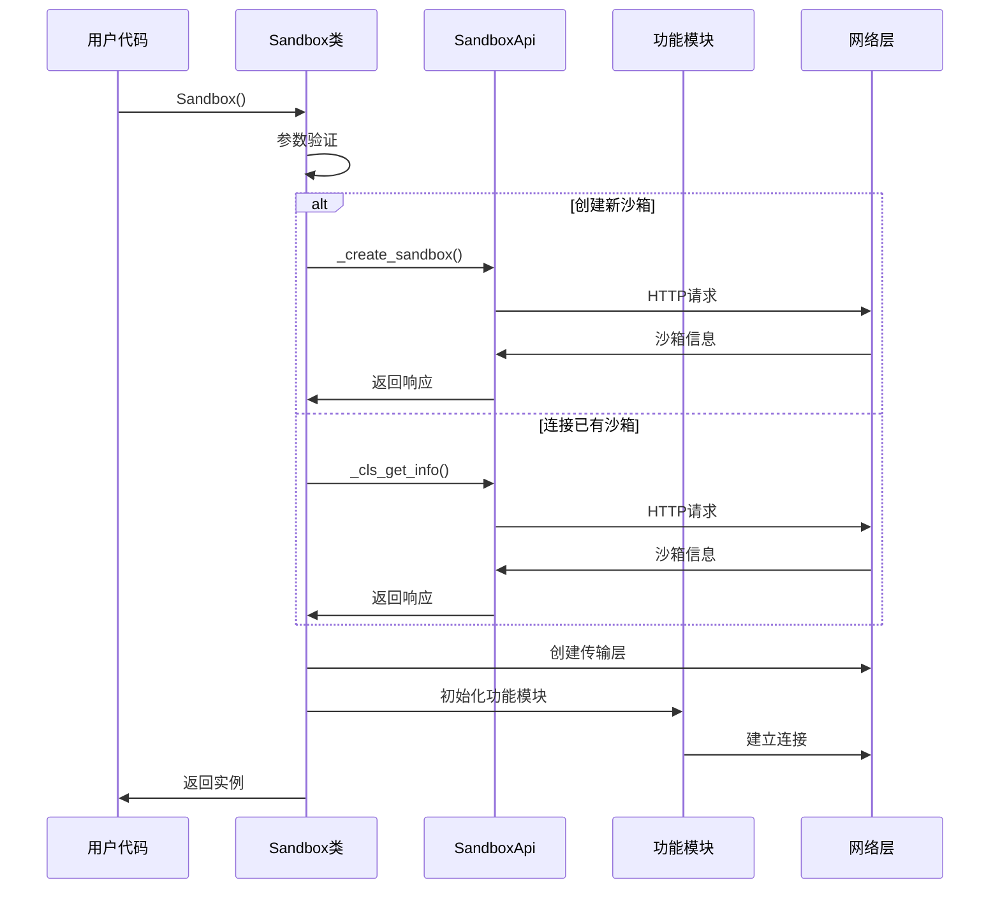
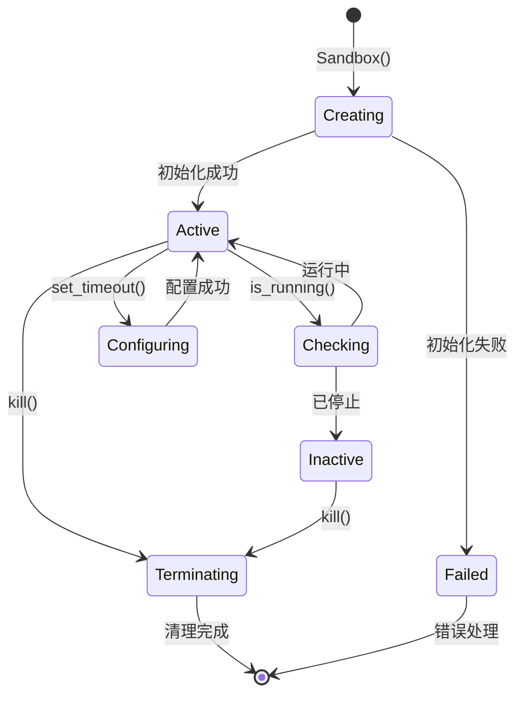
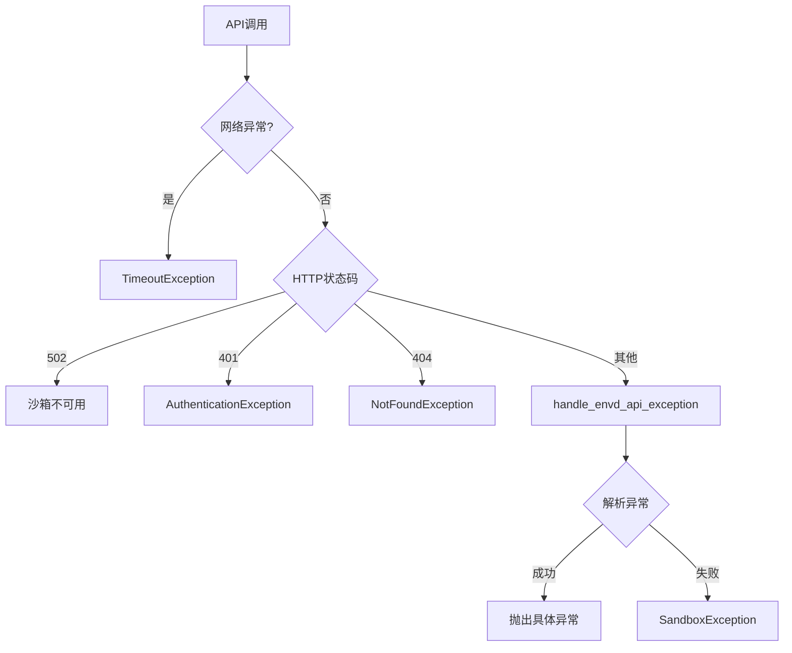

# sandbox_sync/main.py - E2B Python 同步沙箱实现

> 基于五步显化法的 Python 代码深度解析

---

## 一、定位与使命 (Positioning & Mission)

### 1.1 模块定位

**sandbox_sync/main.py 是 E2B Python SDK 的同步沙箱核心实现，为 Python 开发者提供完整的同步沙箱操作接口，支持文件系统、命令执行、PTY 交互等全套沙箱功能。**

### 1.2 核心问题

此文件旨在解决以下关键问题：

1. **统一的同步沙箱接口**
   - 提供完整的同步编程模型
   - 封装复杂的 HTTP 和 gRPC 通信细节
   - 统一文件系统、命令执行、PTY 等功能模块

2. **灵活的沙箱生命周期管理**
   - 支持创建新沙箱和连接已有沙箱
   - 提供健康检查和状态监控
   - 支持超时设置和沙箱终止

3. **强大的错误处理和容错机制**
   - 统一的异常处理体系
   - 网络超时和连接失败处理
   - 调试模式支持

### 1.3 应用场景

#### 场景一：基础沙箱操作
```python
from e2b import Sandbox

# 创建默认沙箱
sandbox = Sandbox()
print(f"Sandbox ID: {sandbox.sandbox_id}")

# 执行简单命令
result = sandbox.commands.run("echo 'Hello E2B'")
print(f"Output: {result.stdout}")

# 文件操作
sandbox.files.write("/tmp/test.txt", "Hello World")
content = sandbox.files.read("/tmp/test.txt")
print(f"File content: {content}")

# 清理沙箱
sandbox.kill()
```

#### 场景二：自定义模板和配置
```python
# 使用自定义模板创建沙箱
sandbox = Sandbox(
    template="python3.11",
    timeout=3600,  # 1小时超时
    metadata={"project": "my-ai-app", "version": "1.0"},
    envs={"PYTHONPATH": "/app", "DEBUG": "true"},
    api_key="your-api-key"
)

# 检查沙箱运行状态
if sandbox.is_running():
    print("Sandbox is active")
    info = sandbox.get_info()
    print(f"Template: {info.template}")
    print(f"Started at: {info.started_at}")
```

#### 场景三：连接已有沙箱
```python
# 连接到已存在的沙箱
existing_sandbox = Sandbox.connect("sandbox-123abc")

# 继续在同一沙箱中工作
result = existing_sandbox.commands.run("pwd")
print(f"Current directory: {result.stdout}")

# 扩展沙箱超时
existing_sandbox.set_timeout(1800)  # 30分钟
```

#### 场景四：上下文管理器使用
```python
# 自动清理的沙箱使用
with Sandbox(template="nodejs18") as sandbox:
    # 安装依赖
    sandbox.commands.run("npm install express")
    
    # 创建应用文件
    app_code = '''
    const express = require('express');
    const app = express();
    app.get('/', (req, res) => res.send('Hello World'));
    app.listen(3000);
    '''
    sandbox.files.write("/app/server.js", app_code)
    
    # 启动应用
    handle = sandbox.commands.run("node /app/server.js", background=True)
    
    # 测试应用
    test_result = sandbox.commands.run("curl localhost:3000")
    print(f"Server response: {test_result.stdout}")
    
# 沙箱在离开 with 块时自动终止
```

#### 场景五：调试和开发模式
```python
# 调试模式沙箱
debug_sandbox = Sandbox(
    debug=True,
    request_timeout=60.0
)

# 使用代理
proxy_sandbox = Sandbox(
    proxy={
        "http": "http://proxy.example.com:8080",
        "https": "https://proxy.example.com:8080"
    }
)
```

### 1.4 能力边界

**此模块做什么：**
- 提供完整的同步沙箱操作接口
- 管理沙箱的完整生命周期
- 封装底层通信和协议细节
- 提供统一的错误处理机制
- 支持多种身份验证和配置选项

**此模块不做什么：**
- 不提供异步编程接口（由 AsyncSandbox 负责）
- 不直接处理底层 gRPC 协议细节
- 不管理多个沙箱的集群操作
- 不提供沙箱资源监控和计费功能

---

## 二、设计思想与哲学基石 (Design Philosophy & Foundational Principles)

### 2.1 继承与组合设计

```python
class Sandbox(SandboxSetup, SandboxApi):
    """多重继承实现功能组合"""
    
    # 从 SandboxSetup 继承配置管理能力
    # 从 SandboxApi 继承 API 调用能力
    
    def __init__(self, ...):
        super().__init__()  # 调用父类初始化
```

通过多重继承将配置管理和 API 调用能力组合到一起。

### 2.2 属性封装和访问控制

```python
@property
def files(self) -> Filesystem:
    """模块访问的统一接口"""
    return self._filesystem

@property
def _envd_access_token(self) -> str:
    """私有属性的保护访问"""
    return self.__envd_access_token

@_envd_access_token.setter
def _envd_access_token(self, value: Optional[str]):
    """受控的属性修改"""
    self.__envd_access_token = value
```

清晰区分公共接口和私有实现。

### 2.3 方法重载与多态

```python
@overload
def kill(self, request_timeout: Optional[float] = None) -> bool:
    """实例方法签名"""
    ...

@overload
@staticmethod
def kill(
    sandbox_id: str,
    api_key: Optional[str] = None,
    # ... 其他参数
) -> bool:
    """静态方法签名"""
    ...

@class_method_variant("_cls_kill")
def kill(self, request_timeout: Optional[float] = None) -> bool:
    """实际实现，支持两种调用方式"""
```

通过重载支持实例方法和静态方法两种使用模式。

### 2.4 上下文管理器协议

```python
def __enter__(self):
    return self

def __exit__(self, exc_type, exc_value, traceback):
    self.kill()
```

支持 `with` 语句的资源自动管理。

### 2.5 调试友好的网络传输

```python
class TransportWithLogger(httpx.HTTPTransport):
    def handle_request(self, request):
        url = f"{request.url.scheme}://{request.url.host}{request.url.path}"
        logger.info(f"Request: {request.method} {url}")
        response = super().handle_request(request)
        logger.info(f"Response: {response.status_code} {url}")
        return response
```

增强的传输层提供请求和响应的详细日志。

---

## 三、核心数据结构定义 (Core Data Structure Definitions)

### 3.1 沙箱初始化参数

```python
SANDBOX_INIT_PARAMS = {
    "template": Optional[str],           # 沙箱模板名称或ID
    "timeout": Optional[int],            # 沙箱超时时间（秒）
    "metadata": Optional[Dict[str, str]], # 自定义元数据
    "envs": Optional[Dict[str, str]],     # 环境变量
    "secure": Optional[bool],            # 安全模式
    "api_key": Optional[str],            # API密钥
    "domain": Optional[str],             # 服务域名
    "debug": Optional[bool],             # 调试模式
    "sandbox_id": Optional[str],         # 已存在的沙箱ID
    "request_timeout": Optional[float],   # 请求超时
    "proxy": Optional[ProxyTypes],       # 代理配置
}
```

### 3.2 沙箱状态和连接信息

```python
class SandboxState:
    """沙箱运行时状态"""
    sandbox_id: str                 # 沙箱唯一标识
    sandbox_domain: str             # 沙箱域名
    envd_version: str               # envd服务版本
    envd_access_token: str          # 访问令牌
    envd_api_url: str              # API服务地址
    connection_config: ConnectionConfig  # 连接配置
```

### 3.3 功能模块实例

```python
class SandboxModules:
    """沙箱功能模块集合"""
    _filesystem: Filesystem         # 文件系统操作模块
    _commands: Commands            # 命令执行模块
    _pty: Pty                     # 伪终端交互模块
    _envd_api: httpx.Client       # HTTP API客户端
    _transport: TransportWithLogger # 增强的传输层
```

### 3.4 网络和传输配置

```python
class NetworkConfig:
    """网络传输配置"""
    _limits: httpx.Limits          # HTTP连接限制
    base_url: str                  # 基础URL
    headers: Dict[str, str]        # 请求头
    transport: httpx.HTTPTransport # 传输层实现
    proxy: Optional[ProxyTypes]    # 代理设置
```

---

## 四、核心接口与逻辑实现 (Core Interface & Logic)

### 4.1 沙箱初始化逻辑

```python
def __init__(self, ...):
    """沙箱初始化的三种模式"""
    
    # 1. 参数验证
    if sandbox_id and (metadata is not None or template is not None):
        raise SandboxException("Cannot set metadata when connecting to existing sandbox")
    
    # 2. 调试模式
    if debug:
        self._sandbox_id = "debug_sandbox_id"
        self._sandbox_domain = None
        self._envd_version = None
        self._envd_access_token = None
    
    # 3. 连接已有沙箱
    elif sandbox_id is not None:
        response = SandboxApi._cls_get_info(sandbox_id, ...)
        self._sandbox_id = sandbox_id
        self._sandbox_domain = response.sandbox_domain
        self._envd_version = response.envd_version
        self._envd_access_token = response._envd_access_token
    
    # 4. 创建新沙箱
    else:
        template = template or self.default_template
        timeout = timeout or self.default_sandbox_timeout
        response = SandboxApi._create_sandbox(...)
        self._sandbox_id = response.sandbox_id
        self._sandbox_domain = response.sandbox_domain
        self._envd_version = response.envd_version
        self._envd_access_token = response.envd_access_token
```

### 4.2 功能模块初始化

```python
def _initialize_modules(self):
    """初始化各功能模块"""
    
    # HTTP传输层
    self._transport = TransportWithLogger(
        limits=self._limits, 
        proxy=proxy
    )
    
    # API客户端
    self._envd_api = httpx.Client(
        base_url=self.envd_api_url,
        transport=self._transport,
        headers=self.connection_config.headers,
    )
    
    # 文件系统模块
    self._filesystem = Filesystem(
        self.envd_api_url,
        self._envd_version,
        self.connection_config,
        self._transport._pool,
        self._envd_api,
    )
    
    # 命令执行模块
    self._commands = Commands(
        self.envd_api_url,
        self.connection_config,
        self._transport._pool,
    )
    
    # PTY模块
    self._pty = Pty(
        self.envd_api_url,
        self.connection_config,
        self._transport._pool,
    )
```

### 4.3 健康检查实现

```python
def is_running(self, request_timeout: Optional[float] = None) -> bool:
    """检查沙箱运行状态"""
    try:
        r = self._envd_api.get(
            ENVD_API_HEALTH_ROUTE,
            timeout=self.connection_config.get_request_timeout(request_timeout),
        )
        
        # 502 表示沙箱不可用
        if r.status_code == 502:
            return False
        
        # 处理其他错误
        err = handle_envd_api_exception(r)
        if err:
            raise err
            
    except httpx.TimeoutException:
        raise format_request_timeout_error()
    
    return True
```

### 4.4 静态连接方法

```python
@classmethod
def connect(cls, sandbox_id: str, ...) -> 'Sandbox':
    """连接到已存在的沙箱"""
    return cls(
        sandbox_id=sandbox_id,
        api_key=api_key,
        domain=domain,
        debug=debug,
        proxy=proxy,
    )
```

### 4.5 重载方法实现

```python
@class_method_variant("_cls_kill")
def kill(self, request_timeout: Optional[float] = None) -> bool:
    """统一的沙箱终止实现"""
    
    # 准备配置参数
    config_dict = self.connection_config.__dict__
    config_dict.pop("access_token", None)
    config_dict.pop("api_url", None)
    
    if request_timeout:
        config_dict["request_timeout"] = request_timeout
    
    # 调用底层API
    SandboxApi._cls_kill(
        sandbox_id=self.sandbox_id,
        **config_dict,
    )
```

### 4.6 超时管理

```python
@class_method_variant("_cls_set_timeout")
def set_timeout(self, timeout: int, request_timeout: Optional[float] = None) -> None:
    """动态调整沙箱超时"""
    
    config_dict = self.connection_config.__dict__
    config_dict.pop("access_token", None)
    config_dict.pop("api_url", None)
    
    if request_timeout:
        config_dict["request_timeout"] = request_timeout
    
    SandboxApi._cls_set_timeout(
        sandbox_id=self.sandbox_id,
        timeout=timeout,
        **config_dict,
    )
```

### 4.7 信息获取

```python
@class_method_variant("_cls_get_info")
def get_info(self, request_timeout: Optional[float] = None) -> SandboxInfo:
    """获取沙箱详细信息"""
    
    config_dict = self.connection_config.__dict__
    config_dict.pop("access_token", None)
    config_dict.pop("api_url", None)
    
    if request_timeout:
        config_dict["request_timeout"] = request_timeout
    
    return SandboxApi._cls_get_info(
        sandbox_id=self.sandbox_id,
        **config_dict,
    )
```

---

## 五、依赖关系与交互 (Dependencies & Interactions)

### 5.1 类继承关系



### 5.2 模块依赖图



### 5.3 初始化序列图



### 5.4 生命周期管理



### 5.5 错误处理流程



### 5.6 与其他模块的交互

| 交互目标 | 交互方式 | 数据流向 | 用途 |
|---------|---------|---------|------|
| **Filesystem** | 属性访问 | 双向 | 文件系统操作 |
| **Commands** | 属性访问 | 双向 | 命令执行 |
| **Pty** | 属性访问 | 双向 | 伪终端交互 |
| **SandboxApi** | 方法调用 | 单向 | API请求 |
| **ConnectionConfig** | 组合关系 | 单向 | 连接配置 |
| **httpx.Client** | 组合关系 | 双向 | HTTP通信 |

### 5.7 配置和环境依赖

```python
# 环境变量依赖
ENV_DEPENDENCIES = {
    "E2B_API_KEY": "默认API密钥",
    "E2B_DOMAIN": "默认服务域名", 
    "E2B_DEBUG": "调试模式开关",
}

# 网络端口依赖
PORT_DEPENDENCIES = {
    "envd_port": "49982",      # envd服务端口
    "health_check": "/health", # 健康检查路径
}

# 协议依赖
PROTOCOL_DEPENDENCIES = {
    "http/https": "REST API通信",
    "grpc": "高性能RPC调用",
    "websocket": "PTY实时交互",
}
```

### 5.8 扩展点和插件机制

```python
# 自定义传输层
class CustomTransport(TransportWithLogger):
    def handle_request(self, request):
        # 自定义请求处理逻辑
        return super().handle_request(request)

# 扩展沙箱功能
class ExtendedSandbox(Sandbox):
    def __init__(self, *args, **kwargs):
        super().__init__(*args, **kwargs)
        self._custom_module = CustomModule(...)
    
    @property
    def custom(self):
        return self._custom_module
```

---

## 总结

sandbox_sync/main.py 作为 E2B Python SDK 的同步沙箱核心实现，通过优雅的面向对象设计和多重继承机制，为 Python 开发者提供了完整、易用、功能丰富的沙箱操作接口。它不仅封装了复杂的网络通信和协议细节，还通过属性访问、方法重载、上下文管理器等 Python 特性，提供了符合 Python 编程习惯的API设计，是整个同步SDK的核心基石。