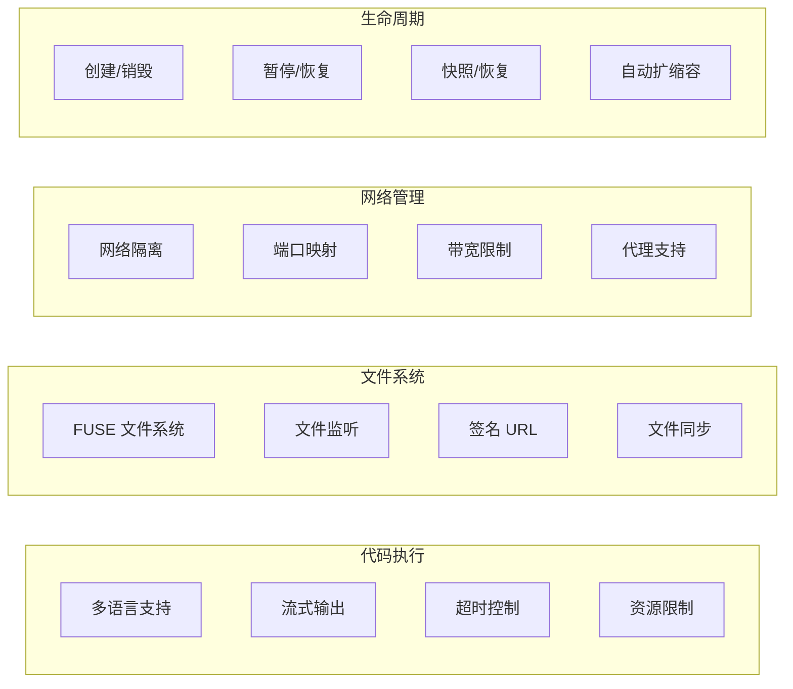
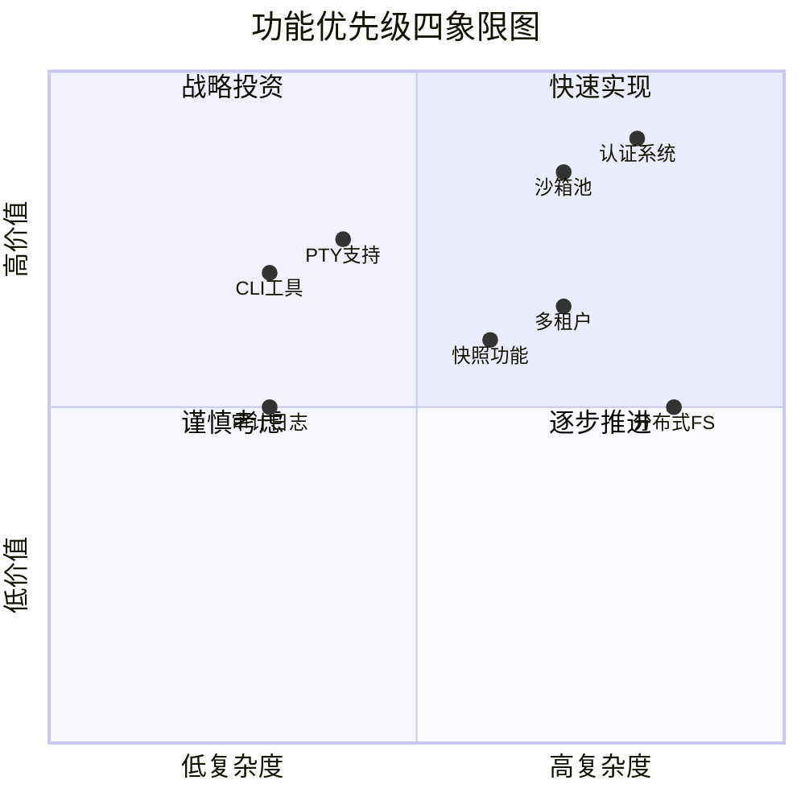

# SoulBox 查缺补漏综合分析报告

> 基于 E2B 功能特性的深度对比分析与改进建议

---

## 📊 执行摘要

经过对 E2B 源代码和架构的深入分析，发现 SoulBox 目前仅实现了约 **40%** 的核心功能。本报告识别出 **22 个关键缺失功能**（包括已知的 10 个），并提供了详细的实现建议和优先级排序。

### 关键发现
- **功能完整度**: 40% (已实现) vs 60% (待实现)
- **新发现缺失功能**: 12 个高优先级功能
- **预计完整实现周期**: 18-24 周
- **技术债务风险**: 中等，需立即开始补充

---

## 一、E2B 核心功能概览

### 1.1 系统架构特性

| 层级 | E2B 功能 | 技术栈 |
|------|----------|---------|
| **客户端层** | 多语言 SDK (JS/TS/Python) | TypeScript, Python |
| **API 网关** | REST/gRPC/WebSocket | Connect-RPC, HTTP/2 |
| **控制平面** | 沙箱生命周期管理 | Go, Kubernetes |
| **数据平面** | envd 守护进程 | Go, gRPC |
| **虚拟化层** | Firecracker 微虚拟机 | Rust, KVM |
| **基础设施** | 分布式存储与网络 | AWS S3/EBS |

### 1.2 核心功能矩阵



---

## 二、SoulBox 当前功能状态

### 2.1 已实现功能 ✅

| 功能类别 | 具体功能 | 实现程度 | 说明 |
|----------|----------|----------|------|
| **核心沙箱** | 进程隔离 | 100% | 基于 Linux namespaces |
| **代码执行** | 多语言支持 | 80% | Python/JS/Ruby/Rust |
| **文件系统** | 基础文件操作 | 70% | 读写、列表、删除 |
| **资源限制** | CPU/内存限制 | 90% | cgroups v2 |
| **网络基础** | 网络隔离 | 60% | 基础 netns |
| **API 接口** | REST API | 50% | 基础 CRUD |

### 2.2 功能完整度分析

```
总体完整度: ████████████░░░░░░░░░░░░ 40%

详细分解:
- 安全隔离: ████████████████████░░░░ 80%
- 代码执行: ████████████████░░░░░░░░ 65%
- 文件系统: ████████████░░░░░░░░░░░░ 50%
- 网络功能: ████████░░░░░░░░░░░░░░░░ 35%
- API 完整性: ██████░░░░░░░░░░░░░░░░░░ 25%
- 开发者工具: ████░░░░░░░░░░░░░░░░░░░░ 15%
```

---

## 三、新发现的缺失功能分析

### 3.1 认证与安全 (P0 - 最高优先级)

#### 1. **多层认证机制** ⭐⭐⭐⭐⭐

E2B 实现了完整的认证链，而 SoulBox 缺少：

```rust
// 需要实现的认证层次
pub struct AuthenticationLayer {
    // API 密钥认证
    api_key: ApiKeyAuth,
    // JWT 令牌认证
    jwt: JwtAuth,
    // mTLS 双向认证
    mtls: MutualTlsAuth,
    // OAuth2 集成
    oauth2: OAuth2Provider,
}

// 建议实现
impl SoulBox {
    pub async fn authenticate_request(
        &self,
        req: &Request,
    ) -> Result<AuthContext, AuthError> {
        // 多层认证逻辑
        let auth_chain = vec![
            self.check_api_key(req),
            self.validate_jwt(req),
            self.verify_mtls(req),
        ];
        
        for auth_method in auth_chain {
            if let Ok(context) = auth_method.await {
                return Ok(context);
            }
        }
        
        Err(AuthError::Unauthorized)
    }
}
```

#### 2. **细粒度权限控制 (RBAC)** ⭐⭐⭐⭐⭐

```rust
// E2B 风格的权限模型
pub struct Permission {
    resource: Resource,
    action: Action,
    conditions: Vec<Condition>,
}

pub enum Resource {
    Sandbox(SandboxId),
    Template(TemplateId),
    File(PathBuf),
    Network(NetworkResource),
}

pub enum Action {
    Create,
    Read,
    Update,
    Delete,
    Execute,
    Connect,
}
```

### 3.2 性能优化功能 (P0)

#### 3. **智能沙箱池管理** ⭐⭐⭐⭐⭐

E2B 的预热池机制大幅提升了启动速度：

```rust
pub struct SandboxPool {
    // 预热的沙箱实例
    warm_pool: Arc<Mutex<Vec<WarmSandbox>>>,
    // 池配置
    config: PoolConfig,
    // 自动补充任务
    refill_task: JoinHandle<()>,
}

pub struct PoolConfig {
    // 每个模板的最小预热数量
    min_warm_instances: HashMap<TemplateId, usize>,
    // 最大池大小
    max_pool_size: usize,
    // 预热策略
    warmup_strategy: WarmupStrategy,
}

impl SandboxPool {
    pub async fn acquire(&self, template: &TemplateId) -> Result<Sandbox> {
        // 优先从预热池获取
        if let Some(warm) = self.get_from_pool(template).await {
            return Ok(warm.activate().await?);
        }
        
        // 否则创建新实例
        self.create_cold(template).await
    }
}
```

#### 4. **动态资源调度器** ⭐⭐⭐⭐

```rust
pub struct ResourceScheduler {
    // 资源使用追踪
    resource_tracker: ResourceTracker,
    // 调度策略
    strategy: SchedulingStrategy,
    // QoS 管理
    qos_manager: QosManager,
}

impl ResourceScheduler {
    pub async fn schedule_sandbox(
        &self,
        requirements: &ResourceRequirements,
    ) -> Result<NodeAssignment> {
        // 智能节点选择
        let best_node = self.strategy.select_node(
            &self.resource_tracker.get_available_nodes(),
            requirements,
        )?;
        
        // 资源预留
        self.resource_tracker.reserve(best_node, requirements).await?;
        
        // QoS 保证
        self.qos_manager.ensure_quality(best_node, requirements).await?;
        
        Ok(NodeAssignment { node: best_node })
    }
}
```

### 3.3 开发者体验 (P1 - 高优先级)

#### 5. **CLI 工具套件** ⭐⭐⭐⭐

E2B 提供了完整的 CLI 工具：

```bash
# SoulBox 需要实现的 CLI 命令
soulbox init           # 初始化项目
soulbox template build # 构建模板
soulbox sandbox create # 创建沙箱
soulbox sandbox list   # 列出沙箱
soulbox logs          # 查看日志
soulbox exec          # 执行命令
soulbox cp            # 复制文件
```

#### 6. **实时日志流和调试** ⭐⭐⭐⭐

```rust
pub struct LogStreamer {
    // 日志缓冲区
    buffer: Arc<Mutex<CircularBuffer<LogEntry>>>,
    // 订阅者管理
    subscribers: Arc<Mutex<Vec<LogSubscriber>>>,
}

impl LogStreamer {
    pub fn subscribe(&self) -> impl Stream<Item = LogEntry> {
        let (tx, rx) = mpsc::channel(100);
        self.subscribers.lock().await.push(LogSubscriber { tx });
        ReceiverStream::new(rx)
    }
}
```

### 3.4 网络功能增强 (P1)

#### 7. **高级网络管理** ⭐⭐⭐⭐

```rust
pub struct NetworkManager {
    // 虚拟网络拓扑
    topology: NetworkTopology,
    // 流量控制
    traffic_control: TrafficControl,
    // DNS 管理
    dns_resolver: DnsResolver,
}

pub struct TrafficControl {
    // 带宽限制
    bandwidth_limits: HashMap<SandboxId, BandwidthLimit>,
    // 延迟模拟
    latency_emulation: Option<LatencyProfile>,
    // 丢包率
    packet_loss: Option<f32>,
}
```

#### 8. **WebSocket 和 PTY 支持** ⭐⭐⭐⭐

```rust
pub struct PtyManager {
    // PTY 会话管理
    sessions: Arc<Mutex<HashMap<SessionId, PtySession>>>,
}

pub struct PtySession {
    // 主从 PTY 对
    master: PtyMaster,
    // WebSocket 连接
    websocket: WebSocketStream,
    // 会话配置
    config: PtyConfig,
}

impl PtyManager {
    pub async fn create_session(
        &self,
        sandbox_id: &SandboxId,
        config: PtyConfig,
    ) -> Result<SessionId> {
        // 创建 PTY
        let (master, slave) = create_pty()?;
        
        // 在沙箱中启动 shell
        sandbox.spawn_with_pty(config.shell, slave).await?;
        
        // 创建会话
        let session = PtySession { master, websocket, config };
        let id = SessionId::new();
        self.sessions.lock().await.insert(id, session);
        
        Ok(id)
    }
}
```

### 3.5 高级存储功能 (P2 - 中优先级)

#### 9. **快照和检查点** ⭐⭐⭐

```rust
pub struct SnapshotManager {
    // 快照存储
    storage: SnapshotStorage,
    // 增量快照
    incremental: bool,
}

impl SnapshotManager {
    pub async fn create_snapshot(
        &self,
        sandbox: &Sandbox,
    ) -> Result<SnapshotId> {
        // 暂停沙箱
        sandbox.pause().await?;
        
        // 创建内存快照
        let memory_snapshot = self.capture_memory(sandbox).await?;
        
        // 创建文件系统快照
        let fs_snapshot = self.capture_filesystem(sandbox).await?;
        
        // 保存快照
        let id = self.storage.save(memory_snapshot, fs_snapshot).await?;
        
        // 恢复沙箱
        sandbox.resume().await?;
        
        Ok(id)
    }
}
```

#### 10. **分布式文件系统** ⭐⭐⭐

```rust
pub struct DistributedFS {
    // 分片管理
    shard_manager: ShardManager,
    // 复制策略
    replication: ReplicationStrategy,
    // 一致性协议
    consensus: RaftConsensus,
}
```

### 3.6 企业级功能 (P2)

#### 11. **多租户支持** ⭐⭐⭐

```rust
pub struct TenantManager {
    // 租户隔离
    isolation: TenantIsolation,
    // 配额管理
    quotas: HashMap<TenantId, TenantQuota>,
    // 计费系统
    billing: BillingSystem,
}

pub struct TenantQuota {
    max_sandboxes: usize,
    max_cpu_cores: f32,
    max_memory_gb: u32,
    max_storage_gb: u32,
    network_bandwidth_mbps: u32,
}
```

#### 12. **审计和合规** ⭐⭐⭐

```rust
pub struct AuditLogger {
    // 审计事件
    events: Arc<Mutex<Vec<AuditEvent>>>,
    // 合规策略
    compliance: CompliancePolicy,
}

pub struct AuditEvent {
    timestamp: DateTime<Utc>,
    user_id: UserId,
    action: AuditAction,
    resource: String,
    result: AuditResult,
    metadata: serde_json::Value,
}
```

---

## 四、功能优先级矩阵

### 4.1 优先级评估标准

| 标准 | 权重 | 说明 |
|------|------|------|
| **用户需求** | 30% | 用户反馈和市场需求 |
| **安全影响** | 25% | 对系统安全的影响程度 |
| **性能提升** | 20% | 对性能的改善程度 |
| **实现复杂度** | 15% | 开发工作量和技术难度 |
| **商业价值** | 10% | 对产品竞争力的提升 |

### 4.2 功能优先级排序



---

## 五、实施路线图

### 5.1 第一阶段：基础补齐 (4-6周)

#### 周 1-2: 安全基础
- [ ] 实现多层认证机制
- [ ] 添加基础 RBAC 权限控制
- [ ] 完善健康检查端点
- [ ] 实现文件签名 URL

#### 周 3-4: 核心功能增强
- [ ] 版本兼容性检查
- [ ] 自动暂停功能
- [ ] 命令部分输出获取
- [ ] 连接重定向支持

#### 周 5-6: 监控和管理
- [ ] 沙箱刷新机制
- [ ] 详细指标收集
- [ ] 基础日志流
- [ ] 节点健康管理

### 5.2 第二阶段：性能优化 (6-8周)

#### 周 7-8: 沙箱池实现
- [ ] 设计池化架构
- [ ] 实现预热机制
- [ ] 添加自动补充逻辑
- [ ] 性能测试和优化

#### 周 9-10: 资源调度
- [ ] 实现资源调度器
- [ ] 添加 QoS 管理
- [ ] 多节点负载均衡
- [ ] 动态资源分配

#### 周 11-12: 缓存系统
- [ ] 设计多层缓存架构
- [ ] 实现模板缓存
- [ ] 文件系统缓存
- [ ] 结果缓存

### 5.3 第三阶段：高级功能 (8-10周)

#### 周 13-14: 开发者工具
- [ ] CLI 工具开发
- [ ] PTY 和 WebSocket
- [ ] 实时日志流
- [ ] 调试工具

#### 周 15-16: 网络增强
- [ ] 高级网络管理
- [ ] 流量控制
- [ ] DNS 管理
- [ ] 代理支持

#### 周 17-18: 企业功能
- [ ] 多租户基础
- [ ] 审计日志
- [ ] 配额管理
- [ ] 初步计费

---

## 六、技术实现建议

### 6.1 架构设计原则

1. **模块化设计**
   ```rust
   // 推荐的模块结构
   soulbox/
   ├── soulbox-core/      # 核心沙箱功能
   ├── soulbox-auth/      # 认证授权模块
   ├── soulbox-network/   # 网络管理模块
   ├── soulbox-storage/   # 存储管理模块
   ├── soulbox-api/       # API 接口模块
   └── soulbox-cli/       # CLI 工具模块
   ```

2. **异步优先**
   ```rust
   // 所有 I/O 操作使用异步
   pub trait SandboxManager: Send + Sync {
       async fn create(&self, config: Config) -> Result<Sandbox>;
       async fn destroy(&self, id: SandboxId) -> Result<()>;
   }
   ```

3. **错误处理**
   ```rust
   // 统一的错误类型
   #[derive(Debug, thiserror::Error)]
   pub enum SoulBoxError {
       #[error("Authentication failed: {0}")]
       AuthError(String),
       
       #[error("Resource limit exceeded: {0}")]
       ResourceError(String),
       
       #[error("Network error: {0}")]
       NetworkError(#[from] NetworkError),
   }
   ```

### 6.2 性能优化策略

1. **零拷贝 I/O**
   ```rust
   use bytes::Bytes;
   use tokio::io::AsyncWriteExt;
   
   // 避免不必要的内存拷贝
   pub async fn write_file(&self, path: &Path, data: Bytes) -> Result<()> {
       let mut file = tokio::fs::File::create(path).await?;
       file.write_all_buf(&mut data.as_ref()).await?;
       Ok(())
   }
   ```

2. **内存池化**
   ```rust
   use crossbeam::queue::ArrayQueue;
   
   pub struct MemoryPool {
       pool: Arc<ArrayQueue<Vec<u8>>>,
       buffer_size: usize,
   }
   ```

3. **并发优化**
   ```rust
   // 使用 work-stealing 调度器
   let runtime = tokio::runtime::Builder::new_multi_thread()
       .worker_threads(num_cpus::get())
       .enable_all()
       .build()?;
   ```

### 6.3 安全加固

1. **最小权限原则**
2. **输入验证和清理**
3. **资源限制和隔离**
4. **审计和监控**

---

## 七、风险评估与缓解

### 7.1 技术风险

| 风险 | 影响 | 概率 | 缓解措施 |
|------|------|------|----------|
| **Firecracker 集成复杂** | 高 | 中 | 先实现基于容器的版本 |
| **性能不达预期** | 高 | 低 | 早期性能测试和优化 |
| **安全漏洞** | 极高 | 中 | 安全审计和渗透测试 |
| **兼容性问题** | 中 | 高 | 完善的版本管理策略 |

### 7.2 项目风险

1. **范围蔓延**: 严格控制功能范围，分阶段交付
2. **资源不足**: 优先实现核心功能，其他功能可选
3. **技术债务**: 定期重构，保持代码质量

---

## 八、成功指标

### 8.1 技术指标

- **启动时间**: < 100ms (预热) / < 500ms (冷启动)
- **并发能力**: 支持 1000+ 并发沙箱
- **资源利用率**: CPU > 80%, 内存 > 70%
- **API 延迟**: P99 < 50ms

### 8.2 业务指标

- **功能覆盖率**: 达到 E2B 90% 功能
- **用户满意度**: NPS > 50
- **采用率**: 6 个月内 100+ 活跃用户
- **稳定性**: 99.9% SLA

---

## 九、总结与建议

### 9.1 关键要点

1. **SoulBox 具有巨大潜力**，但需要系统性补充功能
2. **安全和性能是核心**，必须优先考虑
3. **分阶段实施**，快速迭代，持续交付
4. **重视开发者体验**，这是差异化的关键

### 9.2 立即行动项

1. **组建专门团队**，分配职责
2. **制定详细技术规范**，特别是 API 设计
3. **搭建 CI/CD 流水线**，确保质量
4. **建立性能基准测试**，持续监控

### 9.3 长期展望

通过系统性地实施这些改进，SoulBox 有望在 6-12 个月内：
- 成为 **Rust 生态中的标杆项目**
- 获得 **显著的市场份额**
- 建立 **活跃的开源社区**
- 实现 **商业可持续性**

---

*本报告基于 2024-08 的 E2B 源代码分析和 SoulBox 现状评估编制。建议每季度更新一次，以反映最新进展。*