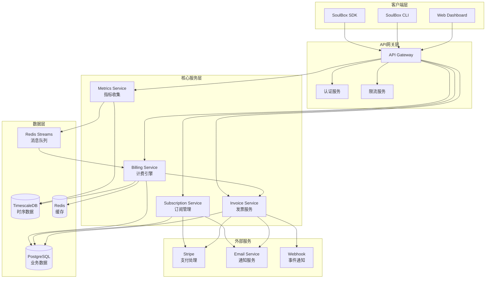
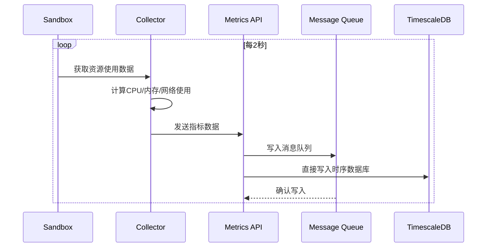
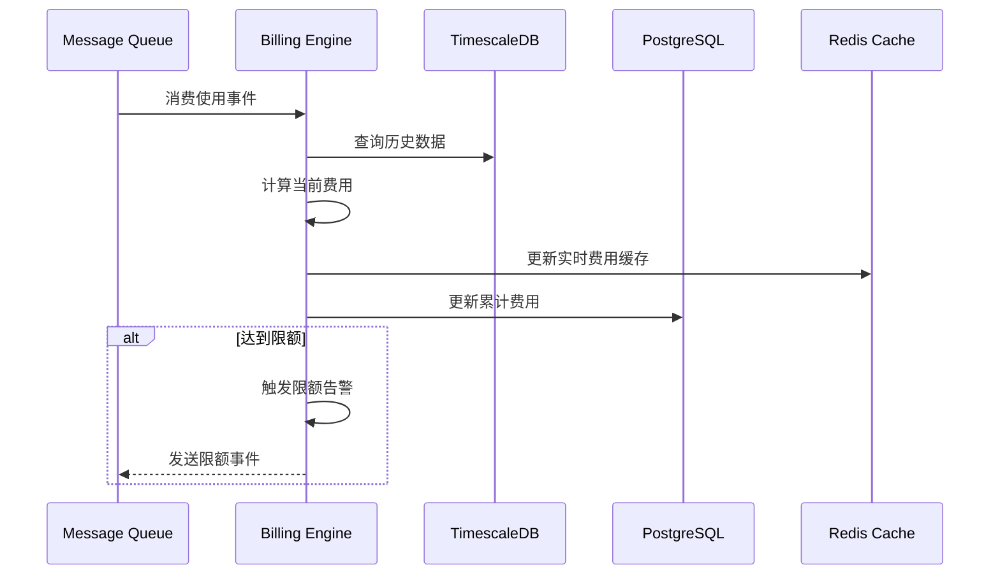
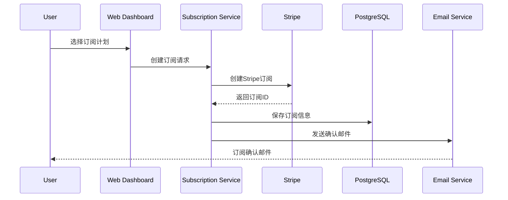

# SoulBox 计费系统架构图

## 系统架构总览



## 数据流向图

### 1. 资源使用数据收集流程



### 2. 计费计算流程



### 3. 支付处理流程



## 核心组件详解

### 1. Metrics Service（指标收集服务）

```yaml
组件职责:
  - 接收来自沙箱的资源使用数据
  - 数据验证和清洗
  - 写入时序数据库
  - 发布到消息队列

技术实现:
  - 语言: Rust
  - 框架: Actix-web
  - 协议: gRPC + REST
  - 批处理: 100条/批次
  - 并发: 1000 TPS

数据格式:
  - CPU使用率（百分比）
  - 内存使用（MB）
  - 网络流量（GB）
  - 存储使用（GB）
  - 时间戳（纳秒精度）
```

### 2. Billing Engine（计费引擎）

```yaml
组件职责:
  - 实时费用计算
  - 使用量聚合
  - 限额检查
  - 费用预估

核心算法:
  - 滑动窗口计算
  - 增量更新
  - 并行处理
  - 容错重试

计费规则:
  - CPU: $0.000012/vCPU/秒
  - 内存: $0.000004/GB/秒
  - 网络: $0.02/GB（出站）
  - 存储: $0.08/GB/月
```

### 3. 数据存储架构

#### TimescaleDB（时序数据）

```sql
-- 主要表结构
CREATE TABLE resource_usage (
    time TIMESTAMPTZ NOT NULL,
    sandbox_id UUID NOT NULL,
    user_id UUID NOT NULL,
    vcpu_count DECIMAL(4,2),
    memory_mb INTEGER,
    network_bytes_in BIGINT,
    network_bytes_out BIGINT,
    storage_bytes BIGINT
);

-- 创建超表
SELECT create_hypertable('resource_usage', 'time');

-- 创建连续聚合
CREATE MATERIALIZED VIEW usage_hourly
WITH (timescaledb.continuous) AS
SELECT 
    time_bucket('1 hour', time) AS hour,
    user_id,
    AVG(vcpu_count) as avg_vcpu,
    AVG(memory_mb) as avg_memory,
    SUM(network_bytes_out) as total_network_out
FROM resource_usage
GROUP BY hour, user_id;
```

#### PostgreSQL（业务数据）

```sql
-- 订阅表
CREATE TABLE subscriptions (
    id UUID PRIMARY KEY,
    user_id UUID NOT NULL,
    tier VARCHAR(20) NOT NULL,
    status VARCHAR(20) NOT NULL,
    stripe_subscription_id VARCHAR(255),
    monthly_credit DECIMAL(10,2),
    created_at TIMESTAMP DEFAULT NOW(),
    updated_at TIMESTAMP DEFAULT NOW()
);

-- 发票表
CREATE TABLE invoices (
    id UUID PRIMARY KEY,
    user_id UUID NOT NULL,
    period_start TIMESTAMP NOT NULL,
    period_end TIMESTAMP NOT NULL,
    subtotal DECIMAL(10,2),
    credits_applied DECIMAL(10,2),
    total DECIMAL(10,2),
    status VARCHAR(20),
    stripe_invoice_id VARCHAR(255),
    created_at TIMESTAMP DEFAULT NOW()
);

-- 计费记录表
CREATE TABLE billing_records (
    id UUID PRIMARY KEY,
    user_id UUID NOT NULL,
    sandbox_id UUID NOT NULL,
    start_time TIMESTAMP NOT NULL,
    end_time TIMESTAMP NOT NULL,
    cpu_seconds DECIMAL(10,2),
    memory_gb_seconds DECIMAL(10,2),
    network_gb DECIMAL(10,4),
    cpu_cost DECIMAL(10,4),
    memory_cost DECIMAL(10,4),
    network_cost DECIMAL(10,4),
    total_cost DECIMAL(10,4),
    created_at TIMESTAMP DEFAULT NOW()
);
```

#### Redis（缓存层）

```yaml
缓存策略:
  - 实时费用: 60秒过期
  - 用户限额: 300秒过期
  - 订阅信息: 3600秒过期
  - 活跃沙箱: 实时更新

数据结构:
  # 实时费用
  billing:realtime:{user_id}: "125.45"
  
  # 用户限额
  limits:{user_id}: {
    "monthly_credit": 50,
    "used_credit": 25.5,
    "max_sandboxes": 10
  }
  
  # 活跃沙箱计数
  active:sandboxes:{user_id}: 5
```

## 高可用架构

### 1. 服务冗余

```yaml
服务部署:
  Metrics Service: 3个实例
  Billing Engine: 2个实例（主备）
  Subscription Service: 2个实例
  Invoice Service: 2个实例

负载均衡:
  - 类型: Layer 7 (HTTP/gRPC)
  - 算法: Round Robin + 健康检查
  - 会话保持: 基于用户ID

故障转移:
  - 健康检查: 每5秒
  - 失败阈值: 3次
  - 恢复时间: <30秒
```

### 2. 数据备份策略

```yaml
TimescaleDB:
  - 连续复制到备库
  - 每小时增量备份
  - 每天全量备份
  - 保留30天

PostgreSQL:
  - 主从复制（异步）
  - 每4小时备份
  - 异地备份
  - 保留90天

Redis:
  - RDB持久化（每小时）
  - AOF持久化（每秒）
  - 主从复制
```

### 3. 监控告警

```yaml
关键指标:
  - API响应时间 < 100ms (P95)
  - 计费延迟 < 5秒
  - 数据丢失率 < 0.01%
  - 系统可用性 > 99.9%

告警规则:
  - 服务宕机: 立即告警
  - 响应超时: 超过阈值5分钟
  - 数据积压: 队列超过10000
  - 磁盘空间: 剩余<20%
```

## 安全架构

### 1. 数据加密

```yaml
传输加密:
  - 外部API: TLS 1.3
  - 内部通信: mTLS
  - 数据库连接: SSL

存储加密:
  - 数据库: 透明数据加密(TDE)
  - 备份文件: AES-256
  - 缓存数据: 不存储敏感信息
```

### 2. 访问控制

```yaml
认证机制:
  - API密钥（SDK/CLI）
  - JWT令牌（Web）
  - OAuth 2.0（第三方）

权限模型:
  - 基于角色的访问控制(RBAC)
  - 资源级别权限
  - API限流

审计日志:
  - 所有API调用
  - 权限变更
  - 支付操作
  - 数据导出
```

## 性能优化

### 1. 查询优化

```sql
-- 使用物化视图加速常用查询
CREATE MATERIALIZED VIEW daily_usage_summary AS
SELECT 
    DATE(time) as usage_date,
    user_id,
    SUM(cpu_seconds) as total_cpu,
    SUM(memory_gb_seconds) as total_memory,
    SUM(network_gb) as total_network,
    SUM(total_cost) as daily_cost
FROM billing_records
GROUP BY usage_date, user_id;

-- 创建索引优化查询
CREATE INDEX idx_billing_user_time ON billing_records(user_id, created_at DESC);
CREATE INDEX idx_usage_sandbox_time ON resource_usage(sandbox_id, time DESC);
```

### 2. 缓存策略

```yaml
多级缓存:
  L1 - 应用内存缓存:
    - 热点数据
    - 10秒过期
    - LRU淘汰
  
  L2 - Redis缓存:
    - 用户数据
    - 60秒过期
    - 分布式锁
  
  L3 - CDN缓存:
    - 静态资源
    - 24小时过期
    - 全球分发
```

### 3. 批处理优化

```rust
// 批量处理使用事件
impl BatchProcessor {
    async fn process_batch(&self, events: Vec<UsageEvent>) {
        // 按用户分组
        let grouped = events.into_iter()
            .group_by(|e| e.user_id.clone());
        
        // 并行处理每个用户
        let futures: Vec<_> = grouped.into_iter()
            .map(|(user_id, user_events)| {
                self.process_user_events(user_id, user_events)
            })
            .collect();
        
        // 等待所有处理完成
        futures::future::join_all(futures).await;
    }
}
```

## 部署架构

### 1. Kubernetes部署

```yaml
apiVersion: apps/v1
kind: Deployment
metadata:
  name: billing-engine
spec:
  replicas: 3
  selector:
    matchLabels:
      app: billing-engine
  template:
    metadata:
      labels:
        app: billing-engine
    spec:
      containers:
      - name: billing-engine
        image: soulbox/billing-engine:latest
        resources:
          requests:
            memory: "512Mi"
            cpu: "500m"
          limits:
            memory: "1Gi"
            cpu: "1000m"
        env:
        - name: TIMESCALE_URL
          valueFrom:
            secretKeyRef:
              name: db-secrets
              key: timescale-url
        livenessProbe:
          httpGet:
            path: /health
            port: 8080
          initialDelaySeconds: 30
          periodSeconds: 10
```

### 2. 服务网格

```yaml
Istio配置:
  - 流量管理: 金丝雀发布
  - 安全: mTLS自动注入
  - 可观测性: 分布式追踪
  - 弹性: 熔断和重试
```

## 总结

SoulBox计费系统采用了现代化的微服务架构，具有以下特点：

1. **高精度计量**：每2秒采集一次数据，按秒计费
2. **实时处理**：使用流处理架构，延迟小于5秒
3. **高可用性**：多副本部署，自动故障转移
4. **可扩展性**：水平扩展，支持百万级用户
5. **数据完整性**：多级备份，事务保证
6. **安全可靠**：端到端加密，完整审计

这套架构能够支撑SoulBox的商业化运营，为用户提供透明、准确、可靠的计费服务。

---

*文档版本：1.0*  
*最后更新：2025-01-07*  
*作者：SoulBox Team & Claude Assistant*