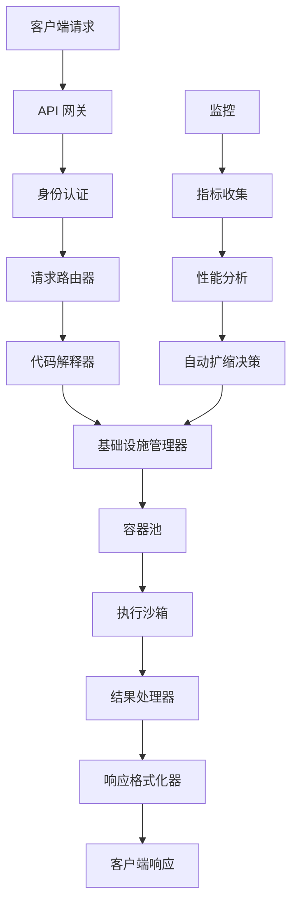

# SoulBox 迁移策略

> 统一架构方法和三项目迁移计划，打造高性能 Rust 代码执行沙箱

## 🎯 迁移概述

SoulBox 代表着三个不同的 E2B 相关项目的统一和演进，将其整合为单一的高性能 Rust 代码执行沙箱。此迁移策略概述了整合功能同时实现显著性能提升的系统化方法。

### 源项目分析

| 项目 | 技术栈 | 核心组件 | 迁移优先级 |
|---------|------------------|----------------|-------------------|
| **E2B Infra** | TypeScript/Node.js | 基础设施管理、部署 | 第1阶段 - 核心 |
| **Code Interpreter** | Python/FastAPI | 代码执行、语言支持 | 第1阶段 - 核心 |
| **E2B Core** | Go/TypeScript | API 层、身份认证 | 第2阶段 - 集成 |

## 🏗️ 统一架构策略

### 1. 单一代码库方法

**目标**：将三个独立项目整合为一个内聚的 Rust 应用程序

**优势**：
- 减少维护开销
- 统一的编码标准和实践
- 简化部署和运维
- 更好的代码复用和模块化

**实现**：
```rust
// 统一项目结构
soulbox/
├── src/
│   ├── infra/           // 基础设施组件 (来自 E2B Infra)
│   ├── interpreter/     // 代码执行引擎 (来自 Code Interpreter)
│   ├── api/            // API 层和认证 (来自 E2B Core)
│   ├── core/           // 共享工具和类型
│   └── main.rs         // 应用程序入口点
├── tests/              // 集成测试套件
└── benchmarks/         // 性能测试
```

### 2. 模块化组件设计

**核心模块**：

#### 基础设施模块 (`soulbox::infra`)
- **来源**：E2B Infra (TypeScript → Rust)
- **组件**：容器管理、资源分配、扩展
- **关键特性**：Docker 集成、资源池化、健康监控

#### 解释器模块 (`soulbox::interpreter`)
- **来源**：Code Interpreter (Python → Rust)
- **组件**：多语言执行、代码解析、结果处理
- **关键特性**：沙箱执行、超时处理、资源限制

#### API 模块 (`soulbox::api`)
- **来源**：E2B Core (Go/TypeScript → Rust)
- **组件**：REST/gRPC APIs、身份认证、请求路由
- **关键特性**：JWT 认证、速率限制、API 版本管理

#### 核心模块 (`soulbox::core`)
- **用途**：共享工具和横切关注点
- **组件**：日志记录、配置、错误处理、指标
- **关键特性**：结构化日志、遥测、健康检查

### 3. 数据流集成



## 🔄 迁移阶段

### 第1阶段：核心基础（第1-8周）
**优先级**：P0 - 关键路径

**目标**：
- 从 E2B Infra 迁移核心基础设施组件
- 从 Code Interpreter 实现基本代码执行
- 建立统一的日志记录和监控

**交付物**：
- Rust 容器管理系统
- 基本多语言代码执行
- 统一配置系统
- 初始性能基准测试

**迁移任务**：
1. **基础设施组件**：
   ```rust
   // TypeScript → Rust 迁移
   ContainerManager::new()
       .with_docker_client()
       .with_resource_limits()
       .with_health_monitoring()
   ```

2. **代码执行引擎**：
   ```rust
   // Python → Rust 迁移
   CodeInterpreter::new()
       .support_language("python")
       .support_language("javascript")
       .with_timeout(Duration::from_secs(30))
   ```

### 第2阶段：API 集成（第9-16周）
**优先级**：P1 - 高

**目标**：
- 从 E2B Core 迁移 API 层
- 实现身份认证和授权
- 将所有组件集成到统一服务中

**交付物**：
- REST 和 gRPC API 端点
- 基于 JWT 的认证系统
- 集成的请求处理管道
- 性能优化基准

### 第3阶段：功能对等（第17-24周）
**优先级**：P2 - 中

**目标**：
- 实现与所有三个源项目的功能对等
- 实现高级功能和优化
- 完成测试和文档

**交付物**：
- 100% 功能对等
- 全面的测试套件
- 显示10倍改进的性能基准
- 迁移完成文档

### 第4阶段：增强（第25-28周）
**优先级**：P3 - 低

**目标**：
- 实现 Rust 特定优化
- 添加源项目中没有的新功能
- 完成生产就绪

**交付物**：
- 高级性能功能
- 生产部署指南
- 监控和告警设置
- 长期维护计划

## 🔧 技术迁移策略

### 1. 特定语言迁移

#### TypeScript → Rust (E2B Infra)
**挑战**：
- Async/await 模式 → tokio runtime
- NPM 依赖 → Cargo crates
- JavaScript 对象 → Rust 结构体

**策略**：
```rust
// 之前 (TypeScript)
interface ContainerConfig {
  image: string;
  memory: number;
  cpu: number;
}

// 之后 (Rust)
#[derive(Debug, Clone, Serialize, Deserialize)]
struct ContainerConfig {
    image: String,
    memory: u64,
    cpu: f64,
}
```

#### Python → Rust (Code Interpreter)
**挑战**：
- 动态类型 → 静态类型
- Python 特定库 → Rust 等价物
- 执行模型差异

**策略**：
```rust
// 之前 (Python)
def execute_code(language: str, code: str) -> dict:
    # 动态执行
    pass

// 之后 (Rust)
async fn execute_code(
    language: Language,
    code: &str,
) -> Result<ExecutionResult, ExecutionError> {
    // 类型安全执行
}
```

#### Go → Rust (E2B Core API)
**挑战**：
- Goroutines → tokio tasks
- Interface{} → trait objects/generics
- 错误处理模式

**策略**：
```rust
// 之前 (Go)
func HandleRequest(w http.ResponseWriter, r *http.Request) {
    // 处理 HTTP 请求
}

// 之后 (Rust)
async fn handle_request(
    req: Request<Body>,
) -> Result<Response<Body>, ApiError> {
    // 类型安全请求处理
}
```

### 2. 数据迁移策略

#### 配置迁移
- 将 YAML/JSON 配置转换为 Rust 原生 TOML
- 在过渡期间实现向后兼容性
- 验证配置架构

#### 数据库迁移
- 从多个数据库（PostgreSQL、Redis、TimescaleDB）迁移到统一的 SurrealDB
- 实现多模型数据（文档、图形、时间序列）的数据转换脚本
- 通过双写模式确保零停机迁移

#### API 兼容性
- 在迁移期间保持向后兼容性
- 实现 API 版本管理
- 为客户端提供迁移指南

## 📊 成功指标

### 性能目标
- **启动时间**：< 100ms（相对当前 ~2s）
- **内存使用**：比当前基线减少50%
- **CPU 效率**：每秒操作数提升10倍
- **延迟**：< 50ms API 响应时间

### 质量目标
- **测试覆盖率**：> 90%
- **文档覆盖率**：公共 API 100%
- **性能回归**：迁移期间0%
- **功能对等**：与源项目100%

### 迁移里程碑
- **第8周**：核心基础设施迁移并完成基准测试
- **第16周**：API 集成完成并包含身份认证
- **第24周**：实现功能对等并达到性能目标
- **第28周**：生产就绪并具备增强功能

## 🚨 迁移风险和缓解措施

### 技术风险

#### 风险：迁移期间性能下降
- **缓解**：持续基准测试和性能测试
- **监控**：自动性能回归检测
- **回滚**：在关键阶段维护并行系统

#### 风险：功能不兼容
- **缓解**：全面的 API 兼容性测试
- **验证**：在整个迁移过程中进行客户端集成测试
- **文档**：清晰的迁移指南和重大变更

#### 风险：迁移期间数据丢失
- **缓解**：完整的备份和恢复程序
- **测试**：在预发环境中进行完整的迁移试运行
- **验证**：在每个迁移步骤进行数据完整性检查

### 业务风险

#### 风险：迁移时间线延长
- **缓解**：分阶段方法和增量交付
- **监控**：每周进度审查和调整
- **应急**：关键功能的并行开发轨道

#### 风险：用户体验中断
- **缓解**：向后兼容性和逐步推出
- **沟通**：清晰的迁移时间线和期望
- **支持**：迁移期间的增强支持

## 🎉 预期成果

### 技术收益
- **10倍性能提升**：Rust 的零成本抽象和内存安全
- **降低基础设施成本**：更高效的资源利用
- **提高可靠性**：Rust 的类型系统防止常见的运行时错误
- **更好的可维护性**：具有一致模式的单一代码库

### 业务收益
- **更快的上市时间**：统一的开发和部署流程
- **降低运营开销**：单一系统的维护和监控
- **增强安全性**：Rust 的内存安全消除了整类漏洞
- **竞争优势**：卓越的性能特性

### 开发收益
- **改善开发者体验**：更好的工具和调试能力
- **一致的架构**：跨所有组件的统一模式和实践
- **增强测试**：具有更好覆盖率的全面测试套件
- **面向未来的技术**：具有强大生态系统支持的现代语言

---

此迁移策略为将三个 E2B 相关项目整合到 SoulBox 中提供了全面的路线图，同时实现显著的性能改进并保持功能对等。分阶段方法确保最小风险，同时最大化基于 Rust 架构的收益。