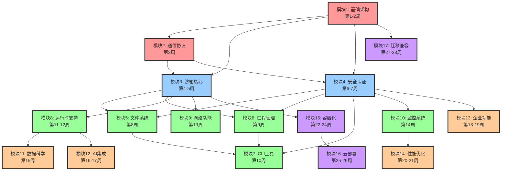

# SoulBox 模块依赖关系图

> 清晰展示17个模块之间的依赖关系和开发顺序
> 
> 更新时间：2025-08-06

## 🔄 模块依赖关系总览



## 📦 模块详细说明

### 🔴 基础层模块（必须最先开发）

#### **模块1: 基础架构**（第1-2周）
- **依赖**: 无（起点模块）
- **被依赖**: 几乎所有模块
- **关键组件**:
  - 项目结构
  - 配置系统（soulbox.toml）
  - 错误处理体系
  - 日志框架

#### **模块2: 通信协议**（第3周）
- **依赖**: 模块1（基础架构）
- **被依赖**: 模块3、4、7、10
- **关键组件**:
  - gRPC协议定义
  - WebSocket服务器
  - API网关

### 🔵 核心层模块（构建核心功能）

#### **模块3: 沙箱核心**（第4-5周）
- **依赖**: 模块1、2
- **被依赖**: 模块5、6、8、9、15
- **关键组件**:
  - 生命周期管理
  - 模板系统
  - 资源隔离

#### **模块4: 安全认证**（第6-7周）
- **依赖**: 模块1、2
- **被依赖**: 模块5、6、7、10、13
- **关键组件**:
  - JWT/API Key认证
  - RBAC权限
  - 审计日志

### 🟢 功能层模块（实现具体功能）

#### **模块5: 文件系统**（第8周）
- **依赖**: 模块3、4
- **被依赖**: 模块7、11
- **关键组件**:
  - 文件操作API
  - 文件监控
  - 签名URL

#### **模块6: 进程管理**（第9周）
- **依赖**: 模块3、4
- **被依赖**: 模块7、8
- **关键组件**:
  - 进程执行
  - PTY支持
  - 信号处理

#### **模块7: CLI工具**（第10周）
- **依赖**: 模块4、5、6
- **被依赖**: 用户交互
- **关键组件**:
  - 命令框架
  - 交互界面
  - 调试器

#### **模块8: 运行时支持**（第11-12周）
- **依赖**: 模块3、6
- **被依赖**: 模块11、12
- **关键组件**:
  - 运行时检测
  - 多语言支持
  - 版本管理

#### **模块9: 网络功能**（第13周）
- **依赖**: 模块3
- **被依赖**: 模块12、16
- **关键组件**:
  - 端口映射
  - 域名管理
  - 代理支持

#### **模块10: 监控系统**（第14周）
- **依赖**: 模块2、4
- **被依赖**: 模块14
- **关键组件**:
  - 指标收集
  - 日志聚合
  - 健康检查

### 🟠 增强层模块（高级功能）

#### **模块11: 数据科学**（第15周）
- **依赖**: 模块5、8
- **被依赖**: 模块12
- **关键组件**:
  - Jupyter集成
  - 数据分析库
  - GPU支持

#### **模块12: AI集成**（第16-17周）
- **依赖**: 模块8、9、11
- **被依赖**: 企业应用
- **关键组件**:
  - LLM接口
  - OpenAI/Claude
  - 向量数据库

#### **模块13: 企业功能**（第18-19周）
- **依赖**: 模块4
- **被依赖**: 生产部署
- **关键组件**:
  - 多租户
  - 资源配额
  - 计费系统

#### **模块14: 性能优化**（第20-21周）
- **依赖**: 模块10
- **被依赖**: 生产环境
- **关键组件**:
  - 连接池
  - 缓存系统
  - 熔断器

### 🟣 部署层模块（生产准备）

#### **模块15: 容器化**（第22-24周）
- **依赖**: 模块3
- **被依赖**: 模块16
- **关键组件**:
  - Docker支持
  - K8s部署
  - Helm Charts

#### **模块16: 云部署**（第25-26周）
- **依赖**: 模块9、15
- **被依赖**: 生产环境
- **关键组件**:
  - Terraform
  - 多云支持
  - 自动扩缩

#### **模块17: 迁移兼容**（第27-28周）
- **依赖**: 模块1（API兼容）
- **被依赖**: E2B用户迁移
- **关键组件**:
  - API兼容层
  - 迁移工具
  - Desktop SDK

## 🎯 开发原则

### 1. 严格遵循依赖顺序
- 不能跳过依赖模块直接开发
- 确保每个模块的依赖都已完成
- 依赖模块必须通过测试

### 2. 模块完成标准
- ✅ 代码实现完整
- ✅ 单元测试覆盖率 > 80%
- ✅ 集成测试通过
- ✅ 文档更新完成
- ✅ Code Review通过

### 3. 并行开发机会
以下模块可以并行开发（前提是依赖满足）：
- 模块5（文件系统）和模块6（进程管理）
- 模块11（数据科学）和模块13（企业功能）
- 模块15（容器化）和模块17（迁移兼容）

## 📊 关键路径

项目的关键路径（最长依赖链）：
```
模块1 → 模块2 → 模块3 → 模块8 → 模块12
     └→ 模块4 → 模块13
```

这意味着：
- 模块1-4是绝对关键，必须优先完成
- 模块8和12在AI集成路径上是关键的
- 模块13在企业功能路径上是关键的

## 🚀 快速启动建议

1. **第1周**: 专注模块1，搭建项目基础
2. **第2周**: 完成模块1，开始模块2
3. **第3周**: 完成模块2，同时启动模块3和4
4. **第4-5周**: 专注完成模块3（沙箱核心）
5. **第6-7周**: 完成模块4，同时准备模块5、6

遵循这个依赖关系图，可以确保项目稳定推进，避免返工！