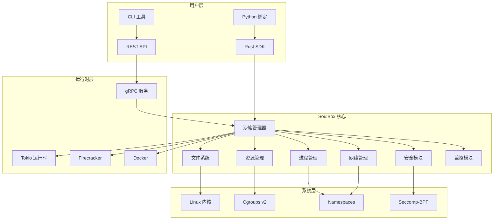
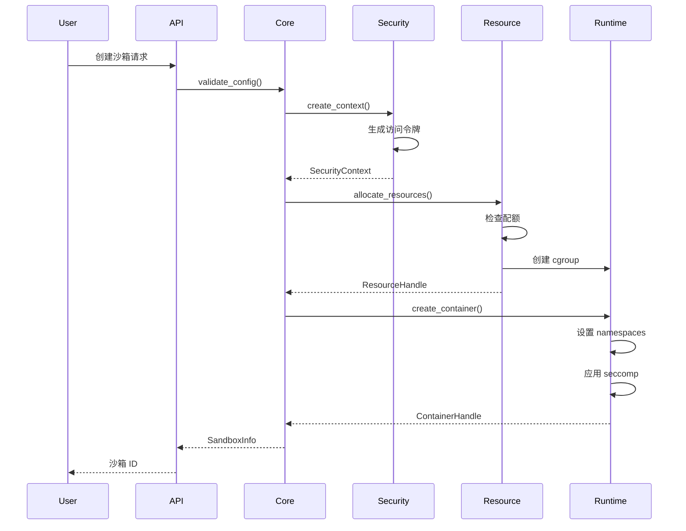
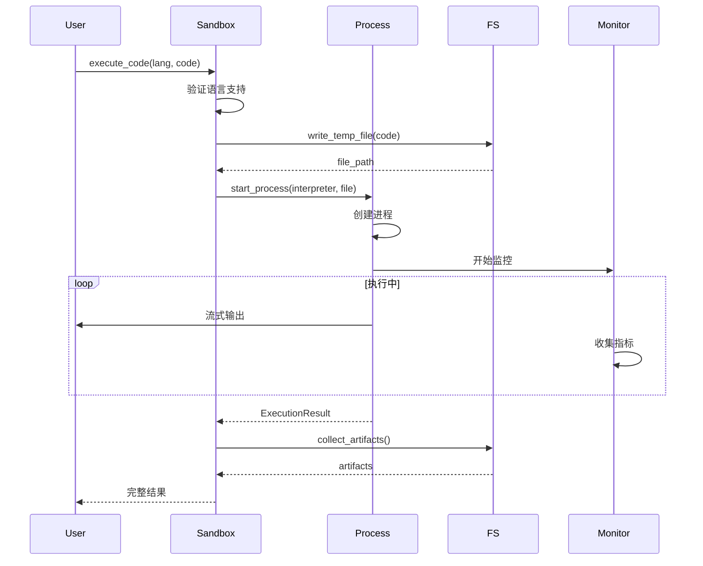

# SoulBox - 完整技术文档

> 基于「五步显化法」的系统化文档

---

## 一、定位与使命 (Positioning & Mission)

### 1.1 模块定位

**SoulBox 是 Rust 生态系统中的高性能代码执行沙箱，为 AI 应用和开发工具提供安全、隔离的代码运行环境。**

### 1.2 核心问题

SoulBox 旨在解决以下关键问题：

1. **AI 代码安全性问题**
   - AI 模型生成的代码可能包含恶意或危险操作
   - 需要在完全隔离的环境中验证代码的安全性
   - 必须防止代码执行对宿主系统造成影响

2. **多语言统一执行环境**
   - 不同编程语言需要不同的运行时
   - 统一的 API 接口来执行各种语言代码
   - 一致的结果格式和错误处理

3. **资源管理与限制**
   - 防止代码消耗过多系统资源
   - 精确控制 CPU、内存、磁盘和网络使用
   - 提供细粒度的资源监控和限制

### 1.3 应用场景

#### 场景一：AI 编程助手
```rust
// Claude/GPT 生成了一段数据分析代码
let ai_code = r#"
import pandas as pd
import matplotlib.pyplot as plt

df = pd.read_csv('sales.csv')
monthly_sales = df.groupby('month')['amount'].sum()
plt.plot(monthly_sales)
plt.savefig('sales_chart.png')
"#;

// 在 SoulBox 中安全执行
let sandbox = SoulBox::create(config).await?;
let result = sandbox.execute_code(Language::Python, ai_code).await?;
// AI 代码在隔离环境中运行，生成的图表可以安全获取
```

#### 场景二：在线编程教育平台
```rust
// 学生提交的作业代码
let student_code = r#"
def fibonacci(n):
    if n <= 1:
        return n
    return fibonacci(n-1) + fibonacci(n-2)

# 测试代码
for i in range(10):
    print(f"fib({i}) = {fibonacci(i)}")
"#;

// 创建资源受限的沙箱
let config = SandboxConfig::builder()
    .memory_limit(50 * 1024 * 1024)  // 50MB
    .cpu_quota(0.1)  // 10% CPU
    .timeout(Duration::from_secs(5))  // 5秒超时
    .build();

let sandbox = SoulBox::create(config).await?;
let result = sandbox.execute_code(Language::Python, student_code).await?;
```

#### 场景三：代码评测系统
```rust
// 编程竞赛的评测
let test_cases = vec![
    TestCase { input: "5", expected: "120" },
    TestCase { input: "10", expected: "3628800" },
];

for (i, test) in test_cases.iter().enumerate() {
    let sandbox = SoulBox::create_isolated().await?;
    
    // 运行提交的代码
    sandbox.write_file("input.txt", test.input.as_bytes()).await?;
    let result = sandbox.execute_code(Language::Cpp, submission_code).await?;
    
    // 验证输出
    assert_eq!(result.stdout.trim(), test.expected);
}
```

### 1.4 能力边界

#### ✅ SoulBox 做什么

1. **安全隔离**
   - 基于 Linux namespaces 的进程隔离
   - seccomp-bpf 系统调用过滤
   - cgroups v2 资源限制

2. **代码执行**
   - 支持 Python、JavaScript、Ruby、Go、Rust 等主流语言
   - 实时流式输出
   - 文件系统操作

3. **资源管理**
   - CPU、内存、磁盘配额
   - 网络访问控制
   - 执行时间限制

4. **生命周期管理**
   - 沙箱创建、暂停、恢复、销毁
   - 持久化和快照
   - 自动清理机制

#### ❌ SoulBox 不做什么

1. **不是容器编排系统**
   - 不提供 Kubernetes 式的集群管理
   - 不处理服务发现和负载均衡
   - 专注于单个沙箱的生命周期

2. **不是 IDE 或编辑器**
   - 不提供代码编辑功能
   - 不包含语法高亮或自动完成
   - 仅负责代码执行

3. **不是持续集成系统**
   - 不管理代码仓库
   - 不处理构建流水线
   - 仅提供隔离的执行环境

---

## 二、设计思想与哲学基石 (Design Philosophy & Foundational Principles)

### 2.1 核心设计理念

#### 安全第一 (Security First)
```rust
// 每个设计决策都以安全为首要考虑
// 宁可牺牲一些性能，也要确保隔离的完整性
pub struct SoulBox {
    // 使用 Arc 确保线程安全
    inner: Arc<SandboxInner>,
    // 所有敏感操作都需要验证
    security_context: SecurityContext,
}
```

#### 零信任原则 (Zero Trust)
```rust
// 不信任任何用户输入
impl SoulBox {
    pub async fn execute_code(&self, lang: Language, code: &str) -> Result<ExecutionResult> {
        // 验证代码长度
        if code.len() > MAX_CODE_SIZE {
            return Err(SoulBoxError::CodeTooLarge);
        }
        
        // 验证语言支持
        if !self.is_language_supported(lang) {
            return Err(SoulBoxError::UnsupportedLanguage);
        }
        
        // 扫描恶意模式
        self.security_scanner.scan(code)?;
        
        // 执行代码
        self.execute_validated(lang, code).await
    }
}
```

#### 资源意识 (Resource Aware)
```rust
// 每个操作都考虑资源消耗
pub struct ResourceGuard {
    cpu_limiter: CpuLimiter,
    memory_limiter: MemoryLimiter,
    io_limiter: IoLimiter,
}

// 自动资源清理
impl Drop for SoulBox {
    fn drop(&mut self) {
        // 确保所有资源被释放
        self.cleanup_resources();
    }
}
```

### 2.2 架构原则

#### 1. 分层架构
```
┌─────────────────────────────────────────┐
│          用户 API 层 (User API)         │
├─────────────────────────────────────────┤
│        安全控制层 (Security Layer)       │
├─────────────────────────────────────────┤
│       资源管理层 (Resource Layer)        │
├─────────────────────────────────────────┤
│      容器运行时层 (Runtime Layer)        │
├─────────────────────────────────────────┤
│        系统调用层 (Syscall Layer)        │
└─────────────────────────────────────────┘
```

#### 2. 最小权限原则
- 沙箱进程以最低权限运行
- 逐步降级权限
- 白名单机制控制系统调用

#### 3. 故障隔离
- 单个沙箱崩溃不影响其他沙箱
- 控制平面与数据平面分离
- 优雅降级机制

### 2.3 技术选型理由

#### Rust 语言
- **内存安全**：防止缓冲区溢出等安全漏洞
- **零开销抽象**：性能接近 C/C++
- **并发安全**：编译时保证线程安全

#### Tokio 异步运行时
- **高并发**：支持大量沙箱同时运行
- **资源效率**：异步 I/O 减少线程开销
- **生态完善**：丰富的异步库支持

#### Linux 内核特性
- **Namespaces**：进程、网络、文件系统隔离
- **Cgroups v2**：统一的资源管理接口
- **Seccomp-BPF**：细粒度的系统调用过滤

---

## 三、核心数据结构定义 (Core Data Structure Definitions)

### 3.1 沙箱核心结构

```rust
use std::sync::Arc;
use tokio::sync::Mutex;
use uuid::Uuid;
use chrono::{DateTime, Utc};

/// 沙箱主结构
#[derive(Debug)]
pub struct SoulBox {
    /// 唯一标识符
    id: Uuid,
    
    /// 沙箱配置
    config: SandboxConfig,
    
    /// 运行时状态
    state: Arc<Mutex<SandboxState>>,
    
    /// 资源管理器
    resources: Arc<ResourceManager>,
    
    /// 进程管理器
    process_manager: Arc<ProcessManager>,
    
    /// 文件系统
    filesystem: Arc<Filesystem>,
    
    /// 网络管理器（可选）
    network: Option<Arc<NetworkManager>>,
    
    /// 安全上下文
    security: SecurityContext,
    
    /// 元数据
    metadata: Arc<Mutex<SandboxMetadata>>,
    
    /// 指标收集器
    metrics: Arc<MetricsCollector>,
}

/// 沙箱配置
#[derive(Debug, Clone, Serialize, Deserialize)]
pub struct SandboxConfig {
    /// 内存限制（字节）
    pub memory_limit: u64,
    
    /// CPU 配额（0.0-1.0）
    pub cpu_quota: f32,
    
    /// 磁盘空间限制（字节）
    pub disk_limit: u64,
    
    /// 执行超时时间
    pub timeout: Duration,
    
    /// 是否启用网络
    pub network_enabled: bool,
    
    /// 环境变量
    pub env_vars: HashMap<String, String>,
    
    /// 允许的系统调用
    pub allowed_syscalls: Vec<Syscall>,
    
    /// 持久化选项
    pub persistence: PersistenceConfig,
}

/// 沙箱状态
#[derive(Debug, Clone, Copy, PartialEq, Eq)]
pub enum SandboxState {
    /// 正在创建
    Creating,
    /// 运行中
    Running,
    /// 已暂停
    Paused,
    /// 正在终止
    Terminating,
    /// 已终止
    Terminated,
}

/// 沙箱元数据
#[derive(Debug, Clone, Serialize, Deserialize)]
pub struct SandboxMetadata {
    /// 自定义标签
    pub tags: Vec<String>,
    
    /// 键值对元数据
    pub custom: HashMap<String, String>,
    
    /// 创建时间
    pub created_at: DateTime<Utc>,
    
    /// 最后更新时间
    pub updated_at: DateTime<Utc>,
    
    /// 模板信息
    pub template: Option<TemplateInfo>,
}
```

### 3.2 执行相关结构

```rust
/// 支持的编程语言
#[derive(Debug, Clone, Copy, PartialEq, Eq, Serialize, Deserialize)]
#[serde(rename_all = "lowercase")]
pub enum Language {
    Python,
    JavaScript,
    TypeScript,
    Ruby,
    Go,
    Rust,
    Java,
    CSharp,
    PHP,
    Shell,
    R,
    Julia,
}

/// 代码执行结果
#[derive(Debug, Clone, Serialize, Deserialize)]
pub struct ExecutionResult {
    /// 退出码
    pub exit_code: i32,
    
    /// 标准输出
    pub stdout: String,
    
    /// 标准错误
    pub stderr: String,
    
    /// 执行时间
    pub execution_time: Duration,
    
    /// 内存使用峰值
    pub peak_memory: u64,
    
    /// 生成的文件
    pub artifacts: Vec<Artifact>,
    
    /// 错误信息（如果有）
    pub error: Option<String>,
}

/// 生成的文件工件
#[derive(Debug, Clone, Serialize, Deserialize)]
pub struct Artifact {
    /// 文件路径
    pub path: PathBuf,
    
    /// MIME 类型
    pub mime_type: String,
    
    /// 文件大小
    pub size: u64,
    
    /// 文件内容（小文件）
    pub content: Option<Vec<u8>>,
    
    /// 下载 URL（大文件）
    pub download_url: Option<String>,
}

/// 流式输出
#[derive(Debug, Clone, Serialize, Deserialize)]
pub enum StreamOutput {
    Stdout(String),
    Stderr(String),
    Image(ImageData),
    Plot(PlotData),
    Progress(ProgressData),
}
```

### 3.3 进程管理结构

```rust
/// 进程信息
#[derive(Debug, Clone)]
pub struct ProcessInfo {
    /// 进程 ID
    pub pid: u32,
    
    /// 进程配置
    pub config: ProcessConfig,
    
    /// 进程标签
    pub tag: Option<String>,
    
    /// 启动时间
    pub started_at: SystemTime,
    
    /// 进程状态
    pub state: ProcessState,
    
    /// 资源使用
    pub resources: ProcessResources,
}

/// 进程配置
#[derive(Debug, Clone, Serialize, Deserialize)]
pub struct ProcessConfig {
    /// 命令
    pub cmd: String,
    
    /// 参数
    pub args: Vec<String>,
    
    /// 环境变量
    pub env: HashMap<String, String>,
    
    /// 工作目录
    pub cwd: Option<PathBuf>,
    
    /// 用户
    pub user: Username,
}

/// 进程状态
#[derive(Debug, Clone, Copy, PartialEq, Eq)]
pub enum ProcessState {
    Starting,
    Running,
    Stopped,
    Exited(i32),
    Signaled(Signal),
}

/// PTY 配置
#[derive(Debug, Clone, Copy)]
pub struct PtyConfig {
    pub cols: u16,
    pub rows: u16,
    pub term: &'static str,
}
```

### 3.4 文件系统结构

```rust
/// 文件系统事件
#[derive(Debug, Clone, Serialize, Deserialize)]
pub enum FileSystemEvent {
    Created(PathBuf),
    Modified(PathBuf),
    Deleted(PathBuf),
    Renamed { from: PathBuf, to: PathBuf },
    Chmod(PathBuf, u32),
}

/// 文件信息
#[derive(Debug, Clone, Serialize, Deserialize)]
pub struct FileInfo {
    pub path: PathBuf,
    pub file_type: FileType,
    pub size: u64,
    pub modified: SystemTime,
    pub permissions: u32,
}

/// 文件类型
#[derive(Debug, Clone, Copy, PartialEq, Eq, Serialize, Deserialize)]
pub enum FileType {
    File,
    Directory,
    Symlink,
}

/// 监听句柄
pub struct WatchHandle {
    id: Uuid,
    watcher: Box<dyn Watcher>,
    events: mpsc::Receiver<FileSystemEvent>,
}
```

### 3.5 安全相关结构

```rust
/// 安全上下文
#[derive(Debug, Clone)]
pub struct SecurityContext {
    /// 访问令牌
    access_token: Option<String>,
    
    /// 用户权限
    permissions: Permissions,
    
    /// 安全策略
    policies: Vec<SecurityPolicy>,
    
    /// 审计日志
    audit_log: Arc<AuditLog>,
}

/// 权限定义
#[derive(Debug, Clone, Serialize, Deserialize)]
pub struct Permissions {
    pub can_network: bool,
    pub can_mount: bool,
    pub max_processes: u32,
    pub allowed_paths: Vec<PathBuf>,
}

/// 安全策略
#[derive(Debug, Clone)]
pub enum SecurityPolicy {
    /// 系统调用白名单
    SyscallWhitelist(Vec<Syscall>),
    
    /// 网络访问规则
    NetworkRules(NetworkPolicy),
    
    /// 文件访问规则
    FileAccessRules(FilePolicy),
}

/// 签名信息
#[derive(Debug, Clone, Serialize, Deserialize)]
pub struct FileSignature {
    pub signature: String,
    pub expiration: Option<i64>,
    pub operation: FileOperation,
}
```

---

## 四、核心接口与逻辑实现 (Core Interface & Logic)

### 4.1 沙箱生命周期管理

```rust
impl SoulBox {
    /// 创建新沙箱
    pub async fn create(config: SandboxConfig) -> Result<Self, SoulBoxError> {
        // 验证配置
        config.validate()?;
        
        // 分配资源
        let resources = ResourceManager::allocate(&config).await?;
        
        // 创建安全上下文
        let security = SecurityContext::new(&config)?;
        
        // 初始化文件系统
        let filesystem = Filesystem::create(&config).await?;
        
        // 创建沙箱实例
        let sandbox = Self {
            id: Uuid::new_v4(),
            config,
            state: Arc::new(Mutex::new(SandboxState::Creating)),
            resources: Arc::new(resources),
            process_manager: Arc::new(ProcessManager::new()),
            filesystem: Arc::new(filesystem),
            network: if config.network_enabled {
                Some(Arc::new(NetworkManager::new().await?))
            } else {
                None
            },
            security,
            metadata: Arc::new(Mutex::new(SandboxMetadata::default())),
            metrics: Arc::new(MetricsCollector::new()),
        };
        
        // 应用安全策略
        sandbox.apply_security_policies().await?;
        
        // 更新状态
        *sandbox.state.lock().await = SandboxState::Running;
        
        Ok(sandbox)
    }
    
    /// 连接到现有沙箱
    pub async fn connect(sandbox_id: Uuid) -> Result<Self, SoulBoxError> {
        // 查找沙箱信息
        let info = SandboxRegistry::get(sandbox_id).await?;
        
        // 验证访问权限
        info.verify_access()?;
        
        // 重建沙箱实例
        Self::from_info(info).await
    }
    
    /// 暂停沙箱
    pub async fn pause(&self) -> Result<(), SoulBoxError> {
        let mut state = self.state.lock().await;
        
        match *state {
            SandboxState::Running => {
                // 暂停所有进程
                self.process_manager.pause_all().await?;
                
                // 保存状态快照
                self.create_snapshot().await?;
                
                // 释放部分资源
                self.resources.release_inactive().await?;
                
                *state = SandboxState::Paused;
                Ok(())
            }
            _ => Err(SoulBoxError::InvalidState),
        }
    }
    
    /// 恢复沙箱
    pub async fn resume(&self) -> Result<(), SoulBoxError> {
        let mut state = self.state.lock().await;
        
        match *state {
            SandboxState::Paused => {
                // 重新分配资源
                self.resources.reacquire().await?;
                
                // 恢复进程执行
                self.process_manager.resume_all().await?;
                
                *state = SandboxState::Running;
                Ok(())
            }
            _ => Err(SoulBoxError::InvalidState),
        }
    }
    
    /// 终止沙箱
    pub async fn terminate(&self) -> Result<(), SoulBoxError> {
        let mut state = self.state.lock().await;
        *state = SandboxState::Terminating;
        
        // 停止所有进程
        self.process_manager.terminate_all().await?;
        
        // 清理文件系统
        self.filesystem.cleanup().await?;
        
        // 释放网络资源
        if let Some(ref network) = self.network {
            network.cleanup().await?;
        }
        
        // 释放所有资源
        self.resources.release_all().await?;
        
        // 记录审计日志
        self.security.audit_log.log_termination(self.id).await;
        
        *state = SandboxState::Terminated;
        Ok(())
    }
}
```

### 4.2 代码执行接口

```rust
impl SoulBox {
    /// 执行代码
    pub async fn execute_code(
        &self,
        language: Language,
        code: &str,
    ) -> Result<ExecutionResult, SoulBoxError> {
        // 检查沙箱状态
        self.ensure_running().await?;
        
        // 创建临时文件
        let file_path = self.create_temp_file(language, code).await?;
        
        // 获取解释器
        let interpreter = language.get_interpreter()
            .ok_or(SoulBoxError::UnsupportedLanguage)?;
        
        // 构建进程配置
        let config = ProcessConfig {
            cmd: interpreter.to_string(),
            args: vec![file_path.to_string_lossy().to_string()],
            env: self.config.env_vars.clone(),
            cwd: Some(self.filesystem.working_dir()),
            user: Username::User,
        };
        
        // 执行代码
        let start_time = Instant::now();
        let handle = self.process_manager.start(config).await?;
        
        // 等待完成或超时
        let result = tokio::select! {
            res = handle.wait() => res?,
            _ = tokio::time::sleep(self.config.timeout) => {
                handle.kill().await?;
                return Err(SoulBoxError::Timeout);
            }
        };
        
        // 收集执行结果
        let execution_time = start_time.elapsed();
        let peak_memory = self.metrics.get_peak_memory().await;
        let artifacts = self.collect_artifacts().await?;
        
        Ok(ExecutionResult {
            exit_code: result.exit_code,
            stdout: result.stdout,
            stderr: result.stderr,
            execution_time,
            peak_memory,
            artifacts,
            error: result.error,
        })
    }
    
    /// 流式执行代码
    pub fn stream_execute(
        &self,
        language: Language,
        code: &str,
    ) -> impl Stream<Item = Result<StreamOutput, SoulBoxError>> {
        let (tx, rx) = mpsc::channel(100);
        let sandbox = self.clone();
        
        tokio::spawn(async move {
            if let Err(e) = sandbox.stream_execute_internal(language, code, tx).await {
                error!("Stream execution failed: {}", e);
            }
        });
        
        ReceiverStream::new(rx)
    }
    
    /// 内部流式执行实现
    async fn stream_execute_internal(
        &self,
        language: Language,
        code: &str,
        tx: mpsc::Sender<Result<StreamOutput, SoulBoxError>>,
    ) -> Result<(), SoulBoxError> {
        // 创建进程
        let handle = self.start_code_process(language, code).await?;
        
        // 监听输出
        let mut stdout_rx = handle.stdout_stream();
        let mut stderr_rx = handle.stderr_stream();
        
        loop {
            tokio::select! {
                Some(line) = stdout_rx.recv() => {
                    let _ = tx.send(Ok(StreamOutput::Stdout(line))).await;
                }
                Some(line) = stderr_rx.recv() => {
                    let _ = tx.send(Ok(StreamOutput::Stderr(line))).await;
                }
                else => break,
            }
        }
        
        Ok(())
    }
}
```

### 4.3 文件系统操作

```rust
impl SoulBox {
    /// 读取文件
    pub async fn read_file(&self, path: &Path) -> Result<Vec<u8>, SoulBoxError> {
        self.ensure_running().await?;
        self.filesystem.read(path).await
    }
    
    /// 写入文件
    pub async fn write_file(
        &self,
        path: &Path,
        content: &[u8],
    ) -> Result<(), SoulBoxError> {
        self.ensure_running().await?;
        
        // 检查磁盘配额
        if self.filesystem.used_space().await? + content.len() as u64 > self.config.disk_limit {
            return Err(SoulBoxError::DiskQuotaExceeded);
        }
        
        self.filesystem.write(path, content).await
    }
    
    /// 列出目录
    pub async fn list_dir(&self, path: &Path) -> Result<Vec<FileInfo>, SoulBoxError> {
        self.ensure_running().await?;
        self.filesystem.list_dir(path).await
    }
    
    /// 创建目录
    pub async fn create_dir(&self, path: &Path) -> Result<(), SoulBoxError> {
        self.ensure_running().await?;
        self.filesystem.create_dir(path).await
    }
    
    /// 删除文件或目录
    pub async fn remove(&self, path: &Path) -> Result<(), SoulBoxError> {
        self.ensure_running().await?;
        self.filesystem.remove(path).await
    }
    
    /// 监听文件变化
    pub async fn watch_dir(
        &self,
        path: &Path,
        recursive: bool,
    ) -> Result<WatchHandle, SoulBoxError> {
        self.ensure_running().await?;
        self.filesystem.watch(path, recursive).await
    }
    
    /// 生成上传 URL
    pub async fn upload_url(
        &self,
        path: Option<&Path>,
        opts: UploadOptions,
    ) -> Result<String, SoulBoxError> {
        let base_url = format!("https://api.soulbox.dev/v1/sandboxes/{}/files", self.id);
        
        if opts.use_signature {
            let signature = self.generate_file_signature(
                path.unwrap_or(Path::new("/")),
                FileOperation::Write,
                opts.expiration,
            ).await?;
            
            Ok(format!("{}?signature={}", base_url, signature.signature))
        } else {
            Ok(base_url)
        }
    }
    
    /// 生成下载 URL
    pub async fn download_url(
        &self,
        path: &Path,
        opts: DownloadOptions,
    ) -> Result<String, SoulBoxError> {
        let base_url = format!(
            "https://api.soulbox.dev/v1/sandboxes/{}/files/{}",
            self.id,
            path.display()
        );
        
        if opts.use_signature {
            let signature = self.generate_file_signature(
                path,
                FileOperation::Read,
                opts.expiration,
            ).await?;
            
            Ok(format!("{}?signature={}", base_url, signature.signature))
        } else {
            Ok(base_url)
        }
    }
}
```

### 4.4 进程管理接口

```rust
impl SoulBox {
    /// 启动命令
    pub async fn start_command(
        &self,
        cmd: &str,
        args: &[&str],
    ) -> Result<CommandHandle, SoulBoxError> {
        self.ensure_running().await?;
        
        let config = ProcessConfig {
            cmd: cmd.to_string(),
            args: args.iter().map(|s| s.to_string()).collect(),
            env: self.config.env_vars.clone(),
            cwd: None,
            user: Username::User,
        };
        
        self.process_manager.start(config).await
    }
    
    /// 创建 PTY
    pub async fn create_pty(
        &self,
        config: PtyConfig,
    ) -> Result<PtyHandle, SoulBoxError> {
        self.ensure_running().await?;
        self.process_manager.create_pty(config).await
    }
    
    /// 列出所有进程
    pub async fn list_processes(&self) -> Result<Vec<ProcessInfo>, SoulBoxError> {
        self.ensure_running().await?;
        self.process_manager.list_all().await
    }
    
    /// 终止进程
    pub async fn kill_process(
        &self,
        selector: ProcessSelector,
    ) -> Result<bool, SoulBoxError> {
        self.ensure_running().await?;
        self.process_manager.kill(selector).await
    }
}
```

### 4.5 网络操作接口

```rust
impl SoulBox {
    /// 获取沙箱 URL
    pub fn get_host(&self, port: u16) -> String {
        format!("{}-{}.sandbox.soulbox.dev", port, self.id)
    }
    
    /// 暴露端口
    pub async fn expose_port(&self, port: u16) -> Result<u16, SoulBoxError> {
        let network = self.network.as_ref()
            .ok_or(SoulBoxError::NetworkDisabled)?;
        
        network.expose_port(port).await
    }
    
    /// 设置网络规则
    pub async fn set_network_rules(
        &self,
        rules: NetworkRules,
    ) -> Result<(), SoulBoxError> {
        let network = self.network.as_ref()
            .ok_or(SoulBoxError::NetworkDisabled)?;
        
        network.apply_rules(rules).await
    }
}
```

### 4.6 监控和指标接口

```rust
impl SoulBox {
    /// 获取实时指标
    pub async fn get_metrics(&self) -> Result<SandboxMetrics, SoulBoxError> {
        Ok(SandboxMetrics {
            cpu_usage: self.metrics.get_cpu_usage().await,
            memory_usage: self.metrics.get_memory_usage().await,
            disk_usage: self.filesystem.used_space().await?,
            network_stats: if let Some(ref net) = self.network {
                Some(net.get_stats().await?)
            } else {
                None
            },
            process_count: self.process_manager.count().await,
        })
    }
    
    /// 获取历史指标
    pub async fn get_metrics_history(
        &self,
        start: DateTime<Utc>,
        end: DateTime<Utc>,
    ) -> Result<Vec<MetricPoint>, SoulBoxError> {
        self.metrics.query_range(start, end).await
    }
    
    /// 获取日志
    pub async fn get_logs(
        &self,
        since: Option<DateTime<Utc>>,
        limit: Option<usize>,
    ) -> Result<Vec<LogEntry>, SoulBoxError> {
        self.security.audit_log.query(since, limit).await
    }
    
    /// 健康检查
    pub async fn health_check(&self) -> Result<HealthStatus, SoulBoxError> {
        let state = *self.state.lock().await;
        
        Ok(HealthStatus {
            sandbox_id: self.id,
            state,
            uptime: self.metrics.get_uptime().await,
            resource_usage: self.get_metrics().await?,
            last_activity: self.metrics.get_last_activity().await,
        })
    }
}
```

### 4.7 模板管理接口

```rust
impl SoulBox {
    /// 从模板创建
    pub async fn create_from_template(
        template_id: &str,
        config: SandboxConfig,
    ) -> Result<Self, SoulBoxError> {
        // 获取模板
        let template = TemplateRegistry::get(template_id).await?;
        
        // 合并配置
        let merged_config = template.merge_config(config);
        
        // 创建沙箱
        let mut sandbox = Self::create(merged_config).await?;
        
        // 应用模板初始化
        template.initialize(&mut sandbox).await?;
        
        Ok(sandbox)
    }
    
    /// 保存为模板
    pub async fn save_as_template(
        &self,
        name: &str,
        description: &str,
    ) -> Result<String, SoulBoxError> {
        // 创建快照
        let snapshot = self.create_snapshot().await?;
        
        // 构建模板
        let template = Template {
            id: Uuid::new_v4().to_string(),
            name: name.to_string(),
            description: description.to_string(),
            base_image: snapshot.to_oci_image().await?,
            config: self.config.clone(),
            metadata: self.metadata.lock().await.clone(),
        };
        
        // 注册模板
        TemplateRegistry::register(template).await
    }
}
```

---

## 五、依赖关系与交互 (Dependencies & Interactions)

### 5.1 系统架构图



### 5.2 模块间交互

#### 5.2.1 沙箱创建流程



#### 5.2.2 代码执行流程



### 5.3 外部依赖

#### 5.3.1 Rust 生态系统依赖

```toml
[dependencies]
# 异步运行时
tokio = { version = "1.40", features = ["full"] }
async-trait = "0.1"

# 序列化
serde = { version = "1.0", features = ["derive"] }
serde_json = "1.0"

# 网络
tonic = "0.12"
prost = "0.13"
hyper = { version = "1.5", features = ["full"] }

# 系统编程
nix = { version = "0.29", features = ["full"] }
libc = "0.2"

# 安全
seccomp = "0.1"
caps = "0.5"

# 文件系统
notify = "6.1"
tempfile = "3.12"

# 工具
uuid = { version = "1.10", features = ["v4", "serde"] }
chrono = { version = "0.4", features = ["serde"] }
tracing = "0.1"
anyhow = "1.0"
thiserror = "1.0"
```

#### 5.3.2 系统依赖

- **Linux 内核 5.10+**：需要新版 cgroups v2
- **Firecracker 1.0+**：微虚拟机支持
- **Docker 20.10+**：容器运行时（可选）
- **Python 3.8+**：Python 绑定支持

### 5.4 部署架构

#### 5.4.1 单机部署

```yaml
# docker-compose.yml
version: '3.8'

services:
  soulbox-api:
    image: soulbox/api:latest
    ports:
      - "8080:8080"
      - "50051:50051"  # gRPC
    environment:
      - RUST_LOG=info
      - SOULBOX_DATA_DIR=/data
    volumes:
      - /var/run/docker.sock:/var/run/docker.sock
      - soulbox-data:/data
    privileged: true
    
  soulbox-metrics:
    image: prom/prometheus:latest
    ports:
      - "9090:9090"
    volumes:
      - ./prometheus.yml:/etc/prometheus/prometheus.yml
      
  soulbox-ui:
    image: soulbox/ui:latest
    ports:
      - "3000:3000"
    environment:
      - API_URL=http://soulbox-api:8080

volumes:
  soulbox-data:
```

#### 5.4.2 Kubernetes 部署

```yaml
# soulbox-deployment.yaml
apiVersion: apps/v1
kind: Deployment
metadata:
  name: soulbox
  namespace: soulbox-system
spec:
  replicas: 3
  selector:
    matchLabels:
      app: soulbox
  template:
    metadata:
      labels:
        app: soulbox
    spec:
      serviceAccountName: soulbox
      containers:
      - name: soulbox
        image: soulbox/server:latest
        ports:
        - containerPort: 8080
          name: http
        - containerPort: 50051
          name: grpc
        env:
        - name: NODE_NAME
          valueFrom:
            fieldRef:
              fieldPath: spec.nodeName
        resources:
          requests:
            memory: "1Gi"
            cpu: "1"
          limits:
            memory: "4Gi"
            cpu: "4"
        securityContext:
          privileged: true
          capabilities:
            add:
            - SYS_ADMIN
            - NET_ADMIN
        volumeMounts:
        - name: docker-sock
          mountPath: /var/run/docker.sock
        - name: soulbox-data
          mountPath: /data
      volumes:
      - name: docker-sock
        hostPath:
          path: /var/run/docker.sock
      - name: soulbox-data
        persistentVolumeClaim:
          claimName: soulbox-pvc
```

### 5.5 与 AI 框架的集成

#### 5.5.1 OpenAI 集成示例

```rust
use openai_api_rust::*;
use soulbox::{SoulBox, Language};

pub async fn execute_ai_code(prompt: &str) -> Result<String, Box<dyn Error>> {
    // 获取 AI 生成的代码
    let openai = OpenAI::new("your-api-key");
    let response = openai.complete(prompt).await?;
    let code = extract_code_from_response(&response);
    
    // 在 SoulBox 中执行
    let sandbox = SoulBox::create_default().await?;
    let result = sandbox.execute_code(Language::Python, &code).await?;
    
    Ok(result.stdout)
}
```

#### 5.5.2 LangChain 集成

```python
from langchain.tools import Tool
from soulbox import SoulBox

class SoulBoxTool(Tool):
    """LangChain 工具，用于安全执行代码"""
    
    name = "code_executor"
    description = "Execute code safely in an isolated environment"
    
    def __init__(self):
        super().__init__()
        self.sandbox = None
    
    async def _arun(self, code: str, language: str = "python") -> str:
        """异步执行代码"""
        if not self.sandbox:
            self.sandbox = await SoulBox.create()
        
        result = await self.sandbox.execute_code(
            language=language,
            code=code
        )
        
        return result.stdout
    
    def _run(self, code: str, language: str = "python") -> str:
        """同步执行代码"""
        import asyncio
        return asyncio.run(self._arun(code, language))
```

---

## 总结

SoulBox 通过「五步显化法」的文档组织，清晰地展现了：

1. **定位与使命**：明确了作为 Rust 生态中安全代码执行沙箱的核心价值
2. **设计哲学**：阐述了安全第一、零信任、资源意识的设计理念
3. **数据结构**：定义了完整的类型系统和数据模型
4. **核心接口**：提供了全面的 API 设计和实现逻辑
5. **依赖交互**：展示了系统架构和集成方式

这个完整的文档不仅为开发者提供了全面的技术参考，也为用户提供了清晰的使用指南，真正实现了从宏观到微观、从理念到实现的完整覆盖。