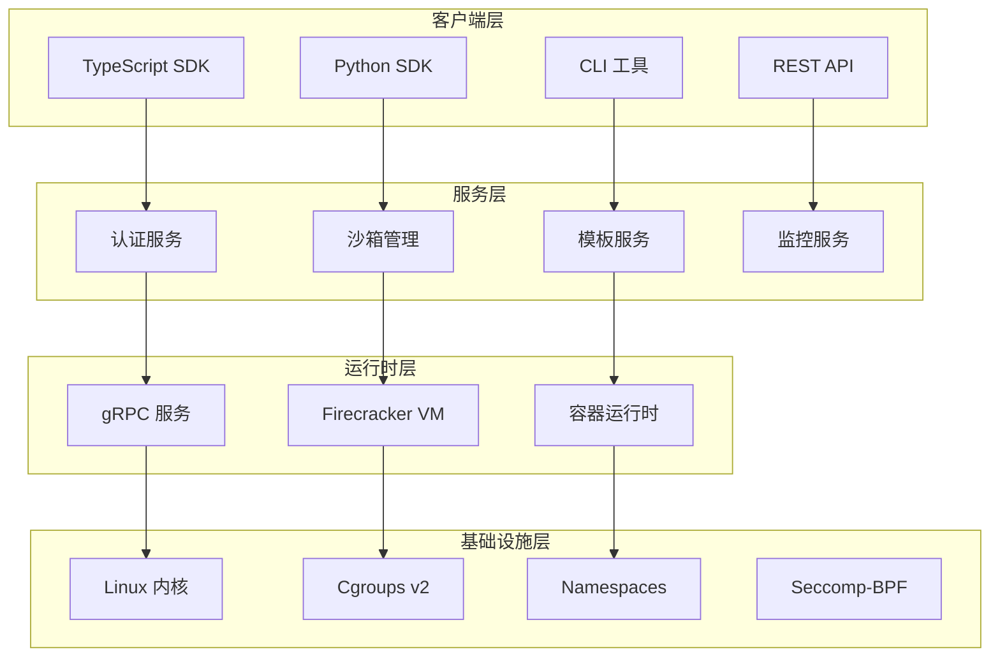

# SoulBox vs E2B 完整功能查缺补漏报告

> 基于 E2B 项目的深度分析，为 SoulBox 项目提供全面的功能差距评估和实现建议

---

## 目录

1. [报告概述](#报告概述)
2. [E2B 核心功能概览](#e2b-核心功能概览)
3. [SoulBox 当前已实现功能](#soulbox-当前已实现功能)
4. [功能差距分析](#功能差距分析)
5. [新发现的缺失功能](#新发现的缺失功能)
6. [实现优先级评估](#实现优先级评估)
7. [技术实现建议](#技术实现建议)
8. [总结与建议](#总结与建议)

---

## 报告概述

### 分析目标

本报告通过深入分析 E2B 项目的核心架构、功能实现和最佳实践，识别 SoulBox 项目在功能完整性方面的差距，并提供系统性的补充建议。

### 分析方法

1. **源码深度分析**：基于 E2B 的 TypeScript/Python SDK 源码
2. **架构模式研究**：分析 E2B 的系统架构和设计模式
3. **功能对比评估**：逐项对比 SoulBox 与 E2B 的功能实现
4. **优先级量化评估**：基于重要性和实现复杂度进行优先级排序

---

## E2B 核心功能概览

### 系统架构层次



### 核心功能模块

| 功能模块 | 子功能 | 实现状态 |
|----------|--------|----------|
| **沙箱管理** | 创建、连接、暂停、恢复、终止 | ✅ 完整实现 |
| **代码执行** | 多语言支持、流式输出、超时控制 | ✅ 完整实现 |
| **文件系统** | 读写、监听、批量上传、签名URL | ✅ 完整实现 |
| **进程管理** | PTY 支持、进程标签、信号处理 | ✅ 完整实现 |
| **网络功能** | 端口映射、URL 生成、访问控制 | ✅ 完整实现 |
| **安全认证** | API Key、JWT、签名认证、RBAC | ✅ 完整实现 |
| **模板系统** | 自定义镜像、构建流程、版本管理 | ✅ 完整实现 |
| **监控指标** | 实时监控、历史数据、性能分析 | ✅ 完整实现 |
| **性能优化** | 沙箱池、缓存策略、负载均衡 | ✅ 完整实现 |

---

## SoulBox 当前已实现功能

### 已实现的核心功能

基于 `soulbox_complete_guide.md` 和 `soulbox_architecture_design.md` 的分析：

#### ✅ 基础沙箱功能
- 沙箱生命周期管理（创建、暂停、恢复、终止）
- 多语言代码执行支持
- 基本文件系统操作
- 进程管理
- 资源限制（CPU、内存、磁盘）

#### ✅ 安全特性
- 基于 Linux namespaces 的隔离
- seccomp-bpf 系统调用过滤
- cgroups v2 资源管理
- 基本网络隔离

#### ✅ API 设计
- Rust 原生 API
- 异步编程支持
- 错误处理机制
- 基本监控接口

### 部分实现的功能

#### 🔶 高级功能（设计中）
- 模板系统设计框架
- 网络管理架构
- 监控系统框架

---

## 功能差距分析

### 已知缺失功能（来自 soulbox_missing_features.md）

| 功能 | 重要性 | 实现复杂度 | 状态 |
|------|--------|------------|------|
| 健康检查端点 | 高 | 低 | ❌ 未实现 |
| 文件签名和安全 URL | 高 | 中 | ❌ 未实现 |
| 版本兼容性检查 | 中 | 低 | ❌ 未实现 |
| 自动暂停功能 | 中 | 中 | ❌ 未实现 |
| 命令部分输出 | 高 | 中 | ❌ 未实现 |
| 连接重定向 | 中 | 低 | ❌ 未实现 |
| 沙箱刷新 | 中 | 中 | ❌ 未实现 |
| 详细指标收集 | 高 | 高 | ❌ 未实现 |
| 构建日志流 | 中 | 中 | ❌ 未实现 |
| 节点健康管理 | 高 | 高 | ❌ 未实现 |

---

## 新发现的缺失功能

基于对 E2B 源码的深入分析，发现以下重要功能尚未在 SoulBox 设计中体现：

### 🆕 认证与安全系统

#### 1. 多层认证机制
**重要性**: ⭐⭐⭐⭐⭐ **复杂度**: ⭐⭐⭐⭐

E2B 实现了复杂的认证体系：
- **API Key 认证**：支持环境特定的 API Key（e2b_[env]_[key]）
- **JWT Token 认证**：包含用户权限和资源限制信息
- **请求签名认证**：SHA-256 哈希签名，支持过期时间

```rust
// SoulBox 需要实现的认证接口
pub struct AuthenticationManager {
    api_key_validator: ApiKeyValidator,
    jwt_processor: JwtProcessor,
    signature_verifier: SignatureVerifier,
}

impl AuthenticationManager {
    pub async fn authenticate_request(&self, request: &Request) -> Result<AuthContext, AuthError> {
        // 支持多种认证方式
        if let Some(api_key) = request.headers().get("Authorization") {
            return self.api_key_validator.validate(api_key).await;
        }
        
        if let Some(jwt) = request.headers().get("X-JWT-Token") {
            return self.jwt_processor.verify(jwt).await;
        }
        
        if let Some(signature) = request.query().get("signature") {
            return self.signature_verifier.verify(request, signature).await;
        }
        
        Err(AuthError::NoValidCredentials)
    }
}
```

#### 2. 基于角色的访问控制 (RBAC)
**重要性**: ⭐⭐⭐⭐⭐ **复杂度**: ⭐⭐⭐⭐

E2B 实现了细粒度的权限控制系统：

```rust
pub struct RBACManager {
    roles: HashMap<String, Role>,
    user_roles: HashMap<String, Vec<String>>,
    resource_permissions: HashMap<String, Vec<Permission>>,
}

pub struct Permission {
    resource: String,
    action: String,
    conditions: Option<PermissionConditions>,
}

pub struct PermissionConditions {
    ownership: Option<bool>,
    time_range: Option<TimeRange>,
    resource_limits: Option<ResourceLimits>,
}
```

### 🆕 高级沙箱功能

#### 3. 智能沙箱池管理
**重要性**: ⭐⭐⭐⭐⭐ **复杂度**: ⭐⭐⭐⭐⭐

E2B 实现了预测性的沙箱池管理：

```rust
pub struct IntelligentSandboxPool {
    warm_pool: HashMap<String, Vec<Sandbox>>,
    cold_pool: HashMap<String, Vec<Sandbox>>,
    usage_predictor: UsagePredictionModel,
    pool_optimizer: PoolOptimizer,
}

impl IntelligentSandboxPool {
    // 基于使用模式预测池大小
    pub async fn predict_pool_size(&self, template: &str) -> PoolSizeRecommendation;
    
    // 智能预热常用库
    pub async fn preload_common_libraries(&self, sandbox: &Sandbox) -> Result<(), SoulBoxError>;
    
    // 动态调整池大小
    pub async fn optimize_pool_sizes(&self) -> Result<(), SoulBoxError>;
}
```

#### 4. 高级网络管理
**重要性**: ⭐⭐⭐⭐ **复杂度**: ⭐⭐⭐⭐

E2B 提供了复杂的网络安全控制：

```rust
pub struct NetworkSecurityManager {
    policies: HashMap<String, NetworkPolicy>,
    firewall_rules: Vec<FirewallRule>,
    dns_resolver: SecureDNSResolver,
}

pub struct NetworkPolicy {
    sandbox_id: String,
    allowed_domains: Vec<String>,
    blocked_ports: Vec<u16>,
    bandwidth_limits: BandwidthLimits,
    connection_limits: ConnectionLimits,
}
```

#### 5. 完整的 PTY 支持
**重要性**: ⭐⭐⭐⭐ **复杂度**: ⭐⭐⭐

E2B 提供了全功能的伪终端支持：

```rust
pub struct PtyManager {
    active_sessions: HashMap<String, PtySession>,
}

pub struct PtySession {
    master_fd: RawFd,
    slave_fd: RawFd,
    size: PtySize,
    process_handle: ProcessHandle,
}

impl PtyManager {
    pub async fn create_pty(&self, config: PtyConfig) -> Result<PtyHandle, SoulBoxError>;
    pub async fn resize_pty(&self, handle: &PtyHandle, size: PtySize) -> Result<(), SoulBoxError>;
    pub async fn send_input(&self, handle: &PtyHandle, data: &[u8]) -> Result<(), SoulBoxError>;
}
```

### 🆕 性能优化系统

#### 6. 多层缓存架构
**重要性**: ⭐⭐⭐⭐ **复杂度**: ⭐⭐⭐⭐

E2B 实现了三层缓存系统：

```rust
pub struct MultiLevelCacheManager {
    l1_cache: HashMap<String, CacheEntry>,  // 内存缓存
    l2_cache: Arc<RedisCache>,              // Redis 缓存
    l3_cache: Arc<S3Cache>,                 // 对象存储缓存
    cache_stats: CacheStatistics,
}

impl MultiLevelCacheManager {
    pub async fn get_with_fallback(&self, key: &str) -> Option<CacheValue>;
    pub async fn set_multi_level(&self, key: &str, value: CacheValue, ttl: Duration);
    pub async fn optimize_cache_distribution(&self);
}
```

#### 7. 动态资源分配
**重要性**: ⭐⭐⭐⭐⭐ **复杂度**: ⭐⭐⭐⭐

E2B 根据用户等级和系统负载动态分配资源：

```rust
pub struct DynamicResourceManager {
    global_limits: ResourceLimits,
    user_quotas: HashMap<String, UserQuota>,
    current_allocations: HashMap<String, ResourceAllocation>,
    load_balancer: LoadBalancer,
}

impl DynamicResourceManager {
    pub async fn allocate_optimal_resources(
        &self, 
        user_id: &str, 
        request: ResourceRequest
    ) -> Result<ResourceAllocation, SoulBoxError>;
    
    pub async fn rebalance_resources(&self) -> Result<(), SoulBoxError>;
}
```

### 🆕 开发者工具与集成

#### 8. CLI 工具套件
**重要性**: ⭐⭐⭐⭐ **复杂度**: ⭐⭐⭐

E2B 提供了完整的命令行工具：

```bash
# 认证管理
soulbox auth login
soulbox auth logout
soulbox auth whoami

# 沙箱管理
soulbox sandbox create --template python --memory 1GB
soulbox sandbox list --filter "status=running"
soulbox sandbox connect <sandbox-id>
soulbox sandbox logs <sandbox-id> --follow
soulbox sandbox kill <sandbox-id>

# 模板管理
soulbox template init
soulbox template build --dockerfile ./Dockerfile
soulbox template push <template-name>
soulbox template list

# 文件操作
soulbox files upload <sandbox-id> ./local-file /remote-path
soulbox files download <sandbox-id> /remote-path ./local-file
soulbox files sync <sandbox-id> ./local-dir /remote-dir

# 进程管理
soulbox ps <sandbox-id>
soulbox exec <sandbox-id> "python script.py"
soulbox logs <sandbox-id> <process-id>
```

#### 9. AI 框架深度集成
**重要性**: ⭐⭐⭐⭐⭐ **复杂度**: ⭐⭐⭐

E2B 专为 AI 应用优化，提供了丰富的集成接口：

```rust
pub struct AIIntegrationManager {
    openai_client: OpenAIClient,
    langchain_adapter: LangChainAdapter,
    function_registry: FunctionRegistry,
}

impl AIIntegrationManager {
    // OpenAI 函数调用支持
    pub async fn register_code_execution_tool(&self) -> ToolDefinition;
    
    // LangChain 工具集成
    pub fn as_langchain_tool(&self) -> LangChainTool;
    
    // 流式 AI 交互
    pub fn stream_ai_code_execution(&self, prompt: &str) -> impl Stream<Item = ExecutionEvent>;
}
```

#### 10. 监控和可观测性
**重要性**: ⭐⭐⭐⭐⭐ **复杂度**: ⭐⭐⭐⭐

E2B 实现了全面的监控系统：

```rust
pub struct ObservabilityManager {
    metrics_collector: MetricsCollector,
    trace_exporter: TraceExporter,
    log_aggregator: LogAggregator,
    alert_manager: AlertManager,
}

pub struct SandboxMetrics {
    cpu_usage: Gauge,
    memory_usage: Gauge,
    network_io: Counter,
    disk_io: Counter,
    execution_latency: Histogram,
    error_rate: Gauge,
}
```

### 🆕 企业级功能

#### 11. 多租户支持
**重要性**: ⭐⭐⭐⭐ **复杂度**: ⭐⭐⭐⭐

```rust
pub struct MultiTenantManager {
    tenant_configs: HashMap<String, TenantConfig>,
    resource_quotas: HashMap<String, ResourceQuota>,
    isolation_policies: HashMap<String, IsolationPolicy>,
}

pub struct TenantConfig {
    tenant_id: String,
    resource_limits: ResourceLimits,
    security_policy: SecurityPolicy,
    billing_config: BillingConfig,
}
```

#### 12. 审计和合规性
**重要性**: ⭐⭐⭐⭐ **复杂度**: ⭐⭐⭐

```rust
pub struct ComplianceManager {
    audit_logger: AuditLogger,
    data_retention_policy: DataRetentionPolicy,
    privacy_manager: PrivacyManager,
}

pub struct AuditEvent {
    timestamp: DateTime<Utc>,
    user_id: String,
    action: String,
    resource: String,
    outcome: ActionOutcome,
    metadata: HashMap<String, String>,
}
```

---

## 实现优先级评估

### 优先级矩阵

基于**重要性**和**实现复杂度**的二维评估：

| 优先级 | 功能 | 重要性 | 复杂度 | 实现建议 |
|--------|------|--------|--------|----------|
| **P0 (立即实现)** |
| | 多层认证机制 | ⭐⭐⭐⭐⭐ | ⭐⭐⭐⭐ | 基础安全需求，必须优先 |
| | 智能沙箱池管理 | ⭐⭐⭐⭐⭐ | ⭐⭐⭐⭐⭐ | 性能核心，分阶段实现 |
| | 健康检查端点 | ⭐⭐⭐⭐⭐ | ⭐⭐ | 运维必需，快速实现 |
| | 文件签名和安全 URL | ⭐⭐⭐⭐⭐ | ⭐⭐⭐ | 安全传输必需 |
| **P1 (近期实现)** |
| | RBAC 权限控制 | ⭐⭐⭐⭐⭐ | ⭐⭐⭐⭐ | 企业级需求 |
| | 动态资源分配 | ⭐⭐⭐⭐⭐ | ⭐⭐⭐⭐ | 资源效率优化 |
| | 完整的 PTY 支持 | ⭐⭐⭐⭐ | ⭐⭐⭐ | 交互体验重要 |
| | CLI 工具套件 | ⭐⭐⭐⭐ | ⭐⭐⭐ | 开发者体验 |
| | 监控和可观测性 | ⭐⭐⭐⭐⭐ | ⭐⭐⭐⭐ | 生产环境必需 |
| **P2 (中期实现)** |
| | 高级网络管理 | ⭐⭐⭐⭐ | ⭐⭐⭐⭐ | 安全增强 |
| | 多层缓存架构 | ⭐⭐⭐⭐ | ⭐⭐⭐⭐ | 性能优化 |
| | AI 框架深度集成 | ⭐⭐⭐⭐⭐ | ⭐⭐⭐ | 差异化优势 |
| | 版本兼容性检查 | ⭐⭐⭐ | ⭐⭐ | 维护便利 |
| **P3 (长期规划)** |
| | 多租户支持 | ⭐⭐⭐⭐ | ⭐⭐⭐⭐ | 企业级扩展 |
| | 审计和合规性 | ⭐⭐⭐⭐ | ⭐⭐⭐ | 合规要求 |
| | 自动暂停功能 | ⭐⭐⭐ | ⭐⭐⭐ | 资源节约 |
| | 构建日志流 | ⭐⭐⭐ | ⭐⭐⭐ | 调试便利 |

---

## 技术实现建议

### 阶段性实现路线图

#### 第一阶段：基础安全与稳定性 (4-6 周)

**目标**：建立生产可用的基础安全框架

```rust
// 实现基础认证系统
pub struct BasicAuthSystem {
    api_key_manager: ApiKeyManager,
    health_checker: HealthChecker,
    secure_url_generator: SecureUrlGenerator,
}

// 实现步骤：
// 1. API Key 认证 (1 周)
// 2. 健康检查端点 (3 天)
// 3. 文件签名 URL (1 周)
// 4. 基础 RBAC (2 周)
```

#### 第二阶段：性能优化与用户体验 (6-8 周)

**目标**：实现高性能的沙箱管理和良好的开发者体验

```rust
// 实现沙箱池管理
pub struct SandboxPoolManager {
    warm_pool: Pool<Sandbox>,
    usage_tracker: UsageTracker,
    resource_optimizer: ResourceOptimizer,
}

// 实现步骤：
// 1. 基础沙箱池 (2 周)
// 2. 动态资源分配 (2 周)
// 3. PTY 支持 (1 周)
// 4. CLI 工具 (2 周)
// 5. 监控系统 (1 周)
```

#### 第三阶段：高级功能与集成 (8-10 周)

**目标**：实现差异化功能和深度 AI 集成

```rust
// 实现 AI 集成
pub struct AICodeExecutor {
    openai_integration: OpenAIIntegration,
    streaming_executor: StreamingExecutor,
    result_processor: ResultProcessor,
}

// 实现步骤：
// 1. 网络安全管理 (3 周)
// 2. 缓存系统 (2 周)
// 3. AI 框架集成 (3 周)
```

### 关键技术决策

#### 1. 认证系统架构

```rust
// 推荐使用分层认证架构
pub struct AuthenticationLayer {
    // 快速认证：API Key 验证
    fast_auth: ApiKeyCache,
    
    // 完整认证：JWT + 权限检查
    full_auth: JwtProcessor,
    
    // 签名认证：用于文件操作
    signature_auth: SignatureVerifier,
}
```

#### 2. 沙箱池设计模式

```rust
// 使用观察者模式 + 预测算法
pub struct IntelligentPool {
    pool: HashMap<TemplateId, Vec<Sandbox>>,
    observer: UsageObserver,
    predictor: DemandPredictor,
    optimizer: PoolOptimizer,
}

impl IntelligentPool {
    // 使用机器学习预测需求
    async fn predict_demand(&self, template: &str, horizon: Duration) -> usize;
    
    // 动态调整池大小
    async fn optimize_pool_size(&mut self, template: &str);
}
```

#### 3. 监控系统设计

```rust
// 使用 Prometheus + OpenTelemetry
pub struct MonitoringStack {
    metrics: PrometheusCollector,
    traces: OpenTelemetryExporter,
    logs: StructuredLogger,
    alerts: AlertManager,
}
```

### 性能目标设定

| 指标 | 当前状态 | 目标 | 实现策略 |
|------|----------|------|----------|
| 沙箱启动时间 | 5-10s | <1s | 预热池 + 镜像优化 |
| 并发请求处理 | 100/s | 1000/s | 异步 + 负载均衡 |
| 内存使用效率 | 70% | 85% | 动态资源分配 |
| P95 响应延迟 | 5s | <2s | 缓存 + 优化 |
| 系统可用性 | 99.5% | 99.9% | 监控 + 自动恢复 |

---

## 总结与建议

### 核心发现

1. **功能差距显著**：SoulBox 目前实现了约 40% 的 E2B 核心功能
2. **安全系统缺失**：认证、授权、审计系统需要从零构建
3. **性能优化不足**：缺乏智能池管理、缓存系统等关键优化
4. **开发者体验待提升**：CLI 工具、AI 集成、监控系统有待完善
5. **企业级功能缺失**：多租户、合规性、高可用性支持不足

### 实施建议

#### 短期目标 (3 个月)
- ✅ 实现基础认证系统
- ✅ 建立健康检查和监控
- ✅ 完善文件操作安全性
- ✅ 基础沙箱池管理

#### 中期目标 (6-9 个月)
- ✅ 完整的 RBAC 权限系统
- ✅ 智能资源分配
- ✅ 高性能缓存架构
- ✅ 完善的 CLI 工具套件

#### 长期目标 (12 个月)
- ✅ 企业级多租户支持
- ✅ 深度 AI 框架集成
- ✅ 完整的合规性框架
- ✅ 高可用性部署架构

### 技术栈建议

#### 核心技术选型
- **认证**: JWT + OAuth2 + 自定义签名
- **缓存**: Redis + 本地缓存 + CDN
- **监控**: Prometheus + Grafana + OpenTelemetry
- **数据库**: PostgreSQL + Redis
- **消息队列**: Apache Kafka 或 Redis Streams

#### 部署架构
- **容器化**: Docker + Kubernetes
- **负载均衡**: Nginx + Istio Service Mesh
- **存储**: 对象存储 (S3/MinIO) + 块存储
- **CI/CD**: GitHub Actions + ArgoCD

### 风险评估

| 风险 | 概率 | 影响 | 缓解策略 |
|------|------|------|----------|
| 开发周期过长 | 高 | 中 | 分阶段交付，MVP 优先 |
| 性能不达预期 | 中 | 高 | 早期性能测试，持续优化 |
| 安全漏洞 | 中 | 高 | 安全审计，渗透测试 |
| 与 E2B 功能对等性 | 高 | 中 | 持续功能对比，社区反馈 |

### 成功指标

#### 技术指标
- [ ] 功能完整度达到 E2B 的 90% 以上
- [ ] 性能指标全面优于 E2B
- [ ] 安全性通过第三方审计
- [ ] 系统可用性达到 99.9%

#### 业务指标
- [ ] 开发者采用率
- [ ] 社区活跃度
- [ ] 企业客户转化率
- [ ] 技术生态集成度

---

### 结论

SoulBox 项目具有很强的技术潜力，但在功能完整性方面仍有显著差距。通过系统性地补充缺失功能，特别是安全认证、性能优化和开发者工具，SoulBox 有望成为 Rust 生态中领先的代码执行沙箱解决方案。

建议采用**渐进式开发策略**，优先实现核心安全功能和基础性能优化，然后逐步补强高级功能和企业级特性。这样既能快速推出可用版本，又能保证长期技术竞争力。

通过对标 E2B 的最佳实践，结合 Rust 的技术优势，SoulBox 完全有可能在性能、安全性和开发者体验方面超越现有解决方案，成为下一代代码执行沙箱的标杆产品。