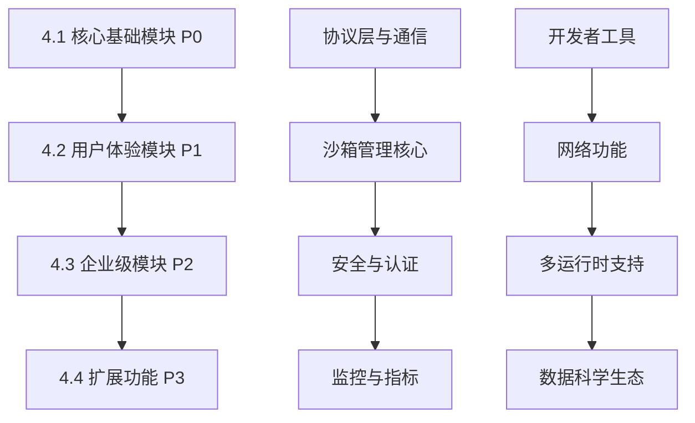

# SoulBox 模块化开发路线指南

> 基于模块化分类的系统性学习和开发指南

## 🎯 开发路线总览

按照优先级和依赖关系，建议按以下顺序进行模块开发：



---

## 🔴 第一阶段：核心基础模块（P0优先级）

> **时间估算**：8-12周  
> **目标**：建立SoulBox的核心基础设施

### 4.1.1 协议层与通信（1-2周）

**关键技术**：gRPC, Protocol Buffers, WebSocket, 连接池

**学习重点**：
- gRPC 双向流式通信
- Protocol Buffers 序列化
- Keep-alive 心跳机制
- 连接池管理和重连策略

**实现任务**：
```rust
// 核心组件
- EnvdService (gRPC服务)
- ConnectionManager (连接管理)  
- KeepAliveManager (心跳管理)
- ConnectionPool (连接池)
```

**验收标准**：
- [ ] gRPC 服务正常启动和响应
- [ ] 支持双向流式通信
- [ ] 连接断开自动重连
- [ ] 连接池正确管理连接数量

### 4.1.2 沙箱管理核心（3-4周）

**关键技术**：Docker, 模板系统, 会话持久化, 资源池化

**学习重点**：
- Dockerfile 模板构建
- 沙箱生命周期管理
- 会话状态保存/恢复
- 预热池和资源调度

**实现任务**：
```rust
// 核心组件
- TemplateBuilder (模板构建)
- SandboxPool (沙箱池)
- SessionManager (会话管理)
- SandboxPersistence (持久化)
```

**验收标准**：
- [ ] 支持 Dockerfile 模板构建
- [ ] 沙箱创建时间 <500ms (冷启动)
- [ ] 会话可以暂停和恢复
- [ ] 预热池自动补充沙箱

### 4.1.3 安全与认证（2-3周）

**关键技术**：HMAC签名, RBAC, JWT, OAuth2

**学习重点**：
- SHA-256 HMAC URL签名
- 基于角色的权限控制
- JWT令牌验证
- 防重放攻击机制

**实现任务**：
```rust
// 核心组件  
- UrlSigner (URL签名)
- RbacManager (权限管理)
- AuthMiddleware (认证中间件)
- NonceStore (防重放)
```

**验收标准**：
- [ ] API密钥认证工作正常
- [ ] URL签名验证通过
- [ ] RBAC权限控制生效
- [ ] 防重放攻击机制有效

### 4.1.4 监控与指标（2-3周）

**关键技术**：实时指标采集, 结构化日志, 性能监控

**学习重点**：
- cgroups v2 指标采集
- 结构化日志设计
- 实时数据流处理
- 指标存储和查询

**实现任务**：
```rust
// 核心组件
- MetricsCollector (指标采集)
- StructuredLogger (结构化日志)
- PerformanceMonitor (性能监控)
- AlertManager (告警管理)
```

**验收标准**：
- [ ] CPU/内存指标每秒采集
- [ ] 日志支持动态级别调整
- [ ] 性能数据实时可视化
- [ ] 异常情况自动告警

---

## 🟡 第二阶段：用户体验模块（P1重要）

> **时间估算**：6-10周  
> **目标**：提升开发者使用体验

### 4.2.1 开发者工具（2-3周）

**关键技术**：CLI设计, PTY终端, 实时调试, 热重载

**学习重点**：
- 命令行界面设计
- 伪终端(PTY)实现
- 远程调试协议
- 文件变化监控

**实现任务**：
```rust
// 核心组件
- CliApp (命令行应用)
- PtyManager (终端管理)
- DebugServer (调试服务)
- HotReloader (热重载)
```

**验收标准**：
- [ ] CLI命令功能完整
- [ ] 终端交互体验良好
- [ ] 支持远程调试
- [ ] 代码变更自动重载

### 4.2.2 网络功能（1-2周）

**关键技术**：端口映射, DNS管理, 代理协议, QoS控制

**学习重点**：
- 动态端口分配
- 域名解析和SSL
- 代理链和负载均衡
- 带宽限制和优先级

**实现任务**：
```rust
// 核心组件
- PortManager (端口管理)
- DnsResolver (DNS解析)
- ProxyChain (代理链)
- QosController (QoS控制)
```

**验收标准**：
- [ ] 端口自动分配和映射
- [ ] 自定义域名正常访问
- [ ] 代理功能工作正常
- [ ] 带宽限制生效

### 4.2.3 多运行时支持（2-3周）

**关键技术**：运行时适配, Bun/Deno集成, Edge Runtime

**学习重点**：
- JavaScript运行时差异
- 权限模型和沙箱
- Edge函数部署
- 性能优化策略

**实现任务**：
```rust
// 核心组件
- RuntimeDetector (运行时检测)
- BunAdapter (Bun适配器)
- DenoAdapter (Deno适配器)  
- EdgeRuntimeAdapter (边缘运行时)
```

**验收标准**：
- [ ] 自动检测JavaScript运行时
- [ ] Bun项目正常执行
- [ ] Deno权限模型集成
- [ ] Edge函数部署成功

### 4.2.4 数据科学生态（1-2周）

**关键技术**：Jupyter集成, GPU调度, 科学计算库

**学习重点**：
- IPython内核协议
- CUDA/ROCm GPU编程
- 数据可视化管道
- 分布式计算框架

**实现任务**：
```rust
// 核心组件
- JupyterKernel (Jupyter内核)
- GpuScheduler (GPU调度)
- DataVizEngine (数据可视化)
- DistributedCompute (分布式计算)
```

**验收标准**：
- [ ] Jupyter notebook正常运行
- [ ] GPU资源正确分配
- [ ] 数据可视化图表生成
- [ ] 支持并行计算任务

---

## 🟢 第三阶段：企业级模块（P2高级）

> **时间估算**：4-8周  
> **目标**：满足企业级部署需求

### 4.3.1 存储系统（2-3周）

**关键技术**：云存储抽象, FUSE文件系统, 多级缓存

**学习重点**：
- 对象存储API设计
- FUSE文件系统开发
- 缓存策略和一致性
- 数据压缩和去重

**验收标准**：
- [ ] 支持多家云存储提供商
- [ ] 云存储挂载为本地文件系统
- [ ] 多级缓存提升性能
- [ ] 数据一致性保证

### 4.3.2 企业功能（1-2周）

**关键技术**：多租户架构, 合规审计, SLA监控

**学习重点**：
- 租户隔离策略
- GDPR合规实现
- SLA指标定义
- 成本分摊算法

**验收标准**：
- [ ] 多租户完全隔离
- [ ] 审计日志符合合规要求
- [ ] SLA监控和报警
- [ ] 成本追踪准确

### 4.3.3 AI集成（1-2周）

**关键技术**：LangChain集成, OpenAI API, 向量数据库

**学习重点**：
- AI工具链设计
- 函数调用协议
- 向量搜索和相似度
- 流式响应处理

**验收标准**：
- [ ] LangChain工具正常工作
- [ ] OpenAI函数调用成功
- [ ] 向量数据库集成
- [ ] AI响应流式传输

### 4.3.4 性能优化（1-2周）

**关键技术**：智能缓存, GPU调度, NUMA优化

**学习重点**：
- 缓存预测算法
- GPU资源调度策略
- NUMA节点感知
- 零拷贝优化

**验收标准**：
- [ ] 缓存命中率>90%
- [ ] GPU利用率>80%
- [ ] NUMA优化生效
- [ ] 内存零拷贝实现

---

## 🔵 第四阶段：扩展功能（P3未来）

> **时间估算**：2-4周  
> **目标**：实现差异化竞争优势

### 4.4.1 容器支持（1-2周）

**关键技术**：Docker-in-Docker, Kubernetes集成

**验收标准**：
- [ ] 容器嵌套运行
- [ ] K8s Pod管理
- [ ] 镜像构建流水线

### 4.4.2 边缘计算（1-2周）

**关键技术**：WebAssembly, CDN集成, 离线同步

**验收标准**：
- [ ] WASM代码执行
- [ ] CDN边缘部署
- [ ] 离线模式同步

---

## 📚 学习资源推荐

### 必读技术文档
1. **gRPC官方文档** - 协议层通信
2. **Docker官方指南** - 容器化技术  
3. **Kubernetes概念** - 容器编排
4. **Rust异步编程** - tokio生态系统

### 推荐学习顺序
1. 先完成一个模块的所有功能
2. 编写单元测试和集成测试
3. 进行性能测试和优化
4. 撰写技术文档和使用说明

### 质量保证
- 每个功能都要有完整的测试覆盖
- 关键路径需要有性能基准测试
- 安全功能必须经过渗透测试
- 文档必须与代码保持同步

---

## 🎯 里程碑检查点

- **第4周**：协议层基本功能完成
- **第8周**：沙箱管理核心完成
- **第12周**：安全认证和监控完成
- **第16周**：开发者工具和网络功能完成
- **第20周**：数据科学和多运行时完成
- **第24周**：企业功能和性能优化完成
- **第28周**：扩展功能和文档完成

按照这个路线图，你将能够系统性地学习和开发SoulBox的各个模块，确保项目的质量和进度！