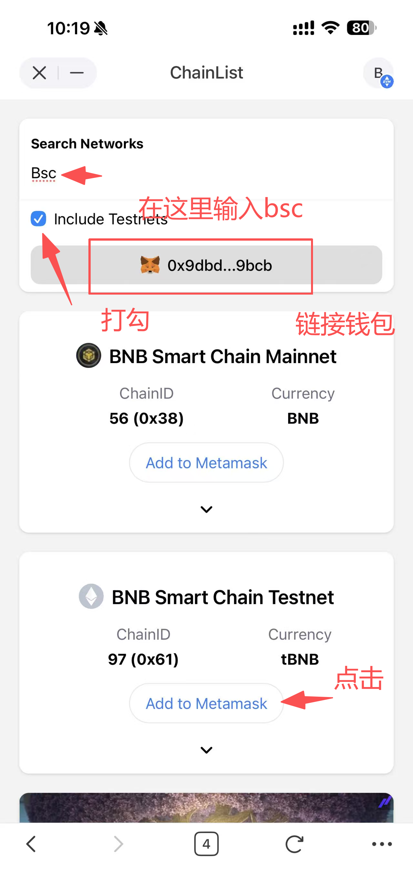
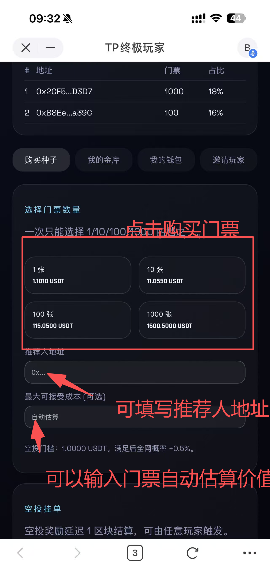
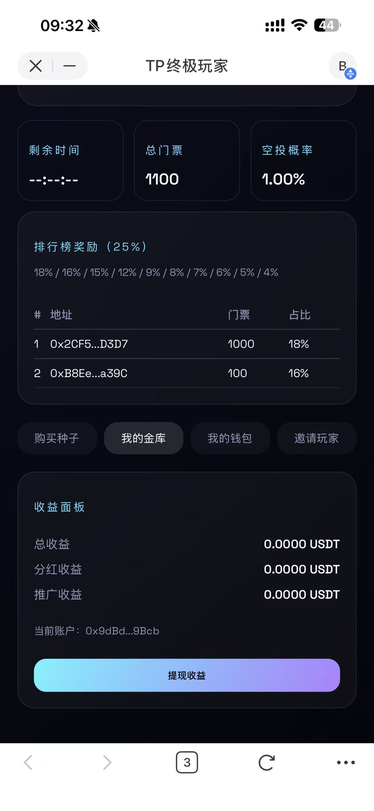
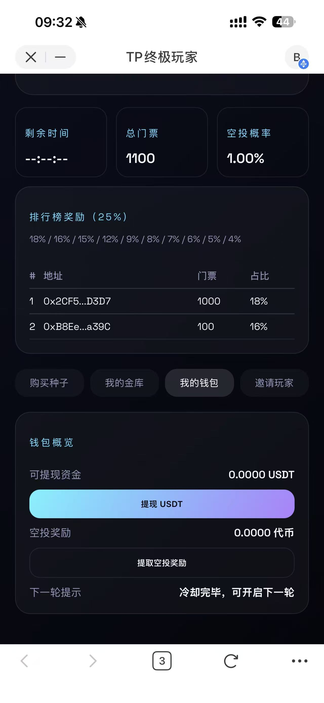
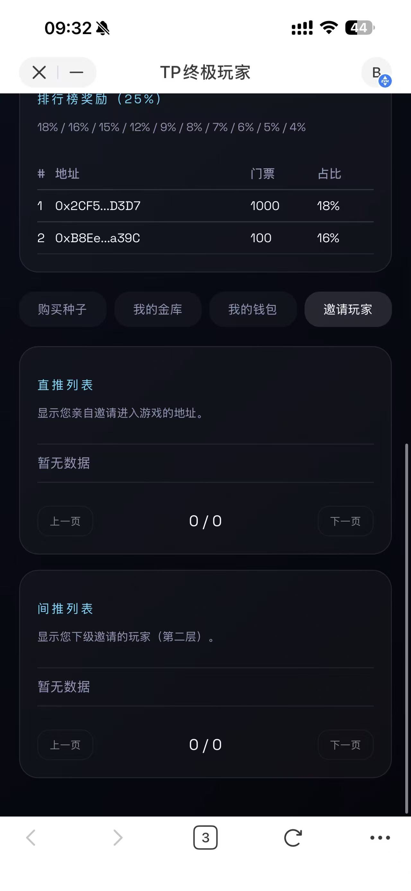
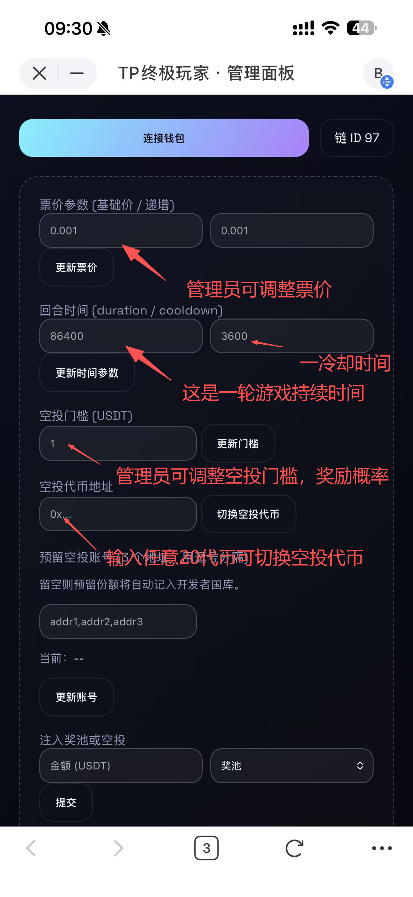
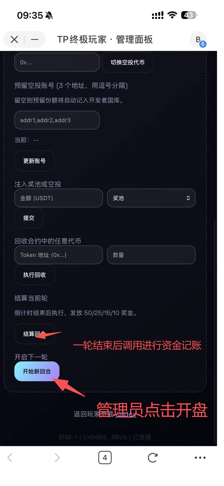

# 终极玩家操作流程

**玩家端**：https://tp.ceeeb64.workers.dev/  
**管理员端**：https://tp.ceeeb64.workers.dev/admin

---

## 玩家流程

### 1. 添加 BSC 测试网（链配置）
- 推荐用 Chainlist 自动添加：https://chainlist.org/ 搜索 “BSC Testnet”，点击 “Connect Wallet” 再 “Add to Wallet”，在钱包里确认即可。
- 若手动添加，可在钱包里新增网络并填入：
  - 网络名称：BSC Testnet
  - 新 RPC URL：https://data-seed-prebsc-1-s1.binance.org:8545
  - 链 ID：97
  - 货币符号：tBNB
  - 浏览器：https://testnet.bscscan.com

示例截图：

---

---

### 2. 连接钱包
- 打开玩家端，点击右上角「连接钱包」，选择 BSC 测试网（或正式部署后的主网）。
- 成功连接后，界面会显示当前账号缩写。

### 3. 购票步骤
1. 在「购票中心」选择 1/10/100/1000 张；如有推荐人，在「推荐人地址」填入上级地址（示例：`0x2cf5⋯`）。
2. 确保本次购票金额 ≥ 空投门槛（默认 1 USDT），否则不会增加抽奖概率。
3. 若担心票价浮动，在「最大可接受成本」输入上限。
4. 点击购票按钮，钱包弹窗确认即可；系统会自动结算分红、推广、空投。

> 示例推荐关系：  
> 买票人：`0x122e268a49b3b617af62be87393b214894c7a674`  
> 直推：`0x2cf5446b1d01fbf0be6e895f1c26b2a6a40ad3d7`  
> 间推：`0xb8ee25e6f4e993406180fe9fdfca0c935605a39c`

页面示例：  

### 3. 收益查看
- 「收益面板」显示三项：  
  - **总收益**：当前可提的 USDT。  
  - **分红收益**：未结算分红，点「提现收益」即可累加到总收益。  
  - **推广收益**：直推/间推累计金额。
- 「我的钱包」卡片提供快速提现：  
  - 点击「提现 USDT」即可把总收益转回钱包。  
  - 若有空投奖励，点「提取空投奖励」领取。  
  - 「下一轮提示」会显示回合状态，如果显示“当前轮已结束”，请等待管理员结算并开启新一轮。

界面示例：  
  

### 4. 空投信息
- 「空投挂单」会显示最近中奖者（地址 + 奖金 + 下一区块可领取），若显示“当前无挂单”说明还没人中奖或已结算。
- 若中奖，需要等待至少 1 个区块，再点击「结算空投」或等待系统自动结算。

### 5. 邀请列表
- 进入「邀请玩家」选项卡，可分页查看直推和间推地址，方便管理团队关系。

界面示例：  

---

## 管理员流程

### 1. 连接后台
- 使用 Owner 钱包访问管理员端并点击「连接钱包」。非 Owner 无法编辑参数。

### 2. 基本配置
- **票价参数**：可调整基础价与递增价（默认 0.001 / 0.001）。
- **回合时间/冷却时间**：默认 24 小时 / 1 小时，可按需求修改。
- **空投门槛**：默认 1 USDT。
- **开发者国库地址**：`0x8224fbbdc261759cbf861c16394a9141c5575c25`。
- **社区基金地址**：`0xb11b018c1d6f093cbe5e50e76fd9ed4c70f90c79`。
- **空投预留账号（示例，可换成正式账号）**：  
  1. `0x9e77389505ccd3d89e11109b3ec96d8458603ffe`  
  2. `0xdf122a018c12d6129205f98a8c8758f4f2ff37c3`  
  3. `0x02b6438f76d32d6195f25e122af0a71d9067f9f8`

后台示例：  
  

### 3. 注资与回收
- 「注入奖池或空投」：输入金额并选择方向（奖池/空投）后提交，合约会从管理员钱包划转相应 USDT。
- 「回收合约中的任意代币」：输入代币地址与数量，执行后可将合约中多余资产转回管理员钱包。

### 4. 回合管理
1. 若玩家端显示“当前轮已结束”，请先点击后台的「结算当前轮」按钮，系统会按 50%/25%/15%/10% 分配奖池。
2. 结算完成后，点击「开启下一轮」，新的回合立即开始。
3. 当 25% 排行榜奖励发放完毕，新一轮的排行榜会自动清零、重新统计。

### 5. 切换空投代币（如有需要）
1. 确保空投池和 `pendingAirdropRewards` 都为 0。
2. 输入新的代币合约地址，点击「切换空投代币」。
3. 立即通过「注入空投」补充等值新代币，保证 1:1 发放。

---

通过以上步骤，即可完成完整的玩家购票、收益查看、空投领取流程，以及管理员的调参、注资、结算与新轮开启。整个操作不需要修改代码，只需按照页面提示点击对应按钮即可。

---

## 测试数据与地址（请勿暴露生产环境）

> 仅供测试使用，包含私钥和敏感地址，请勿泄露或在主网使用。

- **管理员地址**：`0x6c62d0c68071335f6fdf7bfe7d866659ad1b0061`  
  **管理员私钥**：`7cc046fe6c3a6528d9861d1d162edadb90cd818a584c705d172b7d619bdde140`
- **开发者国库地址**：`0x8224fbbdc261759cbf861c16394a9141c5575c25`  
  **私钥**：`d74168aed1725675c2041c4d34bdfa32530ee6575241354ef6b84963a571e59c`
- **社区基金地址**：`0xb11b018c1d6f093cbe5e50e76fd9ed4c70f90c79`  
  **私钥**：`9e7d9b96c2306237b8c1ff8ee4094c03761b835f183f6519b3a7567f7c4bcd02`
- **USDT 测试代币地址**：`0x26dd16D5B9708032872a7cD10C100b0FcE4E79a9`

### 推荐关系测试地址
- **买票人**：`0x122e268a49b3b617af62be87393b214894c7a674`  
  **私钥**：`89cc918e6bdb4c46c49c8a3c5f2807f98f55109fa64d088fcbdef6099a47a89a`
- **邀请人（直推）**：`0x2cf5446b1d01fbf0be6e895f1c26b2a6a40ad3d7`  
  **私钥**：`113f848e2c433dcefd7bd62227fcda34269e12f138ebf430189277a63ecbdacb`
- **间接邀请人**：`0xb8ee25e6f4e993406180fe9fdfca0c935605a39c`  
  **私钥**：`fa3cdf14159a270ca6da44567b3d99dfcbe007f42b8bceab62e01110fc57ba84`

### 管理员预置空投地址
1. `0x9e77389505ccd3d89e11109b3ec96d8458603ffe`  
   **私钥**：`418fd094258cd4f17e8ad197fe07e15321c3f07deac1b59cea98cf6342ae4549`
2. `0xdf122a018c12d6129205f98a8c8758f4f2ff37c3`  
   **私钥**：`1fe977553945e7a7d960654020cb8b378229bf42607ad174616732ba04886533`
3. `0x02b6438f76d32d6195f25e122af0a71d9067f9f8`  
   **私钥**：`93bc67ddaea266c3fcba97d2fd146972d8f60d52d5e4cc0d0e7cdb5604cab442`
