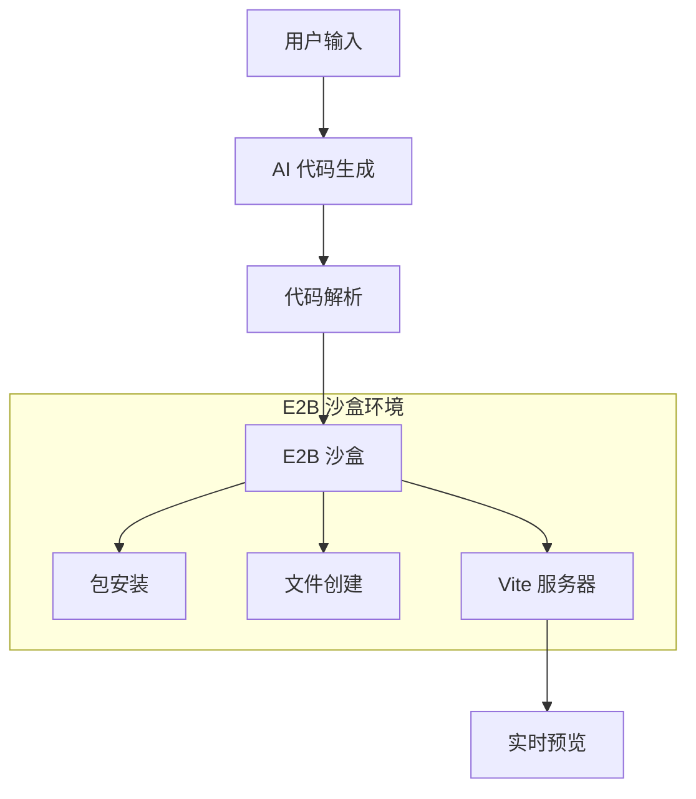

# Open Lovable E2B 沙盒集成开发指南

## 概述

Open Lovable 是一个基于 E2B 沙盒技术的 AI 驱动的 React 应用构建平台。本文档深入分析了项目中 E2B 沙盒的集成方式、架构设计和最佳实践。

## 目录

- [E2B 沙盒概述](#e2b-沙盒概述)
- [项目架构](#项目架构)
- [配置和初始化](#配置和初始化)
- [主要 API 和功能](#主要-api-和功能)
- [代码示例](#代码示例)
- [最佳实践](#最佳实践)
- [常见问题和故障排除](#常见问题和故障排除)
- [性能优化](#性能优化)

## E2B 沙盒概述

### 什么是 E2B 沙盒

E2B (Environment-to-Build) 是一个云原生的代码执行环境，为 AI 应用提供安全、隔离的运行时环境。在 Open Lovable 中，E2B 沙盒用于：

- **安全代码执行**：在隔离环境中运行 AI 生成的代码
- **实时预览**：提供 Vite 开发服务器用于实时预览 React 应用
- **包管理**：自动检测并安装所需的 npm 包
- **文件系统操作**：创建、读取和修改文件
- **命令执行**：运行构建、测试和部署命令

### E2B 在项目中的作用



## 项目架构

### 核心依赖

项目使用两个主要的 E2B SDK：

```json
{
  "dependencies": {
    "@e2b/code-interpreter": "^1.5.1",
    "e2b": "^1.13.2"
  }
}
```

- **@e2b/code-interpreter**: 专为代码解释器场景设计的高级 SDK
- **e2b**: 底层的 E2B SDK，提供更灵活的沙盒控制

### 全局状态管理

项目使用 Node.js 全局变量管理沙盒状态：

```typescript
// 全局状态声明
declare global {
  var activeSandbox: any;           // 当前活跃的沙盒实例
  var sandboxData: any;            // 沙盒元数据
  var existingFiles: Set<string>;  // 已创建文件追踪
  var sandboxState: SandboxState;  // 完整沙盒状态
}

// 沙盒状态接口
interface SandboxState {
  fileCache: SandboxFileCache | null;
  sandbox: any;
  sandboxData: {
    sandboxId: string;
    url: string;
  } | null;
}
```

### 配置系统

应用配置集中管理在 `/config/app.config.ts`：

```typescript
export const appConfig = {
  e2b: {
    timeoutMinutes: 15,           // 沙盒超时时间
    timeoutMs: 15 * 60 * 1000,    // 超时时间（毫秒）
    vitePort: 5173,               // Vite 开发服务器端口
    viteStartupDelay: 7000,       // Vite 启动延迟
    cssRebuildDelay: 2000,        // CSS 重建延迟
  }
}
```

## 配置和初始化

### 环境变量配置

创建 `.env.local` 文件：

```env
# 必需 - E2B 沙盒 API 密钥
E2B_API_KEY=your_e2b_api_key_here

# 必需 - Firecrawl API 密钥（用于网页抓取）
FIRECRAWL_API_KEY=your_firecrawl_api_key_here

# 可选 - AI 提供商 API 密钥（至少需要一个）
ANTHROPIC_API_KEY=your_anthropic_api_key_here
OPENAI_API_KEY=your_openai_api_key_here
GEMINI_API_KEY=your_gemini_api_key_here
GROQ_API_KEY=your_groq_api_key_here
```

### 沙盒初始化流程

沙盒初始化在 `/app/api/create-ai-sandbox/route.ts` 中实现：

```typescript
export async function POST() {
  let sandbox: any = null;
  
  try {
    // 1. 清理现有沙盒
    if (global.activeSandbox) {
      await global.activeSandbox.kill();
      global.activeSandbox = null;
    }
    
    // 2. 创建新的沙盒
    sandbox = await Sandbox.create({ 
      apiKey: process.env.E2B_API_KEY,
      timeoutMs: appConfig.e2b.timeoutMs
    });
    
    // 3. 设置 Vite React 应用环境
    await setupViteReactApp(sandbox);
    
    // 4. 启动 Vite 开发服务器
    await startViteDevServer(sandbox);
    
    // 5. 保存沙盒状态
    global.activeSandbox = sandbox;
    global.sandboxData = {
      sandboxId: sandbox.sandboxId,
      url: `https://${sandbox.getHost(appConfig.e2b.vitePort)}`
    };
    
    return NextResponse.json({
      success: true,
      sandboxId: sandbox.sandboxId,
      url: global.sandboxData.url,
      message: 'Sandbox created and Vite React app initialized'
    });
    
  } catch (error) {
    // 错误处理和清理
    if (sandbox) {
      await sandbox.kill();
    }
    return NextResponse.json({ error: error.message }, { status: 500 });
  }
}
```

### Vite React 应用设置

沙盒初始化时会自动设置一个完整的 Vite React 应用：

```python
# Python 脚本用于设置文件结构
import os
import json

# 创建目录结构
os.makedirs('/home/user/app/src', exist_ok=True)

# package.json 配置
package_json = {
    "name": "sandbox-app",
    "version": "1.0.0",
    "type": "module",
    "scripts": {
        "dev": "vite --host",
        "build": "vite build",
        "preview": "vite preview"
    },
    "dependencies": {
        "react": "^18.2.0",
        "react-dom": "^18.2.0"
    },
    "devDependencies": {
        "@vitejs/plugin-react": "^4.0.0",
        "vite": "^4.3.9",
        "tailwindcss": "^3.3.0",
        "postcss": "^8.4.31",
        "autoprefixer": "^10.4.16"
    }
}
```

## 主要 API 和功能

### 1. 沙盒创建 API

**端点**: `POST /api/create-ai-sandbox`

**功能**:
- 创建新的 E2B 沙盒实例
- 设置 Vite React 开发环境
- 安装基础依赖包
- 启动开发服务器

**响应示例**:
```json
{
  "success": true,
  "sandboxId": "sb_123456789",
  "url": "https://sb_123456789-5173.e2b.dev",
  "message": "Sandbox created and Vite React app initialized"
}
```

### 2. 代码应用 API

**端点**: `POST /api/apply-ai-code`

**功能**:
- 解析 AI 生成的代码响应
- 自动检测和安装依赖包
- 创建和更新文件
- 执行命令

**请求体**:
```json
{
  "response": "<AI 响应包含 XML 标签>",
  "isEdit": false,
  "packages": ["react-router-dom", "axios"]
}
```

**XML 标签格式**:
```xml
<explanation>
创建一个带路由的 React 应用
</explanation>

<packages>
react-router-dom
axios
@heroicons/react
</packages>

<file path="src/App.jsx">
import React from 'react';
import { BrowserRouter as Router } from 'react-router-dom';
// ... 文件内容
</file>

<command>npm run dev</command>
```

### 3. 流式代码应用 API

**端点**: `POST /api/apply-ai-code-stream`

**功能**:
- 提供实时进度反馈的流式代码应用
- Server-Sent Events (SSE) 流式响应
- 实时包安装进度
- 文件创建进度追踪

**流式响应格式**:
```javascript
data: {"type": "start", "message": "Starting code application...", "totalSteps": 3}
data: {"type": "step", "step": 1, "message": "Installing 3 packages..."}
data: {"type": "package-progress", "type": "output", "message": "added 3 packages"}
data: {"type": "file-progress", "current": 1, "total": 5, "fileName": "App.jsx"}
data: {"type": "complete", "results": {...}, "message": "Success"}
```

### 4. 包安装 API

**端点**: `POST /api/install-packages`

**功能**:
- 安装指定的 npm 包
- 流式安装进度反馈
- 自动重启 Vite 服务器
- 避免重复安装

**请求体**:
```json
{
  "packages": ["react-router-dom", "axios", "@heroicons/react"],
  "sandboxId": "sb_123456789"
}
```

### 5. 自动包检测 API

**端点**: `POST /api/detect-and-install-packages`

**功能**:
- 从代码中自动检测依赖包
- 支持 ES6 import 和 CommonJS require
- 处理作用域包 (scoped packages)
- 过滤内置模块

**代码示例**:
```typescript
// 包检测正则表达式
const importRegex = /import\s+(?:(?:\{[^}]*\}|\*\s+as\s+\w+|\w+)\s*,?\s*)*(?:from\s+)?['"]([^'"]+)['"]/g;
const requireRegex = /require\s*\(['"]([^'"]+)['"]\)/g;

// 过滤和提取包名
const packageNames = packages.map(pkg => {
  if (pkg.startsWith('@')) {
    // 作用域包: @scope/package
    const parts = pkg.split('/');
    return parts.slice(0, 2).join('/');
  } else {
    // 普通包: package
    return pkg.split('/')[0];
  }
});
```

### 6. 文件管理 API

**端点**: `GET /api/get-sandbox-files`

**功能**:
- 获取沙盒中的所有文件
- 分析文件结构和依赖关系
- 构建组件树
- 提取路由信息

### 7. 沙盒控制 API

**端点**: `POST /api/kill-sandbox`
- 终止活跃沙盒

**端点**: `GET /api/sandbox-status`
- 获取沙盒状态

**端点**: `POST /api/restart-vite`
- 重启 Vite 开发服务器

**端点**: `POST /api/run-command`
- 在沙盒中执行命令

## 代码示例

### 创建沙盒实例

```typescript
import { Sandbox } from '@e2b/code-interpreter';
import { appConfig } from '@/config/app.config';

// 创建沙盒
const sandbox = await Sandbox.create({ 
  apiKey: process.env.E2B_API_KEY,
  timeoutMs: appConfig.e2b.timeoutMs
});

// 获取预览 URL
const host = sandbox.getHost(appConfig.e2b.vitePort);
const previewUrl = `https://${host}`;
```

### 文件操作

```typescript
// 写入文件
await sandbox.files.write('/home/user/app/src/App.jsx', fileContent);

// 读取文件
const content = await sandbox.files.read('/home/user/app/package.json');

// 检查文件是否存在
const exists = await sandbox.files.exists('/home/user/app/src/App.jsx');
```

### 命令执行

```typescript
// 使用 runCode 执行 Python 脚本
await sandbox.runCode(`
import subprocess
import os

os.chdir('/home/user/app')
result = subprocess.run(['npm', 'install', 'axios'], capture_output=True, text=True)
print(result.stdout)
`);

// 使用 commands.run 直接执行命令
const result = await sandbox.commands.run('npm install axios', {
  cwd: '/home/user/app',
  timeout: 60000,
  on_stdout: (data) => console.log('npm:', data),
  on_stderr: (data) => console.error('npm error:', data)
});
```

### React 组件示例

```jsx
// SandboxPreview 组件
import { useState, useEffect } from 'react';

export default function SandboxPreview({ 
  sandboxId, 
  port = 5173, 
  type = 'vite' 
}) {
  const [previewUrl, setPreviewUrl] = useState('');

  useEffect(() => {
    if (sandboxId) {
      // E2B 沙盒 URL 格式
      setPreviewUrl(`https://${sandboxId}-${port}.e2b.dev`);
    }
  }, [sandboxId, port]);

  return (
    <div className="relative bg-gray-900 rounded-lg overflow-hidden">
      <iframe
        src={previewUrl}
        className="w-full h-[600px] bg-white"
        title="Sandbox Preview"
        sandbox="allow-scripts allow-same-origin allow-forms"
      />
    </div>
  );
}
```

### 错误处理

```typescript
try {
  // 沙盒操作
  await sandbox.files.write(path, content);
} catch (error) {
  console.error('File operation failed:', error);
  
  // 清理沙盒
  if (sandbox) {
    await sandbox.kill();
    global.activeSandbox = null;
  }
  
  throw new Error(`Sandbox operation failed: ${error.message}`);
}
```

## 最佳实践

### 1. 沙盒生命周期管理

```typescript
// 始终在操作后清理沙盒
const cleanup = async () => {
  if (global.activeSandbox) {
    try {
      await global.activeSandbox.kill();
    } catch (error) {
      console.error('Cleanup failed:', error);
    } finally {
      global.activeSandbox = null;
      global.sandboxData = null;
      if (global.existingFiles) {
        global.existingFiles.clear();
      }
    }
  }
};

// 在进程退出时清理
process.on('exit', cleanup);
process.on('SIGINT', cleanup);
process.on('SIGTERM', cleanup);
```

### 2. 文件路径规范化

```typescript
function normalizeFilePath(filePath: string): string {
  let normalized = filePath;
  
  // 移除开头的斜杠
  if (normalized.startsWith('/')) {
    normalized = normalized.substring(1);
  }
  
  // 确保 src/ 前缀
  if (!normalized.startsWith('src/') && 
      !normalized.startsWith('public/') && 
      normalized !== 'index.html') {
    normalized = 'src/' + normalized;
  }
  
  return `/home/user/app/${normalized}`;
}
```

### 3. 包名解析

```typescript
function extractPackageName(importPath: string): string {
  if (importPath.startsWith('@')) {
    // 作用域包: @scope/package/subpath -> @scope/package
    const parts = importPath.split('/');
    return parts.slice(0, 2).join('/');
  } else {
    // 普通包: package/subpath -> package
    return importPath.split('/')[0];
  }
}
```

### 4. 超时和重试机制

```typescript
async function withRetry<T>(
  operation: () => Promise<T>, 
  maxRetries: number = 3,
  delay: number = 1000
): Promise<T> {
  for (let i = 0; i < maxRetries; i++) {
    try {
      return await operation();
    } catch (error) {
      if (i === maxRetries - 1) throw error;
      await new Promise(resolve => setTimeout(resolve, delay));
    }
  }
  throw new Error('Max retries exceeded');
}

// 使用示例
const result = await withRetry(
  () => sandbox.files.write(path, content),
  3,
  2000
);
```

### 5. 流式响应处理

```typescript
// Server-Sent Events 流式响应
const encoder = new TextEncoder();
const stream = new TransformStream();
const writer = stream.writable.getWriter();

const sendProgress = async (data: any) => {
  const message = `data: ${JSON.stringify(data)}\n\n`;
  await writer.write(encoder.encode(message));
};

// 客户端接收
const eventSource = new EventSource('/api/apply-ai-code-stream');
eventSource.onmessage = (event) => {
  const data = JSON.parse(event.data);
  handleProgressUpdate(data);
};
```

## 常见问题和故障排除

### 1. 沙盒连接问题

**问题**: 沙盒创建失败或无法连接

**解决方案**:
```typescript
// 检查 API 密钥
if (!process.env.E2B_API_KEY) {
  throw new Error('E2B_API_KEY is not set');
}

// 增加超时时间
const sandbox = await Sandbox.create({ 
  apiKey: process.env.E2B_API_KEY,
  timeoutMs: 30000 // 30秒超时
});

// 验证沙盒状态
const isHealthy = await sandbox.commands.run('echo "healthy"');
if (isHealthy.exitCode !== 0) {
  throw new Error('Sandbox is not responding');
}
```

### 2. 包安装失败

**问题**: npm 包安装失败或依赖冲突

**解决方案**:
```typescript
// 使用 --legacy-peer-deps 标志
const installCmd = `npm install ${packages.join(' ')} --legacy-peer-deps`;

// 清理 npm 缓存
await sandbox.commands.run('npm cache clean --force');

// 删除 node_modules 重新安装
await sandbox.commands.run('rm -rf node_modules package-lock.json');
await sandbox.commands.run('npm install');
```

### 3. Vite 服务器启动问题

**问题**: Vite 开发服务器无法启动或访问

**解决方案**:
```typescript
// 检查端口是否被占用
await sandbox.commands.run('lsof -ti:5173 | xargs kill -9 || true');

// 使用正确的 Vite 配置
const viteConfig = `
export default defineConfig({
  plugins: [react()],
  server: {
    host: '0.0.0.0',
    port: 5173,
    strictPort: true,
    hmr: false,
    allowedHosts: ['.e2b.app', 'localhost', '127.0.0.1']
  }
})`;

// 等待 Vite 完全启动
await new Promise(resolve => setTimeout(resolve, 7000));
```

### 4. 文件权限问题

**问题**: 文件创建或读取权限被拒绝

**解决方案**:
```typescript
// 确保目录存在
await sandbox.runCode(`
import os
os.makedirs(os.path.dirname("${filePath}"), exist_ok=True)
`);

// 设置正确的权限
await sandbox.commands.run(`chmod 755 /home/user/app`);
await sandbox.commands.run(`chown -R user:user /home/user/app`);
```

### 5. 内存和资源限制

**问题**: 沙盒内存不足或资源限制

**解决方案**:
```typescript
// 监控资源使用
const memInfo = await sandbox.commands.run('free -h');
const diskInfo = await sandbox.commands.run('df -h');

// 清理临时文件
await sandbox.commands.run('rm -rf /tmp/* /var/tmp/*');

// 限制并发操作
const semaphore = new Semaphore(2); // 最多2个并发操作
```

### 6. 网络连接问题

**问题**: 沙盒无法访问外部网络

**解决方案**:
```typescript
// 测试网络连接
const networkTest = await sandbox.commands.run('curl -I https://www.google.com');
if (networkTest.exitCode !== 0) {
  throw new Error('Network access is blocked');
}

// 配置 npm 镜像
await sandbox.commands.run('npm config set registry https://registry.npmjs.org/');
```

## 性能优化

### 1. 沙盒复用

```typescript
// 沙盒池管理
class SandboxPool {
  private pool: Map<string, any> = new Map();
  
  async getSandbox(userId: string) {
    if (this.pool.has(userId)) {
      return this.pool.get(userId);
    }
    
    const sandbox = await Sandbox.create({
      apiKey: process.env.E2B_API_KEY
    });
    
    this.pool.set(userId, sandbox);
    return sandbox;
  }
  
  async releaseSandbox(userId: string) {
    const sandbox = this.pool.get(userId);
    if (sandbox) {
      await sandbox.kill();
      this.pool.delete(userId);
    }
  }
}
```

### 2. 文件缓存

```typescript
// 文件内容缓存
interface FileCache {
  content: string;
  lastModified: number;
  hash: string;
}

class FileManager {
  private cache: Map<string, FileCache> = new Map();
  
  async writeFile(path: string, content: string) {
    const hash = this.calculateHash(content);
    const cached = this.cache.get(path);
    
    // 只有内容改变时才写入
    if (cached?.hash !== hash) {
      await sandbox.files.write(path, content);
      this.cache.set(path, {
        content,
        lastModified: Date.now(),
        hash
      });
    }
  }
}
```

### 3. 批量操作

```typescript
// 批量文件操作
async function batchWriteFiles(files: Array<{path: string, content: string}>) {
  const pythonScript = `
import os

files = ${JSON.stringify(files)}

for file_info in files:
    path = file_info['path']
    content = file_info['content']
    
    os.makedirs(os.path.dirname(path), exist_ok=True)
    with open(path, 'w') as f:
        f.write(content)
    print(f"Created: {path}")
`;
  
  await sandbox.runCode(pythonScript);
}
```

### 4. 异步并发处理

```typescript
// 并发限制
import pLimit from 'p-limit';

const limit = pLimit(3); // 最多3个并发操作

const tasks = files.map(file => 
  limit(() => sandbox.files.write(file.path, file.content))
);

await Promise.all(tasks);
```

### 5. 预热和预加载

```typescript
// 沙盒预热
async function warmupSandbox() {
  // 预安装常用包
  const commonPackages = [
    'react', 'react-dom', 
    'react-router-dom', 
    '@heroicons/react',
    'axios', 'framer-motion'
  ];
  
  await sandbox.commands.run(
    `npm install ${commonPackages.join(' ')}`,
    { cwd: '/home/user/app' }
  );
  
  // 预编译 Tailwind CSS
  await sandbox.commands.run('npm run build:css');
}
```

## 总结

Open Lovable 通过 E2B 沙盒技术实现了强大的 AI 驱动代码生成和实时预览功能。本指南涵盖了：

1. **架构设计**: 全局状态管理、配置系统、API 设计
2. **核心功能**: 沙盒创建、代码应用、包管理、文件操作
3. **最佳实践**: 生命周期管理、错误处理、性能优化
4. **故障排除**: 常见问题的诊断和解决方案

通过遵循本指南的建议和实践，开发者可以更好地理解和扩展 Open Lovable 的 E2B 集成，构建更加稳定和高效的 AI 代码生成应用。

---

*文档生成时间: 2025-01-14*
*基于 Open Lovable 项目版本: 0.1.0*