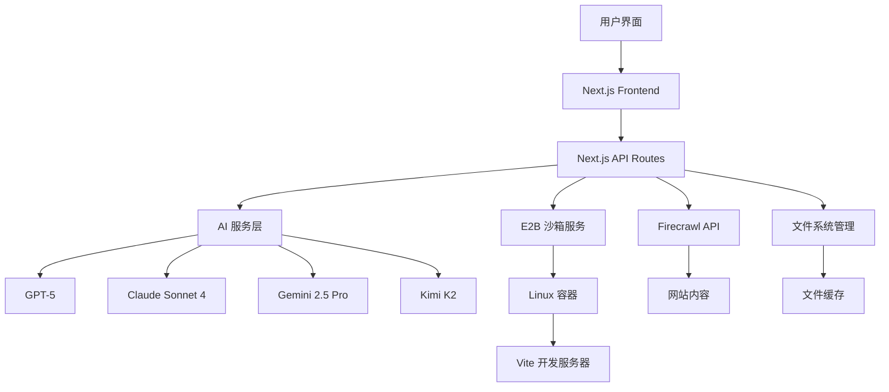

# Open Lovable - 架构总览

## 项目概述

Open Lovable 是一个由 Firecrawl 团队开发的 AI 驱动的 React 应用生成平台。它允许用户通过自然语言对话来构建 React 应用，利用 E2B 沙箱环境提供实时的代码执行和预览功能。

## 核心特性

- **AI 代码生成**：支持多种 AI 模型（GPT-5, Claude Sonnet 4, Gemini 2.5 Pro, Kimi K2）
- **实时沙箱环境**：基于 E2B 的安全代码执行环境
- **网站爬取与克隆**：使用 Firecrawl API 进行网站内容爬取
- **智能包管理**：自动检测和安装依赖包
- **实时预览**：Vite 开发服务器集成，提供热重载
- **对话式界面**：保持上下文的 AI 对话体验

## 技术栈

### 前端技术栈
- **框架**：Next.js 15.4.3 (React 19)
- **样式**：Tailwind CSS 4.1.11
- **UI 组件**：Radix UI + 自定义组件
- **动画**：Framer Motion 12.23.12
- **状态管理**：React Hooks + 全局状态
- **代码高亮**：react-syntax-highlighter

### 后端技术栈
- **运行时**：Next.js API Routes
- **AI SDK**：AI SDK 5.0.0（支持多提供商）
- **沙箱环境**：E2B Code Interpreter 1.5.1
- **网站爬取**：Firecrawl API
- **类型系统**：TypeScript 5

### 开发工具
- **构建工具**：Turbopack
- **代码规范**：ESLint 9
- **包管理器**：npm

## 整体架构设计



## 目录结构解析

```
open-lovable/
├── app/                        # Next.js App Router
│   ├── api/                   # API 端点
│   │   ├── analyze-edit-intent/     # 编辑意图分析
│   │   ├── apply-ai-code/           # 代码应用
│   │   ├── create-ai-sandbox/       # 沙箱创建
│   │   ├── generate-ai-code-stream/ # 流式代码生成
│   │   ├── get-sandbox-files/       # 文件获取
│   │   ├── scrape-url-enhanced/     # 网站爬取
│   │   └── ...                     # 其他 API 端点
│   ├── globals.css            # 全局样式
│   ├── layout.tsx             # 根布局
│   └── page.tsx              # 主页面
├── components/                # React 组件
│   ├── ui/                   # UI 基础组件
│   ├── CodeApplicationProgress.tsx # 代码应用进度
│   ├── SandboxPreview.tsx    # 沙箱预览
│   └── HMRErrorDetector.tsx  # 热重载错误检测
├── config/                   # 配置文件
│   └── app.config.ts        # 应用配置
├── lib/                     # 工具库
│   ├── context-selector.ts   # 上下文选择器
│   ├── edit-intent-analyzer.ts # 编辑意图分析
│   ├── file-parser.ts       # 文件解析器
│   └── ...                  # 其他工具
├── types/                   # TypeScript 类型定义
│   ├── conversation.ts      # 对话类型
│   ├── file-manifest.ts     # 文件清单类型
│   └── sandbox.ts          # 沙箱类型
├── docs/                    # 项目文档
├── public/                  # 静态资源
└── test/                   # 测试文件
```

## 核心模块功能

### 1. AI 代码生成模块
- **多模型支持**：集成 4 种主流 AI 模型
- **流式响应**：实时代码生成和反馈
- **上下文感知**：维护对话历史和项目状态
- **智能编辑**：基于意图分析的精确代码修改

### 2. E2B 沙箱管理模块
- **沙箱生命周期**：创建、监控、销毁
- **文件系统操作**：读写、同步、缓存
- **Vite 集成**：自动配置开发服务器
- **错误处理**：完善的异常处理和恢复机制

### 3. 网站爬取与分析模块
- **Firecrawl 集成**：高质量网站内容提取
- **内容清理**：智能引号和特殊字符处理
- **缓存优化**：1小时缓存，提升 500% 性能
- **结构化数据**：提取标题、描述、内容

### 4. 包管理系统
- **自动检测**：从代码中检测依赖
- **智能安装**：去重和错误处理
- **Vite 重启**：安装后自动重启开发服务器
- **状态跟踪**：详细的安装状态反馈

### 5. 文件系统管理
- **智能缓存**：全局文件状态管理
- **实时同步**：沙箱与本地状态同步
- **类型感知**：自动识别组件、样式、配置文件
- **版本控制**：文件修改历史跟踪

## 技术架构亮点

### 1. 模块化设计
- **松耦合架构**：各模块独立，易于维护和扩展
- **统一接口**：标准化的 API 设计模式
- **配置驱动**：集中化配置管理

### 2. 性能优化
- **流式处理**：大幅提升用户体验
- **智能缓存**：多层缓存策略
- **异步架构**：非阻塞操作

### 3. 容错设计
- **优雅降级**：服务异常时的备选方案
- **自动恢复**：沙箱和服务的自愈能力
- **详细日志**：完善的错误追踪和调试

### 4. 扩展性
- **插件化 AI 模型**：易于添加新的 AI 提供商
- **可配置沙箱**：支持不同的运行环境
- **模块化组件**：可复用的前端组件库

## 安全考虑

### 1. 沙箱隔离
- **容器化执行**：E2B 提供的安全隔离环境
- **资源限制**：CPU、内存、网络访问限制
- **时间限制**：15分钟自动销毁机制

### 2. API 安全
- **环境变量**：敏感信息环境变量管理
- **请求验证**：输入参数验证和清理
- **错误处理**：避免敏感信息泄露

### 3. 内容安全
- **输入清理**：智能引号和特殊字符处理
- **XSS 防护**：前端渲染安全措施
- **CORS 配置**：跨域请求安全控制

## 部署架构

### 开发环境
- **本地开发**：Turbopack + 热重载
- **API Mock**：本地 API 服务模拟
- **调试工具**：详细的控制台日志

### 生产环境
- **Vercel 部署**：自动化 CI/CD
- **环境隔离**：生产/测试环境分离
- **监控告警**：性能和错误监控

## 扩展路径

### 短期优化
1. **性能提升**：代码生成速度优化
2. **用户体验**：界面响应性改进
3. **错误处理**：更友好的错误提示

### 中期扩展
1. **多语言支持**：Vue.js、Svelte 等框架
2. **模板系统**：预设项目模板
3. **协作功能**：团队共享和协作

### 长期规划
1. **插件生态**：第三方插件市场
2. **企业版本**：私有部署和定制化
3. **AI 训练**：基于用户数据的模型优化

## 总结

Open Lovable 通过巧妙地结合 AI 代码生成、沙箱执行环境和现代 Web 技术，创造了一个强大且易用的 React 应用开发平台。其模块化的架构设计不仅确保了系统的稳定性和性能，也为未来的功能扩展提供了良好的基础。